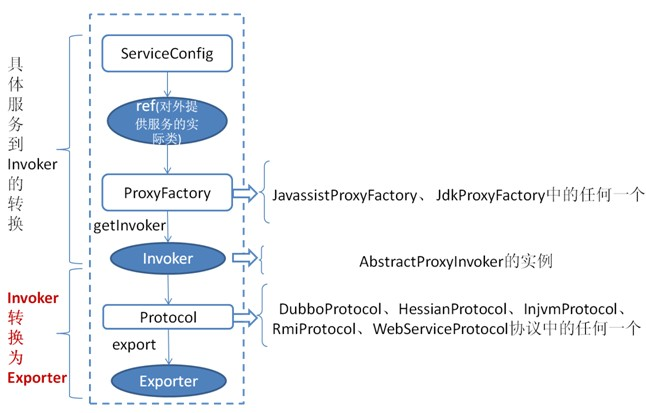
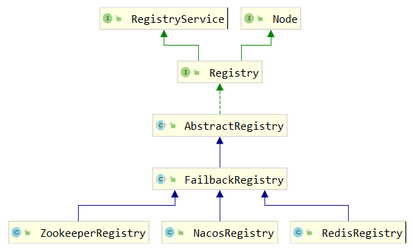

> 第四部分 Dubbo源码剖析

# 1 源码下载和编译

1. dubbo 的项目在 github 中的地址为 ：https://github.com/apache/dubbo
2. 进行需要进行下载的目录，执行 `git clone https://github.com/apache/dubbo.git`
3. 为了防止 master 中的代码不稳定，进入 dubbo 项目 `cd dubbo` 可以及切换到 2.7.6 分支 `git checkout 2.7.6`
4. 进行本地编译，进入 dubbo 项目 `cd dubbo`，进行编译操作 `mvn clean install -DskipTests`
5. 使用 IDE 引入项目。


# 2 架构整体设计

[Dubbo 框架设计-官网说明](https://dubbo.apache.org/zh/docsv2.7/dev/design/)

## 2.1 Dubbo 调用关系说明


在这里主要由四部分组成：

1. Provider：暴露服务的服务提供方
   - Protocol：负责提供者 和 消费者 之间协议交互数据。
   - Service：真实的业务服务信息，可以理解成接口 和 实现。
   - Container：Dubbo 的运行环境。
2. Consumer：调用远程服务的服务消费方
   - Protocol：负责提供者 和 消费者 之间协议交互数据。
   - Cluster：感知提供者端的列表信息。
   - Proxy：可以理解成 提供者的服务调用代理类，由它接管 Consumer 中的接口调用逻辑。
3. Register：注册中心。用于作为服务发现 和 路由配置等工作，提供者和消费者都会在这里进行注册。
4. Monitot：用于提供者和消费者中的数据统计，比如调用频次，成功失败次数等信息。


**启动 和 执行流程说明**：

提供者端启动，容器负责把 Service 信息加载，并通过 Protocol 注册到注册中心；

消费者端启动，通过监听提供者列表来感知提供者信息，并在提供者发生改变时，通过注册中心及时通知消费端；

消费方发起请求，通过 Proxy 模块；

利用 Cluster 模块，来选择真实的要发送给的提供者信息；

交由 Consumer 中的 Protocol 把信息发送给提供者；

提供者同样需要通过 Protocol 模块来处理消费者的信息；

最后由真正的服务提供者 Service 来进行处理。

## 2.2 整体调用链路


说明：淡绿色代表了 服务生产者的范围；淡蓝色 代表 服务消费者的范围；红色箭头代表了调用的方向。

业务逻辑层：RPC层（远程过程调用） Remoting（远程数据传输）

整体链路调用的流程：

1. 消费者通过 Interface 进行方法调用，统一交由消费端的 Proxy，通过 ProxyFactory 来进行代理对象的创建，使用到了 jdk、javassist 技术。
2. 交给 Filter 这个模块，做一个统一的过滤请求，在 SPI 案例中涉及过。
3. 接下来会进入最主要的 Invoker 调用逻辑。
   - 通过 Directory 去配置中新读取信息，最终通过 list 方法获取所有的 Invoker
   - 通过 Cluster 模块，根据选择的具体路由规则，来选取 Invoker 列表
   - 通过 LoadBalance 模块，根据负载均衡策略，选择一个具体的 Invoker 来处理我们的请求
   - 如果执行中出现错误，并且 Consumer 阶段配置了重试机制，则会重新尝试执行。
4. 继续经过 FIlter ，进行执行功能的前后封装，Invoker 选择具体的执行协议
5. 客户端 进行编码 和 序列化，然后发送数据
6. 到达 Provider 中的 Server，在这里进行反编码 和 反序列化 的接收数据
7. 使用 Exporter 选择执行执行器
8. 交给 Filter 进行一个提供者端的过滤，到达 Invoker 执行器
9. 通过 Invoker 调用接口的具体实现，然后返回

## 2.3 Dubbo源码整体设计


图例说明：

- 图中左边淡蓝背景 的为 服务消费方使用的接口；右边淡绿色背景的为服务提供方使用的接口；位于中轴线上的为双方都用到的接口。
- 图中从下至上分为 十层，各层均为单向依赖，右边的黑色箭头代表层之间的依赖关系，每一层都可以剥离上层被复用。其中 ，Service 和 Config 层为 API，其它各层均为 SPI。
- 图中绿色小块的为扩展接口，蓝色小块为实现类，图中只显示用于关联各层的实现类。
- 图中蓝色虚线为初始化过程，即启动时组装链；红色实线为方法调用过程，即运行时调用链；紫色三角箭头为继承，可以把子类看作父类的同一个节点，线上的文字为调用的方法。


### 2.3.1 分层介绍

[各层说明-官网说明](https://dubbo.apache.org/zh/docsv2.7/dev/design/#%E5%90%84%E5%B1%82%E8%AF%B4%E6%98%8E)

# 3 服务注册与消费源码剖析

## 3.1 注册中心 Zookeeper 剖析

[Zookeeper注册中心参考手册-官网说明](https://dubbo.apache.org/zh/docsv2.7/user/references/registry/zookeeper/)

注册中心是 Dubbo 的重要组成部分，主要用于服务的注册与发现，可以选择 Redis、Nacos、Zookeeper 作为 Dubbo 的注册中心，Dubbo 推荐用户使用 Zookeeper 作为注册中心。

### 3.1.1 注册中心 Zookeeper 目录结构

使用一个最基本的服务注册与消费的 Demo 来进行说明。

例如：只有一个提供者和消费者。`com.turbo.service.HelloService` 为所提供的服务。

```java
public interface HelloService {
    String sayHello(String name);
}
```

则 Zookeeper 的目录结构如下：


- 可以在这里看到所有的都是在 dubbo 层级下的；
- dubbo 根节点下面是当前所拥有的接口名称，如果有多个接口，则会以多个子节点的形式展开；
- 每个服务下面有分别有四个配置项
  - consumers：当前服务下面所有的消费者列表（URL）
  - providers：当前服务下面所有的提供者列表（URL）
  - configurators：当前服务下面的配置信息，provider 或者 consumer 会通过读取这里的配置信息来获取配置
  - routers：当消费者在进行获取提供者时，会通过这里配置好的路由来进行适配匹配规则
- 可以看到，dubbo基本上很多时候都是通过 URL 的形式来进行交互获取数据的，在 URL 中也会保存很多的信息。后面也会对 URL 的规则做详细介绍。


通过这张图我们可以了解到如下信息：

- 提供者会在 `providers` 目录下进行自身的注册。
- 消费者会在 `consumers` 目录下进行自身注册，并且监听 `providers` 目录，以此通过监听提供者的变化，实现服务发现。
- Monitor 模块会对整个服务级别做监听，用来得知整体的服务情况。以此就能更多的对整体情况做监控。


## 3.2 服务注册过程分析

[服务注册（暴露）过程](https://dubbo.apache.org/zh/docsv2.7/dev/implementation/#%E6%9C%8D%E5%8A%A1%E6%8F%90%E4%BE%9B%E8%80%85%E6%9A%B4%E9%9C%B2%E4%B8%80%E4%B8%AA%E6%9C%8D%E5%8A%A1%E7%9A%84%E8%AF%A6%E7%BB%86%E8%BF%87%E7%A8%8B)



首先 `ServiceConfig` 类拿到对外提供服务的实际类 ref（如：HelloServiceImpl），然后通过 `ProxyFactory` 接口实现类中的 `getInvoker` 方法使用 ref 生成一个 `AbstractProxyInvoker` 实例，到这一步就完成具体服务到 `Invoker` 的转化。接下来就是 `Invoker` 转换到 `Exporter` 的过程。


查看 ServiceConfig 类：重点查看 ProxyFactory 和 Protocol 类型的属性，以及 ref。


下面我们就看一下 Invoker  转换成 Exporter 的过程：

其中会涉及到 RegistryService 接口、`RegistryFactory` 接口 和 注册 provider 到注册中心流程的过程。

1. RegistryService 代码解读，这里的代码比较简单，主要是对指定的路径进行注册、解绑、监听 和 取消监听、查询操作。也是注册中心最为基础的类。

   ```java
   package org.apache.dubbo.registry;
   
   import org.apache.dubbo.common.URL;
   
   import java.util.List;
   
   public interface RegistryService {
   
       /**
        * 进行对 URL的注册操作,比如: provider service, consumer address, route rule, override rule and other data.
        */
       void register(URL url);
   
       /**
        * 解除对指定URL的注册，比如provider，consumer，routers等
        */
       void unregister(URL url);
   
       /**
        * 增加对指定URL的路径监听，当有变化的时候进行通知操作
        */
       void subscribe(URL url, NotifyListener listener);
   
       /**
        * 解除对指定 URL 的路径监听，取消指定的listener
        */
       void unsubscribe(URL url, NotifyListener listener);
   
       /**
        * 查询指定URL下面的URL列表，比如查询指定服务下面的consumer列表
        */
       List<URL> lookup(URL url);
   
   }
   ```

2. 再来看 `RegistryFactory`，是通过它来生成真实的注册中心。通过这种方式，也可以保证一个应用中可以使用多个注册中心。可以看到这里也是通过不同的 protocol 参数，来选择不同的协议。

   ```java
   package org.apache.dubbo.registry;
   
   import org.apache.dubbo.common.URL;
   import org.apache.dubbo.common.extension.Adaptive;
   import org.apache.dubbo.common.extension.SPI;
   
   
   @SPI("dubbo")
   public interface RegistryFactory {
       /**
        * 获取注册中心地址
        */
       @Adaptive({"protocol"})
       Registry getRegistry(URL url);
   }
   ```

3. 下面就来跟踪一下，一个服务是如何注册到注册中心上去的。其中比较关键的一个类是 `RegistryProtocol`，它负责管理整个注册中心相关的协议，并且统一对外提供服务。这里我们主要以 `RegistryProtocol#export` 方法作为入口，这个方法主要的作用就是将我们需要执行的信息注册并且导出。

   ```java
   @Override
   public <T> Exporter<T> export(final Invoker<T> originInvoker) throws RpcException {
       // 获取注册中心的地址
       // zookeeper://152.136.177.192:2181/org.apache.dubbo.registry.RegistryService?application=service-provider&dubbo=2.0.2&export=dubbo%3A%2F%2F192.168.56.1%3A20880%2Fcom.turbo.service.HelloService%3Fanyhost%3Dtrue%26application%3Dservice-provider%26bind.ip%3D192.168.56.1%26bind.port%3D20880%26deprecated%3Dfalse%26dubbo%3D2.0.2%26dynamic%3Dtrue%26generic%3Dfalse%26interface%3Dcom.turbo.service.HelloService%26methods%3DsayHello%26pid%3D12816%26qos.accept.foreign.ip%3Dfalse%26qos.enable%3Dtrue%26qos.port%3D33333%26release%3D2.7.6%26side%3Dprovider%26timestamp%3D1659586078756&pid=12816&qos.accept.foreign.ip=false&qos.enable=true&qos.port=33333&release=2.7.6&timeout=60000&timestamp=1659586078724
       URL registryUrl = getRegistryUrl(originInvoker);
       // 获取当前提供者需要注册的地址
       // dubbo://192.168.56.1:20880/com.turbo.service.HelloService?anyhost=true&application=service-provider&bind.ip=192.168.56.1&bind.port=20880&deprecated=false&dubbo=2.0.2&dynamic=true&generic=false&interface=com.turbo.service.HelloService&methods=sayHello&pid=12816&qos.accept.foreign.ip=false&qos.enable=true&qos.port=33333&release=2.7.6&side=provider&timestamp=1659586078756
       URL providerUrl = getProviderUrl(originInvoker);
   
       // 获取进行注册 override协议的访问地址
       // provider://192.168.56.1:20880/com.turbo.service.HelloService?anyhost=true&application=service-provider&bind.ip=192.168.56.1&bind.port=20880&category=configurators&check=false&deprecated=false&dubbo=2.0.2&dynamic=true&generic=false&interface=com.turbo.service.HelloService&methods=sayHello&pid=12816&qos.accept.foreign.ip=false&qos.enable=true&qos.port=33333&release=2.7.6&side=provider&timestamp=1659586078756
       final URL overrideSubscribeUrl = getSubscribedOverrideUrl(providerUrl);
       // 增加override的监听器
       final OverrideListener overrideSubscribeListener = new OverrideListener(overrideSubscribeUrl, originInvoker);
       overrideListeners.put(overrideSubscribeUrl, overrideSubscribeListener);
   
       // 根据现有的override协议，对注册地址进行改写操作
       providerUrl = overrideUrlWithConfig(providerUrl, overrideSubscribeListener);
       // 对当前的服务进行本地导出
       // 完成后即可以看到本地的20880端口已经启动，并且暴露服务
       final ExporterChangeableWrapper<T> exporter = doLocalExport(originInvoker, providerUrl);
   
       // 获取真实的注册中心，比如我们常用的 ZookeeperRegistry
       final Registry registry = getRegistry(originInvoker);
       // 获取当前服务需要注册到注册中心的 providerURL，主要用于去除一些没有必要的参数（比如在本地导出时所使用的 qos 参数等值）
       // dubbo://192.168.56.1:20880/com.turbo.service.HelloService?anyhost=true&application=service-provider&deprecated=false&dubbo=2.0.2&dynamic=true&generic=false&interface=com.turbo.service.HelloService&methods=sayHello&pid=12816&release=2.7.6&side=provider&timestamp=1659586078756
       final URL registeredProviderUrl = getUrlToRegistry(providerUrl, registryUrl);
       ProviderInvokerWrapper<T> providerInvokerWrapper = ProviderConsumerRegTable.registerProvider(originInvoker,
                                                                                                    registryUrl, registeredProviderUrl);
       // 获取当前url是否需要进行注册参数
       boolean register = registeredProviderUrl.getParameter(REGISTER_KEY, true);
       if (register) {
           // 将当前的提供住注册到注册中心上去
           register(registryUrl, registeredProviderUrl);
       }
   
       // 对override协议进行注册，用于在接收到overrider请求时做适配，这种方式用于适配2.6.x 及之前的版本(混用)
       registry.subscribe(overrideSubscribeUrl, overrideSubscribeListener);
   
       // 设置当前导出中的相关信息
       exporter.setRegisterUrl(registeredProviderUrl);
       exporter.setSubscribeUrl(overrideSubscribeUrl);
       // 返回导出对象（对数据进行封装）
       return new DestroyableExporter<>(exporter);
   }
   ```

4. 下面再来看看 `register` 方法，这里面做的比较简单，主要是从 `RegistoryFactory` 中获取注册中心，并且进行地址注册。

   ```java
   public void register(URL registryUrl, URL registeredProviderUrl) {
       // 获取注册中心
       Registry registry = registryFactory.getRegistry(registryUrl);
       // 对当前的服务进行注册
       registry.register(registeredProviderUrl);
   
       // ProviderModel 表示服务提供者模型，此对象中存储了与服务提供者相关的信息。
       // 比如服务的配置信息，服务实例等。每个被导出的服务对应一个 ProviderModel
       ProviderModel model = ApplicationModel.getProviderModel(registeredProviderUrl.getServiceKey());
       model.addStatedUrl(new ProviderModel.RegisterStatedURL(
           registeredProviderUrl,
           registryUrl,
           true
       ));
   }
   ```

5. 这里我们在跟里面的 `register` 方法之前，先来介绍一下 Registry 中的类目录结构

   

   目录结构描述如下：

   - 在这里每个层级代表继承自父级。
   - 这里面 `RegistryService` 就是我们之前所讲对外提供注册机制的接口。
   - 其下面 `Registry` 也同样是一个接口，是对 `RegistryService` 的集成，并且继承了 `Node` 接口，说明注册中心也是基于 URL 去做的。
   - `AbstractRegistry` 是对注册中心的封装，其主要会对本地注册地址进行缓存，主要功能在于远程注册中心不可用的时候，可以采用本地的注册中心来使用。
   - `FailbackRegistry` 从名字中可以看出来，失败自动恢复，后台记录失败请求，定时重发功能。
   - 最深的一层则更多是真实的第三方渠道实现。

6. 下面我们来看一下在 `FailbackRegistry` 中的实现，可以在这里看到它的主要作用是调用第三方的实现方式，并且在出现错误的时候增加重试机制。

   ```java
   @Override
   public void register(URL url) {
       if (!acceptable(url)) {
           logger.info("URL " + url + " will not be registered to Registry. Registry " + url + " does not accept service of this protocol type.");
           return;
       }
       // 上层调用
       // 主要用于保存已经注册的地址列表
       super.register(url);
       // 将一些错误的信息移除(确保当前地址可以在出现一些错误的地址时可以被删除)
       removeFailedRegistered(url);
       removeFailedUnregistered(url);
       try {
           // 发送给第三方渠道进行注册操作
           doRegister(url);
       } catch (Exception e) {
           Throwable t = e;
   
           // 记录日志
           boolean check = getUrl().getParameter(Constants.CHECK_KEY, true)
               && url.getParameter(Constants.CHECK_KEY, true)
               && !CONSUMER_PROTOCOL.equals(url.getProtocol());
           boolean skipFailback = t instanceof SkipFailbackWrapperException;
           if (check || skipFailback) {
               if (skipFailback) {
                   t = t.getCause();
               }
               throw new IllegalStateException("Failed to register " + url + " to registry " + getUrl().getAddress() + ", cause: " + t.getMessage(), t);
           } else {
               logger.error("Failed to register " + url + ", waiting for retry, cause: " + t.getMessage(), t);
           }
   
           // 后台异步进行重试，也是Failback比较关键的代码
           addFailedRegistered(url);
       }
   }
   ```

7. 下面我们再来看看 Zookeeper 中的 `doRegister` 方法的实现，可以看到这里的实现也比较简单，关键在于 `toUrlPath` 方法的实现。关于 `dynamic` 的值，我们也在上面有看到，它的 URL 也是 也是 true。

   ```java
   @Override
   public void doRegister(URL url) {
       try {
           // 进行创建地址
           zkClient.create(toUrlPath(url), url.getParameter(DYNAMIC_KEY, true));
       } catch (Throwable e) {
           throw new RpcException("Failed to register " + url + " to zookeeper " + getUrl() + ", cause: " + e.getMessage(), e);
       }
   }
   ```

8. 解读 `toUrlPath` 方法。可以看到这里的实现也是比较简单，也验证了我们之前的路径规则。

   ```java
   private String toUrlPath(URL url) {
       // 分类地址 + url 字符串
       return toCategoryPath(url) + PATH_SEPARATOR + URL.encode(url.toFullString());
   }
   
   private String toCategoryPath(URL url) {
       // 服务名称 + category(在当前的例子中是 providers)
       return toServicePath(url) + PATH_SEPARATOR + url.getParameter(CATEGORY_KEY, DEFAULT_CATEGORY);
   }
   
   private String toServicePath(URL url) {
       // 接口地址
       String name = url.getServiceInterface();
       if (ANY_VALUE.equals(name)) {
           return toRootPath();
       }
       // 根节点+接口地址
       return toRootDir() + URL.encode(name);
   }
   ```


## 3.3 URL 规则详解 和 服务本地缓存

### 3.3.1 URL 规则详解

URL 地址如下：

```bash
protocol://host:port/path?key=value&key=value

provider://192.168.56.1:20880/com.turbo.service.HelloService?anyhost=true&application=service-provider&bind.ip=192.168.56.1&bind.port=20880&category=configurators&check=false&deprecated=false&dubbo=2.0.2&dynamic=true&generic=false&interface=com.turbo.service.HelloService&methods=sayHello
```

URL 主要有以下几部分组成：

- protocol：协议，一般像我们的 `provider` 或者 `consumer` 在这里都是认为具体的协议
- host：当前 `provider` 或者其他协议所具体针对的地址，比较特殊的像 `override` 协议所指定的 host 就是 `0.0.0.0` 代表所有的机器都生效。
- port：代表处理的端口号。
- path：服务路径，在 `provider` 或者 `consumer` 等其他中代表我们真实的业务接口
- key=value：这些则代表具体的参数，这里我们可以理解为对这个地址的配置。比如我们 `provider` 中需要具体机器的服务应用名，就可以是一个配置的方式设置上去。

注意：Dubbo 中的 URL 与 java 中的 URL 是有一些区别的，如下：

- 这里提供了针对于参数的 `parameter` 的增加和减少（支持动态更改）
- 提供缓存功能，对一些基础的数据做缓存。


### 3.3.2 服务本地缓存

dubbo 调用者需要通过注册中心（如：ZK）注册信息，获取提供者。但是如果频繁从 ZK 获取信息，肯定会存在单点故障问题，所以 dubbo 提供了将提供者信息缓存在本地的方法。

Dubbo 在订阅注册中心的回调处理逻辑当中会保存服务提供者信息到本地缓存文件当中（同步/异步两种方式），以 URL 维度进行全量保存。

Dubbo 在服务引用过程中会创建 registry 对象并加载本地缓存文件，会优先订阅注册中心，订阅注册中心失败后会访问本地缓存文件内容获取服务提供信息。

1. 首先从构造方法讲起，这里比较简单，主要用于确定需要保存的文件信息。并且从系统中读取已有的配置信息。

   ```java
   public AbstractRegistry(URL url) {
       setUrl(url);
       if (url.getParameter(REGISTRY__LOCAL_FILE_CACHE_ENABLED, true)) {
           // Start file save timer
           syncSaveFile = url.getParameter(REGISTRY_FILESAVE_SYNC_KEY, false);
           // 默认保存路径(home/.dubbo/dubbo-registry-appName-address-port.cache)
           String defaultFilename = System.getProperty("user.home") + "/.dubbo/dubbo-registry-" + url.getParameter(APPLICATION_KEY) + "-" + url.getAddress().replaceAll(":", "-") + ".cache";
           String filename = url.getParameter(FILE_KEY, defaultFilename);
           // 创建文件
           File file = null;
           if (ConfigUtils.isNotEmpty(filename)) {
               file = new File(filename);
               if (!file.exists() && file.getParentFile() != null && !file.getParentFile().exists()) {
                   if (!file.getParentFile().mkdirs()) {
                       throw new IllegalArgumentException("Invalid registry cache file " + file + ", cause: Failed to create directory " + file.getParentFile() + "!");
                   }
               }
           }
           this.file = file;
           // 加载已有的配置文件
           loadProperties();
           notify(url.getBackupUrls());
       }
   }
   ```

2. 我们可以看到这个类中最为关键的一个属性为 `properties`，通过寻找，得到这个属性的设置只有在一个地方：`saveProperties`，看一下这个方法，这里也有一个我们值得关注的点，就是基于版本号的更改。

   ```java
   private void saveProperties(URL url) {
       if (file == null) {
           return;
       }
   
       try {
           StringBuilder buf = new StringBuilder();
           // 获取所有通知到的地址
           Map<String, List<URL>> categoryNotified = notified.get(url);
           if (categoryNotified != null) {
               for (List<URL> us : categoryNotified.values()) {
                   for (URL u : us) {
                       // 多个地址进行拼接
                       if (buf.length() > 0) {
                           buf.append(URL_SEPARATOR);
                       }
                       buf.append(u.toFullString());
                   }
               }
           }
           // 保存数据
           properties.setProperty(url.getServiceKey(), buf.toString());
           // 保存为一个新的版本号
           // 通过这种机制可以保证后面保存的记录，在重试的时候，不会重试之前的版本
           long version = lastCacheChanged.incrementAndGet();
           // 需要同步保存则进行保存
           if (syncSaveFile) {
               doSaveProperties(version);
           } else {
               // 否则 异步进行处理
               registryCacheExecutor.execute(new SaveProperties(version));
           }
       } catch (Throwable t) {
           logger.warn(t.getMessage(), t);
       }
   }
   ```

3. 下面我们再来看看是如何进行保存文件的。这里的实现也比较简单，主要比较关键的代码在于利用文件级锁来保证同一时间只会有一个线程执行。

   ```java
   public void doSaveProperties(long version) {
       if (version < lastCacheChanged.get()) {
           return;
       }
       if (file == null) {
           return;
       }
       // Save
       try {
           // 使用文件级别锁，来保证同一段时间只会有一个线程进行读取操作
           File lockfile = new File(file.getAbsolutePath() + ".lock");
           if (!lockfile.exists()) {
               lockfile.createNewFile();
           }
           try (RandomAccessFile raf = new RandomAccessFile(lockfile, "rw");
                FileChannel channel = raf.getChannel()) {
               // 利用文件锁来保证并发的执行的情况下，只会有一个线程执行成功(原因在于可能是跨VM的)
               FileLock lock = channel.tryLock();
               if (lock == null) {
                   throw new IOException("Can not lock the registry cache file " + file.getAbsolutePath() + ", ignore and retry later, maybe multi java process use the file, please config: dubbo.registry.file=xxx.properties");
               }
               // Save
               try {
                   if (!file.exists()) {
                       file.createNewFile();
                   }
                   // 将配置的文件信息保存到文件中
                   try (FileOutputStream outputFile = new FileOutputStream(file)) {
                       properties.store(outputFile, "Dubbo Registry Cache");
                   }
               } finally {
                   // 解开文件锁
                   lock.release();
               }
           }
       } catch (Throwable e) {
           // 执行出现错误，则交给专门的线程去进行重试
           savePropertiesRetryTimes.incrementAndGet();
           if (savePropertiesRetryTimes.get() >= MAX_RETRY_TIMES_SAVE_PROPERTIES) {
               logger.warn("Failed to save registry cache file after retrying " + MAX_RETRY_TIMES_SAVE_PROPERTIES + " times, cause: " + e.getMessage(), e);
               savePropertiesRetryTimes.set(0);
               return;
           }
           if (version < lastCacheChanged.get()) {
               savePropertiesRetryTimes.set(0);
               return;
           } else {
               registryCacheExecutor.execute(new SaveProperties(lastCacheChanged.incrementAndGet()));
           }
           logger.warn("Failed to save registry cache file, will retry, cause: " + e.getMessage(), e);
       }
   }
   ```


## 3.4 Dubbo 消费过程分析

[服务消费者消费一个服务的详细过程](https://dubbo.apache.org/zh/docsv2.7/dev/implementation/#%E6%9C%8D%E5%8A%A1%E6%B6%88%E8%B4%B9%E8%80%85%E6%B6%88%E8%B4%B9%E4%B8%80%E4%B8%AA%E6%9C%8D%E5%8A%A1%E7%9A%84%E8%AF%A6%E7%BB%86%E8%BF%87%E7%A8%8B)


首先 `ReferenceConfig`  类的 `init` 方法调用 `Protocol` 的 `refer` 方法生成 `Invoker` 实例（如上图中的红色部分），这是服务消费的关键。接下来把 `Invoker` 转换为客户端需要的接口（如：HelloService）。

# 4 Dubbo 扩展 SPI 源码剖析

[Dubbo SPI源码分析-官网说明](https://dubbo.apache.org/zh/docsv2.7/dev/source/dubbo-spi/#3-dubbo-spi-%E6%BA%90%E7%A0%81%E5%88%86%E6%9E%90)

Dubbo SPI 中最重要的类就是 `org.apache.dubbo.common.extension.ExtensionLoader`，它是所有 Dubbo 中 SPI 的入口。

我们通过分析源码来想学习 `ExtensionLoader` 是怎么加载的。这里会具体介绍 `org.apache.dubbo.common.extension.ExtensionLoader#getExtensionLoader` 和 `org.apache.dubbo.common.extension.ExtensionLoader#getExtension` 方法。

getExtensionLoader：获取扩展点加载器，并加载所对应的所有扩展点的实现

getExtension：根据 name 获取扩展点的指定实现

## 4.1 getExtensionLoader 加载过程

1. 是如何进行实例化 `ExtensionLoader` 的

   ```java
   // org.apache.dubbo.common.extension.ExtensionLoader#getExtensionLoader
   @SuppressWarnings("unchecked")
   public static <T> ExtensionLoader<T> getExtensionLoader(Class<T> type) {
       // 必须传入类型
       if (type == null) {
           throw new IllegalArgumentException("Extension type == null");
       }
       // 必须是接口类型
       if (!type.isInterface()) {
           throw new IllegalArgumentException("Extension type (" + type + ") is not an interface!");
       }
       // 必须包含SPI注解
       if (!withExtensionAnnotation(type)) {
           throw new IllegalArgumentException("Extension type (" + type +
                                              ") is not an extension, because it is NOT annotated with @" + SPI.class.getSimpleName() + "!");
       }
   	// 尝试从已经加载过的数据中去读取(缓存功能)
       ExtensionLoader<T> loader = (ExtensionLoader<T>) EXTENSION_LOADERS.get(type);
       if (loader == null) {
           // 如果没有的话，才会进行初始化，并且放入到缓存中汇总
           EXTENSION_LOADERS.putIfAbsent(type, new ExtensionLoader<T>(type));
           loader = (ExtensionLoader<T>) EXTENSION_LOADERS.get(type);
       }
       return loader;
   }
   
   private static <T> boolean withExtensionAnnotation(Class<T> type) {
       // 包含 @SPI 注解在接口上
       return type.isAnnotationPresent(SPI.class);
   }
   ```

2. 具体看一下 `ExtensionLoader` 的构造器函数，这里它的实现比较简单，并没有做太多的操作。主要是对type进行赋值操作，然后获取 `ExtensionFactory` 对象。

   ```java
   private ExtensionLoader(Class<?> type) {
       this.type = type;
       // 这里需要对 对象的工厂做额外的创建，可以看到扩展的工厂也是一个扩展点
       objectFactory = (type == ExtensionFactory.class ? null : ExtensionLoader.getExtensionLoader(ExtensionFactory.class).getAdaptiveExtension());
   }
   ```

3. 具体再来关注一下 `ExtensionFactory` 是做什么用的，从这里我们可以大概的看出，它是通过传入 扩展点的类型 和真正的名称 来获取扩展的。这里就和我们 SPI 中的具体名称实现相挂钩。

   ```java
   @SPI
   public interface ExtensionFactory {
   
       /**
        * Get extension.
        *
        * @param type object type.
        * @param name object name.
        * @return object instance.
        */
       <T> T getExtension(Class<T> type, String name);
   
   }
   ```

4. 可以在 `dubbo-common/src/main/resources/META-INF/dubbo/internal/com.alibaba.dubbo.common.extension.ExtensionFactory` 中看到，它默认有三个实现的提供：

   ```properties
   spring=org.apache.dubbo.config.spring.extension.SpringExtensionFactory
   adaptive=org.apache.dubbo.common.extension.factory.AdaptiveExtensionFactory
   spi=org.apache.dubbo.common.extension.factory.SpiExtensionFactory
   ```

5. 可以看到在 `AdaptiveExtensionFactory` 中是使用 `@Adaptive` 标记的。这里可以通过类名基本看出来，它其实最主要的作用是进行代理其他的 ExtensionFactory。其中比较重要的方法在于 `getSupportedExtensions` 方法，获取所有支持的扩展信息实现。

   ```java
   @Adaptive
   public class AdaptiveExtensionFactory implements ExtensionFactory {
   
       private final List<ExtensionFactory> factories;
   
       public AdaptiveExtensionFactory() {
           // 获取针对 ExtensionFactory 扩展加载器
           ExtensionLoader<ExtensionFactory> loader = ExtensionLoader.getExtensionLoader(ExtensionFactory.class);
           List<ExtensionFactory> list = new ArrayList<ExtensionFactory>();
           // 获取支持的扩展
           for (String name : loader.getSupportedExtensions()) {
               // 将所有的 ExtensionFactory 进行缓存
               list.add(loader.getExtension(name));
           }
           factories = Collections.unmodifiableList(list);
       }
   
       @Override
       public <T> T getExtension(Class<T> type, String name) {
           for (ExtensionFactory factory : factories) {
               // 交给每个真实的 ExtensionFactory 来处理
               T extension = factory.getExtension(type, name);
               if (extension != null) {
                   return extension;
               }
           }
           return null;
       }
   
   }
   ```

6. 获取所有支持的扩展信息实现：`ExtensionLoader#getSupportedExtensions`，这里可以看到，其实比较关键的方法在于 `getExtensionClasses` 方法。

   ```java
   public Set<String> getSupportedExtensions() {
       // 获取所有的扩展信息
       Map<String, Class<?>> clazzes = getExtensionClasses();
       // 返回所有的扩展点名称
       return Collections.unmodifiableSet(new TreeSet<>(clazzes.keySet()));
   }
   ```

7. 观察 `getExtensionClasses` 的实现，可以看到这里其实主要做的就是一件事，防止重复被加载，所以真正的实现还需要专门去看 `loadExtensionClasses` 方法。

   在我们通过名称获取扩展类之前，首先需要根据配置文件解析出扩展类名称 到 扩展类的映射表 classes，之后再根据扩展项名称，从映射关系表中获取对应的扩展类即可。

   ```java
   private Map<String, Class<?>> getExtensionClasses() {
       // 从缓存中获取已加载的扩展类
       Map<String, Class<?>> classes = cachedClasses.get();
       // 双重检查
       if (classes == null) {
           // 为空的话，则锁住，表示只会被执行一次
           synchronized (cachedClasses) {
               classes = cachedClasses.get();
               if (classes == null) {
                   // 进行加载信息，加载扩展类
                   classes = loadExtensionClasses();
                   cachedClasses.set(classes);
               }
           }
       }
       return classes;
   }
   ```

8. 观察 `loadExtensionClasses` 方法实现。这里主要做了两件事情：

   - 加载当前 SPI 的默认实现；
   - 加载这个类的所有扩展点实现，并且按照 name 和 Class 对象的形式存储；

   下面专门针对 `cacheDefaultExtensionName` 和 `loadDirectory` 方法做说明

   ```java
   private Map<String, Class<?>> loadExtensionClasses() {
       // 加载默认扩展的实现名称
       cacheDefaultExtensionName();
   
       // 获取其中每一种实现的名称和对应的classes
       // 具体的目录请参考下面的所有目录
       Map<String, Class<?>> extensionClasses = new HashMap<>();
   
       for (LoadingStrategy strategy : strategies) {
           loadDirectory(extensionClasses, strategy.directory(), type.getName(), strategy.preferExtensionClassLoader(), strategy.excludedPackages());
           loadDirectory(extensionClasses, strategy.directory(), type.getName().replace("org.apache", "com.alibaba"), strategy.preferExtensionClassLoader(), strategy.excludedPackages());
       }
   
       return extensionClasses;
   }
   ```

   观察 `cacheDefaultExtensionName` 方法实现。这里面的实现比较简单主要用于读取注解中value值，来获取到默认的名称。

   ```java
   private void cacheDefaultExtensionName() {
       // 获取当前类是否包含 SPI 注解，一般走到这里都是拥有这个注解的
       final SPI defaultAnnotation = type.getAnnotation(SPI.class);
       if (defaultAnnotation == null) {
           return;
       }
   
       // 来获取其 value 值，这个值主要的作用是设置这个SPI中的默认扩展名
       // 比如LoadBalance的默认实现是 random，就是通过这里进行设置
       String value = defaultAnnotation.value();
       if ((value = value.trim()).length() > 0) {
           String[] names = NAME_SEPARATOR.split(value);
           if (names.length > 1) {
               throw new IllegalStateException("More than 1 default extension name on extension " + type.getName()
                                               + ": " + Arrays.toString(names));
           }
           if (names.length == 1) {
               cachedDefaultName = names[0];
           }
       }
   }
   ```

   观察 `loadDirectory` 方法实现。这里的主要功能是从这个文件夹中寻找真正的文件列表，并且对其中的文件内容解析并且放入到 `extensionClasses` 这个 Map 中，具体解析文件的内容实现，还要参考 `loadResource` 实现。

   ```java
   private void loadDirectory(Map<String, Class<?>> extensionClasses, String dir, String type,
                                  boolean extensionLoaderClassLoaderFirst, String... excludedPackages) {
       // 文件名称规则：路径/包名.接口名
       String fileName = dir + type;
       try {
           // 寻找 classLoader 和 url 列表
           Enumeration<java.net.URL> urls = null;
           ClassLoader classLoader = findClassLoader();
   
           // try to load from ExtensionLoader's ClassLoader first
           // 如果需要的话，需要先从当前类的 ClassLoader 中寻找
           if (extensionLoaderClassLoaderFirst) {
               ClassLoader extensionLoaderClassLoader = ExtensionLoader.class.getClassLoader();
               if (ClassLoader.getSystemClassLoader() != extensionLoaderClassLoader) {
                   urls = extensionLoaderClassLoader.getResources(fileName);
               }
           }
   
           // 如果找不到任何url列表，则继续尝试去当前线程的ClassLoader中寻找
           if(urls == null || !urls.hasMoreElements()) {
               if (classLoader != null) {
                   urls = classLoader.getResources(fileName);
               } else {
                   urls = ClassLoader.getSystemResources(fileName);
               }
           }
           
           // 如果存在文件的话
           if (urls != null) {
               while (urls.hasMoreElements()) {
                   // 遍历每一个资源文件，并且进行加载资源信息到 extensionClasses，主要功能是读取文件内容
                   java.net.URL resourceURL = urls.nextElement();
                   loadResource(extensionClasses, classLoader, resourceURL, excludedPackages);
               }
           }
       } catch (Throwable t) {
           logger.error("Exception occurred when loading extension class (interface: " +
                        type + ", description file: " + fileName + ").", t);
       }
   }
   ```

9. 观察 `loadResource` 实现，主要是用于读取文件操作，并且将方法交由 `loadClass` 来加载类信息。加载类信息也是最重要的方法所在。

   ```java
   private void loadResource(Map<String, Class<?>> extensionClasses, ClassLoader classLoader,
                                 java.net.URL resourceURL, String... excludedPackages) {
       try {
           // 读取文件
           try (BufferedReader reader = new BufferedReader(new InputStreamReader(resourceURL.openStream(), StandardCharsets.UTF_8))) {
               String line;
               while ((line = reader.readLine()) != null) {
                   // 截取文件 # 前面的内容
                   final int ci = line.indexOf('#');
                   if (ci >= 0) {
                       line = line.substring(0, ci);
                   }
                   line = line.trim();
                   
                   // 如果有内容的话
                   if (line.length() > 0) {
                       try {
                           // 则进行加载key=value的形式数据
                           String name = null;
                           int i = line.indexOf('=');
                           if (i > 0) {
                               name = line.substring(0, i).trim();
                               line = line.substring(i + 1).trim();
                           }
                           if (line.length() > 0 && !isExcluded(line, excludedPackages)) {
                               // 对类信息进行加载操作
                               loadClass(extensionClasses, resourceURL, Class.forName(line, true, classLoader), name);
                           }
                       } catch (Throwable t) {
                           IllegalStateException e = new IllegalStateException("Failed to load extension class (interface: " + type + ", class line: " + line + ") in " + resourceURL + ", cause: " + t.getMessage(), t);
                           exceptions.put(line, e);
                       }
                   }
               }
           }
       } catch (Throwable t) {
           logger.error("Exception occurred when loading extension class (interface: " +
                        type + ", class file: " + resourceURL + ") in " + resourceURL, t);
       }
   }
   ```

10. 观察 `loadClass` 类的实现，可以看到这里是最终进行完成类映射的地方。

    ```java
    private void loadClass(Map<String, Class<?>> extensionClasses, java.net.URL resourceURL, Class<?> clazz, String name) throws NoSuchMethodException {
        // 当前扩展点的实现，必须是当前扩展接口的实现才可以
        if (!type.isAssignableFrom(clazz)) {
            throw new IllegalStateException("Error occurred when loading extension class (interface: " +
                                            type + ", class line: " + clazz.getName() + "), class "
                                            + clazz.getName() + " is not subtype of interface.");
        }
        // 如果是包含了 Adaptive 注解，则认为是需要对扩展点包装的方法，这里只做了存储操作，存储至 cachedAdaptiveClass 中
        if (clazz.isAnnotationPresent(Adaptive.class)) {
            cacheAdaptiveClass(clazz);
        } else if (isWrapperClass(clazz)) {
            // 判断是否是 wrapper 类型，是否构造函数中有该接口类型的传入
            // wrapper 类型的意思是，对当前的扩展点实现封装功能处理
            cacheWrapperClass(clazz);
        } else {
            clazz.getConstructor();
            // 寻找它是否已经定义过了名称，这里就不继续往里面细看了，主要是获取当前类的 org.apache.dubbo.common.Extension 注解，如果有的话就使用这个名称，否则的话就是用当前类的简单名称
            if (StringUtils.isEmpty(name)) {
                name = findAnnotationName(clazz);
                if (name.length() == 0) {
                    throw new IllegalStateException("No such extension name for the class " + clazz.getName() + " in the config " + resourceURL);
                }
            }
    
            // 否则的话，就对这个名称和class做映射
            String[] names = NAME_SEPARATOR.split(name);
            if (ArrayUtils.isNotEmpty(names)) {
                // 如果当前类拥有 Activate 注解，则将其进行添加到 cacheActivateClass 对象中，意味着需要执行
                cacheActivateClass(clazz, names[0]);
                // 进行名称映射保存
                for (String n : names) {
                    cacheName(clazz, n);
                    saveInExtensionClass(extensionClasses, clazz, n);
                }
            }
        }
    }
    ```


当执行完这几个方法之后，会对以下几个字段进行更新：

- cachedAdaptiveClass：当前 Extension 类型对应的 AdaptiveExtension 类型（只能一个）
- cachedWrapperClasses：当前 Extension  类型对应的所有 Wrapper 实现类型（无顺序）
- cachedActivates：当前 Extension 实现自动激活实现缓存（map,无序）
- cachedNames：扩展点实现类对应的名称（如配置多个名称则值为第一个）


`getSupportedExtensions` 方法执行后：


## 4.2 getExtension

1. `getExtension` 方法实现。这里面同样主要是根据 name 对扩展点进行处理和进行加锁来创建真实的引用，其中都是有使用缓存来处理。

   ```java
   @SuppressWarnings("unchecked")
   public T getExtension(String name) {
       if (StringUtils.isEmpty(name)) {
           throw new IllegalArgumentException("Extension name == null");
       }
       // 获取当前 SPI 的默认扩展实现类
       if ("true".equals(name)) {
           return getDefaultExtension();
       }
       // 获取当前类的 holder，实现原理和cachedClasses的方式相同，都是建立同一个引用后再进行加锁
       final Holder<Object> holder = getOrCreateHolder(name);
       Object instance = holder.get();
       if (instance == null) {
           synchronized (holder) {
               instance = holder.get();
               if (instance == null) {
                   // 真正进行创建实例
                   instance = createExtension(name);
                   holder.set(instance);
               }
           }
       }
       return (T) instance;
   }
   ```

2. 下面看看 `getOrCreateHolder` 是如何保证缓存的。

   ```java
   private Holder<Object> getOrCreateHolder(String name) {
       // 获取当前名称和对象 Holder 的映射关系
       Holder<Object> holder = cachedInstances.get(name);
       if (holder == null) {
           // 如果不存在的话，则使用putIfAbsent的原子操作来设置值，这个值可以保证多线程的情况下有值的时候不处理，没有值进行保存
           cachedInstances.putIfAbsent(name, new Holder<>());
           // 获取真实的 holder 处理器
           holder = cachedInstances.get(name);
       }
       return holder;
   }
   ```

3. 然后再看 `createExtension` 的实现，它是具体根据扩展的 class 名称来进行创建实例类。这里也是创建扩展点类的主要实现。下面我们也对其他扩展点注册的方法做说明。

   ```java
   @SuppressWarnings("unchecked")
   private T createExtension(String name) {
       // 从配置文件中加载所有的扩展类，可以得到配置项名称 - 配置类的映射关系
       Class<?> clazz = getExtensionClasses().get(name);
       if (clazz == null) {
           throw findException(name);
       }
       try {
           // 获取是否已经有实例了
           T instance = (T) EXTENSION_INSTANCES.get(clazz);
           if (instance == null) {
               // 没有的话，同样使用 putIfAbsent 的方式来保证只会创建一个对象并且保存
               EXTENSION_INSTANCES.putIfAbsent(clazz, clazz.newInstance());
               instance = (T) EXTENSION_INSTANCES.get(clazz);
           }
           // 注入其他扩展点的实体，用于扩展点和其他的扩展点相互打通
           injectExtension(instance);
           // 进行遍历所有的包装类信息，分别对包装的类进行包装实例化，并且返回自身引用
           Set<Class<?>> wrapperClasses = cachedWrapperClasses;
           if (CollectionUtils.isNotEmpty(wrapperClasses)) {
               for (Class<?> wrapperClass : wrapperClasses) {
                   // 同样进行注册其他扩展点的功能
                   instance = injectExtension((T) wrapperClass.getConstructor(type).newInstance(instance));
               }
           }
           // 对扩展点进行初始化操作
           initExtension(instance);
           return instance;
       } catch (Throwable t) {
           throw new IllegalStateException("Extension instance (name: " + name + ", class: " +
                                           type + ") couldn't be instantiated: " + t.getMessage(), t);
       }
   }
   ```

4. `injectExtension` 方法观察

   ```java
   private T injectExtension(T instance) {
   
       if (objectFactory == null) {
           return instance;
       }
   
       try {
           // 遍历其中所有的方法
           for (Method method : instance.getClass().getMethods()) {
               /**
        		* return true if and only if:
        		* <p>
        		* 1, public
        		* <p>
        		* 2, name starts with "set"
        		* <p>
        		* 3, only has one parameter
        		*/
               if (!isSetter(method)) {
                   continue;
               }
               /**
                    * Check {@link DisableInject} to see if we need auto injection for this property
                    */
               // 如果设置了取消注册，则不进行处理
               if (method.getAnnotation(DisableInject.class) != null) {
                   continue;
               }
               // 获取参数类型，并且非基础类型（String,Integer等类型）
               Class<?> pt = method.getParameterTypes()[0];
               if (ReflectUtils.isPrimitives(pt)) {
                   continue;
               }
   
               try {
                   // 获取需要 set 的扩展点名称
                   String property = getSetterProperty(method);
                   // 从 ExtensionLoader 中加载执行的扩展点
                   // 比如有一个方法为 setRandom(LoadBalance loadBalance)，那么则以为需要加载负载均衡中名为 random 的扩展点
                   Object object = objectFactory.getExtension(pt, property);
                   if (object != null) {
                       method.invoke(instance, object);
                   }
               } catch (Exception e) {
                   logger.error("Failed to inject via method " + method.getName()
                                + " of interface " + type.getName() + ": " + e.getMessage(), e);
               }
   
           }
       } catch (Exception e) {
           logger.error(e.getMessage(), e);
       }
       return instance;
   }
   ```

   

## 4.3 Adaptive 功能实现原理

Adaptive的主要功能是对所有的扩展点进行封装为一个类，通过 URL 传入参数动态选择需要使用的扩展点。其底层的实现就是动态代理，这里会通过源码的形式，看它是如何通过动态代理进行加载的。

1. 这里我们 `getAdaptiveExtension` 方法讲起，这个里面就是真正获取该类。这里可以看到，`ExtensionLoader` 中大量使用了 Holder 和加锁的方式进行唯一创建。

   ```java
   @SuppressWarnings("unchecked")
   public T getAdaptiveExtension() {
       // 和原先是用相同的方式，进行 Holder 和加锁的方式来保证只会被创建一次
       Object instance = cachedAdaptiveInstance.get();
       if (instance == null) {
           // 如果直接已经有创建并且错误的情况，则直接返回错误信息，防止重复每必要的创建
           if (createAdaptiveInstanceError != null) {
               throw new IllegalStateException("Failed to create adaptive instance: " +
                                               createAdaptiveInstanceError.toString(),
                                               createAdaptiveInstanceError);
           }
   
           synchronized (cachedAdaptiveInstance) {
               instance = cachedAdaptiveInstance.get();
               if (instance == null) {
                   try {
                       // 这里真实的进行创建操作
                       instance = createAdaptiveExtension();
                       cachedAdaptiveInstance.set(instance);
                   } catch (Throwable t) {
                       createAdaptiveInstanceError = t;
                       throw new IllegalStateException("Failed to create adaptive instance: " + t.toString(), t);
                   }
               }
           }
       }
   
       return (T) instance;
   }
   ```

2. 这里我们继续从 `createAdaptiveExtension` 来去查看实现。这里主要是进行了一些方法封装。

   ```java
   @SuppressWarnings("unchecked")
   private T createAdaptiveExtension() {
       try {
           // 这里使用 getAdaptiveExtensionClass 方法进行构建类并且执行实例化
           // 然后和普通的其他 class 相同，依旧使用 injectExtension 进行扩展
           return injectExtension((T) getAdaptiveExtensionClass().newInstance());
       } catch (Exception e) {
           throw new IllegalStateException("Can't create adaptive extension " + type + ", cause: " + e.getMessage(), e);
       }
   }
   ```

   ```java
   private Class<?> getAdaptiveExtensionClass() {
       // 确保已经加载类所有的扩展类信息
       getExtensionClasses();
       // 如果已经加载过，则直接返回
       if (cachedAdaptiveClass != null) {
           return cachedAdaptiveClass;
       }
       // 否则进行构建操作
       return cachedAdaptiveClass = createAdaptiveExtensionClass();
   }
   ```

3. 具体再来看 `createAdaptiveExtensionClass` 方法，这里主要是进行生成 Adaptive 的代码，并且进行编译生成 class。

   ```java
   private Class<?> createAdaptiveExtensionClass() {
       // 实例化一个新的 Adaptive 的代码生成器，并且进行代码生成
       String code = new AdaptiveClassCodeGenerator(type, cachedDefaultName).generate();
       // 获取类加载器
       ClassLoader classLoader = findClassLoader();
       // 通过扩展点，寻找编译器，目前有Java自带额编译器和Javassist的编译器
       org.apache.dubbo.common.compiler.Compiler compiler = ExtensionLoader.getExtensionLoader(org.apache.dubbo.common.compiler.Compiler.class).getAdaptiveExtension();
       // 编译并且生成 class
       return compiler.compile(code, classLoader);
   }
   ```

4. 具体通过 `AdaptiveClassCodeGenerator#generate` 方法来实现真正的代码生成。

   ```java
   public String generate() {
       // 如果没有任何方法标记为 Adaptive，则不做处理
       if (!hasAdaptiveMethod()) {
           throw new IllegalStateException("No adaptive method exist on extension " + type.getName() + ", refuse to create the adaptive class!");
       }
   	// 进行编写代码
       StringBuilder code = new StringBuilder();
       // 生成包信息
       code.append(generatePackageInfo());
       // 生成引用信息
       code.append(generateImports());
       // 生成类声明
       code.append(generateClassDeclaration());
   
       // 生成每一个方法
       Method[] methods = type.getMethods();
       for (Method method : methods) {
           code.append(generateMethod(method));
       }
       // 输出最后的一个 “}” 来结束当前类
       code.append("}");
   
       if (logger.isDebugEnabled()) {
           logger.debug(code.toString());
       }
       return code.toString();
   }
   ```

5. 这里主要对其中的每一个方法来做处理。具体主要看 `generateMethod` 方法。这里的很多方法主要是依赖反射机制去进行封装，最终拼接为一个最终字符串。其中最关键的方法在于 `generateMethodContent` 方法来生成代理功能。

   ```java
   /**
    * generate method declaration
    */
   private String generateMethod(Method method) {
       // 方法返回类型
       String methodReturnType = method.getReturnType().getCanonicalName();
       // 方法名称
       String methodName = method.getName();
       // 生成方法内容
       String methodContent = generateMethodContent(method);
       // 生成参数列表
       String methodArgs = generateMethodArguments(method);
       // 方法抛出的异常
       String methodThrows = generateMethodThrows(method);
       // 格式化为一个字符串
       // public %s %s($s) %s{%s}
       return String.format(CODE_METHOD_DECLARATION, methodReturnType, methodName, methodArgs, methodThrows, methodContent);
   }
   ```

6. `generateMethodContent` 方法解读。这块更推荐通过 debug 的形式走进来，看代码也更直接了当（就可以直接按照常用功能中的 SPI 章节来 debug）。这部分也是整个 Adaptive 中最为核心的代码，包括获取扩展点名称并且执行。

   ```java
   private String generateMethodContent(Method method) {
       // 获取 Adaptive 注解，只支持含有 Adaptive 注解方法处理
       Adaptive adaptiveAnnotation = method.getAnnotation(Adaptive.class);
       StringBuilder code = new StringBuilder(512);
       if (adaptiveAnnotation == null) {
           // 没有该注解，直接抛出异常
           return generateUnsupported(method);
       } else {
           // 获取 URL 参数的所在位置
           int urlTypeIndex = getUrlTypeIndex(method);
   
           // found parameter in URL type
           if (urlTypeIndex != -1) {
               // 增加判断 url 不为空的代码
               code.append(generateUrlNullCheck(urlTypeIndex));
           } else {
               // 获取这个方法中的所有参数列表
               // 寻找每个参数中是否有 “get” 开头的方法，并且返回值是 URL 的
               // 如果有则同样认定为找到，否则抛出异常
               code.append(generateUrlAssignmentIndirectly(method));
           }
   		// 获取扩展点的适配名称
           String[] value = getMethodAdaptiveValue(adaptiveAnnotation);
   
           // 判断是否有参数是 Invocation 类
           // 这里判断的主要目的在于，拥有 Invocation 时，则获取扩展名成的方式发生改变
           // 存在 Invocation 时，通过 getMethodParameter，否则通过 getParameter 来执行
           // getMethodParameter 是 dubboURL 中特有的，用于将 "test.a" 转换为 "testA" 的形式
           boolean hasInvocation = hasInvocationArgument(method);
   
           // 增加有 Invocation 类时的不为空判断
           code.append(generateInvocationArgumentNullCheck(method));
   		// 生成获取扩展点名称的方法
           code.append(generateExtNameAssignment(value, hasInvocation));
           // 检查扩展点不能为空
           code.append(generateExtNameNullCheck(value));
   		// 获取扩展点实现
           code.append(generateExtensionAssignment());
   
           // 返回扩展点中的真实调用
           code.append(generateReturnAndInvocation(method));
       }
   
       return code.toString();
   }
   ```

   

# 5 集群容错源码剖析

[集群-官网说明](https://dubbo.apache.org/zh/docsv2.7/dev/source/cluster/)

在对集群相关代码进行分析之前，这里有必要先来介绍一下集群容错的所有组件。包含 Cluster、Cluster Invoker、Directory、Router 和 LoadBalance 等。


集群工作过程可分为两个阶段，

第一个阶段是在服务消费者初始化期间，集群 Cluster 实现类为服务消费者创建 Cluster Invoker 实例，即上图中的 merge 操作。

第二个阶段是在服务消费者进行远程调用时。以 FailoverClusterInvoker 为例，该类型Cluster Invoker 首先会调用 Directory 的 list 方法列举 Invoker 列表（可将 Invoker 简单可理解为服务提供者）。Directory 的用途是保存 Invoker 列表，可简单类比为 List。其实现类 RegistryDirectory 是一个动态服务目录，可感知注册中心配置变化，它所持有的 Invoker 列表会随着注册中心内容的变化而变化。每次变化后，RegistryDirectory 会动态增删 Invoker，并调用 Router 的 route 方法进行路由，过滤掉不符合路由规则的 Invoker。当 FailoverClusterInvoker 拿到 Directory 返回的 Invoker 列表后，它会通过 LoadBalance 从 Invoker 列表中选择一个 Invoker。最后 FailoverClusterInvoker 会将参数传给 LoadBalance 选择出的 Invoker 实例的 invoker 方法，进行真正的远程调用。


Dubbo 主要提供了这样几种容错方式：

- Failover Cluster - 失败自动切换。失败时会重试其他服务器。
- Failfast Cluster - 快速失败。请求失败后快速返回异常结果，不重试
- Failsafe Cluster - 失败安全。痴线异常，直接忽略，会对请求做负载均衡
- Failback Cluster - 失败自动恢复。请求失败后，会自动记录请求到失败队列中
- Forking Cluster - 并行调用多个服务提供者。其中有一个返回，则立即返回结果


## 5.1 信息缓存接口 Directory

Directory 是Dubbo 中的一个接口，主要用于缓存当前可以被调用的提供者列表信息。我们在消费者进行调用时都会通过这个接口来获取所有的提供者列表，在进行后续处理。

1. 我们先来看看 `Directory` 接口，这里比较简单，我们可以通过 `Directory` 来找到指定服务中的提供者信息列表。

   ```java
   public interface Directory<T> extends Node {
   	// 获取服务的类型，也就是我们demo中所使用的HelloService
       Class<T> getInterface();
   
     	// 根据本次调用的信息来获取所有可以被执行的提供者信息
       List<Invoker<T>> list(Invocation invocation) throws RpcException;
   	
       // 获取所有的提供者信息
       List<Invoker<T>> getAllInvokers();
   
       URL getConsumerUrl();
   }
   ```

2. `Directory` 中有一个基础的实现类，主要是对一些通用的方法封装，主要还是依靠真正的实现。其中可以看看 `AbstractDirectory` 中的 `list` 方法。通过这个方式我们能知道，真正实现还是依靠与真正子类汇总的 `doList` 方法。

   ```java
   @Override
   public List<Invoker<T>> list(Invocation invocation) throws RpcException {
       if (destroyed) {
           throw new RpcException("Directory already destroyed .url: " + getUrl());
       }
   	// 交给子类进行处理
       return doList(invocation);
   }
   
   protected abstract List<Invoker<T>> doList(Invocation invocation) throws RpcException;
   ```

3. 我们可以继续往下看，它的实现子类是 `RegistryDirectory#doList` 方法。我们可以看到这里的实现也相对比较简单，主要依靠 routerChain 去决定真实返回的提供者列表。

   ```java
   @Override
   public List<Invoker<T>> doList(Invocation invocation) {
       // 当没有提供者的时候会直接抛出异常
       if (forbidden) {
           // 1. No service provider 2. Service providers are disabled
           throw new RpcException(RpcException.FORBIDDEN_EXCEPTION, "No provider available from registry " +
                                  getUrl().getAddress() + " for service " + getConsumerUrl().getServiceKey() + " on consumer " +
                                  NetUtils.getLocalHost() + " use dubbo version " + Version.getVersion() +
                                  ", please check status of providers(disabled, not registered or in blacklist).");
       }
   
       if (multiGroup) {
           return this.invokers == null ? Collections.emptyList() : this.invokers;
       }
   
       List<Invoker<T>> invokers = null;
       try {
           // 交给路由 chain 去处理并且获取所有的invokers
           invokers = routerChain.route(getConsumerUrl(), invocation);
       } catch (Throwable t) {
           logger.error("Failed to execute router: " + getUrl() + ", cause: " + t.getMessage(), t);
       }
   
       return invokers == null ? Collections.emptyList() : invokers;
   }
   ```

4. 路由是如何获取 Invoker 列表的呢？我们观察这个方法：

## 5.2 路由规则实现原理

## 5.3 Cluster 组件

## 5.4 负载均衡实现原理

## 5.5 Invoker 执行逻辑


# 6 网络通信原理剖析


