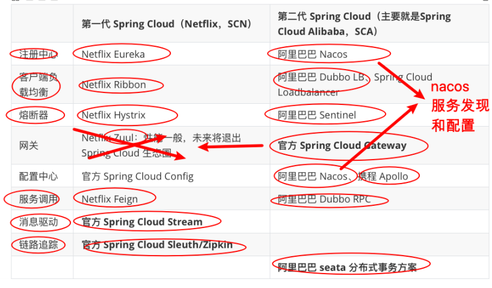

> 第一部分 微服务架构

# 3 微服务架构中的一些概念

## 3.1 服务注册与服务发现

服务注册：服务提供者将所提供服务的信息（服务器IP和端口、服务访问协议等）注册/登记到注册中心。

服务发现：服务消费者能够从注册中心获取到较为实时的服务列表，然后根据一定的策略选择一个服务访问。

## 3.2 负载均衡

负载均衡即将请求压力分配到多个服务器（应用服务器、数据库服务器等）以此来提高服务的性能、可靠性。

## 3.3 熔断

熔断即断路保护。微服务架构中，如果下游服务因访问压力过大而响应变慢或失败，上游为了保护系统整体可用性，可以暂时切断对下游服务的调用。这种牺牲局部，保全整体的措施叫做熔断。

## 3.4 链路追踪

微服务架构越发流行，一个项目往往拆分成很多个服务，那么一次请求就需要设计到很多个服务。不同的微服务可能是由不同的团队开发、可能使用不同的编程语言实现、整个项目也有可能部署在了很多服务器上（甚至百台、千台）横跨多个不同的数据中心。所谓链路追踪，就是对一次请求涉及的很多服务链路进行日志记录，性能监控。

## 3.5 API 网关

微服务架构下，不同的微服务往往会有不同的访问地址，客户端可能需要调用多个服务的接口才能完成一个业务需求，如果让客户端直接直接与各个微服务通信可能出现：

1. 客户端需要调用不同的 url 地址，增加了维护调用难度。
2. 在一定的场景下，也存在跨域请求的问题（前后端分离就会碰到跨域问题，原本我们在后端采用 Cors 就能解决，现在利用网关，那么就放在网关这层做好了）
3. 每个微服务都需要进行单独的身份认证

那么，API 网关就可以较好的统一处理上述问题，API 请求调用统一接入 API 网关层，由网关层转发请求。API 网关更专注在安全、路由、流量等问题的处理上（微服务团队专注于处理业务逻辑即可），它的功能比如：

1. 统一接入（路由）
2. 安全防护（统一鉴权、负责网关访问身份认证验证，与“访问认证中心”通信，实际认证业务逻辑交给“访问认证中心处理”）
3. 黑白名单（实现通过 IP 地址控制禁止访问网关功能，控制访问）
4. 协议适配（实现通信协议校验、适配转换的功能）
5. 流量管控（限流）
6. 长短链接支持
7. 容错能力（负载均衡）

