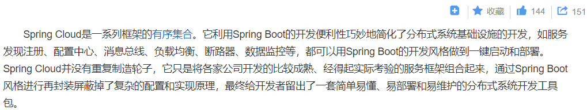
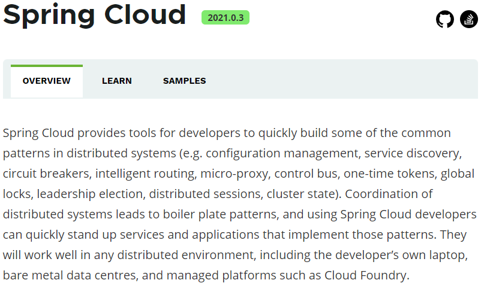

> 第二部分 SpringCloud综述

# 1 Spring Cloud 是什么

Spring Cloud 是一系列框架的有序集合（Spring Cloud 是一个规范），服务注册/发现、配置中心、消息总线、负载均衡、断路器、数据监控等，利用 Spring Boot 的开发便利性简化了微服务架构的开发（自动装配）

这里，我们需要注意，Spring Cloud 其实是一套规范，是一套用于构建微服务架构的规范，而不是一个可以拿来即用的框架（所谓规范就是应该有哪些功能组件，然后组件之间怎么配合，共同完成什么事情）。在这个规范之下第三方的 Netflix 公司开发了一些组件、Spring 官方开发了一些框架/组件，包括第三方的阿里巴巴开发了一套框架/组件集合 Spring Cloud Alibaba，这才是Spring Cloud 规范的实现。

Netflix 的一套，简称 SCN，Spring Cloud 吸收了 Netflix 公司的产品基础上自己也搞了几个组件。

阿里巴巴在之前的基础上搞出了一堆微服务组件，Spring Cloud Alibaba（SCA）。

# 2 Spring Cloud 解决什么问题

Spring Cloud 规范及实现意图要解决的问题其实就是微服务架构实施过程中存在的一些问题，比如微服务架构中的服务注册发现问题、网络问题（比如熔断场景）、统一认证安全授权问题、负载均衡问题、链路追踪等问题。

# 3 Spring Cloud 架构

## 3.1 Spring Cloud 核心组件

## 3.2 Spring Cloud 体系结构（组件协同工作机制）

# 4 Spring Cloud 与 Dubbo 对比

# 5 Spring Cloud 与 Spring Boot 的关系

