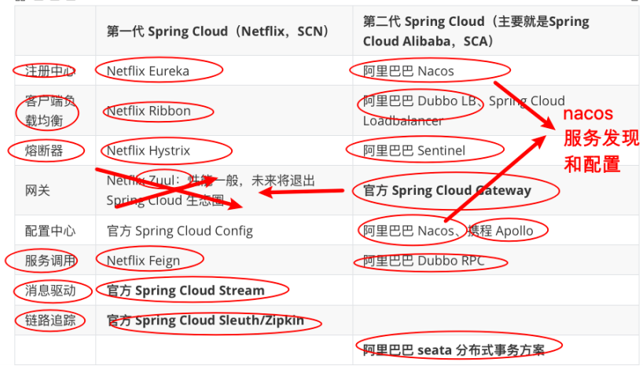
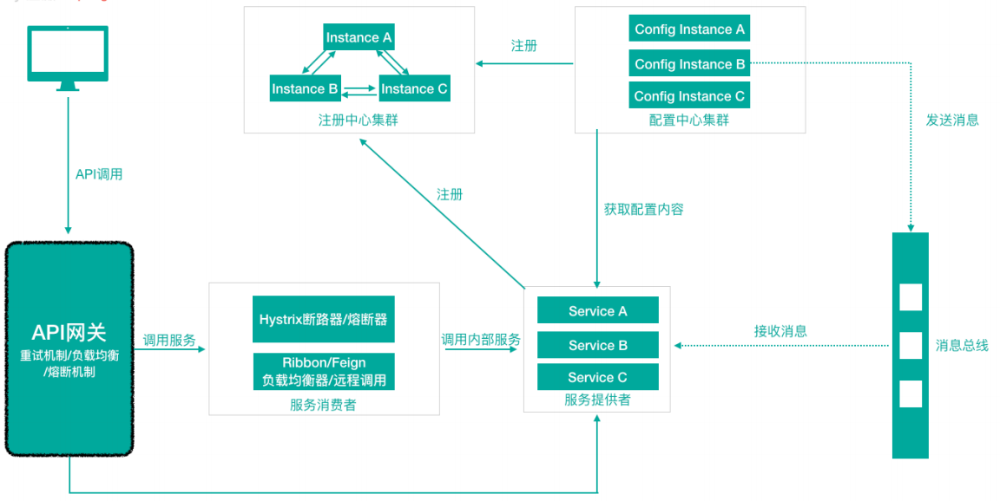

> 第二部分 SpringCloud综述

# 1 Spring Cloud 是什么

Spring Cloud 是一系列框架的有序集合（Spring Cloud 是一个规范），服务注册/发现、配置中心、消息总线、负载均衡、断路器、数据监控等，利用 Spring Boot 的开发便利性简化了微服务架构的开发（自动装配）

这里，我们需要注意，Spring Cloud 其实是一套规范，是一套用于构建微服务架构的规范，而不是一个可以拿来即用的框架（所谓规范就是应该有哪些功能组件，然后组件之间怎么配合，共同完成什么事情）。在这个规范之下第三方的 Netflix 公司开发了一些组件、Spring 官方开发了一些框架/组件，包括第三方的阿里巴巴开发了一套框架/组件集合 Spring Cloud Alibaba，这才是Spring Cloud 规范的实现。

Netflix 的一套，简称 SCN，Spring Cloud 吸收了 Netflix 公司的产品基础上自己也搞了几个组件。

阿里巴巴在之前的基础上搞出了一堆微服务组件，Spring Cloud Alibaba（SCA）。

# 2 Spring Cloud 解决什么问题

Spring Cloud 规范及实现意图要解决的问题其实就是微服务架构实施过程中存在的一些问题，比如微服务架构中的服务注册发现问题、网络问题（比如熔断场景）、统一认证安全授权问题、负载均衡问题、链路追踪等问题。

# 3 Spring Cloud 架构

如前所述，Spring Cloud 是一个微服务相关规范，这个规范意图为搭建微服务架构提供一站式服务，**采用组件（框架）化机制**定义一系列组件，各类组件针对性的处理微服务中的特定问题，这些组件共同来构成 **Spring Cloud 微服务技术栈**。

## 3.1 Spring Cloud 核心组件

Spring Cloud 生态圈中的组件，按照发展可以分为第一代 Spring Cloud 组件 和 第二代 Spring Cloud 组件。

## 3.2 Spring Cloud 体系结构（组件协同工作机制）

Spring Cloud 中的个组件协同工作，才能够支持一个完成的微服务架构。比如：

1. 注册中心负责服务的注册与发现，很好将各服务连接起来
2. API 网关负责转发所有外来的请求
3. 断路器负责监控服务之间的调用情况，连续多次失败进行熔断保护。
4. 配置中心提供了统一的配置信息管理服务，可以实时的通知各个服务获取最新的配置信息。

# 4 Spring Cloud 与 Dubbo 对比

Dubbo 是阿里巴巴公司开源的一个高性能优秀的服务框架，基于 RPC 调用。对于目前使用率较高的 Spring Cloud Netflix 来说，它是基于 HTTP 的，所以效率上没有 Dubbo 高，但问题在于 Dubbo 体系的组件不全，不能够提供一站式解决方案，比如服务注册 与 发现需要借助于 Zookeeper 等实现，而 Spring Cloud Netflix 则是真正的提供了一站式服务化的解决方案，且有 Spring 大家族背景。

前些年，Dubbo 使用率高于 Spring Cloud，但目前 Spring Cloud 在服务化/微服务解决方案中已经有了非常好的发展趋势。

# 5 Spring Cloud 与 Spring Boot 的关系

Spring Cloud 只是利用了 Spring Boot 的特点，让我们能够快速的实现微服务组件开发，否则不使用 Spring Boot 的话，我们在使用 Spring Cloud 时，每一个组件的相关 Jar 包 都需要我们自己导入配置以及需要开发人员考虑兼容性等各种情况。所以 Spring Boot 是我们快速把 Spring Cloud 微服务技术应用起来的一种方式。

