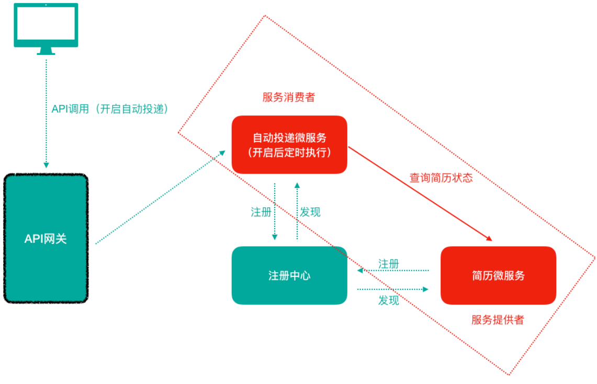
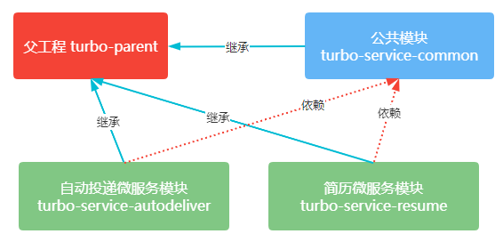
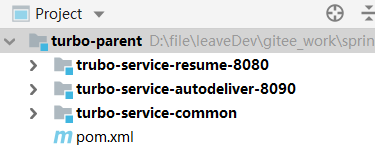

> 第三部分 案例准备

# 1 案例说明

“自动投递微服务” 调用 “简历微服务” 查询简历。在这种场景下，“自动投递微服务” 就是一个服务消费者，“简历微服务” 就是一个服务提供者。




# 2 案例数据库环境准备

数据库使用的是 MySQL 5.7.x

简历基本信息表 r_resume

```sql
/*
Navicat MySQL Data Transfer

Source Server         : 152.136.177.192
Source Server Version : 50728
Source Host           : 152.136.177.192:3306
Source Database       : turbo

Target Server Type    : MYSQL
Target Server Version : 50728
File Encoding         : 65001
*/

SET FOREIGN_KEY_CHECKS=0;

-- ----------------------------
-- Table structure for r_resume
-- ----------------------------
DROP TABLE IF EXISTS `r_resume`;
CREATE TABLE `r_resume` (
  `id` int(11) NOT NULL AUTO_INCREMENT,
  `sex` varchar(10) DEFAULT NULL COMMENT '性别',
  `birthday` varchar(30) DEFAULT NULL COMMENT '出生日期',
  `workYear` varchar(100) DEFAULT NULL COMMENT '工作年限',
  `phone` varchar(20) DEFAULT NULL COMMENT '手机号码',
  `email` varchar(100) DEFAULT NULL COMMENT '邮箱',
  `status` varchar(80) DEFAULT NULL COMMENT '目前状态',
  `resumeName` varchar(500) DEFAULT NULL COMMENT '简历名称',
  `name` varchar(40) DEFAULT NULL,
  `createTime` datetime DEFAULT NULL COMMENT '创建日期',
  `headPic` varchar(100) DEFAULT NULL COMMENT '头像',
  `isDel` int(2) DEFAULT NULL COMMENT '是否删除 默认值0-未删除 1-已删 除',
  `updateTime` datetime DEFAULT NULL COMMENT '简历更新时间',
  `userId` int(11) DEFAULT NULL COMMENT '用户ID',
  `isDefault` int(2) DEFAULT NULL COMMENT '是否为默认简历 0-非默认 1-默认',
  `highestEducation` varchar(20) DEFAULT '' COMMENT '最高学历',
  `deliverNearByConfirm` int(2) DEFAULT '0' COMMENT '投递附件简历确认 0-需要确认 1-不需要确认',
  `refuseCount` int(11) NOT NULL DEFAULT '0' COMMENT '简历被拒绝次数',
  `markCanInterviewCount` int(11) NOT NULL DEFAULT '0' COMMENT '被标记为可面试次数',
  `haveNoticeInterCount` int(11) NOT NULL DEFAULT '0' COMMENT '已通知面试次数',
  `oneWord` varchar(100) DEFAULT '' COMMENT '一句话介绍自己',
  `liveCity` varchar(100) DEFAULT '' COMMENT '居住城市',
  `resumeScore` int(3) DEFAULT NULL COMMENT '简历得分',
  `userIdentity` int(1) DEFAULT '0' COMMENT '用户身份1-学生 2-工人',
  `isOpenResume` int(1) DEFAULT '3' COMMENT '人才搜索-开放简历 0-关闭,1-打开，2-简历未达到投放标准被动关闭 3-从未设置过开放简历',
  PRIMARY KEY (`id`)
) ENGINE=InnoDB DEFAULT CHARSET=utf8;
```


# 3 案例工程环境准备

我们基于 Spring Boot 来构建工程环境，我们的工程模块关系如下所示：






## 3.1 父工程 turbo-parent

在 Idea 中新建 module，命名为 turbo-parent

pom.xml

```xml
<?xml version="1.0" encoding="UTF-8"?>
<project xmlns="http://maven.apache.org/POM/4.0.0"
         xmlns:xsi="http://www.w3.org/2001/XMLSchema-instance"
         xsi:schemaLocation="http://maven.apache.org/POM/4.0.0 http://maven.apache.org/xsd/maven-4.0.0.xsd">
    <modelVersion>4.0.0</modelVersion>

    <groupId>com.turbo</groupId>
    <artifactId>turbo-parent</artifactId>
    <version>1.0-SNAPSHOT</version>
    <!--父工程打包方式为pom-->
    <packaging>pom</packaging>

    <!--Spring boot 父启动期依赖-->
    <parent>
        <groupId>org.springframework.boot</groupId>
        <artifactId>spring-boot-starter-parent</artifactId>
        <version>2.1.6.RELEASE</version>
    </parent>

    <dependencies>
        <!--web依赖-->
        <dependency>
            <groupId>org.springframework.boot</groupId>
            <artifactId>spring-boot-starter-web</artifactId>
        </dependency>

        <!--日志依赖-->
        <dependency>
            <groupId>org.springframework.boot</groupId>
            <artifactId>spring-boot-starter-logging</artifactId>
        </dependency>
        <!--测试依赖-->
        <dependency>
            <groupId>org.springframework.boot</groupId>
            <artifactId>spring-boot-starter-test</artifactId>
            <scope>test</scope>
        </dependency>
        <!--lombok工具-->
        <dependency>
            <groupId>org.projectlombok</groupId>
            <artifactId>lombok</artifactId>
            <version>1.18.4</version>
            <scope>provided</scope>
        </dependency>
        <!--Actuator可以帮助你监控和管理 Spring Boot应用-->
        <dependency>
            <groupId>org.springframework.boot</groupId>
            <artifactId>spring-boot-starter-actuator</artifactId>
        </dependency>
        <!--热部署-->
        <dependency>
            <groupId>org.springframework.boot</groupId>
            <artifactId>spring-boot-devtools</artifactId>
        </dependency>
    </dependencies>

    <build>
        <plugins>
            <!--编译插件-->
            <plugin>
                <groupId>org.apache.maven.plugins</groupId>
                <artifactId>maven-compiler-plugin</artifactId>
                <configuration>
                    <source>11</source>
                    <target>11</target>
                    <encoding>utf-8</encoding>
                </configuration>
            </plugin>
            <!--打包插件-->
            <plugin>
                <groupId>org.springframework.boot</groupId>
                <artifactId>spring-boot-maven-plugin</artifactId>
            </plugin>
        </plugins>
    </build>

</project>
```


# 4 案例核心微服务开发及通信调用

## 4.1 公共服务模块

在 turbo-parent 下新建一个 maven `turbo-service-common` module ，

pom.xml

```xml
<parent>
    <artifactId>turbo-parent</artifactId>
    <groupId>com.turbo</groupId>
    <version>1.0-SNAPSHOT</version>
</parent>
<modelVersion>4.0.0</modelVersion>

<groupId>com.turbo</groupId>
<artifactId>turbo-service-common</artifactId>
<version>1.0-SNAPSHOT</version>

<dependencies>
    <dependency>
        <groupId>org.springframework.boot</groupId>
        <artifactId>spring-boot-starter-data-jpa</artifactId>
    </dependency>

    <dependency>
        <groupId>mysql</groupId>
        <artifactId>mysql-connector-java</artifactId>
        <scope>runtime</scope>
    </dependency>
</dependencies>
```

### 4.1.1 实体类

实体类统一放置到 `turbo-service-common` 模块下，包路径为 `com.turbo.pojo`

Resume.java

```java
package com.turbo.pojo;

import lombok.Data;

import javax.persistence.Entity;
import javax.persistence.Id;
import javax.persistence.Table;

@Data
@Entity
@Table(name = "r_resume")
public class Resume {
    @Id
    private Long id; // 主键
    private String sex; // 性别
    private String birthday; // ⽣⽇
    private String workYear; // ⼯作年限
    private String phone; // ⼿机号
    private String email; // 邮箱
    private String status; // ⽬前状态
    private String resumeName; // 简历名称
    private String name; // 姓名
    private String createTime; // 创建时间
    private String headPic; // 头像
    private Integer isDel; //是否删除    默认值0-未删除 1-已删除
    private String updateTime; // 简历更新时间
    private Long userId; // ⽤户ID
    private Integer isDefault; // 是否为默认简历 0-默认 1-⾮默认
    private String highestEducation; // 最⾼学历
    private Integer deliverNearByConfirm; // 投递附件简历确认 0-需要确 认 1-不需要确认
    private Integer refuseCount; // 简历被拒绝次数
    private Integer markCanInterviewCount; //被标记为可⾯试次数
    private Integer haveNoticeInterCount; //已通知⾯试次数
    private String oneWord; // ⼀句话介绍⾃⼰
    private String liveCity; // 居住城市
    private Integer resumeScore; // 简历得分
    private Integer userIdentity; // ⽤户身份1-学⽣ 2-⼯⼈
    private Integer isOpenResume; // ⼈才搜索-开放简历 0-关闭，1-打开， 2-简历未达到投放标准被动关闭 3-从未设置过开放简历
}
```


## 4.2 简历微服务

pom文件导入坐标

在 `turbo-service-resume-8080` 模块的 pom.xml 中导入如下相关坐标

```xml
<parent>
    <artifactId>turbo-parent</artifactId>
    <groupId>com.turbo</groupId>
    <version>1.0-SNAPSHOT</version>
</parent>
<modelVersion>4.0.0</modelVersion>

<groupId>com.turbo</groupId>
<artifactId>trubo-service-resume-8080</artifactId>
<version>1.0-SNAPSHOT</version>

<dependencies>
    <dependency>
        <groupId>com.turbo</groupId>
        <artifactId>turbo-service-common</artifactId>
        <version>1.0-SNAPSHOT</version>
    </dependency>
</dependencies>
```


### 4.2.1 Dao层接口

此处我们将 Dao 层放置到 `turbo-service-resume-8080` 中，包路径为 `com.turbo.dao`

ResumeDao.java

```java
package com.turbo.dao;

import com.turbo.pojo.Resume;
import org.springframework.data.jpa.repository.JpaRepository;

public interface ResumeDao extends JpaRepository<Resume,Long> {
}
```

### 4.2.2. Service 层接口和实现类

在包路径 `com.turbo.service`

ResumeService.java

```java
package com.turbo.service;

import com.turbo.pojo.Resume;

public interface ResumeService {
    Resume findDefaultResumeByUserId(Long userId);
}
```

```java
package com.turbo.service.impl;

import com.turbo.dao.ResumeDao;
import com.turbo.pojo.Resume;
import com.turbo.service.ResumeService;
import org.springframework.beans.factory.annotation.Autowired;
import org.springframework.data.domain.Example;


public class ResumeServiceImpl implements ResumeService {

    @Autowired
    private ResumeDao resumeDao;

    @Override
    public Resume findDefaultResumeByUserId(Long userId) {

        Resume resume = new Resume();
        resume.setId(userId);
        // 查询默认简历
        resume.setIsDefault(1);
        Example<Resume> example = Example.of(resume);
        return resumeDao.findOne(example).get();
    }
}
```


### 4.2.3 Controller 控制层

```java
package com.turbo.controller;

import com.turbo.service.ResumeService;
import org.springframework.beans.factory.annotation.Autowired;
import org.springframework.web.bind.annotation.PathVariable;
import org.springframework.web.bind.annotation.RequestMapping;
import org.springframework.web.bind.annotation.RestController;


@RestController
@RequestMapping("/resume")
public class ResumeController {

    @Autowired
    ResumeService resumeService;

    @RequestMapping("/openState/{userId}")
    public Integer findDefaultResumeState(@PathVariable Long userId){
        return resumeService.findDefaultResumeByUserId(userId).getIsOpenResume();
    }
}
```


### 4.2.4 SpringBoot 启动类

```java
package com.turbo;

import org.springframework.boot.SpringApplication;
import org.springframework.boot.autoconfigure.SpringBootApplication;
import org.springframework.boot.autoconfigure.domain.EntityScan;


@SpringBootApplication
@EntityScan("com.turbo.pojo")
public class TurboResumeApplication8080 {
    public static void main(String[] args) {
        SpringApplication.run(TurboResumeApplication8080.class,args);
    }
}
```

### 4.2.5 yml 配置文件

```yaml
server:
  port: 8080
spring:
  application:
    name: turbo-service-resume
  datasource:
    driver-class-name: com.mysql.jdbc.Driver
    url: jdbc:mysql://152.136.177.192:3306/turbo?useUnicode=true&characterEncoding=utf8
    username: root
    password: 123456
  jpa:
    database: mysql
    show-sql: true
    hibernate:
      naming:
        physical-strategy: org.hibernate.boot.model.naming.PhysicalNamingStrategyStandardImpl
```


## 4.3 自动投递微服务

### 4.3.1 application.yml

```yaml
server:
  port: 8090
spring:
  application:
    name: turbo-service-autodeliver
```


### 4.3.2 Controller 控制层

```java
package com.turbo.controller;

import org.springframework.beans.factory.annotation.Autowired;
import org.springframework.web.bind.annotation.GetMapping;
import org.springframework.web.bind.annotation.PathVariable;
import org.springframework.web.bind.annotation.RequestMapping;
import org.springframework.web.bind.annotation.RestController;
import org.springframework.web.client.RestTemplate;

@RestController
@RequestMapping("/autodeliver")
public class AutodeliverController {

    @Autowired
    RestTemplate restTemplate;

    // http://localhost:8090/autodeliver/checkState/2195320
    @GetMapping("/checkState/{userId}")
    public Integer findResumeOpenState(@PathVariable Long userId){
        Integer forObject = restTemplate.getForObject("http://localhost:8080/resume/openState/" + userId, Integer.class);
        return forObject;
    }
}
```


### 4.3.3 Spring Boot 启动类

```java
package com.turbo;

import org.springframework.boot.SpringApplication;
import org.springframework.boot.autoconfigure.SpringBootApplication;
import org.springframework.context.annotation.Bean;
import org.springframework.web.client.RestTemplate;

@SpringBootApplication
public class AutoDeliverApplication8090 {
    public static void main(String[] args) {
        SpringApplication.run(AutoDeliverApplication8090.class,args);
    }

    @Bean
    public RestTemplate getRestTemplate(){
        return new RestTemplate();
    }
}
```


启动服务后，可以使用 postman 测试。

# 5 案例代码问题分析

我们在自动投递微服务中使用 RestTemplate 调用简历微服务的简历状态接口时（Resutful API 接口）。在微服务**分布式集群环境**下会存在什么问题呢？怎么解决？

存在的问题：

1. 在服务消费中，我们把 url 地址**硬编码**到代码中，不方面后期维护。
2. 服务提供者只有一个服务，即便服务提供者形成集群，服务消费者还**需要自己实现负载均衡**。
3. 在服务消费者中，**不清楚服务提供者的状态**。
4. 服务消费者调用服务提供者的时候，如果出现故障能否及时发现，不向用户抛出异常页面？
5. RestTemplate 这种请求调用方式是否还有优化空间？能不能类似于 Dubbo 那样？
6. 这么多的微服务**统一认证**如何实现？
7. 配置文件每次都修改好多个 很麻烦？
8. ......

上述分析出的问题，其实就是微服务架构中必然面临的一些问题：

1. 服务管理：自动注册与发现、状态监管
2. 服务负载均衡
3. 熔断
4. 远程过程调用
5. 网关拦截、路由转发
6. 统一认证
7. 集中式配置管理，配置信息实时自动更新

这些问题，Spring Cloud 体系都有解决方案，后续逐个学习。

