> 4-1 Eureka服务注册中心

# 1 关于服务注册中心

**注意：服务注册中心本质上是为了解耦服务提供者和服务消费者**。

对于任何一个微服务，原则上都应该存在或者支持多个提供者（比如简历微服务部署多个实例），这是由微服务的**分布式属性**决定的。

更进一步，为了支持弹性扩缩容特性，一个微服务的提供者的数量和分布往往是动态变化的，也是无法预先确定的。因此，原本在单体应用阶段常用的静态 LB 机制就不再适用了，需要引入额外的组件来管理微服务提供者的注册与发现，而这个组件就是服务注册中心。

## 1.1 服务注册中心一般原理

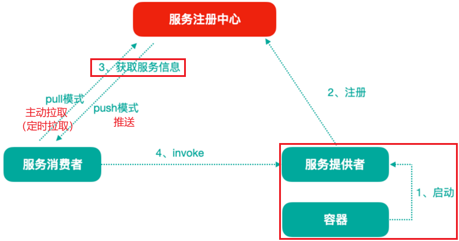

分布式微服务架构中，服务注册中心用于存储服务提供者地址信息，服务发布相关的属性信息；消费者通过**主动查询**和**被动通知**的方式获取服务提供者的地址信息，而不再需要通过硬编码方式得到提供者的地址信息。消费者只需要知道当前系统发布了哪些服务，而不需要知道服务具体存在于什么位置，这就是透明化路由。

1. 服务提供者启动
2. 服务提供者将相关服务信息**主动注册**到注册中心
3. 服务消费者获取服务注册信息
   - pull 模式：服务消费者可以主动拉取可用的服务提供者清单
   - push 模式：服务消费者订阅服务（当服务提供者有变化时，注册中心也会主动推送更新后的服务清单给消费者）
4. 服务消费者直接调用服务提供者

另外，注册中心也需要完成服务提供者的健康监控，当发现服务提供者失效时需要及时剔除。

## 1.2 主流服务中心对比

- Zookeeper

  Zookeeper 是一个分布式服务框架，是 Apache Hadoop 的一个子项目，它主要是用来解决分布式应用中经常遇到的一些数据管理问题，如：统一命名服务，状态同步服务，集群管理，分布式应用配置项的管理等。

  简单来说 Zookeeper 本质 = 存储 + 监听通知。

  Zookeeper 用来做服务注册中心，主要是它有节点变更通知功能，只要客户端监听相关服务节点，服务节点的所有变更，都能及时通知到监听客户端。这样作为调用方只要使用 Zookeeper 的客户端就能实现服务节点的订阅和变更通知功能了，非常方便。另外，Zookeeper 可用性也可以，因为只要**半数以上的选举节点存活**，这个集群就是可用的。

- Eureka

  由 Netflix 开源，并被 Pivatal 集成到 SpringCloud 体系中，它是基于 RestfulApi 风格开发的服务注册与发现组件。

- Consul

  Consul 是由 HashiCorp 基于 Go 语言开发的支持多数据中心分布式高可用的服务发布和注册服务软件，采用 Raft 算法保证服务的一致性，且支持健康检查。

- Nacos

  Nacos 是一个更易于构建云原生应用的动态**服务发现、配置管理和服务管理平台**。简单来说 Nacos 就是 注册中心 + 配置中心的组合，帮助我们解决微服务开发必会涉及到的服务注册 与 发现，服务管理等问题。Nacos 是 Spring Cloud Alibaba 核心组件之一，负责服务注册与发现，还有配置。


| 组件名    | 语言 | CAP                          | 对外暴露接口 |
| --------- | ---- | ---------------------------- | ------------ |
| Eureka    | Java | AP（自我保护机制，保证可用） | HTTP         |
| Consul    | Go   | CP                           | HTTP/DNS     |
| Zookeeper | Java | CP                           | 客户端       |
| Nacos     | Java | 支持 AP/CP 切换              | HTTP         |

```xml
P:分区容错性（一定要满足的）
C:数据一致性
A:高可用
CAP 不可能同时满足三个，要么是 AP，要么是CP
```


# 2 服务注册中心组件 Eureka

服务注册中心的一般原理，对比了主流的服务注册中心方案，目光聚焦 Eureka ：

## 2.1 Eureka 基础架构

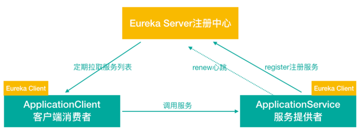

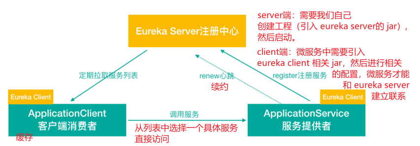

## 2.2 Eureka 交互流程及原理

[Eureka at a glance](https://github.com/Netflix/eureka/wiki/Eureka-at-a-glance)


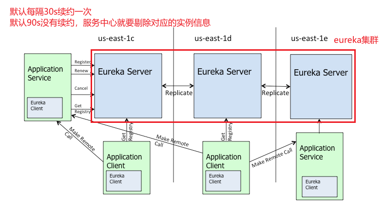

Eureka 包含两个组件：Eureka Server 和 Eureka Client，Eureka Client 是一个Java客户端，用于简化与 Eureka Server 的交互；Eureka Server 提供服务发现的能力，各个微服务启动时，会通过 Eureka Client 向 Eureka Server 进行注册自己的信息（例如网络信息），Eureka Server 会存储该服务的信息。

1. 图中 us-east-1c、us-east-1d、us-east-1e 代表不同的区也就是不同的机房。
2. 图中每一个 Eureka Server 都是一个集群。
3. 图中 Application Service 作为服务提供者向 Eureka Server 中注册服务，Eureka Server 接收到注册事件会在集群和分区中进行数据同步（服务消费者）可以从 Eureka Server 中获取到服务注册信息，进行服务调用。
4. 微服务启动后，会周期性的向 Eureka Server 发送心跳（默认周期为 30s），以续约自己的信息。
5. Eureka Server 在一定时间内没有接收到某个微服务节点的心跳，Eureka Server 将会注销该微服务节点（默认90s）
6. 每个 Eureka Server 同时也是 Eureka Client，多个 Eureka Server 之间通过复制的方式完成服务注册列表的同步。
7. Eureka Client 会缓存 Eureka Server 中的信息。即使所有的 Eureka Server 节点都宕机，服务消费者依然可以使用缓存中的信息找到服务提供者。

**Eureka 通过心跳检测、健康检查 和 客户端缓存等机制，提供系统的灵活性、可伸缩性 和 可用性**。

# 3 Eureka 应用及高可用集群

1. 单实例 Eureka Server -> 访问管理界面 -> Eureka Server 集群
2. 服务提供者（建立微服务注册到集群）
3. 服务消费者（总投递微服务注册到集群 / 从 Eureka Server 集群获取服务信息）
4. 完成调用

## 3.1 搭建单例 Eureka Server 服务注册中心

Eureka Server也是一个工程，基于Maven构建SpringBoot工程，在SpringBoot工程之上搭建Eureka Server服务（turbo-cloud-eureka-server-8761）。

- turbo-parent 中引入 Spring Cloud 依赖

  Spring Cloud 是一个综合的项目，下面有很多子项目，比如 eureka 子项目（版本号 1.x.x）

  ```xml
  <dependencyManagement>
      <dependencies>
          <dependency>
              <groupId>org.springframework.cloud</groupId>
              <artifactId>spring-cloud-dependencies</artifactId>
              <version>Greenwich.RELEASE</version>
              <type>pom</type>
              <!--import (Maven 2.0.9 之后新增)
                  它只使用在<dependencyManagement>中，
                  表示从其它的pom中导入dependency的配置，例如 (B项目导入A项目中的包配置)：-->
              <scope>import</scope>
          </dependency>
      </dependencies>
  </dependencyManagement>
  ```

- turbo-cloud-eureka-server-8761 工程 pom中引入依赖

  ```xml
  <!--eureka server 依赖-->
  <dependency>
      <groupId>org.springframework.cloud</groupId>
      <artifactId>spring-cloud-starter-netflix-eureka-server</artifactId>
  </dependency>
  ```

  注意：在父工程的 pom 文件中手动引入 jaxb 的 jar，因为 Jdk9 之后默认没有加载该模块，EurekaServer 中使用到，所以需要手动导入，否则 Eureka Server 服务无法启动。

  父工程 pom.xml

  ```xml
  <!--引⼊Jaxb，开始-->
  <dependency>
      <groupId>com.sun.xml.bind</groupId>
      <artifactId>jaxb-core</artifactId>
      <version>2.2.11</version>
  </dependency>
  <dependency>
      <groupId>javax.xml.bind</groupId>
      <artifactId>jaxb-api</artifactId>
  </dependency>
  <dependency>
      <groupId>com.sun.xml.bind</groupId>
      <artifactId>jaxb-impl</artifactId>
      <version>2.2.11</version>
  </dependency>
  <dependency>
      <groupId>org.glassfish.jaxb</groupId>
      <artifactId>jaxb-runtime</artifactId>
      <version>2.2.10-b140310.1920</version>
  </dependency>
  <dependency>
      <groupId>javax.activation</groupId>
      <artifactId>activation</artifactId>
      <version>1.1.1</version>
  </dependency>
  <!--引⼊Jaxb，结束-->
  ```

- application.yml

  ```yaml
  server:
    port: 8761 # Eureka Server 服务端口
  spring:
    application:
      name: turbo-cloud-eureka-server # 应⽤名称,会在Eureka中作为服务的id标识（serviceId）
  eureka:
    instance:
      hostname: localhost
    client:
      service-url:
        defaultZone: http://${eureka.instance.hostname}:${server.port}/eureka/
      register-with-eureka: false # 自己就是服务不需要注册自己
      fetch-registry: false # 自己就是服务不需要从 Eureka Server 获取服务信息，默认为true，置为 false
  ```

- SpringBoot启动类

  使用 `@EnableEurekaServer` 声明当前项目为 EurekaServer 服务

  ```java
  package com.turbo;
  
  import org.springframework.boot.SpringApplication;
  import org.springframework.boot.autoconfigure.SpringBootApplication;
  import org.springframework.cloud.netflix.eureka.server.EnableEurekaServer;
  
  @SpringBootApplication
  // 声明本项目是一个 Eureka服务
  @EnableEurekaServer
  public class TurboEurekaServerApp8761 {
      public static void main(String[] args) {
          SpringApplication.run(TurboEurekaServerApp8761.class,args);
      }
  }
  ```

- 执行启动类 TurboEurekaServerApp8761 的 main 函数

- 访问 http://localhost:8761/，如果看到如下页面（Eureka 注册中心后台），则表示 EurekaServer 发布成功。


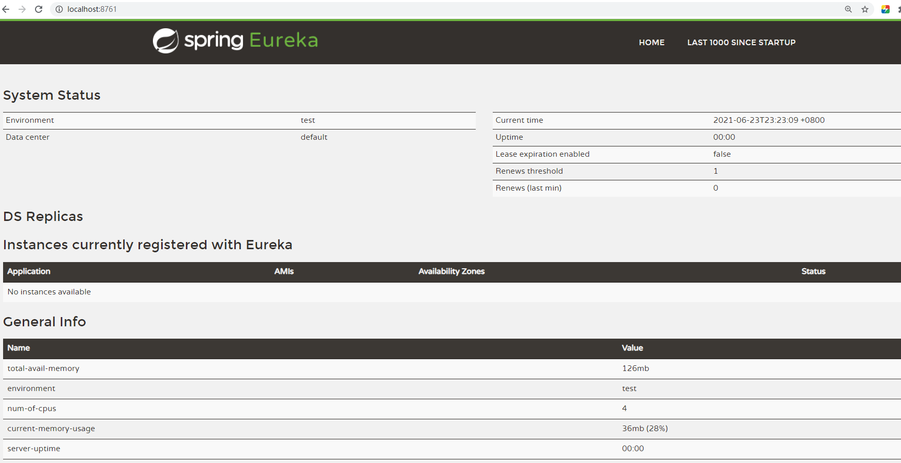

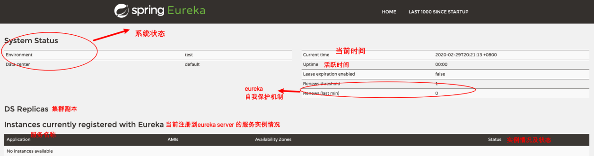

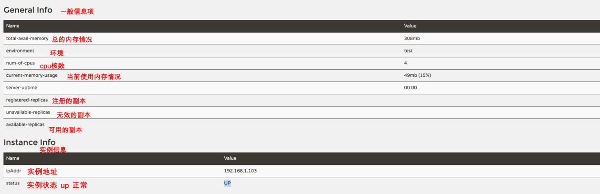


## 3.2 搭建 Eureka Server HA 高可用集群

Eureka Server 集群中的节点通过点对点（P2P）通信的方式共享服务注册表。我们开启两台 Eureka Server 以搭建集群。

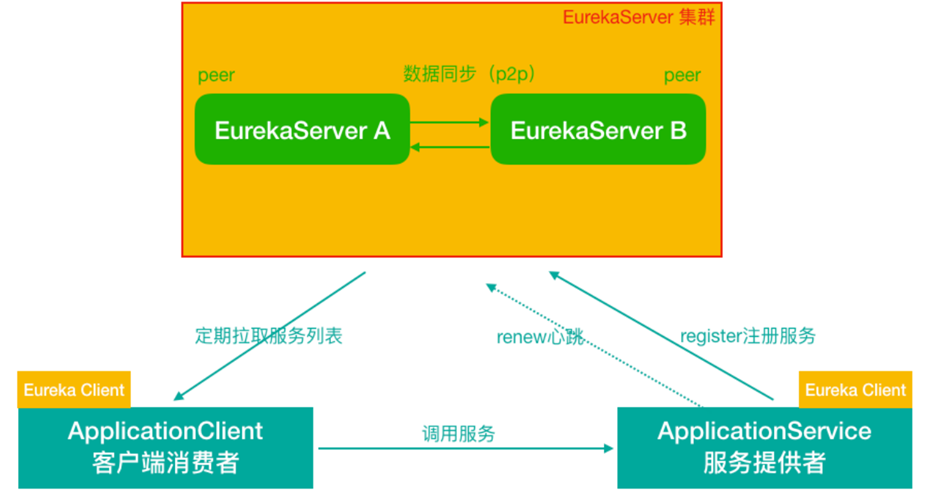

1. 修改本机host属性

   由于是在个人计算机中进行测试，很难模拟多主机的情况，Eureka 配置 server 集群时需要执行 host 地址，所以需要修改个人电脑中的 host 地址。

   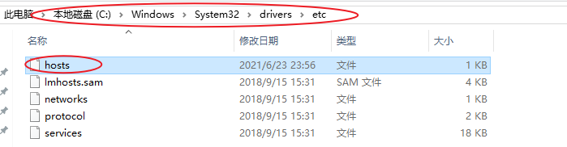

   ```http
   127.0.0.1       TurboCloudEurekaServerA
   127.0.0.1       TurboCloudEurekaServerB
   ```

2. 复制 `turbo-cloud-eureka-server-8761` -> `turbo-cloud-eureka-server-8762` 修改 yml 配置文件

   

   ```yaml
   server:
     port: 8761 # Eureka Server 服务端口
   spring:
     application:
       name: turbo-cloud-eureka-server # 应⽤名称，会在Eureka中作为服务的 id标识（serviceId）
   #Eurake 客户端配置（和Server交互），Eureka Server 其实也是一个Client
   eureka:
     instance:
       hostname: TurboCloudEurekaServerA
     client:
       service-url: # 配置客户端交互的Eureka Server的地址 (Eureka Server集群中 每一个Server其实相对于其他Server来说都是客户端)
         #此时集群模式下，defaultZone应该指向其他Eureka Server,如果有更多其他实例 逗号拼接
         defaultZone: http://TurboCloudEurekaServerB:8762/eureka
       register-with-eureka: true # 自己就是服务不需要注册自己 #集群模式下改为true
       fetch-registry: true # 自己就是服务不需要从 Eureka Server 获取服务信息，默认为true，置为 false #集群模式下改为true
   ```

   ```yaml
   server:
     port: 8762 # Eureka Server 服务端口
   spring:
     application:
       name: turbo-cloud-eureka-server # 应⽤名称，会在Eureka中作为服务的 id标识（serviceId）
   #Eurake 客户端配置（和Server交互），Eureka Server 其实也是一个Client
   eureka:
     instance:
       hostname: TurboCloudEurekaServerB
     client:
       service-url:
         defaultZone: http://TurboCloudEurekaServerA:8761/eureka
       register-with-eureka: true 
       fetch-registry: true
   ```

3. 启动两个服务

   `http://turbocloudeurekaservera:8761/，http://turbocloudeurekaserverb:8762/` 

   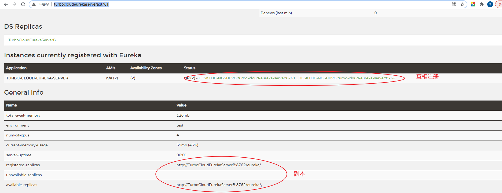


另外一种方式不复制项目，修改 `turbo-cloud-eureka-server` 中的 yml 配置文件

```yaml
#指定应⽤名称 
spring:
  application:
    name: turbo-cloud-eureka-server 
---
#第⼀个profile,后期启动spring-boot项⽬时，可通过命令参数指定 
spring:
  profiles: TurboCloudEurekaServerA 
server:
  port: 8761
eureka:
  instance:
    hostname: TurboCloudEurekaServerA   
  client:
    register-with-eureka: true     
    fetch-registry: true
    serviceUrl:
      defaultZone: http://TurboCloudEurekaServerB:8762/eureka
      
---
#第⼆个profile,后期启动spring-boot项⽬时，可通过命令参数指定 
spring:
  profiles: TurboCloudEurekaServerB 
server:
  port: 8762
eureka:
  instance:
    hostname: TurboCloudEurekaServerB   
 client:
    register-with-eureka: true     
    fetch-registry: true
    serviceUrl:
      defaultZone: http://TurboCloudEurekaServerA:8761/eureka
```

**说明**

- 在 ⼀个实例中，把另外的实例作为了集群中的镜像节点，那么这个`http://TurboCloudEurekaServerB:8762/eureka` URL 中的 TurboCloudEurekaServerB 就要和其它个profile 中的`eureka.instance.hostname`保持一致。
- `register-with-eureka` 和 `fetch-registry `在单节点时设置为了 false, 因为 只有⼀台 Eureka Server，并不需要⾃⼰注册⾃⼰，⽽现在有了集群，可以在集 群的其他节点中注册本服务。
- 启动两次该SpringBoot项⽬，分别使⽤两个不同的profiles

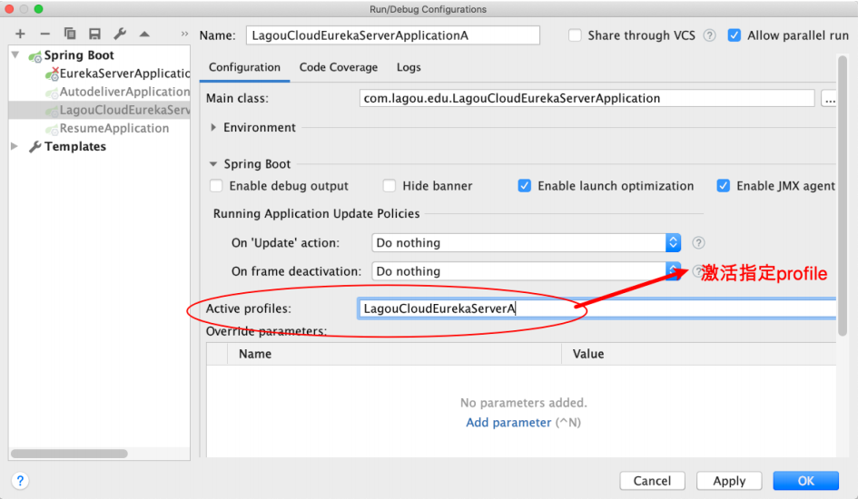


## 3.3 微服务提供者 注册到 Eureka Server集群

注册简历微服务（简历服务部署两个实例，分别占用8080、8081端口）

- 父工程中引入 `spring-cloud-commons` 依赖

  ```xml
  <dependency>
      <groupId>org.springframework.cloud</groupId>
      <artifactId>spring-cloud-commons</artifactId>
  </dependency>
  ```

- pom 文件引入坐标，添加 eureka client 的相关坐标

  ```xml
  <dependency>
      <groupId>org.springframework.cloud</groupId>
      <artifactId>spring-cloud-starter-netflix-eureka-client</artifactId>
  </dependency>
  ```

- 配置 application.yml 文件

  在 application.yml 中添加 Eureka Server 高可用集群的地址及相关配置

  ```yaml
  eureka:
    client:
      service-url: #eureka server 的路径
        # 把所有 eureka 集群中的所有url都填写进来，可以只写一台，因为各个 eureka server 可以同步注册表
        defaultZone: http://TurboCloudEurekaServerB:8762/eureka,http://TurboCloudEurekaServerA:8761/eureka
      registry-fetch-interval-seconds: 30
    instance:
      #服务实例中显示ip，而不是显示主机名，(为了兼容老版本,新版本经过实验都是ip)
      prefer-ip-address: true
      # 实例名称： 192.168.1.3:turbo-service-resume:8080  可以自定义实例显示格式，加上版本号，便于多版本管理，注意是ip-address，早期版本是ipAddress
      instance-id: ${spring.cloud.client.ip-address}:${spring.application.name}:${server.port}:@project.version@
  ```

  **经验：自定义实例显示格式，加上版本号，便于多版本管理**

- 启动类添加注解

  ```java
  package com.turbo;
  
  import org.springframework.boot.SpringApplication;
  import org.springframework.boot.autoconfigure.SpringBootApplication;
  import org.springframework.boot.autoconfigure.domain.EntityScan;
  import org.springframework.cloud.client.discovery.EnableDiscoveryClient;
  import org.springframework.cloud.netflix.eureka.EnableEurekaClient;
  
  
  @SpringBootApplication
  @EntityScan("com.turbo.pojo")
  // @EnableEurekaClient // 开启Eureka Client(Eureka独有)
  @EnableDiscoveryClient // 开启注册中心客户端（通用性注解，比如注册到 Eureka,Nacos）
                          // 说明：从Spring Cloud 的 Edgware 版本开始，不加注解也可以，但建议加注解
  public class TurboResumeApplication8080 {
      public static void main(String[] args) {
          SpringApplication.run(TurboResumeApplication8080.class,args);
      }
  }
  ```

  注意：

  1. 从 Spring Cloud Edgware 版本开始，`@EnableDiscoveryClient` 或 `@EnableEurekaClient` 可省略。只需要加上相关依赖，并进行相应配置，即可将微服务注册到服务发现组件上。
  2. `@EnableDiscoveryClient` 和 `@EnableEurekaClient`  二者的功能是一样的。但是如果选用的是 eureka 服务器，那么就推荐 `@EnableEurekaClient`，如果是其它的注册中心，那么推荐使用 `@EnableDiscoveryClient`，考虑到通用性，后期我们可以使用 `@EnableDiscoveryClient`

  

启动类执行，在 Eureka Server 后台界面可以看到注册的服务实例

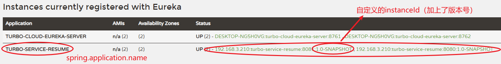


## 3.4 微服务消费者 注册到 Eureka Server 集群

此处自动注册微服务的是消费者 `turbo-service-autodeliver`（投递简历服务部署两个实例，分别占用8090、8091端口）

- pom 文件引入坐标，添加 eureka client 的相关坐标

  ```xml
  <dependency>
      <groupId>org.springframework.cloud</groupId>
      <artifactId>spring-cloud-starter-netflix-eureka-client</artifactId>
  </dependency>
  ```

- 配置 application.yml 文件

  ```yaml
  eureka:
    client:
      service-url: #eureka server 的路径
        # 把所有 eureka 集群中的所有url都填写进来，可以只写一台，因为各个 eureka server 可以同步注册表
        defaultZone: http://TurboCloudEurekaServerB:8762/eureka,http://TurboCloudEurekaServerA:8761/eureka
      registry-fetch-interval-seconds: 30
    instance:
      #服务实例中显示ip，而不是显示主机名，(为了兼容老版本,新版本经过实验都是ip)
      prefer-ip-address: true
      # 实例名称： 192.168.1.3:turbo-service-autodeliver:8090  可以自定义实例显示格式，加上版本号，便于多版本管理，注意是ip-address，早期版本是ipAddress
      instance-id: ${spring.cloud.client.ip-address}:${spring.application.name}:${server.port}:@project.version@
  ```

- 在启动类添加注解 `@EnableDiscoveryClient` ，开启服务发现

  ```java
  package com.turbo;
  
  import org.springframework.boot.SpringApplication;
  import org.springframework.boot.autoconfigure.SpringBootApplication;
  import org.springframework.cloud.client.discovery.EnableDiscoveryClient;
  import org.springframework.context.annotation.Bean;
  import org.springframework.web.client.RestTemplate;
  
  @SpringBootApplication
  @EnableDiscoveryClient
  public class AutoDeliverApplication8090 {
      public static void main(String[] args) {
          SpringApplication.run(AutoDeliverApplication8090.class,args);
      }
  
      @Bean
      public RestTemplate getRestTemplate(){
          return new RestTemplate();
      }
  }
  ```

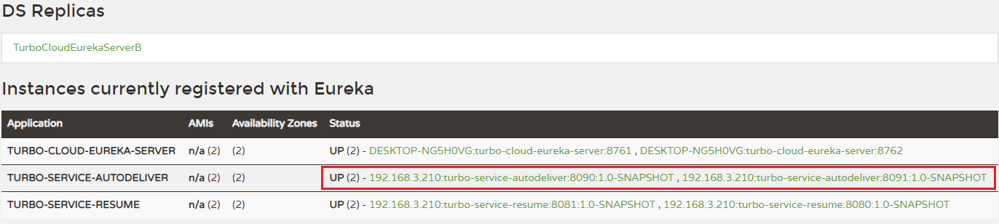

## 3.5 服务消费者 调用 服务提供者（通过Eureka）

```java
package com.turbo.controller;

import org.springframework.beans.factory.annotation.Autowired;
import org.springframework.cloud.client.ServiceInstance;
import org.springframework.cloud.client.discovery.DiscoveryClient;
import org.springframework.web.bind.annotation.GetMapping;
import org.springframework.web.bind.annotation.PathVariable;
import org.springframework.web.bind.annotation.RequestMapping;
import org.springframework.web.bind.annotation.RestController;
import org.springframework.web.client.RestTemplate;
import java.util.List;

@RestController
@RequestMapping("/autodeliver")
public class AutodeliverController {
    @Autowired
    private DiscoveryClient discoveryClient;

    @GetMapping("/checkState/{userId}")
    public Integer findResumeOpenState(@PathVariable Long userId){
        // 1 获取 Eureka 中注册的 user-service 实例列表
        List<ServiceInstance> serviceInstanceList = discoveryClient.getInstances("turbo-service-resume");
        // 2 获取实例（此处不考虑负载，就拿一个）
        ServiceInstance serviceInstance = serviceInstanceList.get(0);
        // 3 根据实例的信息拼接请求地址
        String host = serviceInstance.getHost();
        int port = serviceInstance.getPort();
        // http://192.168.3.210:8080/resume/openState/2195320
        String url = "http://"+host+":"+port+"/resume/openState/"+userId;
        // 4 消费者直接调用消费者
        Integer forObject = restTemplate.getForObject(url, Integer.class);
        return forObject;
    }
}
```


# 4 Eureka 细节讲解

## 4.1 Eureka 元数据讲解

Eureka 的元数据有两种：标准元数据 和 自定义元数据。

**标准元数据**：主机名、IP地址、端口号等信息，这些信息都会被发布在服务注册表中，用于服务之间的调用。

**自定义元数据**：可以使用 `eureka.instance.metadata-map` 配置，符合 key/value 的存储格式。这些元数据可以在远程客户端中访问。

类似于：

```yaml
eureka:
  instance:
    metadata-map:
      # 自定义元数据
      cluster: cl1
      region: rn1
```

可以在程序中使用 DiscoveryClient 获取指定微服务的所有元数据信息

```java
import com.turbo.AutoDeliverApplication8090;
import org.junit.Test;
import org.junit.runner.RunWith;
import org.springframework.beans.factory.annotation.Autowired;
import org.springframework.boot.test.context.SpringBootTest;
import org.springframework.cloud.client.ServiceInstance;
import org.springframework.cloud.client.discovery.DiscoveryClient;
import org.springframework.test.context.junit4.SpringRunner;

import java.util.List;

@RunWith(SpringRunner.class)
@SpringBootTest(classes = AutoDeliverApplication8090.class)
public class AutoDeliverApplicationTest {

    @Autowired
    private DiscoveryClient discoveryClient;

    @Test
    public void deliver(){
        List<ServiceInstance> serviceInstanceList = discoveryClient.getInstances("turbo-service-resume");
        for (int i = 0; i < serviceInstanceList.size(); i++) {
            ServiceInstance serviceInstance = serviceInstanceList.get(i);
            System.out.println(serviceInstance);
        }
    }
}
```

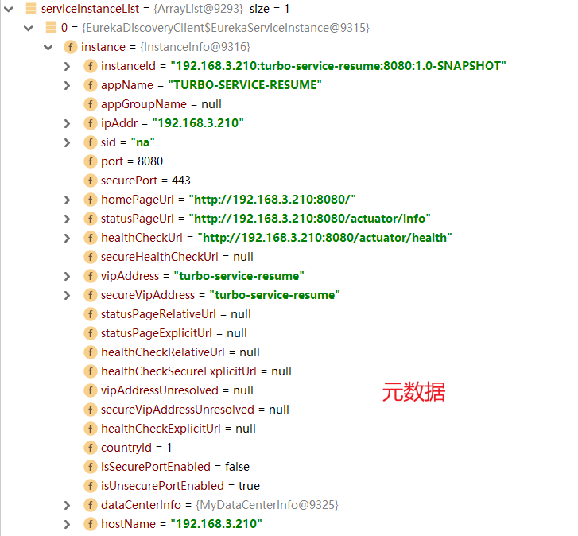

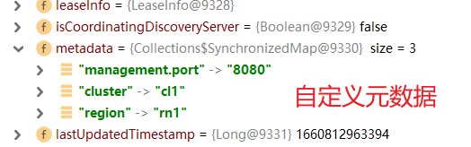

## 4.2 Eureka 客户端详解

服务提供者（也就是 Eureka 客户端）要向 Eureka Server 注册服务，并完成服务续约等工作。

### 4.2.1 服务注册详解（服务提供者）

1. 当我们导入了 eureka-client 依赖坐标，配置 Eureka 服务注册中心地址。
2. 服务在启动时会向注册中心发起注册请求，携带服务元数据信息。
3. Eureka 注册中心会把服务的信息保存在 Map 中。

### 4.2.2 服务续约详解（服务提供者）

服务每个30s会向注册中心续约（心跳）一次（也称为报活），如果没有续约，租约在90s后到期，然后服务会被失效。每隔30s的续约操作我们称之为心跳检测。

往往不需要我们调整这两个配置

```yaml
#向Eureka服务中⼼集群注册服务
eureka:
  instance:
    # 租约续约间隔时间，默认30秒
    lease-renewal-interval-in-seconds: 30
    # 租约到期，服务时效时间，默认值90秒,服务超过90秒没有发⽣⼼跳， EurekaServer会将服务从列表移除
    lease-expiration-duration-in-seconds: 90
```

### 4.2.3 获取服务列表详解（服务消费者）

每隔 30s 服务会从注册中心拉取一份服务列表，这个时间可以通过配置修改。往往不需要我们调整

```yaml
eureka:
  client:
    # 每隔30s拉取一次服务列表
    registry-fetch-interval-seconds: 30
```

1. 服务消费者启动时，从 eurekaServer服务列表获取只读备份，缓存到本地
2. 每隔 30s，会重新获取并更新数据
3. 每隔 30s 的时间可以通过配置 `eureka.client.registry-fetch-interval-seconds` 修改

## 4.3 Eureka 服务端详解

### 4.3.1 服务下线

1. 当服务正常关闭操作时，会发送服务下线的 REST 请求给 EurekaServer。
2. 服务中心接收到请求后，将该服务置为下线状态。

### 4.3.2 失败剔除

Eureka Server 会定时（间隔值是 `eureka.server.eviction-interval-timer-in-ms`，默认 60s ）进行检查，如果发现实例在一定时间（此值由客户端设置的 `eureka.instance.lease-expiration-duration-in-seconds` 定义，默认值为 90s）内没有收到心跳，则会注销此实例。

### 4.3.3 自我保护

服务提供者 -> 注册中心

定期的续约（服务提供者和注册中心通信），假如服务提供者和注册中心之间的网络有问题，不代表服务提供者不可用，不代表服务消费者无法访问服务提供者 。

如果在 15 分钟内超过 85% 的客户端节点都没有正常的心跳，那么 Eureka 就认为客户端与注册中心出现了网络故障，Eureka Server 自动进入自我保护机制。

为什么会有自我保护机制？

默认情况下，如果 Eureka Server 在一定时间内（默认90s）没有接收到某个微服务实例的心跳，Eureka Server 将会移除该实例。但是当网络分区故障发生时，微服务与 Eureka Server 之间无法正常通信，而微服务本身是正常运行的，此时不应该移除这个微服务，所以引入了自我保护机制。

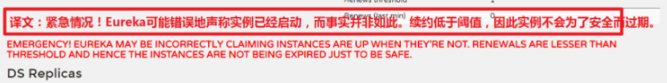

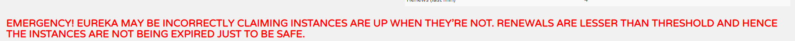

当处于自我保护模式时：

1.  不会剔除任何服务实例（可能是服务提供者和 EurekaServer 之间网络问题），保证了大多数服务依然可用

2. Eureka Server 仍然能够接收新服务的注册和查询请求，但是不会被同步到其他节点上，保证当前节点依然可用；当网络稳定时，当前 Eureka Server 新的注册信息会被同步到其他节点中。

3. 在 Eureka Server 工程中通过 `eureka.server.enable-self-preservation` 配置可用关停自我保护，默认值是打开。

   ```yaml
   eureka:
     server:
       enable-self-preservation: false # 关闭⾃我保护模式（缺省为打开）
   ```

**经验：建议生产环境打开自我保护机制**

# 5 Eureka 核心源码剖析

## 5.1 Eureka Server 启动过程

入口：SpringCloud 充分利用了 SpringBoot 的自动专配的特点

- 观察eureka-server的jar包，发现在META-INF下面有配置文件spring.factories

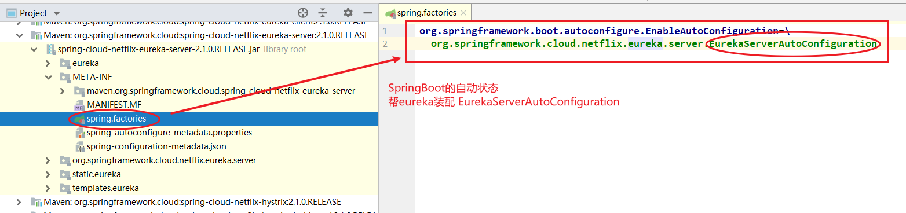

