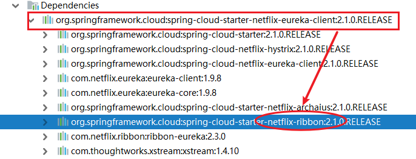
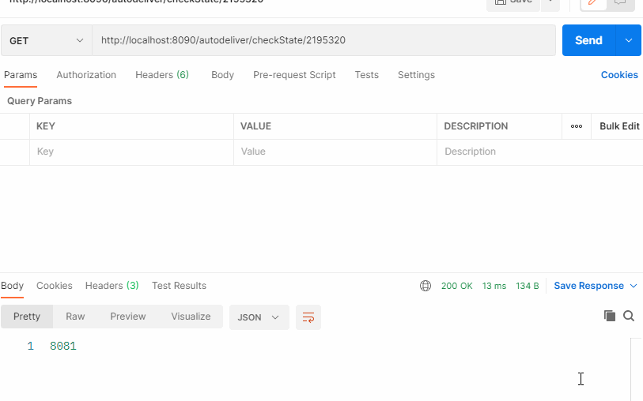

> 4-2 Ribbon 负载均衡

# 1 关于负载均衡

负载均衡一般分为 **服务器端负载均衡** 和 **客户端负载均衡**。

所谓 **服务器端负载均衡**，比如Nginx、F5 这些，请求到达服务器之后由这些负载均衡器根据一定的算法将请求路由到目标服务器处理。

所谓**客户端负载均衡**，比如我们要说的Ribbon，消费者客户客户都会有一个服务器地址列表，调用方在请求前通过一定负载均衡算法选择一个服务器进行访问，负载均衡算法的执行是在请求客户端进行。

Ribbon 是 Netflix 发布的负载均衡器。Eureka 一般配合 Ribbon 进行使用，Ribbon 利用从 Eureka 中读取到服务信息，在调用服务提供方服务的时候，会根据一定的算法进行负载均衡。


# 2 Ribbon 高级应用

不需要引入额外的 Jar 坐标，因为在服务消费者中我们引入过 eureka-client，它会引入 Ribbon 相关 jar。



代码 `turbo-service-autodeliver-8090` 中使用如下，在 RestTemplate 上添加对应注解即可

```java
@Bean
@LoadBalanced
public RestTemplate getRestTemplate(){
    return new RestTemplate();
}
```

修改服务提供者 `turbo-service-resume` api 返回值，返回当前实例的端口号，便于观察负载情况

```java
@RestController
@RequestMapping("/resume")
public class ResumeController { 
    @Value("${server.port}")
    private Integer port;

    @RequestMapping("/openState/{userId}")
    public Integer findDefaultResumeState(@PathVariable Long userId){
        return port;
    }
}
```

启动 `turbo-cloud-eureka-server`，`turbo-service-resume`，`turbo-service-autodeliver-8090`，使用 postman 测试：



# 3 Ribbon 负载均衡策略

# 4 Ribbon 核心源码剖析