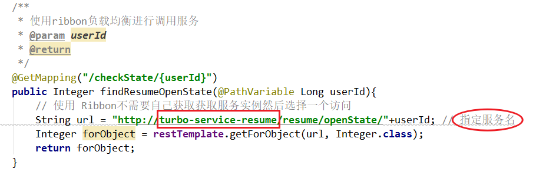
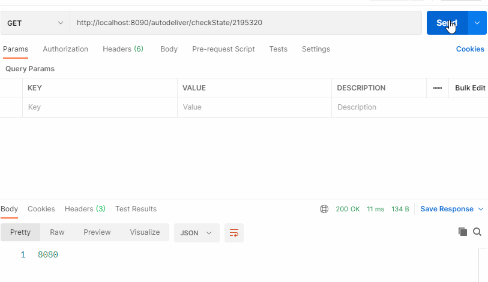
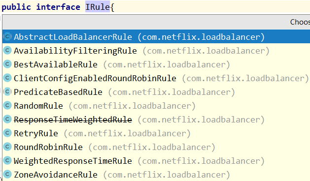
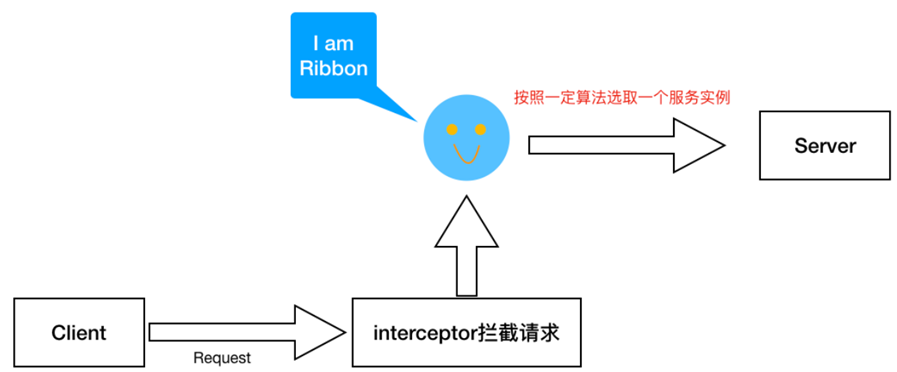
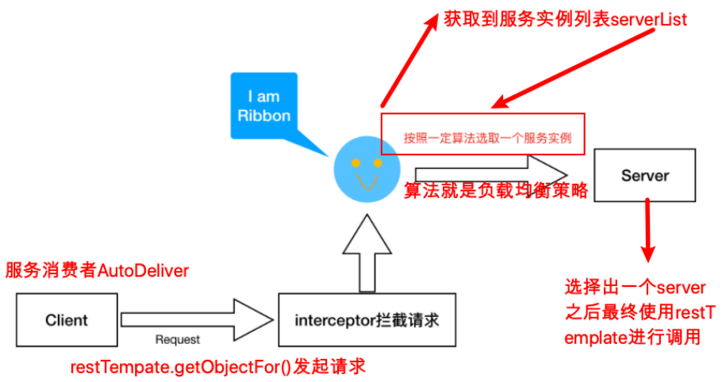
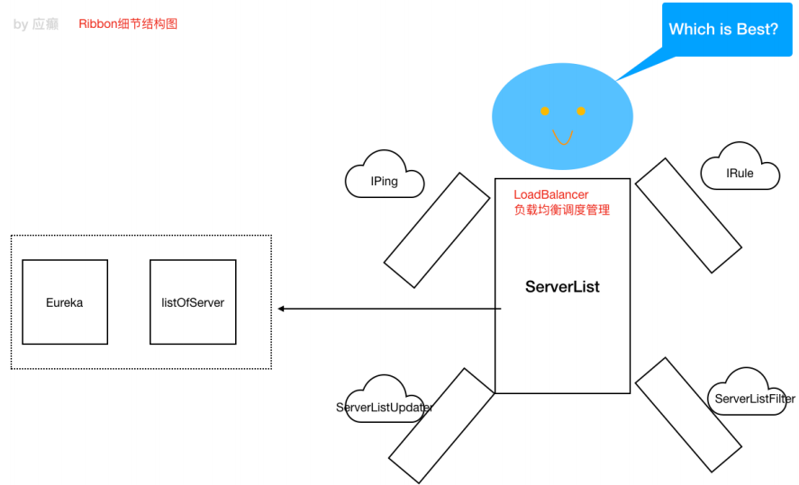

> 4-2 Ribbon 负载均衡

# 1 关于负载均衡

负载均衡一般分为 **服务器端负载均衡** 和 **客户端负载均衡**。

所谓 **服务器端负载均衡**，比如Nginx、F5 这些，请求到达服务器之后由这些负载均衡器根据一定的算法将请求路由到目标服务器处理。

所谓**客户端负载均衡**，比如我们要说的Ribbon，消费者客户客户都会有一个服务器地址列表，调用方在请求前通过一定负载均衡算法选择一个服务器进行访问，负载均衡算法的执行是在请求客户端进行。

Ribbon 是 Netflix 发布的负载均衡器。Eureka 一般配合 Ribbon 进行使用，Ribbon 利用从 Eureka 中读取到服务信息，在调用服务提供方服务的时候，会根据一定的算法进行负载均衡。


# 2 Ribbon 高级应用

不需要引入额外的 Jar 坐标，因为在服务消费者中我们引入过 eureka-client，它会引入 Ribbon 相关 jar。


代码 `turbo-service-autodeliver-8090` 中使用如下，在 RestTemplate 上添加对应注解即可

```java
@Bean
@LoadBalanced
public RestTemplate getRestTemplate(){
    return new RestTemplate();
}
```

修改服务提供者 `turbo-service-resume` api 返回值，返回当前实例的端口号，便于观察负载情况

```java
@RestController
@RequestMapping("/resume")
public class ResumeController { 
    @Value("${server.port}")
    private Integer port;

    @RequestMapping("/openState/{userId}")
    public Integer findDefaultResumeState(@PathVariable Long userId){
        return port;
    }
}
```

消费端：



启动 `turbo-cloud-eureka-server`，`turbo-service-resume`，`turbo-service-autodeliver-8090`，使用 postman 测试：




# 3 Ribbon 负载均衡策略

Ribbon 内置了很多中负载均衡策略，内部负责 负载均衡的顶级接口为 `com.netflix.loadbalancer.IRule`



| 负载均衡策略                                    | 描述                                                         |
| ----------------------------------------------- | ------------------------------------------------------------ |
| RoundRobinRule：轮询策略                        | 默认超过10次获取到的server都不可用，会返回一个空的server     |
| RandomRule：随机策略                            | 如果随机到的server为null或者不可用的话，会while不停的循环选取 |
| RetryRule：重试策略                             | 一定时限内循环重试。默认继承 RoundRobinRule ，也支持自定义注入，RetryRule 会在每次选举之后，对选举的 server 进行判断，是否为 null，是否 alive，并且在 500ms 内不停的选取判断，而RoundRobinRule 是没有失效时间的概念，只要 serverList 没有都挂 |
| BestAvailableRule：最小连接数策略               | 遍历 serverList，选取出可用的且连接数最小的一个server。该算法里面有一个 loadBalancerStats 的成员变量，会存储所有 server 的运行状态和连接数。如果选取到的 server 为 null，那么会调用 RoundRobinRule 重新选取。 |
| AvailabilityFilteringRule：可用过滤策略         | 扩展了轮询策略，会先通过默认的轮询选取一个 server，再去判断该 server 是否超时可用，当前连接数是否超限，都成功再返回。 |
| ZoneAvoidanceRule：区域权衡策略（**默认策略**） | 扩展了轮询策略，继承了 2 个过滤器：ZoneAvoidancePredicate和<br/>AvailabilityPredicate，除了过滤超时和链接数过 多的server，还会过滤掉不符合要求的zone区域 ⾥⾯的所有节点，AWS --ZONE 在⼀个区域/机房 内的服务实例中轮询 |

修改负载均衡策略

```yaml
#针对的被调⽤⽅微服务名称,不加就是全局⽣效
turbo-service-resume:
  ribbon:
    NFLoadBalancerRuleClassName: com.netflix.loadbalancer.RandomRule # 负载均衡策略调整
```


# 4 Ribbon 核心源码剖析

## 4.1 Ribbon 工作原理





**重点：Ribbon给restTemplate添加了一个拦截器**

思考：Ribbon在做什么：

当我们在访问 `http://turbo-service-resume/resume/openState/` 的时候，Ribbon 应该根据服务名 `turbo-service-resume` 获取到该服务的实例列表，并按照一定的负载均衡策略从实例列表中获取一个实例 server，并最终通过 RestTemplate 进行请求访问。

**Ribbon 细节结构图（设计到底层的一些组件/类的描述）**

1. 获取服务列表实例
2. 从列表中选择一个 server



图中核心是 **负载均衡管理器LoadBalancer（总的协调者，相当于大脑，为了做事情，协调四肢）**，围绕它周围的有 IRule、IPing 等。

- IRule：是在选择实例的时候的负载均衡策略对象
- IPing：是用来向服务发起心跳检测，通过心跳检测来判断该服务是否可用
- ServerListFilter：根据一些规则过滤传入的服务实例列表
- ServerListUpdater：定义了一系列的对服务列表的更新操作


