> 4-3 Hystrix 熔断器

属于一种容错机制

# 1 微服务中的雪崩效应

**什么是微服务中的雪崩效应呢？**

微服务中，一个请求可能需要多个微服务接口才能实现，会形成复杂的调用链路。


扇入：代表着该微服务被调用的次数，扇入大，说明该模块复用性好。

扇出：该微服务调用其他微服务的个数，扇出大，说明业务逻辑复杂。

扇入大是一个好事，扇出大不一定是好事。

在微服务架构中，一个应用可能会有多个微服务组成，微服务之间的数据交互通过**远程过程调用**（RPC）完成。这就带来一个问题：假设微服务A 调用 微服务B 和 微服务C，微服务B 和 微服务C 又调用其他的微服务，这就是所谓的“扇出”。如果扇出的链路上某个微服务的调用响应时间过程挥着不可用，对微服务A 的调用就会占用越来越多的系统资源，进而引起系统崩溃，所谓的 “雪崩效应”。

最下游 微服务响应时间过程，大量请求阻塞，大量线程不会释放，会导致服务器资源耗尽，，最终导致上游整个系统瘫痪。

# 2 雪崩效应解决方案

从可用性可靠性着想，为防止系统的整体缓慢甚至崩溃，采用的技术手段：

下面，介绍三种技术手段应对微服务中的雪崩效应，这三种手段都是从系统可用性、可靠性角度出发，尽量防止系统整体缓慢甚至瘫痪。

1. 服务熔断

   熔断机制是应对雪崩效应的一种微服务链路保护机制。

   当扇出链路的某个微服务不可用或者响应时间太长时，熔断该节点微服务的调用，进行服务的降级，快速返回错误的响应信息。当检测到该节点微服务调用响应正常后，恢复调用链路。

   **注意**：

   - 服务熔断重点在 **断**，切断对下游服务的调用
   - 服务熔断和服务降级往往是一起使用的，Hystrix 就是这样。

2. 服务降级

   通俗讲就是整体资源不够用，先将一些不关紧的服务停掉（调用我的时候，给你返回一个预留的值，也叫做**兜底数据**），待度过难关高峰过去，再把那些微服务打开。

   服务降级一般是从整体考虑，就是当某个服务熔断之后，服务器将不再被调用，此刻客户端可以自己准备一个本地的 fallback 回调，返回一个缺省值，这样做虽然服务水平下降，但好歹可用，比直接挂掉要强。

3. 服务限流

   限流的措施也很多，比如：

   - 限制总并发数（比如数据库连接池、线程池）
   - 限制瞬时并发数（如 nginx 限制瞬时并发连接数）
   - 限制时间窗口内的平均速率（如 Guava 的 RateLimiter、nginx的limit_req模块，限制每秒的平均速率）
   - 限制远程接口调用速率、限制 MQ 的消费速率等

# 3 Hystrix 简介

[Netflix Hystrix](https://github.com/Netflix/Hystrix/wiki)


Hystrix 主要通过以下几点实现延迟和容错。

- 包裹请求：使用 HystirxCommand 包裹对调用的依赖。
- 跳闸机制：当某服务的错误率超过一定的阈值时，Hystrix可以跳闸，停止请求该服务一段时间
- 资源隔离：Hystrix为每个依赖都维护了一个小型的线程池（舱壁模式）（或者信号量）。如果线程池已满，发往该依赖的请求就被立即拒绝，而不是排队等待，从而加速失败判定。
- 监控：Hystrix 可以近乎实时地监控运行指标和配置的变化，例如成功、失败、超时、以及被拒绝的请求等。
- 回退机制：当请求失败、超时、被拒绝，或当断路器打开时，执行回退逻辑。回退逻辑由开发人员自定提供，例如返回一个缺省值。
- 自我修复：断路器打开一段时间后，会自动进入“半开”状态。

# 4 Hystrix 熔断应用

目的：简历微服务长时间没有响应，服务消费者 -> **自动投递微服务**快速失败给用户提示。

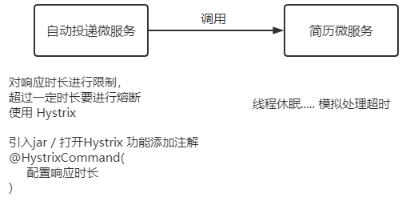

1. 服务消费者工程（`turbo-service-autodeliver-8092-hystrix`）中引入 Hystrix 依赖坐标（也可以添加在父工程中）

   ```xml
   <!--熔断器 Hystrix-->
   <dependency>
       <groupId>org.springframework.cloud</groupId>
       <artifactId>spring-cloud-starter-netflix-hystrix</artifactId>
   </dependency>
   ```

2. 服务消费者工程（`turbo-service-autodeliver-8092-hystrix`）的启动类中添加熔断器开启注解 `@EnableCircuitBreaker`

   ```java
   /**
    * 注解简化写法：@SpringCloudApplication = @SpringBootApplication + @EnableDiscoveryClient + @EnableCircuitBreaker
    **/
   @SpringBootApplication
   @EnableDiscoveryClient // 开启服务发现
   @EnableCircuitBreaker // 开启熔断
   public class AutoDeliverApplication8092 {
       public static void main(String[] args) {
           SpringApplication.run(AutoDeliverApplication8092.class,args);
       }
   
       @Bean
       @LoadBalanced // ribbon负载均衡
       public RestTemplate getRestTemplate(){
           return new RestTemplate();
       }
   }
   ```

3. 定义服务降级处理方法，并在业务方法上使用 `@HystrixCommand` 的 fallbacKMethod 属性关联到服务降级处理方法。

   ```java
   @RestController
   @RequestMapping("/autodeliver")
   public class AutodeliverController {
   
       @Autowired
       RestTemplate restTemplate;
     
       /**
        * 提供者模拟超时处理，调用方法添加 Hystrix 控制
        * http://localhost:8092/autodeliver/checkStateTimeout/2195320
        * @param userId
        * @return
        */
       // 使用 @HystrixCommand注解进行熔断控制
       @HystrixCommand(
               threadPoolKey = "findResumeOpenStateTimeout",
               threadPoolProperties = {
                       @HystrixProperty(name = "coreSize",value = "1"), // 线程数
                       @HystrixProperty(name = "maxQueueSize",value = "20") //等待队列长度
               },
               // commandProperties熔断的一些细节属性配置
               commandProperties = {
                       @HystrixProperty(name = "execution.isolation.thread.timeoutInMilliseconds",value = "2000")
               }
       )
       @GetMapping("/checkStateTimeout/{userId}")
       public Integer findResumeOpenStateTimeout(@PathVariable Long userId){
           // 使用 Ribbon不需要自己获取获取服务实例然后选择一个访问
           String url = "http://turbo-service-resume/resume/openState/"+userId; // 指定服务名
           Integer forObject = restTemplate.getForObject(url, Integer.class);
           return forObject;
       }
       
       // http://localhost:8092/autodeliver/checkStateTimeoutFallback/2195320
       @HystrixCommand(
               threadPoolKey = "findResumeOpenStateTimeoutFallback",
               threadPoolProperties = {
                       @HystrixProperty(name = "coreSize",value = "1"), // 线程数
                       @HystrixProperty(name = "maxQueueSize",value = "20") //等待队列长度
               },
               // commandProperties熔断的一些细节属性配置
               // com.netflix.hystrix.contrib.javanica.conf.HystrixPropertiesManager
               commandProperties = {
                       @HystrixProperty(name = "execution.isolation.thread.timeoutInMilliseconds",value = "2000"),
                       // hystrix 高级配置，定制工作过程细节
                       // 统计时间窗口定义
                       @HystrixProperty(name = "metrics.rollingStats.timeInMilliseconds",value = "8000"),
                       // 统计时间窗口内的最小请求数
                       @HystrixProperty(name = "circuitBreaker.requestVolumeThreshold",value = "2"),
                       // 统计时间窗口内的错误数量百分比阈值
                       @HystrixProperty(name = "circuitBreaker.errorThresholdPercentage",value ="50" ),
                       // 自我修复时的活动窗口长度
                       @HystrixProperty(name = "circuitBreaker.sleepWindowInMilliseconds",value = "3000")
               },fallbackMethod = "myFallback" // 回退方法
       )
       @GetMapping("/checkStateTimeoutFallback/{userId}")
       public Integer findResumeOpenStateTimeoutFallback(@PathVariable Long userId){
           // 使用 Ribbon不需要自己获取获取服务实例然后选择一个访问
           String url = "http://turbo-service-resume/resume/openState/"+userId; // 指定服务名
           Integer forObject = restTemplate.getForObject(url, Integer.class);
           return forObject;
       }
   
       /**
        * 定义回退方法，返回预设默认值
        * 注意：该方法形参和返回值与原始方法保持一致
        * @param userId
        * @return
        */
       public Integer myFallback(Long userId){
           return -1;
       }
   }
   ```

   **注意**：

   - 降级（兜底）方法必须和被降级方法相同的方法签名（相同参数列表、相同返回值）

4. 可以在类上使用 `@DefaultProperties` 注解统一指定整个类中公用的降级（兜底方法）。

5. 服务提供者模拟请求超时（线程休眠3s），只修改 8080 实例，对比观察

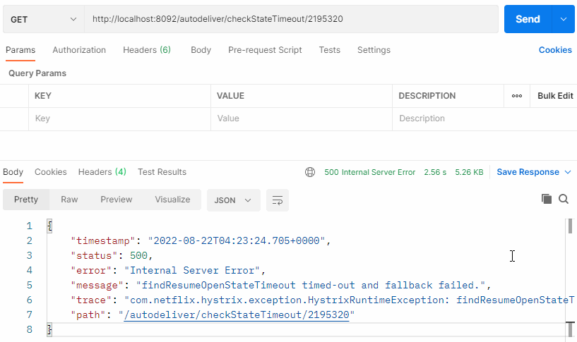

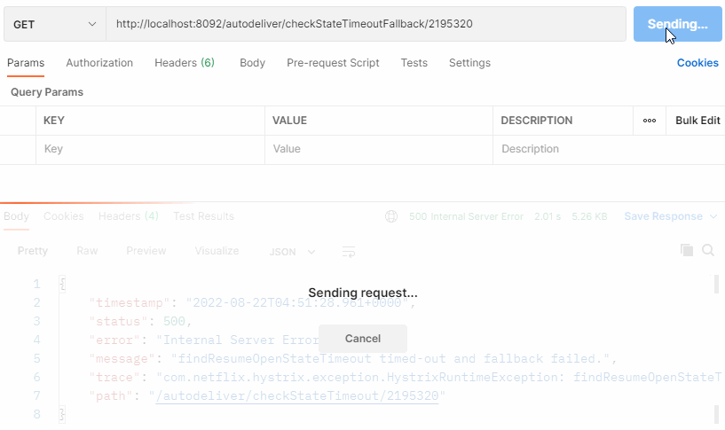

# 5 Hystrix 舱壁模式（线程池隔离策略）

为了避免问题服务请求过多导致正常服务无法访问，Hystrix 不是采用增加线程数，而是单独的为每一个控制方法创建一个线程池的方式，这种模式叫做 “舱壁模式”，也是线程隔离的手段。

# 6 Hystrix 工作流程与高级应用

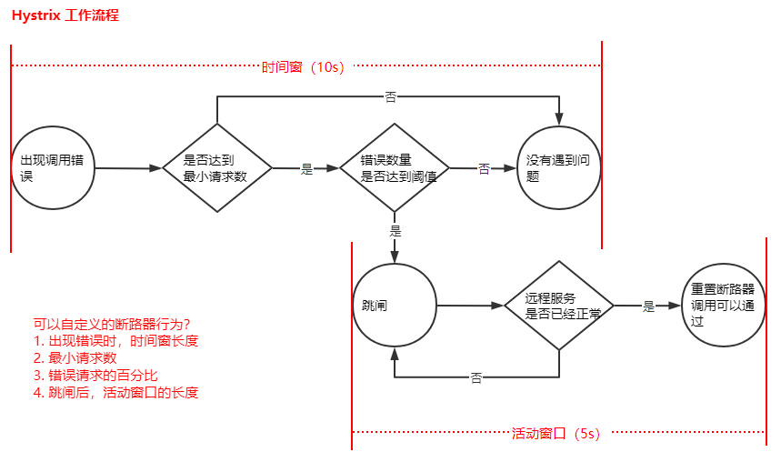

1. 当调用出现问题时，开启一个时间窗（10s）.

2. 在这个时间窗内，统计调用次数是否达到最小请求数？

   如果没有达到，则重置统计信息，回到第一步；

   如果达到了，则统计失败的请求数占所有请求数的百分比，是否达到阈值？

   如果达到，则跳闸（不再请求对应服务）；

   如果没有达到，则重置统计信息，回到第一步。

3. 如果跳闸，则会开启一个活动窗口（默认5s），每隔5s，Hystrix 会让一个请求通过，到达那个问题服务，看是否调用成功；如果成功，重置断路器回到第一步，如果失败，回到第三步。

```java
commandProperties = {
    /**
     * hystrix 高级配置，定制工作过程细节
     * 8s内，请求次数达到2个，并且失败率在50%以上美酒跳闸，
     * 跳闸后，活动窗口设置为 3s
     */
    // 统计时间窗口定义
    @HystrixProperty(name = "metrics.rollingStats.timeInMilliseconds",value = "8000"),
    // 统计时间窗口内的最小请求数
    @HystrixProperty(name = "circuitBreaker.requestVolumeThreshold",value = "2"),
    // 统计时间窗口内的错误数量百分比阈值
    @HystrixProperty(name = "circuitBreaker.errorThresholdPercentage",value ="50" ),
    // 自我修复时的活动窗口长度
    @HystrixProperty(name = "circuitBreaker.sleepWindowInMilliseconds",value = "3000")
}
```

上述通过注解进行的配置也可以配置在配置文件中。

```yaml
# 配置熔断策略：
hystrix:
  command:
    default:
      circuitBreaker:
        # 强制打开熔断器，如果该属性设置为true，强制断路器进⼊打开状态，将会拒绝所有的请求。默认false关闭的
        forceOpen: false
        # 触发熔断错误⽐例阈值，默认值50%
        errorThresholdPercentage: 50
        # 熔断后休眠时⻓，默认值5秒
        sleepWindowInMilliseconds: 3000
        # 熔断触发最⼩请求次数，默认值是20
        requestVolumeThreshold: 2
      execution:
        isolation:
          thread:
            # 熔断超时设置，默认为1秒
            timeoutInMilliseconds: 2000
```

基于 SpringBoot 的健康检查观察跳闸状态（自动投递微服务暴露健康检查细节）

```yml
# springboot中暴露健康检查等断点接口
management:
  endpoints:
    web:
      exposure:
        include: "*"
  # 暴露健康检查细节      
  endpoint:
    health:
      show-details: always
```

访问健康检查接口：http://localhost:8092/actuator/health （使用 postMan `get` 请求也可）

hystrix 正常工作状态：

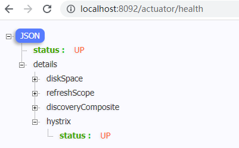

跳闸状态：

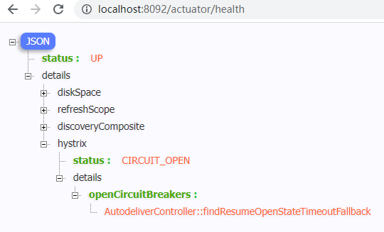

活动窗口内自我修复：


# 7 Hystrix Dashboard 断路监控仪表盘

[hystrix-dashboard 参考](https://github.com/Netflix-Skunkworks/hystrix-dashboard/wiki#using)

正常状态是 UP，跳闸是一种状态 CIRCUIT_OPEN，可以通过 /health 查看，前提是工程中需要引入 SpringBoot 的 actuator（健康监控），它提供了很多监控所需的接口，可以对应用系统进行配置查看，相关功能统计等。

已经统一添加在父工程中：

```xml
<!--Actuator可以帮助你监控和管理 Spring Boot应用-->
<dependency>
    <groupId>org.springframework.boot</groupId>
    <artifactId>spring-boot-starter-actuator</artifactId>
</dependency>
```

比如想看到 Hystrix 相关数据，比如有多少请求，多少成功，多少失败、多少降级等，那么引入 SpringBoot 健康监控之后，访问 `http://localhost:8092/actuator/hystrix.stream` 接口可以获取到监控的文字信息，但是不直观，所以 Hystrix 官方还提供了基于图形化的 DashBoard（仪表盘）监控平台。Hystrix 仪表板显示每隔断路器（被 `@HystrixCommand` 注解的方法）的状态。

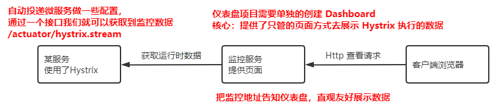

1. 新建一个 `turbo-cloud-hystrix-dashboard-9000` 监控服务工厂，导入依赖

   ```xml
   <dependency>
       <groupId>org.springframework.cloud</groupId>
       <artifactId>spring-cloud-starter-netflix-eureka-client</artifactId>
   </dependency>
   <dependency>
       <groupId>org.springframework.cloud</groupId>
       <artifactId>spring-cloud-starter-netflix-hystrix</artifactId>
   </dependency>
   <dependency>
       <groupId>org.springframework.cloud</groupId>
       <artifactId>spring-cloud-starter-netflix-hystrix-dashboard</artifactId>
   </dependency>
   ```

2. 启动类添加 `@EnableHystrixDashboard` 激活仪表盘

   ```java
   package com.turbo;
   
   import org.springframework.boot.SpringApplication;
   import org.springframework.boot.autoconfigure.SpringBootApplication;
   import org.springframework.cloud.client.discovery.EnableDiscoveryClient;
   import org.springframework.cloud.netflix.hystrix.dashboard.EnableHystrixDashboard;
   
   @SpringBootApplication
   @EnableDiscoveryClient
   @EnableHystrixDashboard //开启 hystrix dashboard
   public class HystrixDashboard9000 {
       public static void main(String[] args) {
           SpringApplication.run(HystrixDashboard9000.class,args);
       }
   }
   ```

3. application.yml

   ```yaml
   server:
     port: 9000
   spring:
     application:
       name: turbo-cloud-hystrix-dashboard
   
   eureka:
     client:
       service-url: #eureka server 的路径
         # 把所有 eureka 集群中的所有url都填写进来，可以只写一台，因为各个 eureka server 可以同步注册表
         defaultZone: http://TurboCloudEurekaServerB:8762/eureka,http://TurboCloudEurekaServerA:8761/eureka
     instance:
       #服务实例中显示ip，而不是显示主机名，(为了兼容老版本,新版本经过实验都是ip)
       prefer-ip-address: true
       # 实例名称： 192.168.1.3:turbo-service-autodeliver:8090  可以自定义实例显示格式，加上版本号，便于多版本管理，注意是ip-address，早期版本是ipAddress
       instance-id: ${spring.cloud.client.ip-address}:${spring.application.name}:${server.port}:@project.version@
   ```

4. 在被监控的 `turbo-service-autodeliver-8092-hystrix` 微服务中注册监控 servlet（在启动类中）（自动投递微服务，监控数据就是来自这个微服务）

   ```java
   /**
        * 在被监控的微服务中注册一个servlet,后期就是通过访问这个servlet来获取hystrix监控数据的
        * 前提：被监控的微服务需要引入springboot的actuator功能
        * @return
        */
   @Bean
   public ServletRegistrationBean getServlet(){
       HystrixMetricsStreamServlet streamServlet = new HystrixMetricsStreamServlet();
       ServletRegistrationBean registrationBean = new ServletRegistrationBean(streamServlet);
       registrationBean.setLoadOnStartup(1);
       registrationBean.addUrlMappings("/actuator/hystrix.stream");
       registrationBean.setName("HystrixMetricsStreamServlet");
       return registrationBean;
   }
   ```

启动相关微服务：

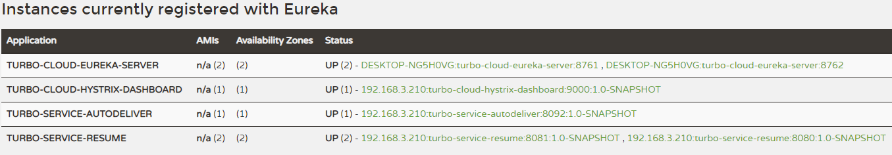

可以直接访问监控 servlet，但是得到的数据并不直观，后期可以结合仪表盘更友好的展示：

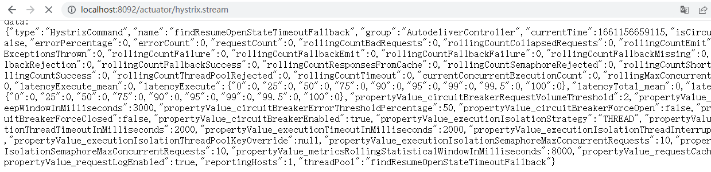

直接访问：http://localhost:9000/hystrix

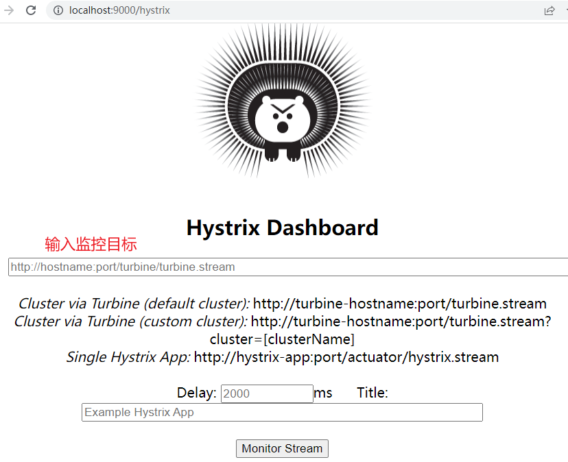

输入监控的微服务端点地址，展示监控的详细数据，比如监控服务消费者：http://localhost:8092/actuator/hystrix.stream

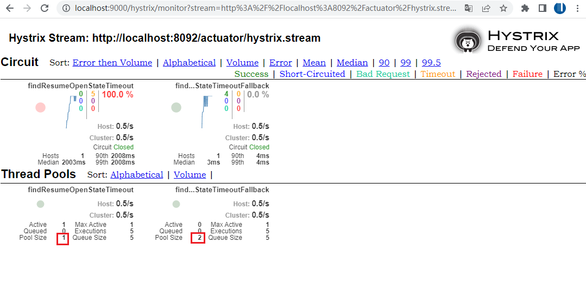

百分比，10s 内错误请求百分比

实心圆：

- 大小：代表请求流量的大小，流量越大球越大。
- 颜色，代表请求处理的健康状态，从绿色到红色递减，绿色代表健康，红色就代表很不健康。

# 8 Hystrix Turbine 聚合监控

之前，我们针对的是一个微服务实例Hystrix数据查询分析，在微服务架构下，一个微服务的实例往往是多个（集群化）

比如 自动投递微服务：

实例1(hystrix)：ip1:port1/actuator/hystrix.stream<br>实例2(hystrix)：ip2:port2/actuator/hystrix.stream<br>实例3(hystrix)：ip3:port3/actuator/hystrix.stream

这时候可以使用 Hystrix Turbine 聚合（聚合各个实例上的 hystrix 监控数据）监控。

> 思考：微服务架构下，一个微服务往往部署多个实例，如果每次只能查看单个实例的监控，就需要经常切换，很不方便。在这样的场景下我们可以使用 Hystrix Turbine 进行聚合监控，它可以把相关微服务的监控数据聚合在一起，便于查看。

**Turbine服务搭建**

1. 新建项目 `turbo-cloud-hystrix-turbine-9001`，引入依赖坐标

   ```xml
   <!--hystrix turbine 聚合监控-->
   <dependency>
       <groupId>org.springframework.cloud</groupId>
       <artifactId>spring-cloud-starter-netflix-turbine</artifactId>
   </dependency>
   
   <!--
       引入eureka客户端的两个原因
       1、微服务架构下的服务尽量都注册到服务中心，便于统一管理
       2、后续在当前turbine项目中，需要配置turbine聚合服务，比如聚合
          turbo-service-autodeliver这个服务各个实例的hystrix数据流，随后就需要在
          application.yml文件中配置这个服务名，那么turbine获取服务下具体实例的数据流的
          时候，需要ip和端口等实例信息，那么怎么获取？
             当然是从eureka服务注册中心获取
   -->
   <dependency>
       <groupId>org.springframework.cloud</groupId>
       <artifactId>spring-cloud-starter-netflix-eureka-client</artifactId>
   </dependency>
   ```

2. 讲需要进行 Hystrix 监控的多个微服务配置起来，在 application.yml 中开启 Turbine 及进行相关配置。

   ```yaml
   server:
     port: 9001
   spring:
     application:
       name: turbo-cloud-hystrix-turbine
   
   eureka:
     client:
       service-url: #eureka server 的路径
         # 把所有 eureka 集群中的所有url都填写进来，可以只写一台，因为各个 eureka server 可以同步注册表
         defaultZone: http://TurboCloudEurekaServerB:8762/eureka,http://TurboCloudEurekaServerA:8761/eureka
     instance:
       #服务实例中显示ip，而不是显示主机名，(为了兼容老版本,新版本经过实验都是ip)
       prefer-ip-address: true
       # 实例名称： 192.168.1.3:turbo-service-autodeliver:8090  可以自定义实例显示格式，加上版本号，便于多版本管理，注意是ip-address，早期版本是ipAddress
       instance-id: ${spring.cloud.client.ip-address}:${spring.application.name}:${server.port}:@project.version@
   
   turbine:
     # appCofing配置需要聚合的服务名称，⽐如这⾥聚合⾃动投递微服务的hystrix监控 数据
     # 如果要聚合多个微服务的监控数据，那么可以使⽤英⽂逗号拼接，⽐如 a,b,c
     app-config: turbo-service-autodeliver
     cluster-name-expression: "'default'" # 集群默认名称
   ```

3. 在当前项目的启动类上添加注解 `@EnableTurbine`，开启仪表盘 以及 Turbine 聚合。

   ```java
   package com.turbo;
   
   import org.springframework.boot.SpringApplication;
   import org.springframework.boot.autoconfigure.SpringBootApplication;
   import org.springframework.cloud.client.discovery.EnableDiscoveryClient;
   import org.springframework.cloud.netflix.turbine.EnableTurbine;
   
   
   @SpringBootApplication
   @EnableDiscoveryClient
   @EnableTurbine // 开启 turbine 聚合
   public class HystrixTurbineApplication9001 {
       public static void main(String[] args) {
           SpringApplication.run(HystrixTurbineApplication9001.class,args);
       }
   }
   ```

启动相关微服务：

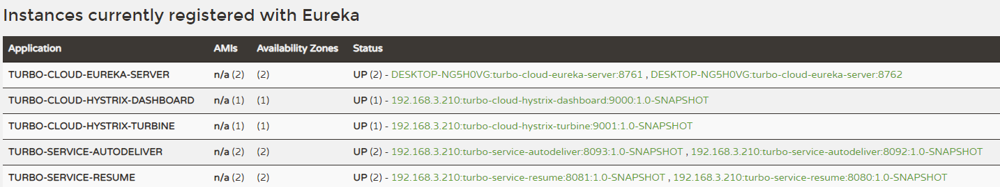

浏览器访问 Turbine 项目，http://localhost:9001/turbine.stream，就可以看到监控数据了：

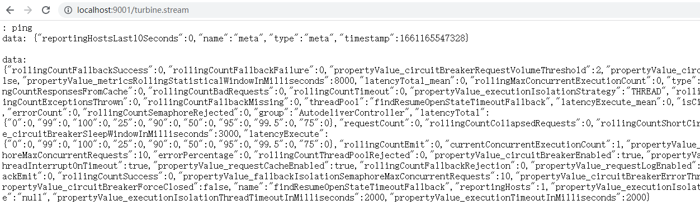

通过 dashboard 的页面查看数据更直观，把刚才的地址输入 dashboard 地址栏：

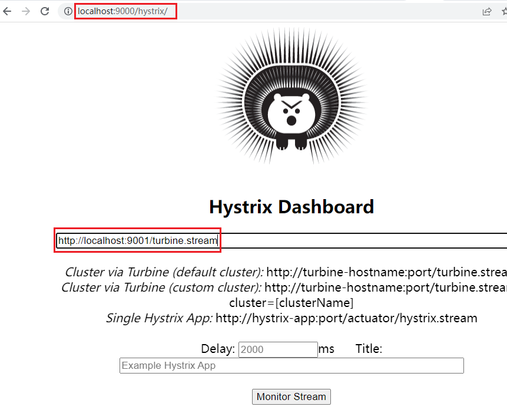

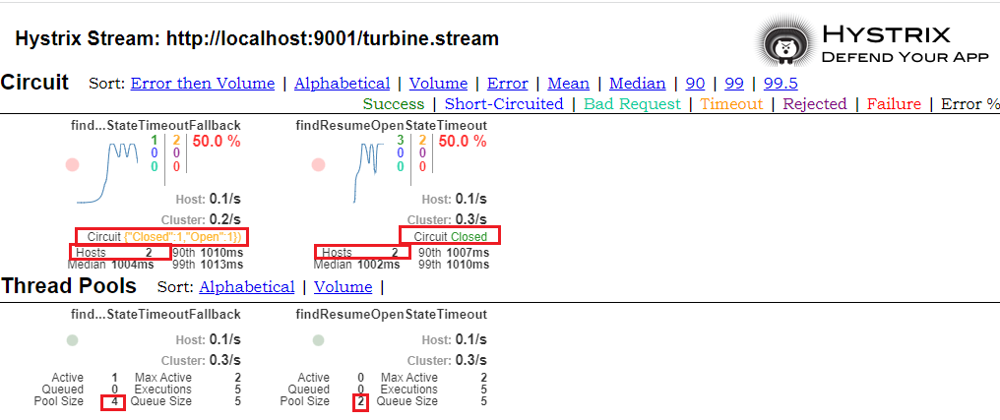

# 9 Hystrix 核心源码剖析


