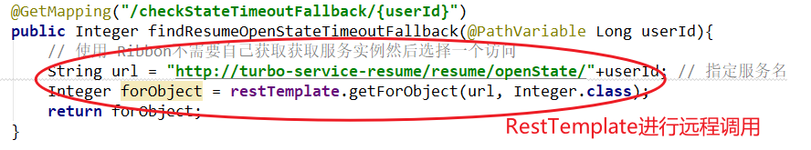

> 4-4 Feign 远程调用组件

服务消费者调用服务提供者的时候使用 RestTemplate 技术

存在不便之处：

1. 拼接 url。
2. restTemplate.getForObject

两处代码都比较模板化，能不能不让我们来写这种模板化的东西。另外老说，拼接 url 非常的 low，拼接字符串，拼接参数，很low 还容易出错。

# 1 Feign 简介

Feign **是 Netflix 开发的一个轻量级 RESTful 的 HTTP 服务客户端（用它来发起请求，远程调用的）**，是以 Java 接口注解的方式调用 Http 请求，而不用像 Java 中通过封装 HTTP 请求报文的方式直接调用，Feign 被广泛应用在 Spring Cloud 的解决方案中。

类似于 Dubbo，服务消费者拿到服务提供者的接口，然后像调用本地接口方法一样去调用，实际发出的是远程的请求。

- Feign 可帮助我们更加便捷，优雅的调用 HTTP API；不需要我们去拼接 url，然后调用 restTemplate 的 api。在 SpringCloud 中，使用 Feign 非常简单，创建一个接口（在消费者-服务调用方这一段），并在接口上添加一些注解，代码就完成了。
- SpringCloud 对 Feign 进行了增强，使 Feign 支持了 SpringMVC 注解（OpenFeign）

**本质：封装了 Http 调用流程，更符合面向接口话的编程习惯，类似于 Dubbo 的服务调用**

Dubbo 的调用方式其实就是很好的面向接口编程。

# 2 Feign 配置应用

# 3 Feign 对负载均衡的支持

# 4 Feign 对熔断器的支持

# 5 Feign 对请求压缩和响应压缩的支持

# 6 Feign 的日志级别配置

# 7 Feign 核心源码剖析