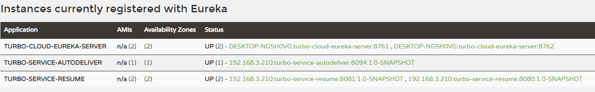
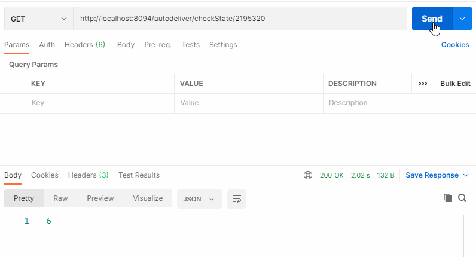
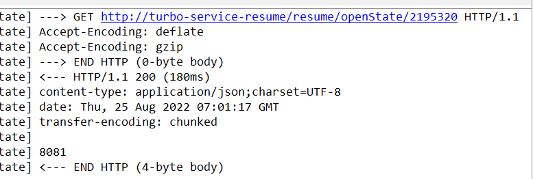

> 4-4 Feign 远程调用组件

服务消费者调用服务提供者的时候使用 RestTemplate 技术


存在不便之处：

1. 拼接 url。
2. restTemplate.getForObject

两处代码都比较模板化，能不能不让我们来写这种模板化的东西。另外老说，拼接 url 非常的 low，拼接字符串，拼接参数，很low 还容易出错。

# 1 Feign 简介

Feign **是 Netflix 开发的一个轻量级 RESTful 的 HTTP 服务客户端（用它来发起请求，远程调用的）**，是以 Java 接口注解的方式调用 Http 请求，而不用像 Java 中通过封装 HTTP 请求报文的方式直接调用，Feign 被广泛应用在 Spring Cloud 的解决方案中。

类似于 Dubbo，服务消费者拿到服务提供者的接口，然后像调用本地接口方法一样去调用，实际发出的是远程的请求。

- Feign 可帮助我们更加便捷，优雅的调用 HTTP API；不需要我们去拼接 url，然后调用 restTemplate 的 api。在 SpringCloud 中，使用 Feign 非常简单，创建一个接口（在消费者-服务调用方这一段），并在接口上添加一些注解，代码就完成了。
- SpringCloud 对 Feign 进行了增强，使 Feign 支持了 SpringMVC 注解（OpenFeign）

**本质：封装了 Http 调用流程，更符合面向接口话的编程习惯，类似于 Dubbo 的服务调用**

Dubbo 的调用方式其实就是很好的面向接口编程。

# 2 Feign 配置应用

在服务调用者工程（消费）创建接口（添加注解）（效果）Feign = RestTemplate + Ribbon + Hystrix

1. 服务消费者工程（）中引入 Feign 依赖（或者父工程）

   ```xml
   <dependency>
       <groupId>org.springframework.cloud</groupId>
       <artifactId>spring-cloud-starter-openfeign</artifactId>
   </dependency>
   ```

2. 服务消费者工程（自动投递微服务）启动类使用注解 `@EnableFeignClients` 添加 Feign 支持

   ```java
   @SpringBootApplication
   @EnableDiscoveryClient // 开启服务发现
   @EnableFeignClients // 开启 Feign
   public class AutoDeliverApplication8094 {
       public static void main(String[] args) {
           SpringApplication.run(AutoDeliverApplication8094.class,args);
       }
   }
   ```

   注意：此时去掉 Hystrix 熔断的支持注解 `@EnableCircuitBreaker` 即可，包括引入的依赖，因为 Feign 会自动引入。

3. 创建 Feign 接口

   ```java
   package com.turbo.service;
   
   import org.springframework.cloud.openfeign.FeignClient;
   import org.springframework.web.bind.annotation.GetMapping;
   import org.springframework.web.bind.annotation.PathVariable;
   
   // http://turbo-service-resume/resume/openState/
   // name: 调用服务名称，和服务提供者 yml 文件中 spring.application.name 保持一致
   @FeignClient(name = "turbo-service-resume")
   public interface ResumeServiceFeignClient {
       // 调用请求路径
       @GetMapping("/resume/openState/{userId}")
       public Integer findResumeOpenState(@PathVariable Long userId);
   }
   ```

   注意：

   - `@FeignClient` 注解的 name 属性用于指定要调用的服务提供者名称，和服务提供者 yml 文件中 spring.application.name 保持一致。
   - 接口中的接口方法，就好比是远程服务提供者 Controller 中的 Handler 方法（只不过如同本地调用了），那么在进行参数绑定时，可以使用 `@PathVariable`、`@RequestParam`、`@RequestHeader` 等，这也是 OpenFeign 对 SpringMVC 注解的支持，但是需要注意 value 必须设置，否则会抛出异常

4. 使用接口中方法完成远程调用（注入接口即可，实际注入的是接口的实现）

   ```java
   @RestController
   @RequestMapping("/autodeliver")
   public class AutodeliverController {
   
       @Autowired
       ResumeServiceFeignClient resumeServiceFeignClient;
       
       // http://localhost:8094/autodeliver/checkState/2195320
       // http://turbo-service-resume/resume/openState/
       @GetMapping("/checkState/{userId}")
       public Integer findResumeOpenState(@PathVariable Long userId){
           return resumeServiceFeignClient.findResumeOpenState(userId);
       }
   }
   ```

   

# 3 Feign 对负载均衡的支持

Feign 本身已经集成了 Ribbon 依赖和自动配置，因此我们不需要额外引入依赖，可以通过 ribbon.xx 来进行全局配置，也可以通过 服务名.ribbon.xx 来对指定服务进行细节配置。

Feign 默认的请求处理超时时长 1s，有时候我们的业务确实执行需要一定时间，那么这个时候，我们就需要调整处理超时时长，Feign 自己有超时设置，如果配置 Ribbon 的超时，则会以 Ribbon 的为准。

Ribbon 设置

```yaml
#针对的被调⽤⽅微服务名称,不加就是全局⽣效
turbo-service-resume:
  ribbon:
    #请求连接超时时间
    ConnectTimeout: 2000
    #请求处理超时时间
    ReadTimeout: 3000  #Feign超时时长设置
    #对所有操作都进⾏重试
    OkToRetryOnAllOperations: true
    ####根据如上配置，当访问到故障请求的时候，它会再尝试访问⼀次当前实例（次数 由MaxAutoRetries配置），
    ####如果不⾏，就换⼀个实例进⾏访问，如果还不⾏，再换⼀次实例访问（更换次数 由MaxAutoRetriesNextServer配置），
    ####如果依然不⾏，返回失败信息。
    MaxAutoRetries: 0 #对当前选中实例重试次数，不包括第⼀次调⽤
    MaxAutoRetriesNextServer: 0 #切换实例的重试次数
    NFLoadBalancerRuleClassName: com.netflix.loadbalancer.RoundRobinRule #负载策略调整
```


# 4 Feign 对熔断器的支持

1. 在 Feign 客户端工程配置文件（application.yml）中开启 Feign 对熔断器的支持

   ```yaml
   # 开启Feign 熔断功能
   feign:
     hystrix:
       enabled: true
   ```

   Feign 的超时时长设置 其实就是上面 Ribbon 的超时时长设置

   Hystrix 超时时长设置（就按照之前 Hystrix 设置的方式就 OK 了）

   ```yaml
   # 配置熔断策略：
   hystrix:
     command:
       default:
         execution:
           isolation:
             thread:
               # 熔断超时设置，默认为1秒
               timeoutInMilliseconds: 2000
   ```

   注意：

   - 开启 Hystrix 之后，Feign 中的方法都会被进行一个管理，一旦出现问题就进入对应的回退逻辑处理
   - 针对超时这一点，当前有两个超时时间设置（Feign/hystrix），熔断的时候是根据这两个时间的最小值来进行的，及处理时长超过最短的那个超时时间了就熔断进入回退降级逻辑。

2. 自定义FallBack 处理类（需要实现 FeignClient 接口）

   ```java
   package com.turbo.service;
   
   import org.springframework.stereotype.Component;
   
   /**
    * 降级回退逻辑需要定义一个类，实现 FeignClient 接口，实现接口中的方法
    **/
   @Component // 不要忘了这个注解，还应该被扫描倒
   public class ResumeFallback implements ResumeServiceFeignClient {
       @Override
       public Integer findResumeOpenState(Long userId) {
           return -6;
       }
   }
   ```

3. 在 `@FeignClient` 注解中关联 步骤二中自定义的处理类

   ```java
   // http://turbo-service-resume/resume/openState/
   // name: 调用服务名称，和服务提供者 yml 文件中 spring.application.name 保持一致
   @FeignClient(name = "turbo-service-resume",fallback = ResumeFallback.class,path = "/resume")
   // 使用 fallback 的时候，类上的 @RequestMapping 的 url 前缀限定，改成配置在 @FeignClient 的 path 属性中
   //@RequestMapping("/resume")
   public interface ResumeServiceFeignClient {
       // 调用请求路径
       @GetMapping("/openState/{userId}")
       public Integer findResumeOpenState(@PathVariable Long userId);
   }
   ```

   


启动相关微服务，其中 `turbo-service-resume-8080` ，线程休眠 3s。






# 5 Feign 对请求压缩和响应压缩的支持

Feign 支持对请求和响应进行 GZIP 压缩，以减少通信过程中的性能损耗。通过下面的参数，即可开启请求与响应的压缩功能：

```yaml
feign:
  compression:
    request:
      enabled: true # 开启请求压缩
      mime-types: text/xml,application/xml,application/json #设置压缩的数据类型。此处是默认值
      min-request-size: 2048 # 设置触发压缩的大小下限，此处也是默认值
    response:
      enabled: true # 开启响应压缩
```


# 6 Feign 的日志级别配置

[feign logging 官网参考](https://docs.spring.io/spring-cloud-openfeign/docs/current/reference/html/#feign-logging)

Feign 是 http 请求客户端，类似于咱们的浏览器，它在请求和接收响应的时候，可以打印出比较详细的一些日志信息（响应头，状态码等等）。

如果我们想看到 Feign 请求的日志，我们可以进行配置，默认情况下 Feign 的日志没有开启。


1. 开启Feign 日志功能及级别

   ```java
   package com.turbo.config;
   
   import feign.Logger;
   import org.springframework.context.annotation.Bean;
   import org.springframework.context.annotation.Configuration;
   
   /**
    * @author yutao
    * Feign的日志级别（Feign 请求过程信息）
    * NONE：默认的，不显示任何日志 ---- 性能最好
    * BASIC：仅记录请求方法、URL、响应状态码 以及 执行时间 ---- 生产问题追踪
    * HEADERS: 在 BASIC 级别的基础上，记录请求和响应的 header
    * FULL：记录请求和响应的 header、body 和 元数据 ---- 适用于开发及测试环境定位问题
    **/
   @Configuration
   public class FeignConfig {
   
       @Bean
       Logger.Level feignLevel(){
           return Logger.Level.FULL;
       }
   }
   ```

2. 配置 log 日志界别为 debug

   ```yaml
   logging:
     level:
       # feign 日志只会对日志级别为 debug 的做出响应
       com.turbo.service.ResumeServiceFeignClient: debug
   ```




# 7 Feign 核心源码剖析