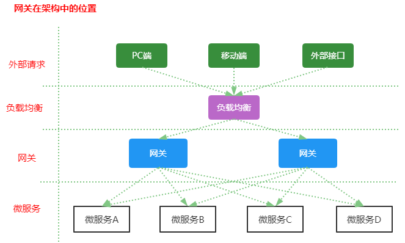
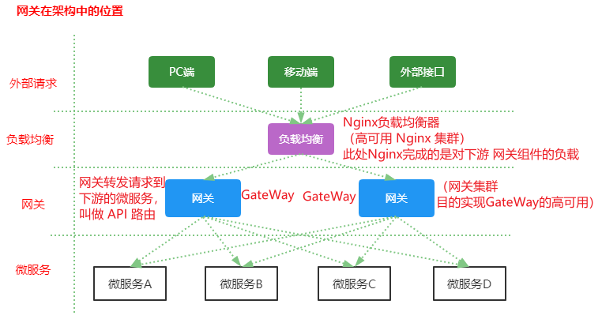
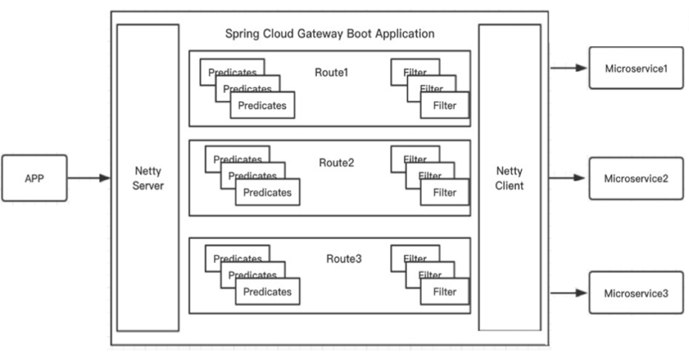
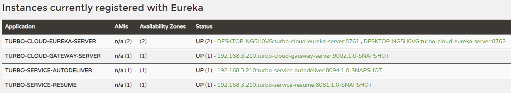
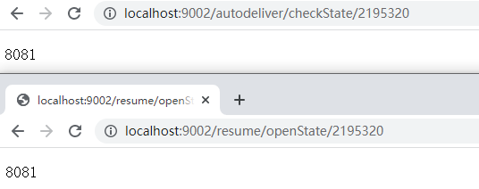
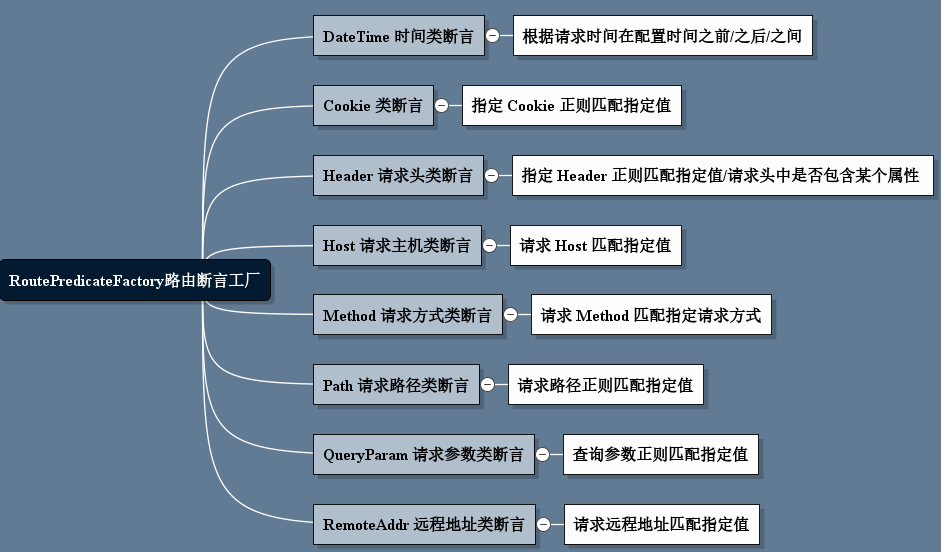
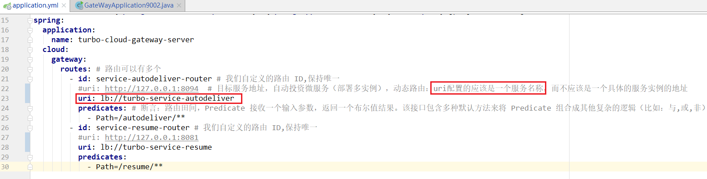
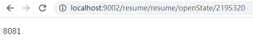
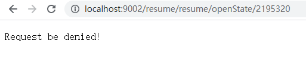

> 4-5 GateWay 网关组件

网关（翻译过来就叫做 GateWay）：微服务架构中的重要组成部分。

局域网中就有网关这个概念，局域网接收接收或者发送数据出去通过这个网关，比如用 Vmware  虚拟机软件搭建虚拟机集群的时候，往往我们只需要选择 IP 段中的一个 IP 作为网关地址。

我们学习的 GateWay （Spring Cloud GateWay 他只是众多网关解决方案中的一种）

# 1 GateWay 简介

[Spring Cloud GateWay](https://spring.io/projects/spring-cloud-gateway) 是 Spring Cloud 的一个全新项目，目标是取代 Netflix Zuul，它基于 Spring 5.0 + SpringBoot 2.0 + WebFlux（基于高性能的Reactor模式响应式通信框架 Netty，异步非阻塞模型）等技术开发，性能高于 Zuul，官方测试，GateWay 是 Zuul 的 1.6 倍，旨在为微服务架构提供一种简单有效的统一的 API 路由管理方式。

Spring Cloud GateWay 不仅提供统一的路由方式（反向代理）并且基于 Filter（定义过滤器对请求过滤，完成一些功能）链的方式提供了网关基本的功能，例如：鉴权、流量控制、熔断、路径重写、日志监控等。






# 2 GateWay 核心概念

Zuul1.x 阻塞式I/O；2.x 基于 Netty。

Spring Cloud GateWay 天生就是异步非阻塞的，基于 Reactor 模型。

一个请求 --> 网关根据一定的条件匹配 --> 匹配成功之后可以将请求转发到指定的服务地址；而在这个过程中，我们可以进行一些比较具体的控制（限流、日志、黑白名单）。

- 路由（route）：网关最基础的部分，也就是网关比较基础的工作单元。路由 由一个 ID、一个目标 URL（最终路由到的地址）、一系列的断言（匹配条件判断）和 Filter 过滤器（精细化控制）组成。如果断言为 true，则匹配该路由。
- 断言（predicates）：参考了 Java8 中的断言 java.util.function.Predicate，开发人员可以匹配 Http 请求中的所有内容（包括请求头，请求参数等）（类似于nginx中的location匹配一样），如果断言与请求相匹配 则路由。
- 过滤器（filter）：一个标准的Spring webFilter，使用过滤器，可以在请求之前 或者之后执行业务逻辑。

来自官网的一张图：



其中，Predicates 断言就是我们的匹配条件，而 Filter 就可以理解为一个无所不能的拦截器，有了这两个元素，结合目标 URL，就可以实现一个具体的路由转发。

# 3 GateWay 工作过程（How It Works）

[How It Works](https://docs.spring.io/spring-cloud-gateway/docs/current/reference/html/#gateway-how-it-works)


来自官方的描述图。

客户端向 Spring Cloud GateWay 发出请求，然后在 GateWay Handler Mapping 中找到与请求相匹配的路由，将其发送到 GateWay Web Handler ；Handler 再通过指定的过滤器链来将请求发送到我们实际的服务执行业务逻辑，然后返回。过滤器之间用虚线分开是因为过滤器可能会在发送代理请求之前（pre）或者之后（post）执行业务逻辑。

Filter 在 “pre” 类型过滤器中可以做参数检验、权限校验、流量监控、日志输出、协议转换等。在 “post” 类型的过滤器中可以做响应内容、响应头的修改、日志的输出、流量监控等。

**GateWay 核心逻辑：路由转发 + 执行过滤器链**


# 4 GateWay 应用

使用网关对自动投递微服务进行代理（添加在它的上游，相当于隐藏列具体微服务的信息，对外暴露的是网关）。

1. 创建工程 `turbo-cloud-gateway-server-9002` （单独一个 module，不作为 `turbo-parent` 的子module）导入依赖

   GateWay 不要使用 web 模块，它引入的是 WebFlux（类似于 SpringMVC）

   ```xml
   <?xml version="1.0" encoding="UTF-8"?>
   <project xmlns="http://maven.apache.org/POM/4.0.0"
            xmlns:xsi="http://www.w3.org/2001/XMLSchema-instance"
            xsi:schemaLocation="http://maven.apache.org/POM/4.0.0 http://maven.apache.org/xsd/maven-4.0.0.xsd">
       <modelVersion>4.0.0</modelVersion>
   
       <groupId>com.turbo</groupId>
       <artifactId>turbo-cloud-gateway-server-9002</artifactId>
       <version>1.0-SNAPSHOT</version>
   
       <!--Spring boot 父启动器依赖-->
       <parent>
           <groupId>org.springframework.boot</groupId>
           <artifactId>spring-boot-starter-parent</artifactId>
           <version>2.1.6.RELEASE</version>
       </parent>
   
       <dependencies>
           <dependency>
               <groupId>org.springframework.cloud</groupId>
               <artifactId>spring-cloud-commons</artifactId>
           </dependency>
           <dependency>
               <groupId>org.springframework.cloud</groupId>
               <artifactId>spring-cloud-starter-netflix-eureka-client</artifactId>
           </dependency>
           <!--网关-->
           <dependency>
               <groupId>org.springframework.cloud</groupId>
               <artifactId>spring-cloud-starter-gateway</artifactId>
           </dependency>
           <!--引入webflux-->
           <dependency>
               <groupId>org.springframework.boot</groupId>
               <artifactId>spring-boot-starter-webflux</artifactId>
           </dependency>
           <!--日志依赖-->
           <dependency>
               <groupId>org.springframework.boot</groupId>
               <artifactId>spring-boot-starter-logging</artifactId>
           </dependency>
           <!--测试依赖-->
           <dependency>
               <groupId>org.springframework.boot</groupId>
               <artifactId>spring-boot-starter-test</artifactId>
               <scope>test</scope>
           </dependency>
           <!--lombok工具-->
           <dependency>
               <groupId>org.projectlombok</groupId>
               <artifactId>lombok</artifactId>
               <version>1.18.4</version>
               <scope>provided</scope>
           </dependency>
   
           <!--引入jaxb,开始-->
           <dependency>
               <groupId>com.sun.xml.bind</groupId>
               <artifactId>jaxb-core</artifactId>
               <version>2.2.11</version>
           </dependency>
           <dependency>
               <groupId>javax.xml.bind</groupId>
               <artifactId>jaxb-api</artifactId>
           </dependency>
           <dependency>
               <groupId>com.sun.xml.bind</groupId>
               <artifactId>jaxb-impl</artifactId>
               <version>2.2.11</version>
           </dependency>
           <dependency>
               <groupId>org.glassfish.jaxb</groupId>
               <artifactId>jaxb-runtime</artifactId>
               <version>2.2.10-b140310.1920</version>
           </dependency>
           <dependency>
               <groupId>javax.activation</groupId>
               <artifactId>activation</artifactId>
               <version>1.1.1</version>
           </dependency>
           <!--引入jaxb,结束-->
   
           <!--Actuator 可以把帮助你监控和管理 Spring Boot 应用-->
           <dependency>
               <groupId>org.springframework.boot</groupId>
               <artifactId>spring-boot-starter-actuator</artifactId>
           </dependency>
           <!--热部署-->
           <dependency>
               <groupId>org.springframework.boot</groupId>
               <artifactId>spring-boot-devtools</artifactId>
               <optional>true</optional>
           </dependency>
       </dependencies>
   
       <dependencyManagement>
           <!--spring cloud 依赖版本管理-->
           <dependencies>
               <dependency>
                   <groupId>org.springframework.cloud</groupId>
                   <artifactId>spring-cloud-dependencies</artifactId>
                   <version>Greenwich.RELEASE</version>
                   <type>pom</type>
                   <scope>import</scope>
               </dependency>
           </dependencies>
       </dependencyManagement>
   
       <build>
           <plugins>
               <!--编译插件-->
               <plugin>
                   <groupId>org.apache.maven.plugins</groupId>
                   <artifactId>maven-compiler-plugin</artifactId>
                   <configuration>
                       <source>11</source>
                       <target>11</target>
                       <encoding>utf-8</encoding>
                   </configuration>
               </plugin>
               <!--打包插件-->
               <plugin>
                   <groupId>org.springframework.boot</groupId>
                   <artifactId>spring-boot-maven-plugin</artifactId>
               </plugin>
           </plugins>
       </build>
   
   </project>
   ```

   **注意：不要引入 starter-web 模块，需要引入 web-flux**

2. application.yml 配置文件部分内容

   ```yaml
   server:
     port: 9002
   
   eureka:
     client:
       service-url: #eureka server 的路径
         # 把所有 eureka 集群中的所有url都填写进来，可以只写一台，因为各个 eureka server 可以同步注册表
         defaultZone: http://TurboCloudEurekaServerB:8762/eureka,http://TurboCloudEurekaServerA:8761/eureka
       registry-fetch-interval-seconds: 30
     instance:
       #服务实例中显示ip，而不是显示主机名，(为了兼容老版本,新版本经过实验都是ip)
       prefer-ip-address: true
       # 实例名称： 192.168.1.3:turbo-service-autodeliver:8091  可以自定义实例显示格式，加上版本号，便于多版本管理，注意是ip-address，早期版本是ipAddress
       instance-id: ${spring.cloud.client.ip-address}:${spring.application.name}:${server.port}:@project.version@
   spring:
     application:
       name: turbo-cloud-gateway-server
     cloud:
       gateway:
         routes: # 路由可以有多个
           - id: service-autodeliver-router # 我们自定义的路由 ID,保持唯一
             uri: http://127.0.0.1:8094  # 目标服务地址，自动投资微服务（部署多实例），动态路由：uri配置的应该是一个服务名称，而不应该是一个具体的服务实例的地址
             predicates: # 断言：路由田间，Predicate 接收一个输入参数，返回一个布尔值结果。该接口包含多种默认方法来将 Predicate 组合成其他复杂的逻辑（比如：与,或,非）
               - Path=/autodeliver/**
           - id: service-resume-router # 我们自定义的路由 ID,保持唯一
             uri: http://127.0.0.1:8081
             predicates:
               - Path=/resume/**
   ```

3. 启动类

   ```java
   package com.turbo;
   
   import org.springframework.boot.SpringApplication;
   import org.springframework.boot.autoconfigure.SpringBootApplication;
   import org.springframework.cloud.client.discovery.EnableDiscoveryClient;
   
   @SpringBootApplication
   @EnableDiscoveryClient
   public class GateWayApplication9002 {
       // http://localhost:9002/autodeliver/checkState/2195320
       // http://localhost:8081/resume/openState/2195320
       public static void main(String[] args) {
           SpringApplication.run(GateWayApplication9002.class,args);
       }
   }
   ```


启动相关微服务：



上面这段配置的意思是，配置了一个 id 为 service-autodeliver-router 的路由规则 和 一个 id 为 service-resume-router 的路由规则，当向网关发起请求，请求会被分发到对应的微服务上。



# 5 GateWay 路由规则详解

Spring Cloud GateWay 帮我内置了很多 Predicates 功能，实现了各种路由匹配规则（通过 Header、请求参数等作为条件）匹配到对应的路由。

[Route Predicate Factories](https://docs.spring.io/spring-cloud-gateway/docs/current/reference/html/#gateway-request-predicates-factories) 具体书写语法规则，参考官网。




# 6 GateWay 动态路由详解

GateWay 支持自动从注册中心获取服务列表并访问，即所谓的动态路由。

实现步骤如下：

1. pom.xml 中添加注册中心客户端依赖（因为要获取注册中心服务列表，eureka 客户端已经引入）
2. 动态路由配置



**注意：动态路由设置时，uri 以 lb:// 开头（lb 代表从注册中心获取服务），后面是需要转发到的服务名称**。

# 7 GateWay 过滤器

## 7.1 GateWay 过滤器简介

[global-filters](https://docs.spring.io/spring-cloud-gateway/docs/current/reference/html/#global-filters)

从过滤器生命周期（影响时机点）的角度来说，主要有两个：pre 和 post  。[官网参考地址](https://docs.spring.io/spring-cloud-gateway/docs/current/reference/html/#gateway-combined-global-filter-and-gatewayfilter-ordering)

| 生命周期时机点 | 作用                                                         |
| -------------- | ------------------------------------------------------------ |
| pre            | 这种过滤器在请求被路由之前调用。<br>可以利用这种过滤器实现身份验证、在集群中选择请求的微服务，记录调试信息等。 |
| post           | 这种过滤器在路由到微服务之后执行。<br>这种过滤器可用来为响应加标准的 HTTP Header、收集统计信息和指标、将响应从微服务发送给客户端等。 |

从过滤器类型的角度，Spring Cloud GateWay 的过滤器分为 [GateWayFilter](https://docs.spring.io/spring-cloud-gateway/docs/current/reference/html/#gatewayfilter-factories) 和 [GlobalFilter](https://docs.spring.io/spring-cloud-gateway/docs/current/reference/html/#global-filters)两种。

| 过滤器类型    | 影响范围           |
| ------------- | ------------------ |
| GateWayFilter | 影响到单个路由上   |
| GlobalFilter  | 应用到所有的路由上 |

如 GateWay Filter  可以使用 [stripprefix](https://docs.spring.io/spring-cloud-gateway/docs/current/reference/html/#the-stripprefix-gatewayfilter-factory) 去掉 url 中的占位后转发路由，比如：

```yaml
predicates:
  - Path=/resume/**
filters:
  - StripPrefix=1 # 可以去掉 resume 之后转发
```



**注意：GlobalFilter全局过滤器是使用比较多的过滤器，主要讲解这种类型**

## 7.2 自定义去哪句过滤器实现 IP 访问限制（黑白名单）

请求过来时，判断发送请求的客户端的 ip，如果在黑名单中，拒绝访问。

自定义 GateWay 全局过滤器，我们实现 Global Filter 接口即可，通过全局过滤器可以实现黑白名单，限流等功能。

```java
package com.turbo.filter;

import lombok.extern.slf4j.Slf4j;
import org.springframework.cloud.gateway.filter.GatewayFilterChain;
import org.springframework.cloud.gateway.filter.GlobalFilter;
import org.springframework.core.Ordered;
import org.springframework.core.io.buffer.DataBuffer;
import org.springframework.http.HttpStatus;
import org.springframework.http.server.reactive.ServerHttpRequest;
import org.springframework.http.server.reactive.ServerHttpResponse;
import org.springframework.stereotype.Component;
import org.springframework.web.server.ServerWebExchange;
import reactor.core.publisher.Mono;

import java.util.ArrayList;
import java.util.List;

/**
 * 定义全局过滤器，会对所有路由生效
 **/
@Slf4j
@Component // 让容器扫描到，等同于注册了
public class BlackListFilter implements GlobalFilter, Ordered {

    // 模拟黑名单（实际可以去数据库或者redis中查询）
    private static List<String> blackList = new ArrayList<>();
    static {
        blackList.add("0:0:0:0:0:0:0:1");  //模拟本机地址
    }

    /**
     * 过滤器核心方法
     * @param exchange 封装了 request 和 response 对象的上下文
     * @param chain 网关过滤器链（包含全局过滤器的单路由过滤器）
     * @return
     */
    @Override
    public Mono<Void> filter(ServerWebExchange exchange, GatewayFilterChain chain) {
        log.info("custome global filter");

        // 思路:获取客户端ip，判断是否在黑名单中，在的话就拒绝访问，不在的化就放行

        // 从上下文中取出 request 和 response 对象
        ServerHttpRequest request = exchange.getRequest();
        ServerHttpResponse response = exchange.getResponse();

        // 从 request 对象中获取客户端 ip
        String clientIp = request.getRemoteAddress().getHostString();
        // 拿着 clientIp 去黑名单中查询，存在的话就拒绝访问
        if(blackList.contains(clientIp)){
            // 拒绝访问，返回
            response.setStatusCode(HttpStatus.UNAUTHORIZED);  // 状态码
            log.debug("==>IP:"+clientIp+" 在黑名单中，将拒绝访问！");
            String data = "Request be denied!";
            DataBuffer wrap = response.bufferFactory().wrap(data.getBytes());
            return response.writeWith(Mono.just(wrap));
        }

        // 合法请求，放行，执行后续的过滤器
        return chain.filter(exchange);
    }

    /**
     * 返回值表示当前过滤器的顺序（优先级），数据越小，优先级越高
     * @return
     */
    @Override
    public int getOrder() {
        return 0;
    }
}
```




# 8 GateWay 高可用

