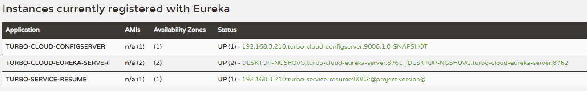

> 4-6 Spring Cloud Config 分布式配置中心

# 1 分布式配置中心应用场景

往往，我们使用配置文件管理一些配置信息，比如 application.yml

**单体应用架构**，配置信息的管理，维护并不会显得特别麻烦，手动操作就可以，因为就一个工程；

**微服务架构**，因为我们的分布式集群环境中可能有很多个微服务，我们不可能一个一个去修改配置然后重启生效，在一定场景下我们还需要在运行期间动态调整配置信息，比如：根据各个微服务的负载情况，动态调整数据源连接池大小，我们希望配置内容发生变化的时候，微服务可以自动更新。

场景总结如下：

1. 集中配置管理，一个微服务架构中可能有成百上千个微服务，所以集中配置管理是很重要的（一次修改，到处生效）
2. 不同环境不同配置，比如数据源配置在不同环境（开发 dev，测试 test，生产 prod）中是不同的
3. 运行期间可动态调整。例如，可根据各个微服务的负载情况，动态调整数据源连接池大小等配置，修改后可自动更新
4. 如配置内容发生变化，微服务可以自动更新配置

那么，我们就需要对配置文件进行**集中式管理**，这也是分布式配置中心的作用。

# 2 Spring Cloud Config

[Spring Cloud Config 官网](https://spring.io/projects/spring-cloud-config)

## 2.1 Config 简介

Spring Cloud Config 是一个分布式配置管理方案，包含了 Server 端 和 Client 端 两个部分。


- Server 端：提供配置文件的存储，以接口的形式将配置文件的内容提供出去，通过使用 @EnableConfigServer 注解在 SpringBoot 应用中非常简单的嵌入。
- Client 端：通过接口获取配置数据并初始化自己的应用。

## 2.2 Config 分布式配置应用

**说明：Config Server 是集中式的配置服务，用于集中管理应用程序各个环境下的配置。默认使用Git存储配置文件内容，也可以 SVN**。

比如，我们要对 “简历微服务” 的 application.yml 进行管理（区分开发环境、测试环境、生产环境）

准备：

1. 登录码云，创建项目 `turbo-config-repo`

2. 上传 yml 配置文件，命名规则如下：

   {application}-{profile}.yml 或者 {application}-{profile}.properties

   其中，application 为应用名称，profile 指的是环境（用于区分开发环境、测试环境、生产环境等）

   示例：turbo-service-resume-dev.yml、turbo-service-resume-test.yml、turbo-service-resume-prod.yml


### 2.2.1 构建 Config Server 统一配置中心

1. 新建 SpringBoot 工程 `turbo-cloud-configserver-9006`，引入依赖坐标（需要注册自己到 Eureka）

   ```xml
   <!--eureka client 客户端依赖引入-->
   <dependency>
       <groupId>org.springframework.cloud</groupId>
       <artifactId>spring-cloud-starter-netflix-eureka-client</artifactId>
   </dependency>
   
   <!--config 配置中心服务端-->
   <dependency>
       <groupId>org.springframework.cloud</groupId>
       <artifactId>spring-cloud-config-server</artifactId>
   </dependency>
   ```

2. 配置启动类，使用注解 开启配置中心服务器功能

   ```java
   package com.turbo;
   
   import org.springframework.boot.SpringApplication;
   import org.springframework.boot.autoconfigure.SpringBootApplication;
   import org.springframework.cloud.client.discovery.EnableDiscoveryClient;
   import org.springframework.cloud.config.server.EnableConfigServer;
   
   @SpringBootApplication
   @EnableDiscoveryClient
   @EnableConfigServer // 开启配置中心功能
   public class ConfigServerApplication9006 {
       public static void main(String[] args) {
           SpringApplication.run(ConfigServerApplication9006.class,args);
       }
   }
   ```

3. application.yml 配置

   ```yaml
   server:
     port: 9006
   
   eureka:
     client:
       service-url: #eureka server 的路径
         # 把所有 eureka 集群中的所有url都填写进来，可以只写一台，因为各个 eureka server 可以同步注册表
         defaultZone: http://TurboCloudEurekaServerB:8762/eureka,http://TurboCloudEurekaServerA:8761/eureka
     instance:
       #服务实例中显示ip，而不是显示主机名，(为了兼容老版本,新版本经过实验都是ip)
       prefer-ip-address: true
       # 实例名称： 192.168.1.3:turbo-service-resume:8080  可以自定义实例显示格式，加上版本号，便于多版本管理，注意是ip-address，早期版本是ipAddress
       instance-id: ${spring.cloud.client.ip-address}:${spring.application.name}:${server.port}:@project.version@
   
   
   # springboot中暴露健康检查等断点接口
   management:
     endpoints:
       web:
         exposure:
           include: "*"
     # 暴露健康检查细节
     endpoint:
       health:
         show-details: always
   
   # http://localhost:9006/master/turbo-service-resume-dev.yml
   spring:
     application:
       name: turbo-cloud-configserver
     cloud:
       config:
         server:
           git:
             uri: https://gitee.com/turboYuu/turbo-config-repo.git
             username: yutao2013@126.com
             password: yutao@#1990
             search-paths:
               - turbo-config-repo
         # 读取分支
         label: master
   ```


启动 eureka 注册中心 和 config 微服务，访问：http://localhost:9006/master/turbo-service-resume-dev.yml，


### 2.2.2 构建 Client 客户端（在已有的简历微服务基础上）


1. 已有工程中添加依赖坐标

   ```xml
   <dependency>
       <groupId>org.springframework.cloud</groupId>
    <artifactId>spring-cloud-config-client</artifactId>
   </dependency>
   ```
   
2. application.yml 修改为 bootstrap.yml 配置文件

   bootstrap.yml 是系统级别的，优先级比 application.yml 高，应用启动时会检查这个配置文件，在这个配置文件中指定配置中心的服务地址，会自动拉取所有应用配置并且启用。

   主要是把与统一配置中心连接的配置信息放到 bootstrap.yml。

   注意：需要统一读取的配置信息，从集中配置中心获取。

   bootstrap.yml

   ```yaml
   server:
     port: 8082
   spring:
     application:
       name: turbo-service-resume
     datasource:
       driver-class-name: com.mysql.jdbc.Driver
       url: jdbc:mysql://152.136.177.192:3306/turbo?useUnicode=true&characterEncoding=utf8
       username: root
       password: 123456
     cloud:
       config: # config 客户端配置 和 configServer 通信，并告知 configServer 希望获取的配置信息在哪个文件中
         name: turbo-service-resume # 配置文件名称
         profile: dev # 后缀名称
         label: master # 分支名称
         uri: http://localhost:9006 # configServer 配置中心地址
     jpa:
       database: mysql
       show-sql: true
       hibernate:
         naming:
           physical-strategy: org.hibernate.boot.model.naming.PhysicalNamingStrategyStandardImpl
   
   eureka:
     client:
       service-url: #eureka server 的路径
         # 把所有 eureka 集群中的所有url都填写进来，可以只写一台，因为各个 eureka server 可以同步注册表
         defaultZone: http://TurboCloudEurekaServerB:8762/eureka,http://TurboCloudEurekaServerA:8761/eureka
       registry-fetch-interval-seconds: 30
     instance:
       #服务实例中显示ip，而不是显示主机名，(为了兼容老版本,新版本经过实验都是ip)
       prefer-ip-address: true
       # 实例名称： 192.168.1.3:turbo-service-resume:8081  可以自定义实例显示格式，加上版本号，便于多版本管理，注意是ip-address，早期版本是ipAddress
       instance-id: ${spring.cloud.client.ip-address}:${spring.application.name}:${server.port}:@project.version@
   
   # springboot中暴露健康检查等断点接⼝
   management:
     endpoints:
       web:
         exposure:
           include: "*"
     # 暴露健康接口细节
     endpoint:
       health:
         show-details: always
   ```

3. 测试

   ```java
   package com.turbo.controller;
   
   import org.springframework.beans.factory.annotation.Value;
   import org.springframework.web.bind.annotation.GetMapping;
   import org.springframework.web.bind.annotation.RequestMapping;
   import org.springframework.web.bind.annotation.RestController;
   
   
   @RestController
   @RequestMapping("/config")
   public class ConfigController {
   
       @Value("${turbo.message}")
       private String turboMessage;
   
       // http:localhost:8082/config/viewConfig
       @GetMapping("/viewConfig")
       public String viewConfig(){
           return "turboMessage == >"+ turboMessage;
       }
   }
   ```

   

启动相关微服务：



访问：http://localhost:8082/config/viewConfig


# 3 Config 配置手动刷新

不用重启微服务，只需要手动的做一些其他的操作（访问一个地址 /refresh）刷新，之后再访问即可。此时，客户端取到了配置中心的值，但当我们修改 GitHub 上面的值时，服务端（Config Server）能实时获取最新的值，但客户端（Config Client）读的是缓存，无法实时获取最新值。Spring Cloud 已经为我们解决了这个问题，那就是客户端使用 post 去触发 refresh，获取最新数据。

1. Client 客户端添加 依赖 spring-boot-starter-actuator （已经添加）

2. Client 客户端 bootstrap.yml 中添加配置（暴露通信端点）

   ```yaml
   management:
     endpoints:
       web:
         exposure:
           include: refresh
   # 也可以暴露所有的端点
   management:
     endpoints:
       web:
         exposure:
           include: "*"
   ```

3. Client 客户端使用到配置信息的类上添加 `@RefreshScope`

   ```java
   @RestController
   @RefreshScope
   @RequestMapping("/config")
   public class ConfigController {
   
       @Value("${turbo.message}")
       private String turboMessage;
   
       // http:localhost:8082/config/viewConfig
       @GetMapping("/viewConfig")
       public String viewConfig(){
           return "turboMessage == >"+ turboMessage;
       }
   }
   ```

4. 手动向 Client 客户端发起 POST 请求：http://localhost:8082/actuator/refresh，刷新配置信息。


先手动修改 码云上 turbo-service-resume-dev.yml 配置文件，然后手动刷新配置信息。


然后再访问测试结果：


**注意：手动刷新方式避免了服务重启（流程：Git 改配置 ---> for 循环脚本手动刷新每个微服务）**

思考：受否使用广播机制，一次通知，处处生效，方便大范围配置刷新？

# 4 Config 配置自动更新

实现一次通知处处生效。

在微服务架构中，我们可以结合消息总线（Bus）实现分布式配置的自动更新（Spring Cloud Config + Spring Cloud Bus）

## 4.1 消息总线

所谓消息总线 Bus，即我们经常使用 MQ 消息代理构建一个共用的 Topic，通过这个 Topic 连接各个微服务实例，MQ广播的消息会被所有在注册中心的微服务实例监听和消费。**换言之就是通过一个主题连接各个微服务，打通脉络**。

Spring Cloud Bus（基于MQ的，支持RabbitMq/Kafka）是 Spring Cloud 中的消息总线方案，Spring Cloud Config + Spring Cloud Bus 结合可以实现配置信息的自动更新。


## 4.2 Spring Cloud Config + Spring Cloud Bus 实现自动刷新

MQ 消息代理，我们还选择使用 RabbitMQ，ConfigServer 和 ConfigClient 都添加消息总线的支持 以及与 RabbitMq 的连接信息。

1. Config Server、Config Client 服务端添加消息总线支持

   ```xml
   <dependency>
       <groupId>org.springframework.cloud</groupId>
       <artifactId>spring-cloud-starter-bus-amqp</artifactId>
   </dependency>
   ```

2. Config Server 、Config Client 添加配置

   ```yaml
   spring:
     rabbitmq:
       host: 152.136.177.192
       port: 5672
       username: guest
       password: guest
   ```

3. 服务端暴露端点

   ```yaml
   management:
     endpoints:
       web:
         exposure:
           include: bus-refresh
   # 建议暴露所有的端点
   management:
     endpoints:
       web:
         exposure:
           include: "*"
   ```


启动相关微服务：


向配置中心服务端发送 post 请求 http://localhost:9006/actuator/bus-refresh，各个客户端配置即可自动刷新，在广播模式下实现一次请求处处更新：


如果指向定向更新呢？

在发起刷新请求的时候 http://localhost:9006/actuator/bus-refresh/turbo-service-resume:8082

即为最后面跟上要定向刷新的实例 **服务名:端口号**  即可。


备注：docker 中安装 rabbitmq

```bash
docker pull rabbitmq:management
docker run --name rabbitmq -d -p 15672:15672 -p 5672:5672 rabbitmq:management

#http://152.136.177.192:15672/
username: guest
password: guest
```

