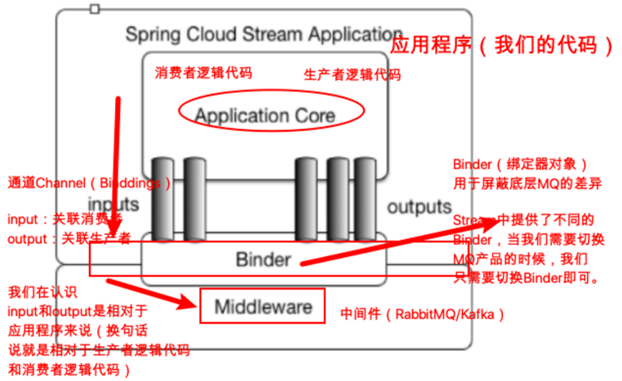
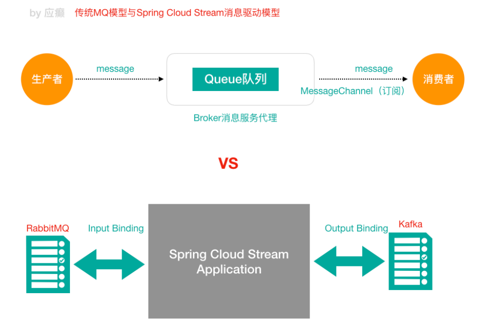
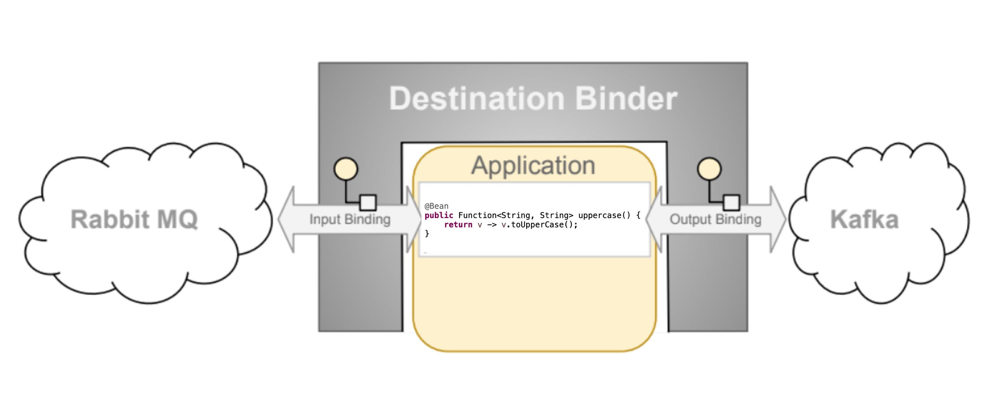
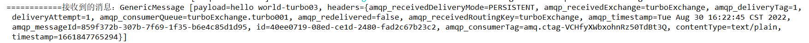

> 4-7 Spring Cloud Stream 消息驱动组件

Spring Cloud Stream 消息驱动组件帮助我们更快速，更方便，更友好的去构建**消息驱动**微服务的。

定时任务和消息驱动的一个对比。（消息驱动：基于消息机制做一些事情）

MQ：消息队列/消息中间件/消息代理，产品有很多，ActiveMQ、RabbitMQ、RocketMQ、Kafka

# 1 Stream 解决的痛点问题

MQ 消息中间件广泛应用在 应用解耦、异步消息处理、流量削峰等场景中。

不同的 MQ 消息中间件内部机制包括使用方式都会有所不同，比如 RabbitMQ 中有 Exchange（交换机/交换器）这一概念，Kafka 有 Topic、Partition 分区这些概念，MQ 消息中间件的差异性不利于我们上层的开发应用，当我们的系统希望从原有的 RabbitMQ 切换到 Kafka 时，我们会发现比较困难，很多要操作重来（**因为应用程序和具体的某一款 MQ 消息中间件耦合在一起了**）。

Spring Cloud Stream 进行了很好的**上层抽象**，可以让我们与具体消息中间件解耦，屏蔽了底层具体 MQ 消息中间件的细节差异，就像 HIbernate 屏蔽掉了具体数据库（Mysql/Oracle一样）。如此一来，学习、开发、维护 MQ 都会变得轻松。目前 Spring Cloud Stream 支持 RabbitMQ 和 Kafka。

本质：**屏蔽掉了底层不同MQ消息中间件之间的差异，统一了MQ的编程模型，降低了学习、开发、维护 MQ的成本**


# 2 Stream 重要概念

Spring Cloud Stream 是一个构建消息驱动微服务的框架。应用程序通过 inputs（相当于消息消费者 consumer）或者 outputs（相当于消息生产者 producer）来与 Spring Cloud Stream 中的 binder 对象交互，而 Binder 对象式用来屏蔽底层 MQ 细节的，它负责与具体的消息中间件交互。

**说白了：对于我们来说，只需要知道如何使用 Spring Cloud Stream 与 Binder 对象交互即可**




**Binder 绑定器**

Binder 绑定器是 Spring Cloud Stream 中非常核心的概念，就是通过它来屏蔽底层不同 MQ 消息中间件的细节差异，当需要更换为其他消息中间件时，我们需要做的就是 **更换对应的 Binder 绑定器** 而不需要修改任何逻辑（Binder 绑定器的实现是框架内置的，Spring Cloud Stream 目前支持 Rabbit、Kafka 两种消息队列）

# 3 传统 MQ 模型与Stream消息驱动模型





# 4 Stream 消息通信方式及编程模型

## 4.1 Stream 消息通信方式

Stream 中的消息通信方式遵循了发布 — 订阅模式。

在 Spring Cloud Stream 中的消息通信方式遵循了发布-订阅模式，当一条消息被投递到消息中间件之后，它会通过共享的 Topic 主题进行广播，消息消费者在订阅的主题中收到它并触发自身的业务逻辑处理。这里所提到的 Topic 主题是 Spring Cloud Stream 中的一个抽象概念，用来代表发布共享消息给消费者的地方。在不同的消息中间件中，Topic 可能对应着不同的概念，比如：在 RabbitMQ 中的它对应了 Exchange 、在 Kafka 中则对应了 Kafka 中的 Topic。

## 4.2 Stream 编程注解

**如下的注解无非在做一件事，把我们结构图中那些组成部分上下关联起来，打通通道（这样的话生产者的 message 数据才能进入 mq，mq中数据才能进入消费者工程）**。

| 注解                                                     | 描述                                                      |
| -------------------------------------------------------- | --------------------------------------------------------- |
| @Input（在消费者工程中使用）                             | 注解标识输入通道，通过该通道接收到的消息进入应用程序      |
| @Output（在生产者工程中使用）                            | 注解标识输出通道，发布的消息将通过该通道离开应用程序      |
| @StreamListener（在消费者工程中使用，监听message的到来） | 监听队列，用于消费者的队列的消息的接收（有消息监听.....） |
| @EnableBinding                                           | 把Channel 和 Exchange （对于 RabbitMQ）绑定在一起         |

接下来，我们创建三个工程（我们基于RabbitMQ）

- trubo-cloud-stream-producer-9090，作为生产者端发消息
- trubo-cloud-stream-consumer-9091，作为消费者端接收消息
- trubo-cloud-stream-consumer-9092，作为消费者端接收消息


## 4.3 Stream 消息驱动之开发生产者端

1. 在 turbo-parent 下新建子 module：turbo-cloud-stream-producer-9090

2. pom.xml 中添加依赖

   ```xml
   <dependency>
       <groupId>org.springframework.cloud</groupId>
       <artifactId>spring-cloud-starter-netflix-eureka-client</artifactId>
   </dependency>
   <dependency>
       <groupId>org.springframework.cloud</groupId>
       <artifactId>spring-cloud-starter-stream-rabbit</artifactId>
   </dependency>
   ```

3. application.yml 添加配置

   ```yaml
   server:
     port: 9090
   
   spring:
     application:
       name: turbo-cloud-stream-producer
     cloud:
       stream:
         binders:
           turboRabbitBinder: # 给Binder定义的名称，用于后面关联
             type: rabbit # MQ类型,如果是kafka的话，此处配置kafka
             environment: #MQ环境配置（用户名、密码等）
               spring:
                 rabbitmq:
                   host: 152.136.177.192
                   port: 5672
                   username: guest
                   password: guest
         bindings: #关联整合通道和binder对象
           output: # output是我们定义的通道名称，此处不能乱改
             destination: turboExchange
             content-type: text/plain # application/json # 消息类型设 置，⽐如json
             binder: turboRabbitBinder #关联MQ服务
   
   
   eureka:
     client:
       service-url: #eureka server 的路径
         # 把所有 eureka 集群中的所有url都填写进来，可以只写一台，因为各个 eureka server 可以同步注册表
         defaultZone: http://TurboCloudEurekaServerB:8762/eureka,http://TurboCloudEurekaServerA:8761/eureka
       # 每隔30s拉取一次服务列表
       #registry-fetch-interval-seconds: 30
     instance:
       #服务实例中显示ip，而不是显示主机名，(为了兼容老版本,新版本经过实验都是ip)
       prefer-ip-address: true
       # 实例名称： 192.168.1.3:turbo-service-resume:8080  可以自定义实例显示格式，加上版本号，便于多版本管理，注意是ip-address，早期版本是ipAddress
       instance-id: ${spring.cloud.client.ip-address}:${spring.application.name}:${server.port}:@project.version@
   
   # springboot中暴露健康检查等断点接口
   management:
     endpoints:
       web:
         exposure:
           include: "*"
     # 暴露健康检查细节
     endpoint:
       health:
         show-details: always
   ```

4. 启动类

   ```java
   package com.turbo;
   
   import org.springframework.boot.SpringApplication;
   import org.springframework.boot.autoconfigure.SpringBootApplication;
   import org.springframework.cloud.client.discovery.EnableDiscoveryClient;
   
   @SpringBootApplication
   @EnableDiscoveryClient
   public class StreamProducerApplication9090 {
       public static void main(String[] args) {
           SpringApplication.run(StreamProducerApplication9090.class,args);
       }
   }
   ```

5. 业务开发（发送消息接口、接口实现类、Controller）

   接口

   ```java
   package com.turbo.service;
   
   public interface IMessageProducer {
       public void sendMessage(String content);
   }
   ```

   实现类

   ```java
   package com.turbo.service.impl;
   
   import com.turbo.service.IMessageProducer;
   import org.springframework.beans.factory.annotation.Autowired;
   import org.springframework.cloud.stream.annotation.EnableBinding;
   import org.springframework.cloud.stream.messaging.Source;
   import org.springframework.messaging.support.MessageBuilder;
   
   /**
    * Source.class 里面就是对输出通道的定义（这是 Spring Cloud Stream 内置的通道封装）
    **/
   @EnableBinding(Source.class)
   public class MessageProducerImpl implements IMessageProducer {
   
       // 将 MessageChannel 的封装对象 Source 注入到这里使用
       @Autowired
       private Source source;
       
       @Override
       public void sendMessage(String content) {
           // 向 mq 中发送消息（并不是直接操作 mq，应该操作的是spring cloud stream）
           // 使用通道向外发出消息（指的是Source里面的output通道）
           source.output().send(MessageBuilder.withPayload(content).build());
       }
   }
   ```

   测试类

   ```java
   import com.turbo.StreamProducerApplication9090;
   import com.turbo.service.IMessageProducer;
   import org.junit.Test;
   import org.junit.runner.RunWith;
   import org.springframework.beans.factory.annotation.Autowired;
   import org.springframework.boot.test.context.SpringBootTest;
   import org.springframework.test.context.junit4.SpringRunner;
   
   /**
    * @author yutao
    **/
   @SpringBootTest(classes = {StreamProducerApplication9090.class})
   @RunWith(SpringRunner.class)
   public class MessageProducerTest {
   
       @Autowired
       private IMessageProducer iMessageProducer;
   
       @Test
       public void testSendMessage(){
           iMessageProducer.sendMessage("hello world-turbo03");
       }
   }
   ```


## 4.4 Stream 消息驱动之消费者端

此处我们记录 `turbo-cloud-stream-consumer-9091` 编写过程，9092 工程类似。pom引入的依赖和生产者端一样

1. application.yml

   ```yaml
   server:
     port: 9091
   spring:
     application:
       name: turbo-cloud-stream-consumer
     cloud:
       stream:
         binders: # 绑定 MQ 服务消息（此处我们是 RabbitMQ）
           turboRabbitBinder:
             type: rabbit
             environment:
               spring:
                 rabbitmq:
                   host: 152.136.177.192
                   port: 5672
                   username: guest
                   password: guest
         bindings: #关联整合通道和binder对象
           input: # input是我们定义的通道名称，此处不能乱改
             destination: turboExchange
             content-type: text/plain # application/json # 消息类型设 置，⽐如json
             binder: turboRabbitBinder #关联MQ服务
             group: turbo001
   
   eureka:
     client:
       service-url: #eureka server 的路径
         # 把所有 eureka 集群中的所有url都填写进来，可以只写一台，因为各个 eureka server 可以同步注册表
         defaultZone: http://TurboCloudEurekaServerB:8762/eureka,http://TurboCloudEurekaServerA:8761/eureka
       # 每隔30s拉取一次服务列表
       #registry-fetch-interval-seconds: 30
     instance:
       #服务实例中显示ip，而不是显示主机名，(为了兼容老版本,新版本经过实验都是ip)
       prefer-ip-address: true
       # 实例名称： 192.168.1.3:turbo-service-resume:8080  可以自定义实例显示格式，加上版本号，便于多版本管理，注意是ip-address，早期版本是ipAddress
       instance-id: ${spring.cloud.client.ip-address}:${spring.application.name}:${server.port}:@project.version@
   
   # springboot中暴露健康检查等断点接口
   management:
     endpoints:
       web:
         exposure:
           include: "*"
     # 暴露健康检查细节
     endpoint:
       health:
         show-details: always
   ```

2. 消息消费者监听

   ```java
   package com.turbo.service;
   
   import org.springframework.cloud.stream.annotation.EnableBinding;
   import org.springframework.cloud.stream.annotation.StreamListener;
   import org.springframework.cloud.stream.messaging.Sink;
   import org.springframework.messaging.Message;
   
   @EnableBinding(Sink.class)
   public class MessageConsumerService {
   
       @StreamListener(Sink.INPUT)
       public void receiveMessages(Message<String> message){
           System.out.println("============接收到的消息："+message);
   
       }
   }
   ```

3. 启动类

   ```java
   package com.turbo;
   
   import org.springframework.boot.SpringApplication;
   import org.springframework.boot.autoconfigure.SpringBootApplication;
   import org.springframework.cloud.client.discovery.EnableDiscoveryClient;
   
   
   @SpringBootApplication
   @EnableDiscoveryClient
   public class StreamConsumerApplication9091 {
       public static void main(String[] args) {
           SpringApplication.run(StreamConsumerApplication9091.class,args);
       }
   }
   ```

   

消费端监听收到的消息：



# 5 Stream 高级之自定义消息通道

# 6 Stream 高级之消息分组