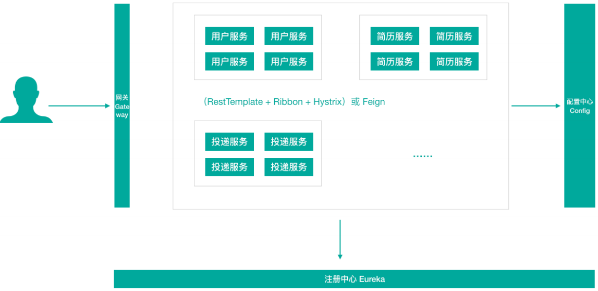

> 第四部分 第一代SpringCloud核心组件

说明：上面提到网关组件 Zuul 性能一般，未来将退出 Spring Cloud 生态圈，所以我们直接讲解 GateWay，我们把 GateWay 划分到第一代 Spring Cloud 核心组件这一部分。

各组件整体结构如下：

**从形式上来说，Feign 一个顶三，Feign = RestTemplate + Ribbon + Hystrix**