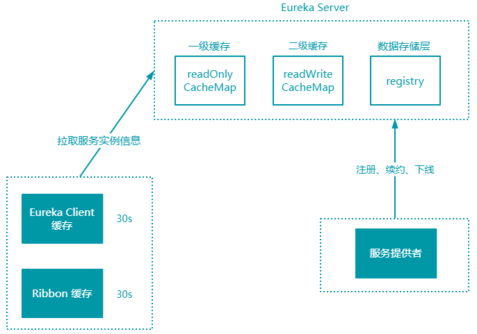

> 第五部分 常见问题及解决方案

本部分主要讲解 Eureka 服务发现慢的原因，Spring Cloud 超时设置问题。

如果你刚刚接触 Eureka，对 Eureka 的设计和实现都不是很了解，可能就会遇到一些无法快速解决的问题，这些问题包括：新服务上线后，服务消费者不能访问到刚上线的新服务，需要过一段时间才能访问？或是将服务下线后，服务还是会被调用到，一段时间后才彻底停止服务，访问前期会导致频繁报错？这些问题还会让你对 Spring Cloud 产生严重的怀疑，这难道不是一个 Bug ？

# 1 问题场景

> 上线一个新的服务实例，但是服务消费者无感知，过了一段时间才知道。
>
> 某一个服务实例下线了，服务消费者无感知，仍然向这个服务实例发起请求。

这其实就是服务发现的一个问题，当我们需要调用服务实例时，信息是从注册中心 Eureka 获取的，然后通过 Ribbon 选择一个服务实例发起调用，如果出现调用不到或者下线后还可以调用的问题，原因肯定是服务实例的信息更新不及时导致的。

# 2 Eureka 服务发现慢的原因

Eureka 服务发现慢的原因主要有两个，一部分是因为服务缓存导致的，另一部分是客户端缓存导致的。

## 2.1 服务端缓存

服务注册到注册中心后，服务实例信息是存储在注册表中的，也就是内存中。但 Eureka 为了提供响应速度，在内部做了优化，加入了两层的缓存结构，将 Client 需要的实例信息，直接缓存起来。获取的时候直接从缓存中拿数据然后响应给 Client。

第一层缓存是 readOnlyCacheMap，readOnlyCacheMap 是采用 ConcurrentHashMap 来存储数据的，主要负责定时与 readWriteCacheMap 进行数据同步，默认同步时间为 30s 一次。

第二层缓存是 readWriteCacheMap，readWriteCacheMap 采用 Guava 来实现缓存。缓存过期时间默认为 180s，当服务下线、过期、注册、状态变更等操作都会清除此缓存中的数据。

Client 获取服务实例数据时，会先从一级缓存中获取，如果一级缓存中不存在，再从二级缓存中获取，如果二级缓存也不存在，会触发缓存的加载，从存储层拉取数据到缓存中，然后再返回给 Client。

Eureka 之所以设计二级缓存机制，也是为了提高 Eureka Server 的响应速度，缺点是缓存会导致 Client 获取不到最新的服务实例信息，然后导致无法快速发现新的服务和已下线的服务。

了解了服务端的实现后，想要解决这个问题就变得很简单了，我们可以缩短只读缓存的更新时间（eureka.server.response-cache-update-interval-ms）让服务发现变得更加及时，或者直接将只读缓存关闭（eureka.server.use-read-only-response-cache=false），多级缓存也导致 C 层面（数据一致性）很薄弱。

Eureka Server 中会有定时任务去检测失效的服务，将服务实例信息从注册表中移除，也可以将这个失效检测的时间缩短，这样服务下线后就能够及时从注册表中清除。

## 2.2 客户端缓存

客户端缓存主要分为两块内容，一部分是 Eureka Client 缓存，一部分是 Ribbon 缓存。

### 2.2.1 Eureka Client 缓存

### 2.2.2 Ribbon 缓存

