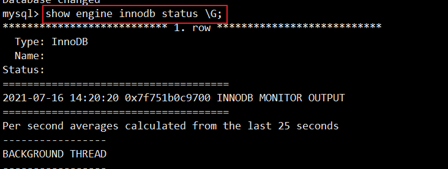
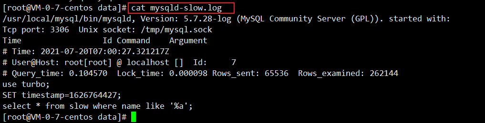

#  MySQL

https://downloads.mysql.com/archives/community/

[在linux中安装mysql](https://segmentfault.com/a/1190000021202599)

# 第一部分 MySQL架构原理

## 1 MySQL体系结构


MySQL Server架构自顶向下大致可以分网络层、服务层、存储引擎层和系统文件层。

**1）网络连接层**

- 客户端连接器（Client Connectors）：提供与MySQL服务器建立的支持。目前几乎支持所有主流的服务端编程技术。

**2）服务层**

服务层是MySQL Server的核心，主要包含系统管理和控制工具、连接池、SQL接口、解析查询优化器和缓存六部分。

- **连接池（Connection Pool）：**负责存储和管理客户端与数据路的连接，一个线程负责管理一个连接。

- **系统管理和控制工具（Management Services & Utilities）：**例如：备份恢复、安全管理、集群管理等。

- **SQL接口（SQL Interface）：**用于接收客户端发送的各种SQL命名，并且返回用户查询结果。

- **解析器（Parser）：**负责将请求的SQL解析成一个“解析树”，然后根据一些MySQL规则进一步检查解析树是否合法。

- **查询优化器（Optimizer）：**当“解析树”通过解析器语法检查后，将交由优化器将其转化成执行计划，然后与存储引擎交互。

  > select uid,name from user where gender=1;
  >
  > 选取->投影->联接 策略
  >
  > （1）select先根据where语句进行选取，并不是查询出全部数据再过滤
  >
  > （2）select查询根据uid、name进行属性投影，并不是取出所有字段
  >
  > （3）将前面选取和投影联接起来，最终生成查询结果

- **缓存（Cache&Buffer）：**缓存机制是由一些列小缓存组成的。比如表缓存、记录缓存、权限缓存、引擎缓存等。如果查询缓存有命中的查询结果，查询语句就可以直接去查询缓存中取数据。

**3）存储引擎层（Pluggable Storage Engines ）**

存储引擎负责MySQL中数据的存储与提取，与底层系统文件进行交互。MySQL存储引擎是**插件式**的，服务器中的查询执行引擎通过接口与存储引擎进行通信，接口屏蔽了不同存储引擎之间的差异。常见的存储引擎MyISAM、InnoDB。

存储引擎是针对表，而不是库。一个库中可以存在存储引擎不同的表。

**4）系统文件层（File System）**

该层负责将数据库的数据和日志存储再文件系统上，并完成与存储引擎的交互，是文件的物理存储层。主要包含日志文件，数据文件，配置文件，pid文件，socket文件等。

- 日志文件

  - 错误日志（Error log）

    默认开启，show variables like '%log_error%';

  - 通用查询日志（General query log）

    记录一般查询语句，show variables like '%general%';

  - 二进制日志（binary log）

    记录对MySQL数据库执行执行的更改操作，并且记录了语句的发生时间，执行时长；但是它不记录select、show等不修改数据的SQL。主要用于数据库恢复和主从复制。

    show variables like '%log_bin%'; // 是否开启

    show variables like '%binlog%'; // 参数查看

    show binary logs; // 查看日志文件

  - 慢查询日志（Slow query log）

    记录所有执行时间超时的查询SQL，默认10s。

    show variables like '%show_query%'; // 是否开启

    show variables like '%long_query_time%'; // 时长

    set long_query_time=10; // 修改时长

- 配置文件

  用于存放MySQL所有的配置信息文件，比如my.cnf、myini等。

- 数据文件

  - db.opt文件：记录这个库的默认使用的字符集和校验规则。
  - frm 文件：存储与表相关的元数据（meta）信息，包括表结构的定义信息等，每一张表都会有一个frm文件。
  - MYD文件：MyISAM存储引擎专用，存MyISAM表的数据（data），每一张表都会有一个.MYD文件。
  - MYI文件：MyISAM存储引擎专用，存放MyISAM表的索引相关信息，每一张MyISAM表对应一个。MYI文件。
  - ibd文件和IBDATA文件：存放InnoDB的数据文件（包括索引）。InnoDB存储引擎有两种表空间方式：独享表空间和共享表空间。独享表空间使用.ibd文件来存放数据，且每一张InnoDB表对应一个.ibd文件。共享表空间使用.ibdata文件，所有表共同使用一个（或多个，自行配置）.ibdata文件。
  - ibdata1文件：系统表空间数据文件，存储表元数据、Undo日志等。
  - ib_logfile0、ib_logfile1文件：Redo log日志文件。

- pid文件

  pid文件时mysqld应用程序在unix/linux环境下的一个进程文件，存放着自己的进程id。

- socket文件

  socket 文件也是在 Unix/Linux 环境下才有的，用户在 Unix/Linux 环境下客户端连接可以不通过 TCP/IP 网络而直接使用 Unix Socket 来连接 MySQL。

## 2 MySQL运行机制


- ①建立连接（Connectors&Connection Pool），通过客户端/服务器通信协议与MySQL建立连接。MySQL客户端与服务端的通信方式是“半双工”。对于每一个MySQL的连接，时刻都有一个线程状态来标识这个连接正在做什么。

  通讯机制：

  - 全双工
  - 半双工
  - 单工

  线程状态：

  show processlist; // 查看用户正在运行的线程信息，root用户能查看所有线程，其他用户只能看自己的。

  - id：线程ID，可以使用kill xx
  - user：启动这个线程的用户
  - Host：发送请求的客户端的IP和端口号
  - db：当前命令在哪个库执行
  - Command：该线程正在执行的操作命令
    - Create DB：正在创建库操作
    - Drop DB：正在删除库操作
    - Execute：正在执行一个PreparedStatement
    - Query：正在执行一个语句
    - Sleep：正在等待客户端发送语句
    - Quit：正在退出
    - Shutdown：正在关闭服务器
  - TIme：表示该线程处于当前状态的时间，单位秒
  - State：线程状态
    - Updating：正在所有匹配记录，进行修改
    - Sleeping：正在等待客户端发送新请求
    - Starting：正在执行请求处理
    - Checking table：正在检查数据表
    - Closing table：正在将表中数据刷新到磁盘中
    - Locked：被其他查询锁住记录
    - Sending Data：正在处理select查询，同时将结果发送给客户端
  - Info：一般记录线程执行的语句，默认显示前100个字符，查看完整的使用 show full processlist;


- ②查询缓存（Cache&Buffer），这是MySQL的一个可优化查询的地方，如果开启了查询缓存且在查询缓存过程中查询到完全相同的SQL语句，则将查询结果直接返回给客户端；如果没有开启查询缓存或者没有查询到完全相同的SQL语句则会由**解析器**进行语法语义解析，并生成**“解析树“**。

  - 缓存Select查询的结果和SQL语句

  - 执行Select查询时，先查询缓存，判断是否存在可用的记录集，要求是否完全相同（包括参数集），这样才会匹配缓存数据命中。

  - 即使开启查询缓存，一下SQL也不能缓存

    - 查询语句使用SQL_NO_CACHE ( SELECT SQL_NO_CACHE * FROM xxxx )
    - 查询的结果大于query_cache_limit设置
    - 查询中有一些不确定的参数，比如now()

  - show variables like '%query_cache%'; // 查看缓存是否启用，空间大小，限制等。


  - show status like 'Qcache%'; // 查看更详细的缓存参数，可用缓存空间，缓存块，缓存多少等。


- ③解析器（Parser）将客户端发送的SQL进行语法解析，生成**”解析树“**。预处理器根据一些MySQL规则进一步检查”解析树“是否合法，例如这里将检查数据表和数据列是否存在，还会解析名字和别名，看看它们是否有歧义，最后生成新的”解析树“。

- ④查询优化器（Optimizer）根据”解析树“生成最优的执行计划。MySQL使用很多优化策略生成最优的执行计划，可以分为两类：静态优化（编译时优化）、动态优化（运行时优化）。

  - 等价变换策略
    - 5=5 and a>5 改成 a>5
    - a<b and a=5 改为 b>5 and a =5 
    - 基于联合索引，调整条件位置等
  - 优化count、min、max等函数
    - InnoDB引擎min函数只需要找索引最左边
    - InnoDB引擎max函数只需要找索引最右边
    - MyISAM引擎count(*)，不需要计算，直接返回
  - 提前终止查询
    - 使用了limit查询，获取limit所需的数据，就不在继续遍历后面数据。
  - in的优化
    - MySQL对in查询，会先进行排序，再采用二分法查找数据。比如where id in (2,1,3)，变为in (1,2,3)

- ⑤查询执行引擎负责执行SQL语句，此时查询执行引擎会根据SQL语句中表的存储引擎类型，以及对应的API接口与底层存储引擎缓存或者物理文件的交互，得到查询结果并返回给客户端。若开启查询缓存，这时会将SQL语句和结果完整的保存到查询缓存（Cache&Buffer）中，以后若有相同的SQL语句执行则直接返回结果。

  - 如果开启了查询缓存，先将查询结果做缓存操作
  - 返回结果过多，采用增量模式返回

## 3 MySQL存储引擎

存储引擎再MySQL的体系架构中位于第三层，负责MySQL中的数据存储和提取，是与文件打交道的子系统，它是根据MySQL提供给的文件访问层抽线接口定制的一种文件访问机制，这种机制叫做存储引擎。

使用 **show engines**命令，就可以查看当前数据库支持的引擎信息。


**在5.5版本之前默认采用MyISAM存储引擎，从5.5开始采用InnoDB存储引擎。**

- InnoDB：支持事务，具有提交，回滚和崩溃恢复能力，事务安全
- MyISAM：不支持事务和外键，访问速度快
- Memory：利用内存创建表，访问速度非常快，因为数据在内存，而且默认使用Hash索引，但是一旦关闭，数据就会丢失。
- Archive：归档类型引擎，仅支持insert和select语句
- CSV：以csv文件进行数据存储，由于文件限制，所有列必须强制指定not null，另外csv引擎不支持索引和分区，适合做数据交换的中间表
- BlackHole：黑洞，只进不出，进来消失，所有插入数据都不会保存
- Federated：可以访问远端MySQL数据库中的表。一个本地表，不保存数据，访问远程表内容。
- MRG_MyISAM：一组MyISAM表的组合，这些MyISAM表必须结构相同，Merge表本身没有数据，对Merge操作可以对一组MyISAM表进行操作

### 3.1 InnoDB和MyISAM对比

- 事务和外键

  InnoDB支持事务和外键，具有安全性高和完整性，适合大量insert和update操作

  MyISAM不支持事务和外键，它提供高速存储和检索，适合大量的select查询操作

- 锁机制

  InnoDB支持行级锁，锁定指定记录。基于索引来加锁实现

  MyISAM支持表级锁，锁定整张表

- 索引结构

  InnoDB使用聚集索引（聚簇索引），索引和记录在一起存储，即缓存索引，也缓存记录。

  MyISAM使用非聚集索引（非聚簇索引），索引和记录分开。

- 并发处理能力

  InnoDB读写阻塞可以与隔离级别有关，可以采用多版本并发控制（MVCC）来支持高并发

  MyISAM使用表锁，会导致写操作并发率低，读之间并不阻塞，读写阻塞。

- 存储文件

  InnoDB表对应两个文件，一个.frm表结构文件，一个.ibd数据文件。InnoDB表最大支持64TB；

  MyISAM表对应三个文件，一个.frm表结构文件，一个MYD表数据文件，一个.MYI索引文件。从MySQL5.0开始默认限制256TB。


- 适用场景

  **MyISAM**

  - 不需要事务支持（不支持）
  - 并发相对较低（锁定机制问题）
  - 数据修改相对较少，以读为主
  - 数据一致性要求不高

  **InnoDB**

  - 需要事务支持（具有较好的事务特性）
  - 行级锁定对高并发有很好的适应能力
  - 数据更新较为频繁的场景
  - 数据一致性要求较高
  - 硬件设备内存较大，可以利用InnoDB较好的缓存能力来提高内存利用率，减少磁盘IO

- 总结

  如何选择？

  - 是否需要事务？有，InnoDB
  - 是否存在并发修改？有，InnoDB
  - 是否追求快速查询，且数据修改少？是，MyISAM
  - 在不多数情况下，推荐使用InnoDB

### 3.2 InnoDB存储结构

InnoDB引擎架构图，主要分为内存结构和磁盘结构两部分。5.7版本。


#### **InnoDB内存结构**

内存结构主要包括Buffer Pool、Change Buffer、Adaptive Hash Index、Log Buffer四大组件。

- Buffer Pool：缓冲池，简称BP。BP以page页为单位，默认大小16k，BP底层采用**链表数据结构**管理page。在InnoDB访问表记录和索引时会在Page页中缓存，以后使用可以减少磁盘IO操作，提升效率。

  - Page管理机制

    

    Page根据状态可以分为三种类型：

    - free page：空闲page，未被使用
    - clean page：被使用page，数据没有被修改过
    - dirty page：脏页，被使用page，数据被修改过，页中数据和磁盘的数据产生了不一致

    针对上述三种page类型，InnoDB通过三种**链表结构**来维护和管理

    - free list：表示空闲缓冲区，管理free page
    - flush list：表示需要刷新到磁盘的缓冲区，管理dirty page，内部page按修改时间排序。脏页即存在于flush链表，也在LRU链表中，但是两种互不影响，LRU链表负责管理page的可用性和释放，而flush链表负责管理脏页的刷盘操作。
    - lru list：表示正在使用的缓冲区，管理clean page和dirty page，缓冲区以midpoint为基点，前面链表称为new列表区，存放经常访问的数据，占63%；后面的链表称为old列表区，存放使用较少数据，占37%。

  - 改进型LRU算法维护

    普通LRU：末尾淘汰法，新数据从链表头部加入，释放空间从末尾淘汰

    改进LRU：链表分为new和old两个部分，加入元素时并不是从表头插入，而是从中间midpoint位置插入，如果数据很快被访问，那么page就会向new列表头部移动，如果数据没有被访问，会逐步向old尾部移动，等待淘汰。

    每当有新的page数据读取到buffer pool时，innodb引擎会判断是否有空闲页，是否足够，如果有就将free page从free list列表删除，放入到LRU列表中。没有空闲页，就会根据LRU算法淘汰LRU链表默认的页，将内存空间释放分配给新的页。

  - Buffer Pool配置参数

    show variables like '%innodb_page_size%'; // 查看page页大小

    show variables like '%innodb_old%'; // 查看 lru list中old列表参数

    show variables like '%innodb_buffer%'; // 查看 buffer pool参数

    建议：将innodb_buffer_pool_size设置为总内存大小的60%-80%，innodb_buffer_pool_instances可以设置为多个，这样可以避免缓存争夺。


​    

- Change Buffer：写缓冲区，简称CB。在进行DML操作时，如果BP没有其相应的page数据，并不会立即将磁盘页加载到缓冲池，而是在CB记录缓冲变更，等未来数据被读取时，再将数据合并恢复到BP中。

  Change Buffer占用Buffer Pool空间，默认占25%，最大允许占50%，可以根据读写业务量来进行调整。参数innodb_change_buffer_max_size;

  当更新更新一条记录时，该记录再Buffer Pool存在，直接再BufferPool修改，一次内存操作。如果在BufferPool中不存在（没有命中），会直接再ChangeBuffer进行一次内存操作，不会在去磁盘查询数据，避免一次磁盘IO。当下次查询记录时，会先进行磁盘读取，然后再从ChangeBuffer中读取信息合并，最终载入BufferPool中。

  写缓冲区，仅适用于非唯一普通索引页，在进行修改时，InnoDB必须要做唯一性校验，因此必须查询磁盘，做一次IO操作。会直接将记录查询到BufferPool中，然后再缓冲池修改，不会在ChangeBuffer操作。


- Adaptive Hash Index：自适应哈希索引，用于优化对BP数据的查询。InnoDB存储引擎会监控对表索引的查找，如果观察到建立哈希索引可以带来速度的提升，则建立哈希索引，所以称之为自适应。InnoDB存储引擎会自动根据访问频率和模式来为某些页建立哈希索引。

- Log Buffer：日志缓冲区，用来保存要写入磁盘上log文件（Redo/Undo）的数据，日志缓冲区的内容定期刷新到磁盘log文件中。日志缓冲器满时会自动将其刷新到磁盘，当遇到BLOB或多行更新的大事务操作时，增加日志缓冲区可以节省磁盘IO。

  Log Buffer主要是用于记录InnoDB引擎日志，在DML操作时会产生Redo和Undo日志。

  LogBuffer空间满了，会自动写入磁盘。可以通过将innodb_log_buffer_size参数调大，减少磁盘IO频率


  innodb_flush_log_at_trx_commit参数控制日志刷新行为，默认为1

  - 0：每隔1秒写日志文件和刷盘操作（写日志文件LogBuffer-->OS Cache，刷盘 OS Cache -->磁盘文件），最多丢失1秒数据。
  - 1：事务提交，立刻写日志文件和刷盘，数据不丢失，但是会频繁IO操作
  - 2：事务提交，立刻写日志文件，每隔1秒进行刷盘操作（建议）


#### **InnoDB磁盘结构**

InnoDB磁盘主要包括Tablespace，InnoDB Data Dictionary，Doublewrite Buffer，Redo Log和Undo Logs

##### 表空间（Tablespace）

用于存储表结构和数据。表空间又分为系统表空间，独立表空间，通用表空间，临时表空间，Undo表空间等多种类型；

- 系统表空间（System Tablespace）

  包含InnoDB数据字典，Doublewrite Buffer，Change Buffer，Undo Logs的存储区域。系统表空间页默认默认包含任何用户在系统表空间创建的表数据和索引数据。系统表空间是一个共享的表空间，因为它是被多个表共享的。该空间的数据文件通过参数innodb_data_file_path控制，默认值是ibdata1:12M:autoextend(文件名为ibdata1、12M、自动扩展)。


- 独立表空间（File-Per-Table-Tablespaces）

  默认开启，独立表空间是一个单表表空间，该表创建于自己的数据文件中，而非创建于系统表空间中。当innodb_file_per_table选项开启时，表将被创建于表空间中。否则，innodb将被创建于系统表空间。每隔表文件空间又一个.bd数据文件代表，该文件默认被创建于系统数据库目录中。表空间的表文件支持动态（dynamic）和压缩（commpressed）行格式。


- 通用表空间（General Tablespaces）

  通用表空间通过create tablespace语法创建的共享表空间。通用表空间可以创建于mysql数据目录之外的其他表空间，其可以容纳多张表，且支持所有的行格式。


- 撤销表空间（Undo Tablespaces）

  撤销表空间由一个或多个包含Undo日志文件组成。在MySQL5.7版本之前Undo占用的是System Tablespaces共享区，从5.7开始将Undo从System Tablespaces分离出来。InnoDB使用的undo表空间由innodb_undo_tablespaces配置选项控制，默认为0。参数值0表示使用系统表空间ibdata1；大于0表示使用undo表空间undo_001、undo_002等。


- 临时表空间（Temporary Tablespaces）

  分为session temporary tablespaces和global temporary tablespace两种。session temporary tablespace是存储的是用户创建的临时表和磁盘内部的临时表。global temporary tablespaces 存储用户临时表的回滚段（rollback segments）。mysql服务器正常关闭或异常终止时，临时表空间将被移除，每次启动时会被重新创建。

##### 数据字典（InnoDB Data Dictionary）

InnoDB数据字典由内部系统组成，这些表包含用于查找表、索引和表字典等对象的元数据。元数据物理上位于InnoDB系统表空间中。由于历史原因，数据字段元数据在一定程度上与InnoDB表元数据文件（.frm）中存储的信息重叠。

##### 双写缓冲区（Doublewrite Buffer）

位于系统表空间，是一个存储区域，在BufferPage的page页刷新到磁盘真正的位置前，会先将数据存在Doublewirte缓冲区。如果在page页写入过程中出现操作系统、存储子系统或mysqld进程崩溃，InnoDB可以在崩溃恢复期间从Doublewrite缓冲区中找到page的一个好备份。在大多数情况下，默认情况下启用双写缓冲区，要禁用Doublewrite缓冲区，可以将innodb_doublewrite设置为0。使用Doublewrite缓冲区时建议将innodb_flush_method设置为O_DIRECT。


> MySQL的innodb_flush_method这个参数控制着innodb数据文件及redo log的打开、刷写模式。有三个值：fdatasync（默认），O_DSYNC，O_DIRECT。这只O_DIRECT表示数据文件写入操作会通知操作系统不要缓存数据，也不要预读，直接从innodb buffer写到磁盘文件。
>
> 默认的fdatasync的意思是先写入操作系统缓存，然后再调用fsync()函数去异步刷新数据文件与redo log缓存信息。

##### 重做日志（Redo Log）

重做日志是一种基于磁盘的数据结构，用于再崩溃回复期间更正不完整事务写入的数据。MySQL以循环方式写入重做日志文件，记录InnoDB中所有对Buffer Pool修改的日志。当出现实例故障（像断电），导致数据未能更新到数据文件，则数据库重启时须redo，重新把数据更新到数据文件。读写事务在执行过程中，会不断产生redo log。默认情况下，冲做日志在磁盘上由两个名为ib_logfile0和ib_logfile1的文件物理表示。

##### 撤销日志（Undo Logs）

撤销日志是在事务开始之前保存的被修改数据的备份，用于例外情况时回滚事务。撤销日志属于逻辑日志，根据每行记录进行记录。撤销日志存在于**系统表空间**、**撤销表空间**和**临时表空间中**。

#### 新版本结构

8.0版本


- MySQL 5.7版本
  - 将Undo日志表空间从共享表空间ibdata文件中分离出来，可以在安装MySQL时由用户自行指定文件大小和数量。
  - 增加了temporary临时表空间，里面存储着临时表空间或临时查询结果集的数据。
  - Buffer Pool大小可以动态修改，无需重启数据库实例。
- MySQL 8.0版本
  - 将InnoDB表的数据字典和Undo都从共享表空间ibdata中彻底分离出来，以前需要ibdata中数据字典与独立表空间ibd文件中数据字典一致才行，8.0版本就不需要了。
  - temporary临时表空间也可以配置多个物理文件，而且均为InnoDB存储引擎并能创建索引，这样加快了处理的速度。
  - 用户可以像oracle数据那样设置一些表空间，每个表空间对应多个物理文件，每个表空间可以给多个表使用，但一个表只能存储在一个表空间中。
  - 将Dublewirte Buffer从共享表空间中分离出来。


### 3.3InnoDB线程模型


#### IO Thread

在InnoDB中使用了大量AIO（Async IO）来做读写处理，这样可以极大提高数据看的性能。在InnoDB1.0版本之前共有4个IO Thread，分别是write，read，insert buffer和log thread，后来版本将read thread和write thread分别增大到4个，一共有10个了。

- read thread：负责读取操作，间数据从磁盘加载到缓存page页。4个
- write threa：负责写操作，将缓存脏页刷新到磁盘。4个
- log thread：负责将日志缓冲区内容刷新到磁盘。1个
- insert buffer thread：负责将写缓冲区内容刷新到磁盘。1个

```shell
mysql> show engine innodb status \G;
```


#### Purge Thread

事务提交之后，其实用的undo日志将不再需要，因此需要Purge Thread回收已经分配的undo页。

```
# 查看是否开启（大于0表示启用，4个线程）
mysql> show variables like '%innodb_purge_threads%';
```


#### Page Cleaner Thread

作用是将脏数据刷新到磁盘，脏数据刷新到磁盘后相应的redo log也可以覆盖，既可以同步数据，又能达到redo log循环使用的目的。会调用write thread线程处理。

```
mysql> show variables like '%innodb_page_cleaners%';
```


#### Master Thread

Master thread是InnoDB的主线程，负责调度其他个线程，优先级最高。作用是将缓冲池中的数据异步刷新到磁盘，保证数据一致性。包含：脏页的刷新（page cleaner thread）、undo页回收（purge thread）、redo日志刷新（log thread）、合并写缓冲等。内部由两个主处理，分别是每隔1秒和10秒处理。

每隔1秒操作：

- 刷新日志缓冲区，刷到磁盘
- 合并写缓冲区数据，根据IO读写压力来决定是否操作
- 刷新脏页数据到磁盘，根据脏页比例达到75%才操作（innodb_max_dirty_pages_pct，innodb_io_capacity(每次刷新页数)）


每10秒操作：

- 刷新脏页数据到磁盘
- 合并写缓冲区数据
- 刷新日志缓冲区
- 删除无用的undo页


### 3.4 InnoDB数据文件

#### InnoDB文件存储结构


InnoDB数据文件存储结构：

分为一个ibd数据文件-->Segment（段）--->Extent（区）--->Page（页）--->Row（行）

- Tablespace

  表空间，用于存储多个ibd数据文件，用户存储表的记录和索引。一个文件包含多个段。

- Segment

  段，用于管理多个Extent，分为数据段（Leaf node segment）、索引段（Non-leaf node segment）、回滚段（Rollback segment）。一个表至少会有两个segment，一个管理数据，一个管理索引。每多创建一个索引，会多两个segment.

- Extent

  区，一个区固定包含64个连续的页，大小为1M。当表空间不足，需要分配新的页资源，不会一页一页分，直接分配一个区。

- Page

  页，用于存储多个Row行记录，大小为16K。包含很多种页类型，比如数据页、undo页、系统页、事务数据页、大的BLOB对象页。

- Row

  行，包含了记录的字段值，事务ID（Trx id）、滚动指针（Roll pointer）、字段指针（Field pointers）等信息。

Page是文件最基本的单元，无论何种类型的page，都是由page header，page trailer和page body组成。


#### InnoDB文件存储格式

通过shw table status \G；


一般情况下，如果row_format为REDUNDANT、COMPACT，文件格式为Antelope；如果row_format为DYNAMIC和COMPRESSED，文件格式为Barracuda。

通过information_schema查看指定表的文件格式

```
select * from information_schema.innodb_sys_tables;
```


#### File文件格式（file-format）

早期InnoDB版本中，文件格式只有一种，随着InnoDB引擎发展，出现新文件格式，用于支持新功能。目前InnoDB只支持两种文件格式：Antelope和Barracuda。

- Antelope ：最原始InnoDB文件格式，支持两个行格式：REDUNDANT和COMPACT，MySQL5.6及以前版本默认格式为Antelope 。
- Barracuda：**支持InnoDB所有行格式**，包括新的行格式：DYNAMIC、COMPRESSED。

通过innodb_file_format配置参数可以设置InnoDB文件格式，5.7版本开始默认版本为Barracuda。


#### Row行格式(Row Formats)

表的行格式决定了它的行是如何物理存储的，反过来影响查询和DML操作性能。如果在单个page页中容纳更多行，查询和索引可以更快地工作，缓冲池中所需内存更少，写入更新所需的IO更少。

https://dev.mysql.com/doc/refman/5.7/en/innodb-row-format.html


DYNAMIC和COMPRESSED新格式引入的功能有：数据压缩，增强型长列数据的页外存储和大索引前缀。

每个表的数据分成若干页来存储，每隔页中采用B树结构存储；

如果某些数据信息过长，无法存储在B树节点中，这时会被单独分配空间，此时被称为溢出页，该字段被称为页外列。

- REDUNDANT行格式

  使用REDUNDANT行格式，表会将变长列值的前768字节存储在B树节点的索引记录中，其余的存储在溢出页上。对于大于等于768字节的固定长度字段innoDB会转换为变长字段，可以在页外存储。

- COMPACT

  与REDUNDANT相比，COMPACT行格式减少了约20%的行存储空间，但代价是增加了某些操作CPU使用量。如果系统负载是受缓存命中率和磁盘速度限制，那么COMPACT格式会更快。如果系统负载受到CPU速度限制，那么COMPACT格式可能会慢一些。

- DYNAMIC

  DYNAMIC行格式提供了与COMPACT（紧凑）行格式相同的存储特性，但为长可变长度列添加了增强的存储功能，并支持大索引键前缀。

  使用DYNAMIC行格式，InnoDB会将表中长可变长度的列值完全存储在页外，而索引记录只包含指向溢出页的20字节指针。大于或等于768字节的固定长度字段编码为可变长度字段。DYNAMIC行格式支持大索引前缀，最多可以3072字节，可通过innodb_large_prefix参数控制。

- COMPRESSED行格式

  COMPRESSED行格式提供了与DYNAMIC行格式相同的存储特性和功能，但增加了对表和索引数据压缩支持。

在创建表和索引时，文件格式都被用于每个InnoDB表数据文件（其名称与*.ibd匹配）。修改文件格式的方法是重新床架表及其索引，最简单方法是对要秀爱的每个表使用以下命令：

```
alter table 表名 row_format=格式类型;
```

### 3.5 Undo Log

#### 3.5.1 Undo Log介绍

Undo：意为撤销或取消，以撤销操作为目的，返回只当某个状态的操作。

Undo Log：数据库事务开始之前，会将要修改的记录存放到Undo日志里，当事务回滚时或数据库崩溃时，可以利用Undo日志，撤销未提交事务对数据库产生的影响。

Undo Log产生和销毁：Undo Log在事务开始前产生；事务在提交时，并不会立刻删除undo log，innodb会将该事务对应的undo log放入到删除列表中，后面会通过后台线程purge thread进程回收处理。Undo Log属于**逻辑日志**，记录一个变化过程，例如执行一个delete，undo log会记录一个insert；执行瑜个update，undo log会记录一个相反的update。

Undo Log存储：undo log采用段的方式管理和记录。在innodb数据文件中包含一种rollback segment回滚段，内部包含1024个undo log segment，可以通过下面一组参数控制Undo Log存储。

```
show variables like '%innodb_undo%';
```


#### 3.5.2 Undo Log作用

- 实现事务原子性

  Undo Log是为了实现事务的原子性而产生的产物。事务处理过程中，如果出现错误挥着用户执行了ROLLBACK语句，MySQL可以利用Undo Log中的备份将数据恢复到事务开始之前的状态。

- 实现多版本并发控制（MVCC）

  Undo Log在MySQL InnoDB存储引擎中用来实现多版本并发控制。事务未提交之前，Undo Log保存了未提交之前的数据版本，Undo Log中的数据可数据旧版本快照供其他并发事务进行快照读。


事务A手动开启事务，执行更新操作，首先会把更新命中的数据备份到Undo Buffer中。

事务B手动开启事务，执行查询操作，会读取Undo日志数据返回，进行快照读。

### 3.6 Redo Log和Binlog

Redo Log和Binlog时MySQL日志系统中非常重要的两种机制，也有很多相似之处，

#### 3.6.1 Redo Log日志

- Redo Log介绍

  Redo：顾名思义就是重做。一回复操作为目的，在数据量发生意外时重现操作。

  Redo Log：指事务中修改的任何数据，将最新的数据备份存储的位置（Redo Log），被称为重做日志。

  Redo Log的生成和释放：随着事务操作的执行，就会生成Redo Log，在事务提交时会产生Redo Log写入Log Buffer，并不是随着事务的提交就立刻写入磁盘文件。等事务操作的脏页写入到磁盘后，Redo Log的使命就完成了，Redo Log占用空间就可以重用（被覆盖写入）。

- Redo Log工作原理

  Redo Log是为了实现事务的持久性而出现的产物。防止在发生故障的时间点，尚有脏页未写入表的ibd文件中，在重启MySQL服务的时候，根据Redo Log进行重做，从而达到事务的未入磁盘数据进行持久化这一特性。


- Redo Log写入机制

  Redo Log文件内容是以顺序循环方式写入文件，写满时回溯到第一个文件，进行覆盖写。


    如图：

  - write pos是当前记录位置，一边写一边后移，写道最后一个文件末尾后就回到0号文件开头。
  - checkpoint是当前要擦除的位置，也是完后推移并且循环，擦除记录前要把记录更新到数据文件。

  wirte pos和checkpoint之间还空着的部分，可以用来记录新的操作。如果write pos追上checkpoint，表示写满，这时不能再执行新的更新，要停下来先擦掉一些记录，把checkpoint推进一下。

- Redo Log相关配置参数

  每个InnoDB存储引擎至少有1个重做日志文件组（group），每个文件组至少有2个重做日志文件，默认未ib_logfile0和ib_logfile1。可以通过下面一组参数控制Redo Log存储：

  ```
  show variables like '%innodb_log%';
  ```


  Redo Buffer持久化到Redo Log的策略，可通过Innodb_flush_log_at_trx_commit设置：

  - 0：每秒提交Redo Buffer ->OS cache->flush cache to disk，可能丢失1s内的事务数据。有后台Master线程每个1s执行一次操作。
  - 1（默认值）：每次事务提交执行Redo Buffer -> OS cache -> flush cache to disk，最安全，性能最差。
  - 2：每次事务提交执行Redo Buffer -> OS cache ，然后由后台master线程每隔1s执行OS cache -> flush cache to disk 操作。

  一般建议选择2，因为MySQL挂了数据没有损失，整个服务器挂了才会损失1s的事务提交数据。


#### 3.6.2 Binlog日志

- Binlog记录模式

  Redo Log是属于InnoDB引擎所特有的日志，而MySQL Server也有自己的日志，即Binary log（二进制日志），简称Binlog。Binlog是记录所有数据库表结构变更以及表数据修改的二进制日志，不会记录SELECT和SHOW这类日志。Binlog日志是以**事件**形式记录，还包含语句所执行的消耗事件。开启Binlog日志有以下两个重要的使用场景。

  - 主从复制：在主库中开启Binlog功能，这样主库就可以把Binlog传递给从库，从库拿到Binlog后实现数据恢复达到主从数据一致性。
  - 数据恢复：通过mysqlbinlog工具来恢复数据。

  Binlog文件名默认为”主机名_binlog-序列号“格式，例如oak_binlog-000001，也可以在配置文件中指定名称。文件记录模式有STATEMENT、ROW和MIXED三种，具体含义如下。

  - ROW（row-based replication,RBR）：日志中会记录每一行数据被修改的情况，然后再slave端对相同的数据进行修改。

    优点：清楚记录每一个行数据的修改细节，能完全实现主从数据同步和数据恢复。

    缺点：批量操作，会产生大量的日志，尤其是alter table会让日志暴涨。

  - STATEMENT（statement-based replication,SBR）：每一条被修改数据的SQL都会记录到master的Binlog中，slave再复制的时候SQL进程会解析成和原来master端执行过的相同的SQL再次执行。简称SQL语句复制。

    优点：日志量小，减少磁盘IO，提升存储和恢复速度

    缺点：在某些情况下会导致主从数据不一致，比如last_insert_id()、now()等函数。

  - MIXED（mixed-base replication,MBR）：以上两种模式的混合使用，一般会使用STATEMENT模式保存binlog，对于STATEMENT模式无法复制的操作使用ROW模式保存binlog，MySQL会根据执行SQL语句选择写入模式。

- Binlog文件结构

  MySQL的binlog文件中记录的是对数据库的各种修改操作，用来表示修改操作的数据结构是Log event。不同的修改操作对应不同的log event。比较常用的log event有：Query event、Row event、Xid event等。binlog文件的内容就是各种log event的集合。

  Binlog文件中 Log event结构如下图：


- Binlog写入机制

  - Binlog状态查看 


  - 开启Binlog功能

    ```
    mysql> set global log_bin=mysqllogbin;
    ERROR 1238 (HY000): Variable 'log_bin' is a read only variable
    ```

    需要修改my.cnf配置文件，在[mysqld]下面增加log_bin=mysql_bin_log，重启MySQL服务。

    ```sql
    #log-bin=ON
    #log-bin-basename=mysqlbinlog 
    binlog_format=ROW
    log-bin=mysqlbinlog
    server_id=2 #mysql5.7版本开启binlog强制需要添加该参数
    ```


  - 使用show binlog event命令

    ```sql
    show binary logs; // show master logs;
    show master status;
    show binlog events;
    show binlog events in 'binlog.000003';
    ```


  - 使用mysqlbinlog命令

    ```shell
    mysqlbinlog '文件名'
    mysqlbinlog '文件名' > 'test.sql' ##另存为
    ```


  - 使用binlog恢复数据

    ```shell
    //按指定时间恢复
    mysqlbinlog --start-datetime="2020-04-25 18:00:00" --stop-
    datetime="2020-04-26 00:00:00" mysqlbinlog.000002 | mysql -uroot -p1234 
    //按事件位置号恢复
    mysqlbinlog --start-position=154 --stop-position=957 mysqlbinlog.000002 | mysql -uroot -p1234
    ```

    mysqldump：定期全部备份数据库数据。mysqlbinlog可以增量备份和恢复数据。

  - 删除Binlog文件

    ```shell
    purge binary logs to 'mysqlbinlog.000001'; //删除指定文件
    purge binary logs before '2020-04-28 00:00:00'; //删除指定时间之前的文件 
    reset master; //清除所有文件
    ```

    可以通过设置expire_logs_days参数来启动自动清理功能。默认值为0表示没启用。设置为1表示超出1天binlog文件会自动删除。

  

#### 3.6.3 Redo Log和Binlog区别

- Redo Log是属于InnoDB引擎功能，Binlog是属于MySQL Server自带功能，并且是以二进制文件记录。
- Redo Log属于物理日志，记录该数据页更新状态内容，Binlog是**逻辑日志**，记录更新过程。
- Redo Log日志是循环写，日志空间大小固定，Binlog是追加写入，不会覆盖使用。
- Redo Log作为服务器异常宕机后事务自动恢复使用，Binlog可以作为主从复制和数据恢复使用。Binlog没有自动crash-safe能力。

# 第二部分 MySQL索引原理

## 1 索引类型

索引可以提升查询速度，会影响where查询，以及order by排序。

- 从索引存储结构划分：B Tree索引、Hash索引、FULLTEXT全文索引、R Tree索引
- 从应用层次划分：普通索引、唯一索引、主键索引、复合索引
- 从索引键值类型划分：主键索引、辅助索引（二级索引）
- 从数据存储和索引键值逻辑关系划分：聚集索引（聚簇索引）、非聚集索引（非聚簇索引）

### 1.1 普通索引

这是最基本的索引类型，基于普通字段建立的索引，没有任何限制。

语法：

- CREATE INDEX<索引的名字> ON tablename(字段名);
- ALTER TABLE tablename ADD INDEX[索引的名字] (字段名);
- CREATE TABLE tablename([....],INDEX[索引的名字] (字段名));

### 1.2 唯一索引

与“普通索引”类似，不同的是：索引字段的值必须唯一，但允许为空值。**在创建或修改表时追加唯一约束，就会自动创建对应的唯一索引**。

语法：

- CREATE UNIQUE INDEX<索引的名字> ON tablename(字段名);
- ALTER TABLE tablename ADD UNIQUE INDEX[索引的名字] (字段名);
- CREATE TABLE tablename([....],UNIQUE[索引的名字] (字段名));

### 1.3 主键索引

一种特殊的索引，不允许有空值。在创建或修改表时追加主键约束即可，每个表只能有一个主键。

语法：

- CREATE TABLE tablename([....],PRIMARY KEY(字段名));
- ALTER TABLE tablename ADD PRIMARY KEY (字段名);

### 1.4 复合索引

在多个列上建立索引，叫做复合索引（组合索引）。复合索引可以代替多个单一所以你，相比多个单一索引，复合索引所需要的开销更小。

索引有两个概念叫做窄索引和宽索引，窄索引是指索引列为1-2列的索引，宽索引即使索引列超过2列的索引，设计索引的一个重要原则就是能用窄索引就不用宽索引，因为窄索引往往比宽索引更有效。

- CREATE INDEX<索引的名字> ON tablename(字段名1,字段名2,...);
- ALTER TABLE tablename ADD INDEX[索引的名字] (字段名1,字段名2,...);
- CREATE TABLE tablename([....],INDEX[索引的名字] (字段名1,字段名2,...));

复合索引使用注意：

- 根据where条件建立索引，不要过多使用索引，过多使用索引会对更新操作有很大影响。
- 若已经建立(col1,col2)，就没有必要建立单独索引（col1），如果现有(col1)索引，如果查询需要col1和col2条件，可以建立(col1,col2)复合索引（就可以删除(col1)单独索引），对于查询有一定提高。

### 1.5 全文索引

在MySQL5.6以前版本，只有MyISAM存储引擎支持全文检索，从MySQL5.6开始MyISAM和InnoDB存储引擎均支持。

语法：

- CREATE FULLTEXT INDEX<索引的名字> ON tablename(字段名);
- ALTER TABLE tablename ADD FULLTEXT[索引的名字] (字段名);
- CREATE TABLE tablename([....],FULLTEXT KEY[索引的名字] (字段名));

​	


使用match和against关键字：

```sql
SELECT * FROM r_resume WHERE MATCH(email) AGAINST ('test');
```


```sql
show variables like '%ft%';
```


全文检索注意：

- 全文索引必须在字符串、文本字段上建立。
- 全文索引字段值必须在最小字符和最大字符之间才会有效。（innodb：3-84；myisam：4-84）
- 全文索引字段值要进行切词处理，按syntax字符进行切割，例如b+aaa，切分为b和aaa。
- 全文索引匹配查询，默认使用的是等值匹配。如果想模糊匹配可以在布尔模式下搜索。

```
SELECT * FROM r_resume WHERE MATCH(email) AGAINST ('test*' in boolean mode);
```

## 2 索引原理

MySQL官方对索引定义：是存储引擎用于快速查找记录的一种数据结构。需要额外开辟空间的数据维护工作。

- 索引是物理数据页存储，在数据文件中（InnoDB，ibd文件），利用数据页（page）存储。
- 索引可以加快检索速度，但是同时会降低增删改操作速度，索引维护需要代价。

索引涉及的理论知识：二分查找法、Hash和B+Tree。

### 2.1 二分查找法

在有序数组中查找指定数据的搜索算法。优点是**等值查询、范围查询**性能优秀；缺点是更新数据、新增数据、删除数据维护成本高。

- 首先定位left和right两个指针
- 计算mid=(left+right)/2
- 判断mid索引位置值与目标值的大小比对
- 索引位置值大于目标值，right = mid -1；如果小于目标值，left = mid + 1。

### 2.2 Hash结构

Hash底层实现就是由hash表来实现的，是根据键值<key,value>存储数据结构。非常适合根据key查找value，或者说等值查询。


Hash索引可以方便的提供等值查询，但是对于范围查询就需要全表扫描了。Hash索引在MySQL中Hash结构主要应用在Memory原生的Hash索引、InnoDB自适应哈希索引。

InnoDB自适应哈希索引是为了提升查询效率，InnoDB存储引擎会监控表上各个索引页的查询，当InnoDB注意到某些索引值访问非常频繁时，会在内存中基于B+Tree索引再创建一个哈希索引，使得内存中的B+Tree索引具备哈希索引的功能，即使能够快速定值访问的索引页。

InnoDB自适应哈希索引：在使用Hash索引访问时，一次性查找就能定位数据，等值查询效率要优于B+Tree.

自适应哈希索引的建立使得InnoDB存储引擎能够自动根据索引页访问的频率和模式自定地为某些热点页建立哈希索引来加速访问。另外InnoDB自适应哈希索引的功能，用户只能选择开启或关闭，无法进行人工干涉。

```sql
show engine innodb status \G;
```


```sql
show variables like '%innodb_adaptive%';
```


### 2.3 B+Tree结构

MySQL数据库采用的是B+Tree结构，在B-Tree结构上做了优化改造。

- B-Tree

  - 索引值和data数据分布在整棵树结构中
  - 每隔节点可以存放多个索引值及对应的data数据
  - 树节点中的多个索引值从左到右升序排列

  

  B树的搜索：从根节点开始，对节点内的索引值序列采用二分查找法，如果命中就结束查找。没有命中就会进入子节点重复查找过程，知道所对应的节点指针为空，或已经是叶子节点才结束。

- B+Tree结构

  - 非叶子节点不存储data数据，只存储索引值，这样便于存储更多的索引值
  - 叶子节点包含了所有的索引值和data数据
  - 叶子节点用指针连接，提高区间的访问性能

  

  相比B树，B+树进行范围查找时，只需要查找定位两个节点的索引值，然后利用叶子节点的指针进行遍历即可。而B树需要遍历范围内的所有节点和数据，显然B+Tree 在区间查找上更有优势。

### 2.4 聚簇索引和辅助索引

聚簇索引和非聚簇索引：B+Tree的叶子节点存放主键索引值和行记录就属于聚簇索引；如果索引值和行记录分开存放就属于非聚簇索引。

主键索引和辅助索引：B+Tree的叶子节点存放的是主键字段值，就属于主键索引；如果存放的是非主键值，就属于辅助索引（二级索引）。

在InnoDB引擎中，主键索引采用的就是聚簇索引结构存储。

- 聚簇索引（聚集索引）

  聚簇索引是一种数据存储方式，InnoDB的聚簇索引就是按照主键顺序构建B+Tree结构。B+Tree的叶子节点就是行记录，行记录和主键值紧凑地存储在一起。意味着InnoDB的主键索引就是数据本身，它按主键顺序存放了整张表的数据，占用的空间是整张表数据量的大小。通常说的**主键索引**就是聚簇索引。

  InnoDB的表要求必须要有聚簇索引：

  - 如果表定义了主键，则主键索引就是聚簇索引
  - 如果表没有定义主键，则第一个非空unique列作为聚簇索引
  - 否则InnoDB会建一个隐藏的row-id作为聚簇索引

- 辅助索引

  InnoDB辅助索引，也叫做二级索引，是根据索引列构建B+Tree结构。但在B+Tree的叶子节点中只存了**索引列和主键**的信息。二级索引占用的空间会比聚簇索引小很多，通常创建辅助索引就是为了提升查询效率。一个表InnoDB只能创建一个聚簇索引，但是可以创建多个辅助索引。

  

- 非聚簇索引

  与InnoDB表存储不同，MyISAM数据表的索引文件和数据文件是分开的，被称为非聚簇索引结构。

  > MyISAM是没有聚簇索引的,无论主键还是其他列都是用的非聚簇索引,并且它的叶子节点存储的也不是所有列数据,而是磁盘物理地址。

  

  

## 3 索引分析与优化  

### 3.1 EXPLAIN

[mysql官网中explain解释](https://dev.mysql.com/doc/refman/5.7/en/explain-output.html)

MySQL提供了explain命名，可以对select语句进行分析，并输出select执行的详细信息。


- select_type

  表示查询的类型。常用的值如下：

  

  - SIMPLE：简单select（不使用union或子查询）
  - PRIMARY：最外层查询
  - UNION：表示此查询是union的第二个或者后续的查询
  - DEPENDENT UNION：union中的第二个或后续的查询语句，使用了外面查询结果
  - UNION RESULT：union的结果
  - SUBQUERY：select子查询语句
  - DEPENDENT SUBQUERY：select子查询语句依赖外层查询的结果

  最常见的查询类型是SIMPLE，表示查询没有子查询也没有union查询。

- type

  表示存储引擎查询数据时采用的方式。比较重要的一个属性，可以判断出查询是全表扫描还是基于索引的部分扫描。常用属性如下：从上至下效率增强：

  - ALL：表示全表扫描，性能最差
  - index：表示基于索引的全表扫描，先扫描索引再扫描全表数据。
  - range：表示使用索引范围查询。使用>、>=、<、<=、in等。
  - ref：表示使用非唯一索引进行单值查询
  - eq_ref：一般情况下出现在夺标join查询，表示前面表的每一个记录，都只能匹配后表的一行结果。
  - const：表示使用主键或唯一索引做等值查询，常量查询。
  - NULL：表示不访问表，速度最快。

- possible_keys

  表示查询你时能够使用到的索引，注意并不一定会真正使用，显示的时索引名称。

- key

  表示查询时真正使用到的索引，显示的是索引名称。

- rows

  MySQL查询优化器会根据通风机信息，估算SQL要查询到的结果需要扫描多少行记录。原则上rows是越少效率越高，可以直观的了解SQL效率高低。

- key_len

  表示查询使用了索引的字节数量。可以判断是否全部使用了组合索引。

  key_len的计算规则：

  - 字符串类型

    字符串长度和字符集有关：latin1=1、gbk=2、utf8=3、utf8mb4=4

    char(n)：n*字符集长度

    varchar(n)：n*字符集长度+2字节

  - 数值类型

    TINYINT：1个字节

    SMALLINT：2个字节

    MEDIUMINT：3个字节

    INT、FLOAT：4个字节

    BIGINT、DOUBLE：8个字节

  - 时间类型

    DATE：3个字节

    TIMESTAMP：4个字节

    DATETIME：8个字节

  - 字段属性

    NULL属性占用1个字节，如果一个字段设置了NOT NULL，则没有此项。


```sql
show create table r_resume;
```

- Extra

  Extra表示很多额外的信息，各种操作会在Extra提示相关信息：

  - Using where

    表示查询需要通过索引**回表**查询数据。

  - Using index

    表示查询需要通过索引，索引就可以满足所需数据

  - Using filesort

    表示查询出来的结果需要额外排序，数量小在内存，大的话在磁盘，因此出现Using filesort建议优化。

  - Using temporary

    查询使用到了临时表，一般出现于去重、分组等操作。

  

  - Using index condition

    在5.6版本后加入的新特性（Index Condition Pushdown）。Using index condition 会先条件过滤索引，过滤完索引后找到所有符合索引条件的数据行，随后用 WHERE 子句中的其他条件去过滤这些数据行；

### 3.2 回表查询

InnoDB索引由聚簇索引和辅助索引。聚簇索引的叶子节点存储行记录，InnoDB必须要由，且只有一个。辅助索引的叶子节点存储的是主键值和索引字段值，通过辅助索引无法直接定位行记录，通常情况下，需要扫码两边索引树。先通过辅助索引定位主键值，然后再通过聚簇索引定位行记录，这叫做**回表查询**，它的性能比骚一边索引树低。

总结：通过索引查询主键值，然后再去聚簇索引查询记录信息

### 3.3 覆盖索引

在MySQL官网，出现在explain查询计划优化章节，即explain的输出结果Extra字段为Using index时，能够触发索引覆盖。

**只需要在一棵树上就能获取SQL所需的所有列数据，无需回表，速度更快，这就叫索引覆盖**。

实现索引覆盖最常见的方法就是：将被查询的字段，建立到组合索引。

### 3.4 最左前缀原则

复合索引使用时遵循最左前缀原则，就是最左优先，即查询中使用到最左边的列，那么查询就会使用到索引，如果从索引的第二列开始查找，索引将失效。


### 3.5 LIKE查询

**MySQL在使用like迷糊查询时，索引能不能起作用？**

MySQL在使用like模糊查询时，索引是可以被使用的，只有把%字符放到后面才会使用到索引。

select * from user where name like '%o%';  //不起作用
select * from user where name like 'o%';  //起作用
select * from user where name like '%o';  //不起作用

### 3.6 NULL查询

**如果MySQL表的某一列含有NULL值，那么包含该列的索引是否有效？**

对MySQL来说，NULL是一个特殊的值，从概念上将，NULL意味着”一个未知“，它的处理方式于其他值有些不同，比如：不能使用=，<，>这样的运算符，对NULL做算术运算的结果都是NULL，count时不会包括NULL行等，NULL比空字符串需要更多的存储空间。

NULL列需要增加额外空间记录其值是否为NULL。对于MyISAM表，每一个空列额外占用一位，四舍五入到最接近的字节。


单个索引起作用


组合索引也起作用


虽然MySQL可以在含有NULL的列上使用索引，但NULL和其他数据还是有区别的，不建议列上允许为NULL。最好设置NOT NULL并给一个默认值。


### 3.7 索引与排序

MySQL查询支持filesort和index两种方式的排序，filesort是先把记过查出，然后在缓存或磁盘进行排序操作，效率低。使用index是指利用索引自动是西安排序，不需要另做排序操作，效率会比较高。

filesort有两种排序算法：双路排序和单路排序。

双路排序：需要两次磁盘扫描，最终得到用户数据。第一次将排序字段读出来，然后排序；第二次去读取其他字段数据。

单路排序：从洗盘拆线呢所需的所有列数据，然后在内存排序将结果返回。如果查询数据超出缓存sort_buffer，会导致多次磁盘读取操作，并创建临时表，最后产生多次IO，反而增加负担。解决方案：少使用select *；增加sort_buffer_size容量和max_length_for_sort_data容量。

使用explain分析sql，结果中Extra属性显示Using filesort，表示使用了filesort排序方式，需要优化。如果Extra属性显示Using index，表示覆盖索引，也表示所有操作在索引上完成，也可以使用index排序，建议使用使用覆盖索引。

- 使用index方式排序

  - ORDER BY子句索引列组合满足做因最左前列

    ```sql
    explain select id from user order by id; //对应(id)、(id,name)索引有效
    ```

  - where子句+order by子句索引组合满足索引最左前列

    ```
    explain select age,name from user where age= 18 order by name \G; // 对应(age,name)索引
    ```

    

- 使用filesort方式排序

  - WHERE子句和ORDER BY子句满足最左前缀，但where子句使用了范围查询（例如>、<、in 等）

    ```
    explain select age,name from user where age > 18 order by name \G; // 对应(age,name)索引
    ```

    

## 4 查询优化

### 4.1 慢查询定位

- 开启慢查询日志

  查看MySQL数据库是否开启了慢日志查询和慢日志拆线呢文件的存储位置：

  ```sql
  show variables like 'slow_query_log%';
  ```

  

  通过如下命令开启慢查询日志：

  ```sql
  set global slow_query_log = NO;
  set global slow_query_log_file = 'oak-slow.log';
  set global log_queries_not_using_indexes = ON;
  set global long_query_time = 10;
  ```

  - long_query_time：指定慢查询的阈值，单位秒。如果SQL执行时间超过阈值，就属于慢查询记录到日志文件中。
  - log_queries_not_using_indexes：表示会记录没有使用索引的查询SQL。前提是slow_query_log的值为on，否则不会生效。


- 查看慢查询日志

  - 文本方式查看

    直接cat打开。

    

    - time：日志记录的时间
    - User@Host：执行的用户及主机
    - Query_time：执行的时间
    - Lock_time：锁表时间
    - Rows_sent：发送给请求方的记录数，结果数量
    - Rows_examined：语句扫描的记录条数
    - SET timestamp：语句执行的时间点
    - select...：执行的具体sql语句

  - 使用mysqldumpslow查看

    MySQL提供的一个慢日志分析工具mysqldumpslow。

    

    

    除了使用mysqldumpslow工具，也可以使用第三方分析工具，比如pt-query-digest、mysqlsla等。

### 4.2 慢查询优化

- 索引和慢查询

  - 如何判断是否为慢查询

    判断一条语句是否为慢查询，主要依据sql的执行时间。把当前语句的执行时间和long_query_time（默认10s）参数比较。大于就会记录到慢查询日志中。

  - 如何判断是否使用了索引？

    通过explain命令分析，检查结果中的key值，是否为NULL。

  - 应用了索引是否一定快？

    

    第一个sql虽然使用了索引，但是还是从主键索引的最左边的叶子节点开始向右扫面整个索引树，进行了全表扫描，此时索引就失去了意义。

    而select * from user where id=10；才是平时说的使用了索引，表示使用了索引的快速搜索功能，有效的减少了扫描行数。

  查询是否使用索引，只是一个sql的执行过程；而是否为慢查询，是由它的执行时间决定。

  在使用索引时，不要只关注是否起作用，应该关注索引是否减少了查询扫描的数据行数，如果扫描行数减少了，效率才会提升。对于一个达标，不止要创建索引，还要索引过滤性，过滤性号，执行速度才会快。

- 提高索引过滤性

  索引过滤性与索引字典、表的数据量、表设计结构都有关系。

  - 优化

    MySQL5.7引入**虚拟列**

    ```
    // 为user表增加first_name虚拟列，以及联合索引(first_name,age)
    alter table student add first_name varchar(5) generated always as (left(name,5)),add index(first_name,age);
    ```

    

    

- 慢查询原因总结

  - 全表扫描：explain分析type属性all
  - 全索引扫描：explain分析type属性index
  - 所以过滤性不好：靠索引字段选型、数据量和状态、表设计
  - 频繁的回表查询开销：尽量少用select *，使用覆盖索引。

### 4.3 分页查询优化

- 一般性分页

  一般的分页使用limit。

  ```sql
  select * from tablename limit [offset,] rows
  ```

  - 第一个参数指定第一个返回记录行的偏移量，注意从0开始
  - 第二个参数指定返回记录行的最大数目
  - 如果只给一个参数，表示返回最大的记录行数目

  

  **思考1：如果偏移量固定，返回记录量对执行时间有什么影响？**

  

  结果：在查询记录时，返回记录量低于100条，查询时间基本没有什么变化，差距不大。随着查询记录量越大，所花费的时间会越来越多。

  **思考2：如果偏移量变化，返回记录数固定对执行时间有什么影响？**

  

  结果：在查询记录时，如果查询记录量相同，偏移量超过100后就开始随着偏移量增大，查询时间急剧增加。（这种分页查询机制，每次都会从数据库第一条记录开始扫描，越往后查询越慢，而且查询的数据越多，也会拖慢总查询速度。）

- 分页查询优化方案

  **第一步：利用覆盖索引**

  ```sql
  select * from user limit 10000,100; 
  select id from user limit 10000,100;
  ```

  **第二步：利用子查询优化**

  ```sql
  select * from user limit 10000,100;
  select * from user where id>= (select id from user limit 10000,1) limit 100;
  ```

  

select * from student where id>= (select id from student limit 10000,1) limit 100;


# 第三部分 MySQL事务和锁

## 1 ACID特性

在关系性数据库中，一个逻辑工作单元要完成事务，必须满足这4个特性，即所谓的ACID：原子性（Atomicity）、一致性（Consistency）、隔离性（Isolation）和持久性（Durability）。

### 1.1 原子性

原子性：事务是一个原子操作，其对数据的修改，要么全都执行，要么全都不执行。

修改-> Buffer Pool修改 -> 刷盘，可能会出现下面两种情况：

- 事务提交了，如果此时Buffer Pool的脏页没有刷盘，如何保障修改的数据生效？Redo
- 如果事务没有提交，但是Buffer Pool的脏页刷盘了，如何保证不该存在的数据撤销？Undo

每一个写事务，都会修改Buffer Pool，从而产生相应的Redo/Undo日志，在Buffer Pool中的页被刷到磁盘之前，这些日志信息都会先写入日志文件中，如果Buffer Pool中的脏页没有刷成功，此时数据库挂了，那么在数据库再次启动之后，可以通过Redo日志将其恢复出来，以保证脏页写的数据不会丢失。如果脏页刷新成功，此时数据库挂了，就需要通过Undo来实现了。

### 1.2 持久性

持久性：指的是一个事务一旦提交，它对数据库中的数据的改变就应该是永久性的，后续的操作出现故障不应该对其有任何影响，数据不会丢失。

如下图：一个“提交”动作触发的操作有：binlog落地，发送binlog，存储引擎提交，flush_logs，check_point，事务提交标记等。这些都是数据库保证其数据完整性，持久性的手段。


MySQL的持久性也与WAL技术相关，redo log在系统Crash重启之类的情况时，可以修复数据，从而保障事务的持久性。通过原子性可以保证逻辑上的持久性，通过存储引擎的数据刷盘可以保证物理上的持久性。

### 1.3 隔离性

隔离性：指的是一个事务的执行不能被其他事务干扰，即一个事务内部的操作及使用的数据对其他的并发事务是隔离的。

InnoDB支持的隔离性有4种，隔离性从低到高分别为：**读未提交、读提交、可重复读、可串行化**。锁定和多版本控制（MVCC）技术就是用于保障隔离性的。

### 1.4 一致性

一致性：指的是事务开始之前和事务结束之后，数据库的完整性限制未被破坏。一致性包括两方面的内容，分别是约束一致性和数据一致性。

- 约束一致性：创建表结构时所指定的外键、check、唯一索引等约束，可惜在MySQL中不支持Check。
- 数据一致性：是一个综合性的规定，因为它是由原子性、持久性、隔离性共同保证的结果，而不是单单依赖于某一种技术。

一致性也可以理解为数据的完整性。数据的完整性是通过原子性、隔离性、持久性来保证的，而这3个特性又是通过Redo/Undo来保证的。逻辑上的一致性，包括唯一索引、外键约束、check约束，这属于业务逻辑范畴。


ACID及它们之间的关系如下图，4个特性中有3个与WAL有关，都需要通过Redo、Undo日志等来保证。

WAL（Write Ahead Logging）先写日志，再写磁盘。


## 2 事务控制的演进

### 2.1 并发事务

事务并发处理可能会带来一些问题，比如：更新丢失、脏读、不可重复读、幻读等。

- 更新丢失

  当两个或多个事务更新同一行记录，会产生更新丢失现象。可以分为回滚覆盖和提交覆盖。

  - 回滚覆盖：一个事务回滚操作，把其他事务已提交的数据给覆盖
  - 提交事务：一个事务提交操作，把其他事务已提交的数据给覆盖

- 脏读

  一个事务读取到了另一个事务修改但未提交的数据。

- 不可重复读

  一个事务中多次读取同一行记录不一致，后面读取的跟前面读取的不一致。

- 幻读

  一个事务中多次按相同条件查询，结果不一致。后续查询的结果和前面查询结果不同，多了或少了几行记录。

### 2.2 排队

最简单的方法，就是完全顺序执行所有事务的数据库操作，不需要加锁，简单的说就是全局排队。序列化执行所有的事务单元，数据库某个时刻只处理一个事务，特点是强一致性，处理性能低。


### 2.3 排他锁

引入所之后就可以支持并发处理事务，如果事务之间涉及到相同的数据项时，会使用排他锁，或叫互斥锁，先进入的事务独占数据项以后，其他事务被阻塞，等待前面的事务释放锁。


**注意，在整个事务1结束之前，锁是不会被释放的，所以，事务2必须等到事务1结束之后开始。**

### 2.4 读写锁

读和写操作：读读，写写，读写。

读写锁就是进一步细化锁的颗粒度，区分读操作和写操作，让读和读之间不加锁，，这样下面两个事务就可以同步被执行了。


**读写锁，可以让读和读并行，而读和写，写和写之间还是要加排他锁。**


### 2.5 MVCC

多版本控制MVCC，也就是Copy on Write的思想。MVCC除了支持读和读并行，还支持读和写、写和读的并行，但为了保证一致性，写和写是无法并行的。


在事务1开始写操作的时候就会copy一个记录的副本，其他事务读操作会读取这个记录副本，因此不会影响其他事务对此记录的读取，实现写和读并行。

#### 2.5.1 MVCC概念

MVCC（Multi Version Concurrency Control）被称为多版本控制，是指在数据库中为了实现高并发的数据访问，对数据进行多版本处理，并通过事务的可见性来保证事务能够看到自己应该看到的数据版本。多版本控制很巧妙地将稀缺资源地独占互斥转换为并发，大大提高了数据库地吞吐量以及读写性能。

如何生成的多版本？每次事务修改操作之前，都会在Undo日志中记录修改之前的数据状态和事务号，该备份记录可以用于其他事务的读取，也可以进行必要时的数据回滚。

#### 2.5.2 MVCC实现原理

MVCC最大的好处是读不加锁，读写不冲突。在读多写少的系统中，读写不冲突是非常重要的，极大的提升系统并发性能。目前MVCC只在Read Commited和Repeatable Read两种隔离级别下工作。

在MVCC并发控制中，读操作可以分为两类：快照读（Snapshot Read）与当前读（Current Read）。

- 快照读：读取的是记录的快照版本（有可能是历史版本），不用加锁。(select)
- 当前读：读取的是几楼最新版本，并且当前读返回的记录，都会加锁，保证其他事务不会再并发修改这条记录。（select...for update(排他锁)或lock in share mode(乐观锁)，insert/delete/update）

> 快照读，在RR中第一次读，read view，下一次就读取read view，
>
> 快照读，在RC中每一次读，都会创建一个read view。

假设F1 ~ F6是表中字段的名字，1~6是其对应的数据。后面三个隐含字段分别对应改行的隐含ID、事务号和回滚指针，如下图：


**更新过程如下：**

新插入了一条数据，DB_ROW_ID为1，其他两个字段为空，当事务1更改这行记录的数据时：


- 用排他锁锁定该行，记录Redo log;
- 把改行修改前的值复制到Undo log；
- 修改当前行的值，填写事务编号，使回滚指针指向Undo log中修改前的行。

接下来事务2操作，过程与事务1相同，此时Undo log中会有两行记录，并且通过回滚指针连在一起，通过当前记录的回滚指针回溯到该行创建时的初始内容。


MVCC已经实现了读读，读写、写读并发处理，如果想进一步解决写写冲突，可以采用下面两种方案：

- 乐观锁
- 悲观锁

## 3 事务隔离级别

### 3.1 隔离级别类型

“更新丢失”，“脏读”，“不可重复读”和“幻读”等并发事务问题，其实都是数据库一致性问题，为解决这些问题，MySQL数据库通过事务隔离级别来解决，数据库系统提供4种事务隔离级别。


- 读未提交（Read uncommitted）

  解决了回滚覆盖类型的更新丢失，但可能发生脏读现象，也就是可能读取到其他会话中未提交事务修改的数据。

- 读已提交（Read committed）

  只能读取到其他会话中已经提交的数据，解决了脏读。但可能发生不可重复读现象，也就是可能在一个事务中两次查询结果不一致。

- 可重复读（Repeatable read）

  解决了不可重复读，确保同一事务的多个实例在并发读取数据时，会看到同样的数据行。但可能出现幻读，简单说幻读指的是当用户读取某一范围的数据行时，另一个事务又在该范围插入了新行，当用户在读取该范围的数据时会发现有新的**幻影行**。**InndDB默认级别**

- 可串行化（Serializable）

  所有的增删改查串行执行。通过强制事务排序，解决相互冲突，从而解决幻读的问题。这个级别可能导致大量超时现象，效率低。

数据库的数据隔离级别越高，并发问题就越小，但是并发处理能力越差（代价）。事务隔离级别时针对InnoDB，和MyISAM没有关系。

### 3.2 事务隔离级别和锁的关系

- 事务隔离级别是SQL92定制的标准，相当于事务并发控制的整体解决方案，本质上是对锁和MVCC使用的封装，隐藏了底层细节。
- 锁是数据库实现并发控制的基础，事务隔离是采用锁来实现的，对相应操作加不同的锁，就可以防止其他事务同时对数据进行读写操作。
- 对用户来讲，首先选择使用隔离级别，当选用的隔离级别不能解决并发问题或需求时，才有必要在开发中手动的设置锁。

MySQL默认隔离级别：可重复读

Oracle 、SqlServer默认隔离级别：读已提交

一般使用时，建议采用默认隔离级别，然后存在的问题，可以通过悲观锁、乐观锁等实现处理。

### 3.3 MySQL隔离级别控制

MySQL默认的事务隔离级别是Repeatable read，查看方式：

```sql
show variables like '%tx_isolation%';
//或
select @@tx_isolation;
```

设置事务隔离级别：(当前会话，全局添加global)

```
set tx_isolation='READ-UNCOMMITTED';
set tx_isolation='READ-COMMITTED';
set tx_isolation='REPEATABLE-READ';
set tx_isolation='SERIALIZABLE';
```

Repeatable Read 下引入了间隙锁，但是并没有完全解决 幻读。

## 4 锁机制的实战

### 4.1 锁分类

- 从操作的粒度可分为表级锁，行级锁和页级锁。

  - 表级锁：每次操作锁住整张表。锁定粒度大，发生锁冲突的概率高，并发度最低。应用在MyISAM、InnoDB、BDB等存储引擎中。
  - 行级锁：每次操作锁住一行数据。锁定粒度最小，发生锁冲突的概率低，并发度最高。应用在InnoDB存储引擎中。
  - 页级锁：每次锁定相邻的一组数据，锁定粒度介于表锁和行锁之间，开销和加锁时间介于表锁和行锁之间，并发度一般，引用在BDB存储索引中。

  

- 从操作的类型上可分为读锁和写锁

  - 读锁（S锁）：**共享锁**，针对同一份数据，多个读操作可以同时进行而不相互影响。
  - 写锁（X锁）：**排他锁**，当前写操作没有完成前，它会阻塞其他写锁和读锁。

  IS锁、IX锁：意向读锁、意向写锁，属于表级锁，S和X主要针对行级锁。在对表记录添加S或X锁之前，先对表添加IS锁或IX锁。

  > S锁：事务A对记录添加了S锁，可以对记录进行读操作，不能修改，其他事务可以对该记录追加S锁，但是不能追加X锁，如果要追加X锁，需要等记录S锁全部释放。
  >
  > X锁：事务A对记录添加了X锁，可以对记录进行读和修改操作，其他事务不能对记录做读和修改操作。

- 从操作性能上可分为乐观锁和悲观锁

  - 乐观锁：一般实现方式是对记录数据版本进行比较，在数据更新提交的时候才进行冲突检测，如果发现冲突，则提示错误信息。
  - 悲观锁：在对一条数据进行修改时，为了避免同时被其他人修改，在修改数据之前先锁定，再修改。**共享锁和排他锁是悲观锁的不同实现方式，但都属于悲观锁范畴。**

### 4.2 行锁原理

在InnoDB中，可以使用行锁和表锁，其中行锁又分为共享锁和排他锁。**InnoDB行锁是通过对索引数据页上的记录加锁实现的**，主要实现算法有3种：Record Lock、Gap Lock和Next-key Lock。

- RecordLock：锁定单个行记录的锁。（记录锁，RC、RR隔离级别都支持）
- GapLock：间隙锁，锁定索引记录间隙，确保索引记录的间隙不变。（范围锁，RR隔离级别支持）
- Next-key Lock：记录锁和间隙锁的组合，同时锁住数据，并且锁住数据前后范围间隙。（记录锁+范围锁，RR隔离级别支持）

**在RR隔离级别，InnoDB对于加锁行为都是先采用Next-key Lock，当SQL操作含有唯一索引时，InnoDB会对Next-key Lock进行优化，降级为Record Lock仅锁住索引本身而非范围。**

1）select ... from 语句：InnoDB引擎采用MVCC机制实现非阻塞读，所以针对普通的select语句，InnoDB不加锁。

2）select ... from lock in share mode：追加共享锁，InnoDB会使用Next-key Lock锁进行处理，如果扫描发现唯一索引，可以降级为Record Lock。

3）select ... from for update：追加了排他锁，InnoDB会使用Next-key Lock锁进行处理，如果扫面发现唯一索引，可以降级为Record Lock锁。

4）update ... where：追加了排他锁，InnoDB会使用Next-key Lock锁进行处理，如果扫面发现唯一索引，可以降级为Record Lock锁。

5）delete ... where：追加了排他锁，InnoDB会使用Next-key Lock锁进行处理，如果扫面发现唯一索引，可以降级为Record Lock锁。

6）insert...：InnoDB会在将要插入的那一行设置一个排他锁Record Lock。

下面以 `update t1 set name='xxx' where id=10` 操作为例，分析InnoDB对不同索引的加锁行为，RR隔离级别下：

- 主键加锁

  加锁行为：仅在id=10的主键索引记录上加写锁（X锁）。

  

- 唯一键加锁

  加锁行为：先在唯一索引id上加锁，然后在id=10的主键索引记录上加X锁。

  

- 非唯一键（非唯一索引）加锁

  加锁行为：对满足id=10条件的记录和主键分别加X，然后在相邻间隙加Gap Lock。

  

- 无索引加锁

  加锁行为：表里所有行和间隙都会加X。（当没有索引时，会导致全表锁定，因为**InnoDB引擎锁机制是基于索引实现的记录锁定**）。

### 4.3 悲观锁

悲观锁（Pessimistic Locking），是指在数据处理过程，将数据处于锁定状态，一般使用数据库的锁机制。从广义上讲，前面提到的行锁、表锁、读锁、写锁、共享锁、排他锁等，这些都属于悲观锁范畴。

- 表级锁

  表级锁每次操作都锁住整张表，并发度最低。常用命令如下：

  - 手动增加表锁

    ```
    lock table tablename1 read|write,tablename2 read|write;
    ```

    

    其他会话下的更新操作被阻塞

    

  - 查看表上加过的锁

    ```
    show open tables;
    ```

    

  - 删除表锁

    ```sql
    unlock tables;
    ```

  表级读锁：当前表追加read锁，当前连接和其他连接都可以读操作；但是当前连接增删改操作会报错，其他连接增删改会被阻塞。

  表级写锁：当前表追加write锁，当前连接可以对表做增删改查操作，其他连接对该表所有操作都被阻塞（包括查询）。

  **总结：表级读锁会阻塞写操作，但是不会阻塞读操作。而写锁则会把读和写操作都阻塞。**

- 共享锁（行级锁-读锁）

  共享锁又称读锁，简称S锁。共享锁就是多个事务对同一数据可以共享一把锁，都能访问到数据，但是只能读不能修改。使用共享锁的方式是在**select... lock in share mode**，只适用查询语句。

  

  **总结：事务使用了共享锁（读锁），只能读，不能修改，修改操作被阻塞。**

- 排他锁（行级锁-写锁）

  排他锁又称为写锁，简称X锁。排他锁就是不能与其他锁并存，如一个事务获取了一个数据行的排他锁，其他事务不能对该行记录做其他操作，也不能获取该行的锁。

  使用排他锁的方式是在SQL末尾加上**for update**，innodb会在update，delete语句加上for update。行级锁的实现是依靠其对应的索引，所以如果操作没有用到索引查询，那么会锁住全表记录。

  

  总结：事务使用了排他锁（写锁），当前事务可以读取和修改，其他事务不能修改，也不能获取记录锁（select ... for update）。

  如果查询没有使用到索引，将会锁住整个表记录

### 4.4 乐观锁

乐观锁是相对于悲观锁而言的，他不是数据库提供的功能，需要开发者去实现。在数据库操作时不做任何处理，即不加锁，而是在进行事务提交时再去判断是否有冲突。

实现的关键点：冲突的检测。

悲观锁和乐观锁都可以解决事务写写并发，在应用中可以根据并发处理能力选择区分，比如并发率要求高的选择乐观锁；对于并发率要求低的可以选择悲观锁。

- 乐观锁实现原理

  - 使用版本字段（version）

  - 使用时间戳（timestamp）

> 除了手动实现乐观锁之外，许多数据库访问框架也封装了乐观锁的实现，MyBatis可以使用OptimisticLocker插件来扩展。[mybatis-plus乐观锁](https://baomidou.com/guide/interceptor-optimistic-locker.html#optimisticlockerinnerinterceptor)

### 4.5 死锁与解决方案

- 死锁排查

  - 查看死锁日志

    通过**show engine innodb status \G;**命令查看近期死锁日志信息，然后使用explain查看SQL执行计划。

    

  - 查看锁状态变量

    通过**show status like 'innodb_row_lock%';**命令检查状态变量，分析系统中的行锁的争夺情况。

    

    - Innodb_row_lock_current_waits ：当前等待锁的数量
    - Innodb_row_lock_time：从系统系统到现在锁定总时长
    - Innodb_row_lock_time_avg：每次等待锁的平均时间
    - Innodb_row_lock_time_max：从系统启动到现在等待最长的一次锁的时长
    - Innodb_row_lock_waits：系统启动后到现在一共等待的次数


# 第四部分 MySQL集群架构

## 1 集群架构设计

### 1.1 架构设计理念

在集群架构设计时，主要遵从下面三个维度：

- 可用性
- 扩展性
- 一致性

### 1.2 可用性设计

- 站点高可用，冗余站点
- 服务高可用，冗余服务
- 数据高可用，冗余数据

**保证高可用的方法是冗余。**但是数据冗余带来的问题是数据一致性问题。

实现高可用的方案有以下几种架构模式：

- 主从模式

  简单灵活，能满足多种需求。较主流的用法，但是写操作高可用需要自行处理。

- 双主模式

  互为主从，有双主双写，双主单写两种方式，建议使用双主单写。

### 1.3 扩展性设计

扩展性主要围绕读操作扩展和写操作扩展展开。

- 如何扩展提高读性能

  - 加从库

    简单易操作，方案成熟。

    从库过多会引发主库性能损耗，建议不要作为长期的扩充方案，应该设法用良好的设计避免持续加从库来缓解读性能问题。

  - 分库分表

    可以分为垂直拆分（垂直分库，垂直分表）和水平拆分（水平分库，水平分表），水平拆分理论上可以无限扩展。

    - **垂直分表定义：将一个表按照字段分成多表，每个表存储其中一部分字段。**

      

    - **垂直分库**是指按照业务将表进行分类，分布到不同的数据库上面，每个库可以放在不同的服务器上，它的核心理念是专库专用。

      

    

    - **水平分库**是把同一个表的数据按一定规则拆到不同的数据库中，每个库可以放在不同的服务器上。

    

    

    - **水平分表**是在同一个数据库内，把同一个表的数据按一定规则拆到多个表中。

      

- 如何扩展提高写性能

  - 分库分表

### 1.4 一致性设计

一致性主要考虑集群中各个数据库同步以及同步延迟问题。可以采用的方案：

- 不使用从库

  扩展读性能问题需要单独考虑，否则易出现系统瓶颈。

- 增加访问路由层

  可以先得到主从同步最长时间t，在数据发生修改后的t时间内，先访问主库。

## 2 主从模式

### 2.1 适用场景

MySQL主从模式是指数据可以从一个MySQL数据库服务器主节点复制到一个或多个从节点。**MySQL默认采用异步复制方式**，这样从节点不用一直访问主服务器来更新自己的数据，从节点可以复制主数据库中所有数据库，或特定的数据库，或者特定的表。


mysql主从复制用途：

- 实时灾备，用于故障切换（高可用）
- 读写分离，提供查询服务（读扩展）
- 数据备份，避免影响业务（高可用）

主从部署必要条件：

- 从库服务器能联通主库
- 主库开启binlog日志（设置log_bin参数）
- 主从service-id不同

### 2.2 实现原理

#### 2.2.1 主从复制

原理图：


主从整体复制分为以下三个步骤：

- 主库将数据库的变更操作记录到Binlog日志文件中
- 从库读取主库中的Binlog日志文件信息写入到从库的Relay Log中继日志中
- 从库读取中继日志信息在从库中进行Replay，更新从库数据信息

在上述三个过程中，涉及了Master的BinlogDump Thread和Slave的IO Thread 、SQL Thread，它们的作用如下：

- Master服务器对数据库更改操作记录在Binlog中，BinlogDump Thread接到写入请求后读取Binlog信息推送给Slave的IO Thread
- Slave的IO Thread将读取到的Binlog信息写入到本地的Relay Log中。
- Slave的SQL Thread检测到Relay Log的变更请求，解析relay log中内容在从库上执行。

上述过程都是异步操作，异步复制，存在数据延迟现象。

下图是异步复制的时序图：


MySQL主从复制存在的问题：

- 主库宕机后，数据可能丢失
- 从库只有一个SQL Thread，主库写压力大，复制很可能延时

解决方法：

- 半同步复制 -- 解决数据丢失问题
- 并行复制 -- 解决从库复制延迟的问题

#### 2.2.2 半同步复制

提升数据安全，MySQL让Master在某一个时间点等待Slave节点的ACK（acknowledge character）消息，接收到ACK消息后才进行事务提交，这也是半同步复制的基础，MySQL从5.5版本开始引入了半同步复制机制来降低数据丢失的概率。

介绍半同步之前先快速过一下MySQL事务写入碰到主从复制时的完整过程，主库事务写入分为4个步骤：

- InnoDB Redo File Write（Prepare Write）
- Binlog File Flush & Sync to Binlog File
- InnoDB Redo File Commit（Commit Write）
- Send Binlog to Slave

当Master不需要关注Slave是否接收到Binlog Event时，即为传统的主从复制。

当Master需要在第三步等待Slave返回ACK时，即为after-commit，**半同步复制**（MySQL5.5引入）。

当Master需要在第二步等待Slave返回ACK时，即为after-sync，**增强半同步**（MySQL5.7引入）。

下图是MySQL官方对于半同步复制的时序图，主库等待从库写入relay log并返回ACK后才进行Engine Commit。


[MySQL5.7版本 半同步复制](https://dev.mysql.com/doc/refman/5.7/en/replication-semisync.html)

### 2.3 并行复制

MySQL从5.6版本开始追加了并行复制功能，目的就是为了改善复制延迟问题，并行复制称为enhanced multi-threaded slave（简称MTS）。

在从库中有两个线程IO Thread 和 SQL Thread，都是单线程模式工作，因此有了延迟问题，可采用多线程机制来加强，减少从库复制延迟。（IO Thread多线程意义不大，主要指的是SQL Thread多线程）。

在MySQL的5.6、5.7、8.0版本上，都是基于上述SQL Thread多线程思想，不断优化，减少复制延迟。

#### 2.3.1 MySQL 5.6并行复制原理

MySQL 5.6版本也支持所谓的并行复制，但是其并行只是基于库的，如果用户的MySQL数据库中有多个库，对于库复制的速度的确有较大的帮助。

基于库的并行复制，实现相对简单，适用也相对简单写。基于库的并行复制遇到单库多表使用场景就发挥不出优势了，另外对事务并行处理的执行顺序也是大问题。

#### 2.3.2 MySQL 5.7并行复制原理 - 基于组提交的并行复制

**MySQL 5.7是基于组提交的并行复制**，MySQL5.7 才可称为真正的并行复制，这其中最为主要的原因就是slave服务器的replay与master服务器是一致的，即master服务器上是怎么并行执行的，slave上就怎样进行并行回放。不再有库的并行复制限制。

**MySQL 5.7中组提交的并行复制如何实现？**

MySQL 5.7是通过对事务进行分组，当事务提交时，它们将单个操作写入到二进制日志中。如果多个事务能同时提交成功，那么意味着它们没有冲突，因此可以在Slave上并行执行，所以通过主库上的二进制日志中添加组提交信息。

MySQL 5.7的并行复制基于一个前提，即所有已经处于prepare阶段的事务，都是可以并行提交的。这些当然也可以在从库中并行提交，因为处理这个阶段的事务都是没有冲突的。在一个组里提交的事务，一定不会修改同一行。这是一种新的并行复制思路，完全摆脱了原来一直致力于为了防止冲突而做的分发算法，等待策略等复杂又低效的工作。

InnoDB事务提交采用的是两阶段提交模式。一个阶段是prepare，另一个是commit。

为了兼容MySQL5.6基于库的并行复制，5.7引入了新的变量 **slave-parallel-type**，其可以配置的值有：DATABASE（默认值，基于库的并行复制方式），LOGICAL_CLOCK（基于组提交的并行复制方式）。

**如何知道事务是否在同一组中，生成的Binlog内容如何告诉Slave哪些事务是可以并行复制的？**

在MySQL 5.7版本中，其设计方式是将组提交的信息存在在GTID中。为了避免用户没有开启GTID功能（gtid_mode=OFF），MySQL 5.7又引入了称之为Anonymous_Gtid的二进制日志event类型ANONYMOUS_GTID_LOG_EVENT。


通过mysqlbinlog工具分析binlog日志，就可以发现组提交的内部信息。


二进制日志较原来内容多了last_committed和sequence_number，last_committed表示事务提交的时候，上次事务提交的编号，如果事务具有相同的last_committed，表示这些事务在一组内，可以进行回放。

#### 2.3.3 MySQL 8.0并行复制

MySQL 8.0是基于write-set的并行复制。MySQL会有一个集合变量来存储事务修改的记录信息（主键哈希值），所有已经提交的事务所修改的主键值经过hash后都会与那个变量的集合进行对比，来判断该行是否与其冲突，并以此来确定依赖关系，没有冲突即可并行。这样的粒度，就到了row级别，此时并行粒度更加精细，并行速度更快。

#### 2.3.4 并行复制配置与调优

- binlog_transaction_dependency_history_size

  用来控制集合变量的大小

  

- binlog_transaction_depandency_tracking

  用于控制binlog文件中事务之间的依赖关系，即last_committed值。

  - COMMIT_ORDERE：基于组提交机制
  - WRITESET：基于写集合机制
  - WRITESET_SESSION：基于写集合，比writeset多一个约束，同一个session中的事务last_committed按先后顺序递增

- transaction_write_set_extraction

  用于控制事务的检测算法，参数值为：OFF、XXHASH64、MURMUR32

- master_info_repository

  开启MTS功能后，务必将参数master_info_repository设置为TABLE，这样性能可以有50%-80%的提升，这是因为并行复制开启后对于元master.info这个文件的更新将会大幅提升，资源的竞争也会变大。

- slave-parallel-workers

  若将slave-parallel-workers设置为0，则MySQL5.7退化为单线程复制；但将slave-parallel-workers=1，则SQL线程功能转化为coordinator线程，只有1个worker线程进行回放，也是单线程复制。然而，这两种性能却有一些区别，因为多了一次coordinator线程的转发，因此slave_parallel_workers=1的性能反而比0还要差。

- slave_preserve_commit_order

  MySQL 5.7后的MTS可以实现更小粒度的并行复制，但需要将 slave_parallel_type=LOGICAL_CLOCK，但仅仅设置为LOGICAL_CLOCK也会存在问题，因为此时在slave上应用事务的顺序是无序的，和relay log中记录的事务顺序不一样，这样数据一致性是无法保证的，为了保证事务是按relay log中记录的顺序来回放，就需要开启参数slave_preserve_commit_order。

  要开启enhanced multi-threaded slave (并行复制 MTS)，如下配置：（在slave节点配置）

  ```xml
  slave-parallel-type=LOGICAL_CLOCK
  slave-parallel-workers=16
  slave_pending_jobs_size_max = 2147483648
  slave_preserve_commit_order=1 
  master_info_repository=TABLE 
  relay_log_info_repository=TABLE 
  relay_log_recovery=ON
  ```


#### 2.3.5 并行复制监控

  使用了MTS后，复制的监控依旧可以通过show slave status \G; 但是MySQL 5.7在performance_schema库中提供了很多元数据表，可以更详细的监控并行复制过程。


通过replication_applier_status_by_worker可以看到worker进程的工作情况：


最后，如果MySQL 5.7要使用MTS功能，建议使用新版本，最少升级到5.7.19版本，修复了很多Bug.

### 2.4 读写分离

#### 2.4.1 读写分离引入时机

首先需要将数据库分为主从库，一个主库用于写数据，多个从库完成读数据的操作，主从库之间通主从复制机制进行数据同步：


在应用中可以在从库追加索引优化查询，主库可以不加索引，提高写的效率。

读写分离架构也能消除读写锁冲突从而提升数据库的读写性能。使用读写分离架构需要注意：**主从同步延迟和读写分配机制**问题。

#### 2.4.2 主从同步延迟

使用读写分离架构，主从同步具有延迟，数据一致性会有影响，对于一些实时性要求高的操作，可以采用以下解决方案。

- 写后立刻读
- 二次查询
- 根据业务特殊处理

#### 2.4.3 读写分离落地

**读写路由分配机制**是实现读写分离架构最关键的一个环节，就是控制何时去主库写，何时去从库读。目前较为常见的实现方案分为以下两种：

- 基于编程和配置实现（应用端）

- 基于服务器端代理实现（服务器端）

  

  中间件代理一般介于应用服务器和数据库服务器之间，应用服务器不直接进入到master数据库或slave数据库，而是进入MySQL Proxy代理服务器。代理服务器接收到应用服务请求后，先判断然后转发到master和slave。

目前有很多性能不错的数据库中间件，常用的有MySQL Proxy、MyCat以及Shardingsphere等等。

- MySQL Proxy：
- MyCat
- Shardingsphere
- Atlas
- Amoeba


## 3 双主模式

### 3.1 适用场景

两台服务器互为主从，任何一台服务器数据变更，都会通过复制应用到另一方的数据库中。

要发送的server-id是不是接收过来的server-id，，是，就不发送，避免循环。


使用**双主双写**，还是**双主单写**？

建议使用双主单写，因为双主双写存在以下问题：

- ID冲突

  在A主库写入，当A数据未同步到B主库时，对于B主库写入，如果采用自动递增，容易发生ID冲突。

  可采用MySQL自身的自动增长步长解决，但对于数据库运维，扩展不友好。

- 更新丢失

  同一条记录在两个主库中进行更细，会发生前面覆盖后面的更新丢失。

高可用架构如下图，其中一个Master提供线服务，另一个Master作为备胎提供高可用切换，Master下游挂载Slave承担读请求（当第一个Master挂掉，Slave会挂载到Master2）。


建议用双主单写，再引入高可用组件，例如Keepalived和MMM等工具，实现主库故障自动切换。

### 3.2 MMM架构

MMM（Master-Master Replication Manager for MySQL）是一套用来管理和监控双主复制，支持双主故障切换的第三方软件。MMM使用Perl语言开发，虽然是双主架构，但是业务上同一时间只允许一个节点进行写操作。


- MMM故障处理机制

  MMM包含writer和reader两类角色，分别对应写节点和读节点。

  - 当writer节点出现故障，程序会自动移除该节点上的VIP（virtual ip）
  - 写操作切换到Master2，并将Master2设置为writer
  - 将所有Slave节点指向Master2

  除了管理双主节点，MMM也会管理Slave节点，在出现宕机、复制延迟或复制错误，MMM会移除该节点的VIP，知道节点恢复正常。

- MMM监控机制

  MMM包含monitor和agent两类程序，功能如下：

  - monitor：监控集群内数据的状态，在出现异常时发布切换命令，一般和数据库分开部署。
  - agent：运行在每个服务器上的代理进程，monitor命令的执行者，完成监控的探针工作和具体服务设置，eg：设置VIP、指向新同步节点。

### 3.3 MHA架构

MHA（Master High Availability）是一套比较成熟的MySQL高可用方案，也是一款优秀的故障切换和主从提升的高可用软件。在MySQL故障切换过程中，能做到30s之内自动完成数据库的故障切换操作，并且在进行故障切换过程中，MHA能最大程度上保证数据的一致性，以达到真正意义上的高可用。MHA还支持在线快速将Master切换到其他主机，通常只需要0.5-2秒。

目前MHA主要支持一主多从的架构，要搭建MHA，要求一个复制集群中必须最少有三台数据库服务。


MHA由两部分组成：MHA Manager（管理节点）和MHA Node（数据节点）。

- MHA Manager可以单独部署在一台独立的机器上管理多个master-slave集群，也可以部署在一台slave节点上。负责检测master是否宕机、控制故障转移、检查MySQL复制状况等。
- MHA Node运行在每台MySQL服务器上，不管是Master角色，还是Slave角色，都称为Node，是被监控管理的对象节点，负责保存和复制master的二进制日志，识别差异的中继日志事件并将其差异的事件应用于其他的slave，清除中继日志。

MHA Manager会定时探测集群中的master节点，当master出现故障时，可以自动将最新数据的slave提升为新的master，然后将所有其他的slave重新指向新的master，整个故障转移过程对应用程序完全透明。

MHA故障处理机制：

- 把宕机master的Binlog保存下来
- 根据Binlog位置点找到最新的Slave
- 用最新Slave的Relay log修复其他Slave
- 将保存下来的Binlog在最新的Slave上恢复
- 将最新的Slave提升为master
- 将其他Slave重新指向新提升的master，并开启主从复制

MHA优点：

- 自动故障转移快
- 主库崩溃不存在数据一致性问题
- 性能优秀，支持半同步复制和异步复制
- 一个manager监控节点可以监控多个集群

### 3.4 主备切换

主备切换指的是备库变为主库，主库变为备库，由**可靠性优先**和**可用性优先**两种策略。

- 主备延迟问题

  主库延迟是由主从数据同步延迟导致的，与数据同步有关的时间点主要包括以下三个：

  - 主库A执行完成一个事务，写入binlog，这个时刻记为T1；
  - 之后将binlog传给备库B，备库B接收完binlog的时刻记为T2；
  - 备库B执行完这个binlog复制，把这个时刻记为T3。

  所谓主备延迟，就是同一事务，在备库执行完成的时间和主库执行完成的时间之间的差值，也就是T3-T1。

  在备库上执行show slave status命令，可以返回结果信息，second_behind_master表示当前备库延迟了多少秒。

  同步延迟的主要原因：

  - 备库机器性能

  - 分工问题

  - 大事务操作

    大事务耗时时间比较长，导致主备复制时间长。比如一些大量数据的delete或大表DDL操作都可能引发大事务。

  

- 可靠性优先

  主备切换过程一般由专门的HA高可用组件完成，但是切换过程中会存在短时间不可用，因为在切换过程中某一时刻主库A和从库B都处于只读状态。

  

  主库由A切换到B，切换的具体流程如下：

  - 判断从库B的Seconds_Behind_Master值，当小于某个值才继续下一步
  - 把主库A改为只读状态（readonly=true）
  - 等待从库B的Second_Behind_Master值将为0
  - 把从库B改为可读写状态（readonly=false）
  - 把业务请求切换至从库B

- 可用性优先

  不等主从同步完成，直接把业务请求切换至从库B，并且让从库B可读写，这样几乎不存在不可用时间，但可能会数据不一致。

  

  在A切换到B的过程中，执行两个INSERT操作：

  - 主库A执行完Insert c =4，得到（4,4）然后开始执行主从切换
  - 主从之间有5s的同步延迟，从库会先执行INSERT c=5，得到（4,5）
  - 从库B执行主库A传过来的binlog日志insert c=4，得到（5,4）
  - 主库A执行从库B传过来的binlog日志 insert c=5，得到（5,5）
  - 此时主库A和从库B会有两行 不一致的数据

  通过上面，主备切换采用可用性优先策略，由于可能会导致数据不一致，所以大多数情况下，优先选择可靠性优先策略。在满足数据可靠性的前提下，MySQL的可用性依赖于同步延时的大小，同步延时越小，可用性越高。

## 4 分库分表

使用分库分表时，主要有垂直拆分和水平拆分两种模式，都属于物理空间的拆分

垂直拆分：由于表数量的导致

水平拆分：由于表记录多

### 4.1 拆分方式

- 垂直拆分
- 水平拆分

垂直拆分更偏向于产品/业务/功能拆分的过程，在技术上更关注水平拆分。


### 4.2 主键策略

推荐使用雪花片算法


### 4.3 分片策略


### 4.4 扩容方案


