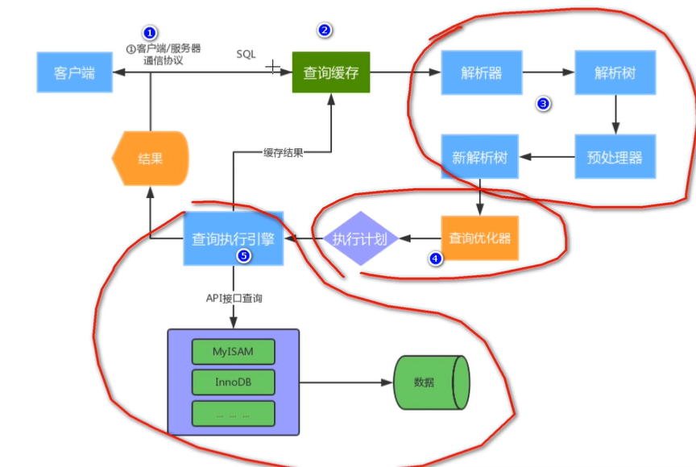

> 第一部分 MySQL架构原理

[MySQL 5.7 Reference Manual](https://dev.mysql.com/doc/refman/5.7/en/)

# 1 MySQL 体系结构

MySQL Server 架构自顶向下大致可以分为网络连接层、服务层、存储引擎层 和 系统文件层。

## 1.1 网络连接层

客户端连接器（Client Connectors）：提供与MySQL服务器建立的支持。目前几乎支持所有主流的服务端编程技术，例如常见的 Java、C、Python、.NET 等，它们通过各自 API 技术与MySQL 建立连接。

## 1.2 服务层（MySQLServer）

服务层是 MySQL Server 的核心，主要包含系统管理的控制工具、连接池、SQL接口、解析器、查询优化器 和 缓存六个部分。

1. 连接池（Connection Pool）：负责存储和管理客户端与数据库的连接，一个线程负责管理一个连接。

2. 系统管理和控制工具（Management Services & Utilities）：例如备份恢复、安全管理、集群管理等。

3. SQL接口（SQL Interface）：用于接收客户端发送的各种SQL命令，并且返回用户需要查询的结果。比如 DML、DDL、存储过程、视图、触发器 等。

4. 解析器（Parser）：负责将请求的 SQL 解析成一个 “解析树”。然后根据一些 MySQL 规则进一步检查解析树是否合法。

5. 查询优化器（Optimizer）：当 “解析树” 通过解析语法检查后，将交由优化器将其转化成执行计划，然后与存储引擎交互。

   > select uid, name from user where gender=1;
   >
   > 选取 --> 投影 --> 连接策略
   >
   > 1. select 先根据 where 语句进行选取，并不是查询出全部数据再过滤
   > 2. select 查询根据 uid 和 name 进行属性投影，并不是取出所有字段
   > 3. 将前面选取和投影连接起来最终生成查询结果

6. 缓存（Cache & Buffer）：缓存机制是由一系列小缓存组成的。比如表缓存、记录缓存、权限缓存、引擎缓存等。如果查询缓存有命中的查询结果，查询语句就可以直接去查询缓存中取数据。

## 1.3 存储引擎层（Pluggable Storage Engines）

存储引擎负责 MySQL 中数据的存储与提取，与底层系统文件进行交互。MySQL 存储引擎是插件式的，服务器中的查询执行引擎通过接口与存储引擎进行通信，接口屏蔽了不同存储引擎之间的差异。现在有很多种存储引擎，各有各的特点，最常见的是 MyISAM 和 InnoDB。 

## 1.4 系统文件层（File System）

该层负责将数据库的数据和日志存储在文件系统之上，并完成与存储引擎的交互，是文件的物理存储层。主要包含日志文件、数据文件、配置文件、pid 文件、socket 文件等。

1. 日志文件

   - 错误日志（Error log）

     默认开启，show variables like '%log_error%';

   - 通用查询日志（General query log）

     记录一般查询语句，show variables like '%general%';

   - 二进制日志（binary log）

     记录了对 MySQL 数据库执行的更改操作，并且记录了语句的发生时间、执行时长；但是它不记录 select、show 等不修改数据的 SQL。主要用于数据库恢复和主从复制。

     show variables like '%log_bin%'; // 是否开启

     show variables like '%binlog%'; // 参数查看

     show binary logs; // 查看日志文件

   - 慢查询日志（Slow query log）

     记录所有执行时间超时的查询 SQL，默认是 10s。

     show variables like '%show_query%'; // 是否开启

     show variables like '%long_query_time%'; // 时长

2. 配置文件

   用于存放 MySQL 所有的配置文件，比如 my.cnf、my.ini 等

3. 数据文件

   - db.opt 文件：记录这个库的默认使用的字符集和校验规则。
   - frm 文件：存储与表相关的元数据（meta）信息，包括表结构的定义信息等，每一张表都会有一个 frm 文件。
   - MYD 文件：MyISAM 存储引擎专用，存放 MyISAM 表的数据（data），每一张表都会有一个 .MYD 文件。
   - MYI 文件：MyISAM 存储引擎专用，存放 MyISAM 表得索引相关信息，每一张 MyISAM 表对应一个 .MYI 文件。
   - ibd 文件 和 IBDATA 文件：存放 InnoDB 的数据文件（包括索引）。InnoDB 存储引擎有两种表空间方式：**独享表空间** 和 **共享表空间**。独享表空间使用 .ibd 文件来存放数据，且每一张 InnoDB 表对应一个 .ibd 文件。共享表空间使用 .ibdata 文件，所有表共同使用一个（或多个，自行配置）.ibdata 文件。
   - ibdata1 文件：系统表空间数据文件，存储表元数据，Undo 日志等。
   - ib_logfile0、ib_logfile1 文件：Redo log 日志文件。

4. pid 文件

   pid 文件是 mysqld 应用程序在 Unix/Linux 环境下的一个进程文件，和许多其他 Unix/Linux 服务端程序一样，它存放着自己的进程 id。

5. socket 文件

   socket 文件也是在 Unix/Linux 环境下才有的，用户在 Unix/Linux 环境下客户端连接可以不通过 TCP/IP 网络而直接使用 Unix Socket 来连接 MySQL。

# 2 MySQL运行机制

## 2.1 建立连接（Connectors&Connection Pool）

通过客户端/服务器通信协议 与 MySQL 建立连接。MySQL 客户端与服务端的通信方式是“半双工”。对于每一个 MySQL 的连接，时刻都有一个线程状态来标识这个连接正在做什么 。

**通讯机制**：

- 全双工：能同时发送和接收数据。
- 半双工：指的某一时刻，要么发送数据，要么接收数据，不能同时。
- 单工：只能发送数据或只能接收数据。

**线程状态**：

show processlist; // 查看用户正在运行的线程信息，root 用户能查看所有线程，其他用户只能看自己的；

1. id：线程ID，可以使用 kill xx;
2. user：启动这个线程的用户
3. Host：发送请求的客户端的 IP 和端口号
4. db：当前命令在哪个库执行
5. Command：该线程正在执行的操作命令
   - Create DB：正在创建库操作
   - Drop DB：正在删除库操作
   - Execute：正在执行一个 PreparedStatement
   - Close Stmt：正在关闭一个 PreparedStatement
   - Query：正在执行一个语句
   - Sleep：正在等在客户端发送语句
   - Quit：正在退出
   - Shutdown：正在关闭服务器
6. Time：表示该线程处于当前状态的时间，单位是秒
7. State：线程状态
   - Updating：正在搜索匹配记录，进行修改
   - Sleeping：正在等在客户端发送新请求
   - Starting：正在执行请求处理
   - Checking table：正在检查数据表
   - Closing table：正在将表中数据刷新到磁盘中
   - Locked：被其他查询锁住了记录
   - Sending Data：正在处理 Select 查询，同时将结果发送给客户端
8. Info：一般记录线程执行的语句，默认显示前 100 个字符。想查看完整的使用 `show full processlist;`

## 2.2 查询缓存（Cache&Buffer）

这是MySQL的一个可优化查询的地方，如果开启了查询缓存，且在查询缓存过程中查询到完全相同的 SQL 语句，则将查询结果直接返回给客户端；如果没有开启查询缓存挥着没有查询到完全相同的 SQL 语句则会由解析器进行语法语义解析，并生成 “解析树”。

- 缓存 Select 查询的结果和 SQL 语句

- 执行 Select 查询时，先查询缓存，判断是否存在可用的记录集，要求是否完全相同（包括参数值），这样才会匹配缓存数据命中。

- 即使开启查询缓存，以下 SQL 也不能缓存

  - 查询语句使用 SQL_NO_CACHE  eg：`SELECT SQL_NO_CACHE	* FROM table_name`

  - 查询的结果大于 query_cache_limit 设置 

    eg：`select @@global.query_cache_limit;` 或 `select @@query_cache_limit;`

  - 查询中有一些不确定的参数，比如 now()

- show variables like '%query_cache%'; 查看查询缓存是否启用，空间大小，限制等。

  

- show status like 'Qcache%';  查看更详细的缓存参数，可用缓存空间，缓存块，缓存多少等。

  

## 2.3 解析器（Parser）

将客户端发送的 SQL 进行语法解析，生成 “解析树”。预处理器根据一些 MySQL 规则进一步检查 “解析树” 是否合法，例如这里将检查数据表和数据列是否存在，还会解析名字和别名，看看它们是否有歧义，最后生成新的 “解析树”。

## 2.4 查询优化器（Optimizer）

根据 “解析树” 生成最优的执行计划。MySQL 使用很多优化策略生成最优的执行计划，可以分为两类：静态优化（编译时优化）、动态优化（运行时优化）。

- 等价变换策略
  - 5=5 and a>5 改成 a>5
  - a<b and a=5 改成 b>5 and a=5
  - 基于联合索引，调整条件位置等
- 优化 count、min、max 等函数
  - InnoDB 引擎 min 函数只需要找索引最左边
  - InnoDB 引擎 max 函数只需要找索引最右边
  - MyISAM 引擎 count(*)，不需要计算，直接返回
- 提前终止查询
  - 使用了 limit 查询，获取 limit 所需的数据，就不再继续遍历后面数据
- in 的优化
  - MySQL 对 in 查询，会先进行排序，再采用二分法查找数据。比如 where id in (2,1,3)，变成 in (1,2,3)

## 2.5 查询执行引擎负责执行SQL语句

此时查询执行引擎会根据 SQL 语句中表的存储引擎类型，以及对应的 API 接口与底层存储引擎缓存 或者 物理文件的交互，得到查询结果并返回给客户端，若开启用查询缓存，这时会将 SQL 语句和结果完整地保存到查询缓存（Cache&Buffer）中，以后若有相同的 SQL 语句执行则直接返回结果。

- 如果开启了查询缓存，先将查询结果做缓存操作
- 返回结果过多，采用增量模式返回

# 3 MySQL存储引擎

存储引擎在 MySQL 的体系架构中位于第三层，负责 MySQL 中的数据存储和提取，是与文件打交道的子系统，它是根据 MySQL 提供的文件访问访问层抽象接口定制的一种文件访问机制，这种机制就叫做存储引擎。

使用 **show engines** 命令，就可以查看当前数据库支持的引擎信息。

在 5.5 版本之前默认采用 MyISAM 存储引擎，从 5.5 开始采用 InnoDB 存储引擎。

- InnoDB：支持事务，具有提交、回滚和崩溃恢复能力，事务安全
- MyISAM：不支持事务和外键，访问速度块
- Memory：利用内存创建表，访问速度非常快，因为数据在内存，而且默认使用 Hash 索引；但是一旦关闭，数据就会丢失
- Archive：归档类型引擎，仅能支持 insert 和 select 语句
- Csv：以 CSV 文件进行数据存储，由于文件限制，所有列必须强制指定 not null，另外 CSV 引擎也不支持索引和分区，适合做数据交换的中间表。
- BlackHole：黑洞，只进不出，进来就消失，所有插入数据都不会保存
- Federated：可以访问远端 MySQL 数据库中的表。一个本地表，不保存数据，访问远程表内容。
- MRG_MYISAM：一组 MyISAM 表的组合，这些 MyISAM 表必须结构相同，Merge 表本身没有数据，对 Merge 操作可以对一组 MyISAM 表进行操作。

## 3.1 InnoDB 和 MyISAM 对比

InnoDB 和 MyISAM 是使用 MySQL 时最常用的两种引擎类型，我们重点来看下两者区别。

- 事务和外键

  InnoDB 支持事务和外键，具有安全性和完整性，适合大量 inset 或 update 操作

  MyISAm 不支持事务和外键，它提供高速存储和检索，适合大量的 select 查询操作

- 锁机制

  InnoDB 支持行级锁，锁定指定记录。基于索引来加锁实现。

  MyISAM 支持表级锁，锁定整张表。

- 索引结构

  InnoDB 使用聚集索引（聚簇索引），索引和记录在一起存储，即缓存索引，也缓存记录

  MyISAM 使用非聚集索引（非聚簇索引），索引和记录分开

- 并发处理能力

  InnoDB 读写阻塞可以与隔离级别有关，可以采用多版本并发控制（MVCC）来支持高并发。

  MyISAM 使用表锁，会导致写操作并发效率低，读之间并不阻塞，读写阻塞。

- 存储文件

  InnoDB 表对应两个文件，一个 .frm 表结构文件，一个 .ibd 数据文件。InnoDB 表最大支持 64TB；

  MyISAM 表对应三个文件，一个 .frm 表结构文件，一个 MYD 表数据文件，一个 .MYI 索引文件。从 MySQL 5.0 开始默认限制是 256TB。

  

- 适用场景

  MyISAM

  - 不需要事务支持（不支持）
  - 并发相对较低（锁定机制问题）
  - 数据修改相对较少，以读为主
  - 数据一致性要求不高

  InnoDB

  - 需要事务支持（具有较好的事务特性）
  - 行级锁定对高并发有很好的适应能力
  - 数据更新较为频繁的场景
  - 数据一致性要求较高
  - 硬件设备内存较大，可以利用 InnoDB 较好的缓存能力来提高内存利用率，减少磁盘 IO

- 总结

  两种引擎该如何选择？

  - 是否需要事务？有，InnoDB
  - 是否存在并发修改？有，InnoDB
  - 是否追求快速查询，且数据修改少？是，MyISAM
  - 在绝大多数情况下，推荐使用 InnoDB

扩展资料：各个存储引擎特性对比 [**Storage Engines Feature Summary**](https://dev.mysql.com/doc/refman/5.7/en/storage-engines.html)

## 3.2 InnoDB 存储结构

从 MySQL 5.5 版本开始默认使用 InnoDB 作为引擎，它擅长处理事务，具有自动崩溃恢复的特性，在日常开发中使用非常广泛，下面是[MySQL 5.7 官方的 InnoDB 引擎架构图](https://dev.mysql.com/doc/refman/5.7/en/innodb-architecture.html)，主要分为 [内存结构](https://dev.mysql.com/doc/refman/5.7/en/innodb-in-memory-structures.html) 和 [磁盘结构](https://dev.mysql.com/doc/refman/5.7/en/innodb-on-disk-structures.html) 两大部分。

### 3.2.1 InnoDB 内存结构

[InnoDB In-Memory Structures](https://dev.mysql.com/doc/refman/5.7/en/innodb-in-memory-structures.html)

内存结构主要包括 [Buffer Pool](https://dev.mysql.com/doc/refman/5.7/en/innodb-buffer-pool.html)、[Change Buffer](https://dev.mysql.com/doc/refman/5.7/en/innodb-change-buffer.html)、Adaptive Hash Index 和 Log Buffer  四大组件。

#### 3.2.1.1 Buffer Pool

缓冲池，简称 BP。BP 以 Page 页为单位，默认大小 16K，BP 的底层采用链表数据结构管理 Page。在 InnoDB 访问表记录和索引时会在 Page 页中缓存，以后使用可以减少磁盘 IO 操作，提升效率。

##### 3.2.1.1.1 Page 管理机制

Page 根据状态可以分为三种类型

- free page：空闲 page，未被使用。
- clean page：被使用 page，数据没有被修改过。
- dirty page：脏页，被使用 page，数据被修改过，页中数据和磁盘的数据产生了不一致。

针对上述三种 page 类型，InnoDB 通过三种链表结构来维护和管理

1. free list：表示空闲缓冲区，管理 free page。
2. flush list：表示需要刷新到磁盘的缓冲区，管理 dirty page，内部 page 按修改时间排序。脏页即存在于 flush 链表，也在 LRU 链表中，但是两种互不影响，LRU 链表负责管理 page 的可用性和释放，而 flush 链表负责管理脏页的刷盘操作。
3. lru list：表示正在使用的缓冲区，管理 clean page 和 dirty page，缓冲区以 midpoint 为基点，前面链表称为 new 列表区，存放经常访问的数据，占63%；后面的链表称为 old 列表区，存放使用较少数据，占37%。

##### 3.2.1.1.2 改进型 LRU（Least Recently Used） 算法维护

普通 LRU：末尾淘汰法，新数据从链表头部加入，释放空间时从末尾淘汰

改进型 LRU：链表分为 new 和 old 两个部分，加入元素时并不是从表头插入，而是从中间 midpoint 位置插入，如果数据很快被访问，那么 page 就会向 new 列表头部移动，如果数据没有被访问，会逐步向 old 尾部移动，等待淘汰。

每当有新的 page 数据读取到 buffer pool 时，InnoDB 引擎会判断是否有空闲页，是否足够，如果有就将 free page 从 从 free list 列表删除，放入到 LRU 列表中。没有空闲页，就会根据 LRU 算法淘汰 LRU 链表默认的页，将内存空间分配给新的页。

##### 3.2.1.1.3 Buffer Pool 配置参数

`show variables like '%innodb_page_size%';` 查看 page 页大小

`show variables like '%innodb_old%';` 查看 lru list 中 old 列表参数

`show variables like '%innodb_buffer%';` 查看 buffer pool 参数

建议：将 innodb_buffer_pool_size 设置为总内存大小的 60% - 80%，innodb_buffer_pool_instances 可以设置为多个，这样可以避免缓存争夺。

使用 innodb 的监控器监控 buffer pool 状态 ，使用 `SHOW ENGINE INNODB STATUS` sql 语句。

#### 3.2.1.2 Change Buffer

写缓冲区，简称 CB。在进行 DML（Data Manipulation Language）操作时，如果 BP 没有其相应的 Page 数据，并不会立刻将磁盘页加载到缓冲池，而是在 CB 记录缓冲变更，等未来数据被读取时，再将数据合并恢复到 BP 中。

Change Buffer 占用 Buffer Pool 空间，默认占 25%，最大允许占 50%，可以根据读写业务量来进行调整。参数 `innodb_change_buffer_max_size`。

当更新一条记录时，该记录在 BufferPool 存在，直接在 BufferPool 修改，一次内存操作。如果该记录在 BufferPool 不存在（没有命中），会直接在 ChangeBuffer 进行一次内存操作，不再去磁盘查询数据，避免一次磁盘 IO。当下次查询记录时，会先进行磁盘读取，然后再从 ChangeBuffer 中读取信息合并，最终载入 BufferPool 中。

**写缓冲区，仅适用于非唯一普通索引页，为什么？** 如果索引设置了唯一性，在进行修改时，InnoDB必须要做唯一性校验，因此必须查询磁盘，做一次 IO 操作。会直接将记录缓存到BufferPool中，然后在缓冲池修改，不会在 ChangeBuffer 操作。

#### 3.2.1.3 Adaptive Hash Index

自适应哈希索引，用于优化对 BP 数据的查询。InnoDB 存储引擎会监控对表索引的查找，如果观察到建立哈希索引可以带来速度的提升，则建立哈希索引，所以称之为自适应。InnoDB 存储引擎会自动根据访问的频率和模式来为某些页建立哈希索引。

#### 3.2.1.4 Log Buffer

日志缓冲区，用来保存要写入磁盘上 log 文件（Redo/Undo）的数据，日志缓冲区的内容定期刷新到磁盘 log 文件中。日志缓冲区满时 会自动将其刷新到磁盘，当遇到 BLOB 或多行更新的大事务操作时，增加日志缓冲区可以节省磁盘 I/O。

LogBuffer 主要是用于记录 InnoDB 引擎日志，在 DML 操作时会产生 Redo 和 Undo 日志。 LogBuffer 空间满了，会自动写入磁盘，可以通过将 innodb_log_buffer_size 参数调大，减少磁盘 IO 频率。

innodb_flush_log_at_trx_commit 参数控制日志刷新行为，默认为1：

- 0：每隔1s 写日志文件和刷盘操作（写日志文件 LogBuffer --> OS cache，刷盘 OS cache --> 磁盘文件），最多丢失1s 数据。
- 1：事务提交，立刻写日志文件 和 刷盘，数据不丢失，但是会频繁 IO 操作
- 2：事务提交，立刻写日志文件，每隔1s 进行刷盘操作

### 3.2.2 InnoDB 磁盘结构

### 3.2.3 新版本结构演变

## 3.3 InnoDB 线程模型

## 3.4 InnoDB 数据文件

## 3.5 Undo Log

## 3.6 Redo Log 和 Binlog