mysql主从搭建和双主搭建涉及到的服务器

| 角色          | IP            | 主机名（修改/etc/hostname,init 6重启） |      |
| ------------- | ------------- | -------------------------------------- | ---- |
| MySQL_Master1 | 192.168.1.150 |                                        |      |
| MySQL_Master2 | 192.168.1.153 |                                        |      |
| MySQL_Slave1  | 192.168.1.152 |                                        |      |
| MySQL_Proxy   | 192.168.1.156 |                                        |      |

# 1.mysql主从搭建

## 1.1mysql安装

1.wget下载rpm

```shell
wget https://downloads.mysql.com/archives/get/p/23/file/mysql-5.7.28-1.el7.x86_64.rpm-bundle.tar
```

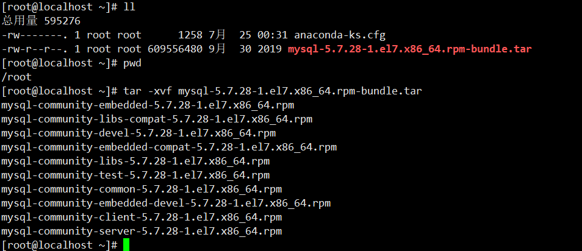

2.删除mariadb

```shell
rpm -qa|grep mariadb
rpm -e mariadb-libs-5.5.64-1.el7.x86_64 --nodeps
```

3.安装MySQL

```shell
rpm -ivh mysql-community-common-5.7.28-1.el7.x86_64.rpm
rpm -ivh mysql-community-libs-5.7.28-1.el7.x86_64.rpm
rpm -ivh mysql-community-libs-compat-5.7.28-1.el7.x86_64.rpm
rpm -ivh mysql-community-client-5.7.28-1.el7.x86_64.rpm
rpm -ivh mysql-community-server-5.7.28-1.el7.x86_64.rpm
rpm -ivh mysql-community-devel-5.7.28-1.el7.x86_64.rpm
```

4.安装过程中出现的问题及解决

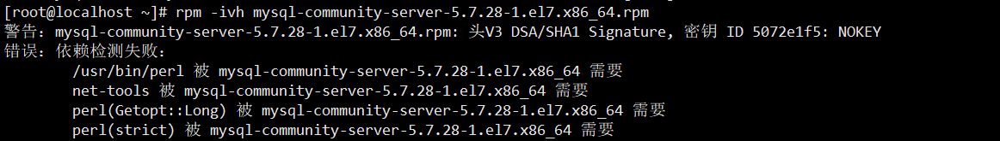

```sh
yum search perl
yum search libaio 
yum search net-tools

yum -y install perl.x86_64
yum install -y libaio.x86_64
yum -y install net-tools.x86_64
```

5.初始化用户

```shell
mysqld --initialize --user=mysql
```

6.查看临时密码

```sh
cat /var/log/mysqld.log
```

7.启动mysql服务

```shell
systemctl start mysqld.service
```

8.查看mysql服务状态

```shell
systemctl status mysqld.service
```

9.登录，使用临时密码

```sql
mysql -uroot -p
```

10.修改密码

```sql
set password=password('123456');
```

11.MySQL配置为开启启动

```shell
systemctl enable mysqld
```

12.关闭防火墙

```shell
systemctl status firewalld
systemctl stop firewalld
systemctl disable firewalld.service
```

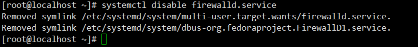

13.默认的datadir目录：/var/lib/mysql

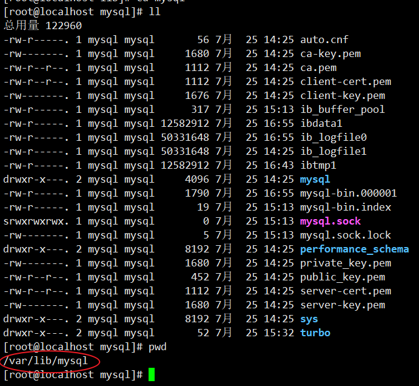

## 1.2 mysql主从配置

### 1.2.1 Mater节点配置

1.编辑my.cnf

```
vi /etc/my.cnf
```

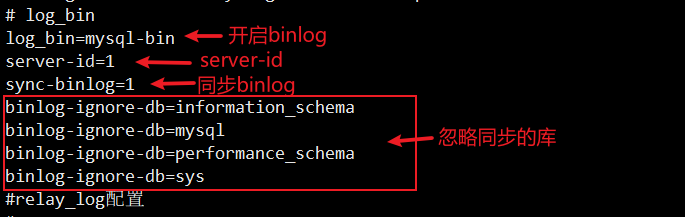

2.重启mysql服务

```sh
systemctl restart mysqld
```

3.主库给从库授权

```sql
mysql> grant replication slave on *.* to root@'%' identified by '123456';
mysql> grant all privileges on *.* to root@'%' identified by '123456';

mysql> flush privileges;
mysql> show master status;
```

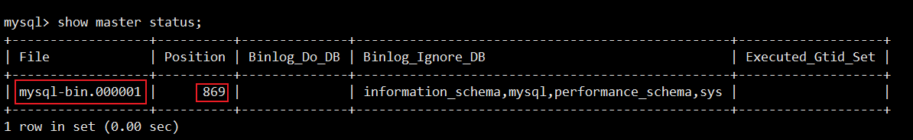

### 1.2.2 slave节点配置

1.修改my.cnf，slave的server-id=2


2.重启服务

```
systemctl restart mysqld
```

3.开启同步

```sql
change master to master_host='192.168.1.150',master_port=3306,master_user='root',master_password='123456',master_log_file='mysql-bin.000001',master_log_pos=869;
# 开启slave
start slave;
```

4.观察slave同步是否正常

```sql
show slave status \G;
```

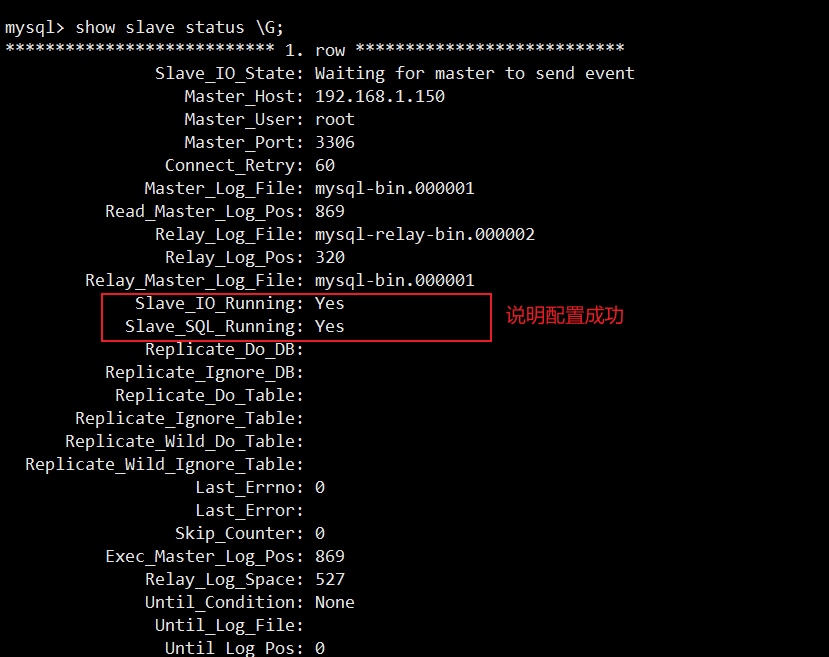

## 1.3 配置半同步复制

### 1.3.1 Master 节点

1.检查mysql是否支持动态添加插件

```
select @@have_dynamic_loading;
```


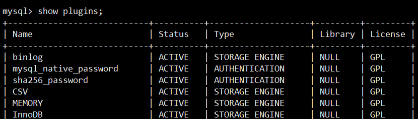

2.在master上安装插件`rpl_semi_sync_master`

```sql
install plugin rpl_semi_sync_master soname 'semisync_master.so';
show variables like '%semi%';
```

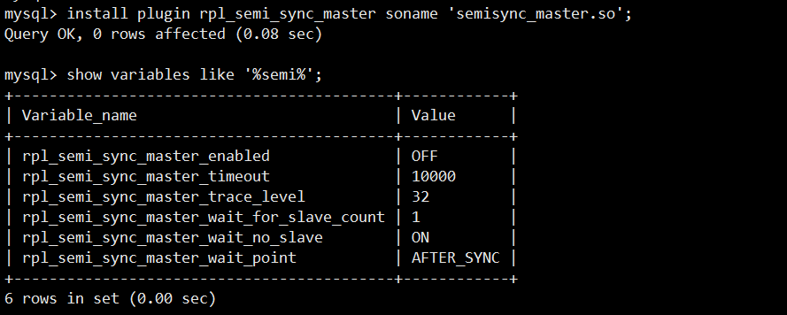

3.配置

```sql
#启动master 支持半同步复制
set global rpl_semi_sync_master_enabled=1;
#主库等待半同步复制信息返回的超时间隔，默认10秒,改为1秒（单位毫秒）
set global rpl_semi_sync_master_timeout=1000;
//建议在my.cnf中配置
```

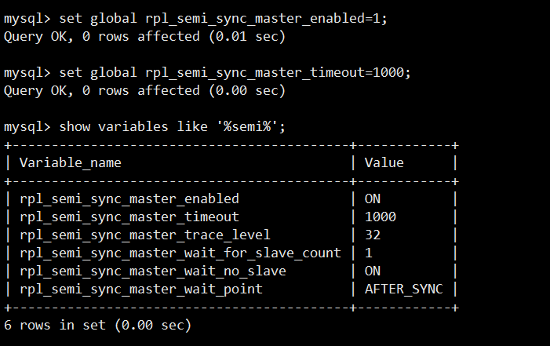

4.重启mysql

```
systemctl restart mysqld
```

### 1.3.2 Slave 节点

1.在slave上安装插件：`rpl_semi_sync_slave`

```
install plugin rpl_semi_sync_slave soname 'semisync_slave.so';
show variables like '%semi%';
```

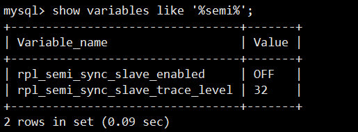

2.启动slave支持半同步复制

```
set global rpl_semi_sync_slave_enabled=1;
```

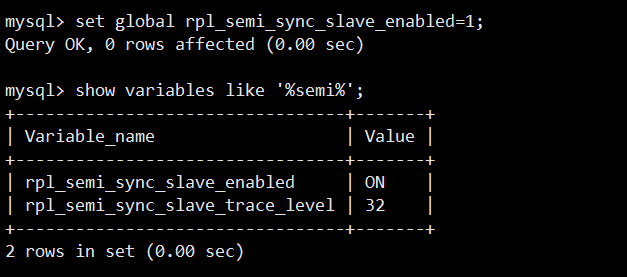

```
root@localhost (none)>show global status like 'rpl_semi%';
+----------------------------+-------+
| Variable_name              | Value |
+----------------------------+-------+
| Rpl_semi_sync_slave_status | OFF   |    #表示当前处于异步模式还是半同步模式
+----------------------------+-------+
```

4、重启从库的slave

```
stop slave;
start slave;
```

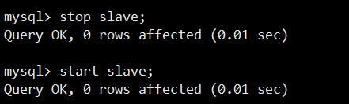

### 1.3.3 测试半同步状态

在master端，查看日志

```
cat /var/log/mysqld.log
```

可以看到日志已经启动半同步信息。

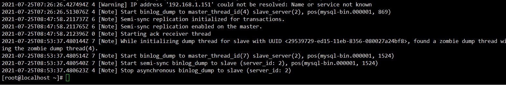


## 1.4 并行复制-组复制

**MySQL 5.7是基于组提交的并行复制**，组复制是并行复制的范畴。

### 1.4.1 Master 节点配置

```
show variables like '%binlog_group%';
```

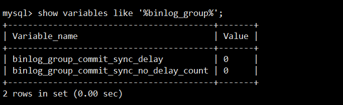

1.引入并行复制

```shell
#组提交同步延迟时间为1s
set global binlog_group_commit_sync_delay=1000;
# binlog_group_commit_sync_no_delay_count ，这个参数表示我们在binlog_group_commit_sync_delay等待时间内，
# 如果事务数达到binlog_group_commit_sync_no_delay_count 设置的参数，就会触动一次组提交，
# 如果这个值设为为0的话就不会有任何的影响。 如果到达时间但是事务数并没有达到的话，也是会进行一次组提交操作的。
set global binlog_group_commit_sync_no_delay_count=100;
```

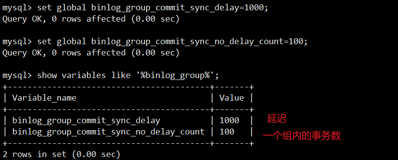

建议修改my.cnf，并重启。

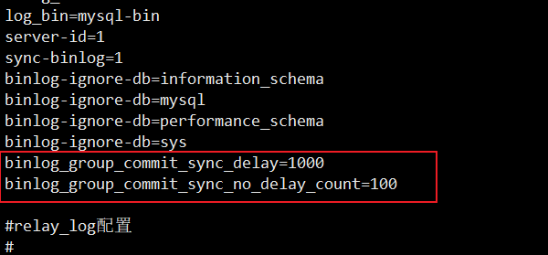

### 1.4.2 Slave节点配置

```
show variables like '%slave%';
```

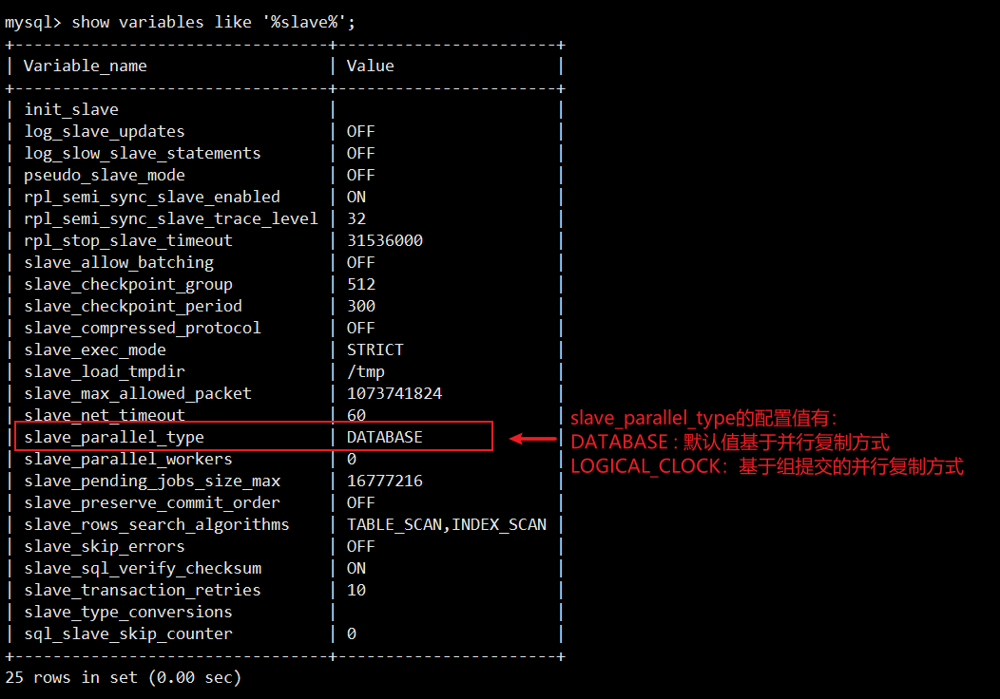

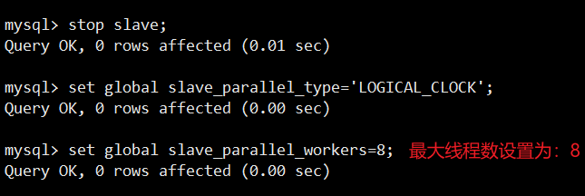

```
show variables like '%relay_log%';
```

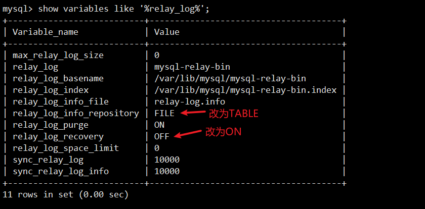


只读属性relay_log_recovery ，在my.cnf中修改

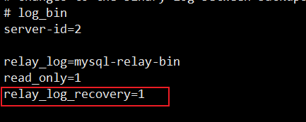

```
systemctl restart mysqld
```

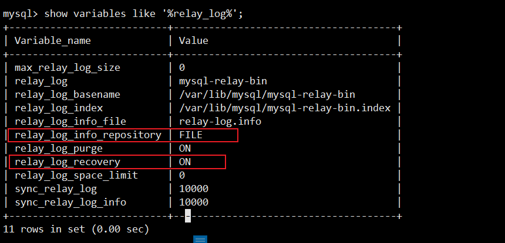

在my.cnf中修改，

```
slave_parallel_type=LOGICAL_CLOCK 			#基于组提交的并行复制
slave_parallel_workers=8 					#线程数
relay_log_recovery=1 						#开启relay_log复制
master_info_repository=TABLE				#设置为TABLE，这样性能可以有50%-80%的提升
relay_log_info_repository=TABLE 
```

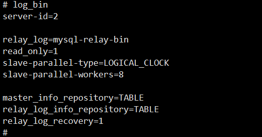

修改后重启mysql

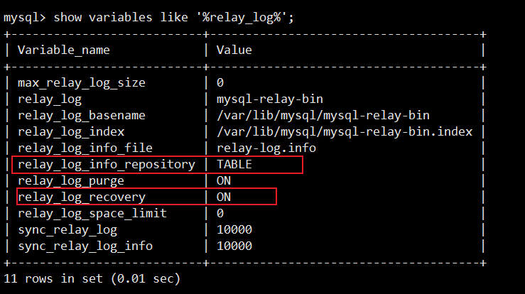


### 1.4.3 并行复制监控

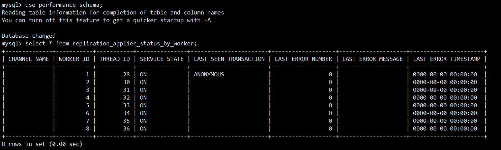

## 1.5 读写分离

### 1.5.1 mysql Proxy的安装配置

1关闭防火墙

```
systemctl stop firewalld
systemctl disable firewalld.service
```

2.解压

```
 tar -xvf mysql-proxy-0.8.5-linux-el6-x86-64bit.tar.gz 
```

3.配置文件

```
vi /etc/mysql-proxy.cnf
```

```properties
[mysql-proxy]
user=root
admin-username=root
admin-password=123456
proxy-address=192.168.1.156:4040
proxy-backend-addresses=192.168.1.150:3306
proxy-read-only-backend-addresses=192.168.1.151:3306
proxy-lua-script=/root/mysql-proxy-0.8.5-linux-el6-x86-64bit/share/doc/mysql-proxy/rw-splitting.lua
log-file=/var/log/mysql-proxy.log
log-level=debug
daemon=true
keepalive=true

```

4.配置权限

```
chmod 660 /etc/mysql-proxy.cnf 
```

5.修改lua脚本

```shell
[root@localhost ~]# vi mysql-proxy-0.8.5-linux-el6-x86-64bit/share/doc/mysql-proxy/rw-splitting.lua
```

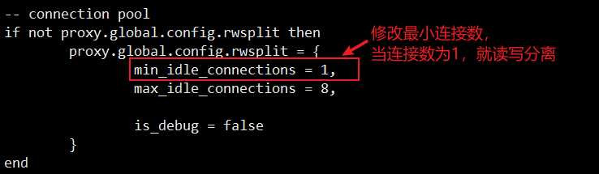

6.启动


### 1.5.2 测试：

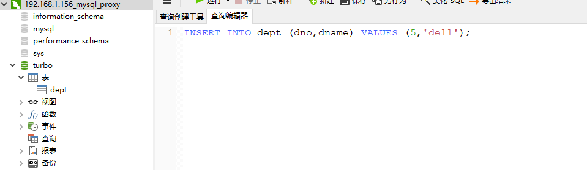


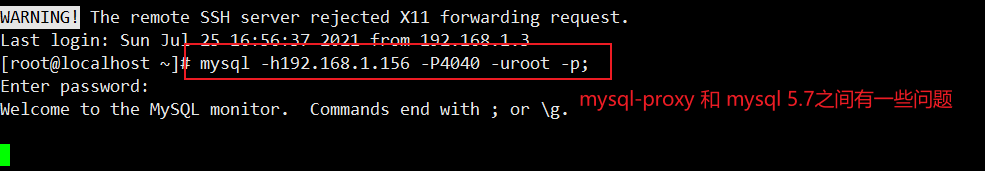

# 2.mysql双主搭建

搭建master2 (192.168.1.153)

## 2.1 Master1节点配置

1.master1 ,my.cnf 修改

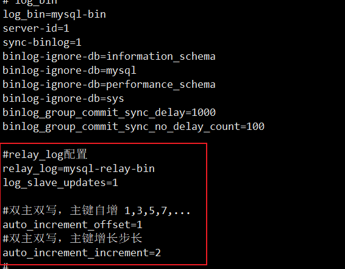

2.重启mysql

```
systemctl restart mysqld
```

show master status;

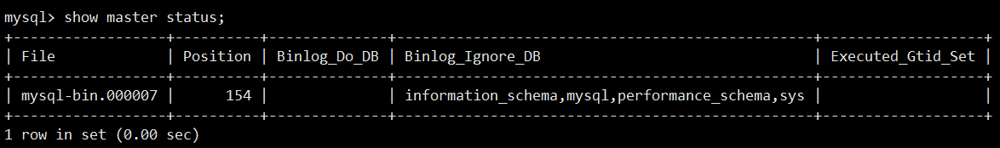

3.授权

参考主从配置中的授权（在主从配置中已经授权，此处不再操作）。

## 2.2 Master2 节点配置

1.修改my.cnf

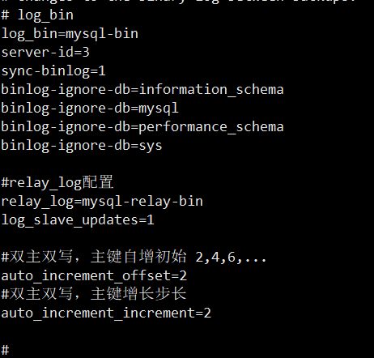

2.重启mysql

```
systemctl restart mysqld
```

3 授权

```sql
mysql> grant replication slave on *.* to root@'%' identified by '123456';
mysql> grant all privileges on *.* to root@'%' identified by '123456';

mysql> flush privileges;
mysql> show master status;
```

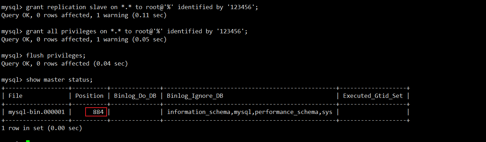

```
show master status;
```

## 2.3 复制配置

### master1 上配置

```
mysql> change master to master_host='192.168.1.153',master_port=3306,master_user='root',master_password='123456',master_log_file='mysql-bin.000001',master_log_pos=884;
```

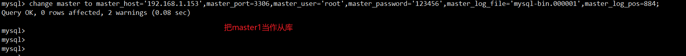

```
start slave;
show slave status \G;
```

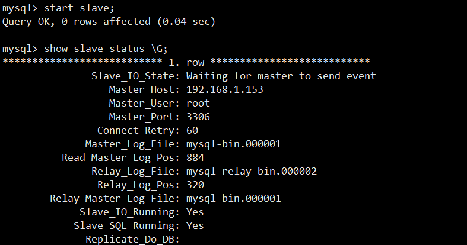

### master2  上配置

把master当作从库

```
mysql> change master to master_host='192.168.1.150',master_port=3306,master_user='root',master_password='123456',master_log_file='mysql-bin.000008',master_log_pos=154;
```

```
start slave;
```

```
show slave status \G;
```

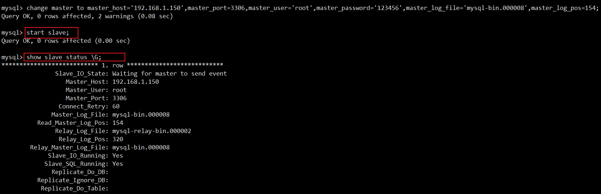


## 2.4 测试：

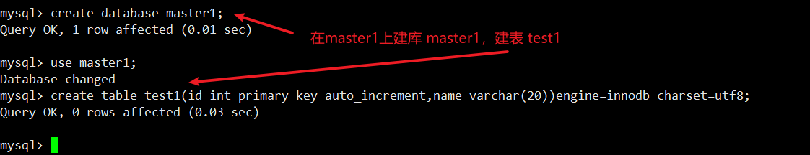

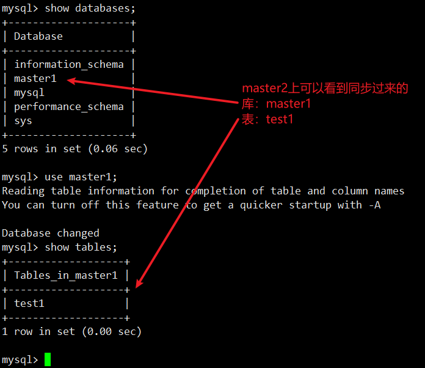

在master1和master2上插入数据，会发现主键递增的步长为2

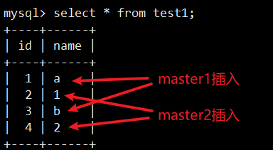

# 3.MHA搭建

## 3.1 环境准备

| 名称              | IP            | 角色         |      |
| ----------------- | ------------- | ------------ | ---- |
| MHA_Manager       | 192.168.1.160 | MHA Manager  |      |
| MHA_MySQL_Master1 | 192.168.1.161 | MySQL_Master |      |
| MHA_MySQL_Slave1  | 192.168.1.162 | MySQL_Slave  |      |
| MHA_MySQL_Slave2  | 192.168.1.163 | MySQL_Slave  |      |

三台MySQL服务上配置好，主从配置，半同步复制。

注意161、162上开启主库给从库授权。

161的my.cnf

```
log_bin=mysql-bin
server-id=1
sync-binlog=1

#relay log
relay-log=mysql-relay-bin
relay_log_purge=0
log_slave_updates=1

binlog-ignore-db=information_schema
binlog-ignore-db=mysql
binlog-ignore-db=performance_schema
binlog-ignore-db=sys

#半同步复制
rpl_semi_sync_master_enabled=1
rpl_semi_sync_master_timeout=1000
rpl_semi_sync_slave_enabled=1
```

162的my.cnf

```
log_bin=mysql-bin
server-id=2
sync-binlog=1

#relay log
relay-log=mysql-relay-bin
relay_log_purge=0
log_slave_updates=1

binlog-ignore-db=information_schema
binlog-ignore-db=mysql
binlog-ignore-db=performance_schema
binlog-ignore-db=sys

#半同步复制
rpl_semi_sync_master_enabled=1
rpl_semi_sync_master_timeout=1000
rpl_semi_sync_slave_enabled=1
```


## 3.2 四台服务器互通

在四台服务器上分别执行下面命令，生成公钥和私钥（注意：连续按换行回车采用默认值）

```
ssh-keygen -t rsa
```

在三台MySQL服务器分别执行下面命令，密码输入系统密码，将公钥拷到MHA Manager服务器上

```
ssh-copy-id 192.168.1.160
```

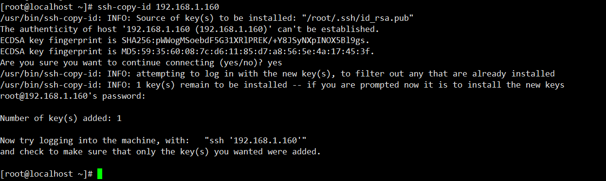

之后可以在MHA Manager服务器上检查下，看看.ssh/authorized_keys文件是否包含3个公钥

```
cat /root/.ssh/authorized_keys
```

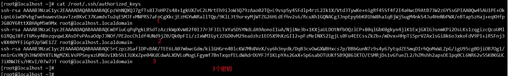

执行下面命令，将MHA Manager的公钥添加到authorized_keys文件中（此时应该包含4个公钥）

```
cat /root/.ssh/id_rsa.pub >> /root/.ssh/authorized_keys
```

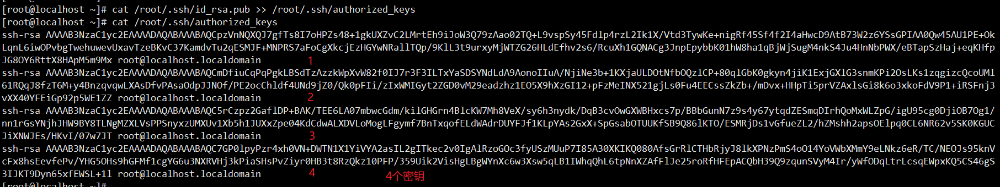

从MHA Manager服务器执行下面命令，向其他三台MySQL服务器分发公钥信息。

```
scp /root/.ssh/authorized_keys root@192.168.1.161:/root/.ssh/authorized_keys
scp /root/.ssh/authorized_keys root@192.168.1.162:/root/.ssh/authorized_keys
scp /root/.ssh/authorized_keys root@192.168.1.163:/root/.ssh/authorized_keys
```

可以MHA Manager执行下面命令，检测下与三台MySQL是否实现ssh互通。

```
ssh 192.168.1.161
exit
ssh 192.168.1.162 
exit
ssh 192.168.1.163 
exit
```

## 3.3 MHA下载安装

### 3.3.1 MHA下载

MySQL5.7对应的MHA版本是0.5.8，所以在GitHub上找到对应的rpm包进行下载，MHA manager和 node的安装包需要分别下载：

```shell
https://github.com/yoshinorim/mha4mysql-manager/releases/tag/v0.58
https://github.com/yoshinorim/mha4mysql-node/releases/tag/v0.58
```


```shell
wget https://github.com/yoshinorim/mha4mysql-manager/releases/download/v0.58/mha4mysql-manager-0.58-0.el7.centos.noarch.rpm

wget https://github.com/yoshinorim/mha4mysql-node/releases/download/v0.58/mha4mysql-node-0.58-0.el7.centos.noarch.rpm
```

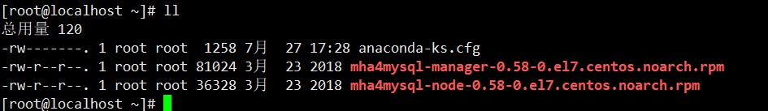

**三台MySQL服务器需要安装node，MHA Manager服务需要安装manager和mode**

### 3.3.2 MHA node 安装

在四台服务器上安装mha4mysql-node。

MHA的Node依赖于perl-DBD-MySQL，所以要先安装perl-DBD-MySQL。

```shell
yum install perl-DBD-MySQL -y
# 安装下载好的 mha4mysql-node
rpm -ivh mha4mysql-node-0.58-0.el7.centos.noarch.rpm
```

### 3.3.3 MHA Manager 安装

在MHA Manager服务器安装mha4mysql-node和mha4mysql-manager。

MHA的manager又依赖了perl-Config-Tiny、perl-Log-Dispatch、perl-Parallel-ForkManager，也分别进行安装。

```shell
wget http://dl.fedoraproject.org/pub/epel/epel-release-latest-7.noarch.rpm
rpm -ivh epel-release-latest-7.noarch.rpm

yum install perl-DBD-MySQL perl-Config-Tiny perl-Log-Dispatch perl-Parallel-ForkManager -y
rpm -ivh mha4mysql-manager-0.58-0.el7.centos.noarch.rpm
```

### 3.3.4 MHA 配置文件

MHA Manager服务器需要为每个监控的 Master/Slave 集群提供一个专用的配置文件，而所有的 Master/Slave 集群也可共享全局配置。

#### 初始化配置目录

```shell
#目录说明 
#/var/log       				(CentOS目录) 
#		/mha					(MHA监控根目录) 
#			/app1				(MHA监控实例根目录)
# 				/manager.log    (MHA监控实例日志文件)
mkdir -p /var/log/mha/app1
touch /var/log/mha/app1/manager.log
```

#### 配置监控全局配置文件

vi /etc/masterha_default.cnf

```shell
[server default]
#主库用户名，在master mysql的主库执行下列命令建一个新用户 
#create user 'mha'@'%' identified by '123123';
#grant all on *.* to mha@'%' identified by '123123'; 
#flush privileges;
user=mha
password=123456
port=3306
#ssh登录账号
ssh_user=root
#从库复制账号和密码
repl_user=root
repl_password=123456
port=3306
#ping次数
ping_interval=1
#二次检查的主机
secondary_check_script=masterha_secondary_check -s 192.168.1.161 -s 192.168.1.162 -s 192.168.1.163

```

#### 配置监控实例配置文件

先创建目录

```
mkdir -p /etc/mha
```

然后编辑文件

```
vi /etc/mha/app1.cnf
```

内容

```shell
[server default]
#监控实例根目录
manager_workdir=/var/log/mha/app1
#MHA监控实例日志文件
manager_log=/var/log/mha/app1/manager.log

#[serverx]            服务器编号
#hostname             主机名
#candidate_master     可以做主库
#master_binlog_dir    binlog日志文件目录

[server1]
hostname=192.168.1.161
candidate_master=1
master_binlog_dir="/var/lib/mysql"


[server2]
hostname=192.168.1.162
candidate_master=1
master_binlog_dir="/var/lib/mysql"


[server3]
hostname=192.168.1.163
candidate_master=1
master_binlog_dir="/var/lib/mysql"
```

### 3.3.5 MHA 配置检测

#### 执行ssh通信检测

在MHA Manager服务器上执行：

```
masterha_check_ssh --conf=/etc/mha/app1.cnf
```

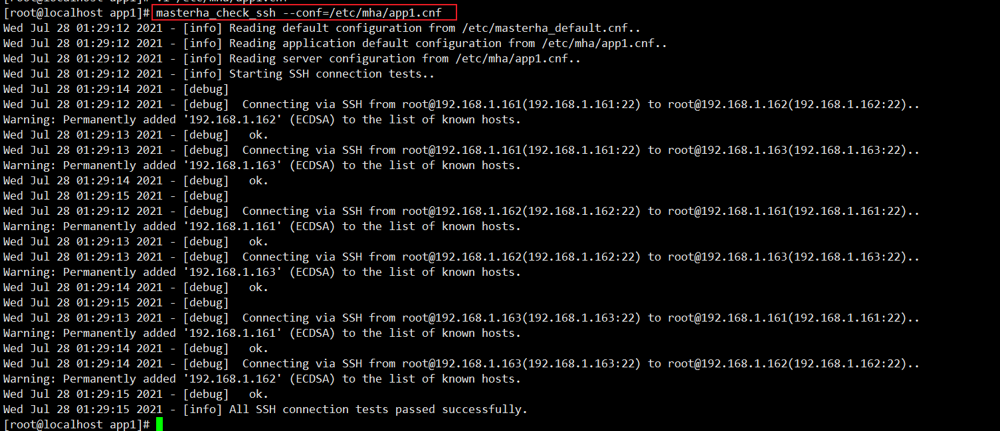

#### 检测MySQL主从复制

在MHA Manager服务器上执行：

```
masterha_check_repl --conf=/etc/mha/app1.cnf
```

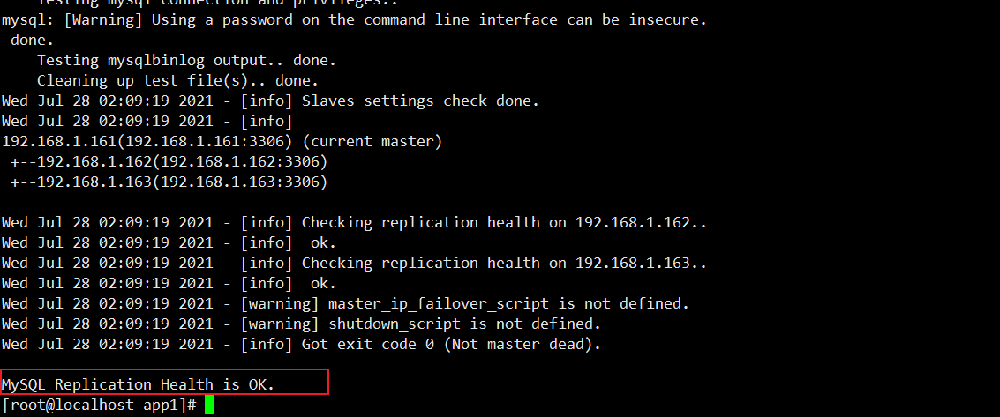

### 3.3.6 MHA Manager启动

在MHA Manager服务器上执行：

```
nohup masterha_manager --conf=/etc/mha/app1.cnf --remove_dead_master_conf --ignore_last_failover < /dev/null > /var/log/mha/app1/manager.log 2>&1 &
```

查看监控状态命令：

```
masterha_check_status --conf=/etc/mha/app1.cnf
```

查看监控日志命令如下：

```
tail -f /var/log/mha/app1/manager.log
```

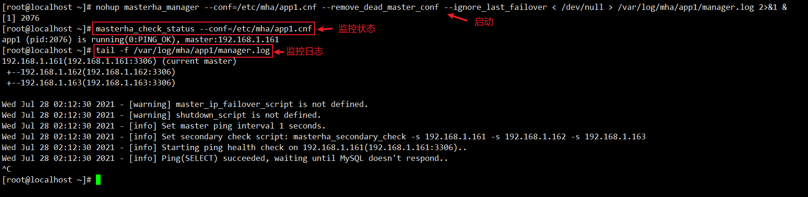

## 3.4 测试

### 3.4.1 测试MHA故障转移（模拟主库崩溃）

在161的master主库上执行

```
systemctl stop mysqld
```

观察MHA日志 162 成为了新的主库。

```
tail -f /var/log/mha/app1/manager.log
```

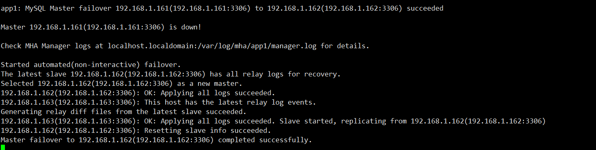

在162上观察主库信息。

```
show master status;
```

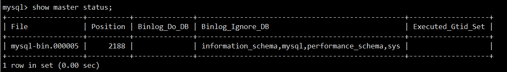

在163上观察，新的主库为162。

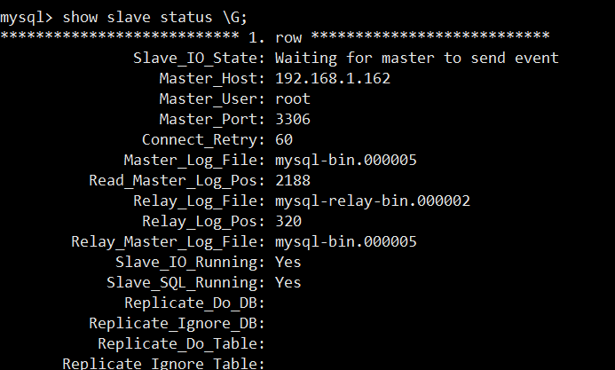

在162上建库，插入数据，

```sql
create TABLE position ( id int(20),name varchar(50), salary varchar(20), city varchar(50)) ENGINE=innodb charset=utf8;

insert into position values(1, 'Java', 13000, 'shanghai');
```

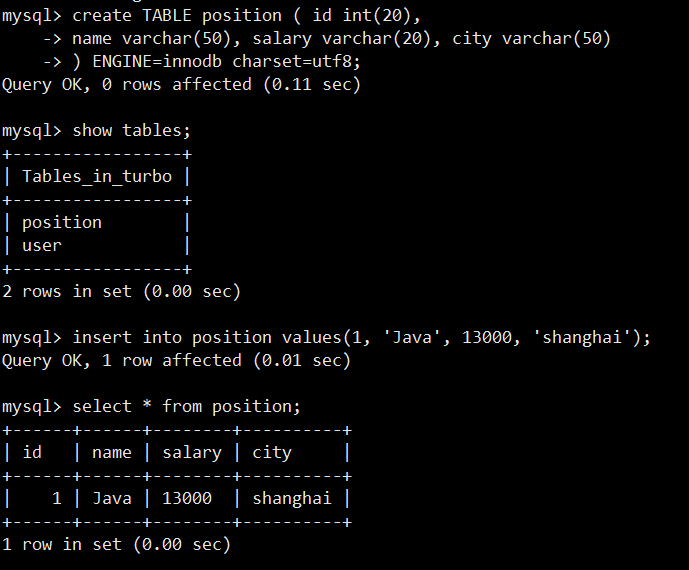

在163上观察，库表和数据都通过过来了：

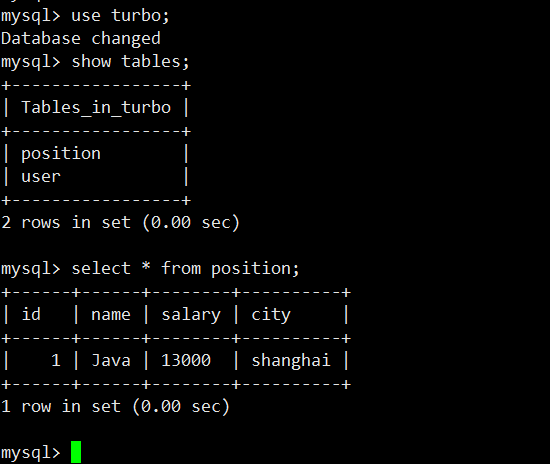

### 3.4.2 将原主库切回为主库

1.启动161数据库

```
systemctl start mysqld
```

2.161挂到新主库162上做从库（找到宕机时的binlog文件和偏移量，从上次宕机时开始恢复）在`/var/log/mha/app1/manager.log`中找到

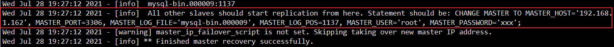

```
change master to master_host='192.168.1.162' ,master_port=3306,master_user='root',master_password='123456',master_log_file='mysql-bin.000005',master_log_pos=2188;

start slave;
```

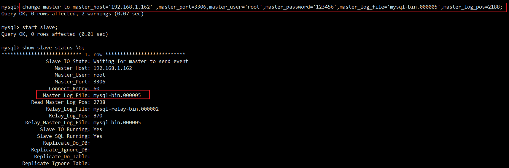

3. 编辑配置文件 /etc/mha/app1.cnf

```shell
[server default]
#监控实例根目录
manager_workdir=/var/log/mha/app1
#MHA监控实例日志文件
manager_log=/var/log/mha/app1/manager.log

#[serverx]            服务器编号
#hostname             主机名
#candidate_master     可以做主库
#master_binlog_dir    binlog日志文件目录

[server1]
hostname=192.168.1.161
candidate_master=1
master_binlog_dir="/var/lib/mysql"


[server2]
hostname=192.168.1.162
candidate_master=1
master_binlog_dir="/var/lib/mysql"


[server3]
hostname=192.168.1.163
candidate_master=1
master_binlog_dir="/var/lib/mysql"
```

4 使用MHA在线切换命令将原主机切换回来

结束MHA Manager进程：

```shell
masterha_stop --global_conf=/etc/masterha/masterha_default.conf --conf=/etc/mha/app1.cnf
```

切换命令

```shell
masterha_master_switch --conf=/etc/mha/app1.cnf --master_state=alive --new_master_host=192.168.1.161 -- new_master_port=3306 --orig_master_is_new_slave --running_updates_limit=10000
```

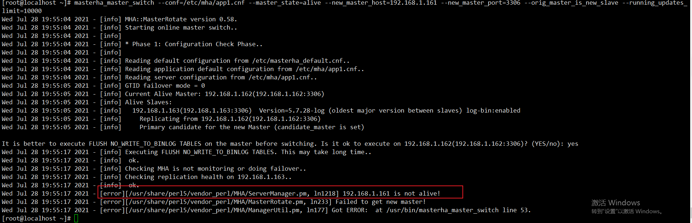

```shell
#修改主机名
vi /etc/hostname 
init 6
```

```shell
#new_master_host=主库主机名
masterha_master_switch --conf=/etc/mha/app1.cnf --master_state=alive --new_master_host=master1 --new_master_port=3306 --orig_master_is_new_slave --running_updates_limit=10000
```

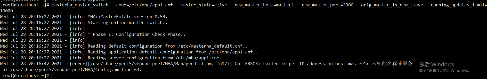

查看切换日志文件，即可了解161节点是否再次切换为主节点

```
show master status;
```


## 错误

主库是162，从库中也有161，报的错：从IO线程不在192.168.1.161(192.168.1.161:3306)上运行，
找到问题就好解决，
在主库上执行

```sql
mysql> reset slave all; 
Query OK, 0 rows affected (0.02 sec)
```


# 扩展：mysqldump

```
mysqldump --all-databases > mysql_backup_all.sql -uroot -p
```

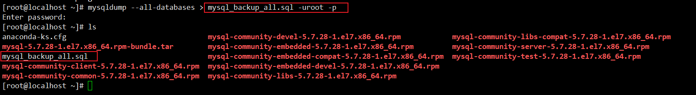

