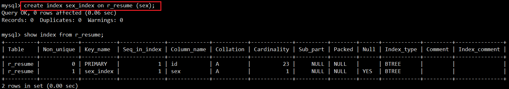
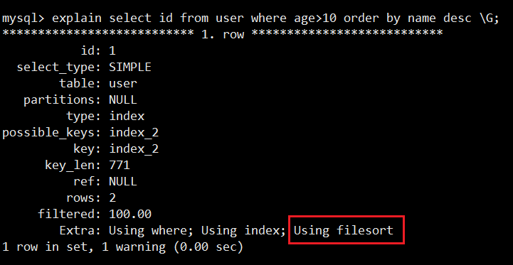

> 第二部分 MySQL索引原理

# 1 索引类型

索引可以提升查询速度，会影响 where 查询，以及 order by 排序。MySQL 索引类型如下：

- 从索引存储结构划分：B Tree 索引、Hash索引、FULLTEXT 全文索引、R Tree 索引
- 从应用层次划分：普通索引、唯一索引、主键索引、复合索引
- 从索引键值类型划分：主键索引、辅助索引（二级索引）
- 从数据存储和索引键值逻辑关系划分：聚集索引（聚簇索引）、非聚集索引（非聚簇索引）

## 1.1 普通索引

这是最基本的索引类型，基于普通字段建立的索引，没有任何限制。

创建普通索引的方法如下：

- CREATE INDEX <索引的名字> ON tablename (字段名);
- ALTER TABLE tablename ADD INDEX[索引的名字] (字段名);
- CREATE TABLE tablename ([...], INDEX[索引的名字] (字段名));



## 1.2 唯一索引

与 “普通索引” 类似，不同的就是：索引字段的值必须唯一，但允许有空值。在创建或修改时追加唯一约束，就会自动创建对应的唯一索引。

创建唯一索引的方法如下：

- CREATE UNIQUE INDEX <索引的名字> ON tablename (字段名);
- ALTER TABLE tablename ADD UNIQUE INDEX [索引的名字] (字段名);
- CREATE TABLE tablename ([...], UNIQUE[索引的名字] (字段名))


## 1.3 主键索引

它是一种特殊的唯一索引，不允许有空值。在创建或修改表时追加主键约束即可，每个表只能有一个主键。

创建主键索引的方法如下：

- CREATE TABLE tablename ([...], PRIMARY KEY (字段名));
- ALTER TABLE tablename ADD PRIMARY KEY (字段名);

## 1.4 复合索引

单一索引是指索引列为一列的情况，即新建索引的语句只能实施在一列；用户可以在多个列上建立索引，这种索引叫做组复合索引（组合索引）。复合索引可以代替多个单一索引，相比多个单一索引，复合索引所需的开销更小。

索引同时有两个概念叫做 **窄索引** 和 **宽索引** ，窄索引 是指索引列为 1-2 列的索引；宽索引 也就是 索引列超过 2 列的索引。设计索引的一个重要原则就是能用窄索引 就不用 宽索引，因为窄索引往往比组合索引更有效。

创建组合索引的方法如下：

- CREATE INDEX <索引的名字> ON tablename (字段名1, 字段名2, ....);
- ALTER TABLE tablename ADD INDEX [索引的名字] (字段名1, 字段名2, ...);
- CREATE TABLE tablename ([...], INDEX[索引的名字] (字段名1, 字段名2, ...));

复合索引使用注意事项：

- 何时使用复合索引，要根据 where 条件建索引，注意不要过多使用索引，过多使用会对更新操作效率有很大影响。
- 如果表已经建立了 (col1, col2)，就没有必要再单独建立 (col1)；如果现在有 (col1) 索引，如果查询需要 col1 和 col2 条件，可以建立 (col1,col2) 复合索引，对于查询有一定提高。

## 1.5 全文索引

查询操作在数据量比较少时，可以使用 like 模糊查询，但是对于大量的文版数据检索，效率很低。如果使用全文索引，查询速度会比 like 快很多倍。在 MySQL 5.6 以前的版本，只有 MyISAM 存储引擎支持全文索引，从 MySQL 5.6 开始 MyISAM 和 InnoDB 存储引擎均支持。

创建全文索引的方法如下：

- CREATE FULLTEXT INDEX <索引的名字> ON tablename (字段名);
- ALTER TABLE tablename ADD FULLTEXT [索引的名字] (字段名);
- CREATE TABLE tablename ([...], FULLTEXT KEY [索引的名字] (字段名));


和常用的 like 模糊查询不同，全文索引有自己的语法格式，使用 match 和 against 关键字，比如

```sql
select * from r_resume where match(email) against('test');
```


全文索引使用注意事项：

- 全文索引必须在字符串、文本字段上建立。
- 全文索引字段值 必须在最小字符和最大字符之间才会有效。（innodb：3-84；myisam：4-84）
- 全文索引字段值 要进行切词处理，按 syntax 字符进行切割，例如 b+aaa，切分成 b 和 aaa
- 全文索引匹配查询，默认使用的是等值匹配，例如 a 匹配 a，不会匹配ab，ac。如果想匹配可以在布尔模式下搜索 a*


```
SELECT * FROM r_resume WHERE MATCH(email) AGAINST ('test*' in boolean mode);
```


```sql
show variables like '%ft%';
```


# 2 索引原理

MySQL 官方对索引定义：是存储引擎用于快速查找记录的一种数据结构。需要额外开辟空间和数据维护工作。

- 索引是物理数据页存储，在数据文件中（InnoDB，ibd文件），利用数据页（page）存储。
- 索引可以加快检索速度，但是同时也会降低 增删改 操作速度，索引维护需要代价。

索引设计的理论知识：二分查找法、hash 和 B + Tree。

## 2.1 二分查找法

二分查找法也叫做折半查找法，他是在有序数组中查找指定数据的搜索算法。它的优点是等值查询，范围查询性能优秀；缺点是更新数据、新增数据、删除数据 维护成本高。

- 首先定位 left 和 right 两个指针
- 计算 (left + right)/2
- 判断除 2 后索引位置值 与 目标值的大小比对
- 索引位置值大于 目标值就 right(=mid-1) 移动；如果小于目标值 就 left(=mid+1) 移动 


## 2.2 Hash 结构

Hash 底层实现是由 Hash 表来实现的，是根据键值 <key,value> 存储数据的结构。非常适合根据 key 查找 value 值，也就是单个 key 查询，或者说等值查询。其结构如下：


从上面结构可以看出，Hash 索引可以方便的提供等值查询，但是对于范围查询就需要全表扫描了。Hash 索引在 MySQL 中 Hash 结构主要应用在 Memory 原生的 Hash 索引、InnoDB 自适应哈希索引。

InnoDB 提供的自适应哈希索引功能强大，接下来重点描述下 InnoDB 自适应哈希索引。

InnoDB 自适应哈希索引是为了提升查询效率，InnoDB 存储引擎会监控表上各个索引页的查询，当 InnoDB 注意到某些索引值访问非常频繁时，会在内存中基于 B+Tree 索引再创建一个哈希索引，使得内存中的 B+Tree 索引具备哈希索引的功能，即能够快速定制访问频繁的索引页。

InnoDB 自适应哈希索引：在使用 Hash 索引访问时，一次性查找就能定位数据，等值查询效率要优于 B+Tree。

自适应哈希索引的建立使得 InnoDB 存储引擎能自动根据索引页访问的频率和模式自动的为某些热点页建立哈希索引来加快访问。另外 InnoDB 自适应哈希索引的功能，用户只能选择开启或关闭功能，无法进行人工干涉。

```sql
show engine innodb status \G;
show variables like '%innodb_adaptive%';
```


## 2.3 B+Tree结构

MySQL 数据库采用的是 B+Tree 结构，在 B-Tree 结构上做了优化改造。

### 2.3.1 B-Tree 结构

- 索引值和 data 数据分布在整棵树结构中
- 每个节点可以存放多个索引值及对应的 data 数据
- 树节点中的多个索引值从 左到右 升序排列


B 树的搜索：从根节点开始，对节点内的索引值序列采用二分法查找，如果命中就结束查找。没有命中会进入子节点重复查找过程，直到所对应的节点指针为空，或已经是叶子节点了才结束。

### 2.3.2 B+Tree 结构

- 非叶子节点不存储 data 数据，只存储索引值，这样便于存储更多的索引值
- 叶子节点包含了所有的索引值 和 data 数据
- 叶子节点用指针连接，提高区间的访问性能


相比 B 树，B+树进行范围查找时，只需要查找定位两个节点的索引值，然后利用叶子节点的指针进行遍历。而 B 树需要遍历范围内所有的节点和数据，显然 B+Tree 效率高。

## 2.4 聚簇索引和辅助索引

聚簇索引和非聚簇索引：B+Tree 的**叶子节点存放主键索引值和行记录就属于聚簇索引**；如果索引值和行记录分开存放就属于非聚簇索引。

主键索引 和 辅助索引：B+Tree 的**叶子节点存放的是主键字段值就属于主键索引**；如果存放的是非主键值就属于辅助索引（二级索引）。

在 InnoDB 引擎中，主键索引采用的就是聚簇索引结构存储。

- 聚簇索引（聚集索引）

  聚簇索引是一种数据存储方式，InnoDB 的聚簇索引就是按照主键顺序构建 B+Tree 结构。B+Tree 的叶子节点就是行记录，行记录和主键值紧凑地存储在一起。这也意味着 InnoDB 的主键索引就是数据表本身，它按主键顺序存放了整张表的数据，占用的空间就是整个表数据量的大小。通常说**主键索引**就是聚簇索引。

- 辅助索引

  InnoDB 辅助索引，也叫作二级索引，是根据索引列构建 B+Tree 结构。但在 B+Tree 的叶子节点中只存了索引列和主键的信息。二级索引占用的空间会比聚簇索引小很多，通常创建辅助索引就是未来提升查询效率。一个表 InnoDB 只能创建一个聚簇索引，但可以创建多个辅助索引。


- 非聚簇索引

  与 InnoDB 表存储不同，MyISAM 数据表的索引文件和数据文件 是分开的，被称为 非聚簇索引结构。


# 3 索引分析与优化

## 3.1 EXPLAIN

[mysql官网中explain解释](https://dev.mysql.com/doc/refman/5.7/en/explain-output.html)

MySQL 提供了一个 EXPLAIN 命令，它可以对 SELECT 语句进行分析，并输出 SELECT 执行的详细信息，供开发人员有针对性地优化。例如：

```sql
explain select * from r_resume where id>3 \G;
```

explain 命令的输出内容大致如下：


### 3.1.1 select_type

表示查询的类型。常用的值如下：

- SIMPLE：表示查询语句不包含子查询 或 union
- PRIMARY：表示此查询是最外层的查询
- UNION：表示此查询是 UNION 的第二个或后续的查询
- DEPENDENT UNION：UNION 中的第二个或后续的查询语句，使用了外面查询结果
- UNION RESULT：
- SUBQUERY：
- DEPENDENT SUBQUERY：

最常见的查询类型是 SIMPLE，表示我们的查询没有子查询也没有用到 UNION 查询。

### 3.1.2 type

表示存储引擎查询数据时采用的方式。比较重要的一个属性，通过它可以判断出查询是全表扫描还是基于索引的部分扫描。常用属性值如下，从上至下 效率依次增强。

- ALL
- index
- range
- ref
- eq_ref
- const
- NULl


### 3.1.3 possible_keys

表示查询时能够使用到的索引。注意并不一定会真正使用，显示的是索引名称。

### 3.1.4 key

表示查询时真正使用到的索引，显示的是索引名称。

### 3.1.5 rows

MySQL 查询优化器会根据统计信息，估算 SQL 要查询到结果需要扫描多少行记录。原则上 rows 是越少效率越高，可以直观的了解到 SQL 效率高低。

### 3.1.6 key_len

表示查询使用了索引的字节数量。可以判断是否全部使用了组合索引。


### 3.1.7 Extra

Extra 表示很多额外的信息，各种操作会在 Extra 提示相关信息，常见几种如下：

- Using where
- Using index
- Using filesort
- Using temporary


## 3.2 回表查询

在之前介绍过，InnoDB 索引有聚簇索引和辅助索引。聚簇索引的叶子节点存储行记录。InnoDB 必须要有，且只有一个。辅助索引的叶子节点存储的是索引字段值 和 主键值，通过辅助索引无法直接定位行记录，通常情况下，需要扫描两遍索引树。先通过辅助索引定位主键值，然后再通过聚簇索引定位行记录，这就叫做 **回表查询**，它的性能比扫描一遍索引树低。

总结，通过索引查询主键值，然后再去聚簇索引查询记录信息。

## 3.3 覆盖索引

在 MySQL 官网，类似的说法出现在 explain 查询计划优化章节，即 explain 的输出结果 Extra 字段为 [Using index](https://dev.mysql.com/doc/refman/5.7/en/explain-output.html#explain-extra-information) 时，能够触发索引覆盖。


表达了：**只需要在一颗索引树上就能获取 SQL 所需的所有列数据，无需回表，速度更快，这就叫做索引覆盖**。

实现索引覆盖最常见的方法就是：将被查询的字段，建立到组合索引。

## 3.4 最左前缀原则

复合索引使用时遵循最左前缀原则，最左前缀顾名思义，就是最左优先，即查询中使用到最左边的列，那么查询就会使用到索引，如果从索引的第二列开始查找，索引将失效。


## 3.5 LIKE 查询

面试题：MySQL 在使用 like 模糊查询时，索引能不能起作用？

回答：MySQL 在使用 Like 模糊查询时，索引是可能被使用的，只有把 % 字符写在后面才会使用到索引。

`select * from user where name like '%o%';` 索引不起作用

`select * from user where name like '%o';` 索引不起作用

`select * from user where name like 'o%';` 索引起作用

## 3.6 NULL 查询

面试题：如果 MySQL 表的某一列含有 NULL 值，那么包含该列的索引值是否有效？

对 MySQL 来说，NULL 是一个特殊的值，从概念上讲，NULL 意味着 “一个未知值”，它的处理方式与其他值有些不同。比如：不能使用 =，<，> 这样的运算符，对 NULL 左算术运算的结果都是 NULL，count 时不会包括 NULL 行等，NULL 比空字符串需要更多的存储空间等。


NULL 列需要增加额外空间来记录其值是否为 NULL。对于 MyISAM 表，每一个空列额外占用一位，四舍五入 到最接近的字节


虽然 MySQL 可以在含有 NULL 的列上使用索引，但 NULL 和其他数据还是有区别的，不建议列上允许为 NULL。最好设置 NOT NULL，并给一个默认值，比如 0 和 '' 空字符串等，如果是 datetime 类型，也可以设置系统当前时间或某个固定的特殊值，例如 '1970-01-01 00:00:00'。

## 3.7 索引与排序

MySQL 查询支持 filesort 和 index 两种方式的排序，filesort 是先把结果查出，然后在缓存或磁盘进行排序操作，效率较低。使用 index 是指利用索引自动实现排序，不需要做排序操作，效率会比较高。

filesort 有两种排序算法：双路排序 和 单路排序。

双路排序：需要两次磁盘扫描读取，最终得到用户数据。第一次将排序字段读取出来，然后排序；第二次 去读取其他字段数据。

单路排序：从磁盘查询所需的所有列数据，然后在内存排序将结果返回。如果查询数据超出缓存 sort_buffer，会导致多次磁盘读取操作，并创建临时表，最后产生了多次 IO，反而会增加负担。解决方案：少使用 select * ；增加 sort_buffer_size 容量 和 max_length_for_sort_data 容量。

如果我们 Explain 分析 SQL，结果中 Extra 属性显示 Using filesort ，表示使用了 filesort 排序方式，需要优化。如果 Extra 属性显示 Using index 时，表示覆盖索引，也表示所有操作在索引上完成，也可以使用 index 排序方式，建议大家尽可能采用覆盖索引。


以下几种情况，会使用 index 的方式排序。

- ORDER BY 子句索引组合满足索引最左前列

  ```sql
  explain select id from user order by id; // 对应(id)、(id,name) 索引有效
  ```

- WHERE 子句 + ORDER BY 子句索引列满足索引最左前列

  ```sql
  explain select id from user where age=18 order by name; // 对应 (age,name)索引
  ```

  


以下几种情况，会使用 filesort 方式的排序

- 对索引列同时使用的 ASC 和 DESC 

  ```sql
  explain select id from user order by age asc,name desc; //对应(age,name)索引
  ```

  

- WHERE 子句 和 ORDER BY 子句满足最左前缀，但是 where 子句使用了范围查询（例如 >、<、in 等）

  ```sql
  explain select id from user where age>10 order name desc; //对应(age,name)索引
  ```

  

- ORDER BY 或者 WHERE + ORDER BY 索引列没有满足索引最左前列

  ```sql
  explain select id from user order by name; // 对应(id,name)索引
  ```

  

- 使用了不同的索引，MySQL 每次只采用一个索引，ORDER BY 涉及了两个索引

  ```sql
  explain select id from user order by name,age; 
  ```

  

- WHERE 子句 和 ORDER BY 子句，使用了不同的索引

  ```sql
  explain select id from user where name='echo' order by age;
  ```

  

- WHERE 子句 或者 ORDER BY 子句中索引列使用了表达式，包括函数表达式

  ```sql
  explain select id from user order by abs(age); // 对应 (age) 索引
  ```

  

# 4 查询优化

## 4.1 慢查询定位

### 4.1.1 开启慢查询日志

查看 MySQL 数据库是否开启了慢查询日志 和 慢查询日志文件的存储位置的命令如下：

```sql
show variables like 'slow_query_log%';
```


通过如下命令开启慢查询日志

```bash
set global slow_query_log = NO;
set global slow_query_log_file = 'oak-slow.log';
set global log_queries_not_using_indexes = NO;
set global long_query_time = 10;
```

- long_query_time：指定慢查询的阈值，单位秒。如果 SQL 执行时间超过阈值，就属于 慢查询 记录到日志文件中。
- log_queries_not_using_indexes：表示会记录没有使用索引的查询SQL。前提是 slow_query_log 的值为 ON，否则不会生效。


### 4.1.2 查看慢查询日志

- 文本方式查看

  直接使用文本编辑器打开 slow.log 日志即可。

  

  - time：日志记录的时间
  - User@Host：执行的用户及主机
  - Query_time：执行的时间
  - Lock_time：锁表时间
  - Rows_sent：发送给请求方的记录数，结果数量
  - Rows_examined：语句扫描的记录条数
  - SET timestamp：语句指定的时间点
  - select...：执行的具体SQL语句

- 使用 mysqldumpslow 查看

  MySQL 提供了一个慢查询日志分析工具 mysqldumpslow，可以通过该工具分析慢查询日志内容。

  在 MySQL bin 目录下执行下面命令可以查看该使用格式。

  ```bash
  mysqldumpslow --help
  ```

  运行如下命令查看慢查询日志信息：

  ```bash
  mysqldumpslow -t 5 -s at mysqld-slow.log
  ```

  

除了使用 mysqldumpslow 工具，也可以使用第三方分析工具，比如 pt-query-digest、mysqlsla 等。

## 4.2 慢查询优化

### 4.2.1 索引和慢查询

- 如何判断是否为慢查询？

  MySQL 判断一条语句是否为慢查询语句，主要依据 SQL 语句的执行时间，它把当前语句的执行时间 和 long_query_time 参数作比较，如果语句的执行时间 > long_query_time，就会把这条执行语句记录到慢查询日志里面。long_query_time 参数的默认值是 10s，该参数值可以根据自己的业务需要进行调整。

- 如何判断是否应用了索引？

  SQL 语句是否使用了索引，可根据 SQL 语句执行过程中有没有用到表的索引，可通过 explain 命令分析查看，检查结果中的 key 值，是否为 NULL。

- 应用了索引是否一定快？

  看下面语句的explain的结果，你觉得这条语句有用上索引吗？比如

  ```sql
  select * from user where id>0;
  ```

  

  虽然使用了索引，但是还是从主键索引的最左边的叶子节点开始向右扫描整个索引树，进行了全表扫描，此时索引就失去了意义。

  而像 select * from user where id = 2；这样的语句，才是平时说的使用了索引，它表示的意思是，我们使用了索引的快速搜索功能，并且有效的减少了扫描行数。


查询是否使用索引，只是表示一个 SQL 语句的执行过程，而是否为慢查询，是由它执行的时间决定的，也就是说是否使用了索引和是否是慢查询两者之间 没有必然的联系。

我们在使用索引时，不要只关注是否起作用，应该关系索引是否减少了查询扫描的数据行数，如果扫描行数减少了，效率才会得到提升。对于一个大表，不止要创建索引，还要考虑索引过滤性，过滤性好，执行速度才会快。

### 4.2.2 提高索引过滤性

### 4.2.3 慢查询原因总结

## 4.3 分页查询优化


