> 第三部分 MySQL事务和锁

# 1 ACID 特性

[InnoDB and the ACID Model](https://dev.mysql.com/doc/refman/5.7/en/mysql-acid.html)

在关系型数据库管理系统中，一个逻辑工作单元要完成事务，必须满足这 4 个特性，即所谓的 ACID：Atomicity、Consistency、Isolation、Durability。

## 1.1 原子性

原子性：事务是一个原子操作单元，其对数据的修改，要么全都执行，要么全不执行。

修改 ---> Buffer Pool 修改 ---> 刷盘。可能有下面两种情况：

- 事务提交了，如果此时 Buffer Pool 的脏页没有刷盘，如何保证修改的数据生效？Redo
- 如果事务没提交，但是Bufer Pool 的脏页刷盘了，如何保证不该存在的数据撤销？Undo

每一个写事务，都会修改 Buffer Pool，从而产生相应的 Redo/Undo 日志，在 Buffer Pool 中的也被刷到磁盘之前，这些日志信息都会先写入到日志文件中，如果 Buffer Pool 中的脏页没有刷成功，此时数据库挂了，那再数据库再次启动之后，可以通过 Redo 日志将其恢复出来，以保证脏页写的数据不会丢失。如果脏页刷新成功，此时数据库挂了，就需要通过 Undo 来实现了。

## 1.2 持久性

持久性：指的是一个事务一旦提交，它对数据库中数据的改变就应该是永久的，后续的操作或故障不应该对其有任何影响，不会丢失。

MySQL 的持久性 也与 **WAL** 技术相关，redo log 在系统 Crash 重启之类的情况时，可以修复数据，从而保障事务的持久性。通过原子性可以保证逻辑上的持久性，通过存储引擎的数据刷盘可以保证物理上的持久性。

## 1.3 隔离性

隔离性：指的是一个事务的执行不能被其他事务干扰，即一个事务内部的操作及使用的数据对其他的并发事务是隔离的。

InnoDB 支持的隔离性有 4 种，隔离性从低到高分别为：读未提交、读提交、可重复读、可串行化。锁和多版本控制（MVCC）技术就是用于保障隔离性的。

## 1.4 一致性

一致性：指的是事务开始之前和事务结束之后，数据库的完整性限制未被破坏。一致性包括两方面的内容，分别是约束一致性 和 数据一致性。

- 约束一致性：创建表结构时所指定的外键、Check、唯一索引等约束，可惜在 MySQL 中不支持 Check。
- 数据一致性：是一个综合性的规定，因为它是由原子性、持久性、隔离性 共同保证的结果，而不是单单依赖于某一种技术。

一致性也可以理解为数据的完整性。数据的完整性是通过原子性、隔离性、持久性来保证的，而这三个特性又是通过 Redo/Undo 来保证的。逻辑上的一致性，包括 唯一索引、外键约束、check约束，这属于业务逻辑范畴。

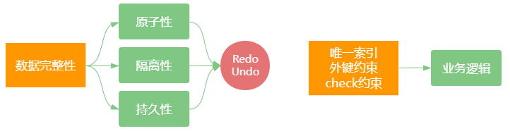

ACID 及它们之间的关系如下图所示，4 个特性中有 3 个 与 WAL 有关，都需要通过 Redo、Undo 日志来保证等。

WAL 的全称 Write-Ahead Logging，先写日志，再写磁盘。

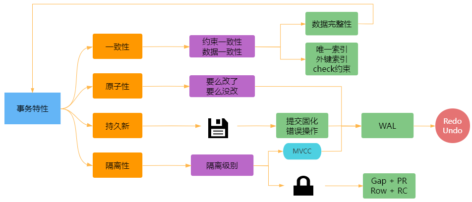


# 2 事务控制的演进

## 2.1 并发事务

事务并发处理可能会带来一些问题，比如：更新丢失、脏读、不可重复读、幻读等。

- 更新丢失

  当两个或多个事务更新同一行记录，会产生更新丢失现象。可以分为回滚覆盖和提交覆盖。

  - 回滚覆盖：一个事务回滚操作，把其他事务已提交的数据给覆盖了。
  - 提交覆盖：一个事务提交操作，把其他事务已提交的数据给覆盖了。

- 脏读

  一个事务读取到了另一个事务修改但未提交的数据。（update）

- 不可重复读

  一个事务中多次读取同一行记录不一致，后面读取的和前面读取的不一致。

- 幻读

  一个事务中多次按相同条件查询，结果不一致。后续查询的结果 和 前面查询的结果不同，多了或少了几行记录。（insert、delete）


## 2.2 排队

最简单的方法，就是完全顺序执行左右事务的数据库操作，不需要加锁，简单的说就是全局排队。序列化执行所有的事务单元，数据库某个时刻只处理一个事务操作，特点是强一致性，处理性能低。

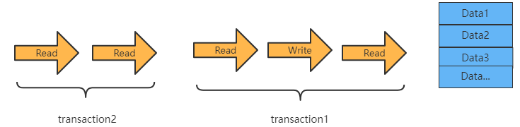


## 2.3 排他锁

引入锁之后就可以支持并发处理事务，如果事务之间涉及到相同的数据项时，会使用排他锁，或叫互斥锁，先进入的事务独占数据项以后，其他事务被阻塞，等待前面的事务释放锁。

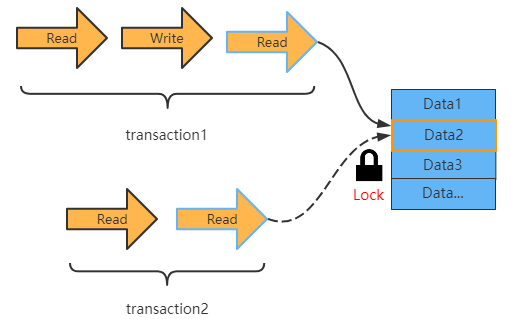

注意，在整个事务1 结束之前，锁是不会被释放的。所以，事务2 必须等到事务1 结束之后开始。

## 2.4 读写锁

读和写操作：读读、写写、读写、写读。

读写锁就是进一步细化锁的粒度，区分读操作和写操作，让读和读之间不加锁，这样下面的两个事务就可以同时被执行了。

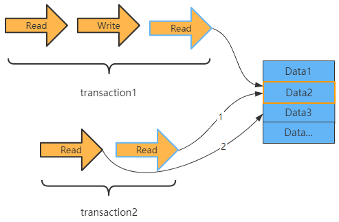

读写锁，可以让读和读并行，而读和写、写和读、写和写这几种之间还是要加排他锁。

## 2.5 MVCC

多版本控制 MVCC，也就是 Copy on Write 的思想。MVCC 除了支持读和读的并行，还支持 读和写、写和读 的并行，但为了保证一致性，写和写是无法并行的。

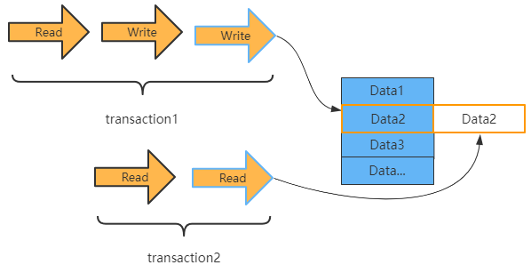

在事务1 开始写操作的时候会 copy 一个记录的副本，其他事务读操作会读取这个记录副本，因此不会影响其他事务对此记录的读取，实现写和读并行。

### 2.5.1 MVCC 概念

MVCC（Multi Version Concurrency Control）被称为多本版控制，是指在数据库中为了实现高并发的数据访问，对数据进行多本版处理，并通过事务的可见性来保证事务能看到自己应该看到的数据版本。多本版控制很巧妙地将稀缺资源的占用互斥转换为并发，大大提高了数据库的吞吐量及读写性能。

如何生成的多版本？每次事务修改操作之前，都会在 Undo 日志中记录修改之前的数据状态和事务号，该备份记录可以用于其他事务的读取，也可以进行必要时的数据回滚。

### 2.5.2 MVCC 实现原理

MVCC 最大的好处是读不加锁，读写不冲突。在读多写少的系统应用中，读写不冲突是非常重要的，极大的提升系统的并发性能，这也是为什么现阶段几乎所有的关系型数据库都支持 MVCC 的原因，不过**目前 MVCC 只在 Read Commited 和 Repeatable Read 两种隔离级别下工作**。

在 MVCC 并发控制中，读操作可以分为两类：**快照读**（Snapshot Read）与 **当前读**（Current Read）。

- 快照读：读取的是记录的快照版本（有可能是历史版本），不用加锁。（select，在select 之前这条记录正在另一个修改事务操作着）。
- 当前读：读取的是记录的最新版本，并且当前读返回的记录，都会加锁，保证其他事务不会再并发修改这条记录。（select... for update 或 lock in share mode，insert/delete/update）

为了让大家更直观的理解 MVCC 的实现原理，举一了记录更新的案例来讲解 MVCC 中多版本的实现。

假设 F1 - F6 是表中字段的名字，1 - 6 是其对应的数据。后面三个隐藏字段分别对应改行的隐藏 ID、事务号 和 回滚指针，如下图所示。

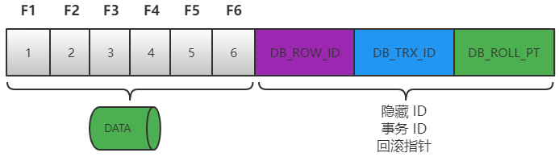

具体的更新过程如下：

假如一条数据是刚 INSERT 的，DB_ROW_ID 为 1，其他两个字段为空。当事务1 更改该行的数据值时，会进行如下操作，如下图所示。

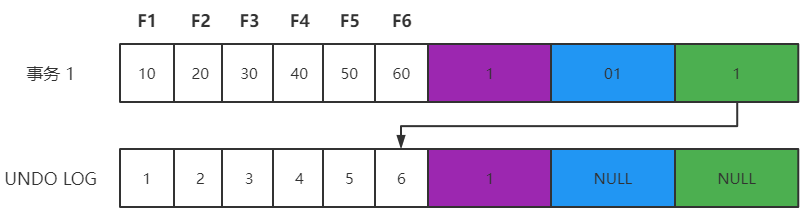

- 用排他锁锁定该行；记录 Redo Log；
- 把该行修改前的值复制到 Undo Log，即图中下面的行；
- 修改当前行的值，填写事务编号，使回滚指针指向 Undo Log 中修改前的行。

接下来 事务2 操作，过程与事务1 相同，此时 Undo Log 中会有两行记录，并且通过回滚指针连在一起，通过当前记录的回滚指针回溯到该行创建时的初始内容，如下图所示。

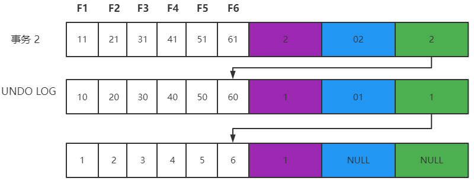

MVCC 已经实现了读读、读写、写读 并发处理，如果想进一步解决写写冲突，可以采用下面两种方案：

- 乐观锁
- 悲观锁


# 3 事务隔离级别

## 3.1 隔离级别类型

前面提到的 “更新丢失”、“脏读”、“不可重复读” 和 “幻读” 等并发事务问题，其实都是数据库一致性问题，为了解决这些问题，MySQL 数据库是通过事务隔离级别来解决的，数据库系统提供了以下四种事务隔离级别 供用户选择。

| 事务隔离级别 | 回滚覆盖 |   脏读   | 不可重复读 | 提交覆盖 |   幻读   |
| :----------: | :------: | :------: | :--------: | :------: | :------: |
|   读未提交   |    x     | 可能发生 |  可能发生  | 可能发生 | 可能发生 |
|   读已提交   |    x     |    x     |  可能发生  | 可能发生 | 可能发生 |
|   可重复读   |    x     |    x     |     x      |    x     | 可能发生 |
|    串行化    |    x     |    x     |     x      |    x     |    x     |

- 读未提交

  Read Uncommitted 读未提交：解决了回滚覆盖类型的更新丢失，但可能发生脏读现象，也就是可能读取到其他会话中为提交事务修改的数据。

- 读已提交

  Read Committed 读已提交：只能读取到其他会话中已经提交的数据，解决了脏读。但是可能发生不可重复读现象，也就是可能在一个事务中两次查询结果不一致。

- 可重复读

  Repeatable Read 可重复读：解决了不可重复读，它确保同一事务的多个实例在并发读取数据时，会看到同样的数据行。不过理论上会出现幻读，简单的说幻读指的是当前用户读取某一范围的数据行时，另一个事务又在该范围插入了新行，当用户再读取范围的数据时，会发现有新的幻影行。

- 串行化

  Serializable 串行化：所有的增删改查 串行化执行。它通过强制事务排序，解决相互冲突，从而解决幻读的问题。这个级别可能导致大量的超时现象和锁竞争，效率低下。


数据库的数据隔离级别越高，并发问题就越小，但是并发处理能力越差（代价）。读未提交 隔离级别最低，并发问题多，但是并发处理能力好。以后使用时，可以根据系统特点来选择一个合适的隔离级别。

事务隔离级别，针对 InnoDB 引擎，支持事务的功能。和 MyISAM 引擎没有关系。

**事务隔离级别和锁的关系**

1. 事务隔离级别是 SQL92 定制的标准，相当于事务并发控制的整体解决方案，本质上是对锁 和 MVCC 使用的封装，隐藏了底层细节。
2. 锁是数据实现并发控制的基础，事务隔离性采用锁来实现，对相应操作加不同的锁，就可以防止其他事务同时对数据进行读写操作。
3. 对用户来讲，首先选择使用隔离级别，当选择的隔离级别不能解决并发问题或需求时，才有必要在开发中手动设置锁。

MySQL 默认隔离级别：可重复读。Oracle、SQLServer 默认隔离级别：读已提交

一般使用时，建议采用默认隔离级别，然后存在的一些并发问题，可以通过悲观锁、乐观锁等实现处理。

## 3.2 MySQL 隔离级别控制

MySQL 默认的事务隔离级别是 Repeatable Read ，查看 MySQL 当前数据库的事务隔离级别命令如下：

`show variables like 'tx_isolation';`  或 `select @@tx_isolation;`

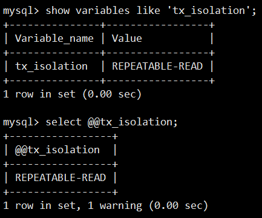

设置事务隔离级别可以如下命令：

```bash
set tx_isolation='READ-UNCOMMITTED';
set tx_isolation='READ-COMMITTED';
set tx_isolation='REPEATABLE-READ';
set tx_isolation='SERIALIZABLE';
```


# 4 锁机制和实战

## 4.1 锁分类

在 MySQL 中锁有很多不同的分类。

**从操作的粒度可分为表级锁、行级锁 和 页级锁**

- 表级锁：每次操作锁住整张表。锁定力度大，发生锁冲突的概率高，并发度最低。应用在 MyISAM、InnoDB、BDB 等存储引擎中。
- 行级锁：每次操作锁住一行数据。锁定粒度最小，发生锁冲突的概率最低，并发度最高。应用在 InnoDB 存储引擎中。
- 页级锁：每次锁定相邻的一组记录，锁定粒度介于表锁和行锁之间，开销 和 加锁 时间 介于表锁 和 行锁 之间，并发度一般。应用在 BDB 存储引擎中。

|        | 行锁     | 表锁     | 页锁     |
| ------ | -------- | -------- | -------- |
| MyISAM |          | &#10004; |          |
| BDB    |          | &#10004; | &#10004; |
| InnoDB | &#10004; | &#10004; |          |


**从操作的类型可分为读锁和写锁**

- 读锁（S锁）：共享锁，针对同一份数据，多个读操作可以同时进行而不会互相影响。
- 写锁（X锁）：排他锁，当前写操作没有完成前，它会阻断其他写锁和读锁。

IS锁、IX锁：意向读锁、意向写锁，属于表级锁，S 和 X 主要针对行级锁。在对表记录添加 S 或 X 锁之前，会先对表添加 IS 或 IX 锁。

S 锁：事务A 对记录添加了 S 锁，可以对记录进行读操作，不能做修改，其他事务可以对该记录追加S ，但是不能追加 X 锁，需要等记录的 S 锁 全部释放。

X 锁：事务A对记录添加了 X 锁，可以对记录进行读和修改操作，其他事务不能对记录做读和修改操作。


**从操作的性能可分为乐观锁和悲观锁**

- 乐观锁：一般的实现方式是对记录数据版本进行比对，在数据更新提交的时候才会进行冲突检测，如果发现冲突了，则提示错误信息。
- 悲观锁：在对一条数据修改的时候，为了避免同时被其他人修改，在修改数据之前先锁定，在修改 的控制方式。共享锁 和 排他锁 是悲观锁的不同实现，但都属于悲观锁范畴。


## 4.2 行锁原理

在 InnoDB 引擎中，我们可以使用行锁和表锁，其中行锁分为 共享锁 和 排他锁。**InnoDB 行锁是通过对索引数据页上的记录加锁实现的**，主要实现算法有 3 种：Record Lock、Gap Lock 和 Next-key Lock。

- Record Lock 锁：锁定单个行记录的锁。（记录锁，RC，RR 隔离级别都支持）
- GapLock 锁：间隙锁，锁定索引记录间隙，确保索引记录的间隙不变。（范围锁，RR 隔离级别支持）
- Next-key Lock 锁：记录锁和间隙锁组合，同时锁住数据，并且锁住数据前后范围。（记录锁+范围锁，RR 隔离级别支持）

在 RR 隔离级别，InnoDB 对于记录加锁行为都是先采用 Next-Key Lock，但是当 SQL 操作含有唯一索引时，InnoDB 会对 Next-Key Lock 进行优化，降级为 RecordLock，仅锁住索引本身而非范围。

1. select ... from 语句：InnoDB 引擎采用 MVCC 机制实现非阻塞，所以对于普通的 select 语句，InnoDB 不加锁。
2. select ... from lock in share mode 语句：追加了共享锁，InnoDB 会使用 Next-Key Lock 锁进行处理，如果扫描发现唯一索引，可以降级为 Record Lock 锁。
3. select ... from for update 语句：追加了排他锁，InnoDB 会使用 Next-Key Lock 锁进处理，如果扫描发现唯一索引，可以降级为 Record Lock 锁。
4. update ... where 语句：InnoDB 会使用 Next-Key Lock 锁进行处理，如果扫描发现唯一索引，可以降级为 Record Lock 锁。
5. delete ... where 语句：InnoDB 会使用 Next-Key Lock 锁进行处理，如果扫描发现唯一索引，可以降级为 Record Lock 锁。
6. insert 语句：InnoDB 会在将要插入的那一行设置一个排他的 RecordLock 锁。

下面以 “update t1 set name='XX' where id=10 ” 操作为例，举例分析下 InnoDB 对不同索引的加锁行为，以 RR 隔离级别为例。

### 4.2.1 主键加锁


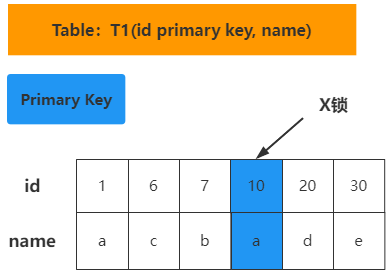

加锁行为：仅在 id=10 的主键索引记录上加 X 锁。

### 4.2.2 唯一键加锁

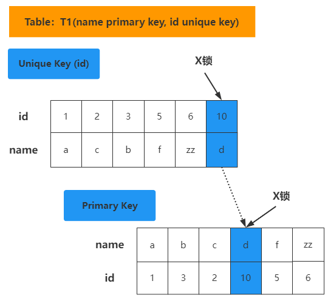

加锁行为：先在唯一索引 id 上 加 X 锁，然后在 id = 10 的主键索引记录上加 X 锁。

### 4.2.3 非唯一键加锁

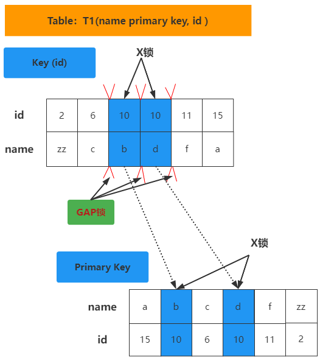

加锁行为：对满足 id=10 条件的记录加 Next-Key Lock （即 对记录加 X 锁，和 [6,c]-[10,b]，[10,b]-[10,d]，[10,d]-[11,f] 加 Gap Lock），然后通过扫描发现唯一索引 name，在唯一索引 name 上加 X 锁，去掉其他的锁。

### 4.2.4 无索引加锁

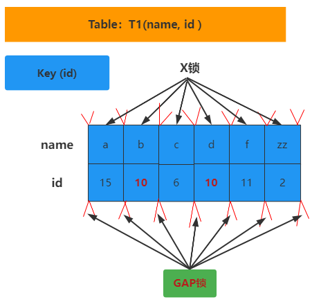

加锁行为：表里所有行和间隙都会加锁X锁（Next-Key Lock）。（当没有索引时，会导致全表锁定，因为 InnoDB 引擎锁机制是基于索引实现的记录锁定）。

## 4.3 悲观锁

悲观锁（Pessimistic Locking），是指在数据处理过程，将数据处于锁定状态，一般使用数据库的锁机制实现。从广义上讲，前面提到的行锁、表锁、读锁、写锁、共享锁、排他锁 等，这些都属于悲观锁 范畴。

### 4.3.1 表级锁

[lock tables and unlock tables statements](https://dev.mysql.com/doc/refman/5.7/en/lock-tables.html)

表级锁每次都锁住整张表，并发度最低。常用命令如下：

手动增加表锁

```sql
lock table 表名称 read|write,表名称2 read|write;
```

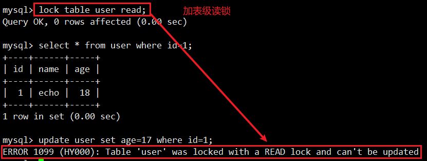

其他会话下的更新操作被阻塞

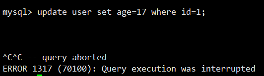

查看表上加过的锁：

```sql
show open tables;
```

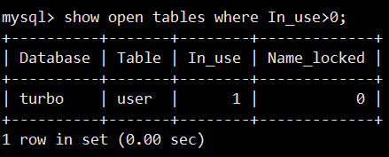

删除表锁：

```sql
unlock tables;
```


**表级读锁：当前追加 read 锁，当前连接和其他的连接都可以读操作；但是当前连接 增删改 操作会报错，其他连接 增删改 会被阻塞**。

**表级写锁：当前表追加 write 锁，当前连接可以对表做 增删改查 操作，其他连接对该表所有操作都被阻塞（包括查询）**。

总结：表级读锁 会阻塞写操作，但是不会阻塞读操作。而写锁则会把读和写操作都阻塞。

### 4.3.2 共享锁（行级锁-读锁）

共享锁 又称为 读锁，简称 S 锁。共享锁 就是多个事务对于同一数据可以共享一把锁，都能访问到数据，但是只能读 不能修改。使用共享锁的方法是在 **select ... lock in share mode**，只适用查询语句。

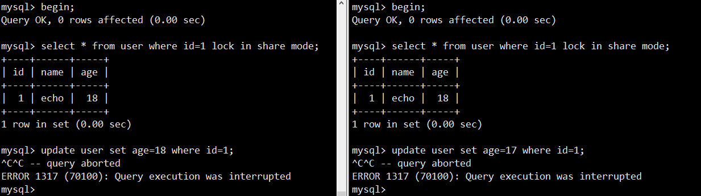

两个连接都使用 共享锁 后，再 update 操作。

总结：事务使用了 共享锁（读锁），只能读取，不能修改，修改操作被阻塞。

### 4.3.3 排他锁（行级锁-写锁）

排他锁又称为写锁，简称 X 锁。排他锁 就是不能与其他锁并存，如果一个事务获取了一个数据行的排他锁，其他事务就不能对该记录做其他操作，也不能获取到该行的锁。

使用排他锁的方法是在 SQL 末尾加上 **for update**，innodb 引用默认会在 update，delete 语句加上 for update。行级锁的实现其实是依靠其对应的索引，所以如果操作没有用到索引，那么会锁住全表记录。

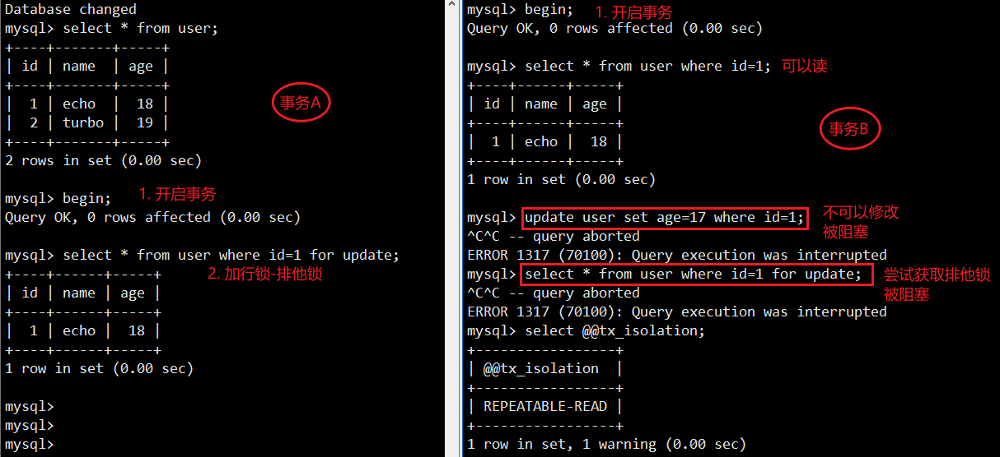

总结：事务使用了排他锁（写锁），当前事务可以读取和修改，其他事务不能修改，也不能获取记录锁（select ... for update）。如果查询没有使用到索引，将会锁住整个表记录。

## 4.4 乐观锁

## 4.5 死锁与解决方案


