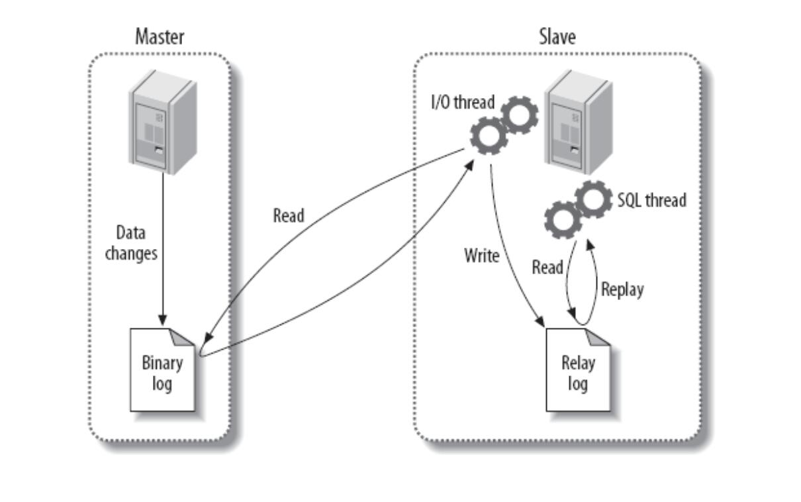

> 第四部分 MySQL集群架构

# 1 集群架构设计

## 1.1 架构设计理念

在集群架构设计时，主要遵从下面三个维度：

- 可用性
- 扩展性
- 一致性

## 1.2 可用性设计

- 站点高可用，冗余站点
- 服务高可用，冗余服务
- 数据高可用，冗余数据

**保证高可用的方法是冗余**。但是数据冗余带来的问题是数据一致性问题。

实现高可用的方案有以下几种架构模式：

- 主从模式

  简单灵活，能够满足多种需求。比较主流的用法，但是写操作高可用需要自行处理。

- 双主模式

  互为主从，有双主双写，双主单写 两种模式，建议使用双主单写。

## 1.3 扩展性设计

扩展性主要围绕着 ==读操作扩展== 和 ==写操作扩展== 展开。

- 如何扩展以提高读性能

  - 加从库

    简单易操作，方案成熟

    从库过多会引发主库性能损耗。建议不要作为长期的扩充方案，应该设法用良好的设计避免持续加从库来缓解读性能问题。

  - 分库分表

    可以分为 垂直拆分(改变表结构) 和 水平拆分(不改变表结构)，垂直拆分可以缓解部分压力，水平拆分 理论上可以无限扩展。

- 如何扩展以提高写性能

  - 分库分表

## 1.4 一致性设计

一致性主要考虑集群中各数据库 数据同步 以及 同步延迟 问题。可以采用的方案如下：

- 不使用从库

  扩展读性能问题需要单独考虑，否则容易出现系统瓶颈。

- 增加访问路由层

  可以先得到主从同步最长时间t，在数据发生修改后的 t 时间内，先访问主库。

# 2 主从模式

## 2.1 使用场景

MySQL 主从模式是指数据可以从一个 MySQL 数据服务器主节点复制到一个或多个从节点。MySQL 默认采用异步复制方式，这样从节点不用一直访问主服务器来更新自己的数据，从节点可以复制主数据库中的所有数据库，或者特定的数据库，或者特定的表。

mysql 主从复制用途：

- 实时灾备，用于故障切换（高可用）
- 读写分离，提供查询服务（读扩展）
- 数据备份，避免影响业务（高可用）

主从部署必要条件：

- 从库服务器能连通主库
- 主库开启 binlog 日志（设置 log-bin 参数）
- 主从 server-id 不同

## 2.2 实现原理

### 2.2.1 主从复制

[Primary Secondary Replication](https://dev.mysql.com/doc/refman/5.7/en/group-replication-primary-secondary-replication.html)

下图是主从复制的原理图：

主从复制整体分为以下三个步骤：

1. 主库将数据库的变更操作记录到 Binlog 日志文件中。
2. 从库读取主库中的 Binlog 日志文件信息写入到从库的 Relay Log 中继日志中。
3. 从库读取中继日志信息 在 从库中进行 Replay，更新从库数据信息。

在上述三个过程中，涉及了 Master 的 BinlogDump Thread 和 Slave 的 I/O Thread、SQL Thread ，它们的作用如下：

- Master 服务器对数据库更改操作记录在 Binlog 中，BinlogDump Thread 接到写入请求后，读取 Binlog 信息推送给 Slave 的 I/O Thread。
- Slave 的 I/O Thread 将读取到的 Binlog 信息写入到本地 Relay Log 中。
- Slave 的 SQL Thread 检测到 Relay Log 的变更请求，解析 Relay Log 中的内容在 从库上执行。

下图是异步复制的时序图：

mysql 主从复制存在的问题：

- 主库宕机后，数据可能丢失。
- 从库只有一个 SQL Thread，主库写压力大，复制很可能延时。

解决方案：

- 半同步复制——解决数据丢失的问题
- 并行复制——解决从库复制延迟的问题

### 2.2.2 半同步复制

为了提升数据安全，MySQL 让 Master 在某一个时间点等待 Slave 节点的 ACK （acknowledged）消息，接收到 ACK 消息后才进行事务提交，这也是半同步复制的基础，MySQL 从 5.5 版本开始引入半同步复制机制来降低数据丢失的概率。

介绍本同步复制之前先快速过一下 MySQL 事务写入碰到主从复制时的完整过程，主库事务写入分为4 个步骤：

- InnoDB Redo File Write（Prepare Write）
- Binlog File Flush & Sync to Binlog File
- InnoDB Redo File Commit（Commit Write）
- Send Binlog to Slave

当 Master 不需要关注 Slave 是否接收到 Binlog Event 时，即为传统的主从复制。

当 Master 需要在 第三步等待 Slave 返回 ACK 时，即为 after-commit，半同步复制（MySQL 5.5 引入）。

当 Master 需要在 第二步等待 Slave 返回 ACK 时，即为 after-sync，增强半同步（MySQL 5.7 引入）。

下图是 MySQL 官方对于半同步复制的时序图，主库等待从库写入 relay log 并返回 ack 后 才进行 Engine Commit。

## 2.3 并行复制

## 2.4 读写分离

# 3 双主模式

# 4 分库分表