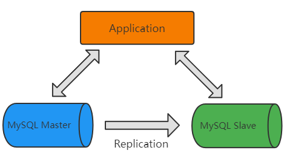
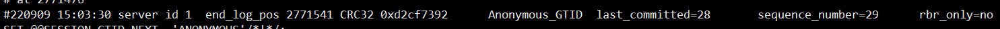
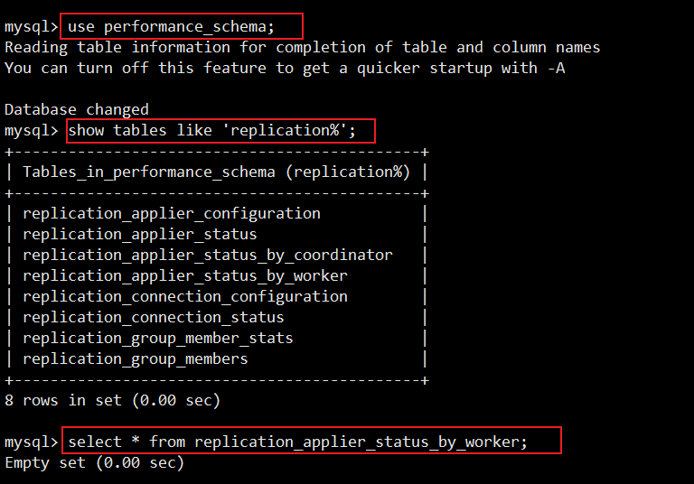

> 第四部分 MySQL集群架构

# 1 集群架构设计

## 1.1 架构设计理念

在集群架构设计时，主要遵从下面三个维度：

- 可用性
- 扩展性
- 一致性

## 1.2 可用性设计

- 站点高可用，冗余站点
- 服务高可用，冗余服务
- 数据高可用，冗余数据

**保证高可用的方法是冗余**。但是数据冗余带来的问题是数据一致性问题。

实现高可用的方案有以下几种架构模式：

- 主从模式

  简单灵活，能够满足多种需求。比较主流的用法，但是写操作高可用需要自行处理。

- 双主模式

  互为主从，有双主双写，双主单写 两种模式，建议使用双主单写。

## 1.3 扩展性设计

扩展性主要围绕着 ==读操作扩展== 和 ==写操作扩展== 展开。

- 如何扩展以提高读性能

  - 加从库

    简单易操作，方案成熟

    从库过多会引发主库性能损耗。建议不要作为长期的扩充方案，应该设法用良好的设计避免持续加从库来缓解读性能问题。

  - 分库分表

    可以分为 垂直拆分(改变表结构) 和 水平拆分(不改变表结构)，垂直拆分可以缓解部分压力，水平拆分 理论上可以无限扩展。

- 如何扩展以提高写性能

  - 分库分表


## 1.4 一致性设计

一致性主要考虑集群中各数据库 数据同步 以及 同步延迟 问题。可以采用的方案如下：

- 不使用从库

  扩展读性能问题需要单独考虑，否则容易出现系统瓶颈。

- 增加访问路由层

  可以先得到主从同步最长时间t，在数据发生修改后的 t 时间内，先访问主库。

# 2 主从模式

## 2.1 使用场景

MySQL 主从模式是指数据可以从一个 MySQL 数据服务器主节点复制到一个或多个从节点。MySQL 默认采用异步复制方式，这样从节点不用一直访问主服务器来更新自己的数据，从节点可以复制主数据库中的所有数据库，或者特定的数据库，或者特定的表。



mysql 主从复制用途：

- 实时灾备，用于故障切换（高可用）
- 读写分离，提供查询服务（读扩展）
- 数据备份，避免影响业务（高可用）

主从部署必要条件：

- 从库服务器能连通主库
- 主库开启 binlog 日志（设置 log-bin 参数）
- 主从 server-id 不同

## 2.2 实现原理

### 2.2.1 主从复制

[Primary Secondary Replication](https://dev.mysql.com/doc/refman/5.7/en/group-replication-primary-secondary-replication.html)

下图是主从复制的原理图：


主从复制整体分为以下三个步骤：

1. 主库将数据库的变更操作记录到 Binlog 日志文件中。
2. 从库读取主库中的 Binlog 日志文件信息写入到从库的 Relay Log 中继日志中。
3. 从库读取中继日志信息 在 从库中进行 Replay，更新从库数据信息。

在上述三个过程中，涉及了 Master 的 BinlogDump Thread 和 Slave 的 I/O Thread、SQL Thread ，它们的作用如下：

- Master 服务器对数据库更改操作记录在 Binlog 中，BinlogDump Thread 接到写入请求后，读取 Binlog 信息推送给 Slave 的 I/O Thread。
- Slave 的 I/O Thread 将读取到的 Binlog 信息写入到本地 Relay Log 中。
- Slave 的 SQL Thread 检测到 Relay Log 的变更请求，解析 Relay Log 中的内容在 从库上执行。

下图是异步复制的时序图：


mysql 主从复制存在的问题：

- 主库宕机后，数据可能丢失。
- 从库只有一个 SQL Thread，主库写压力大，复制很可能延时。

解决方案：

- 半同步复制——解决数据丢失的问题
- 并行复制——解决从库复制延迟的问题

### 2.2.2 半同步复制

为了提升数据安全，MySQL 让 Master 在某一个时间点等待 Slave 节点的 ACK （acknowledged）消息，接收到 ACK 消息后才进行事务提交，这也是半同步复制的基础，MySQL 从 5.5 版本开始引入半同步复制机制来降低数据丢失的概率。

介绍本同步复制之前先快速过一下 MySQL 事务写入碰到主从复制时的完整过程，主库事务写入分为4 个步骤：

- InnoDB Redo File Write（Prepare Write）
- Binlog File Flush & Sync to Binlog File
- InnoDB Redo File Commit（Commit Write）
- Send Binlog to Slave

当 Master 不需要关注 Slave 是否接收到 Binlog Event 时，即为传统的主从复制。

当 Master 需要在 第三步等待 Slave 返回 ACK 时，即为 after-commit，半同步复制（MySQL 5.5 引入）。

当 Master 需要在 第二步等待 Slave 返回 ACK 时，即为 after-sync，增强半同步（MySQL 5.7 引入）。

下图是 MySQL 官方对于半同步复制的时序图，主库等待从库写入 relay log 并返回 ack 后 才进行 Engine Commit。


## 2.3 并行复制

MySQL 的主从复制延迟一直失手开发者最为关注的问题之一，MySQL 从 5.6 版本开始追加了 并行复制 功能，目的就是为了改善复制延迟问题，并行复制称为 enhanced multi-threaded slave（简称 MTS）。

在 从库中有两个线程 IO Thread 和 SQL Thread，都是单线程模式工作，因此有了延迟问题，我们可以采用多线程机制来加强，减少从库复制延迟。（IO Thread 多线程意义不大，主要指的是 SQL Thread 多线程）。

在 MySQL 的 5.6、5.7、8.0 版本上，都是基于上述 SQL Thread 多线程思想，不断优化，减少复制延迟。

### 2.3.1 MySQL 5.6 并行复制原理

MySQL 5.6 版本也支持所谓的并行复制，但是其并行只是基于库的。如果用户的 MySQL 数据库中是有多个库，对于从库复制的速度 确实有比较大的帮助。


基于库的并行复制，实现相对简单，使用也相对简单些。基于库的并行复制遇到单库多表使用场景就发挥不出优势了，另外对事务并行处理的执行顺序也是个大问题。

### 2.3.2 MySQL 5.7 并行复制原理

**MySQL 5.7 是基于组提交的并行复制**，MySQL 5.7 才可称为真正的并行复制，这其中最为主要的原因就是 Slave 服务器的回放 与 Master 服务器是一致的，即 Master 服务器上是怎么并行执行的 Slave 上就怎样进行并行回放。不再有库的并行复制限制。

**MySQL 5.7 中组提交的并行复制究竟是如何实现的？**

MySQL 5.7 是通过对事务进行分组，当事务提交时，它们将在单个操作中写入到 二进制 日志中。如果多个事务能同时提交成功，那么它们意味着没有冲突，因此可以在 Slave 上并行执行，所以通过在主库上的二进制日志中添加组提交信息。

MySQL 5.7 的 并行复制 基于一个前提，即所有已经处于 prepare 阶段的事务，都是可以并行提交的。这些当然也可以在 从库 中并行提交，因为处理这个阶段的事务都是没有冲突的。在一个组里提交的事务，一定不会修改同一行。这是一种新的 并行复制 思路，完全摆脱了原来一直 致力于为了防止冲突而做的分发算法，等待策略 等复杂的而又效率低下的工作。

InnoDB 事务提交采用的是 两阶段提交 模式。一个阶段是 prepare，另一个是 commit。

为了兼容 MySQL 5.6 基于库的并行复制，5.7 引入了新的变量 [slave-parallel-type](https://dev.mysql.com/doc/refman/5.7/en/replication-options-replica.html#sysvar_slave_parallel_type)，其可以配置的值有 DATABASE（默认值，基于库的并行复制方式）、LOGICAL_CLOCK（基于组提交的并行复制方式）。

**那么如何直到事务是否在同一组中，生成的 Binlog 内容如何告诉 Slave 哪些事务是可以并行复制的？**

在 MySQL 5.7 版本中，其设计方式是将组提交的信息存放在 GTID 中，为了避免用户没有开启 GTID 功能（gtid_mode=OFF），MySQL 5.7 又引入了称之为 Anonymous_Gtid 的二级制日志 event 类型 ANONYMOUS_GTID_LOG_EVENT。

通过mysqlbinlog 工具分析 binlog 日志，就可以发现 组提交内部信息。




可以发现 MySQL 5.7 二进制日志 较之原来的二进制日志内容 多了 last_committed 和 sequence_number，last_committed 表示事务提交的时候，上次事务提交的编号，如果事务具有相同的 last_committed，表示这些事务都在一组内，可以进行并行的回放。

使用 [`slave_parallel_workers`](https://dev.mysql.com/doc/refman/5.7/en/replication-options-replica.html#sysvar_slave_parallel_workers) 设置并行复制事务的应用程序线程数。

### 2.3.3 MySQL 8.0 并行复制

MySQL 8.0 是基于 write-set 的并行复制。MySQL 会有一个集合变量来存储事务修改的记录信息（主键哈希值），所有已提交的事务所修改的主键值经过 hash 后都会与那个变量的集合进行对比，来判断 该行 是否与其冲突，并以此来确定依赖关系，没有冲突即可并行。这样的粒度，就到了 row 级别了，此时并行的粒度更加精细，并行的速度会更快。

### 2.3.4 并行复制 配置与调优

- [binlog_transaction_dependency_history_size](https://dev.mysql.com/doc/refman/5.7/en/replication-options-binary-log.html#sysvar_binlog_transaction_dependency_history_size)

  用于控制集合变量的大小

  

- [binlog_transaction_dependency_tracking](https://dev.mysql.com/doc/refman/5.7/en/replication-options-binary-log.html#sysvar_binlog_transaction_dependency_tracking)

  用于控制 binlog 文件中事务之间的依赖关系，即 last_committed 值。

  

  - COMMIT_ORDER：基于组提交机制。
  - WRITESET：基于写集合机制。
  - WRITESET_SESSION：基于写集合，比 writeset 多了一个约束，同一个 session 中的事务 last_committed 按先后顺序递增。

- [transaction_write_set_extraction](https://dev.mysql.com/doc/refman/5.7/en/replication-options-binary-log.html#sysvar_transaction_write_set_extraction)

  用于控制事务的检测算法，参数值为：OFF、XXHASH64、MURMUR32

- [master_info_repository](https://dev.mysql.com/doc/refman/5.7/en/replication-options-replica.html#sysvar_master_info_repository)

  开启 MTS 功能后，务必将参数 master_info_repository 设置为 TABLE，这样性能可以有 50% - 80% 的提升。这是因为并行复制开启后对于元 master.info 这个文件更新将会大幅提升，资源的竞争也会变大。

- [slave_parallel_workers](https://dev.mysql.com/doc/refman/5.7/en/replication-options-replica.html#sysvar_slave_parallel_workers)

  若将 slave_parallel_workers 设置为 0，则 MySQL 5.7 退化为单线程 复制，但将 slave_parallel_workers 设置为1，则 SQL 线程功能转化为 coordinator 线程，但是只有1个 worker 线程进行回放，也是单线程复制。然而，这两种性能却又有一些区别，因为多了一次 coordinator 线程的转发，因此 slave_parallel_workers = 1 的性能反而比 0  还要差。

- [slave_preserve_commit_order](https://dev.mysql.com/doc/refman/5.7/en/replication-options-replica.html#sysvar_slave_preserve_commit_order)

  MySQL 5.7 后的 MTS 可以实现更小粒度的并行复制，但需要将 slave_parallel_type 设置为 LOGICAL_CLOCK，但仅仅设置为 LOGICAL_CLOCK 也会存在问题，因为此时在 slave 上应用事务的顺序是无序的，和 relay log 中记录的事务顺序不一样，这样数据一致性是无法保证的，为了保证事务是按照 relay log 中记录的顺序来回放，就需要开启 slave_preserve_commit-order。

要开启 enhanced multi-threaded slave 其实很简单，只需要根据如下配置：

```xml
slave_parallel_type=LOGICAL_CLOCK
slave_parallel_workers=16
slave_pending_jobs_size_max=2147483648 #此变量设置可用于持有尚未应用的事件的工作队列的最大内存量
slave_preserve_commit_order=1
master_info_repository=TABLE
relay_log_info_repository=TABLE
relay_log_recovery=ON
```

### 2.3.5 并行复制监控

在使用了 MTS 后，复制的监控依旧可以通过 SHOW SLAVE STATUS \G; 但是 MySQL 5.7 在 performance_schema 库中提供了很多元素据表，可以更详细的监控并行复制过程。



通过replication_applier_status_by_worker可以看到worker进程的工作情况：


最后，如果 MySQL 5.7 要使用 MTS 功能，建议使用新版本，最少升级到 5.7.19 版本，修复了很多Bug。

## 2.4 读写分离

### 2.4.1 读写分离引入时机

大多数互联网业务中，往往读多写少，读会首先成为数据库的瓶颈。这时可以选择 “读写分离” 架构了。

读写分离首先需要将数据库分为主从 库，一个主库用于写数据，多个从库完成读数据的操作，主从之间通过复制机制进行数据的同步，如图所示。


在应用中可以在从库追加多个索引来优化查询，主库这些索引可以不加，用于提升写效率。

读写分离架构也能消除读写锁冲突 从而提升数据库的读写性能。使用读写分离架构需要注意：**主从同步延迟** 和 **读写分配机制** 问题。

### 2.4.2 主从同步延迟

使用读写分离架构时，数据库主从 同步具有延迟性，数据一致性会有影响，对于一些实时性要求比较高的操作，可以采用以下解决方案。

- 写后立刻读

  在写入数据库后，某个时间段内读操作就去 主库，之后读操作访问从库。

- 二次查询

  先去从库读取数据，找不到时就去主库进行数据读取。该操作容易将读压力还给主库，为了避免恶意攻击，建议对数据库访问API操作进行封装，有利于安全和低耦合。

- 根据业务特殊处理

  根据业务特点和中泰程度进行调整，比如重要的，实时性要求高的业务数据 读写 可以放在主库。对于次要的业务，实时性要求不高的可以进行读写 分离，查询时去从库查询。


### 2.4.3 读写分离落地

**读写路由分配机制** 是实现读写分离架构最关键的一个环节，就是控制何时是 主库写，何时去 从库读。目前较为常见的实现方案分为以下两种：

- 基于编程 和 配置实现（应用端）

  在代码中封装数据库的操作，代码中可以根据操作类型进行酷游分配，增删改 时操作主库，查询时操作从库。这类方法也是目前生产环境下应用最广泛的。优点是实现简单，因为程序在代码中实现，不需要增加额外的硬件开支，缺点是需要开发人员来实现，运维人员无从下手，如果其中一个数据库宕机了，就需要修改配置重启项目。

- 基于服务器代理实现（服务器端）

  

  中间件代理一般介于应用服务器和数据库服务器之间，从图中可以看到，应用服务器并不直接进入到 master 数据库 或者 slave 数据库，而是进入 MySQL proxy 代理服务器。代理服务器接收到应用服务器的请求后，先进行判断然后转发到后端 master 和 slave 数据库。


目前有很多性能不错的数据库中间件，常用的有 MySQL Proxy，MyCat 以及 ShardingSphere 等等。

- MySQL Proxy：是官方提供的 MySQL 中间件产品，可以实现负载均衡，读写分离等。
- MyCat：MyCat 是一款基于阿里开源产品 Cobar 研发的，基于 Java 语言编写的开源数据库中间件。
- [ShardingSphere](https://shardingsphere.apache.org/document/4.1.0/cn/overview/)：ShardingSphere 是一套开源的分布式数据库中间件解决方案，它由 Sharding-JDBC、Sharding-Proxy 和 Sharding-Slidecar（计划中）这 3 款相互独立的产品组成。已经在 2020年4月16日 从 Apache 孵化器毕业，成为 Apache 顶级项目。
- [Atlas](https://github.com/Qihoo360/Atlas/wiki/Atlas%E7%9A%84%E6%9E%B6%E6%9E%84)：Atlas 是由 Qihoo 360 公司 Web 平台部基础架构团队开发维护的一个数据库中间件。
- Amoeba：变形虫，该开源框架于 2008 年开始发布一款 Amoeba for MySQL 软件。

# 3 双主模式

## 3.1 适用场景

## 3.2 MMM架构

## 3.3 MHA 架构

## 3.4 主备切换

# 4 分库分表

## 4.1 差分方式

## 4.2 主键策略

## 4.3 分片策略

## 4.4 扩容方案