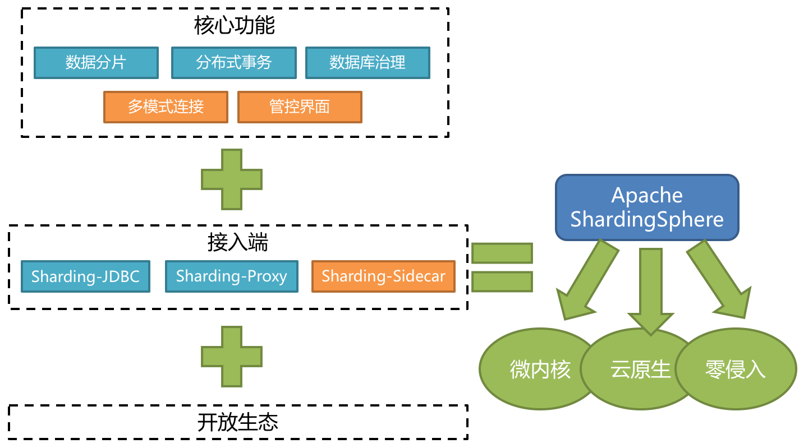

MySQL

# 第五部分 分库分表实战及中间件

## 1 实战背景

### 1.1 分库分表的场景

- 用户请求量太大

  单服务器TPS、内存、IO都是有上线的，需要将请求打散分布到多个服务器。

- 单库数据量太大

  单个数据库处理能力优先；单库所在服务器的磁盘空间有限；单库上的操作IO有瓶颈

- 单表数据量太大

  查询、插入、更新操作都会变慢，在增加字段，加索引、机器迁移都会产生高负载，影响服务

### 1.2 分库分表方案

#### 1.2.1 垂直拆分

- 垂直分库

  微服务架构，业务切割足够独立，数据也会按业务拆分，保证业务数据隔离，大大提升了数据库的吞吐能力

- 垂直分表

  表中字段太多且包含大字段的时候，在查询时对数据库的IO、内存会受到影响，同时更新数据时产生的binlog文件很大，MySQL在主从同步时也会有延迟的风险

#### 1.2.2 水平拆分

- 水平分表

  针对数据量巨大的单张表，按照规则把一张表的数据切分到多张表里面去。但是这些表还是在同一库中，所以库级别的数据库操作还是有IO瓶颈。

  

- 水平分库

  将单张表的数据切分到多个服务器上去，每个服务器具有相应的库与表，只是表中数据集合不同。水平分库能有效缓解单机和单库的性能瓶颈和压力，突破IO、连接数、硬件资源等瓶颈。

  

#### 1.2.3 水平分库规则

不夸库，不夸表，保证同一类的数据都在同一个服务器上面。

数据在切分之前，需要考虑如何高效的进行数据捕获，如果每次查询都要跨越多个节点，就需要谨慎使用。

#### 1.2.4 水平分表规则

- RANGE

  - 时间：按照年、月、日切分。
  - 地域：按照省市切分
  - 大小：从0-1000000一个表。每100万放一个表

- HASH

  - 用户ID取模

- 站内信

  - 用户维度：用户只看见自己的消息，使用ID HASH分库，用户在查看历史记录翻页查询时，所有查询都在同一库中。

- 用户表

  - 范围法：

  - 按照用户ID HASH尽量保证用户数据均衡分到数据库中

    > 在登录场景下，用户输入手机号和验证码进行登录，这种情况下，登录是不是需要扫描所有分库的信息？
    >
    > 方案：用户信息采用ID HASH做切分处理，同时存储用户ID和手机号的映射关系表（新增一张关系表），关系表采用手机号进行切分。可以通过关系表根据手机号查询到对应的ID，在定位到用户信息。

- 流水表

  - 时间维度：可以根据每天新增的流水来判断，选择按照年份分库，还是按照月份分库，甚至可以按照日期分库

- 订单表

- 主键选择

  - UUID：本地生成，不依赖数据库，缺点是作为主键性能太差
  - SNOWFLAKE：百度UidGenerator、美团Leaf、基于SNOWFLAKE算法实现

- 数据一致性

  - 强一致性：XA协议
  - 最终一致性：TCC、sage、Seata

- 数据库扩容

  - 成倍增加数据节点实现平滑扩容
  - 成倍扩容以后，表中的部分数据请求已被路由到其他节点上面，可以清理掉

- 业务层改造

  - 基于代理层方式：MyCat、Sharding-Proxy、MySQL Proxy
  - 基于应用层方式：Sharding-jdbc

- 分库后面临的问题

  - 事务问题：一次投递需要插入两条记录，且分布在不同服务器上，数据需要保障一致性。
  - 夸库跨表的join问题
    - 全局表（字典表）：基础数据/配置数据，所有库都有一份
    - 字典冗余：可以使用字段冗余就不用join查询了
    - 系统层组装：可以在业务层分别查询出来，然后组装起来，逻辑比较复杂
  - 额外的数据管理负担和数据库运算压力：数据库扩容、维护成本变高。

## 第1节 ShardingSphere实战

ShardingSphere 4.x版本为准

### 1.1 ShardingSphere

Apache ShardingSphere是一款开源的分布式数据库中间件组成生态圈。由Sharding-JDBC、Sharding-Proxy和Sharding-Sidecar（规划中）这3款相互独立的产品组成。他们均提供标准化的数据分片、分布式事务和数据库治理功能，可适用于Java同构、异构语言、容器、云原生等各种多样化的应用场景。


ShardingSphere定位为关系型数据库中间件，旨在充分合理的在分布式场景下利用关系性数据库的计算和存储能力，并非实现一个全新的关系型数据库。



- Sharding-JDBC：轻量级Java框架，在Java的JDBC层提供的额外服务，以jar包的形式使用。
- Sharding-Proxy：被定位为透明化的数据库代理端，提供封装了数据库二进制协议的服务端版本，用于完成对异构语言的支持。
- Sharding-Sidecar：被定位为Kubernetes或Mesos的云原生数据库代理，以DaemonSet的形式代理所有对数据库的访问。


Sharding-JDBC、Sharding-Proxy和Sharding-Sidecar三者区别：


https://shardingsphere.apache.org/document/current/cn/downloads/

https://github.com/apache/shardingsphere.git

### 1.2 Sharding-JDBC

Sharding-JDBC定位为轻量级Java框架，在Java的JDBC层提供的额外服务。它使用客户端直连数据库，以jar包的形式提供服务，无需额外部署和依赖，可理解为增强版的JDBC驱动，完全兼容JDBC和各种ORM框架。

- 适用于任何Java的ORM框架，如：JPA、Hibernate、Mybatis、Spring JDBC Template或直接使用JDBC。
- 基于任何第三方的数据库连接池，如：DBCP、C3P0、BoneCP、Druid、HikariCP等。
- 支持任意实现JDBC规范的数据库，目前支持MySQL，Oracle，SQLServer，PostgreSQL以及任何遵循SQL92标准的数据库。


**Sharding-JDBC主要功能：**

- 数据分片
  - 分库&分表
  - 读写分离
  - 分片策略
  - 分布式主键
- 分布式事务
  - 标准化事务接口
  - XA强一致性事务
  - 柔性事务
- 数据库治理
  - 配置动态化
  - 编排和治理
  - 数据脱敏
  - 可视化链路

**Sharding-JDBC内部结构：**


- 黄色部分表示Sharding-JDBC的入口API，采用工厂方法的形式提供。目前有ShardingDataSourceFactory和MasterSlaveDataSourceFactory两个工厂类。ShardingDataSourceFactory用于创建分库分表或分库分表+读写分离的JDBC驱动，MasterSlaveDataSourceFactory用于创建独立使用读写分离的JDBC驱动。
- 蓝色部分表示Sharding-JDBC的配置对象，提供灵活多变的配置方式。ShardingRuleConfiguration是分库分表配置的核心和入口，它可以包含多个TableRuleConfiguration和MasterSlaveRuleConfiguration。
  - 每一组相同规则分片的表配置一个TableRuleConfiguration。如果需要分库分表和读写分离共同使用，每一个读写分离的逻辑配置一个MasterSlaveRuleConfiguration。每个TableRuleConfiguration对应一个ShardingStrategyConfiguration，它有5种实现类可选择。
  - 仅读写分离使用MasterSlaveRuleConfiguration。
- 红色部分表示内部对象，由Sharding-JDBC内部使用，应用开发者无需关注。Sharding-JDBC通过ShardingRuleConfiguration和MasterSlaveRuleConfiguration生成真正供ShardingDataSource和MasterSalveDataSource使用的规则对象。ShardingDataSource和MasterSlaveDataSource实现了DataSource接口，是JDBC的完整实现类。

**Sharding-JDBC初始化流程：**

- 根据配置信息生成Configuration对象
- 通过Factory会将Configuration对象转化为Rule对象
- 通过Factory会将Rule对象与DataSource对象封装
- Sharding-JDBC使用DataSource进行分库分表和读写分离操作

**Sharding-JDBC使用过程：**

官网4版本的参考：https://shardingsphere.apache.org/document/legacy/4.x/document/cn/manual/sharding-jdbc/usage/

实战项目种使用的是Spring Boot ，JPA方式。

https://gitee.com/turboYuu/mysql-storage-optimization/tree/master/lab/mysql-example/sharding-jdbc-example

### 1.3 数据分片剖析和实战

#### 1.3.1 数据分片核心概念

- 表概念

  - 真实表

    数据库中真实存在的物理表。例如：b_order0、b_order1

  - 逻辑表

    在进行分片之后，同一类表结构的名称（总称）。例如b_order。

  - 数据节点

    在分片之后，有数据源和数据表组成。例如ds0.b_order1。（哪个数据源的哪个表）

  - 绑定表

    指的是分片规则一致的关系表（主表，子表），例如b_order和b_order_item，均按照order_id分片，则此两个表互为绑定表关系。绑定表之间的多表查询不会出现笛卡尔积关联，可以提升关联查询效率。

    ```
    b_order:b_order0,b_order1
    b_order_item:b_order_item0,b_order_item1
    
    select * from b_order o join b_order_item i on o.id=i.order_id where o.id in (10,11);
    ```
  
    如果不配置绑定关系，采用笛卡尔积关联，生成4个SQL
  
    ```
    select * from b_order0 o join b_order_item0 i on o.id=i.order_id where o.id in (10,11);
    
    select * from b_order0 o join b_order_item1 i on o.id=i.order_id where o.id in (10,11);
    
    select * from b_order1 o join b_order_item0 i on o.id=i.order_id where o.id in (10,11);
    
    select * from b_order1 o join b_order_item1 i on o.id=i.order_id where o.id in (10,11);
    ```
  
    配置绑定表关系，生成2个
  
    ```
    select * from b_order0 o join b_order_item0 i on o.id=i.order_id where o.id in (10,11);
    
    select * from b_order1 o join b_order_item1 i on o.id=i.order_id where o.id in (10,11);
    ```
  
  - 广播表
  
    在使用过程中，有些表没不要分片，例如字典表等。广播表会在不同的数据节点上进行存储，存储的表结构和数据完全相同。
  
- 分片算法

  由于分片算法和业务实现紧密相关，因此并未提供内置分片算法，而是通过分片策略将各种场景提炼出来，**提供更高层的抽象，并提供接口让应用开发者自行实现分片算法。**目前提供4种分片算法。

  - 精确分片算法 PreciseShardingAlgorithm

    用于处理使用单一键作为分片键的 `=` 与`IN` 进行分片的场景。

  - 范围分片算法RangeShardingAlgorithm

    用于处理单一键作为分片键的BETWEEN AND、>、<、>=、<=进行分片场景。

  - 复合分片算法ComplexKeysShardingAlgorithm

    用于处理使用多建作为分片及逆行分片的场景，多个分片的逻辑较复杂，需要开发者自行处理其中的复杂度。

  - Hint分片算法HintShardingAlgorithm

    用于处理使用Hint行分片的场景。对于分片字段非SQL决定，而由其他外置条件决定的场景，可使用SQL Hint灵活的注入分片字段。例如：内部系统、按照员工登录主键分库，而数据库种并无此字段。SQL Hint支持通过Java API和SQL注释两种方式使用。

- 分片策略（ShardingStrategy）

  分片策略包含分片键和分片算法，真正可用于分片操作的是分片键+分片算法，也就是分片策略。目前提供5种分片策略。
  
  - 标准分片策略 StandardShardingStrategy
  
    只支持单键分片，提供对SQL语句种的=，>，<，>=，<=，IN，BETWEEN AND的分片操作支持。提供PreciseShardingAlgorithm和RangeShardingAlgorithm两个分片算法。
  
    PreciseShardingAlgorithm是必选的，RangeShardingAlgorithm是可选的。但是SQL中使用了范围操作，如果不配置RangeShardingAlgorithm会采用全库路由扫描，效率低。
  
  - 复合分片策略ComplexShardingStrategy
  
    支持多分片键。提供对SQL语句中的=，>，<，>=，<=，IN，BETWEEN AND的分片操作支持。由于多分片键之间额关系复杂，因此并未进行过多的封装，而是直接将分片键值组合以及分片操作符透传至分片算法，完全由应用开发者实现，提供最大灵活度。
  
  - 行表达式分片策略InlineShardingStrategy
  
    只支持单分片键。使用Groovy的表达式，提供对SQL语句中的=和IN的分片操作支持，对于简单的分片算法，可以通过简单的配置使用，避免繁琐的Java代码。如：t_user${u_id%8}表示t_user表根据u_id模8，而分成8张表，表名称为t_user0到t_user7。
  
  - Hint分片策略HintShardingStrategy
  
    通过Hint指定分片值而非从SQL中提取分片值的方式进行分片的策略。
  
  - 不分片策略NoneShardingStrategy
  
    不分片策略。
  
- 分片策略配置

  对于分片策略存有数据源分片策略和表分片策略两种维度，两种策略的API完全相同。

  - 数据源分片

    用于配置数据被分配的目标数据源。

  - 表分片策略

    用于配置数据被分配的目标表，由于表存在于数据源内，所以表分片策略是依赖于数据源分片策略结果的。

#### 1.3.2 流程剖析

ShardingSphere的3个产品的数据分片主要流程是完全一致的。核心由

**SQL解析 => 执行器优化 => SQL路由 => SQL改写 => SQL执行 => 结果归并** 的流程组成。

https://shardingsphere.apache.org/document/legacy/4.x/document/cn/features/sharding/principle/


- SQL解析

  SQL解析分为词法解析和语法解析。先通过词法解析器将SQL拆分为i一个个不可再分的单词。再使用语法解析器对SQL进行理解，并最终提炼出解析上下文。

  Sharding-JDBC采用不同的解析器对SQL进行解析，解析器类型如下：

  - MySQL解析器
  - Oracle解析器
  - SQLServer解析器
  - PostgreSQL解析器
  - 默认SQL解析器

- 查询优化

  负责合并和优化分片条件，如OR等。

- SQL路由

  根据解析上下文匹配用户配置的分片策略，生成路由路径，目前支持分片路由和广播路由。

- SQL改写

  将SQL改写为在真实数据库中可以正确执行的语句。SQL改写分为正确性改写和优化改写。

- SQL执行

  通过多线程执行器异步执行。

- 结果归并

  将多个执行结果集归并以便于通过统一的JDBC接口输出。结果归并包括流式归并、内存归并和使用装饰者模式的追加归并这几种方式。

#### 1.3.3 SQL使用规范

官网参考：https://shardingsphere.apache.org/document/legacy/4.x/document/cn/features/sharding/use-norms/sql/

- SQL使用规范

  - 支持项

    - 路由至单数据节点，100%全兼容（目前仅MySQL，其他数据库完善中）。

    - 路由至多数据节点

      全面支持DML、DDL、DCL、TCL和部分DAL。支持分页、去重、排序、分组、聚合、关联查询（不支持跨库关联）。

      select主语句

      ```sql
      SELECT select_expr [, select_expr ...] FROM table_reference [, table_reference ...]
      [WHERE predicates]
      [GROUP BY {col_name | position} [ASC | DESC], ...]
      [ORDER BY {col_name | position} [ASC | DESC], ...]
      [LIMIT {[offset,] row_count | row_count OFFSET offset}]
      ```

      select_expr

      ```
      * | 
      [DISTINCT] COLUMN_NAME [AS] [alias] | 
      (MAX | MIN | SUM | AVG)(COLUMN_NAME | alias) [AS] [alias] | 
      COUNT(* | COLUMN_NAME | alias) [AS] [alias]
      ```

      table_reference

      ```
      tbl_name [AS] alias] [index_hint_list]
      | table_reference ([INNER] | {LEFT|RIGHT} [OUTER]) JOIN table_factor [JOIN ON conditional_expr | USING (column_list)]
      ```

  - 不支持项（路由至对数据节点）

    不支持 CASE WHEN、HAVING、UNION (ALL)

  - 支持分页子查询，但其他子查询有限支持，无论嵌套多少层，ShardingSphere都可以解析至第一个包含数据表的子查询，一旦在下层嵌套中再次找到包含数据表的子查询将直接抛出解析异常。

    例如：以下子查询可以支持

    ```
    SELECT COUNT(*) FROM (SELECT * FROM t_order o)
    ```

    以下子查询不支持：

    ```
    SELECT COUNT(*) FROM (SELECT * FROM t_order o WHERE o.id IN (SELECT id FROM t_order WHERE status = ?))
    ```

    简单来说，通过子查询进行非功能需求，在大部分情况下是可以支持的。比如分页、统计总数等；而通过子查询实现业务查询当前并不支持。

  - 由于归并的限制，子查询中包含聚合函数目前无法支持。

  - 不支持包含schema的SQL。因为ShardingSphere的理念是像使用一个数据源一样使用多数据源，因此对SQL的访问都是在同一个逻辑schema之上。

  - 当分片键处于运算表达式或函数中的SQL时，会导致全路由。

    假设`create_time`为分片键，则无法精确路由，形如SQL：

    ```
    SELECT * FROM t_order WHERE to_date(create_time, 'yyyy-mm-dd') = '2019-01-01';
    ```

    由于ShardingSphere只能通过SQL字面提取分片的值，因此分片处于运算表达式或函数中时，ShardingSphere无法提前获取分片键位于数据库中的值，从而无法计算出真正的分片值。

- 分页查询

  完全支持MySQL、PostgreSQL和Oracle的分页查询，SQLServer由于分页查询较为复杂，仅部分支持。

  - 性能瓶颈

    查询偏移量过大的分页或导致数据库获取数据性能低下，以MySQL为例：

    ```
    SELECT * FROM t_order ORDER BY id LIMIT 1000000, 10
    ```

    这句SQL会使得MySQL在无法利用索引的情况下跳过1000,000条记录，在获取10记录，其性能可想而知。而在分录分表的情况下，假设分为2个库，为了保证数据的正确性，SQL会改为：

    ```
    SELECT * FROM t_order ORDER BY id LIMIT 0, 1000010
    ```

    即将偏移量前的记录全部取出，并仅获取排序的最后10条记录。这会在数据库本身执行很慢的情况下，进一步加剧性能瓶颈。因为原SQL仅需要传输10条记录至客户端，而改写之后的SQL则会传输`1000,000*2`的记录至客户端。

  - ShardingSphere的优化

    ShardingSphere进行了2个方面的优化

    - 首选，采用流式处理+归并排序的方式来避免内存的过量占用。
    - 其次，ShardingSphere进队落至单节点的查询进行进一步优化。

  - 分页查询优化：

    由于Limit并不能通过索引查询数据，因此如果可以保证ID的连续性，通过ID进行分页查询是比较好的解决方案：

    ```
    SELECT * FROM t_order WHERE id > 100000 AND id <= 100010 ORDER BY id
    ```

    或通过记录上次查询结果的最后一条记录的ID进行下一页的查询：

    ```
    SELECT * FROM t_order WHERE id > 100000 LIMIT 10
    ```

#### 1.3.4 其他功能

官网参考：https://shardingsphere.apache.org/document/legacy/4.x/document/cn/features/sharding/other-features/

- Inline表达式

  InlineShardingStrategy：采用Inline行表达式进行分片的配置。

  Inline是可以简化数据节点和分片算法配置信息。主要是解决配置简化，配置一体化。

  **语法格式**

  行表达式的使用非常直观，只需要在配置中使用`${ expression }`或`$->{ expression }`标识行表达式即可。 目前支持数据节点和分片算法这两个部分的配置。行表达式的内容使用的是Groovy的语法，Groovy能够支持的所有操作，行表达式均能够支持。例如：

  ```
  ${begin..end}		表示范围区间
  
  ${[unit1, unit2, unit_x]}	表示枚举值
  ```

  行表达式中如果出现连续多个`${ expression }`或`$->{ expression }`表达式，整个表达式最终的结果将会根据每个子表达式的结果进行笛卡尔组合。

  ```
  ${['online', 'offline']}_table${1..3} 
  $->{['online', 'offline']}_table$->{1..3}
  ```

  最终会解析为：

  ```
  online_table1, online_table2, online_table3, 
  offline_table1, offline_table2, offline_table3
  ```

  **配置数据节点**

  对于均匀分布的数据节点，如果数据结构如下：

  ```
  db0
    ├── t_order0 
    └── t_order1 
  db1
    ├── t_order0 
    └── t_order1
  ```

  用行表达式可以简化为：

  ```
  db${0..1}.t_order${0..1}
  或者
  db$->{0..1}.t_order$->{0..1}
  ```

  对于自定义的数据节点，如果数据结构如下：

  ```
  db0
    ├── t_order0 
    └── t_order1 
  db1
    ├── t_order2
    ├── t_order3
    └── t_order4
  ```

  用行表达式可以简化为：

  ```
  db0.t_order${0..1},db1.t_order${2..4}
  ```

  **分片算法配置**

  行表达式内部的表达式本质上是一段Groovy，可以根据分片键进行计算的方式，返回相应的真实数据源或真实表名称。

  ```
  ds${id % 10}
  或
  ds$->{id % 10}
  ```

  结果为：ds0....ds9

- 分布式主键

  ShardingSphere不仅提供了内置的分布式主键生成器，例如UUID、SNOWFlAKE，还抽离出分布式主键生成器的接口，方便用户自行实现自定义的自增主键生成器。

  **内置主键生成器**

  - UUID

    采用UUID.randomUUID()的方式产生分布式主键。

  - SNOWFLAKE

    在分片规则配置模块可配置每个表的主键生成策略，默认使用雪花算法，生成64bit的长整型数据。

  **自定义主键生成器**

  - 自定义主键类，实现ShardingKeyGenerator接口

  - 按SPI规范配置自定义主键类

    在apache ShardingSphere中，很多功能实现类的加载方式是通过SPI注入的方式完成的。注意：在resources目录下新建META-INF文件夹，再新建services文件夹，然后新建文件，名字为org.apache.shardingsphere.spi.keygen.ShardingKeyGenerator，打开文件，复制自定义主键类全路径到文件中保存。

  - 自定义主键应用配置

    ```
    #对应主键字段名
    spring.shardingsphere.sharding.tables.position.key-generator.column=id
    #对应主键类getType返回内容
    spring.shardingsphere.sharding.tables.position.key-generator.type=TURBOKEY
    ```


### 1.4 读写分离剖析实战

官网参考：https://shardingsphere.apache.org/document/legacy/4.x/document/cn/features/read-write-split/

读写分离是通过主从的配置方式，将查询请求均匀的分散到多个数据副本，进一步提升系统的处理能力。


**主从架构和分库分表：**

主从架构：读写分离，目的是高可用，读写扩展。主从内容相同，根据SQL语义进行路由。

分库分表架构：数据分片，目的是扩展读写，存储扩容。库和表内容不同，根据分片配置进行路由。


将水平分片和读写分离联合使用，能够更加有效的提升系统性能，下图将分库分表和读写分离同时使用。


读写分离虽然可以提升系统的吞吐量和可用性，但是同时带来了数据不一致的问题，包括多个主库之间的数据一致性，以及主库与从库之间的数据一致性的问题。并且，读写分离也带来了于数据分片同样的问题，使得开发和运维更加复杂。

**读写分离应用方案**

数据量不是很多的情况下，可以将数据库进行读写分离，应对高并发的需求，通过水平扩展从库，来缓解查询压力。


**分表+读写分离**

在数据量达到500万的时候，这时数据量预估千万级别，可以将数据进行分表存储。


**分库分表+读写分离**

在数据量继续扩大，这是可以考虑分库分表，将数据存储在不同的数据库的不同表。


**透明化读写分离带来的影响，让使用方尽量像使用一个数据库一样使用主从数据库集群，是ShardingSphere读写分离模块的主要设计目标**

主库、从库、主从同步、负载均衡

- 核心功能
  - 提供一主多从的读写分离配置。仅支持单主库，可以支持独立使用，也可以配置分库分表使用。
  - 独立使用读写分离，支持SQL透传。不需要SQL改写流程。
  - 同一线程且同一数据库连接内，能保证数据一致性。如果由写入操作，后续的读操作均从主库读取。
  - 基于Hint的强制主库路由，可以强制路由走主库查询实时数据，避免主从同步数据延迟。
- 不支持项
  - 主库和从库的数据同步
  - 主库和从库的数据同步延迟
  - 主库双写或多写
  - 跨主库和从库之间的事务的数据不一致，建议在主从架构中，事务中的读写均用主库操作。

### 1.5 Hint强制路由剖析实战

https://shardingsphere.apache.org/document/legacy/4.x/document/cn/features/sharding/other-features/sharding-hint/

一种通过在外部业务代码中指定路由配置的一种方式，在ShardingSphere中叫做Hint。如果使用Hint指定了强制分片路由，那么SQL将会无视原有的分片逻辑，之间路由至指定的数据节点。

HintManager主要使用ThreadLocal管理分片键信息，进行hint强制路由。在代码中向HintManager添加的配置信息只能在当前线程内有效。

**Hint使用场景**

- 数据分片操作，如果分片键没有在SQL或数据表中，而是在业务逻辑代码中
- 读写分离操作，如果强制在主库进行某些数据操作

**Hint使用过程**

- 编写分库分表路由策略，实现HintShardingAlgorithm接口

  ```java
  public class MyHintShardingAlgorithm implements HintShardingAlgorithm<Integer> {
     @Override
     public Collection<String> doSharding(Collection<String> collection, 		
            HintShardingValue<Integer> hintShardingValue) {
        //添加分库或分表路由逻辑  
     }
  }
  ```

- 在配置文件中指定分库或分表策略

  ```properties
  #强制路由库和表
  spring.shardingsphere.sharding.tables.b_order.database-strategy.hint.algorithm-class-name=com.lagou.hint.MyHintShardingAlgorithm 
  spring.shardingsphere.sharding.tables.b_order.table-strategy.hint.algorithm-class-name=com.lagou.hint.MyHintShardingAlgorithm
  spring.shardingsphere.sharding.tables.b_order.actual-data-nodes=ds$->{0..1}.b_order$->{0..1}
  ```

- 在代码执行查询前使用HintManager指定执行策略

  ```java
  @Test//路由库和表    
  public void test(){
         HintManager hintManager = HintManager.getInstance();
         hintManager.addDatabaseShardingValue("b_order",1);
         hintManager.addTableShardingValue("b_order",1);
         List<Order> list = orderRepository.findAll();        
         hintManager.close();
         list.forEach(o -> {
             System.out.println(o.getOrderId()+" "+o.getUserId()+" "+o.getOrderPrice());
         });  
  }
  ```

  在读写分离结构中，为了避免主从同步数据延迟，即使获取刚添加或更新的数据，可以采用强制路由走主库查询实时数据，使用hintManager.setMasterRouteOnly()设置主库路由即可。

  `org.apache.shardingsphere.api.hint.HintManager`

### 1.6数据脱敏剖析实战

数据脱敏是指某些敏感信息通过脱敏规则进行数据的变形，实现敏感隐私数据的可靠保护。

数据脱敏模块属于ShardingSphere分布式治理这一核心功能下的子功模块。

- 在更新操作时，它通过对用户输入的SQL进行解析，并依据用户提供的脱敏配置对SQL进行改写，从而实现对原文数据进行加密，并将密文数据存储到底层数据库。
- 在查询数据库时，它又从数据库中取出密文数据，并对其解密，最终将解密后的原始数据返回给用户。

**Apache ShardingSphere自动化&透明化了数据脱敏过程，让用户无需关注数据脱敏的实现细节，像使用普通数据那样使用脱敏数据。**

#### 1.6.1 整体架构

ShardingSphere提供的Encrypt-JDBC和业务代码部署在一起。业务方需要面向Encrypt-JDBC进行JDBC编程。


Encrypt-JDBC将用户发起的SQL进行拦截，并通过SQL语法解析器进行解析、理解SQL行为，再依据用户传入的脱敏规则，找出需要脱敏的字段和所使用的加密器对目标字段进行加密处理后，再与底层数据库进行交互。

#### 1.6.2 脱敏规则

脱敏配置主要分为四部分：数据源配置，加密器配置，脱敏表配置以及查询属性配置：


- 数据源配置：指DataSource的配置信息
- 加密器配置：指使用什么加密策略进行加解密。目前ShardingSphere内置了两种加密解密策略：AES/MD5
- 脱敏表配置：指定哪个列用于存储密文数据（cipherColumn）、哪个列用于存储明文数据（plainColumn）以及用户想使用哪个列进行SQL编写（logicColumn）
- 查询属性的配置：当底层数据库里同时存储了明文数据、密文数据后，该属性开关用于决定是直接查询数据库里的明文数据进行返回，还是查询密文数据通过Encrypt-JDBC解密后返回。

#### 1.6.3 脱敏处理流程

ShardingSphere将逻辑列与明文列和密文列进行了列名映射。


使用Encrypt-JDBC进行增删改查时，其中处理流程和转换逻辑：


#### 1.6.4 加密策略解析

ShardingSphere提供了两种加密策略用于数据脱敏，该两种策略分别对应ShardingSphere的两种加解密的接口，即Encryptor和QueryAssistedEncryptor。


- Encryptor

  该解决方案通过encrypt()，decrypt()两种方法对需要脱敏的数据进行加解密。在用户进行insert、delete、update时，ShardingSphere会按照用户的配置，对SQL进行解析，改写，路由，并会调用encrypt()将数据加密后存储到数据库，而在select时，则会调用decrypt()方法从数据库中取出的脱敏数据进行逆向解密，最终将原始数据返回。

  当前，ShardingSphere针对这种类型的脱敏解决方案提供了两种具体实现类，分别是md5（不可逆），aes（可逆），用户只需配置即可使用这两种内置的方案。

- QueryAssistedEncryptor

  相比较第一种脱敏方案，这种更为安全和复杂。理念是：即使是相同的数据，如果两个用户的密码相同，它们在数据库中存储的脱敏数据也不一样。这种理念更有利于保护用户信息，防止撞库成功。

  提供三种函数进行实现，分别是encrypt()，decrypt()，queryAssistedEncrypt()。在Encrypt()阶段，用户通过设置某个变动种子，例如时间戳。针对原始数据+变动种子组合的内容进行加密，就能保证即使原始数据相同，也因为有变动种子存在，致使加密后的脱敏数据是不一样的。在decrypt()可以依据之前规定的加密算法，利用种子数据进行解密。queryAssistedEncrypt()用于生成辅助查询列，用于原始数据的查询过程。

  当前，ShardingSphere针对这种类型的脱敏解决方案并没有提供具体实现类，却将该理念抽象成接口，提供给用户自行实现。ShardingSphere将调用用户提供的该方案的具体实现类进行数据脱敏。

### 1.7 分布式事务剖析实战

#### 1.7.1 分布式事务理论

- CPA（强一致性）

  CPA定理，又称为布鲁尔定理。对于共享数据系统，最多只能同时拥有CPA其中的两个，任意两个都有其适应的场景。

  | 选项                     | 描述           |
  | ------------------------ | -------------- |
  | C（Consistence）         | **一致性**     |
  | A（Availability）        | **可用性**     |
  | P（Partition tolerance） | **分区容错性** |

- BASE（最终一致性）

  BASE是指基本可用（Basically Available）、软状态（Soft State）、最终一致性（Eventual Consistency）。它的核心思想是即使无法做到强一致性（CAP就是强一致性），但是应用可以采用适合的方式达到最终一致性。

  - BA指的是基本业务可用性，支持分区失败；
  - S表示柔性状态，也就是允许短时间内不同步；
  - E表示最终一致性，数据最终是一致的，但是实时是不一致的。

  原子性和持久性必须从根本上保障，为了可用性、性能和服务降级的需要，只有降低一致性和隔离性的要求。BASE解决了CAP理论中没有考虑的网络延迟问题，在BASE中用软状态和最终一致性，保证了延迟后的一致性。

#### 1.7.2 分布式事务模式

了解分布式事务中强一致性和最终一致性理论，下面几种常见的分布式事务方案。

##### 1.7.2.1 2PC模型（强一致性）

Two-Phase Commit缩写，即两阶段提交，就是将事务的提交过程分为两个阶段来进行处理。事务的发起者称为协调者，事务的执行者称为参与者。协调者同一协调参与者执行。

- 阶段1：准备阶段

  协调者向所有发送者发送事务内容，询问是否可以提交事务，并等待所有参与者答复。各个参与者执行事务操作，但不提交事务，将undo和redo信息计入事务日志中。如参与者执行成功，给协调者反馈yes；如执行失败，给协调者反馈no。

- 阶段2：提交阶段

  如果协调者收到了参与者的失败信息或者超时，直接给每个参与者发送回滚rollback消息；否则，发送提交commit消息。

2PC方案实现起来简单，实际项目中使用比较少，主要因为以下问题：

- 性能问题：所有参与者在事务提交阶段处于同步阻塞状态，占用系统资源，容易导致性能瓶颈。
- 可靠性问题：如果协调者存在单点故障问题，比如协调者出现故障，参与者将一直处于锁定状态。
- 数据一致性问题：在阶段2中，如果发生局部网络问题，一部分事务参与者收到了消息提交信息，另一部分事务参与者没有收到提交信息，那么就导致了节点之间数据不一致。

##### 1.7.2.2 3PC模式（强一致性）

引入超时机制，将2PC的准备阶段拆分为2个阶段，插入了一个preCommit阶段，解决了原先两阶段提交中，参与者在准备之后，由于协调者崩溃或参与者错误，而导致参与者无法知晓处于长时间等待的问题。如果在指定的时间内协调者没有收到参与者的消息则默认失败。

- 阶段1：canCommit

  协调者向参与者发送commit请求，参与者如果可以提交就返回yes响应，否则返回no响应。

- 阶段2：preCommit

  协调者根据阶段1 canCommit参与者的反馈情况执行预提交事务或中断事务操作。

  - 参与者均反馈yes：协调者向所有参与者发出preCommit请求，参与者收到preCommit请求后，执行事务操作，但不提交事务；将undo和redo信息计入事务日志中；各参与者向协调者反馈ackx响应或no响应，并等到最终指令。
  - 任何一个参与者反馈no或等待超时：协调者向所有参与者发出abort请求，无论收到协调者发出的abort请求，或者在等待协调者请求过程中出现超时，参与者均会中断事务。

- 阶段3：do Commit

  该阶段进行真正的事务提交，根据阶段2 preCommit反馈的结果完成事务提交或中断操作。

相比2PC模式，3PC模式降低的阻塞范围，在等待超时后协调者或参与者会中断事务。避免了协调者单点问题，阶段3中协调者出现问题时（如网络中断等），参与者继续提交事务。

##### 1.7.2.3 XA（强一致性）

XA是由X/Open组织提出的分布式事务的规范，是基于两阶段提交协议。XA规范主要定义了全局事务管理器（TM）和局部资源管理器（RM）之间的接口。目前主流的关系性数据库都实现了XA接口。


XA之所以引入事务管理器，是因为在分布式系统中，两台机器理论上无法达到一致的状态，需要引入一个单点进行协调。由全局事务管理器管理和协调的事务，可以跨越多个资源（数据库）和进程。

事务管理器用来保证多有的事务参与者都完成了准备工作（第一阶段）。如果事务管理器收到所有参与者都准备好的消息，就会通知所有事务都可以提交了（第二阶段）。MySQL在这个XA事务中扮演的是参与者的角色，而不是事务管理器。

##### 1.7.2.4 TCC模式（最终一致性）

TCC（Try-Confirm-Cancel）的概念，TCC是服务化的两阶段编程模型，其try、confirm、cancel 3个方法均由业务编码实现：

- Try操作为一阶段，负责资源的检查和预留；
- Confirm操作为二阶段，执行真正的任务；
- Cancel是预留资源的取消；

TCC事务模式相对于XA等传统模型：


TCC模式相比于XA，解决了如下几个缺点：

- 解决了协调者单点，由主业务方发起并完成这个业务活动。业务活动管理器可以变成多点，引入集群。
- 同步阻塞：引入超时机制，超时后进行补偿，并且不会锁定整个资源，将资源转换为业务逻辑形式，粒度变小。
- 数据一致性，有了补偿机制后，由业务互动管理器控制一致性。

##### 1.7.2.5 消息队列模式（最终一致性）

基于TCC模式，消息中间件可以基于kafka、RocketMQ等消息队列。此方案的核心是将分布式事务拆分成本地事务进行处理，将需要分布式处理的任务通过消息日志的方式来异步执行。消息日志可以存储到本地、数据库或MQ中间件，再通过业务规则人工发起重试。


- 步骤1：事务主动方处理本地事务。

  事务主动方在本地事务中处理业务更新操作和MQ写消息操作。

- 步骤2：事务主动方通过消息中间件，通知事务被动方处理事务。

  事务主动方写消息到MQ，事务消息方接收并处理MQ中的消息。

- 步骤3：事务被动方通过MQ中间件，通知事务主动方事务已处理的消息，事务主动方根据反馈结果提交或回滚事务。

为了数据的一致性，当流程中遇到错误需要重试，容错处理规则如下：

- 当步骤1处理出错，事务回滚。
- 当步骤2处理出错，由于未处理的事务消息还是保存在事务发送发，可以重试或撤销本地业务操作。
- 如果事务被动方消费消息异常，需要不断重试，业务处理逻辑需要保证幂等。
- 如果事务被动业务上处理失败，可以通过MQ通知事务主动方进行补偿或事务回滚。
- 如果多个事务被动方已经消费消息，事务主动方需要回滚事务时需要通知事务被动方回滚。

##### 1.7.2.6 Saga模式（最终一致性）

一个Saga事务是由多个短时事务组成的长时事务。在分布式场景下，把一个Saga分布式事务看作是一个由多个本地事务组成的事务，每个本地事务都有一个与之对应的补偿事务。在Saga事务执行过程中，如果某一步执行出现异常，Saga事务会被终止，同时会调用对应的补偿事务完成相关的恢复操作，这样保证Saga相关的本地事务要么都是执行成功，要么通过补偿恢复成为事务执行前的状态。（自动反向补偿机制）。

Saga事务基本协议：

- 每个Saga事务由一些列幂等的有序子事务（sub-transaction）Ti组成。
- 每个Ti都有对应的幂等补偿动作Ci，补偿动作用于撤销Ti造成的结果。

Saga是一种补偿模式，定义了两种补偿策略：

- 向前恢复（forward recovery）：对应于上面的第一种执行顺序，发生失败进行重试，适用于必须成功的场景。
- 向后恢复（backward recovery）：对应于上面提到的第二种执行顺序，发生错误后撤销之前所有成功的子事务，使得整个Saga的执行结果撤销。


Saga的执行顺序有两种，如上图：

- 事务正常执行完成：T1，T2，T3，...，Tn，例如：减库存存(T1)，创建订单(T2)，支付(T3)，依次有序完成整个事务。
- 事务回滚：T1，T2，T3，...，Tj，Cj，...，C3，C2，C1，其中0<j<n，例如减库存(T1)，创建订单(T2)，支付(T3)，支付失败，支付回滚(C3)，订单回滚(C2)，恢复库存(C1)。

##### 1.7.2.7 Seata框架

Seate是事务模型的实现，以上部分是事务模型

Seata（Simple Extensible Autonomous Transaction Architecture）是一套一站式分布式事务解决方案。Seata目前的事务模式由AT、TCC、Saga和XA，默认是AT模式，AT本质上是2PC协议的一种实现。

Seata AT事务模型包含TM（事务管理器）、RM（资源管理器）、TC（事务协调器）。其中TC是一个独立的服务需要单独部署，TM和RM以jar包的方式同业务应用部署在一起，它们同TC建立长连接，在整个事务生命周期内，保持RPC通信。

- 全局事务的发起方作为TM，全局事务的参与者作为RM
- TM负责全局事务的begin和commit/rollback
- RM负责分支事务的执行结果上报，并且同TC的协调进行commit/rollback。


#### 1.7.3 Sharding-JDBC整合XA原理


#### 1.7.4 Sharding-JDBC整合Saga原理


#### 1.7.5 Sharding-JDBC整合Seata原理


#### 1.7.6 Sharding-JDBC分布式事务实战


### 1.8 SPI加载剖析


### 1.9 编排治理剖析

### 1.10 Sharding-Proxy实战


