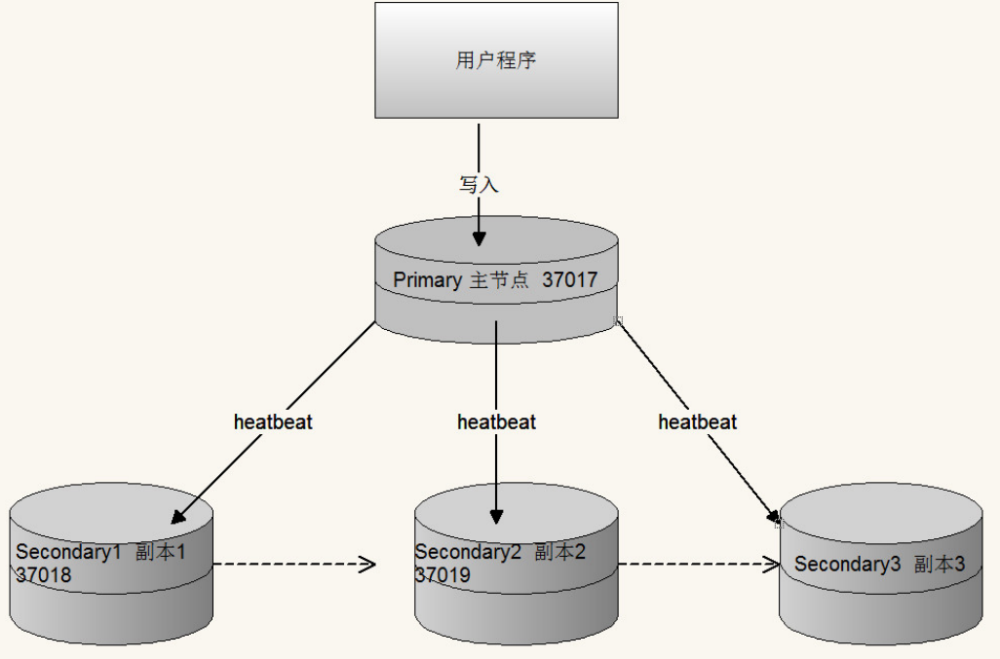

MongoDB是一款高性能的NoSQL（Not Only SQL 不仅仅SQL）数据库

# 第一部分 MongoDB体系结构

## 1.1 NoSQL 和 MongoDB

> NoSQL = Not Only SQL，支持类似SQL的功能，与Relational Database相辅相成。其性能较高，不使用SQL意味着没有结构化的存储要求（SQL为结构化的查询语句），没有约束之后架构更加灵活。
>
> NoSQl数据库四大家族：列存储Hbase，键值(Key-Value)存储 Redis，图像存储Neo4j，文档存储MongoDB。
>
> MongoDB是一个基于分布式文件存储的数据库，由C++编写，可以为WEB应用提供可扩展、高性能、易部署的数据存储解决方案。
>
> MongoDB是一个介于关系数据库和非关系数据库之间的产品，是非关系数据库中功能最丰富、最像关系数据库的。在高负载的情况下，通过添加更多的节点，可以保证服务器性能。

## 1.2 MongoDB 体系结构


## 1.3 MongoDB和RDBMS(关系型数据库)对比

| RDBMS                             | MongoDB                                       |
| --------------------------------- | --------------------------------------------- |
| database(数据库)                  | database(数据库)                              |
| table（表）                       | collection（集合）                            |
| row（行）                         | document（BSON文档）                          |
| column（列）                      | field（字段）                                 |
| index（唯一索引，主键索引）       | index（支持地理位置索引，全文索引、哈希索引） |
| join（主外键关联）                | embedded Document（嵌套文档）                 |
| primary key（指定1至N个列做主键） | primary key（指定_id field作为主键）          |

## 1.4 BSON

BSON是一类json的一种二进制形式的存储格式，简称Binary JSON，和JSON一样，支持内嵌的文档的数组对象，但是BSON有JSON没有的一些数据类型，如Date和Binary Data类型。BSON可以做为网络数据交换的一种存储形式，是一种schema-less的存储形式，优点是灵活性高，但是缺点是空间利用率不是很理想。

{key:value,key2:value2}这时一个BSON的例子，其中key是字符串类型，后面的value值的类型一般是字符串，double，Array，ISODate等类型。

BSON有三个特点：轻量性，可便利性，高效性

## 1.5 BSON在MongoDB中的使用

MongoDB使用了BSON结构来存储数据和网络数据交换。把这种格式转化成一文档这个概念（Document），这里的一个Document也可以理解成关系数据库中的一条记录（Record），只是这里的Document的变化更丰富一些，如Document可以嵌套。

MongoDB中的Document中可以出现的数据类型


## 1.6 MongoDB在Linux的安装

```
1.下载社区版 mongoDB 4.1.3，上传至linux
2.解压 tar -xvf mongodb-linux-x86_64-4.1.3.tgz
3.启动
	./bin/mongod
4.指定配置文件方式启动
	./bin/mongod -f mongo.conf
```

配置文件样例

```
dbpath=/data/mongo/
port=27017
bind_ip=0.0.0.0
fork=true
logpath = /data/mongo/MongoDB.log
logappend = true
auth=false
```


指定配置文件启动


## 1.7 MongoDB启动和参数说明

```
参数			说明
dbpath		  数据库目录，默认/data/db
port		  监听端口，默认27017
bind_ip		  监听IP地址，默认全部可以访问
fork		  是否已后台启动方式登录
logpath       日志路径
logappend     是否追加日志
auth          是否开启用户密码登录
config		  指定配置文件
```

## 1.8 mongo shell的启动

```
启动mongo shell
	./bin/mongo
指定主机和端口的方式启动
	./bin/mongo --host=主机ip --port=端口
```


## 1.9 MongoDB GUI工具

### 1.9.1 MongoDB Compass Community

### 1.9.2 NoSQLBooster（mongobooster）


# 第二部分 MongoDB命令

## 2.1 MongoDB的基本操作

```
查看数据库
	show dbs
切换数据库 如果没有对应的数据库则创建（数据库中要创建集合，才会真正创建出数据库）
	use 数据库名
创建集合
	db.createcollection("集合名")
查看集合
	show tables
	show collections
删除集合
	db.集合名.drop()
删除当前数据库
	db.dropDatabase()
```


## 2.2 MongoDB集合数据操作（CURD）

https://docs.mongodb.com/guides/

### 2.2.1 数据添加

1）插入单条数据db.集合名.insert(文档)

文档的数据结构和JSON基本一致。所有存储在集合中的数据都是BSON格式。BSON是一种类json的一种二进制形式的存储格式，简称Binary JSON。

2）例如：

db.lg_resume_preview.insert({name:"张晓峰",birthday:new ISODate("2000-07-01"),expectSalary:45000,city:'beijing'})

没有指定_id这个字段 系统会自动生成一个12字节BSON类型数据，有以下格式：

前4个字节表示时间戳 ObjectId("对象Id字符串").getTimestamp()来获取

接下来的3个字节是机器标识码

紧接的两个字节由进程id组成（PID）

最后三个字节是随机数。

3）插入多条数据

db.集合名.insert([文档,文档])


### 2.2.2 数据查询

**比较条件查询**

db.集合名.find(条件)

| 操作   | 条件格式           | 例子 | RDBMS |
| ------ | ------------------ | ---- | ----- |
| 等于   | {key:value}        |      |       |
| 大于   | {key:{$gt:value}}  |      |       |
| 小于   | {key:{$lt:value}}  |      |       |
| 大于等 | {key:{$gte:value}} |      |       |
| 小于等 | {key:{$lte:value}} |      |       |
| 不等于 | {key:{$ne:value}}  |      |       |

```
db.lg_resume_preview.find({})
db.lg_resume_preview.find()
db.lg_resume_preview.find({name:"李四"})
db.lg_resume_preview.find({expectSalary:45000)
db.lg_resume_preview.find({expectSalary:{$eq: 45000}})
db.lg_resume_preview.find({expectSalary:{$gt: 45000}})
db.lg_resume_preview.find({expectSalary:{$lt: 45000}})
```

**逻辑条件查询**

```
andt条件
MongoDB的find()方法可以传入多个键(key)，每个键(key)以逗号隔开，即常规SQL的AND条件
	db.集合名.find({key1:value1,key2:value2}).pretty()
	
or条件
	db.集合名.find({$or:[{key1:value1},{key2:value2}]}).pretty()
	
not条件
	db.集合名.find({key:{$not:{$操作符:value}}}).pretty()
```

```
db.lg_resume_preview.find({city:"shanghai",expectSalary:45000})
db.lg_resume_preview.find({$and: [{city:"shanghai"},{expectSalary:45000}]})

db.lg_resume_preview.find({$or: [{city:"shanghai"},{expectSalary:45000}]})
db.lg_resume_preview.find({city: {$not: {$eq: "beijing"}}})
```

**分页查询**

db.集合名.find({条件}).sort({排序字段:排序方式}).skip(跳过的行数).limit(一页显示多少数据)

```
db.lg_resume_preview.find({expectSalary:45000).sort({ city:-1 }).skip(4).limit(2)
```

### 2.2.3 数据更新 

```
$set:设置字段值
$unset:删除指定字段
$inc:对修改的值进行自增
db.集合名.update(
	<query>,
	<update>,
	{
		upsert:<boolean>,
		multi:<boolean>,
		writeConcern:<document>
	}
)

参数说明：
query：update的查询条件，类似sql update查询内where后面的。
update：update的对象和一些更新的操作符（如$set,$inc...）等，也可以理解为sql update中set后面的
upsert：可选，这个参数的意思是，如果不存在update的记录，是否插入objNew，true为插入，默认false,不插入
multi：可选，默认false,只更新找到的第一条记录，如果为true,就把按条件查询出来的多条记录全部更新。
writeConcern：可选，用来指定mongoDB对写操作的回执行为比如写的行为是否需要确认。

举例：
db.集合名.update({条件},{$set:{字段名:值}},{multi:true})
```

```
writeConcern 包括以下字段：
{w:<value>,j:<boolean>,wtimeout:<number>}
	w:指定写操作传播到的成员数量
比如：
w=1(默认)：则要求得到写操作已经传播到独立的Mongod示例或副本集的primary成员的确认
w=0：则不要求确认写操作，可能会返回socket exception和networking errors
w="majority"：要求得到写操作已经传播到大多数具有存储数据具有投票的（data-bearing voting）成员（也就是members[n].vote值大于0的成员）的确认
	j：要求得到Mongodb的写操作已经写到硬盘日志的确认
比如
j=true：要求得到Mongodb(w指定的实例个数)的写操作已经写道硬盘日志的确认。j=true本身并不保证因为副本集故障而不回滚。
	wtimeout:write concern的时间限制，只适用于w>1的情况
wtimeout在超过指定时间后写操作会返回error，即使写操作最后执行成功，当这些写操作返回时，MongoDB不会撤销在wtimeout时间限制之前执行成功的数据修改。
如果未指定wtimeout选项并且未指定write concern级别，则写入操作将无限期阻止。指定wtimeout值为0等同于没有wtimeout选项。
```

```
-- 数据更新
/** 更新 张三的工资为40000*/
db.lg_resume_preview.update({name:"张三"}, 
    {$set:{expectSalary:40000}}, j
    { multi: false, upsert: false}
)

db.lg_resume_preview.update({expectSalary:45000}, 
    {$set:{expectSalary:49000}}, 
    { multi: true, upsert: true}
)
/** inc*/
db.lg_resume_preview.update({name:"李四"}, 
    {$inc:{expectSalary:-900}}, 
    { multi: false, upsert: false}
)
/** 删除字段*/
db.lg_resume_preview.update({name:"李四"}, 
    {$unset:{expectSalary:""}}, 
    { multi: false, upsert: false}
)
/**没有操作符，会删除其他字段，只留expectSalary*/
db.lg_resume_preview.update({name:"李四"}, 
    {expectSalary:18000}, 
    { multi: false, upsert: false}
)
```

### 2.2.4 数据删除

```
db.collection.remove(
	<query>,
	{
		justOne:<boolean>,
		writeConcern:<document>
	}
)

参数说明：
query：可选，删除的文档的条件
justOne:可选，如果设置为true或1,则只删除一个文档，如果不设置该参数，使用默认值false,则删除所有匹配条件的文档。
writeConcern:可选，用来指定mongod对写操作的回执行为。
```

```
-- 删除数据
db.lg_resume_preview.remove({expectSalary:18000}, {justOne: true})
db.lg_resume_preview.find({city:"beijing"})
db.lg_resume_preview.remove({city:"beijing"}, {justOne: true})
db.lg_resume_preview.remove({})
```

## 2.3 MongoDB聚合操作

### 2.3.1 聚合操作简介

聚合是MongoDB的高级查询语言，它允许我们通过转化合并由多个文档的数据来生成新的在单个文档中不存在的文档信息。一般都是将记录按条件分组之后进行一系列求最大值、最小值、平均值的简单操作，也可以对记录进行复杂的数据统计，数据挖掘等操作。聚合操作的输入是集中的文档，输出可以是一个文档也可以是多个文档。

### 2.3.2 MongoDB聚合操作分类

- 单目的聚合操作（Single Purpose Aggregation Operation）
- 聚合管道（Aggregation Pipeline）
- MapReduce编程模型

### 2.3.3 单目的聚合操作

单目的聚合命令常用的有：count()和distinct()

```
db.lg_resume_preview.find().count()
db.lg_resume_preview.count()
db.lg_resume_preview.distinct("city")
```

### 2.3.4 聚合管道（Aggregation Pipeline）

```
db.collection.aggregater(AGGREGATE_OPERATION)
如：
db.lg_resume_preview.aggregate([{$group: { _id: "$city",city_count:{$sum: 1}}}])
```

MongoDB中聚合（aggregate）主要用于统计数据（诸如统计平均值，求和等），并返回计算后的数据结果。

表达式：处理输入文档并输出。表达式只能用于计算当前聚合管道的文档，不能处理其他的文档。

| 表达式    | 描述                                         |
| --------- | -------------------------------------------- |
| $sum      | 计算总和                                     |
| $avg      | 计算平均值                                   |
| $min      | 最小值                                       |
| $max      | 最大值                                       |
| $push     | 在结果文档中插入值到一个数组中               |
| $addToSet | 在结果文档中插入值到一个数组中，但数据不重复 |
| $first    | 根据资源文档的排序获取第一个文档数据         |
| $last     | 根据资源文档的排序获取最后一个文档数据       |

MongoDB中使用`db.COLLECTION_NAME.aggregate([{},...])`方法来构建和使用聚合管道，内阁文档通过一个由一个或多个阶段（stage）组成的管道，经过一系列的处理，输出相应的结果。

MongoDB的聚合管道将MongoDB文档在一个管道处理完毕后将结果传递给下一个管道处理。管道操作可以重复。

常用的几个操作：

- $group:将集合中的文档分组，可用于统计结果。
- $project:修改输入文档的结构。可以用来重命名，增加或删除域，也可以用于创建计算结果以及嵌套文档。
- $match:用于过滤数据，只输出符合条件的文档。$match使用MongoDB的标准查询操作。
- $limit: 用来限制MongoDB聚合管道返回的文档数。
- $skip:将输入文档排序后输出。
- $geoNear:输出接近某一地理位置的有序文档。

```
/**统计city出现个数*/
db.lg_resume_preview.aggregate([{$group: { _id: "$city",city_count:{$sum: 1}}}])

/**统计city平均薪资*/
db.lg_resume_preview.aggregate([{$group: { _id: "$city",avgSalary:{$avg: "$expectSalary"}}}])

/**统计city min薪资*/
db.lg_resume_preview.aggregate([{$group: { _id: "$city",expectSalary:{$min: "$expectSalary"}}}])

/**统计city max薪资*/
db.lg_resume_preview.aggregate([{$group: { _id: "$city",expectSalary:{$max: "$expectSalary"}}}])

db.lg_resume_preview.aggregate([{$group: { _id: "$city",name:{$first: "$name"}}}])
db.lg_resume_preview.aggregate([{$group: { _id: "$city",city_name:{$push: "$city"}}])
db.lg_resume_preview.aggregate([{$group: { _id: "$city",city_name:{$addToSet: "$city"}}}])

db.lg_resume_preview.aggregate([{$group: { _id: "$city",avgSalary:{$avg: "$expectSalary"}}},
{$project: {city:"$city",sal:"$avgSalary"}}])

db.lg_resume_preview.aggregate([{$group: { _id: "$city",city_count:{$sum: 1}}},
{$match: {city_count:{$gt:2}}}])
```


### 2.3.5 MapReduce编程模型

Pipeline查询速度快于MapReduce，但是MapReduce的强大之处在于能够在多台Server上并行执行复杂的聚合逻辑。MongoDB不允许Pipeline的单个聚合操作占用过多的系统内存，如果一个聚合操作消耗20%以上的内存，那么MongoDB直接停止操作，并向客户端输出错误消息。

**MapReduce是一种计算模型，简单说就是将大批量的工作（数据）分解（MAP）执行，然后再将结果合并成最终结果（REDUCE）。**

```
db.lg_resume_preview.mapReduce(
      function () {emit(this.city, this.expectSalary)}, //mapFunction
      function(key, values){return Array.avg(values)},//reduceFunction
      {
         query:{expectSalary:{$gt:15000}},
         finalize:function(key,value){
             return value+5000
         },verbose:false,
         out: "citySalary"
      })
```

使用MapReduce要实现两个函数Map函数和Reduce函数，Map函数调用emit(key,value)，遍历collection中所有的记录，将key与value传递给Reduce函数进行处理。

**参数说明：**

- map:是JavaScript函数，负责将每一个输入文档转换为零或多个文档，生成键值对序列，作为reduce函数参数
- reduce：是JavaScript函数，对Map操作的输出做合并的化简操作（将key-value变成key-values，也就是把values数组变成一个单一的值value）
- out：统计结果存放集合
- query: 一个筛选条件，只有满足条件的文档才会调用map函数。
- sort：和limit结合的sort排序参数（也是在发往map函数前给文档排序），可以优化分组机制
- limit: 发往map函数的文档数量上线（没有limit,单独使用sort的用处不大）
- finalize:可以对reduce输出结果再一次修改
- verbose:是否包括信息中的时间信息，默认为false


# 第三部分 MongoDB索引Index

## 3.1 什么是索引

> 索引是一种单独的、物理的对数据库表中一列或多列的值进行排序的一种存储结构，它是某个表中一列或若干列值的集合和相应的指向表中物理标识这些值的数据页的逻辑指针清单。默认情况下Mongo在一个集合（collection）创建时，自动地对集合地_id创建了唯一索引。

## 3.2 索引类型

### 3.2.1 单键索引（Single Field）

MongoDB支持所有数据类型中地单个字段索引，并且可以在文档地任何字段上定义。

对于单个字段索引，索引键的排序顺序无关紧要，因为MongoDB可以在任意方向读取索引。

单个例上创建索引：

```
db.集合名.createIndex({"字段名":排序方式})

db.lg_resume_preview.createIndex({name:1})
db.lg_resume_preview.getIndexes()
```

**特殊单键索引 过期索引TTL (Time To Live)**

TTL索引是MongoDB中一种特殊的索引，可以支持文档在一定时间之后自动过期删除，目前TTL索引只能在单字段上建立，**并且字段类型必须是日期类型。**

```
db.集合名.createIndex({"日期字段":排序方式},{expireAfterSeconds:秒数})
```

过期索引会删除索引上的数据

```
db.lg_index_test.insert({name:"test1",salary:38000,birthday:new ISODate("2020-08-12")})

db.lg_index_test.createIndex({birthday:1},{expireAfterSeconds:5})
```

### 3.2.2 复合索引（Compound Index）

官网参考：https://docs.mongodb.com/manual/core/index-compound/

在多个字段的基础上搜索表，需要在MongoDB中创建复合索引。复合索引支持基于多个字段的索引，这种扩展了索引的概念并将它们扩展到索引中的更大域。

创建复合索引的注意事项：字段顺序、索引方向。

```
db.集合名.createIndex({"字段名1":排序方式,"字段名2":排序方式})
```

### 3.2.3 多键索引（Multikey indexes）

针对属性包括数组数据的情况，MongoDB支持针对数组中每一个element创建索引，Multikey indexes支持Strings，numbers和nested documents

### 3.2.4 地理空间索引（Geospatial Index）

针对地理空间坐标数据创建索引。

2dsphere索引，用于存储和查找球面上的点

2d索引，用于存储和查找平面上的点

```
db.company.insert(
   {
     loc : { type: "Point", coordinates: [ 116.482451, 39.914176 ] },
     name: "大望路地铁",
     category : "Parks"
   }
)
db.company.ensureIndex({loc:"2dsphere"})
db.company.getIndexes()
db.company.find({
  "loc" : {
      "$geoWithin" : {
       "$center":[[116.482451,39.914176],0.05] 
      }
  } 
})

/** 计算中心点最近的三个点 */
db.company.aggregate([
   {
     $geoNear: {
        near: { type: "Point", coordinates: [116.482451,39.914176 ] },
        key: "loc",
        distanceField: "dist.calculated"
     }
   },
   { $limit: 3 }
])
```

### 3.2.5 全文索引

MongoDB提供了针对string内容的文本查询，Text Index支持任意属性值为string或string数组元素的索引查询。注意：**一个集合仅支持最多一个Text Index**，中文分词不理想，推荐ES。

```
db.集合名.createIndex({"字段":"text"})
db.集合名.find({"$text":{"$search":"two"}})

db.textTextIndex.insert({id:4,name:"test4",description:"three world three dream",city:"dj"})
db.textTextIndex.find()

db.textTextIndex.createIndex({description:"text"})
db.textTextIndex.find({"$text":{"$search":"two"}})
```

### 3.2.6 哈希索引 Hashed Index

官网参考：https://docs.mongodb.com/manual/core/index-hashed/

针对属性的哈希值进行索引查询，当要使用hashed index时，MongoDB能够自动计算hash值，无需程序计算hash值。注：hash index仅支持等于查询，不支持范围查询。

```
db.集合名.createIndex({"字段":"hashed"})
```

## 3.3 索引和explain

### 3.3.1 索引管理

创建索引并在后台运行

```
db.COLLECTION_NAME.createIndex({"字段":1},{background:true})

db.textTextIndex.createIndex({name:1},{background:true})
```

获取针对某个集合的索引

```
db.textTextIndex.getIndexes()
```

索引大小

```
db.textTextIndex.totalIndexSize()
```

索引重建

```
db.textTextIndex.reIndex()
```

索引删除

```
db.COLLECTION_NAME.dropIndex("INDEX-NAME") 
db.COLLECTION_NAME.dropIndexes()
注意: _id 对应的索引是删除不了的
```

### 3.3.2 explain分析

循环插入100万条数据，不使用索引字段查询查看执行计划，然后给某个字段建立索引，使用索引字段作为查询条件，再查看执行计划进行分析。

explain()接收不同的参数，通过设置不同的参数，可以查看更详细的查询计划。

- queryPlanner：queryPlanner是默认参数，具体执行计划信息参考下面表格》
- executionStats：executionStats会返回执行计划的一些统计信息（有些版本中和allPlansExecution等同）。
- allPlansExecution：allPlansExecution用来获取所有执行计划，结果参数基本与上文相同。

**1、queryPlanner默认参数**

| 参数                           | 含义                                                         |
| ------------------------------ | ------------------------------------------------------------ |
| plannerVersion                 | 查询计划版本                                                 |
| namespace                      | 要查询的集合（该值返回的是该query所查询的表）数据库.集合     |
| indexFilterSet                 | 针对该query是否有indexFilter                                 |
| parsedQuery                    | 查询条件                                                     |
| winningPlan                    | 被选中的执行计划                                             |
| winningPlan.stage              | 被选中执行计划的stage(查询方式)，常见的有：COLLSCAN/全表扫描：（应该知道就是CollectionScan，就是所谓的“集合扫描”， 和mysql中table scan/heap scan类似，这个就是所谓的性能最烂最无奈的由来）、IXSCAN/索引扫描：（是IndexScan，这就说明 我们已经命中索引了）、FETCH/根据索引去检索文档、 SHARD_MERGE/合并分片结果、IDHACK/针对_id进行查询等 |
| winningPlan.inputStage         | 用来描述子stage，并且为其父stage提供文档和索引关键字。       |
| winningPlan.stage的child stage | 如果此处是IXSCAN，表示进行的是index scanning。               |
| winningPlan.keyPattern         | 所扫描的index内容                                            |
| winningPlan.indexName          | winning plan所选用的index。                                  |
| winningPlan.isMultiKey         | 是否是MultiKey，此处返回是false，如果索引建立再array上，此处将是true。 |
| winningPlan.direction          | 此query的查询顺序，此处是forward，如果用了.sort({字段:-1}) 将显示backward。 |
| filter                         | 过滤条件                                                     |
| winningPlan.indexBounds        | winningplan所扫描的索引范围,如果没有制定范围就是[MaxKey, MinKey]，这主要是直接定位到mongodb的chunck中去查找数据，加快数据读取。 |
| rejectedPlans                  | 被拒绝的执行计划的详细返回，其中具体信息与winningPlan的返回中意义相同，故不在此赘述） |
| serverInfo                     | MongoDB服务器信息                                            |

**2、executionStats参数**

| 参数                                   | 含义                                                         |
| -------------------------------------- | ------------------------------------------------------------ |
| executionSuccess                       | 是否执行成功                                                 |
| nReturned                              | 返回的文档数                                                 |
| executionTimeMillis                    | 执行耗时                                                     |
| totalKeysExamined                      | 索引扫描次数                                                 |
| totalDocsExamined                      | 文档扫描次数                                                 |
| executionStages                        | 这个分类下描述执行的状态                                     |
| stage                                  | 扫描方式，具体可选值与上文的相同                             |
| nReturned                              | 查询结果数量                                                 |
| executionTimeMillisEstimate            | 检索document获得数据的时间                                   |
| inputStage.executionTimeMillisEstimate | 该查询扫面文档index所用时间                                  |
| works                                  | 工作单元数，一个查询会分解成小的工作单元                     |
| advanced                               | 优先返回的结果数                                             |
| docsExamined                           | 文档检查数目，与totalDocsExamined一致。检查了总共的document 个数，而从返回上面的nReturned数量 |

**3、executionStats返回逐层分析**

第一层，executionTimeMillis 最为直观explain返回值是executionTimeMillis值，指的是这条语句的执行时间，这个值当然是希望越少越好。

其中有3个executionTimeMillis，分别是：

executionStats.executionTimeMillis 该query的整体查询时间。

executionStats.executionStages.executionTimeMillisEstimate 该查询检索document获取数据的时间。

executionStats.executionStages.inputStage.exexutionTimeMillisEstimate 该查询扫描文档index所用时间。

第二层，index与document扫描数与查询返回条目数，主要讨论3个返回项 nReturned、totalKeysExamined、totalDocsExamined，分别代表该条查询返回的条目，索引扫描条目、文档扫描条目。这些都是直观地影响到executionTimeMillis，扫描地越少速度越快。对于一个查询最理想地状态是：nReturded=totalKeysExamined=totalDocsExamined。

第三层，stage状态分析，那又是什么影响到了totalKeysExamined和totalDocsExamined？是stage的类型。

类型列举如下：

COLLSCAN：全表扫描

IXSCAN：索引扫描

TETCH：根据索引去检索指定document

SHARD_MERGE：将各个分片返回数据进行merge

SORT：表明在内存中进行了排序

LIMIT：使用limit限制返回数

SKIP：使用skip进行跳过

IDHACK：针对_id进行查询

SHARDING_FILTER：通过mongos对分片数据进行查询

COUNT：利用db.coll.explain().count()之类及逆行count运算

TEXT：使用全文索引进行查询时候的stage返回

PROJECTION：限定返回字段时stage的返回

```
/**限定返回字段,去掉_id*/
db.lg_resume.find({name:{$gt:"test222333"}},{_id:0}).explain("executionStats")
```

对于普通查询，希望看到stage的组合（查询的时候尽可能用上索引）：

Fetch+IDHACK

Tetch+IXSCAN

Limit+(Fetch+IXSCAN)

PROJECTION+IXSCAN

不希望看到包含如下的stage：

COLLSCAN

SORT

COUNT

**4、allPlansExecution参数**

```
queryPlanner 参数 和 executionStats的拼接
```


```
示例：
db.lg_resume.find({name:"test11011"}).explain("executionStats")
db.lg_resume.find({id:{$gt:222333}}).explain()
/**限定返回字段*/
db.lg_resume.find({name:{$gt:"test222333"}},{_id:0}).explain("executionStats")
```

## 3.4 慢查询分析

1、开启内置的查询分析器，记录读写操作效率

```
db.setProfilingLevel(n,m) n的取值可选0,1,2

0 表示不记录
1 表示记录慢速操作，如果值为1，m必须赋值，单位为ms，用于定于慢速查询时间阈值
2 表示记录所有的读写操作
```

2、查询监控结果

```
db.system.profile.find().sort({millis:-1}).limit(3)
```

3、分析慢速查询

应用程序设计不合理，不正确的数据模型，硬件配置问题，缺少索引等

4、解读explain结果 确定是否缺少索引


## 3.5 MongoDB索引底层实现原理

MongoDB时文档型的数据库，它使用BSON格式保存数据，比关系型数据库存储更方便。MySQL是关系型数据库，数据的关联性非常强，底层索引租住数据使用B+树，B+树由于数据全部存储在叶子节点，并且通过指针串联在一起，这样就容易进行区间遍历甚至全部遍历。**MongoDB使用B-树**，所有节点都有Data域，只要找到指定索引就可以进行访问，单次查询从结构上来看要快于MySQL。

B-树是一种自平衡的搜索树，形式简单：


B-树的特点：

- 多路非二叉树
- 每个节点 即保存数据 又保存索引
- 搜索时 相当于二分查找

B+树是B-树的变种


B+树的特点：

- 多路非二叉树
- 只有叶子节点保存数据
- 搜索时 也相当于二分查找
- 增加了 相邻节点指针

从上面可以看出最核心的区别有2个：一个是数据保存位置，一个是相邻节点的指向。就是这两个造成MongoDB和MySQL的差别。

- B+树相邻节点的指针可以大大增加区间访问性，可使用在范围查询等，而B-树每个节点key和data在一起适合随机读写，而区间查找效率很差。
- B+树更适合外部存储，也就是磁盘存储，使用B-结构的话，每次磁盘预读中的很多数据是用不上的数据。因此，它没能利用好磁盘预读提供的数据。B+数 由于节点内无data域，每个节点能索引的范围更大更精确。
- 注意这个区别相当重要，是基于（1）（2）的，**B-数每个节点即保存数据又保存索引，树的深度小，所以磁盘IO次数少**，B+树只有叶子节点保存数据，较B-树而言深度大磁盘IO多，但是区间访问比较好。

# 第四部分 MongoDB应用实战

## 4.1 MongoDB的适用场景

> - 网站数据
> - 缓存
> - 大尺寸、低价值的数据
> - 高伸缩性的场景
> - 用于对象及JSON数据的存储

## 4.2 MongoDB的行业具体应用场景

- 游戏场景
- 物流场景
- 社交场景
- 物联网场景
- 直播

## 4.3 如何抉择是否使用MongoDB

| 应用特征                                           | Yes/No  |
| -------------------------------------------------- | ------- |
| 应用不需要事务及复杂 join 支持                     | 必须Yes |
| 新应用，需求会变，数据模型无法确定，想快速迭代开发 | ?       |
| 应用需要2000-3000以上的读写QPS（更高也可以）       | ?       |
| 应用需要TB甚至 PB 级别数据存储                     | ?       |
| 应用发展迅速，需要能快速水平扩展                   | ?       |
| 应用要求存储的数据不丢失                           | ?       |
| 应用需要99.999%高可用                              | ?       |
| 应用需要大量的地理位置查询、文本查询               | ?       |

## 4.4 Java访问MongoDB

https://gitee.com/turboYuu/mongo-db-4.3/tree/master/lab/mongo_java_demo

maven依赖

```xml
<dependency>
    <groupId>org.mongodb</groupId>
    <artifactId>mongo-java-driver</artifactId>
    <version>3.10.1</version>
</dependency>
```

文档添加

```java
public static void main(String[] args) {
    MongoClient mongoClient = new MongoClient("192.168.31.138",27017);
    MongoDatabase turbo = mongoClient.getDatabase("turbo");
    MongoCollection<Document> lgResumePreview = turbo.getCollection("lg_resume_preview");
    Document document = Document.parse("{name:'lisi',city:'bj',expectSalary:45000,
                                       birthday:new ISODate('2012-12-08')}");
    lgResumePreview.insertOne(document);
    mongoClient.close();
}
```


文档查询和过滤

```java
public static void main(String[] args) {
    MongoClient mongoClient = new MongoClient("192.168.31.138",27017);
    MongoDatabase turbo = mongoClient.getDatabase("turbo");
    MongoCollection<Document> lgResumePreview = turbo.getCollection("lg_resume_preview");
    Document sdoc = new Document();
    sdoc.append("expectSalary",-1);
    FindIterable<Document> documents = lgResumePreview.
        find(Document.parse("{expectSalary:{$gt:21000}}")).sort(sdoc);
    //或者使用Filters
    //FindIterable<Document> documents = 
    //		lgResumePreview.find(Filters.gt("expectSalary",18000)).sort(sdoc);
    for (Document doc:documents){
        System.out.println(doc);
    }
    mongoClient.close();
}
```


## 4.5 Spring 访问MongoDB

https://gitee.com/turboYuu/mongo-db-4.3/tree/master/lab/mongo_spring_demo

1、Maven

```
<dependency>
    <groupId>org.springframework.data</groupId>
    <artifactId>spring-data-mongodb</artifactId>
    <version>2.2.9.RELEASE</version>
</dependency>
```

2、配置文件中配置MongoTempate

```xml
<?xml version="1.0" encoding="UTF-8"?>
<beans xmlns="http://www.springframework.org/schema/beans"
       xmlns:xsi="http://www.w3.org/2001/XMLSchema-instance"
       xmlns:context="http://www.springframework.org/schema/context"
       xmlns:mongo="http://www.springframework.org/schema/data/mongo"
       xsi:schemaLocation="
       http://www.springframework.org/schema/beans 
       http://www.springframework.org/schema/beans/spring-beans.xsd
       http://www.springframework.org/schema/context 
       http://www.springframework.org/schema/context/spring-context.xsd
       http://www.springframework.org/schema/data/mongo 
       http://www.springframework.org/schema/data/mongo/spring-mongo.xsd">

    <mongo:db-factory id="mongoDbFactory" client-uri="mongodb://192.168.31.138:27017/turbo">
    </mongo:db-factory>
    <bean id="mongoTemplate" class="org.springframework.data.mongodb.core.MongoTemplate">
        <constructor-arg index="0" ref="mongoDbFactory"></constructor-arg>
    </bean>
    <!--开启组件扫描-->
    <context:component-scan base-package="com.turbo"></context:component-scan>
</beans>
```

3、Dao实现类注入MongoTemplate

```java
@Autowired
private MongoTemplate mongoTemplate;
```

4、从Spring容器中获取Dao对象 进行测试（注意要开启组件扫描）


## 4.6 Spring Boot访问MongoDB

### 4.6.1 MomgoTemplate的方式

https://gitee.com/turboYuu/mongo-db-4.3/tree/master/lab/mongo_springboot_template

1、基于maven新建springboot工程

```xml
<dependency>
    <groupId>org.springframework.boot</groupId>
    <artifactId>spring-boot-starter-data-mongodb</artifactId>
    <version>2.2.9.RELEASE</version>
</dependency>
```

2、配置文件application.properties

```properties
spring.data.mongodb.host=192.168.31.138
spring.data.mongodb.port=27017
spring.data.mongodb.database=turbo
```

3、Dao实现类 注入MongoTemplate 完成增删改查

```java
@Autowired
private MongoTemplate mongoTemplate;
```

4、从Spring容器中获取Dao对象 进行测试


### 4.6.2 MongoRepository

https://gitee.com/turboYuu/mongo-db-4.3/tree/master/lab/mongo_springboot_repository

1、基于maven新建springboot工程

```
<dependency>
    <groupId>org.springframework.boot</groupId>
    <artifactId>spring-boot-starter-data-mongodb</artifactId>
    <version>2.2.9.RELEASE</version>
</dependency>
```

2、配置文件application.properties

```properties
spring.data.mongodb.host=192.168.31.138
spring.data.mongodb.port=27017
spring.data.mongodb.database=turbo
```

4、编写实体类 并在实体类上打 @Document("集合名")

```java
@Document("lg_resume_datas")
public class Resume {
```

4、编写Repository接口 继承MongoRepository

```java
package com.turbo.repository;

import com.turbo.bean.Resume;
import org.springframework.data.mongodb.repository.MongoRepository;
import java.util.List;

public interface ResumeReposiptry extends MongoRepository<Resume,String> {

    List<Resume> findByNameEquals(String name);
    List<Resume> findByNameAndExpectSalary(String name,double expectSalary);
}
```

具体方法参考：https://docs.spring.io/spring-data/jpa/docs/current/reference/html/#jpa.query-methods.query-creation

如果内置方法不够用，可自己定义。

5、从Spring容器中获取Repository对象，进行测试。


# 第五部分 MongoDB架构

## 5.1 MongoDB逻辑结构


MongoDB与MySQL中的架构差不多，底层都使用了可插拔的存储引擎以满足用户不同需求。用户可以根据程序的数据特征选择不同的存储引擎，在最新版的MongoDB中使用了WiredTiger作为默认的存储引擎，WiredTiger提供了不同粒度的并发控制和压缩机制，能够为不同种类的应用提供最好的性能和存储率。

在存储迎请上层就是MongoDB的数据模型的查询语言了，由于MongoDB对数据的存储与RDBMS有较大的差异，所以它创建了一套不同的数据模型和查询语言。

## 5.2 MongoDB的数据模型

### 5.2.1 描述数据模型

#### 内嵌

内嵌的方式是指把相关联的数据保存在同一个文档结构中。MongoDB的文档结构允许一个字段或者一个数组内的值作为一个嵌套的文档。

#### 引用

引用方式通过存储数据引用信息来实现两个不同文档之间的关联，应用程序可以通过解析这些数据引用来访问相关数据。

### 5.2.2 如何选择数据模型

#### 选择内嵌

- 数据对象之间有包含关系，一般是数据对象之间有一对多或者一对一的关系。
- 需要经常一起读取的数据。
- 有map-reduce/aggregation需求的数据放在一起，这些操作都只能操作单个collection。

#### 选择引用

- 当嵌套数据会导致很多数据的重复，并且读性能的优势有不足以覆盖数据重复的弊端。
- 需要表达比较复杂的多对多关系的时候。
- 大型层次结果数据集，嵌套不要太深。

## 5.3 MongoDB的存储引擎

### 5.3.1 存储引擎概述

> 存储引擎是MongoDB的核心组件，负责管理数据如歌存储在硬盘和内存中。MongoDB支持的存储引擎有MMAPv1，WiredTiger和InMemory。InMemory存储引擎用于将数据只存储在内存中，只将少量的元数据（meta-data）和诊断日志（Diagnostic）存储到硬盘文件中，由于不需要Disk的IO操作，就能获取所需的数据，InMemory存储引擎大幅度降低的数据查询的延迟（Latency）。
>
> 从mongodb3.2开始默认的存储引擎是WiredTiger，3.2版本之间的默认存储引擎是MMAPv1，mongodb4.x不再支持MMAPv1存储引擎。

```
storage:
    journal:
        enabled: true    
        dbPath: /data/mongo/    
        ##是否一个库一个文件夹    
        directoryPerDB: true    
        ##数据引擎
        engine: wiredTiger    
        ##WT引擎配置
        WiredTiger:
            engineConfig:
                ##WT最大使用cache（根据服务器实际情况调节）
                cacheSizeGB: 2
                ##是否将索引也按数据库名单独存储
                directoryForIndexes: true
                journalCompressor:none （默认snappy）
            ##表压缩配置
            collectionConfig:
                blockCompressor: zlib (默认snappy,还可选none、zlib)
            ##索引配置
            indexConfig:
                prefixCompression: true
```

### 5.3.2 WiredTiger存储引擎优势

1、文档空间分配方式

WiredTiger使用的BTree存储	MMAPv1 线性存储 需要Padding

2、并发级别

WiredTiger 文档级别锁（对应MySQL行锁），MMAPv1引擎使用表级锁

3、数据压缩

snappy(默认)和zlib，相比MMAPv1（无压缩）空间节省数倍

4、内存使用

WiredTiger可以指定内存的使用大小

5、Cache使用

WT引擎使用了二级缓存wiredTiger Cache，File System Cache来保证Disk上的数据的最终一致性。而MMAPv1只有journal日志。

### 5.3.3 WiredTiger引擎包含的文件和作用


- WiredTiger.basecfg：存储基本配置信息，与ConfigServer有关系
- WiredTiger.lock：定义锁操作
- table*.wt：存储各张表的数据
- WiredTiger.wt：粗出table*的元数据
- WiredTiger.turtle：存储WiredTiger.wt的元数据
- journal：存储WAL（Write Ahead Log）

### 5.3.4 WiredTiger存储引擎实现原理

#### 写请求

WiredTiger的写操作会默认写入`Cache`，并持久化到`WAL`（Write Ahead Log），每60s或Log文件达到2G做一次`checkpoint`（当然也可以通过在写入时传入`j:true`的参数强制journal文件的同步，writeConcern{w:<value>,j:<boolean>,without:<bunber>}）产生快照文件。WiredTiger初始化时，恢复至最新的快照状态，然后再根据WAL恢复数据，保证数据的完整性。


Cache是基于BTree的，节点是一个page，root page是根节点，internal page是中间索引节点，leaf page真正存储数据，数据以page单位读写。WiredTiger采用Copy on Write的方式管理写操作（insert、update、delete），写操作会先缓存在cache里，持久化时，写操作不会在原来的leaf page上进行，而是写入新分配的page，每次checkpoint都会产生一个新的root page。

#### checkpoint流程

> 1.对所有的table进行一次checkpoint，每个table的checkpoint的元数据更新至WiredTiger.wt
>
> 2.对wiredTiger.wt进行checkpoint，将该table checkpoint的元数据更新至临时文件WiredTiger.turtle.set
>
> 3.将WiredTiger.turtle.set重命名为WiredTiger.turtle
>
> 4.上述过程中如果中间失败，WiredTiger在下次连接初始化时，首先将数据恢复至最新的快照状态，然后根据WAL恢复数据，以保证存储可靠性。

#### Journaling

在数据库宕机时，为保证MongoDB中数据的是就行，MongoDB使用了Write Ahead Logging向磁盘上journal文件预先进行写入。除了journal日志，MongoDB还使用检查点（checkpoint）来保证数据的一致性，**当数据库发生宕机时，就需要checkpoint和journal文件协作完成数据的恢复工作。**

1.在数据文件中查找上一个检查点的标识符

2.在journal文件中查找标识符对应的记录

3.重做对应记录之后的全部操作


# 第六部分 MongoDB集群高可用

## 6.1 MongoDB主从赋值架构原理和缺陷

master-slave结构中master节点负责数据的读写，slave没有写入权限只负责读取数据。


在主从结构中，主节点的操作记录为oplog（operation log）。oplog存储在系统数据库local的oplog.$main集合中，这个集合的每个文档都代表主节点上执行的一个操作。从服务器会定期从主服务器中获取oplog记录，然后在本机上执行！对于存储oplog的集合，mongodb采用的固定集合，也就是说随着操作过多，新的操作会覆盖旧的操作。

主从结果普没有自动故障转移功能，需要指定master和slave端，不推荐在生产中使用。

mongodb4.0后不再支持主从复制！

[main]Master/slave replication is no longer supported

## 6.2 复制集replica sets

### 6.2.1 什么是复制集


复制集是由一组拥有相同数据集的mongod实例组成的集群。

复制集是一个集群，它是2台及以上的服务器组成，以及复制集成员包括Primary主节点，secondary从节点和投票节点。复制集提供者数据的冗余备份，并在多个服务器上存储数据副本，提高数据的可用性，保证数据的安全性。

### 6.2.2 为什么使用复制集

- 高可用
- 灾难备份
- 功能隔离

### 6.2.3 复制集集群架构原理

一个复制集中Primary节点上能够完成读写操作，Secondary节点仅能用于读操作。Primary节点需要记录所有改变数据库状态的操作，这些操作记录保存在oplog中，这个文件存储在local数据库，各个Secondary节点通过此oplog来复制数据并应用于本地，保持本地的数据与主节点的一致。oplog具有幂等性，即无论执行几次，其结果一致，这个比mysql的二进制日志更好用。

oplog的组成结构

```
{
"ts" : Timestamp(1446011584, 2),
"h" : NumberLong("1687359108795812092"), "v" : 2,
"op" : "i",
"ns" : "test.nosql",
"o" : { "_id" : ObjectId("563062c0b085733f34ab4129"), "name" : "mongodb", "score" : "10"}
}
ts:操作时间，当前timestamp+计数器，计数器每秒都被重置
h:操作的全局唯一标识
v:oplog版本信息
op:操作类型
	i:插入操作
	u:更新操作
	d:删除操作
	c:执行命令（如createDatabase,dropDatabase）
n:空操作，特殊用途
ns:操作针对集合
o:操作内容
o2:更新查询条件，仅update操作包含该字段
```

复制集数据同步分为初始化同步和keep复制同步。初始化同步指全量从主节点同步数据，如果Primary节点数据量比较大同步时间会比较长。而keep复制指初始化同步后，节点之间的实时同步一般是增量同步。

初始化同步有以下两中情况触发：

（1）Secondary第一次加入。

（2）Secondary落后的数据量超过oplog的大小，也会被全量复制。

MongoDB的Primary节点选举基于心跳触发。一个复制集N个节点中任意两个节点维持心跳，每个节点维护其他N-1节点的状态。


> 心跳检测：
>
> 整个集群需要保持一定的通信才能知道哪些节点活着哪些节点挂掉。mongodb节点会向副本集中的其他节点每2秒就会发送一次pings包，如果其他节点在10秒内没有返回就标识为不能访问。每个节点内部都会维护一个状态映射表，表明当前每个节点是什么角色，日志时间戳等关键信息。如果主节点发现自己无法与大部分节点通讯则把自己降级为secondary只读节点。

主节点选举触发的时机：

> 第一次初始化一个复制集
>
> Secondary节点权重比Priamry节点高时，发起替换选举
>
> Secondary节点发现集群中没有Primary时，发起选举
>
> Primary节点不能访问到大部分（Majority）成员时主动降级

当触发选举时，Secondary节点尝试将自身选举为Primary。主节点选举是一个二阶段过程+多数派协议。

> 第一阶段：
>
> 检测自身是否有被选举的资格，如果符合资格会向其他节点发起本节点是否有选举资格的FreshnessCheck，进行同僚仲裁
>
> 第二阶段：
>
> 发起者向集群中存活节点发送Elect(选举)请求，仲裁者收到请求的节点会执行一系列合法性检查，如果检查通过，则仲裁者（**一个复制集中最多50个节点，其中只有7个具有投票权**）给发起者投一票。
>
> pv0通过30秒选举锁防止一次选举中两次投票。
>
> pv1使用terms(一个单调递增的选举计数器)来防止在一次选举中投两次票的情况。
>
> 多数派协议：
>
> 发起者如果会的超过半数的投票，则选举通过，自身成为Primary节点。获得低于半数选票的原因，除了常见的网络问题外，相同优先级的节点同时通过第一阶段的同僚仲裁并进入第二阶段也是一个原因。因此，当选票不足时，会sleep[0,1]秒内随机时间后再次尝试选举。

### 6.2.4 复制集搭建



#### 1、主节点配置 mongo_37017.cong

```
#主节点配置
dbpath=/data/mongo/data/server1
bind_ip=0.0.0.0
port=37017
fork=true
logpath=/data/mongo/logs/server1.log
replSet=lagouCluster
```

#### 2、从节点1配置 mongo_37018.conf

```
#从节点1配置
dbpath=/data/mongo/data/server2
bind_ip=0.0.0.0
port=37018
fork=true
logpath=/data/mongo/logs/server2.log
replSet=lagouCluster
```

#### 3、从节点2配置 mongo_37019.conf

```
#从节点2配置
dbpath=/data/mongo/data/server3
bind_ip=0.0.0.0
port=37019
fork=true
logpath=/data/mongo/logs/server3.log
replSet=lagouCluster
```

#### 4、初始化节点配置

启动三个节点

```
./bin/mongod -f mongo_37017.conf
./bin/mongod -f mongo_37018.conf
./bin/mongod -f mongo_37019.conf
```

然后进入任意一个节点 运行如下命令：

```
var cfg ={"_id":"lagouCluster",
	"protocolVersion" : 1,
	"members":[
		{"_id":1,"host":"192.168.31.139:37017","priority":10}, 
		{"_id":2,"host":"192.168.31.139:37018"}
	] 
	}

rs.initiate(cfg)
rs.status()
```


#### 5、节点的动态增删

```
增加节点
rs.add("192.168.31.139:37019")
删除slave节点
rs.remove("192.168.31.139:37019")
```


#### 6、复制集操作演示

进入主节点 --- 插入数据 --- 进入从节点验证

注意：默认节点下从节点不能读取数据，调用rs.slaveOk()解决。


为了保证高可用，在集群当中如果主节点挂掉后，会自动在从节点中选举一个，重新作为主节点。当节点恢复后会触发新的Primary选举。

rs.status()

节点说明：

PRIMARY节点：可以查询和新增数据

SECONDARY节点：只能查询，不能新增，基于priority权重可以被选为主节点

ARBITER节点：不能查询数据和新增数据，不能变成主节点

### 6.2.5 复制集成员的配置参数

| 参数字段       | 类型说明 | 取值                          | 说明                                                         |
| -------------- | -------- | ----------------------------- | ------------------------------------------------------------ |
| _id            | 整数     | _id:0                         | 复制集中的表示                                               |
| host           | 字符串   | host:"主机:端口"              | 节点主机名                                                   |
| arbiterOnly    | 布尔值   | arbiterOnly:true              | 是否为仲裁(裁判)节点                                         |
| priority(权重) | 整数     | priority=0\|1                 | 默认1，是否有资格变成主节点，取值范围0-1000，0永远不 会变成主节点 |
| hidden         | 布尔值   | hidden=true\|false,0\|1       | 隐藏，权重必须为0，才可以设置                                |
| votes          | 整数     | votes= 0\|1                   | 投票，是否为投票节点,0不投票，1投票                          |
| slaveDelay     | 整数     | slaveDelay=3600               | 从库的延迟多少秒                                             |
| buildIndexes   | 布尔值   | buildIndexes=true\|false,0\|1 | 主库的索引，从库也创建，_id索引无效                          |

举例：

```
var cfg ={"_id":"lagouCluster",
	"protocolVersion" : 1,
	"members":[
		{"_id":1,"host":"192.168.31.139:37017","priority":10},
		{"_id":2,"host":"192.168.31.139:37018","priority":0},
		{"_id":3,"host":"192.168.31.139:37019","priority":5},
		{"_id":4,"host":"192.168.31.139:37020","arbiterOnly":true}
	] 
	}
	//重新装载配置，并重新生成集群节点。
	rs.reconfig(cfg)
	//查看集群状态
	rs.status()
```


### 6.2.6 有仲裁节点复制集搭建

和上面的配置步骤相同，只是增加了一个特殊的仲裁节点

注入节点执行 rs.addArb("IP:端口号")；

```
rs.addArb("192.168.31.139:37020")
```

## 6.3 分片集群Shard Cluster

### 6.3.1 什么是分片

分片（sharding）是mongoDB用来将大型集合水平分割到不同服务器（或者复制集）上所采用的方法。不需要功能强大的大型计算机就可以存储更多的数据，处理更大的负载。

### 6.3.2 为什么要分片

>- 存储容量超过单据磁盘容量
>- 活跃的数据集超出单机内存容量，导致很多请求都需要从磁盘读取数据，影响性能
>- IOPS超出单个MongoDB节点的服务能力，随着数据的增长，单机实例的瓶颈会越来越明显
>- 副本集具有节点数量限制

>垂直扩展：增加更多的CPU和存储资源来扩展容量
>
>水平扩展：将数据集分布在多个服务器上。水平扩展即分片。

### 6.3.3 分片的工作原理


**分片集群由以下3个服务组成：**

- Shards Server：每个shard由一个或多个mongod进程组成，用于存储数据。

- Router Server：数据库集群的请求入口，所有请求都通过Router(mongos)进行协调，不需要在应用程序添加一个路由选择器，Router(mongos)就是一个请求分发中心它负责把应用程序的请求转发到对应的Shard服务器上。
- Config Server：配置服务器。存储所有数据元信息（路由、分片）的配置。

#### 片键（shard key）

为了在数据集合中分配文档，MongoDB使用分片主键分隔集合

#### 区块（chunk）

在一个shard server内部，MongoDB还是会把分为chunks，每个chunk代表这个shard server内部一部分数据。MongoDB分割分片数据到区块，每一个区块包含基于分片主键的左闭右开的区间范围。

#### 分片策略

- 范围分片（Range based sharding）

  

  范围分片是基于分片主键的值切分数据，每一区块将分配到一个范围。

  范围分片适合满足在一点过范围内的查找，例如查找x的值在[20,30)之间的数据，mongo路由根据Config Server中存储的元数据，可以直接定位到指定的shard的chunk中。

  去点：如果shard key有明显递增（或递减）趋势，则新插入的文档多会分布到同一chunk，无法扩展写的能力。

- hash分片（Hash based sharding）

  

  Hash分片是计算一个分片主键的hash值，每一个区块将分配一个范围的hash值。

  Hash分片与范围分片互补，能将文档随机分散到各个chunk，充分的扩展写能力，弥补了范围分片的不足，缺点是不能高效的服务范围查询，所有的范围查询要发到后端所有的Shard才能找出满足条件的文档。

- 组合片键 A+B（散列思想，不能是直接hash）

  数据库中没有比较合适的片键供选择，或者打算使用的片键基数大小（即变化少，如星期只有7天可变化），可以选另一字段使用组合片键，甚至可以添加冗余字段来组合。一般是粗粒度+细粒度进行组合。

#### 合理的选择 shard key

无非从两个方面考虑，数据的查询和写入，最好的效果就是数据查询时能命中更少的分片，数据写入时能够随机的写入每个分片，关键在于如何权衡性能和负载。

### 6.3.4 分片集群的搭建过程


#### 1、配置并启动config节点集群

节点1 config-17017.conf

```
# 数据库文件位置
dbpath=config/config1
#日志文件位置
logpath=config/logs/config1.log
# 以追加方式写入日志
logappend=true
# 是否以守护进程方式运行
fork = true
bind_ip=0.0.0.0
port = 17017
# 表示是一个配置服务器
configsvr=true
#配置服务器副本集名称
replSet=configsvr
```

节点2 config-17018.conf

```
# 数据库文件位置
dbpath=config/config2
#日志文件位置
logpath=config/logs/config2.log
# 以追加方式写入日志
logappend=true
# 是否以守护进程方式运行
fork = true
bind_ip=0.0.0.0
port = 17018
# 表示是一个配置服务器
configsvr=true
#配置服务器副本集名称
replSet=configsvr
```

节点3 config-17019.conf

```
# 数据库文件位置
dbpath=config/config3
#日志文件位置
logpath=config/logs/config3.log
# 以追加方式写入日志
logappend=true
# 是否以守护进程方式运行
fork = true
bind_ip=0.0.0.0
port = 17019
# 表示是一个配置服务器
configsvr=true
#配置服务器副本集名称
replSet=configsvr
```

启动配置节点

```
./bin/mongod -f config/config-17017.conf 
./bin/mongod -f config/config-17018.conf 
./bin/mongod -f config/config-17019.conf
```


进入任意节点的mongo shell，并添加配置节点集群，注意 use admin

```
./bin/mongo --port 17017

use admin

var cfg ={"_id":"configsvr", 
"members":[
{"_id":1,"host":"192.168.1.139:17017"},
{"_id":2,"host":"192.168.1.139:17018"},
{"_id":3,"host":"192.168.1.139:17019"}]
};

rs.initiate(cfg)
```


#### 2、配置shard集群

shard1集群搭建37017-37019

```
dbpath=shard/shard1/shard1-37017
bind_ip=0.0.0.0
port=37017
fork=true
logpath=shard/shard1/shard1-37017.log
replSet=shard1
shardsvr=true

dbpath=shard/shard1/shard1-37018
bind_ip=0.0.0.0
port=37018
fork=true
logpath=shard/shard1/shard1-37018.log
replSet=shard1
shardsvr=true

dbpath=shard/shard1/shard1-37019
bind_ip=0.0.0.0
port=37019
fork=true
logpath=shard/shard1/shard1-37019.log
replSet=shard1
shardsvr=true
```


```
启动每个mongod,然后进入其中一个mongo shell进行集群配置
var cfg ={"_id":"shard1",
"protocolVersion" : 1,
"members":[
{"_id":1,"host":"192.168.1.139:37017"},
{"_id":2,"host":"192.168.1.139:37018"},
{"_id":3,"host":"192.168.1.139:37019"}]
};

rs.initiate(cfg)
rs.status()
```


shard2集群搭建47017-47019

```
bpath=shard/shard2/shard2-47017
bind_ip=0.0.0.0
port=47017
fork=true
logpath=shard/shard2/logs/shard2-47017.log
replSet=shard2
shardsvr=true

bpath=shard/shard2/shard2-47018
bind_ip=0.0.0.0
port=47018
fork=true
logpath=shard/shard2/logs/shard2-47018.log
replSet=shard2
shardsvr=true

bpath=shard/shard2/shard2-47019
bind_ip=0.0.0.0
port=47019
fork=true
logpath=shard/shard2/logs/shard2-47019.log
replSet=shard2
shardsvr=true
```


```
启动每个mongod,然后进入其中一个mongo shell进行集群配置
var cfg ={"_id":"shard2",
"protocolVersion" : 1,
"members":[
{"_id":1,"host":"192.168.1.139:47017"},
{"_id":2,"host":"192.168.1.139:47018"},
{"_id":3,"host":"192.168.1.139:47019"}]
};

rs.initiate(cfg) 
rs.status()
```


#### 3、配置和启动 路由节点

route-27017.conf

```
port=27017
bind_ip=0.0.0.0
fork=true
logpath=route/logs/route.log
configdb=configsvr/192.168.1.139:17017,192.168.1.139:17018,192.168.1.139:17019
```

启动路由节点使用mongos（注意不是mongod）

```
./bin/mongos -f route/route-27017.conf
```


#### 4、mongos（路由）中添加分片节点

进入路由mongos

```
./bin/mongo -port 27017

sh.status()
//增加分片
sh.addShard("shard1/192.168.1.139:37017,192.168.1.139:37018,192.168.1.139:37019");
sh.addShard("shard2/192.168.1.139:47017,192.168.1.139:47018,192.168.1.139:47019");

sh.status()
```


#### 5、开启数据库和集合分片（指定片键）

继续使用mongos完成分片开启和分片大小设置

```
为数据库开启分片功能
sh.enableSharding("lagou_resume")
为指定集合开启分片功能
sh.shardCollection("lagou_resume.lagou_resume_datas",{"片键字段名如name":索引说明})
sh.shardCollection("lagou_resume.lagou_resume_datas",{"name":"hashed"})
```


#### 6、向集合中插入数据测试

通过路由循环向集合中添加数

```
use lagou_resume
for(var i=1;i<1000;i++){
  db.lagou_resume_datas.insert({name:"test"+i,salary:(Math.random()*20000).toFixed(2)});
}
```


#### 7、验证分片效果

分别进入 shard1 和 shard2 中的数据库 进行验证


# 第七部分 MongoDB安全认证

## 7.1 安全认证概述


