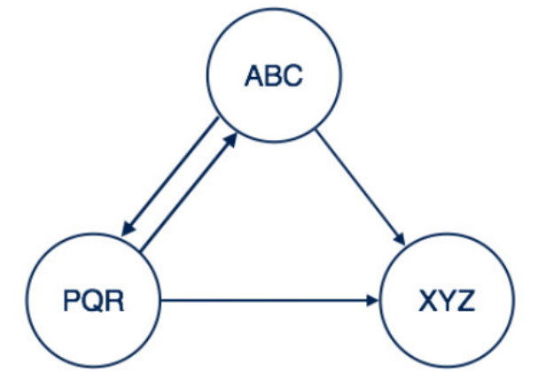
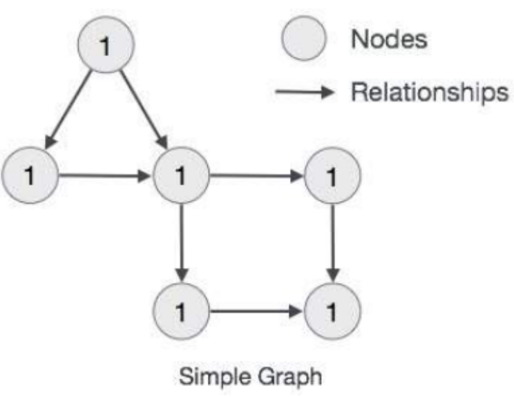

# Neo4j

Neo4j是一个NoSQL的图形数据库

# 第一部分 图和Neo4j

## 1.1 图论

### 1.1.1 图论起源 --科尼斯堡(Konigsberg)七桥问题


满足一笔画的图满足两个条件

- 图必须是一个完整图
- 有零或二个奇数点

### 1.1.2 图和节点

图是一组节点和连接这些节点关系组成。**图形数据存储在节点和关系所在的属性上**。**属性是键值对表示的数据**。

在图形理论中使用圆表示一个节点，并且可以向里面添加键值对形式的数据。


### 1.1.3 节点关系表达

#### 简单关系表达


此处两个节点之间创建关系名称“跟随”。意味着Profile1跟随Profile2。

#### 复杂关系表达



这里节点用关系连接。关系是单向或双向的。

- 从ABC和XYZ的关系是单向关系。
- 从ABC到PQR的关系是双向关系。

### 1.1.4 属性图模型规则



- 图表示节点，关系和属性中的数据

- 节点和关系都包含属性

- 关系连接节点

- 属性是键值对

- 节点用源泉表示，关系用方向键表示

- 关系具有方向：单向和双向

- 每个关系包含 “开始节点”或“从节点” 和 “到节点”或“结束节点”

  

## 1.2 知识图谱和图库

### 1.2.1 知识图谱

一种基于图的数据结构，由节点（Node）和边（Edge）组成。其中节点即实体，由一个全局唯一的ID标示，边就是厝用于连接两个节点。通俗地讲。知识图谱就是把所有不同种类地信息（Heterogeneous Information）连接在一起而得到的一个关系网络。知识图谱提供了从“关系”的角度去分析问题的能力。

### 1.2.2 图数据库

图数据库（Graph database）指的是以图形数据结构的形式来存储和查询数据的数据库。

知识图谱中，知识的组织形式采用的就是图结构，所以非常适合用图库进行存储。

### 1.2.3 图形数据库优势

优势总结

- 性能上，对长程关系的查询速度快
- 擅于发现隐藏的关系，例如通过判断图上两点之间有没有走的同的路径，就可以发现事物之间的关联

## 1.3 Neo4j基础

### 1.3.1 什么是Neo4j

Neo4j是一个开源的，无schema的，基于java开发的图形数据库，它将结构化数据存储在图中而不是表中。它是一个嵌入式的，基于磁盘的、具备完全的事务特性的Java持久化引擎，程序数据是在一个面向对象的，灵活的网络结构下，而不是严格、静态的表中，但是可以享受具备完全的事务特性、企业级和数据库的所有好处。

https://db-engines.com/en/ranking

### 1.3.2 Neo4j模块构建

#### Neo4j主要构建块

- 节点
- 属性
- 关系
- 标签
- 数据浏览器

#### 节点

节点是图标的基本单位。它包含具有键值对的属性

#### 属性

属性是用来描述图节点和关系的键值对

key=值

其中key是一个字符串

值可以通过使用任何Neo4j数据类型来表示

#### 关系

关系是图形数据库的另一个主要构建。它连接两个节点，如下：


这里Emp和Dept是两个不同的节点。“WORKS_FOR”是Emp和Dept节点之间的关系。因为它表示从Empt到Dept的箭头标记，每个关系包含一个起始节点和一个结束节点。

向节点一样，关系也可以包含属性作为键值对。

#### 标签

Label将一个公共名称与一组节点或关系想关联。**节点或关系可以包含一个或多个标签**。可以为现有节点或关系创建新标签。可以从现有节点或关系中删除现有标签。

注：Neo4j将数据存储在节点或关系的属性中。

### 1.3.3 Neo4j的主要应用场景

社交媒体和社交网络

推荐阴影和产品推荐系统

身份和访问管理

金融反欺诈多维关联分析场景

### 1.3.4 Neo4j环境搭建

#### Neo4j环境Linux下搭建

1.上传安装包或下载安装包

wget https://neo4j.com/artifact.php?name=neo4j-community-3.5.17-unix.tar.gz

2.解压

tar -xvf neo4j-community-3.5.17.tar

3.修改配置文件 neo4j.conf

主要是修改    允许远程访问的地址    把对应的注释打开即可

dbms.connectors.default_listen_address=0.0.0.0

4.开放对应访问端口 7474和7687

```
firewall-cmd --zone=public --add-port=7474/tcp --permanent 
firewall-cmd --zone=public --add-port=7687/tcp --permanent 
systemctl reload firewalld
```

5.启动

./bin/neo4j start

6.使用浏览器，访问服务器上的neo4j

http://ip:7474

默认的账号是neo4j 密码 neo4j，这里第一次登录的话需要修改密码。


### 1.3.5 Neo4j数据浏览器 

#### 数据浏览器访问

http://ip:7474


Neo4j数据浏览器用于执行CQL命令并查看输出

create(cc:CreditCard)

match(cc:CreditCard) return cc


# 第二部分 Neo4j CQL

## 2.1 CQL简介

CQL代表Cypher查询语言。像关系型数据库具有查询语言SQL，Neo4j使CQL作为查询语言。

Neo4j CQL

- Neo4j图形数据库的查询语言
- 一种声明性模式匹配查询语言
- 遵循SQL语法
- 语法简单人性化，可读格式

常用Neo4j CQL命令/条款

| CQL命令/条      | 作用                         |
| --------------- | ---------------------------- |
| CREATE创建      | 创建节点，关系和属性         |
| match匹配       | 检索有挂节点，关系和属性数据 |
| return返回      | 返回查询结果                 |
| where条件       | 提供条件过滤检索match数据    |
| delete删除      | 删除节点或关系               |
| remove移除      | 删除节点或关系的属性         |
| set 设置        | 添加或更新标签               |
| order by        | 对结果排序                   |
| skip limit 分页 | 分页                         |
| distinct 排重   | 排重                         |


## 2.2 CREATE

```
CREATE (
  <node-name>:<label-name>   
  [{
     <property1-name>:<property1-Value>
     ........
     <propertyn-name>:<propertyn-Value>   
   }]
)
```

语法说明：

| 语法元素                                 | 描述                                             |
| ---------------------------------------- | ------------------------------------------------ |
| < node-name >                            | 将要创建的节点名称。                             |
| < label-name >                           | 一个节点标签名称                                 |
| < property1-name>...< propertyn- name>   | 属性是键值对。  定义将分配给创建节点的属性的名称 |
| < property1-value>...< propertyn- value> | 属性是键值对。  定义将分配给创建节点的属性的值   |

举例：

```
CREATE (person:Person)
```

```
CREATE (person:Person {cid:1,name:"范闲",age:24,gender:0,character:"A",money:1000});
CREATE (person:Person {cid:2,name:"林婉儿",age:20,gender:1,character:"B",money:800});
CREATE (person:Person {cid:3,name:"庆帝",age:49,gender:0,character:"A",money:8900});
```


## 2.3 MATCH RETURN 命令语法

```
MATCH (
  <node-name>:<label-name> 
  )
RETURN
  <node-name>.<property1-name>,
  ...
  <node-name>.<propertyn-name>
```

| 语法元素                       | 描述                         |
| ------------------------------ | ---------------------------- |
| < node-name>                   | 它是我们将要创建的节点名称。 |
| < label-name>                  | 它是一个节点标签名称         |
| < node-name>.< propertyn-name> | 返回节点的属性值             |

举例：

```
MATCH (person:Person) return  person
MATCH (person:Person) return person.name,person.age
```


## 2.4 关系创建

创建关系必须指明方向

- 使用现有节点创建没有属性的关系

  ```
  MATCH (<node1-name>:<node1-label-name>),(<node2-name>:<node2-label-name>)
  CREATE  
  (<node1-name>)-[<relationship-name>:<relationship-label-name>]->(<node2- name>)
  RETURN 相应的内容
  ```

  语法说明：

  | 语法元素                   | 描述                                    |
  | -------------------------- | --------------------------------------- |
  | MATCH,CREATE,RETURN        | 他们是Neo4J CQL关键字。                 |
  | < noode1-name>             | 它用于创建关系的“From Node”的名称       |
  | < node1-label-name>        | 它用于创建关系的“From Node”的标签名称。 |
  | < node2-name>              | 它用于创建关系的“To Node”的名称。       |
  | < node2-label-name>        | 它用于创建关系的“To Node”的标签名称。   |
  | < relationship-name>       | 这是一个关系的名称。                    |
  | < relationship-label-name> | 它是一个关系的标签名称。                |

  ```
创建关系
  match(person1:Person {name:"范闲"}),(person2:Person{name:"林婉儿"}) 
  create(person1)-[r:Couple]->(person2)
  查询关系
  match p=(p1:Person{name:"范闲"})-[r:Couple]->(:Person) return p
  
  match (p1:Person{name:"范闲"})-[r:Couple]-(p2:Person) return p1,p2
  match (p1:Person{name:"范闲"})-[r:Couple]-(p2:Person) return r
  ```
  
- 使用现有节点创建有属性的关系

  ```
  MATCH (<node1-label-name>:<node1-name>),(<node2-label-name>:<node2-name>) 
  CREATE  
  (<node1-label-name>)-[<relationship-label-name>:<relationship-name> {<define-properties-list>}]->(<node2-label-name>)
  RETURN <relationship-label-name>

  其中< define-properties-list>是分配给新创建关系的属性（名称- 值对）的列表。 
  {
    <property1-name>:<property1-value>,   
    <property2-name>:<property2-value>,
    ...
    <propertyn-name>:<propertyn-value> 
   }
  ```
  
  ```
  match(person1:Person {name:"范闲"}),(person2:Person{name:"林婉儿"}) 
  create(person1)-[r:Couple{mary_date:"12/12/2014",price:55000}]->(person2) 
  return r
  ```
  
  


- 使用新节点创建没有属性的关系

  ```
  CREATE  
    (<node1-label-name>:<node1-name>)
    -[<relationship-label-name>:<relationship-name>]->
    (<node1-label-name>:<node1-name>)
  ```

  ```
  create(person1:Person {cid:4,name:"长公主",age:49,gender:1,character:"A",money:5000}) 
  -[r:Friend]->
  (person2:Person {cid:7,name:"九品射手燕小乙",age:48,gender:0,character:"B",money:1000})
  
  match allp = (:Person) return allp
  ```

  

- 使用新节点创建有属性的关系

  ```
  CREATE  
  (<node1-label-name>:<node1-name>{<define-properties-list>})
  -[<relationship-label-name>:<relationship-name>{<define-properties-list>}]->
  (<node1-label-name>:<node1-name>{<define-properties-list>})
  ```
  
  ```
  create (person1:Person {cid:9,name:"靖王世子",age:23,gender:0,character:"A",money:3000})
  -[r:Friend {date:"11-02-2000"}]->
  (person2:Person {cid:8,name:"二皇子",age:24,gender:0,character:"B",money:6000})
    
  match p = (:Person {name:"靖王世子"})-[r:Friend]-(:Person) return r.date
  ```
  
    


关系和节点的属性可以使用的类型

| CQL数据类型 | 作用                              |
| ----------- | --------------------------------- |
| boolean     | 它用于表示布尔文字：true, false。 |
| byte        | 它用来表示8位整数。               |
| short       | 它用于表示16位整数。              |
| int         | 它用于表示32位整数。              |
| long        | 它用于表示64位整数。              |
| float       | 浮点数用于表示32位浮点数。        |
| double      | Double用于表示64位浮点数。        |
| char        | Char用于表示16位字符。            |
| String      | 字符串用于表示字符串。            |


## 2.5 CREATE 创建多个标签

```
CREATE (<node-name>:<label-name1>:<label-name2>.....:<label-namen>)
如:
CREATE (person:Person:Beauty:Picture {cid:20,name:"小美女"})

match(p:Person{cid:20}) return p
match(p:Picture{cid:20}) return p
```


## 2.6 WHERE 子句

```
简单的WHERE子句
	WHERE <condition> 
复杂的WHERE子句
	WHERE <condition> <boolean-operator> <condition>
```

```
match(p:Person) where p.money>1000 return p

MATCH (person:Person) WHERE person.name = '范闲' OR person.name = '靖王世子' RETURN person
```

比较运算符

| 布尔运算符 | 描述 |
| ---------- | ---- |
| AND        | 与   |
| OR         | 或   |
| NOT        | 非   |


## 2.7 DELETE 子句 和 REMOVE 子句

### DELETE 子句

- 删除节点

- 删除节点及相关节点和关系

  ```
  删除关系
  match p = (:Person {name:"林婉儿"})-[r:Couple]-(:Person) delete r
  删除节点
  match(p:Person) where p.cid=2 delete p
  ```

### REMOVE 子句

- 删除节点或关系的标签

- 删除节点或关系的属性

  ```
  删除节点属性
  match(p:Person) where p.cid=20 remove p.name
  删除关系属性
  match(:Person {name:"靖王世子"})-[r:Friend]-(:Person) remove r.date
  ```

  

## 2.8 SET子句

- 向现有节点或关系添加新属性
- 更新属性值

```
match(p:Person) where p.cid=20 set p.name="小美女",p.age=25,p.salary=20000
```


## 2.9 ORDER BY 子句

“ORDER BY”子句，对MATCH查询返回的结果进行排序。 我们可以按升序或降序对行进行排序。
默认情况下，它按升序对行进行排序。 如果我们要按降序对它们进行排序，我们需要使用DESC子句。

```
match(p:Person) return ID(p),p.name,p.age order by p.age desc
```


## 2.10 SKIP 和 Limit

Neo4j CQL已提供“SKIP”子句来过滤或限制查询返回的行数。 它修整了CQL查询结果集顶部的结果。

Neo4j CQL已提供“LIMIT”子句来过滤或限制查询返回的行数。 它修剪CQL查询结果集底部的结果。

```
match(p:Person) return ID(p),p.name,p.age order by p.age desc skip 4 limit 2
```


## 2.11 DISTINCT 排重

这个函数的用法就像SQL中的distinct关键字，返回的是所有不同值。

```
match(p:Person) return distinct(p.character)
```


# 第三部分 Neo4j CQL高级

## 3.1 CQL函数

### 3.1.1 字符串函数

| 功能      | 描述                       |
| --------- | -------------------------- |
| upper     | 将所有字母更改为大写字母。 |
| lower     | 将所有字母改为小写字母。   |
| substring | 获取给定String的子字符串。 |
| replace   | 替换一个字符串的子字符串。 |

```
match(p:Person) return lower(p.character),p.name

match(p:Person) return lower(p.character),p.name,substring(p.name,2),replace(p.name,"子","zi")
```


### 3.1.2 聚合函数

| 聚集功能 | 描述                                  |
| -------- | ------------------------------------- |
| count    | 返回match命令返回的行数               |
| max      | 从MATCH命令返回的一组行返回最大值。   |
| min      | 返回由MATCH命令返回的一组行的最小值。 |
| sum      | 返回由MATCH命令返回的所有行的求和值。 |
| avg      | 返回由MATCH命令返回的所有行的平均值。 |

```
MATCH (p:Person) RETURN MAX(p.money),MIN(p.money),AVG(p.money),SUM(p.money),COUNT(1)
```


### 3.1.3 关系函数

| 功能      | 描述               |
| --------- | ------------------ |
| STARTNODE | 得到关系的开始节点 |
| ENDNODE   | 得到关系的结束节点 |
| ID        | 得到关系的ID       |
| TYPE      | 得到关系的TYPE     |

```
match p = (:Person {name:"林婉儿"})-[r:Couple]-(:Person) 
RETURN STARTNODE(r),ENDNODE(r),ID(r),TYPE(r)
```


### 3.1.4 `shortestpath`函数返回最短的path

```
MATCH p=shortestPath((node1)-[*]-(node2)) 
return length(p),nodes(p)
```

求出关系中最短的关系 

[*] 深度运算符

```
MATCH p=shortestPath((person:Person {name:"王启年"})-[*]-(person2:Person {name:"九品射手燕小乙"}) ) RETURN length(p), nodes(p)

指定深度范围
MATCH p=shortestPath((person:Person {name:"王启年"})-[*1..2]-(person2:Person {name:"九品射手燕小乙"}) ) RETURN length(p), nodes(p)

MATCH p=((person:Person {name:"王启年"})-[*]-(person2:Person {name:"九品射手燕小乙"}) ) RETURN length(p), nodes(p)
```


## 3.2 CQL多深度关系节点

### 3.2.1 使用with关键字

查询三层关系如下：with可以将前面查询结果作为后面的查询条件

```
match (na:Person)-[re]->(nb:Person) where na.name="范闲"  WITH na,re,nb match (nb:Person)- [re2]->(nc:Person) return na,re,nb,re2,nc

match (na:Person)-[re]->(nb:Person) where na.name="林婉儿"  WITH na,re,nb match (nb:Person)- [re2]->(nc:Person) return na,re,nb,re2,nc

match (na:Person)-[re]-(nb:Person) where na.name="林婉儿"  WITH na,re,nb match (nb:Person)- [re2]->(nc:Person) return na,re,nb,re2,nc

match (na:Person)-[re]-(nb:Person) where na.name="林婉儿"  WITH na,re,nb match (nb:Person)- [re2:Friends]->(nc:Person) return na,re,nb,re2,nc
```

### 3.2.2 直接拼接关系节点查询

```
match (na:Person{name:"范闲"})-[re]->(nb:Person)-[re2]->(nc:Person) return na,re,nb,re2,nc

为了方便，可以将查询结构赋给变量，然后返回
match data=(na:Person{name:"范闲"})-[re]->(nb:Person)-[re2]->(nc:Person) return data
```


### 3.2.3 使用深度运算符

实现多深度关系节点查询时，上面的方式比较繁琐

可变数量的关系->节点可以使用-[:TYPE*minHops..maxHops]-

```
match data=(na:Person{name:"范闲"})-[*1..2]-(nb:Person) return data
```


## 3.3 事务

为了保证数据的完整性和良好的事务行为，Neo4j也支持ACID.

注意：

```
1.所有对Neo4j数据库的数据蟹盖操作都必须封装在事务里。
2.默认的isolation level是READ_COMMITTED。
3.死锁保护已经内置到核心事务管理。（Neo4j会在死锁发生前检测死锁并抛出异常。在异常抛出之前，事务会被标志为回滚。当事务结束后，事务会释放它所持有的锁，该事务的锁所引起的死锁也就解除，其他事务可以继续执行。当用户需要时，抛出异常的事务可以尝试重新执行）
4.除特别说明，Neo4j的API操作都是线程安全的，Neo4j数据库的操作也就没有必要使用外部的同步方法。
```


## 3.4 索引

### 3.4.1 简介

Neo4j CQL支持节点或关系属性上的索引，以提高应用程序的性能。

可以为具有相同标签名称的属性上创建索引。

可以在MATCH或WHERE等运算符上使用这些索引列来改进CQL 的执行。

### 3.4.2 创建单一索引

```
create INDEX ON:Label(property)
如：
create index on:Person(name)
```

### 3.4.3 创建复合索引

```
create index on:Person(age,gender)
```

### 3.4.4 全文模式索引

全文索引将标记索引字符串值，因此它可以匹配字符串中任何位置的术语。索引字符串如何被标记化并分解为属于，取决于配置全文模式索引的分析器。索引是通过属性来创建，便于快速查找节点或者关系。

创建和配置全文模式索引

使用db.index.fulltext.createNodeIndex和db.index.fulltext.createRelationshipIndex创建全文模式索引。在创建索引时，每个索引必须指定一个唯一的名称，用于在查询或删除索引时引用相关的特定索引。然后，全文模式索引分别应用于标签列表或关系型列表，分别用于节点和关系索引，然后应用于属性名称列表。

```
call db.index.fulltext.createNodeIndex("索引名",[Label,Label],[属性,属性])

call db.index.fulltext.createNodeIndex("nameAndDescription",["Person"],["name", "description"])
```

```
call db.index.fulltext.queryNodes("nameAndDescription", "范闲") YIELD node, score RETURN node.name, node.description, score
```


### 3.4.5 查看和删除索引

```
call db.indexes 或者 :scheme

drop index on:Person(name)
```


## 3.5 约束

### 3.5.1 唯一性约束

**作用**

- 避免重复记录
- 强制执行数据完整性规则

**创建唯一性约束**

```
CREATE CONSTRAINT ON (变量:<label_name>) ASSERT 变量.<property_name> IS UNIQUE
实例：
CREATE CONSTRAINT ON (person:Person) ASSERT person.name IS UNIQUE
```


**删除唯一性索引**

```
DROP CONSTRAINT on (person:Person) ASSERT person.name IS UNIQUE
```

### 3.5.2 属性存在约束（企业版中可用）

```
CREATE CONSTRAINT ON (p:Person) ASSERT exists(p.name)
```

### 3.5.3 查看约束

```
call db.constraints
:schema
```


# 第四部分 Neo4j之Admin管理员操作

社区版只支持冷备份

```
删除全部数据
match(n) match(n)-[r]-() delete n,r
```

## 4.1 Neo4j-数据库备份和恢复

在对Neo4j数据进行备份、还原、迁移的操作时，首先要关闭neo4j

```
./bin/neo4j stop
```

数据备份到文件

```
./bin/neo4j-admin dump --database=graph.db --to=/root/qyn.dump
```

还原、迁移之前，关闭neo4j服务。操作同上

```
./bin.neo4j-admin load --from=/root/qyn.dump --database=graph.db --force
```


重启服务

```
./bin/neo4j  start
```

注意，运行数据备份可能会警告

WARNING: Max 1024 open files allowed, minimum of 40000 recommended. See the Neo4j manual.

1.编辑这个文件

vi /etc/security/limits.conf

在文件最后加入下面这段，修改最大打开文件限制

```
*               soft     nofile         65535 
*               hard     nofile         65535
```

2.重启Linux服务器

再次执行上面的步骤，警告就没有了

## 4.2 调优思路

### 4.2.1 增加啊服务器内存和调整neo4j配置文件

```
# java heap初始值
dbms.memory.heap.initial_size=1g
#java heap最大值，一般不要超过可用物理内存的80%
dbms.memory.heap.max_size=16g
# pagecache 大小，官方建议为：(总内存-dbms.memory.heap.max_size)/2
dbms.memory.pagecache.size=2g
```

### 4.2.2 neo4j刚启动数据是冷的 需要预热

```
MATCH (n)
OPTIONAL MATCH (n)-[r]->()
RETURN count(n.name) + count(r);
```


### 4.2.3 查看执行计划 进行索引优化

Cypher查询计划程序将每个查询转换为执行计划。执行计划告诉Neo4j在执行查询时要执行哪些操作。

对执行计划的生成，Neo4j使用的都是基于成本的优化器（Cost Based Optimizer，CBO），用于制定精确的执行过程。可以采用如下两种不同的方式了解其北部的工作机制：

**EXPLAIN**：是解释机制，加入该关键字的Cypher语句可以预览执行过程，但并不实际执行，所以也不会产生任何后果。

**PROFILE**：则是画像机制，查询中使用该关键字，不仅能够看到执行计划的详细内容，也可以看到查询的执行结果。

> 关注指标：
>
> estimated rows：需要被扫描行数的预估值
>
> dbhints：实际运行结果的命中绩效
>
> 两个值越小越好


#### 使用索引个不适用索引对比

name创建索引 `create index on:Person(name)`


`profile match(p:Person) where p.name="范闲" return p`


# 第五部分 Neo4j程序访问

## 5.1 Neo4j数据库访问

### 5.1.1 Neo4j访问的两种方式

- 嵌入式数据库
- 服务器模式（通过REST的访问）

它是由应用程序的性质（neo4j是独立服务器，还是和程序在一起），性能，监控和数据安全性来决定架构选择。

### 5.1.2 An embedded database（嵌入式数据库）

嵌入式Neo4j数据库是性能的最佳选择。通过指定数据存储的路径以编程方式访问嵌入式数据库。

选择的原因：

- 使用java作为项目的编程语言
- 应用程序是独立的
- 程序追求很高的性能

### 5.1.3 Neo4j Server（服务器模式）

Neo4j Server是相互操作性，安全性和监控的最佳选择。实际上，REST接口允许所有现代平台和编程语言与它进行相互操作。此外，作为独立应用程序，它比嵌入式配置更安全（客户端中潜在的故障不会影响服务器），并且更易于监控。如果选择这种模式，应用程序将充当Neo4j服务器的客户端。要连接到Neo4j服务器，可以使用任何编程语言的REST访问数据库。

## 5.2 Java客户端操作Neo4j

### 5.2.1 嵌入式模式

https://gitee.com/turboYuu/mongo-db-4.3/tree/master/lab/embedded_neo4j_demo

```xml
<dependency>
    <groupId>org.neo4j</groupId>
    <artifactId>neo4j</artifactId>
    <version>3.5.5</version>
</dependency>
```

```java
package com.turbo;

import org.neo4j.graphdb.GraphDatabaseService;
import org.neo4j.graphdb.Label;
import org.neo4j.graphdb.Node;
import org.neo4j.graphdb.Transaction;
import org.neo4j.graphdb.factory.GraphDatabaseFactory;

import java.io.File;

public class EmbeddedNeo4jAdd {
    private static final File databaseDirectory = new File("target/graph.db");
    public static void main(String[] args) {
        // 创建数据库服务对象
        GraphDatabaseService graphDatabaseService = new GraphDatabaseFactory().
        	newEmbeddedDatabase(databaseDirectory);
        System.out.println("database load!");
        // 获取事务 开启事务
        Transaction tx = graphDatabaseService.beginTx();
        Node n1 = graphDatabaseService.createNode();
        n1.setProperty("name","张三");
        n1.setProperty("character","A");
        n1.setProperty("money",50000);
        n1.addLabel(new Label() {
            public String name() {
                return "Person";
            }
        });
        
        //定义CQL
        String cql = "create(p:Person {name:'李四',character:'B',money:45000})";
        graphDatabaseService.execute(cql);
        tx.success();
        tx.close();
        System.out.println("Database shutdown");
        graphDatabaseService.shutdown();
    }
}

```

```java
package com.turbo;

import org.neo4j.graphdb.*;
import org.neo4j.graphdb.factory.GraphDatabaseFactory;

import java.io.File;
import java.util.HashMap;
import java.util.Map;

public class EmbeddedNeo4jQueryAll {
    private static final File databaseDirectory = new File("target/graph.db");
    public static void main(String[] args) {
        // 创建数据库服务对象
        GraphDatabaseService graphDatabaseService = new GraphDatabaseFactory().
        	newEmbeddedDatabase(databaseDirectory);
        System.out.println("database load query!");

        String cql = "match(p:Person) where p.money < $money return p";
        Map<String,Object> parameters = new HashMap<String, Object>();
        parameters.put("money",60000);
        // 获取事务 开启事务
        Transaction tx = graphDatabaseService.beginTx();
        Result result = graphDatabaseService.execute(cql, parameters);
        while (result.hasNext()){
            Map<String, Object> row = result.next();
            System.out.println(row);
            for (String key:result.columns()){
                Node nd = (Node) row.get(key);
                System.out.printf("%s=%s:%s%n",key,nd.getProperty("name"),nd.getProperty("money"));
            }
        }
        tx.success();
        tx.close();
        System.out.println("Database shutdown");
        graphDatabaseService.shutdown();
    }
}

```


### 5.2.2 服务器模式

https://gitee.com/turboYuu/mongo-db-4.3/tree/master/lab/server_neo4j_demo

```xml
<dependency>
    <groupId>org.neo4j</groupId>
    <artifactId>neo4j-ogm-bolt-driver</artifactId>
    <version>3.2.10</version>
</dependency>
```

```java
package com.turbo;

import org.neo4j.driver.*;

import static org.neo4j.driver.Values.parameters;

public class Neo4jServerMain {
    public static void main(String[] args) {
        Driver driver = GraphDatabase.driver("bolt://192.168.31.139:7687",
                AuthTokens.basic("neo4j","123456"));
        //获取会话对象
        Session session = driver.session();
        String cql = "match(p:Person) where p.money > $money " +
                "return p.name as name,p.money as money " +
                "order by p.money ";
        Result result = session.run(cql, parameters("money", 2000));
        while (result.hasNext()){
            Record record = result.next();
            System.out.println(record.get("name").asString()+","+record.get("money").asDouble());
        }
        System.out.println(result);
        session.close();
        driver.close();

    }
}
```

```java
package com.turbo;

import org.neo4j.driver.*;

import static org.neo4j.driver.Values.parameters;

public class Neo4jServerMain2 {
    public static void main(String[] args) {
        Driver driver = GraphDatabase.driver("bolt://192.168.31.139:7687",
                AuthTokens.basic("neo4j","123456"));
        //获取会话对象
        Session session = driver.session();
        String cql = "match p=((person:Person{name:$startName})-[*1..3]-(person2:Person{name:$endName})) return p";
        Result result = session.run(cql, parameters("startName", "王启年","endName","九品射手燕小乙"));
        while (result.hasNext()){
            Record record = result.next();
            System.out.println(record.get("p"));
        }
        session.close();
        driver.close();
    }
}

```


## 5.3 SpringBoot整合Neo4j

### 1.导入jar

```xml
<?xml version="1.0" encoding="UTF-8"?>
<project xmlns="http://maven.apache.org/POM/4.0.0"
         xmlns:xsi="http://www.w3.org/2001/XMLSchema-instance"
         xsi:schemaLocation="http://maven.apache.org/POM/4.0.0 http://maven.apache.org/xsd/maven-4.0.0.xsd">
    <modelVersion>4.0.0</modelVersion>

    <groupId>com.turbo</groupId>
    <artifactId>springboot_neo4j_demo</artifactId>
    <version>1.0-SNAPSHOT</version>

    <parent>
        <groupId>org.springframework.boot</groupId>
        <artifactId>spring-boot-starter-parent</artifactId>
        <version>2.2.9.RELEASE</version>
    </parent>

    <properties>
        <project.build.sourceEncoding>UTF-8</project.build.sourceEncoding>
        <project.reporting.outputEncoding>UTF- 8</project.reporting.outputEncoding>
        <java.version>1.11</java.version>
    </properties>

    <dependencies>
        <dependency>
            <groupId>org.springframework.boot</groupId>
            <artifactId>spring-boot-starter-data-neo4j</artifactId>
        </dependency>
        <dependency>
            <groupId>org.neo4j</groupId>
            <artifactId>neo4j-ogm-bolt-driver</artifactId>
        </dependency>
        <dependency>
            <groupId>org.projectlombok</groupId>
            <artifactId>lombok</artifactId>
        </dependency>
    </dependencies>

    <build>
        <plugins>
            <plugin>
                <groupId>org.springframework.boot</groupId>
                <artifactId>spring-boot-maven-plugin</artifactId>
            </plugin>
        </plugins>
    </build>

</project>
```

### 2.建立实体类

```java
package com.turbo.bean;

import lombok.Data;
import org.neo4j.ogm.annotation.*;

import java.util.Set;

@Data
@NodeEntity
public class Person {
    @Id
    @GeneratedValue
    private Long id;

    @Property("cid")
    private int pid;

    private String name;

    private String character;

    private double money;

    private int age;

    private String description;

    @Relationship(type = "Friends",direction = Relationship.INCOMING)
    private Set<Person> friendPerson;

    @Override
    public String toString() {
        return "Person{" +
                "id=" + id +
                ", pid=" + pid +
                ", name='" + name + '\'' +
                ", character='" + character + '\'' +
                ", money=" + money +
                ", age=" + age +
                ", description='" + description + '\'' +
                ", friendPerson=" + friendPerson +
                '}';
    }

    public Person() {
    }

    public Person(Long id, int pid, String name, String character, double money, int age, String description, Set<Person> friendPerson) {
        this.id = id;
        this.pid = pid;
        this.name = name;
        this.character = character;
        this.money = money;
        this.age = age;
        this.description = description;
        this.friendPerson = friendPerson;
    }
}

```


### 3.数据持久化类

```java
package com.turbo.repository;

import com.turbo.bean.Person;
import org.springframework.data.neo4j.annotation.Query;
import org.springframework.data.neo4j.repository.Neo4jRepository;
import org.springframework.data.repository.query.Param;
import org.springframework.stereotype.Repository;

import java.util.List;

@Repository
public interface PeronRepository extends Neo4jRepository<Person,Long> {

    /**
     * 查询money大于指定值的Person列表
     */
    //@Query("match(p:Person) where p.money>{0} return p ")
    @Query("match(p:Person) where p.money>{money} return p ")
    List<Person> personList(@Param("money") double money);

    /**
     * 查询最短路径
     */
    @Query("match p=shortestPath((person:Person{name:{startName}})-[*1..4]-(person2:Person{name:{endName}})) return p")
    List<Person> shortestPath(String startName,String endName);

    /**
     * 关系处理 前端 d3.js展示
     */

    /**
     * 多深度节点
     */
    @Query("match p=(person:Person{name:{name}})-[*1..2]-(nb:Person) return p")
    List<Person> personListDeep(String name);

}

```


### 4.配置文件 application.yml

```yaml
spring:
  data:
    neo4j:
      username: neo4j
      password: 123456
      uri: bolt://192.168.31.139:7687
      #
      #uri: http://192.168.211.133:7474      
      #uri: file:///target/graph.db
```


### 5.编写服务类

```java
package com.turbo.service;

import com.turbo.bean.Person;
import com.turbo.repository.PeronRepository;
import org.springframework.beans.factory.annotation.Autowired;
import org.springframework.stereotype.Service;
import java.util.ArrayList;
import java.util.List;

@Service("personService")
public class Neo4jPersonService {

    @Autowired
    private PeronRepository peronRepository;

    public List<Person> getAll(){
        List<Person> datas = new ArrayList<>();
        peronRepository.findAll().forEach(person ->datas.add(person));
        return datas;
    }

    public Person save(Person person){
        return peronRepository.save(person);
    }

    public List<Person> personList(double money){
        return peronRepository.personList(money);

    }

    public List<Person> shortestPath(String startName,String endName){
        return peronRepository.shortestPath(startName,endName);
    }

    public List<Person> personListDeep(String name){
        return peronRepository.personListDeep(name);
    }

}
```


### 6.编写测试类

```java
package com.turbo;

import com.turbo.bean.Person;
import com.turbo.service.Neo4jPersonService;
import org.springframework.boot.SpringApplication;
import org.springframework.boot.autoconfigure.SpringBootApplication;
import org.springframework.context.ApplicationContext;

import java.lang.invoke.VarHandle;
import java.util.List;

@SpringBootApplication
public class Neo4jBootAppMain {

    public static void main(String[] args) {
        ApplicationContext applicationContext = SpringApplication.run(Neo4jBootAppMain.class,args);
        Neo4jPersonService personService = applicationContext.getBean("personService", Neo4jPersonService.class);

        Person person = new Person();
        person.setName("testboot");
        person.setMoney(123455.33);
        person.setCharacter("A");
        person.setAge(24);
        Person person1 = personService.save(person);
        System.out.println(person1);
        System.out.println(personService.getAll());

        List<Person> personList = personService.personList(1000);
        System.out.println(personList);


        List<Person> personList1 = personService.shortestPath("王启年", "九品射手燕小乙");
        System.out.println(personList1);

        List<Person> personList2 = personService.personListDeep("范闲");
        for(Person p:personList2){
            System.out.println(p);
        }

    }
}

```


# 扩展

图形属性前端展示，d3.js https://d3js.org/


