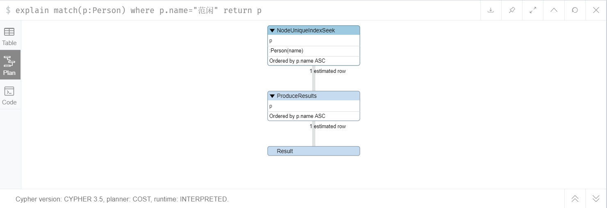

# Neo4j

Neo4j是一个NoSQL的图形数据库

# 第一部分 图和Neo4j

## 1.1 图论

### 1.1.1 图论起源 --科尼斯堡(Konigsberg)七桥问题

### 1.1.2 图和节点

### 1.1.3 节点关系表达

### 1.1.4 属性图模型规则

## 1.2 知识图谱和图库

### 1.2.1 知识图谱和图库

### 1.2.2 图数据库

### 1.2.3 图形数据库优势

## 1.3 Neo4j基础

### 1.3.1 什么是Neo4j

### 1.3.2 Neo4j模块构建

### 1.3.3 Neo4j的主要应用场景

### 1.3.4 Neo4j环境搭建

#### Neo4j环境Linux下搭建


### 1.3.5 Neo4j数据浏览器 


# 第二部分 Neo4j CQL

## 2.1 CQL简介


## 2.2 CREATE

```
CREATE (person:Person)
```

```
CREATE (person:Person {cid:1,name:"范闲",age:24,gender:0,character:"A",money:1000});
CREATE (person:Person {cid:2,name:"林婉儿",age:20,gender:1,character:"B",money:800});
CREATE (person:Person {cid:3,name:"庆帝",age:49,gender:0,character:"A",money:8900});
```


## 2.3 MATCH RETURN 命令语法

```
MATCH (person:Person) return  person
MATCH (person:Person) return person.name,person.age
```


## 2.4 关系创建

创建关系必须指明方向

- 使用现有节点创建没有属性的关系

  ```
  
  ```

  ```
  match(person1:Person {name:"范闲"}),(person2:Person{name:"林婉儿"}) 
  create(person1)-[r:Couple]->(person2)
  
  match p=(p1:Person{name:"范闲"})-[r:Couple]->(:Person) return p
  
  match (p1:Person{name:"范闲"})-[r:Couple]-(p2:Person) return p1,p2
  match (p1:Person{name:"范闲"})-[r:Couple]-(p2:Person) return r
  ```

- 使用现有节点创建有属性的关系

  ```
  match(person1:Person {name:"范闲"}),(person2:Person{name:"林婉儿"}) create(person1)-[r:Couple{mary_date:"12/12/2014",price:55000}]->(person2) return r
  
  
  ```

  


- 使用新节点创建没有属性的关系

  ```
  create(person1:Person {cid:4,name:"长公主",age:49,gender:1,character:"A",money:5000}) 
  -[r:Friend]->
  (person2:Person {cid:7,name:"九品射手燕小乙",age:48,gender:0,character:"B",money:1000})
  
  match allp = (:Person) return allp
  ```

  

- 使用新节点创建有属性的关系

  ```
  create (person1:Person {cid:9,name:"靖王世子",age:23,gender:0,character:"A",money:3000})
  -[r:Friend {date:"11-02-2000"}]->
  (person2:Person {cid:8,name:"二皇子",age:24,gender:0,character:"B",money:6000})
  
  match p = (:Person {name:"靖王世子"})-[r:Friend]-(:Person) return r.date
  ```

  


关系和节点的属性可以使用的类型

|      |      |      |
| ---- | ---- | ---- |
|      |      |      |
|      |      |      |
|      |      |      |
|      |      |      |
|      |      |      |
|      |      |      |
|      |      |      |
|      |      |      |
|      |      |      |


## 2.5 CREATE 创建多个标签

```

CREATE (person:Person:Beauty:Picture {cid:20,name:"小美女"})

match(p:Person{cid:20}) return p
match(p:Picture{cid:20}) return p
```


## 2.6 WHERE 子句

```
简单的WHERE子句
	WHERE <condition> 
复杂的WHERE子句
	WHERE <condition> <boolean-operator> <condition>
```

```
match(p:Person) where p.money>1000 return p

MATCH (person:Person) WHERE person.name = '范闲' OR person.name = '靖王世子' RETURN person
```


## 2.7 DELETE 子句 和 REMOVE 子句

### DELETE 子句

- 删除节点

- 删除节点及相关节点和关系

  ```
  删除关系
  match p = (:Person {name:"林婉儿"})-[r:Couple]-(:Person) delete r
  删除节点
  match(p:Person) where p.cid=2 delete p
  ```

### REMOVE 子句

- 删除节点或关系的标签

- 删除节点或关系的属性

  ```
  删除节点属性
  match(p:Person) where p.cid=20 remove p.name
  删除关系属性
  match(:Person {name:"靖王世子"})-[r:Friend]-(:Person) remove r.date
  ```

  

## 2.8 SET子句

- 向现有节点或关系添加新属性
- 更新属性值

```
match(p:Person) where p.cid=20 set p.name="小美女",p.age=25,p.salary=20000
```


## 2.9 ORDER BY 子句

```
match(p:Person) return ID(p),p.name,p.age order by p.age desc
```


## 2.10 SKIP 和 Limit

```
match(p:Person) return ID(p),p.name,p.age order by p.age desc skip 4 limit 2
```


## 2.11 DISTINCT 排重

```
match(p:Person) return distinct(p.character)
```


# 第三部分 Neo4j CQL高级

## 3.1 CQL函数

|      |      |
| ---- | ---- |
|      |      |
|      |      |
|      |      |
|      |      |

```

```


### 3.1.1 字符串函数

```
match(p:Person) return lower(p.character),p.name

match(p:Person) return lower(p.character),p.name,substring(p.name,2),replace(p.name,"子","zi")
```


### 3.1.2 聚合函数

```
MATCH (p:Person) RETURN MAX(p.money),MIN(p.money),AVG(p.money),SUM(p.money),COUNT(1)
```


### 3.1.3 关系函数

```
match p = (:Person {name:"林婉儿"})-[r:Couple]-(:Person) RETURN STARTNODE(r),ENDNODE(r),ID(r),TYPE(r)
```


### 3.1.4 shortestpath函数返回最短的path

求出关系中最短的关系 

[*] 深度运算符

```
MATCH p=shortestPath((person:Person {name:"王启年"})-[*]-(person2:Person {name:"九品射手燕小乙"}) ) RETURN length(p), nodes(p)

指定深度范围
MATCH p=shortestPath((person:Person {name:"王启年"})-[*1..2]-(person2:Person {name:"九品射手燕小乙"}) ) RETURN length(p), nodes(p)

MATCH p=((person:Person {name:"王启年"})-[*]-(person2:Person {name:"九品射手燕小乙"}) ) RETURN length(p), nodes(p)
```


## 3.2 CQL多深度关系节点

### 3.2.1 使用with关键字

```
match (na:Person)-[re]->(nb:Person) where na.name="范闲"  WITH na,re,nb match (nb:Person)- [re2]->(nc:Person) return na,re,nb,re2,nc

match (na:Person)-[re]->(nb:Person) where na.name="林婉儿"  WITH na,re,nb match (nb:Person)- [re2]->(nc:Person) return na,re,nb,re2,nc

match (na:Person)-[re]-(nb:Person) where na.name="林婉儿"  WITH na,re,nb match (nb:Person)- [re2]->(nc:Person) return na,re,nb,re2,nc

match (na:Person)-[re]-(nb:Person) where na.name="林婉儿"  WITH na,re,nb match (nb:Person)- [re2:Friends]->(nc:Person) return na,re,nb,re2,nc
```

### 3.2.2 直接拼接关系节点查询

```
match (na:Person{name:"范闲"})-[re]->(nb:Person)-[re2]->(nc:Person) return na,re,nb,re2,nc


```

### 3.2.3 使用深度运算符

```
match data=(na:Person{name:"范闲"})-[*1..2]-(nb:Person) return data
```


## 3.3 事务


```

```


## 3.4 索引

### 3.4.1 简介


### 3.4.2 创建单一索引

```
create index on:Person(name)
```


### 3.4.3 创建复合索引

```
create index on:Person(age,gender)
```


### 3.4.4 全文模式索引

```

call db.index.fulltext.createNodeIndex("nameAndDescription",["Person"],["name", "description"])
```

```
call db.index.fulltext.queryNodes("nameAndDescription", "范闲") YIELD node, score RETURN node.name, node.description, score
```


### 3.4.5 查看和删除索引

```
call db.indexes

drop index on:Person(name)
```


## 3.5 约束


# 第四部分 Neo4j之Admin管理员操作

社区版只支持冷备份

```
match(n) match(n)-[r]-() delete n,r
```


## 4.1 Neo4j-数据库备份和恢复

在对Neo4j数据进行备份、还原、迁移的操作时，首先要关闭neo4j

```
./bin/neo4j stop
```

数据备份到文件

```
./bin/neo4j-admin dump --database=graph.db --to=/root/qyn.dump
```

还原、迁移之前，关闭neo4j服务。操作同上

```
./bin.neo4j-admin load --from=/root/qyn.dump --database=graph.db --force
```


重启服务

```
./bin/neo4j  start
```

注意，运行数据备份可能会警告

WARNING: Max 1024 open files allowed, minimum of 40000 recommended. See the Neo4j manual.

1.编辑这个文件

vi /etc/security/limits.conf

在文件最后加入下面这段，修改最大打开文件限制

```
*               soft     nofile         65535 
*               hard     nofile         65535
```

2.重启Linux服务器

再次执行上面的步骤，警告就没有了

## 4.2 调优思路

### 4.2.1 增加啊服务器内存和调整neo4j配置文件

```

```


### 4.2.2 neo4j刚启动数据是冷的 需要预热

```
MATCH (n)
OPTIONAL MATCH (n)-[r]->()
RETURN count(n.name) + count(r);
```


### 4.2.3 查看执行计划 进行索引优化




#### 使用索引个不适用索引对比

name创建索引 `create index on:Person(name)`


`profile match(p:Person) where p.name="范闲" return p`


# 第五部分 Neo4j程序访问

## 5.1 Neo4j数据库访问

### 5.1.1 Neo4j访问的两种方式

- 嵌入式数据库
- 服务器模式（通过REST的访问）

### 5.1.2 An embedded database（嵌入式数据库）

### 5.1.3 Neo4j Server（服务器模式）

## 5.2 Java客户端操作Neo4j

### 5.2.1 嵌入式模式

### 5.2.2 服务器模式

## 5.3 SpringBoot整合Neo4j

### 1.导入jar

### 2.建立实体类

### 3.数据持久化类

### 4.配置文件 application.yml

### 5.编写服务类

### 6.编写测试类

d3.js https://d3js.org/


