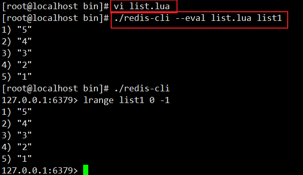
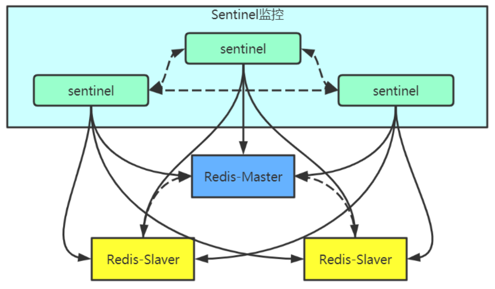

# 第一部分 Redis快速实战

## 1.1 缓存原理与设计

### 1.1.1 缓存基本思想

#### 1.1.1.1 缓存的使用场景

##### DB缓存，减轻DB服务器压力

##### 提高系统响应

### 1.2.1 缓存的读写模式

#### Cache Aside pattern(常用)

#### Read/Write Through Pattern 

#### Write Behind Caching Pattern

## 1.2 Redis简介和安装

### 1.2.1 Redis简介

### 1.2.2 Redis单机版安装和使用

使用5.0.5稳定版

#### Redis下载


#### Redis安装环境


#### Redis安装

1.安装c语言需要的GCC环境

```
yum install -y gcc-c++
yum install -y wget
```

2.下载并解压解压Redis源码压缩包

```
wget http://download.redis.io/releases/redis-5.0.5.tar.gz 
tar -zxf redis-5.0.5.tar.gz  
```

3.编译Redis源码，进入redis-5.0.5目录，执行编译命令

```
cd redis-5.0.5/src 
make 
```

4.安装Redis，需要通过PREFIX指定安装路径

```
mkdir /usr/redis -p
make install PREFIX=/usr/redis  
```

#### Redis 启动

##### 前端启动

- 启动命令：`redis-server`，直接运行`./bin/redis-server`将以前端模式启动

  ```
  ./bin/redis-server
  ```

- 关闭命令：`ctrl+c`

- 启动缺点：客户端关闭则redis-server程序结束，不推荐


##### 后端启动（守护进程启动）

1.拷贝redis-5.0.5/redis/redis.conf配置文件到Redis安装目录的bin目录

```
cp  redis.conf /usr/redis/bin/
```

2.修改redis.conf

```
# 将`daemonize`由`no`改为`yes`
daemonize yes

# 默认绑定的是回环地址，默认不能被其他机器访问 
# bind 127.0.0.1

# 是否开启保护模式，由yes该为no
protected-mode no  
```

3.启动服务

```
./redis-server redis.conf
```


##### 后端启动的关闭方式

```shell
./redis-cli shutdown
```

##### 命令说明


- `redis-server`：启动`redis`服务
- `redis-cli`：进入redis命令客户端
- `redis-benchmark`：性能测试的工具
- `redis-check-aof`：`aof`文件进行检查的工具
- `redis-check-dump`：`rdb`文件进行检查的工具
- `redis-sentinel`：启动哨兵监控服务

#### Redis命令行客户端

- 命令格式

  ```shell
  ./redis-cli -h 127.0.0.1 -p 6379
  ```

- 参数说明

  ```
  -h：redis服务器的ip地址 
  -p：redis实例的端口号
  ```

- 默认方式

  如果不指定主机和端口号也可以

  默认主机地址：127.0.0.1

  默认端口号：6379

  ```
  ./redis-cli
  ```


## 1.3 Redis客户端访问

### 1.3.1 java程序访问Redis

采用jedis API进行访问即可

https://gitee.com/turboYuu/redis5.1/tree/master/lab/jedis_demo

1.关闭防火墙

```
systemctl stop firewalld（默认）
systemctl disable firewalld.service（设置开启不启动）
```

2.新建maven项目后导入jedis包

pom.xml

```xml
<dependency>
    <groupId>redis.clients</groupId>
    <artifactId>jedis</artifactId>
    <version>2.9.0</version>
</dependency>
```

3.程序

```java
import org.junit.Test;
import redis.clients.jedis.Jedis;

public class TestRedis {

    @Test
    public void test(){
        Jedis jedis = new Jedis("192.168.1.135",6379);
        jedis.set("name","zhangsan");
        System.out.println(jedis.get("name"));

        jedis.lpush("list1","1","2","3","4","5");
        System.out.println(jedis.llen("list1"));
    }
}
```

### 1.3.2 Spring访问Redis

https://gitee.com/turboYuu/redis5.1/tree/master/lab/spring_redis

**1.新建Maven项目，引入Spring依赖**

```xml
<dependency>
    <groupId>org.springframework</groupId>
    <artifactId>spring-beans</artifactId>
    <version>5.2.5.RELEASE</version>
</dependency>
<dependency>
    <groupId>org.springframework</groupId>
    <artifactId>spring-core</artifactId>
    <version>5.2.5.RELEASE</version>
</dependency>
<dependency>
    <groupId>org.springframework</groupId>
    <artifactId>spring-context</artifactId>
    <version>5.2.5.RELEASE</version>
</dependency>
<dependency>
    <groupId>org.springframework</groupId>
    <artifactId>spring-test</artifactId>
    <version>5.2.5.RELEASE</version>
</dependency>
<dependency>
    <groupId>junit</groupId>
    <artifactId>junit</artifactId>
    <version>4.12</version>
    <scope>test</scope>
</dependency>

```

**2.添加redis依赖**

```
<dependency>
    <groupId>org.springframework.data</groupId>
    <artifactId>spring-data-redis</artifactId>
    <version>1.0.3.RELEASE</version>
</dependency>
```

**3.添加Spring配置文件**

```xml
<?xml version="1.0" encoding="UTF-8"?>
<beans xmlns="http://www.springframework.org/schema/beans"
       xmlns:xsi="http://www.w3.org/2001/XMLSchema-instance"
       xsi:schemaLocation="http://www.springframework.org/schema/beans http://www.springframework.org/schema/beans/spring-beans.xsd">

    <bean id="propertyConfigurer" class="org.springframework.beans.factory.config.PropertyPlaceholderConfigurer">
        <property name="locations">
            <list>
                <value>classpath:redis.properties</value>
            </list>
        </property>
    </bean>

    <!--redis config-->
    <bean id="jedisPoolConfig" class="redis.clients.jedis.JedisPoolConfig">
        <property name="maxActive" value="${redis.pool.maxActive}"/>
        <property name="maxIdle" value="${redis.pool.maxIdle}"/>
        <property name="maxWait" value="${redis.pool.maxWait}"/>
        <property name="testOnBorrow" value="${redis.pool.testOnBorrow}"/>
    </bean>

    <bean id="jedisConnectionFactory" class="org.springframework.data.redis.connection.jedis.JedisConnectionFactory">
        <property name="hostName" value="${redis.server}"/>
        <property name="port" value="${redis.port}"/>
        <property name="timeout" value="${redis.timeout}" />
        <property name="poolConfig" ref="jedisPoolConfig" />
    </bean>


    <bean id="redisTemplate" class="org.springframework.data.redis.core.RedisTemplate">
        <property name="connectionFactory" ref="jedisConnectionFactory"/>
        <property name="keySerializer">
            <bean class="org.springframework.data.redis.serializer.StringRedisSerializer"></bean>
        </property>
        <property name="valueSerializer">
            <bean class="org.springframework.data.redis.serializer.StringRedisSerializer"></bean>
        </property>
    </bean>

</beans>
```

**4.添加redis.properties**

```
redis.pool.maxActive=100
redis.pool.maxIdle=50
redis.pool.maxWait=1000
redis.pool.testOnBorrow=true

redis.timeout=50000
redis.server=192.168.1.135
redis.port=6379
```

5.编写测试用例

```java
import org.junit.Test;
import org.springframework.beans.factory.annotation.Autowired;
import org.springframework.data.redis.core.RedisTemplate;
import org.springframework.test.context.ContextConfiguration;
import org.springframework.test.context.junit4.AbstractJUnit4SpringContextTests;

@ContextConfiguration("classpath:redis.xml")
public class TestRedis extends AbstractJUnit4SpringContextTests {

    @Autowired
    RedisTemplate<String,String> redisTemplate;

    @Test
    public void testConn(){
        redisTemplate.opsForValue().set("name-s","lisi");
        System.out.println(redisTemplate.opsForValue().get("name-s"));
    }
}
```

### 1.3.3 SpringBoot访问Redis

https://gitee.com/turboYuu/redis5.1/tree/master/lab/springboot_redis

**1.新建springboot项目**

选择Spring Web依赖，添加redis依赖

```
<dependency>
    <groupId>org.springframework.boot</groupId>
    <artifactId>spring-boot-starter-data-redis</artifactId>
</dependency>
```

**2.添加配置文件application.yaml**

```yaml
spring:
  redis:
    host: 192.168.1.135
    port: 6379
    jedis:
      pool:
        min-idle: 0
        max-active: 80
        max-wait: 30000
        max-idle: 8
        timeout: 3000
```

**3.添加配置类RedisConfig**

```java
package com.turbo.sbr.cache;

import org.springframework.beans.factory.annotation.Autowired;
import org.springframework.context.annotation.Bean;
import org.springframework.context.annotation.Configuration;
import org.springframework.data.redis.connection.RedisConnectionFactory;
import org.springframework.data.redis.core.RedisTemplate;
import org.springframework.data.redis.serializer.StringRedisSerializer;

/**
 * 配置类
 */
@Configuration
public class RedisConfig {

    @Autowired
    RedisConnectionFactory factory;

    @Bean
    public RedisTemplate<String,Object> redisTemplate(){
        RedisTemplate<String,Object> redisTemplate = new RedisTemplate<>();
        redisTemplate.setKeySerializer(new StringRedisSerializer());
        redisTemplate.setValueSerializer(new StringRedisSerializer());
        redisTemplate.setHashKeySerializer(new StringRedisSerializer());
        redisTemplate.setHashValueSerializer(new StringRedisSerializer());
        redisTemplate.setConnectionFactory(factory);
        return redisTemplate;
    }
}
```

**4.添加RedisController**

```java
ackage com.turbo.sbr.controller;

import org.springframework.beans.factory.annotation.Autowired;
import org.springframework.data.redis.core.RedisTemplate;
import org.springframework.web.bind.annotation.GetMapping;
import org.springframework.web.bind.annotation.RequestMapping;
import org.springframework.web.bind.annotation.RequestParam;
import org.springframework.web.bind.annotation.RestController;
import java.util.concurrent.TimeUnit;

@RestController
@RequestMapping(value = "/redis")
public class RedisController {

    @Autowired
    RedisTemplate redisTemplate;

    @GetMapping("/put")
    public String put(@RequestParam(required = true) String key, 
    	@RequestParam(required = true) String value){
        redisTemplate.opsForValue().set(key,value, 20,TimeUnit.SECONDS);
        return "suc";
    }

    @GetMapping("/get")
    public String get(@RequestParam(required = true) String key){
        return (String) redisTemplate.opsForValue().get(key);
    }
}
```

**5.修改Application并运行**

```java
package com.turbo.sbr;

import org.springframework.boot.SpringApplication;
import org.springframework.boot.autoconfigure.SpringBootApplication;
import org.springframework.cache.annotation.EnableCaching;

@SpringBootApplication
@EnableCaching
public class SpringbootRedisApplication {

    public static void main(String[] args) {
        SpringApplication.run(SpringbootRedisApplication.class, args);
    }
}
```


## 1.4 Redis数据类型选择和应用场景

Redis是一个Key-Value的存储系统，使用ANSI C语言编写。

key的类型是字符串。

value的数据类型有：

- 常用的：string字符串类型、list列表类型、set集合类型、sortedset（zset）有序集合类型、hash类型。
- 不常用的：bitmap位图类型，geo地理位置类型。

Redis5.0新增一种：stream类型

注意：Redis中命令忽略大小写，key不忽略大小写。

### 1.4.1 Redis的key的设计


### 1.4.2 string字符串类型

Redis的string能表达3中值的类型：字符串、整数、浮点数100.01是个六位数的串

常见命令：

| 命令名称 |                      | 命令描述                                                     |
| -------- | -------------------- | ------------------------------------------------------------ |
| set      | set key value        | 赋值                                                         |
| get      | get key              |                                                              |
| getset   |                      |                                                              |
| setnx    | setnx key value      | 当key不存在时才用赋值<br/>set key value NX PX 3000 原子操作，px 设置毫秒数 |
| append   | append key value     |                                                              |
| strlen   | strlen key           |                                                              |
| incr     | incr key             |                                                              |
| incrby   | incrby key increment |                                                              |
| decr     | decr key             |                                                              |
| decrby   | decrby key decrement |                                                              |

应用场景：

1.key和命令是字符串

2.普通的赋值

3.incr用于乐观锁

incr：递增数字，可用于实现乐观锁watch(事务)

4.setnx用于分布式锁

当key不存在时采用赋值，可用于实现分布式锁


举例：

setnx:

```
127.0.0.1:6379> setnx name zhangf       #如果name不存在赋值      
(integer) 1
127.0.0.1:6379> setnx name zhaoyun      #再次赋值失败 
(integer) 0
127.0.0.1:6379> get name "zhangf"
```

set

```
127.0.0.1:6379> set age 18 NX PX 10000  #如果不存在赋值 有效期10秒
OK
127.0.0.1:6379> set age 20 NX           #赋值失败 
(nil)
127.0.0.1:6379> get age                 #age失效 
(nil)
127.0.0.1:6379> set age 30 NX PX 10000  #赋值成功
OK
127.0.0.1:6379> get age 
"30"
```

### 1.4.3 list列表类型

list列表类型可以存储有序，可重复的元素

获取头部或尾部附件的记录是极快的

list的元素个数最多为2^32-1个（40亿）

常见命令：

| 命令名称   | 命令格式 | 描述 |
| ---------- | -------- | ---- |
| lpush      |          |      |
| lpop       |          |      |
| rpush      |          |      |
| rpop       |          |      |
| lpushx     |          |      |
| rpushx     |          |      |
| blpop      |          |      |
| brpop      |          |      |
| llen       |          |      |
| lindex     |          |      |
| lrange     |          |      |
| lrem       |          |      |
| lset       |          |      |
| ltrim      |          |      |
| rpoplpush  |          |      |
| brpoplpush |          |      |
| linsert    |          |      |

应用场景：

1.作为栈或队列使用

列表有序可以作为栈和队列使用

2.可用于各种列表


举例：

```
127.0.0.1:6379> lpush list:1 1 2 3 4 5 3
(integer) 6
127.0.0.1:6379> lrange list:1 0 -1
1) "3"
2) "5"
3) "4"
4) "3"
5) "2"
6) "1"
127.0.0.1:6379> lpop list:1
"3"
127.0.0.1:6379> rpop list:1
"1"
127.0.0.1:6379> lindex list:1 1
"4"
127.0.0.1:6379> lrange list:1 0 -1
1) "5"
2) "4"
3) "3"
4) "2"
127.0.0.1:6379> rpoplpush list:1 list:2
"2"
127.0.0.1:6379> lrange list:1 0 -1
1) "5"
2) "4"
3) "3"
127.0.0.1:6379> 

```

### 1.4.4 set集合类型

Set：无需、唯一元素

集合中最大的成员数为2^32-1

常见操作列表如下：

| 命令名称    | 命令格式 | 描述 |
| ----------- | -------- | ---- |
| sadd        |          |      |
| srem        |          |      |
| smembers    |          |      |
| spop        |          |      |
| srandmember |          |      |
| scard       |          |      |
| sismember   |          |      |
| sinter      |          |      |
| sdiff       |          |      |
| sunion      |          |      |

应用场景：

适用于不能重复的且不需要顺序的数据结构


举例：

```
127.0.0.1:6379> sadd set:1 a b c d a
(integer) 4
127.0.0.1:6379> smembers set:1
1) "c"
2) "a"
3) "b"
4) "d"
127.0.0.1:6379> srandmember set:1
"a"
127.0.0.1:6379> smembers set:1
1) "a"
2) "b"
3) "d"
4) "c"
127.0.0.1:6379> spop set:1
"b"
127.0.0.1:6379> smembers set:1
1) "d"
2) "c"
3) "a"
127.0.0.1:6379> sadd set:2 b c r f
(integer) 4
127.0.0.1:6379> sinter set:1 set:2
1) "c"
127.0.0.1:6379> 

```

### 1.4.5 sortedset有序集合类型

SortedSet(ZSet)有序集合：元素本身是无序不重复的

每个元素关联一个分数（score）

可按分数排序，分数可重复

常见命令：

| 命令名称  | 命令格式 | 描述 |
| --------- | -------- | ---- |
| zadd      |          |      |
| zrem      |          |      |
| zcard     |          |      |
| zcount    |          |      |
| zincrby   |          |      |
| zscore    |          |      |
| zrank     |          |      |
| zrevrank  |          |      |
| zrange    |          |      |
| zrevrange |          |      |

应用场景：

由于可以按照分值排序，所以适合各种排行榜。


举例：

```
127.0.0.1:6379> zadd hit:1 100 item1 20 item2 45 item3
(integer) 3
127.0.0.1:6379> zcard hit:1
(integer) 3
127.0.0.1:6379> zscore hit:1 item3
"45"
127.0.0.1:6379> zrevrange hit:1 0 -1
1) "item1"
2) "item3"
3) "item2"
127.0.0.1:6379> 

```

### 1.4.6 hash类型（散列表）

Redis hash是一个string类型的field和value的映射表，它提供了字段和字段值的映射。

每个hash可以存储2^32-1键值对（40多亿）。


常见操作命令：

| 命令名称 | 命令格式 | 描述 |
| -------- | -------- | ---- |
| hset     |          |      |
| hmset    |          |      |
| hsetnx   |          |      |
| hexists  |          |      |
| hget     |          |      |
| hmget    |          |      |
| hgetall  |          |      |
| hdel     |          |      |
| hincrby  |          |      |
| hlen     |          |      |

应用场景：

对象的存储，表数据的映射

举例：

```shell
127.0.0.1:6379> hmset user:001 username zhangfei password 111 age 23 sex M
OK
127.0.0.1:6379> hgetall user:001
1) "username"
2) "zhangfei"
3) "password"
4) "111"
5) "age"
6) "23"
7) "sex"
8) "M"
127.0.0.1:6379> hget user:001 username
"zhangfei"
127.0.0.1:6379> hincrby user:001 age 1
(integer) 24
127.0.0.1:6379> hlen user:001
(integer) 4

```

### 1.4.7 bitmap位图类型

bitmap是进行位操作的

通过一个bit为来表示某个元素对应的值或状态，其中的key就是对应元素本身。

bitmap本身会极大的节省空间。

常见操作命令：

| 命令名称 | 命令格式 | 描述 |
| -------- | -------- | ---- |
| setbit   |          |      |
| getbit   |          |      |
| bitcount |          |      |
| bitpos   |          |      |
| bitop    |          |      |

应用场景

1.用户每月签到，用户id为key，日期作为偏移量，1表示签到

2.统计活跃用户，日期为key，用户id为偏移量，1表示活跃

3.查询用户状态，日期为key，用户id为偏移量，1表示在线

举例：

```
127.0.0.1:6379> setbit user:sign:1000 20200101 1
(integer) 0
127.0.0.1:6379> setbit user:sign:1000 20200103 1
(integer) 0
127.0.0.1:6379> getbit user:sign:1000 20200101
(integer) 1
127.0.0.1:6379> getbit user:sign:1000 20200102
(integer) 0
127.0.0.1:6379> bitcount user:sign:1000
(integer) 2
127.0.0.1:6379> bitpos user:sign:1000 1
(integer) 20200101
127.0.0.1:6379> setbit 20200201 1000 1
(integer) 0
127.0.0.1:6379> setbit 20200202 1001 1
(integer) 0
127.0.0.1:6379> setbit 20200201 1002 1
(integer) 0
127.0.0.1:6379> bitcount 20200201 
(integer) 2
127.0.0.1:6379> bitop or desk1 20200201 20200202
(integer) 126
127.0.0.1:6379> bitcount desk1 
(integer) 3

```

### 1.4.8 geo地理位置类型

geo是Redis用来处理位置信息的。在Redis3.2中使用。主要是利用了Z阶曲线、Base32编码和geohash算法

**Z阶曲线**

**Base32编码**

**geohash算法**

常见操作命令：

| 命令名称          | 命令格式 | 描述 |
| ----------------- | -------- | ---- |
| geoadd            |          |      |
| geohash           |          |      |
| geopos            |          |      |
| geodist           |          |      |
| georadiusbymember |          |      |

应用场景：

1.记录地理位置

2.计算距离

3.查找“附近的人”


举例：

```
127.0.0.1:6379> geoadd user:addr 116.31 40.05 zhangf 116.38 39.88 zhaoyun 116.47 40.00 diaochan
(integer) 3
127.0.0.1:6379> geohash user:addr zhangf diaochan
1) "wx4eydyk5m0"
2) "wx4gd3fbgs0"
127.0.0.1:6379> geopos user:addr zhaoyun
1) 1) "116.38000041246414185"
   2) "39.88000114172373145"
127.0.0.1:6379> geodist user:addr zhangf diaochan
"14718.6972"
127.0.0.1:6379> geodist user:addr zhangf diaochan km
"14.7187"
127.0.0.1:6379> georadiusbymember user:addr zhangf 20 km withcoord withdist
1) 1) "zhangf"
   2) "0.0000"
   3) 1) "116.31000012159347534"
      2) "40.04999982043828055"
2) 1) "zhaoyun"
   2) "19.8276"
   3) 1) "116.38000041246414185"
      2) "39.88000114172373145"
3) 1) "diaochan"
   2) "14.7187"
   3) 1) "116.46999925374984741"
      2) "39.99999991084916218"
127.0.0.1:6379> georadiusbymember user:addr zhangf 20 km withcoord withdist count 3 asc
1) 1) "zhangf"
   2) "0.0000"
   3) 1) "116.31000012159347534"
      2) "40.04999982043828055"
2) 1) "diaochan"
   2) "14.7187"
   3) 1) "116.46999925374984741"
      2) "39.99999991084916218"
3) 1) "zhaoyun"
   2) "19.8276"
   3) 1) "116.38000041246414185"
      2) "39.88000114172373145"
      
      
```

### 1.4.9 stream数据流类型

stream是Redis5.0后新增的数据结构，用于可持久化的消息队列。

几乎满足了消息队列具备的全部内容，包括：

- 消息ID的序列化生成
- 消息遍历
- 消息的阻塞和非阻塞读取
- 消息的分组消息
- 未完成消息的处理
- 消息队列监控

每个Stream都有唯一的名称，它就是Redis的key，首次使用xadd指令最佳消息时自动创建。

常见操作命令：

| 命令名称   | 命令格式 | 描述 |
| ---------- | -------- | ---- |
| xadd       |          |      |
| xread      |          |      |
| xrange     |          |      |
| xrevrange  |          |      |
| xdel       |          |      |
| xgroup     |          |      |
| xgroup     |          |      |
| xgroup     |          |      |
| xgroup     |          |      |
| xreadgroup |          |      |

应用场景：消息队列的使用

举例：

```properties
127.0.0.1:6379> xadd topic:001 * name zhangfei age 23
"1629825153821-0"
127.0.0.1:6379> xadd topic:001 * name zhaoyun age 24 name diaochan age 16
"1629825177188-0"
127.0.0.1:6379> xrange topic:001 - +
1) 1) "1629825153821-0"
   2) 1) "name"
      2) "zhangfei"
      3) "age"
      4) "23"
2) 1) "1629825177188-0"
   2) 1) "name"
      2) "zhaoyun"
      3) "age"
      4) "24"
      5) "name"
      6) "diaochan"
      7) "age"
      8) "16"
127.0.0.1:6379> xread COUNT 1 streams topic:001 0
1) 1) "topic:001"
   2) 1) 1) "1629825153821-0"
         2) 1) "name"
            2) "zhangfei"
            3) "age"
            4) "23"
127.0.0.1:6379> xgroup create topic:001 group1 0
OK
#消费第一条
127.0.0.1:6379> xreadgroup group group1 cus1 count 1 streams topic:001 >
1) 1) "topic:001"
   2) 1) 1) "1629825153821-0"
         2) 1) "name"
            2) "zhangfei"
            3) "age"
            4) "23"
127.0.0.1:6379> xreadgroup group group1 cus1 count 1 streams topic:001 >
1) 1) "topic:001"
   2) 1) 1) "1629825177188-0"
         2) 1) "name"
            2) "zhaoyun"
            3) "age"
            4) "24"
            5) "name"
            6) "diaochan"
            7) "age"
            8) "16"
127.0.0.1:6379> xreadgroup group group1 cus1 count 1 streams topic:001 >
(nil)

```


# 第二部分 Redis扩展功能

## 2.1 发布与订阅

Redis提供了发布订阅功能，可用于消息的传输

Redis的发布订阅机制包括三个部分，publisher，subscribe和Channel


发布者和订阅者都是Redis客户端，Channel则为Redis服务端。

发布者将消息发送到某个频道，订阅了这个频道的订阅者就能接收到这条消息。

### 2.1.1 频道/模式的订阅与退订

**subscribe**：订阅subscribe channel1 channel2 ..

Redis客户端1 订阅 频道1 频道2

```shell
127.0.0.1:6379> subscribe ch1  ch2
Reading messages... (press Ctrl-C to quit)
1) "subscribe"
2) "ch1"
3) (integer) 1
1) "subscribe"
2) "ch2"
3) (integer) 2
```

**publish**：发布消息publish channel message

Redis客户端2 将消息发布在 频道1 频道2 上

```shell
127.0.0.1:6379> publish ch1 hello
(integer) 1
127.0.0.1:6379> publish ch2 hello
(integer) 1
```

Redis 客户端1  接收到 频道1和频道2的消息

```shell
1) "message"
2) "ch1"
3) "hello"
1) "message"
2) "ch2"
3) "hello"
```


**unsubscribe**：退订channel

客户端1退订频道1

```
127.0.0.1:6379> unsubscribe ch1
1) "unsubscribe"
2) "ch1"
3) (integer) 0

```

**psubscribe**：模式匹配 psubscribe + 模式

Redis客户端1订阅所有以ch开头的频道

```
127.0.0.1:6379> psubscribe ch*
Reading messages... (press Ctrl-C to quit)
1) "psubscribe"
2) "ch*"
3) (integer) 1

```

Redis客户端2发布消息在频道5上

```
127.0.0.1:6379> publish ch5 helloworld 
(integer) 1
```

Redis客户端1收到频道5的信息

```
1) "pmessage"
2) "ch*"
3) "ch5"
4) "helloworld"
```

**punsubscribe** 退订模式

```
127.0.0.1:6379> punsubscribe ch*
1) "punsubscribe"
2) "ch*"
3) (integer) 0

```


### 2.1.2 发布订阅的机制

订阅某个频道或模式：

- 客户端（Client）

  属性为pubsub_channels，该属性表明了该客户端订阅的所有频道

  属性pubsub_pattens，该属性表示客户端订阅的所有模式

- 服务器端（RedisServer）

  属性为pubsub_channels，该服务器中所有频道以及订阅了这个频带的客户端

  属性为pubsub_patterns，该服务器中的所有模式和订阅了这些模式和客户端

```c
typedef struct redisClient {
   ...
   dict *pubsub_channels;  //该client订阅的channels，以channel为key用dict的方式组织    
   list *pubsub_patterns;  //该client订阅的pattern，以list的方式组织
   ...
} redisClient; 

struct redisServer {
   ...
   dict *pubsub_channels;      //redis server进程中维护的channel dict，它以channel
									为key，订阅channel的client list为value
   list *pubsub_patterns;      //redis server进程中维护的pattern list    
   int notify_keyspace_events;
   ... 
};
```

当客户端向莫格频道发送消息时，Redis首先在redisServer中的pubsub_channels中找出键为该频道的节点，遍历该节点的值，即遍历订阅了该频道的所有客户端，将消息发送给这些客户端。

然后，遍历结构体RedisServer中的pubsub_patterns，找出包含该频道的模式的节点，将消息发布给订阅了该模式的客户端。

### 2.1.3 使用场景 哨兵模式、Redisson框架使用

在**Redis哨兵模式**中，哨兵通过发布与订阅的方式与Redis主服务器和Redis从服务器进行通信。

**Redisson是一个分布式锁框架**，在Redisson分布式锁释放的时候，是使用发布与订阅的方式通知的。

## 2.2 事务

事务（Transaction），是指作为单个逻辑工作单元执行的一系列操作


```shell
127.0.0.1:6379> multi
OK
127.0.0.1:6379> set name:3 hongloum
QUEUED
127.0.0.1:6379> get name:3
QUEUED
127.0.0.1:6379> exec
1) OK
2) "hongloum"
```


watch key key的版本（内容变了），在执行exec，就清空队列，执行失败了，watch在multi之前

### 2.2.1 ACID回顾

- Atomicity（原子性）：构成事务的的所有操作必须是一个逻辑单元，要么全部执行，要么全部不 执行。

  Redis：一个队列中的命令，执行或不执行

- Consistency（一致性）：数据库在事务执行前后状态都必须是稳定的或者是一致的。

  Redis：集群中不能保证实时的一致性，只能是最终一致性

- Isolation（隔离性）：事务之间不会相互影响。

  Redis：命令是顺序执行的，在一个事务中，有可能被执行其他客户端的命令

- Durability（持久性）：事务执行成功后必须全部写入磁盘。

  Redis有持久化但不保证 数据的完整性

### 2.2.2 Redis事务

- Redis的事务是通过multi、exec、discard和watch这四个命令来完成的。
- Redis的单个命令都是原子性的，所以这里需要确保事务性的对象是命令集合
- Redis将命令集合序列化并确保处于同一事务的命令集合连续且不被打断执行
- Redis不支持回滚操作

### 2.2.3 事务命令

multi：用于标记事务块的开始，Redis会将后续的命令逐个放入队列中，然后使用exec原子化地执行这个命令队列

exec：执行命令队列

discard：清除命令队列

watch：监视key

unwatch：清除监视key


```shell
127.0.0.1:6379> multi
OK
127.0.0.1:6379> set s1 222
QUEUED
127.0.0.1:6379> hset set1 name zhangfei
QUEUED
127.0.0.1:6379> exec 
1) OK
2) (integer) 1
127.0.0.1:6379> multi
OK
127.0.0.1:6379> set s2 333
QUEUED
127.0.0.1:6379> hset set2 age 23
QUEUED
127.0.0.1:6379> discard
OK
127.0.0.1:6379> exec
(error) ERR EXEC without MULTI
127.0.0.1:6379> watch s1    
OK
127.0.0.1:6379> multi
OK
127.0.0.1:6379> set s1 555
QUEUED

127.0.0.1:6379> exec 	# 此时在没有exec之前，通过另一个命令窗口对监控的s1字段进行修改
(nil)
127.0.0.1:6379> get s1
222
127.0.0.1:6379> unwatch
OK
```


### 2.2.4 事务机制

#### 2.2.4.1 事务的执行

1.事务开始

在RedisClient中，有属性flags，用来表示是否在事务中

flags=REDIS_MULTI

2.命令入队

RedisClient将命令存放在事务队列中

（EXEC,DISCARD,WATCH,MULTI除外）

3.事务队列

multiCmd*commands 用于存放命令

4.执行事务

RedisClient向服务器端发送exec命令，RedisServer会遍历事务队列，执行队列中地命令，最后将执行的结果一次性的返回给客户端。

如果某条命令在入队过程中法神错误，RedisClient将flags置为REDIS_DIRTY_EXEC，EXEC命令将会失败返回。


```c
typedef struct redisClient{    
	// flags
   	int flags //状态    
   	// 事务状态
   	multiState mstate;
   	// ..... 
}redisClient;

// 事务状态
typedef struct multiState{    
	// 事务队列,FIFO顺序
   	// 是一个数组,先入队的命令在前,后入队在后    
   	multiCmd *commands;
   	// 已入队命令数    
   	int count; 
}multiState;

// 事务队列
typedef struct multiCmd{    
	// 参数
   	robj **argv;    
   	// 参数数量    
   	int argc;    
   	// 命令指针
   	struct redisCommand *cmd; 
}multiCmd;
```


#### 2.2.4.2 Watch的执行

使用WATCH命令监视数据库键

RedisDb有一个watched_keys字典，key是某个被监视的数据的key，值是一个链表，记录了所有监视这个数据的客户端。

监视机制的触发

当修改数据后，监视这个数据的客户端的flags置为REDIS_DIRTY_CAS

事务执行

RedisCLient向服务器端发送exec命令，服务器判断RedisClient的flags，如果REDIS_DITRY_CAS，则清空事务队列。


```c
typedef struct redisDb{
   // .....
   // 正在被WATCH命令监视的键    
   dict *watched_keys;
   // ..... 
}redisDb;
```


#### 2.2.4.3 Redis的弱事务性

- Redis语法错误

  这个事务的命令在队列里的都清除

  ```shell
  127.0.0.1:6379> multi
  OK
  127.0.0.1:6379> sets m1 44
  (error) ERR unknown command `sets`, with args beginning with: `m1`, `44`,
  127.0.0.1:6379> set m2 55
  QUEUED
  127.0.0.1:6379> exec
  (error) EXECABORT Transaction discarded because of previous errors.
  127.0.0.1:6379> get m1 
  "22"
  ```

  flags=REDIS_DIRTY_EXEC

- Redis运行错误

  在队列里正确的命令可以执行（弱事务性）

  弱事务性：

  - 在队列里正确的命令可以执行（非原子操作）
  - 不支持回滚

  ```shell
  127.0.0.1:6379> multi OK
  127.0.0.1:6379> set m1 55
  QUEUED
  127.0.0.1:6379> lpush m1 1 2 3 #不能是语法错误      
  QUEUED
  127.0.0.1:6379> exec
  1) OK
  2) (error) WRONGTYPE Operation against a key holding the wrong kind of value
  127.0.0.1:6379> get m1 
  "55"
  ```

- Redis不支持事务回滚（为什么）

  - 大多数事务失败是因为**语法错误或者类型错误**，这两种错误，在开发阶段都是可以预见的
  - Redis为了**性能**方面就忽略的事务回滚。（回滚记录历史版本）

## 2.3 Lua脚本

lua是一种轻量小巧的**脚本语言**，用标准C语言编写并以源代码的形式开放，其设计目的是为了嵌入应用程序中，从而为应用程序提供灵活的扩展的定制功能。

Lua应用场景：游戏开发、独立应用脚本、Web应用脚本、扩展和数据库插件。

OpenRestry：一个可伸缩的基于Nginx的Web平台，是在nginx之上集成了lua模块的第三方服务器 

OpenRestry是一个通过Lua扩展Nginx实现的可伸缩的Web平台，内部集成了大量精良的Lua库、第三方模块以及大多数的依赖项。用于方便地搭建能够处理超高并发（日活千万级别）、扩展性极高的动态Web应用、Web服务和动态网关。功能和nginx类似，就是由于支持lua动态脚本，所以更加灵活。

OpenRestry通过Lua脚本扩展nginx功能，可提供负载均衡、请求路由、安全认证、服务鉴权、流量控制与日志监控等服务。

类似的还有Kong（Api Gateway）、tengine（阿里）。

### 2.3.1 创建并修改lua环境

### 2.3.2 lau环境协作组件

从Redis2.6.0版本开始，通过内置的lua编译/解释器，可以使用EVAL命令对lua脚本进行求值。

脚本的命令是原子的，RedisServer在执行脚本命令中，不允许插入新的命令。

脚本的命令可以复制，RedisServer在获得脚本后不执行，生成标识返回，Client根据标识就可以随时执行。

### 2.3.3 EVAL/EVALSHA命令实现

#### EVAL命令

通过执行redis的eval命令，可以运行一段lua脚本

```shell
EVAL script numkeys key [key ...] arg [arg ...]
```

命令说明：

- **script参数**：是一段Lua脚本程序，它会被运行在Redis服务器上下文中，这段脚本不必（也不应该）定义为一个Lua函数。
- **numkeys参数**：用于执行键名参数的个数。
- **key[key...]参数**：从EVAL的第三个参数开始算起，使用numkeys个键（key），表示在脚本中所用到的那些Redis键（key），这些键名参数可以在lua中通过全局变量KEYS数组，用1为基址的形式访问（KEY[1]，KEY[2]，依次类推）。
- **arg[arg...]参数**：可以在Lua中通过全局变量ARGV数组访问，访问形式和KEYS变量类似（ARGV[1], ARGV[2], 诸如此类）。

```shell
eval "return {KEYS[1],KEYS[2],ARGV[1],ARGV[2]}" 2 key1 key2 first second
```


#### lua脚本中调用Redis命令

- redis.call()
  - 返回值就是redis命令执行的返回值
  - 如果出错，则返回错误信息，不继续执行
- redis.pcall()
  - 返回值就是redis命令执行的返回值
  - 如果出错，则记录错误信息，继续执行
- 注意：
  - 在脚本中，使用return语句返回值返回给客户端，如果没有return，则返回nil

```shell
127.0.0.1:6379> eval "return {KEYS[1],KEYS[2],ARGV[1],ARGV[2]}" 2 key1 key2 first second
1) "key1"
2) "key2"
3) "first"
4) "second"
127.0.0.1:6379> eval "return redis.call('set',KEYS[1],ARGV[1])" 1 n1 zhaoyun
OK
127.0.0.1:6379> get n1
"zhaoyun"
```


#### EVALSHA命令

EVAL命令要求在每次执行脚本的时候都发送依次脚本主体（script body）。

Redis有一个内部缓存机制，因为它不会每次都重新编译脚本，不过付出无谓的带宽来传送脚本主体并不是最佳选择。

Redis实现了EVALSHA命令，它的作用和EVAL一样，都用于对脚本求值，但它接受的第一个参数不是脚本，而是脚本的SHA1校验和（SUM）。

### 2.3.6 SCRIPT命令

- SCRIPT FLUSH：清除所有脚本缓存

- SCRIPT EXISTS：根据给定的脚本校验和，检查指定的脚本是否存在于脚本缓存

- SCRIPT LOAD：将一个脚本装入脚本缓存，返回SHA1摘要，但并不立即运行它

  ```shell
  127.0.0.1:6379> script load "return redis.call('set',KEYS[1],ARGV[1])"
  "c686f316aaf1eb01d5a4de1b0b63cd233010e63d"
  127.0.0.1:6379> evalsha c686f316aaf1eb01d5a4de1b0b63cd233010e63d 1 n1 diaochan
  OK
  127.0.0.1:6379> get n1
  "diaochan"
  127.0.0.1:6379> evalsha c686f316aaf1eb01d5a4de1b0b63cd233010e63d 1 n2 diaochan222
  OK
  127.0.0.1:6379> get n2
  "diaochan222"
  ```

- SCRIPT KILL：杀死当前正在运行的脚本

### 2.3.7 脚本管理命令实现

使用redis-cli直接执行lua。

编辑test.lua

```shell
return redis.call('set',KEYS[1],ARGV[1])
```

```shell
#执行lua脚本，注意key和value中间的逗号，两边有空格
./redis-cli -h 127.0.0.1 -p 6379 --eval test.lua name:6 , caocao
```


编辑list.lua

```shell
local key=KEYS[1]
local list=redis.call("lrange",key,0,-1); 
return list;
```

运行list.lua

```shell
./redis-cli --eval list.lua list
```



**利用Redis整合Lua，主要是为了性能以及事务的原子性**。因为Redis提供的事务功能太差。

### 2.3.8 脚本复制

Redis传播Lua脚本，在使用主从模式和开启AOF持久化的前提下：

当执行lua脚本时，Redis服务器有两种模式：脚本传播模式和命令传播模式。

#### 2.3.8.1 脚本传播模式

脚本传播模式是Redis复制脚本时默认使用的模式。Redis会将被执行的脚本及其参数复制到AOF文件以及服务器里面。

执行以下命令：

```shell
127.0.0.1:6379> eval "redis.call('set',KEYS[1],ARGV[1]);redis.call('set',KEYS[2],ARGV[2])" 2 n1 n2 zhaoyun1 zhaoyun2
(nil)
127.0.0.1:6379> get n1
"zhaoyun1"
127.0.0.1:6379> get n2
"zhaoyun2"
```

那么主服务器将向从服务器发送完全相同的eval命令：

```shell
eval "redis.call('set',KEYS[1],ARGV[1]);redis.call('set',KEYS[2],ARGV[2])" 2 n1 n2 zhaoyun1 zhaoyun2
```

注意：在这一模式下执行的脚本不能有时间、内部状态，随机函数（spop）等。执行相同的脚本以及参数必须产生相同的效果。在Redis5，也是处于同一事务中。

#### 2.3.8.2 命令传播模式

处于命令传播模式的主服务器会将执行的脚本产生的所有写命令用事务包裹起来，然后将事务复制到AOF文件以及从服务器里面。

因为命令传播模式复制的是写命令而不是脚本本身，所以即使脚本本身包含时间，内部状态、随机函数等，主服务器给所有从服务器复制的写命令仍然是相同的。

为了开启命令传播模式，用户在使用脚本执行任何写操作之前，需要先在脚本里面调用以下函数：

```shell
redis.replicate_commands()
```

redis.replicate_commands()只对调用该函数的脚本有效：在使用命令传播模式执行完当前脚本后，服务器将自动切换回默认的脚本传播模式。

举例：

```shell
eval "redis.replicate_commands();redis.call('set',KEYS[1],ARGV[1]);redis.call('set',KEYS[2],ARGV[2])" 2 n1 n2 zhaoyun11 zhaoyun22
```

那么主服务器从服务器复制以下命令：

```
EXEC 
*1
$5
MULTI 
*3
$3
set
$2
n1
$9
zhaoyun11 
*3
$3
set
$2
n2
$9
zhaoyun22 
*1
$4
EXEC
```


### 2.3.9 管道（pipline），事务和脚本（lua）三者的区别

三者都可以批量执行命令

管道无原子性，命令都是独立的，属于无状态的操作

事务和脚本是有原子性的，其区别在于脚本可借助于Lua语言可在服务器端存储的便利性定制和简化操作。

脚本的原子性要强于事务，脚本执行期间，另外的客户端其他任何脚本或者命令都无法执行，脚本的执行时间应该尽量短，不能太耗时。

## 2.4 慢查询日志

### 2.4.1 慢查询日志

在Redis.conf中可以配置和慢查询日志相关的选项：

```shell
#执行时间超过多少微秒的命令请求会被记录到日志上 0 :全记录 <0 不记录 
slowlog-log-slower-than 10000
#slowlog-max-len 存储慢查询日志条数 
slowlog-max-len 128
```

Redis使用列表存储慢查询日志，采用队列方式（FIFO）

config set的方式可以临时设置，redis重启后无效

> config set slowlog-log-slower-than 微秒
>
> config set slowlog-max-len 条数
>
> 查看日志 slowlog get [n]

```shell
127.0.0.1:6379> config set slowlog-log-slower-than 0
OK
127.0.0.1:6379> config set slowlog-max-len 2
OK
127.0.0.1:6379> set name:001 zhaoyun
OK
127.0.0.1:6379> set name:002 zhangfei
OK
127.0.0.1:6379> get name:002
"zhangfei"
127.0.0.1:6379> slowlog get
1) 1) (integer) 4				#日志的唯一标识符
   2) (integer) 1629900110		#命令执行时间的UNIX时间戳
   3) (integer) 3				#命令执行的时长（微秒）
   4) 1) "get"					#执行命令及参数
      2) "name:002"
   5) "127.0.0.1:41814"
   6) ""
2) 1) (integer) 3
   2) (integer) 1629900104
   3) (integer) 4
   4) 1) "set"
      2) "name:002"
      3) "zhangfei"
   5) "127.0.0.1:41814"
   6) ""
```

### 2.4.2 慢查询记录的保存

在redisServer中保存和慢查询日志相关的信息

```c
struct redisServer {    
	// ...
   
   	// 下一条慢查询日志的     ID
   	long long slowlog_entry_id;
   	
   	// 保存了所有慢查询日志的链表         FIFO    
   	list *slowlog;  
   	
   	// 服务器配置     slowlog-log-slower-than 选项的值    
   	long long slowlog_log_slower_than;
   	
   	// 服务器配置     slowlog-max-len 选项的值    
   	unsigned long slowlog_max_len;
   	// ... 
};
```

`lowlog`链表保存了服务器中的所有慢查询日志，链表中的每个节点都保存了一个`slowlogEntry`结构，每个`slowlogEntry`结构代表一条慢查询日志。

```c
typedef struct slowlogEntry {    
	// 唯一标识符
   	long long id;
   	
   	// 命令执行时的时间，格式为UNIX 时间戳    
   	time_t time;
   	
   	// 执行命令消耗的时间，以微秒为单位    
   	long long duration;
   	
   	// 命令与命令参数
   	robj **argv;
   	
   	// 命令与命令参数的数量    
   	int argc;
   	
} slowlogEntry;
```

### 2.4.3 慢查询日志的阅览和删除

初始化日志列表

```c
void slowlogInit(void) {
   server.slowlog = listCreate();    /* 创建一个list列表*/    
   server.slowlog_entry_id = 0;      /* 日志ID从0开始*/
   listSetFreeMethod(server.slowlog,slowlogFreeEntry);  /* 指定慢查询日志list空间 的释放方法*/
}
```

获取慢查询日志记录 slowlog get [n]

```c
def SLOWLOG_GET(number=None):
   	# 用户没有给定     number 参数
   	# 那么打印服务器包含的全部慢查询日志    
   	if number is None:
		number = SLOWLOG_LEN()   
        
	# 遍历服务器中的慢查询日志
   	for log in redisServer.slowlog:
		if number <= 0:
			# 打印的日志数量已经足够，跳出循环
           	break        
		else:
			# 继续打印，将计数器的值减一            
			number -= 1
		# 打印日志
		printLog(log)
```

查看日志数量 slowlog len

```c
def SLOWLOG_LEN():
	# slowlog 链表的长度就是慢查询日志的条目数量    
	return len(redisServer.slowlog)
```

清除日志 slowlog reset

```c
def SLOWLOG_RESET():
	# 遍历服务器中的所有慢查询日志
   	for log in redisServer.slowlog:        
   		# 删除日志
       	deleteLog(log)
```


### 2.4.4 添加日志实现

在每次执行命令的之前和之后，程序都会记录微秒格式的当前UNIX时间戳，这两个时间戳之间的差就是服务器执行命令所耗费的时长，服务器会将这个时长作为参数之一传给`slowlogPushEntryIfNeeded`函数，而`slowlogPushEntryIfNeeded`函数则负责检查是否需要为这次执行的命令创建慢查询日志。

```c
// 记录执行命令前的时间
before = unixtime_now_in_us() 

//执行命令
execute_command(argv, argc, client) 
    
//记录执行命令后的时间
after = unixtime_now_in_us() 
    
// 检查是否需要创建新的慢查询日志
slowlogPushEntryIfNeeded(argv, argc, before-after)

void slowlogPushEntryIfNeeded(robj **argv, int argc, long long duration) {
	if (server.slowlog_log_slower_than < 0) return; /* Slowlog disabled */ /* 负 数表示禁用 */
	if (duration >= server.slowlog_log_slower_than) /* 如果执行时间 > 指定阈值*/   
		/* 创建一个slowlogEntry对象,添加到列表首部*/
        listAddNodeHead(server.slowlog,slowlogCreateEntry(argv,argc,duration));
    
    /* 如果列表长度>指定长度 */
	while (listLength(server.slowlog) > server.slowlog_max_len) 
		listDelNode(server.slowlog,listLast(server.slowlog));  /* 移除列表尾部元素 */
}
```

`slowlogPushEntryIfNeeded`函数的作用有两个：

- 检查命令的执行时长是否超过`slowlog-log-slower-than`选项所设置的时间，如果是的话，就为命令创建一个新的日志，并将新日志添加到`slowlog`链表的表头。
- 检查慢日志的长度是否超过`slowlog-max-len`选项所设置的长度，如果是，将多出来的日志从`slowlog`链表中删除。

### 2.4.5 慢查询定位和处理

使用slowlog get可以获得执行较慢的redis命令，针对该命令可以进行优化：

1.尽量使用短key，对于vlaue有些也可精简，能使用int就使用int.


## 2.5 监视器

Redis酷虎点通过执行monitor命令可以将自己编程一个监视器，实时的接受并打印出服务器当前处理的命令请求的相关信息。

此时，其他客户端向服务器发送一条命令请求时，服务器除了会处理这条命令请求之外，还会将这条命令请求的信息发送给所有的监视器。


Redis 客户端1

```shell
127.0.0.1:6379> monitor
OK
1629901076.929002 [0 127.0.0.1:41728] "set" "name:10" "zhaoyun"
1629901089.119393 [0 127.0.0.1:41728] "get" "name:10"

```

Redis 客户端2

```
127.0.0.1:6379> set name:10 zhaoyun
OK
127.0.0.1:6379> get name:10
"zhaoyun"

```


### 2.5.1 实现监视器


### 2.5.2 想监视器发送命令信息

### 2.5.3 Redis监控平台

# 第三部分 Redis核心原理

## 3.1 Redis持久化

### 3.1.1 为什么要持久化

Redis是内存数据库，宕机后数据会消失。

Redis重启后快速恢复数据，要提供持久化机制

Redis持久化是为了快速的恢复数据而不是为了存储数据

Redis有两种持久化方式：RDB和AOF

注意：Redis持久化不保证数据的完整性。

数量较小，不易改变，比如：字典库（xml、Table）

通过info命令可以查看关于持久化的信息

```shell
# Persistence
loading:0
rdb_changes_since_last_save:2
rdb_bgsave_in_progress:0
rdb_last_save_time:1630474564
rdb_last_bgsave_status:ok
rdb_last_bgsave_time_sec:-1
rdb_current_bgsave_time_sec:-1
rdb_last_cow_size:0
aof_enabled:1
aof_rewrite_in_progress:0
aof_rewrite_scheduled:0
aof_last_rewrite_time_sec:-1
aof_current_rewrite_time_sec:-1
aof_last_bgrewrite_status:ok
aof_last_write_status:ok
aof_last_cow_size:0
aof_current_size:208
aof_base_size:208
aof_pending_rewrite:0
aof_buffer_length:0
aof_rewrite_buffer_length:0
aof_pending_bio_fsync:0
aof_delayed_fsync:0
```


### 3.1.2 RDB

RDB（Redis DataBase），是Redis默认的存储方式，RDB方式是通过快照（`snapshotting`）完成的。只是这一刻的数据，不关注过程。

#### 3.1.2.1 触发快照的方式

- 复合自定义配置的快照规则
- 执行save或者bgsave命令
- 执行flushall命令
- 执行主从复制操作（第一次）

#### 3.1.2.2 配置参数定期执行

在redis.conf中配置：save，多少秒内数据变了多少

```shell
#   save "" #不使用RDB存储，不能主从

save 900 1		#表示15分钟（900秒）内至少1个键被更改则进行快照
save 300 10		#表示5分钟（300秒）内至少10个键被更改则进行快照
save 60 10000	#表示1分钟内至少10000个键被修改进行快照
```

漏斗设计 提供性能

#### 3.1.2.3 命令显示触发

在客户端输入bgsave命令。

```
127.0.0.1:6379> bgsave
Background saving started
```


### 3.1.3 RDB执行流程（原理）


### 3.1.4 RDB文件结构

### 3.1.5 RDB的优缺点

### 3.1.6 AOF

### 3.1.7 AOF原理

#### 3.1.7.1 命令传播

#### 3.1.7.2 缓存传播

#### 3.1.7.3 文件写入和保存

#### 3.1.7.4 AOF保存模式

##### 不保存

##### 每一秒钟保存一次（推荐）

##### 每执行一个命令保存一次

### 3.1.8 AOF重写、触发方式、混合持久化

### 3.1.9 RDB与AOF对比

### 3.1.10 应用场景

## 3.2 底层数据结构

### 3.2.1 RedisDB结构

id

dict

expires

### 3.2.2 RedisObject结构

#### 3.2.2.1 结构信息概览

#### 3.2.2.2 7种type

#### 3.2.2.3 10种encoding


## 3.3 缓存过期和淘汰策略

### 3.3.1 maxmemory

### 3.3.2 expire数据结构

#### 3.3.2.1 expire使用

#### 3.3.2.2 expire原理

### 3.3.3 删除策略

#### 3.3.3.1 定时删除

#### 3.3.3.2 惰性删除

#### 3.3.3.3 主动删除

## 3.4 通讯协议及事件处理机制

### 3.4.1 通信协议

### 3.4.2 事件处理机制

```
# appendfsync always
appendfsync everysec
# appendfsync no

```


```
*3^M
$3^M
set^M
$5^M
mykey^M
$5^M
hello^M

```


# 第四部分 Redis企业实战

## 4.1 架构设计

### 4.1.1 组件选择/多级

### 4.1.2 缓存大小

### 4.1.3 key数量

### 4.1.4 读写峰值

### 4.1.5 命中率

### 4.1.6 过期策略

### 4.1.7 性能监控指标

### 4.1.8 缓存预热

## 4.2 缓存问题

### 4.2.1 缓存穿透


### 4.2.2 缓存雪崩

### 4.2.3 缓存击穿

### 4.2.4 数据不一致

### 4.2.5 数据并发竞争

### 4.2.6 Hot Key

### 4.2.7 Big Key

## 4.3 缓存与数据库一致性

### 4.3.1 缓存更新策略

### 4.3.2 不同策略之间的优缺点

### 4.3.3 与Mybatis整合

## 4.4 分布式锁

## 4.5 分布式集群架构中的sesion分离

## 4.6 阿里Redis使用手册

# 第五部分 Redis高可用方案

“高可用性”通常来描述一个系统经过专门的设计，从而减少停工时间，从而保证器服务的高度可用性。

单机的Redis是无法保证高可用性的，当Redis服务宕机后，即使在有持久化的机制下也无法保证不丢失数据。

所以采用Redis多机和集群方式来保证Redis的高可用。

单进程+单线程+多机（集群）

## 5.1 主从复制

### 5.1.1 主从配置

一主一从


一主多从


传递复制


### 5.1.2 主Redis配置

### 5.1.3 从Redis配置

### 5.1.4 作用

#### 5.1.4.1 读写分离

#### 5.1.4.2 数据容灾

### 5.1.5 原理与实现

#### 5.1.5.1 复制流程

##### 保存主节点信息

##### 建立socket连接

##### 发送ping命令

##### 权限验证

##### 发送端口信息

##### 同步数据

##### 命令传播

#### 5.1.5.2 同步数据集

##### 旧版本

###### 实现方式

###### 缺陷

##### 新版本

###### 实现方式

#### 5.1.5.3 心跳检测

## 5.2 哨兵模式

哨兵（sentinel）是Redis的高可用性（High Availability）的解决方案：

由一个或多个sentinel实例组成sentinel集群可以监视一个或多个主服务器和从服务器。

当主服务器进入下线状态时，sentinel可以将主服务器的某一服务器升级为主服务器继续提供服务，从而保证redis的高可用。

### 5.2.1 部署方案



### 5.2.2 搭建配置

在一台机器上采用伪分布式的方式部署。（生产环境应该是多态机器）

根据上面的部署方案搭建如下：


Redis-Master : 127.0.0.1 6379

正常的安装和配置

```shell
#1 安装 redis 5.0
cd /root/redis-5.0.5/src/

make install PREFIX=/var/redis-ms/redis-master
cp /root/redis-5.0.5/redis.conf /var/redis-ms/redis-master/bin
# 修改redis.conf
	# 将`daemonize`由`no`改为`yes`
	daemonize yes
	
	# 默认绑定的是回环地址，默认不能被其他机器访问 
	# bind 127.0.0.1
	
	# 是否开启保护模式，由yes该为no
	protected-mode no
```

Redis-Slaver1 : 127.0.0.1 6380

```shell
#1.安装redis-slaver1
cp -r /var/redis-ms/redis-master/* /var/redis-ms/redis-slaver1
#2.修改redis.conf
port 6380
replicaof 127.0.0.1 6379
```

Redis-Slaver2 : 127.0.0.1 6381

```shell
#1.安装redis-slaver1
cp -r /var/redis-ms/redis-master/* /var/redis-ms/redis-slaver2
#2.修改redis.conf
port 6381
replicaof 127.0.0.1 6379
```

Redis-Sentinel1 127.0.0.1 26379

```shell
#1.安装redis-sentinel1
mkdir redis-sentinel1
cp -r /var/redis-ms/redis-master/* /var/redis-ms/redis-sentinel1

#2.拷贝sentinel.conf 配置文件并修改
cp /root/redis-5.0.5/sentinel.conf /var/redis-ms/redis-sentinel1/bin

#3.修改sentinel.conf

# 哨兵sentinel实例运行的端口 默认26379
port 26379
# 将`daemonize`由`no`改为`yes`
daemonize yes
# 哨兵sentinel监控的redis主节点的     ip port
# master-name 可以自己命名的主节点名字 只能由字母A-z、数字0-9 、这三个字符".-_"组成。 
# quorum 当这些quorum个数sentinel哨兵认为master主节点失联 那么这时 客观上认为主节点失联了 
# sentinel monitor <master-name> <ip> <redis-port> <quorum>
sentinel monitor mymaster 127.0.0.1 6379 2


# 指定多少毫秒之后 主节点没有应答哨兵sentinel 此时 哨兵主观上认为主节点下线 默认30秒，改成3 秒
# sentinel down-after-milliseconds <master-name> <milliseconds>
sentinel down-after-milliseconds mymaster 3000
```


Redis-Sentinel2 127.0.0.1 26380

```shell
#1.安装redis-sentinel2
cp -r /var/redis-ms/redis-sentinel1/* /var/redis-ms/redis-sentinel2

#2.修改sentinel.conf

```

Redis-Sentinel3 127.0.0.1 26381

```shell
#1.安装redis-sentinel3
cp -r /var/redis-ms/redis-sentinel1/* /var/redis-ms/redis-sentinel3

#2.修改sentinel.conf
```

配置好依次启动

redis-master，redis-slaver1，redis-slaver2，redis-sentinel1，redis-sentinel2，redis-sentinel3

```shell
#启动redis-master和redis-slaver
在redis-master目录下    ./redis-server redis.conf 
在redis-slaver1目录下   ./redis-server redis.conf 
在redis-slaver2目录下   ./redis-server redis.conf

#启动redis-sentinel
在redis-sentinel1目录下 ./redis-sentinel sentinel.conf 
在redis-sentinel2目录下 ./redis-sentinel sentinel.conf 
在redis-sentinel3目录下 ./redis-sentinel sentinel.conf

[root@localhost bin]# ps -ef|grep redis
root      1979     1  0 19:30 ?        00:00:00 ./redis-server *:6379
root      1984     1  0 19:31 ?        00:00:00 ./redis-server *:6380
root      1990     1  0 19:31 ?        00:00:00 ./redis-server *:6381
root      1996     1  0 19:31 ?        00:00:00 ./redis-sentinel *:26379 [sentinel]
root      2001     1  0 19:32 ?        00:00:00 ./redis-sentinel *:26380 [sentinel]
root      2006     1  0 19:32 ?        00:00:00 ./redis-sentinel *:26381 [sentinel]
root      2011  1562  0 19:32 pts/0    00:00:00 grep --color=auto redis
```


### 5.2.3 执行流程

#### 启动并初始化Sentinel

#### 获取主服务器信息

#### 获取从服务器信息

#### 向主服务器和从服务器发送消息（以订阅的方式）

#### 接收来自主服务器和从服务器的频道消息

#### 检测主观下线状态

#### 检查客观下线状态

#### 选举Leader Sentinel

### 5.2.4 哨兵leader选举

#### 故障转移

### 5.2.5 主服务器的选择


## 5.3 集群与分区

### 5.3.1 分区的意义

- 性能的提升

  单机Redis的网络IO能力和计算是有限的，

- 存储能力的横向扩展

### 5.3.2 分区的方式

#### 5.3.2.1 范围分区

#### 5.3.2.2 hash分区

### 5.3.3 client端分区

#### 5.3.3.1 部署方案


#### 5.3.3.2 客户端选择算法

##### hash

##### 一致性hash

#### 5.3.3.3 缺点

- 复杂度高
- 不易扩展

### 5.3.4 proxy端分区

### 5.3.5 官方cluster分区

#### 5.3.5.1 部署架构


##### 去中心化


#### 5.3.5.2 集群搭建

1.安装Redis 7001

```shell
RedisCluster最少需要三台主服务器，三台从服务器。
端口号分别为：7001~7006  7001-7003为主，7004-7006为从

cd /root/redis-5.0.5/src/

make install PREFIX=/var/redis-cluster/7001
cp /root/redis-5.0.5/redis.conf /var/redis-cluster/7001/bin/

#修改 redis.conf
# 将`daemonize`由`no`改为`yes`
	daemonize yes
	
	# 默认绑定的是回环地址，默认不能被其他机器访问 
	# bind 127.0.0.1
	
	# 是否开启保护模式，由yes该为no
	protected-mode no
	
	port 7001
	
	cluster-enabled yes
```


2.复制7001到 7002~7006，修改redis.conf中的端口号

```shell
cp -r /var/redis-cluster/7001/* /var/redis-cluster/7002
cp -r /var/redis-cluster/7001/* /var/redis-cluster/7003
cp -r /var/redis-cluster/7001/* /var/redis-cluster/7004
cp -r /var/redis-cluster/7001/* /var/redis-cluster/7005
cp -r /var/redis-cluster/7001/* /var/redis-cluster/7006
```

3.创建start.sh，启动所有的实例

```
cd 7001/bin
./redis-server redis.conf 
cd ..
cd ..

cd 7002/bin
./redis-server redis.conf 
cd ..
cd ..

cd 7003/bin
./redis-server redis.conf
cd ..
cd ..

cd 7004/bin
./redis-server redis.conf
cd ..
cd ..

cd 7005/bin
./redis-server redis.conf
cd ..
cd ..

cd 7006/bin
./redis-server redis.conf
cd ..
cd ..
```

```
chmod u+x startup.sh (赋写和执行的权限)
./startup.sh
```


4.创建Redis集群（创建时Redis里不要有数据）

```shell
# cluster-replicas:1 1从机 前三个为主
[root@localhost bin]# ./redis-cli --cluster create 192.168.31.135:7001 192.168.31.135:7002 192.168.31.135:7003 192.168.31.135:7004 192.168.31.135:7005 192.168.31.135:7006 --cluster-replicas 1
>>> Performing hash slots allocation on 6 nodes...
Master[0] -> Slots 0 - 5460
Master[1] -> Slots 5461 - 10922
Master[2] -> Slots 10923 - 16383
Adding replica 192.168.31.135:7005 to 192.168.31.135:7001
Adding replica 192.168.31.135:7006 to 192.168.31.135:7002
Adding replica 192.168.31.135:7004 to 192.168.31.135:7003
>>> Trying to optimize slaves allocation for anti-affinity
[WARNING] Some slaves are in the same host as their master
M: 5e9d0580338f229346af469dc3f7eebfdab178aa 192.168.31.135:7001
   slots:[0-5460] (5461 slots) master
M: 4ecbb54868bd6a08ddfa6b7a90dcdb4e0bf749d4 192.168.31.135:7002
   slots:[5461-10922] (5462 slots) master
M: 62d1c5994ef85039451f5687fb8d9496d2f72fae 192.168.31.135:7003
   slots:[10923-16383] (5461 slots) master
S: 7ebe399a421e1451e191c9cb2b98431adaf1e1d9 192.168.31.135:7004
   replicates 5e9d0580338f229346af469dc3f7eebfdab178aa
S: 999403ebfd4fe43808d7a77eff7da88d8c7deb01 192.168.31.135:7005
   replicates 4ecbb54868bd6a08ddfa6b7a90dcdb4e0bf749d4
S: a5a05dc5b08fc69cdec70ec9b36c115647c6f39e 192.168.31.135:7006
   replicates 62d1c5994ef85039451f5687fb8d9496d2f72fae
Can I set the above configuration? (type 'yes' to accept): yes
>>> Nodes configuration updated
>>> Assign a different config epoch to each node
>>> Sending CLUSTER MEET messages to join the cluster
Waiting for the cluster to join
..
>>> Performing Cluster Check (using node 192.168.31.135:7001)
M: 5e9d0580338f229346af469dc3f7eebfdab178aa 192.168.31.135:7001
   slots:[0-5460] (5461 slots) master
   1 additional replica(s)
S: a5a05dc5b08fc69cdec70ec9b36c115647c6f39e 192.168.31.135:7006
   slots: (0 slots) slave
   replicates 62d1c5994ef85039451f5687fb8d9496d2f72fae
S: 7ebe399a421e1451e191c9cb2b98431adaf1e1d9 192.168.31.135:7004
   slots: (0 slots) slave
   replicates 5e9d0580338f229346af469dc3f7eebfdab178aa
M: 4ecbb54868bd6a08ddfa6b7a90dcdb4e0bf749d4 192.168.31.135:7002
   slots:[5461-10922] (5462 slots) master
   1 additional replica(s)
S: 999403ebfd4fe43808d7a77eff7da88d8c7deb01 192.168.31.135:7005
   slots: (0 slots) slave
   replicates 4ecbb54868bd6a08ddfa6b7a90dcdb4e0bf749d4
M: 62d1c5994ef85039451f5687fb8d9496d2f72fae 192.168.31.135:7003
   slots:[10923-16383] (5461 slots) master
   1 additional replica(s)
[OK] All nodes agree about slots configuration.
>>> Check for open slots...
>>> Check slots coverage...
[OK] All 16384 slots covered.

```

登录客户端

```shell
[root@localhost bin]# ./redis-cli -h 127.0.0.1 -p 7001 -c
127.0.0.1:7001> set name zhangfei
-> Redirected to slot [5798] located at 192.168.31.135:7002
OK
192.168.31.135:7002> 


[root@localhost bin]# ./redis-cli -h 127.0.0.1 -p 7001 -c
127.0.0.1:7001> get name
-> Redirected to slot [5798] located at 192.168.31.135:7002
"zhangfei"
192.168.31.135:7002> 


```

查看集群信息

```shell
192.168.31.135:7002> cluster info
cluster_state:ok
cluster_slots_assigned:16384
cluster_slots_ok:16384
cluster_slots_pfail:0
cluster_slots_fail:0
cluster_known_nodes:6
cluster_size:3
cluster_current_epoch:6
cluster_my_epoch:2
cluster_stats_messages_ping_sent:405
cluster_stats_messages_pong_sent:424
cluster_stats_messages_meet_sent:4
cluster_stats_messages_sent:833
cluster_stats_messages_ping_received:423
cluster_stats_messages_pong_received:409
cluster_stats_messages_meet_received:1
cluster_stats_messages_received:833

```


```shell
192.168.31.135:7002> cluster nodes
4ecbb54868bd6a08ddfa6b7a90dcdb4e0bf749d4 192.168.31.135:7002@17002 myself,master - 0 1630206657000 2 connected 5461-10922
5e9d0580338f229346af469dc3f7eebfdab178aa 192.168.31.135:7001@17001 master - 0 1630206659788 1 connected 0-5460
62d1c5994ef85039451f5687fb8d9496d2f72fae 192.168.31.135:7003@17003 master - 0 1630206656000 3 connected 10923-16383
999403ebfd4fe43808d7a77eff7da88d8c7deb01 192.168.31.135:7005@17005 slave 4ecbb54868bd6a08ddfa6b7a90dcdb4e0bf749d4 0 1630206658780 5 connected
a5a05dc5b08fc69cdec70ec9b36c115647c6f39e 192.168.31.135:7006@17006 slave 62d1c5994ef85039451f5687fb8d9496d2f72fae 0 1630206657000 6 connected
7ebe399a421e1451e191c9cb2b98431adaf1e1d9 192.168.31.135:7004@17004 slave 5e9d0580338f229346af469dc3f7eebfdab178aa 0 1630206658000 4 connected
```


#### 5.3.5.3 分片

##### 客户端路由

##### 迁移


##### 扩容

1.安装Redis 7007

```shell
mkdir 7007
cd /root/redis-5.0.5/src/
make install PREFIX=/var/redis-cluster/7007

cp /root/redis-5.0.5/redis.conf /var/redis-cluster/7007/bin

#修改配置redis.conf
# 将`daemonize`由`no`改为`yes`
	daemonize yes
	
	# 默认绑定的是回环地址，默认不能被其他机器访问 
	# bind 127.0.0.1
	
	# 是否开启保护模式，由yes该为no
	protected-mode no
	
	port 7007
	
	cluster-enabled yes
```

2.复制7007到从节点 7008

```shell
cp -r 7007 7008

#修改端口号为 7008
vim 7008/bin/redis.conf

```

3.启动7007，添加7007作为新节点

```shell
[root@localhost bin]# ./redis-cli --cluster add-node 192.168.31.135:7007 192.168.31.135:7001
>>> Adding node 192.168.31.135:7007 to cluster 192.168.31.135:7001
>>> Performing Cluster Check (using node 192.168.31.135:7001)
M: 5e9d0580338f229346af469dc3f7eebfdab178aa 192.168.31.135:7001
   slots:[0-5460] (5461 slots) master
   1 additional replica(s)
S: a5a05dc5b08fc69cdec70ec9b36c115647c6f39e 192.168.31.135:7006
   slots: (0 slots) slave
   replicates 62d1c5994ef85039451f5687fb8d9496d2f72fae
S: 7ebe399a421e1451e191c9cb2b98431adaf1e1d9 192.168.31.135:7004
   slots: (0 slots) slave
   replicates 5e9d0580338f229346af469dc3f7eebfdab178aa
M: 4ecbb54868bd6a08ddfa6b7a90dcdb4e0bf749d4 192.168.31.135:7002
   slots:[5461-10922] (5462 slots) master
   1 additional replica(s)
S: 999403ebfd4fe43808d7a77eff7da88d8c7deb01 192.168.31.135:7005
   slots: (0 slots) slave
   replicates 4ecbb54868bd6a08ddfa6b7a90dcdb4e0bf749d4
M: 62d1c5994ef85039451f5687fb8d9496d2f72fae 192.168.31.135:7003
   slots:[10923-16383] (5461 slots) master
   1 additional replica(s)
[OK] All nodes agree about slots configuration.
>>> Check for open slots...
>>> Check slots coverage...
[OK] All 16384 slots covered.
>>> Send CLUSTER MEET to node 192.168.31.135:7007 to make it join the cluster.
[OK] New node added correctly.

```


查看集群节点发现7007已经添加到集群中

```
[root@localhost bin]# ./redis-cli -h 127.0.0.1 -p 7001 -c
127.0.0.1:7001> cluster nodes
a5a05dc5b08fc69cdec70ec9b36c115647c6f39e 192.168.31.135:7006@17006 slave 62d1c5994ef85039451f5687fb8d9496d2f72fae 0 1630208980608 6 connected
7ebe399a421e1451e191c9cb2b98431adaf1e1d9 192.168.31.135:7004@17004 slave 5e9d0580338f229346af469dc3f7eebfdab178aa 0 1630208981000 4 connected
5e9d0580338f229346af469dc3f7eebfdab178aa 192.168.31.135:7001@17001 myself,master - 0 1630208980000 1 connected 0-5460
4ecbb54868bd6a08ddfa6b7a90dcdb4e0bf749d4 192.168.31.135:7002@17002 master - 0 1630208980000 2 connected 5461-10922
999403ebfd4fe43808d7a77eff7da88d8c7deb01 192.168.31.135:7005@17005 slave 4ecbb54868bd6a08ddfa6b7a90dcdb4e0bf749d4 0 1630208981612 5 connected
62d1c5994ef85039451f5687fb8d9496d2f72fae 192.168.31.135:7003@17003 master - 0 1630208982620 3 connected 10923-16383
73ac926752f7634c8049688c8f94930ae0d6a6de 192.168.31.135:7007@17007 master - 0 1630208982000 0 connected
```


4.hash槽重新分配（数据迁移）

给刚添加的7007节点分配槽，添加完主节点需要对主节点进行hash槽分配，这样该主节才可以存储数据。

连接上集群（连接集群中任意一个可用节点都可）

```shell
./redis-cli --cluster reshard 192.168.31.135:7007
```

输入要分配的槽数量，输入3000，表示要给目标节点分配3000个槽

```shell
How many slots do you want to move (from 1 to 16384)? 3000
```

输入接收槽的节点id

```
What is the receiving node ID? 73ac926752f7634c8049688c8f94930ae0d6a6de
```

输入源节点id，输入all，表示从其他所有节点拿出槽来分配。

```
Please enter all the source node IDs.
  Type 'all' to use all the nodes as source nodes for the hash slots.
  Type 'done' once you entered all the source nodes IDs.
Source node #1: all

```

输入yes。

```
Do you want to proceed with the proposed reshard plan (yes/no)? yes
```


查看结果

```
[root@localhost bin]# cat nodes.conf 
a5a05dc5b08fc69cdec70ec9b36c115647c6f39e 192.168.31.135:7006@17006 slave 62d1c5994ef85039451f5687fb8d9496d2f72fae 0 1630209474805 6 connected
7ebe399a421e1451e191c9cb2b98431adaf1e1d9 192.168.31.135:7004@17004 slave 5e9d0580338f229346af469dc3f7eebfdab178aa 0 1630209475815 4 connected
5e9d0580338f229346af469dc3f7eebfdab178aa 192.168.31.135:7001@17001 myself,master - 0 1630209472000 1 connected 999-5460
4ecbb54868bd6a08ddfa6b7a90dcdb4e0bf749d4 192.168.31.135:7002@17002 master - 0 1630209476000 2 connected 6462-10922
999403ebfd4fe43808d7a77eff7da88d8c7deb01 192.168.31.135:7005@17005 slave 4ecbb54868bd6a08ddfa6b7a90dcdb4e0bf749d4 0 1630209475000 5 connected
62d1c5994ef85039451f5687fb8d9496d2f72fae 192.168.31.135:7003@17003 master - 0 1630209476830 3 connected 11922-16383
73ac926752f7634c8049688c8f94930ae0d6a6de 192.168.31.135:7007@17007 master - 0 1630209475000 7 connected 0-998 5461-6461 10923-11921
vars currentEpoch 7 lastVoteEpoch 0

```


```
[root@localhost bin]# ./redis-cli -h 127.0.0.1 -p 7001 -c
127.0.0.1:7001> get name
-> Redirected to slot [5798] located at 192.168.31.135:7007
"zhangfei"
192.168.31.135:7007> 

```

5.添加从节点

 添加7008（先启动7008）从节点，将7008作为7007的从节点

```shell
./redis-cli --cluster add-node 新节点的ip和端口 旧节点ip和端口 --cluster-slave --cluster-master-id 主节点id
```


```shell
./redis-cli --cluster add-node 192.168.31.135:7008 192.168.31.135:7007 --cluster-slave --cluster-master-id 73ac926752f7634c8049688c8f94930ae0d6a6de
```


```shell
[root@localhost bin]# ./redis-cli --cluster add-node 192.168.31.135:7008 192.168.31.135:7007 --cluster-slave --cluster-master-id 73ac926752f7634c8049688c8f94930ae0d6a6de
>>> Adding node 192.168.31.135:7008 to cluster 192.168.31.135:7007
>>> Performing Cluster Check (using node 192.168.31.135:7007)
M: 73ac926752f7634c8049688c8f94930ae0d6a6de 192.168.31.135:7007
   slots:[0-998],[5461-6461],[10923-11921] (2999 slots) master
M: 4ecbb54868bd6a08ddfa6b7a90dcdb4e0bf749d4 192.168.31.135:7002
   slots:[6462-10922] (4461 slots) master
   1 additional replica(s)
S: 7ebe399a421e1451e191c9cb2b98431adaf1e1d9 192.168.31.135:7004
   slots: (0 slots) slave
   replicates 5e9d0580338f229346af469dc3f7eebfdab178aa
M: 5e9d0580338f229346af469dc3f7eebfdab178aa 192.168.31.135:7001
   slots:[999-5460] (4462 slots) master
   1 additional replica(s)
S: a5a05dc5b08fc69cdec70ec9b36c115647c6f39e 192.168.31.135:7006
   slots: (0 slots) slave
   replicates 62d1c5994ef85039451f5687fb8d9496d2f72fae
S: 999403ebfd4fe43808d7a77eff7da88d8c7deb01 192.168.31.135:7005
   slots: (0 slots) slave
   replicates 4ecbb54868bd6a08ddfa6b7a90dcdb4e0bf749d4
M: 62d1c5994ef85039451f5687fb8d9496d2f72fae 192.168.31.135:7003
   slots:[11922-16383] (4462 slots) master
   1 additional replica(s)
[OK] All nodes agree about slots configuration.
>>> Check for open slots...
>>> Check slots coverage...
[OK] All 16384 slots covered.
>>> Send CLUSTER MEET to node 192.168.31.135:7008 to make it join the cluster.
Waiting for the cluster to join

>>> Configure node as replica of 192.168.31.135:7007.
[OK] New node added correctly.
```

查看集群情况

```
[root@localhost bin]# ./redis-cli -h 127.0.0.1 -p 7001 -c
127.0.0.1:7001> cluster nodes
a5a05dc5b08fc69cdec70ec9b36c115647c6f39e 192.168.31.135:7006@17006 slave 62d1c5994ef85039451f5687fb8d9496d2f72fae 0 1630210123000 6 connected
7ebe399a421e1451e191c9cb2b98431adaf1e1d9 192.168.31.135:7004@17004 slave 5e9d0580338f229346af469dc3f7eebfdab178aa 0 1630210121000 4 connected
5e9d0580338f229346af469dc3f7eebfdab178aa 192.168.31.135:7001@17001 myself,master - 0 1630210122000 1 connected 999-5460
4ecbb54868bd6a08ddfa6b7a90dcdb4e0bf749d4 192.168.31.135:7002@17002 master - 0 1630210124978 2 connected 6462-10922
999403ebfd4fe43808d7a77eff7da88d8c7deb01 192.168.31.135:7005@17005 slave 4ecbb54868bd6a08ddfa6b7a90dcdb4e0bf749d4 0 1630210119937 5 connected
130bcd637be550c0636f157bd9942dbb206e3e95 192.168.31.135:7008@17008 slave 73ac926752f7634c8049688c8f94930ae0d6a6de 0 1630210124000 7 connected
62d1c5994ef85039451f5687fb8d9496d2f72fae 192.168.31.135:7003@17003 master - 0 1630210124000 3 connected 11922-16383
73ac926752f7634c8049688c8f94930ae0d6a6de 192.168.31.135:7007@17007 master - 0 1630210124000 7 connected 0-998 5461-6461 10923-11921
127.0.0.1:7001> 

```


```
[root@localhost bin]# ./redis-cli -h 127.0.0.1 -p 7008 -c
127.0.0.1:7008> readonly
OK
127.0.0.1:7008> get name
"zhangfei"
127.0.0.1:7008> 

```


##### 缩容

命令：

```shell
./redis-cli --cluster del-node 192.168.31.135:7007 73ac926752f7634c8049688c8f94930ae0d6a6de
```

删除已经占有hash槽的节点会失败，报错如下：

```
[ERR] Node 192.168.31.135:7008 is not empty! Reshard data away and try again.
```

需要将该节点占用的hash槽分配出去。

#### 5.3.5.4 容灾（failover）

##### 故障检测

集群中的每个节点都会定期的（每秒）向集群中的其他节点发送PING消息。

如果在一定时间内（cluster-node-timeout），发送的节点A没有收到节点B的pong相应，则A将B标识为pfail。

A在后续发送ping时，会带上B的pfail信息，通知其他节点。如果B被标记为pfail的个数大于集群主节点个数的一半（N/2+1）时，B会被标记为fail，A向整个集群广播，该节点已经下线。

其他节点收到广播，标记B为fail。

**从节点选择**


##### 变更通知

##### 主从切换

##### 副本漂移


