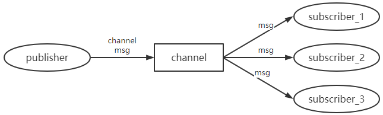
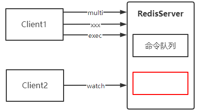
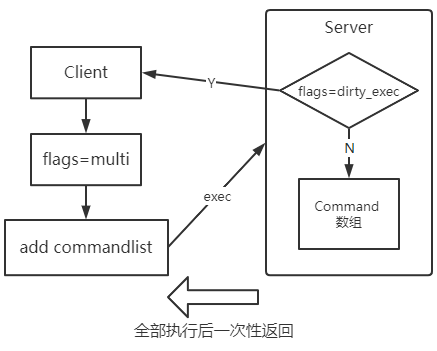
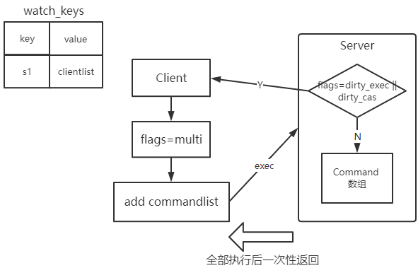
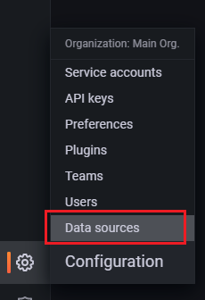
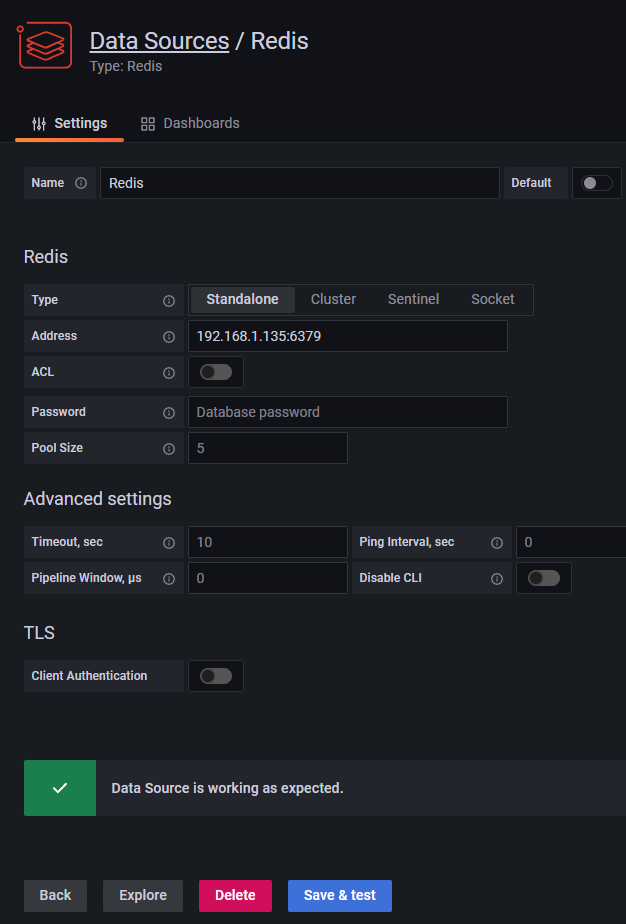
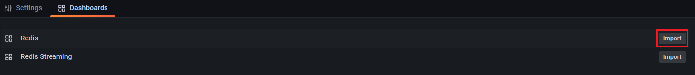
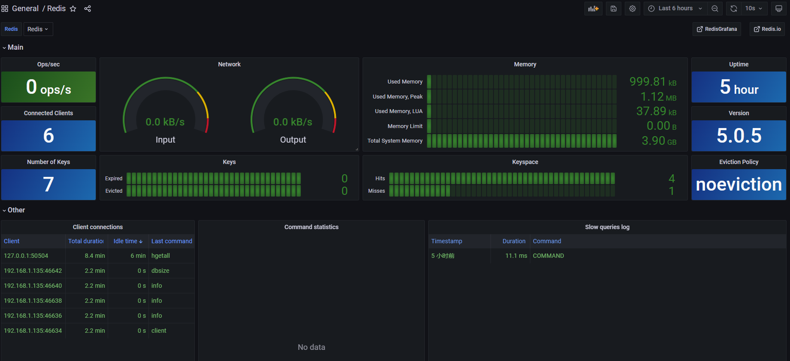

> 第二部分 Redis扩展功能

# 1 发布与订阅

[Redis Pub/Sub](https://redis.io/docs/manual/pubsub/)

Redis 提供了发布订阅功能，可以用于消息的传输

Redis 的发布订阅机制包括三个部分，publisher，subscriber 和 Channel。



发布者 和 订阅者 都是 Redis 客户端，Channel 则为 Redis 服务端。

发布者将消息发送到某个频道，订阅了这个频道的订阅者就能接收到这条消息。

## 1.1 频道/模式的订阅与退订

**subscribe**：订阅 subscribe channel1 channel2 ...

Redis 客户端1 订阅 频道1 和 频道2

```bash
127.0.0.1:6379> subscribe ch1 ch2
Reading messages... (press Ctrl-C to quit)
1) "subscribe"
2) "ch1"
3) (integer) 1
1) "subscribe"
2) "ch2"
3) (integer) 2
```

**publish**：发布消息 publish channel message

Redis 客户端2 将消息发布在 频道1 和 频道2 上

```bash
127.0.0.1:6379> publish ch1 hello
(integer) 1
127.0.0.1:6379> publish ch2 world
(integer) 1
```

 Redis 客户端1 接收到 频道1 和 频道2 的消息

```bash
1) "message"
2) "ch1"
3) "hello"
1) "message"
2) "ch2"
3) "world"
```


**unsubscribe**：退订 channel

Redis 客户端1 退订频道1

```bash
127.0.0.1:6379> unsubscribe ch1
1) "unsubscribe"
2) "ch1"
3) (integer) 0
```


**psubscribe**：模式匹配 psubscribe + 模式

Redis 客户端1 订阅 所有 以 ch 开头的 频道

```bash
127.0.0.1:6379> psubscribe ch*
Reading messages... (press Ctrl-C to quit)
1) "psubscribe"
2) "ch*"
3) (integer) 1
```

Redis 客户端2 发布信息在 频道5 上

```bash
127.0.0.1:6379> publish ch5 helloworld
(integer) 1
```

Redis 客户端1 收到频道5 的信息

```bash
1) "pmessage"
2) "ch*"
3) "ch5"
4) "helloworld"
```

**punsubscribe** 退订模式

```bash
127.0.0.1:6379> punsubscribe ch*
1) "punsubscribe"
2) "ch*"
3) (integer) 0
```


## 1.2 发布订阅的机制

订阅某个频道或模式

- 客户端（client）

  属性为 pubsub_channels，该属性表明了该客户端订阅的所有频道。

  属性为 pubsub_patterns，该属性表示该客户端订阅的所有模式。

- 服务器端（RedisServer）

  属性为 pubsub_channels，该服务器端中的所有频道以及订阅了这个频道的客户端。

  属性为 pubsub_patterns，该服务器端中的所有模式和订阅了这些模式的客户端。

```c
typedef struct redisClient {
	...
	dict *pubsub_channels;  //该client订阅的channels，以channel为key用dict的方式组织    
    list *pubsub_patterns;  //该client订阅的pattern，以list的方式组织
	...
} redisClient; 

struct redisServer {
	...
	dict *pubsub_channels;  //redis server进程中维护的channel dict，它以channel为key，订阅								channel的client list为value
	list *pubsub_patterns;  //redis server进程中维护的pattern list    
    int notify_keyspace_events;
	...
};
```

当客户端向某个频道发送消息时，Redis 首先在 RedisServer 中的 pubsub_channels 中找出键为该频道的节点，遍历该节点的值，即遍历订阅了该频道的所有客户端，将消息发送给这些客户端。

然后，遍历结构体 redisServer 中的 pubsub_patterns，找出包含该频道的模式的节点，将消息发送给订阅了该模式的客户端。

## 1.3 使用场景：哨兵模式，Redisson框架使用

在 Redis 哨兵模式中，哨兵通过发布 与 订阅 的方式 实现 Redis 主服务器 和 Redis 从服务器进行通信。（后面章节中讲解）。

Redisson 是一个分布式锁框架，在 Redisson 分布式锁释放的时候，是使用发布与订阅的方式通知的。（后面章节中讲解）。

# 2 事务

[Redis-Transactions](https://redis.io/docs/manual/transactions/)

## 2.1 ACID

## 2.2 Redis 事务

- Redis 事务是 通过 multi、exec、discard 和 watch 这四个命令来完成的。
- Redis 的单个命令都是原子性的，所以这里需要确保事务性的对象是命令集合。
- Redis 将命令集合序列化并确保处于同一事务的命令集合连续且不被打断执行。
- Redis 不支持回滚操作。

## 2.3 事务命令

- multi：用于标记事务块的开始，Redis 会将后续的命令逐个放入队列中，然后使用 exec 原子化地 执行这个命令队列。
- exec：执行命令队列
- discard：清除命令队列
- watch：监视 key
- unwatch：清除监视 key



```bash
127.0.0.1:6379> multi
OK
127.0.0.1:6379> set s1 222
QUEUED
127.0.0.1:6379> hset set1 name zhangfei
QUEUED
127.0.0.1:6379> exec 
1) OK
2) (integer) 1
127.0.0.1:6379> multi
OK
127.0.0.1:6379> set s2 333
QUEUED
127.0.0.1:6379> hset set2 age 23
QUEUED
127.0.0.1:6379> discard
OK
127.0.0.1:6379> exec
(error) ERR EXEC without MULTI
127.0.0.1:6379> watch s1    
OK
127.0.0.1:6379> multi
OK
127.0.0.1:6379> set s1 555
QUEUED
127.0.0.1:6379> exec 	# 此时在没有exec之前，通过另一个命令窗口对监控的s1字段进行修改
(nil)
127.0.0.1:6379> get s1
222
127.0.0.1:6379> unwatch
OK
```

## 2.4 事务机制

### 2.4.1 事务的执行

1. 事务开始

   在 RedisClient 中，有属性 flags，用来表示是否在事务中。flags=REDIS_MULTI

2. 命令入队

   RedisClient 将命令存放在事务队列中 （EXEC, DISCARD, WATCH, MULTI 除外）。

3. 事务队列

   multiCmd * commands 用于存放命令

4. 执行事务

   RedisClient 向服务器端发送 exec 命令，RedisServer 会遍历事务队列，执行队列中的命令，最后将执行的结果一次性返回给客户端。

如果某条命令在入队过程中发生错误，redisClient 将 flags 置为 REDIS_DIRTY_EXEC，EXEC 命令将会失败返回。



```c
typedef struct redisClient{    
	// flags
   	int flags //状态    
   	// 事务状态
   	multiState mstate;
   	// ..... 
}redisClient;

// 事务状态
typedef struct multiState{    
	// 事务队列,FIFO顺序
   	// 是一个数组,先入队的命令在前,后入队在后    
   	multiCmd *commands;
   	// 已入队命令数    
   	int count; 
}multiState;

// 事务队列
typedef struct multiCmd{    
	// 参数
   	robj **argv;    
   	// 参数数量    
   	int argc;    
   	// 命令指针
   	struct redisCommand *cmd; 
}multiCmd;
```


### 2.4.2 Watch的执行

使用 WATCH 命令监视数据库键。

redisDb 有一个 watched_keys 字典，key 是某个被监视的数据的 key，值是一个链表，记录了所有监视这个数据的客户端。

监视机制的触发：当修改数据后，监视这个数据的客户端的 flags 置为 REDIS_DIRTY_CAS

事务执行：RedisClient 向服务器端发送 exec 命令，服务器判断 RedisClient 的 flags，如果为 REDIS_DIRTY_CAS，则清空事务队列。



```c
typedef struct redisDb{
   // .....
   // 正在被WATCH命令监视的键    
   dict *watched_keys;
   // ..... 
}redisDb;
```


### 2.4.3 Redis 的弱事务性

- Redis语法错误

  整个事务的命令在队列里都清除

  ```bash
  127.0.0.1:6379> multi
  OK
  127.0.0.1:6379> sets m1 44
  (error) ERR unknown command `sets`, with args beginning with: `m1`, `44`, 
  127.0.0.1:6379> set m2 55
  QUEUED
  127.0.0.1:6379> exec
  (error) EXECABORT Transaction discarded because of previous errors.
  127.0.0.1:6379> get m1
  "22"
  ```

  flags=REDIS_DIRTY_EXEC

- Redis 运行错误

  在队列里正确的命令可以执行（弱事务性）

  弱事务性：

  - 在队列里正确的命令可以执行（非原子操作）
  - 不支持回滚

  ```bash
  127.0.0.1:6379> multi
  OK
  127.0.0.1:6379> set m1 55
  QUEUED
  127.0.0.1:6379> lpush m1 1 2 3 # 不是语法错误
  QUEUED
  127.0.0.1:6379> exec
  1) OK
  2) (error) WRONGTYPE Operation against a key holding the wrong kind of value
  127.0.0.1:6379> get m1
  "55"
  ```

- Redis 不支持事务回滚（为什么）

  - 大多数事务失败是因为**语法错误或者类型错误**，这两种错误，在开发阶段都是可以预见的。
  - Redis 为了**性能方面**就忽略的事务回滚。（回滚需要记录历史版本）。

# 3 Lua脚本-ing

lua 是一种清凉小巧的脚本语言，用标准 **C语言** 编写并以源代码形式开放，其设计目的是为了嵌入应用程序中，从而为应用程序提供灵活的扩展和定制功能。

Lua 应用场景：

- 游戏开发、独立应用脚本、Web 应用脚本、扩展和数据库插件。

- nginx 上使用 lua 实现高并发

OpenRestry：一个可伸缩的基于 Nginx 的 Web 平台，是在 nginx 之上集成了 lua 模块的第三方服务器。

OpenRestry 是一个通过 lua 扩展 Nginx 实现的可伸缩的 Web 平台，内部集成了大量精良的 Lua库、第三方模块以及大多数的依赖项。

用于方便的搭建能够处理超高并发（日活千万级别）、扩展性极高的动态 Web 应用、Web 服务和动态网关。

功能和 nginx 类似，就是由于支持 lua 动态脚本，所以更加灵活。

OpenRestry 通过 Lua 脚本扩展 nginx 功能，可提供 负载均衡、请求路由、安全认证、服务鉴权、流量控制 与 日志监控等服务。

类似的还有 Kong（Api Gateway）、tengine（阿里）

## 3.1 创建并修改 lua 环境

## 3.2 Lua 环境写作组件

## 3.3 EVAL/EVALSHA 命令实现

### 3.3.1 EVAL 命令

### 3.3.2 lua脚本中调用 Redis 命令

### 3.3.3 EVALSHA

## 3.4 SCRIPT 命令

## 3.5 脚本管理命令实现

## 3.6 脚本复制


# 4 慢日志查询

MySQL 有慢查询日志

Redis 也有慢查询日志，可用于监视和优化查询

## 4.1 慢查询设置

在 redis.conf 中可以配置和慢查询日志相关的选项：

```bash
# 执行时间超过多少微秒的命令请求会被记录到日志上 0 :全记录 <0 不记录 
slowlog-log-slower-than  10000
# slowlog-max-len 存储慢查询日志条数 
slowlog-max-len 128
```

Redis 使用列表存储慢查询日志，采用队列方式（FIFO）

config set 的方式可以临时设置，redis 重启后就无效

```bash
config set slowlog-log-slower-than 微妙
config set slow-max-len 条数
slowlog get [n] 查看日志
```

```bash
127.0.0.1:6379> config set slowlog-log-slower-than 0
OK
127.0.0.1:6379> config set slowlog-max-len 5
OK
127.0.0.1:6379> slowlog get 1
1) 1) (integer) 2					# 日志的唯一标识符(uid)
   2) (integer) 1636018486			# 命令执行时的UNIX时间戳
   3) (integer) 3					# 命令执行的时长(微妙)
   4) 1) "slowlog"					# 
      2) "get"						# 执行命令及参数
      3) "[1]"
   5) "127.0.0.1:55990"
   6) ""
127.0.0.1:6379> slowlog get 3
1) 1) (integer) 3
   2) (integer) 1636018500
   3) (integer) 16
   4) 1) "slowlog"
      2) "get"
      3) "1"
   5) "127.0.0.1:55990"
   6) ""
2) 1) (integer) 2
   2) (integer) 1636018486
   3) (integer) 3
   4) 1) "slowlog"
      2) "get"
      3) "[1]"
   5) "127.0.0.1:55990"
   6) ""
3) 1) (integer) 1
   2) (integer) 1636018472
   3) (integer) 4
   4) 1) "config"
      2) "set"
      3) "slowlog-max-len"
      4) "5"
   5) "127.0.0.1:55990"
   6) ""
127.0.0.1:6379> 
```


## 4.2 慢查询记录的保存

在 redisServer 中保存和慢查询日志相关的信息

```c
struct redisServer {    
    // ...
   	// 下一条慢查询日志的     ID
   	long long slowlog_entry_id;
   	// 保存了所有慢查询日志的链表 FIFO
    list *slowlog;  
   	// 服务器配置 slowlog-log-slower-than 选项的值    
    long long slowlog_log_slower_than;
   	// 服务器配置     slowlog-max-len 选项的值    
    unsigned long slowlog_max_len;
    // ... 
};
```

`lowlog` 链表保存了服务器中的所有慢查询的日志，链表中的每个节点都保存了一个 `slowlogEntry` 结构，每个 `slowlogEntry` 架构代表一条慢查询日志。

```c
typedef struct slowlogEntry {    
    // 唯一标识符
   	long long id;
   	// 命令执行时的时间，格式为 UNIX 时间戳    
    time_t time;
   	// 执行命令消耗的时间，以微秒为单位    
    long long duration;
   	// 命令与命令参数
   	robj **argv;
   	// 命令与命令参数的数量    
    int argc;
} slowlogEntry;
```


## 4.3 慢查询日志的阅览&删除

初始化日志列表

```c
void slowlogInit(void) {
   	server.slowlog = listCreate();    /* 创建一个list列表 */    
    server.slowlog_entry_id = 0;      /* 日志ID从0开始*/
   	listSetFreeMethod(server.slowlog,slowlogFreeEntry);  /* 指定慢查询日志list空间的释放方法*/
}
```

获得慢查询日志记录

slowlog get [n]

```c
def SLOWLOG_GET(number=None):
	# 用户没有给定number 参数
	# 那么打印服务器包含的全部慢查询日志    
	if number is None:
		number = SLOWLOG_LEN()    
	
	# 遍历服务器中的慢查询日志
	for log in redisServer.slowlog:
		if number <= 0:
			# 打印的日志数量已经足够，跳出循环
			break        
		else:
			# 继续打印，将计数器的值减一            
			number -= 1
		# 打印日志
		printLog(log)
```

查看日志数量的 slowlog len

```c
def SLOWLOG_LEN():
	# slowlog 链表的长度就是慢查询日志的条目数量    
	return len(redisServer.slowlog)
```

清除日志 slowlog reset

```c
def SLOWLOG_RESET():
	# 遍历服务器中的所有慢查询日志
	for log in redisServer.slowlog:        
		# 删除日志
		deleteLog(log)
```


## 4.4 添加日志实现

在每次执行命令之前和之后，程序都会记录微妙格式的当前 UNIX 时间戳，这两个时间戳之间的差就是服务器执行命令所耗费的时长，服务器会将这个时长作为参数之一传给 `slowlogPushEntryIfNeeded` 函数，而 `slowlogPushEntryIfNeeded` 函数则负责检查是否需要为这次执行的命令创建慢查询日志。

```c
// 记录执行命令前的时间
before = unixtime_now_in_us() 
    
//执行命令
execute_command(argv, argc, client) 
    
//记录执行命令后的时间
after = unixtime_now_in_us() 
    
// 检查是否需要创建新的慢查询日志
slowlogPushEntryIfNeeded(argv, argc, before-after)
    
void slowlogPushEntryIfNeeded(robj **argv, int argc, long long duration) {
    /* Slowlog disabled  负数表示禁用*/
	if (server.slowlog_log_slower_than < 0) return;
    /* 如果执行时间 > 指定阈值*/
	if (duration >= server.slowlog_log_slower_than)
        /* 创建一个slowlogEntry对象,添加到列表首部*/
        listAddNodeHead(server.slowlog,slowlogCreateEntry(argv,argc,duration));
    
	/*如果列表长度>指定长度*/
	while (listLength(server.slowlog) > server.slowlog_max_len)
		listDelNode(server.slowlog,listLast(server.slowlog)); /* 移除列表尾部元素 */
}
```

`slowlogPushEntryIfNeeded` 函数的作用有两个：

1. 检查命令的执行时长是否超过 `slowlogPushEntryIfNeeded` 选项所设置的时间，如果是的话，就为命令创建一个新的日志，并将新日志添加到 `slowlog` 链表的表头。
2. 检查慢查询日志的长度是否超过 `slowlog-max-len`  选项所设置的长度，如果是的话，那么将多出来的日志从 `slowlog` 链表中删除掉。


## 4.5 慢查询定位&处理

使用 slowlog get 可以过的执行较慢的 redis 命令，针对该命令可以进行优化：

1. 尽量使用短的 key，对于 value 有些也可精简，能使用 int 就用 int。

2. 避免使用 keys *、hgetall 等全量操作。

3. 减少大 key 的存取，打散为小 key，100k以上。

4. 将 rdb 改为 aof 模式

   rdb fork 子进程，数据量过大，主进程阻塞，redis 性能大幅下降。

   关闭持久化（适合于数据量较小，有固定数据源）

5. 想要一次添加多条数据的时候可以使用管道。

6. 尽可能地使用哈希存储。

7. 尽量限制下 redis 使用地内存大小，这样可以避免 redis 使用 swap 分区或者出现 OOM 错误。

   内存与硬盘的 swap

# 5 监视器

Redis 客户端通过执行 MONITOR 命令可以将自己变为一个监视器，实时地接收并打印出服务器当前的处理命令的相关信息。

此时，当其他客户端向服务器发送一条命令请求时，服务器除了会处理这条命令请求之外，还会将这条命令请求的信息发送给所有监视器。


Redis客户端1

```shell
127.0.0.1:6379> monitor
OK
1636019353.766249 [0 127.0.0.1:55992] "COMMAND"
1636019375.414681 [0 127.0.0.1:55992] "set" "name" "turbo"
1636019380.011170 [0 127.0.0.1:55992] "set" "name" "echo"
```

Redis客户端2

```shell
127.0.0.1:6379> set name turbo
OK
127.0.0.1:6379> set name echo
OK
```

## 5.1 实现监视器

`redisServer` 维护一个 `monitors` 的链表，记录自己的监视器，每次收到 `MONITOR` 命令之后，将客户端追加到链表尾。

```c
void monitorCommand(redisClient *c) {
	/* ignore MONITOR if already slave or in monitor mode */    
    if (c->flags & REDIS_SLAVE) return;
    c->flags |= (REDIS_SLAVE|REDIS_MONITOR);        
    listAddNodeTail(server.monitors,c);
	addReply(c,shared.ok);  //回复OK 
}
```


## 5.2 向监视器发送命令信息

利用call函数实现向监视器发送命令。

```c
// call() 函数是执行命令的核心函数，这里只看监视器部分 
/*src/redis.c/call*/
/* Call() is the core of Redis execution of a command */ 
void call(redisClient *c, int flags) {
	long long dirty, start = ustime(), duration;    
    int client_old_flags = c->flags;
	/* Sent the command to clients in MONITOR mode, only if the commands are    
	* not generated from reading an AOF. */
	if (listLength(server.monitors) && 
        !server.loading && 
        !(c->cmd->flags & REDIS_CMD_SKIP_MONITOR)){
		replicationFeedMonitors(c,server.monitors,c->db->id,c->argv,c->argc);  
    }
	...... 
} 
```

`call` 主要调用了 `replicationFeedMonitors`，这个函数的作用就是将命令打包为协议，发送给监视器。

## 5.3 redis监控平台

[grafana](https://grafana.com/)、prometheus 以及 redis_export。

Grafana 是一个开箱即用的可视化工具，具有功能齐全的度量仪表盘 和 图形编辑器，有灵活丰富的图形化选项，可以混合多种风格，支持多个数据源特点。

Prometheus是一个开源的服务监控系统，它通过 HTTP 协议从远程的机器收集数据并存储在本地的时序数据库上。

redis_exporter 为 Prometheus 提供了 redis 指标的导出，配合 Prometheus 以及 grafana 进行可视化及监控。

[Grafana Install with RPM](https://grafana.com/docs/grafana/v9.0/setup-grafana/installation/rpm/#install-with-rpm), [Grafana Dowmload](https://grafana.com/grafana/download?pg=get&plcmt=selfmanaged-box1-cta1&platform=linux)

启动后，默认访问端口: 3000

安装 redis 数据源：

```bash
[root@localhost bin]# grafana-cli plugins install redis-datasource
✔ Downloaded redis-datasource v2.1.1 zip successfully

Please restart Grafana after installing plugins. Refer to Grafana documentation for instructions if necessary.

[root@localhost bin]# systemctl restart grafana-server
```

安装完成后重启 grafana-server。然后配置 redis Data source：





在 Dashboards 导入 redis 数据源：



然后，点击数据源名称，进入 redis 的 Dashboards 界面：



