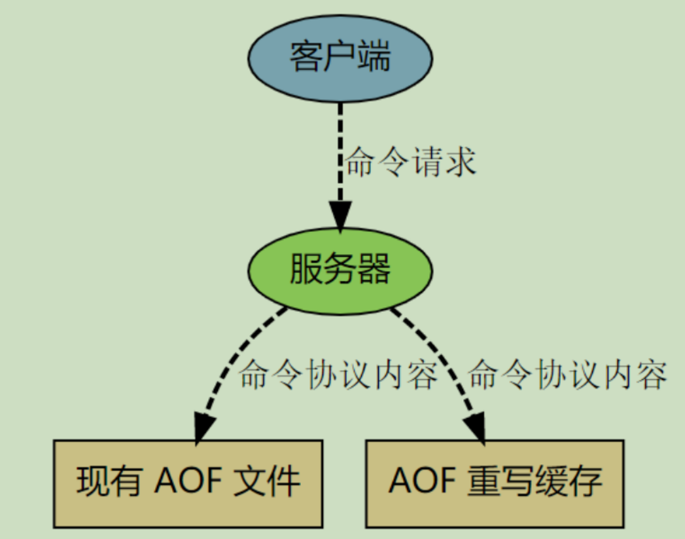

第三部分 Redis核心原理

# 10 Redis持久化

## 10.1 为什么要持久化

Redis是内存数据库，宕机后数据会消失。Redis重启后快速恢复数据，要提供持久化机制。Redis持久化是为了快速恢复数据，而不是为了存储数据。

Redis有两种持久化方式：RDB和AOF

注意：Redis持久化不保证数据的完整性。

当Redis用作DB时，DB数据要完整，所以一定要有一个完整的数据源（文件、mysql）

在系统启动时，从这个完整的数据源中将数据load到Redis中，数据量较小，不易改变，比如：字典库（xml、Table）

通过info命令可以查看关于持久化的信息：

```shell
[root@localhost bin]# ./redis-cli 
127.0.0.1:6379> info
...

# Persistence
loading:0
rdb_changes_since_last_save:17
rdb_bgsave_in_progress:0
rdb_last_save_time:1635304292
rdb_last_bgsave_status:ok
rdb_last_bgsave_time_sec:-1
rdb_current_bgsave_time_sec:-1
rdb_last_cow_size:0
aof_enabled:1
aof_rewrite_in_progress:0
aof_rewrite_scheduled:0
aof_last_rewrite_time_sec:-1
aof_current_rewrite_time_sec:-1
aof_last_bgrewrite_status:ok
aof_last_write_status:ok
aof_last_cow_size:0
aof_current_size:649
aof_base_size:649
aof_pending_rewrite:0
aof_buffer_length:0
aof_rewrite_buffer_length:0
aof_pending_bio_fsync:0
aof_delayed_fsync:0

...
```


## 10.2 RDB

RDB（Redis DataBase），是Redis默认的存储方式，RDB方式是通过快照（`snapshotting`）完成的。关注这一刻的数据，不关注过程。

### 10.2.1 触发快照的方式

1. 符合自定义配置的快照规则
2. 执行save或者bgsave命令
3. 执行flushall命令
4. 执行主从复制操作（第一次）

### 10.2.2 配置参数定期执行

在redis.conf中配置：save	多少秒内数据变了多少


```shell
save ""		#不使用RDB	不能主从

save 900 1		#表示15分钟（900秒）内至少1个键被更改则进行快照。
save 300 10		#表示5分钟（300秒）内至少10个键被更改则进行快照。
save 60 10000	#表示1分钟（60秒）内至少10000个键被更改则进行快照。
```

漏斗设计 提供性能

### 10.2.3 命令显示触发

在客户端输入bgsave命令。

```shell
[root@localhost bin]# ./redis-cli -h 127.0.0.1 -p 6379
127.0.0.1:6379> bgsave
Background saving started
```


### 10.2.4 RDB执行流程（原理）


1. Redis父进程首先判断：当前是否在执行save、或bgsave/bgrewriteaof（aof文件重写命令）的子进程，如果在执行则bgsave命令直接返回。
2. 父进程执行fork（调用OS函数复制主进程）操作创建子进程，这个复制过程中父进程是阻塞的，Redis不能执行来自客户端的任何命令。
3. 父进程fork之后，bgsave命令返回“Background saving started”信息并不再阻塞父进程，并可以响应其他命令。
4. 子进程创建RDB文件，根据父进程内存快照生成临时快照文件，完成后对原有文件进行原子替换。（RDB始终完整）
5. 子进程发送信号给父进程表示完成，父进程更新统计信息。
6. 父进程fork子进程后，继续工作。


### 10.2.5 RDB文件结构


1. 头部5字节固定为“REDIS”字符串

2. 4字节“RDB”版本号（不是Redis版本号），当前为9，填充后为0009

3. 辅助字段，以key-value的形式

   | 字段名     | 字段值     | 字段名         | 字段值      |
   | ---------- | ---------- | -------------- | ----------- |
   | redis-ver  | 5.0.5      | aof-preamble   | 是否开启aof |
   | redis-bits | 64/32      | repl-stream-db | 主从复制    |
   | ctime      | 当前时间戳 | repl-id        | 主从复制    |
   | used-mem   | 使用内存   | repl-offset    | 主从复制    |

4. 存储数据库号码

5. 字典大小

6. 过期key

7. 主要数据，以key-value的形式存储

8. 结束标志

9. 校验和，就是文件是否损坏，或者是否被修改。

可使用winhex打开dump.rdb文件查看。


### 10.2.6 RDB的优缺点

优点：

- RDB是二进制文件，占用空间小，便于传输（传给slaver）
- 主进程fork子进程，可以最大化Redis性能，主进程不能太大，Redis的数据量不能太大，复制过程中主进程阻塞

缺点：

- 不保证数据完整性，会丢失最后一次快照之后更改的所有数据。

## 10.3 AOF

AOF（append only file）是Redis的另一种持久化方式。Redis默认情况下是不开启的。

开启AOF持久化后，Redis将所有对数据库进行过的**写入命令（及其参数）**（RESP）记录到AOF文件，以此达到记录数据库的目的，这样当Redis重启后只要按顺序回放这些命名就会恢复到原始状态了。

AOF会记录过程，RDB只记录结果。

### 10.3.1 AOF持久化实现

配置redis.conf

```shell
# 可以通过修改redis.conf配置文件中的appendonly参数开启
appendonly yes  

# AOF文件的保存位置和RDB文件的位置相同，都是通过dir参数设置的。
dir   ./  

# 默认的文件名是appendonly.aof，可以通过appendfilename参数修改
appendfilename   appendonly.aof
```

### 10.3.2 AOF原理

AOF文件中存储的是redis的命令，同步命令到AOF文件的整个过程可以分为三个阶段：

1. 命令传播：Redis将执行完的命令、命令的参数、命令的参数个数等信息发送到AOF程序中。
2. 缓存追加：AOF程序根据接收到的命令数据，将命令转换为网络通讯协议的格式，然后将协议内容追加到服务器的AOF缓存中。
3. 文件写入和保存：AOF缓存中的内容被写入到AOF文件末尾，如果设定的AOF保存条件被满足的话，fsync函数挥着fdatasync函数被调用，将写入的内容真正地保存到磁盘中。

#### 10.3.2.1 命令传播

当一个Redis客户端需要执行命令时，它通过网络连接，将协议文本发送给Redis服务器。服务器在接收到客户端地请求之后，它会根据协议文本地内容，选择适当地命令函数，并将各个参数从字符串文本转换为Redis字符串对象（`StringObject`）。每当命令函数成功执行之后，命令参数都会被传播到AOF程序。

#### 10.3.2.2 缓存追加

当命令被传播到AOF程序之后，程序会很据命令以及命令的参数，将命令从字符串对象转换回原来的协议文本。协议文本生成之后，它会被追加到`redis.h/redisServer`的结构`aof_buf`末尾。

`redisServer`结构维持着Redis服务器的状态，`aof_buf`域则保存着所有等待写入到AOF文件的协议文本（RESP）。

#### 10.3.2.3 文件写入和保存

每当服务器常规任务函数被执行、或者时间处理器被执行时，aof.c/flushAppendOnlyFile函数都会被调用，这个函数执行以下两个工作：

- WRITE：根据条件，将aof_buf中的缓存写入到AOF文件。
- SAVE：根据条件，调用fsync或fdatasync函数，将AOF文件保存到磁盘中。

#### 10.3.2.4 AOF保存模式

Redis目前支持三种AOF保存模式，它们分别是：

AOF_FSYNC_NO：不保存

AOF_FSYNC_EVERYSEC：每秒钟保存一次（默认）

AOF_FSYNC_ALWAYS：每执行一个命令保存一次（不推荐）

以下三个小结将分别讨论这三种保护模式。

##### 10.3.2.4.1 不保存

在这种模式下，每次调用flushAppendOnlyFile函数，WRITE都会被执行，但SAVE会被略过。

在这种模式下，SAVE只会在以下任意一种情况下被执行：

- Redis被关闭

- AOF功能被关闭

- 系统的写缓存被刷新（可能是缓存已经被写满，或者定期保存操作被执行）

这三种情况下的SAVE操作都会引起Redis主进程阻塞。

##### 10.3.2.4.2 每秒钟保存一次（默认）

在这种模式下，SAVE原则上每隔一秒钟就会执行一次，因为SAVE操作是由后台子线程（fork）调用的，所以他不会引起服务器主进程阻塞。

##### 10.3.2.4.3 每执行一个命令保存一次（不推荐）

在这种模式下，每次执行完一个命令之后，WRITE和SAVE都会被执行。另外，因为SAVE是由Redis主进程执行的，所以在SAVE执行期间，主进程会被阻塞，不能接收命令请求。

AOF保存模式对性能和安全性的影响：对于三种AOF保存模式，它们对服务器的阻塞情况如下：


#### 10.3.2.5 AOF重写、触发方式、混合持久化

AOF记录数据的变化过程，越来越大，需要重写“瘦身”

Redis可以在AOF体积变得过大时，自动地在后台（Fork子进程）对AOF进行重写。重写后的新AOF文件包含了恢复当前数据集所需的最小命令集合。所谓的“重写”其实就是一个有歧义的词语，实际上，AOF重写并不需要对原有的AOF文件进行任何写入和读取，它针对的是数据库中键的当前值。

eg:

```
set s1 11
set s1 22
set s1 33
```

没有优化

```
set s1 11
set s1 22
set s1 33
```

优化后

```
set s1 33
```

Redis不希望AOF重写造成服务器无法处理请求，所以Redis决定将AOF重写程序放到（后台）子进程里执行，这样处理的最大好处：

1. 子进程进行AOF重写期间，主进程可以继续处理命令请求。
2. 子进程带有主进程的数据副本，使用子进程而不是线程，可以避免锁的情况下，保证数据的安全性。

不过，使用子进程也有一个问题需要解决：因为子进程在进程AOF重写期间，主进程还需要继续处理命令，而新的命令可能对现有的数据进行修改，这会让当前数据库的数据和重写后的AOF文件中的数据不一致。

为了解决这个问题Redis增加了一个AOF重写缓存，这个缓存在fork出子进程之后开始启用，Redis主进程在接到新的命令之后，除了会将这个写命令的内容追加到现有的AOF文件之外，还会追加到这个缓存中。



> 重写过程分析（整个重写操作是绝对安全的）

Redis在创建新AOF文件的过程中，会继续将命令追加到现有的AOF文件里面，即使重写过程中发生停机，现有的AOF文件也不会丢失。而一旦新AOF文件创建完毕，Redis就会从旧AOF文件切换到新AOF文件，并开始对新AOF文件进行追加操作。

当子进程在执行AOF重写时，主进程需要执行以下三个工作：

- 处理命令请求
- 将写命令追加到现有的AOF文件中。
- 将写命令追加到AOF重写缓存中

这样一来可以保证：

现有的AOF功能继续执行，即使在AOF重写期间发生停机，也不会有任何数据丢失。所有对数据库进行修改的命令都会被记录到AOF重写缓存中。当子进程完成AOF重写之后，它会向父进程发送一个完成信号，父进程在接收到完成信号之后，会调用一个信号处理函数，并完成以下工作：

- 将AOF重写缓存中的内容全部写入到新AOF文件中；

- 对新的AOF文件进行改名，覆盖原有的AOF文件。

Redis数据库里的 + AOF重写过程中的命令 ---> 新的AOF文件 ---> 覆盖老的AOF文件

当步骤一执行完毕后，现有AOF文件、新AOF文件和数据库三者的状态旧完全一致了；

当步骤二执行完毕后，程序就完成了新旧两个AOF文件的交替。

这个信号处理函数执行完毕后，主进程就可以继续向往常一样接受命令请求了。在整个AOF后台重写过程中，只有**最后的写入缓存**和**改名操作**会造成主进程阻塞，其他时候，AOF后台重写都不会对主进程造成阻塞，这将AOF重写行性能造成的影响降到了最低。

以上就是AOF后台重写，也就是BGREWRITEAOF命令（AOF重写的工作原理）。


> 触发方式

1. 配置触发

   在redis.conf中配置

   ```properties
   # 表示当前aof文件大小超过上一次aof文件大小的百分之多少的时候会进行重写。如果之前没有重写过，以启动时aof文件大小为准
   auto-aof-rewrite-percentage 100
   
   # 限制允许重写最小aof文件大小，也就是文件大小小于64mb的时候，不需要进行优化
   auto-aof-rewrite-min-size 64mb
   ```

   

2. 执行bgrewriteaof命令

   ```shell
   127.0.0.1:6379> bgrewriteaof
   Background append only file rewriting started
   127.0.0.1:6379> 
   ```

> 混合持久化

RDB和AOF各有优缺点，Redis 4.0开始支持rdb和aof的混合持久化。如果把混合持久化打开，aof rewrite的时候就直接把rdb的内容写到aof文件开头。

RDB的头 + AOF的身体 ---> appendonly.aof

开启混合持久化

```properties
aof-use-rdb-preamble yes
```


可以看到该AOF文件是rdb文件开头和aof格式的内容，在加载时，首先会识别AOF文件是否以REDIS字符串开头，如果是就是按RDB格式加载，加载完RDB后继续按AOF格式加载剩余部分。

#### 10.3.2.6 AOF 文件在载入与数据还原

因为AOF文件里面包含了重建数据库状态所需的所有写命令，所以服务器只需要读入并重新执行一边AOF文件里面保存的写命令，就可以还原服务器关闭之前的数据库状态

Redis读取AOF文件并还原数据库状态的详细步骤如下：

1. 创建一个不带网络连接的伪客户端（fake client）：因为Redis的命令只能在客户端上下文中执行，而载入AOF文件时所使用的命令直接来源于AOF文件，而不是网络连接。所以服务器使用一个没有网络连接的伪客户端来执行AOF文件保存的写命令，伪客户端执行命令的效果和带网络连接的客户端执行命令的效果完全一样。
2. 从AOF文件中分析并读取出一条写命令
3. 使用伪客户端执行被读出的写命令
4. 一直执行步骤2和步骤3，直到AOF文件中的所有写命令都被执行完毕为止

当完成以上步骤后，AOF文件所保存的数据库状态就会被完整的还原出来，整个过程如下：


## 10.4 RDB与AOF对比

1. RDB存某个时刻的数据快照，采用二进制压缩存储；AOF存储操作命令，采用文本存储（混合）
2. RDB性能高、AOF性能较低
3. RDB在配置触发状态会丢失最后一次快照以后更改的所有数据；AOF设置为每秒保存一次，则最多丢2秒的数据
4. Redis以主服务器模式运行，RDB不会保存过期键值对数据；Redis以从服务器模式运行，RDB会保存过期键值对，当主服务器向从服务器同步时，在清空过期键值对。

AOF写入文件时，对过期的key会追加一条del命令，当执行AOF重写时，会忽略过期key和del命令。


## 10.5 应用场景

内存数据库	rdb + aof	数据不易丢失

有原始数据源：每次启动时，都从原始数据源中初始化，则不用开启持久化（数据量较小）

缓存服务器	rdb	一般开启，性能高（数量大的时候，fork时会降低性能）


在数据还原时

有rdb + aof 则还原aof，因为RDB会造成文件的丢失，AOF相对数据要完整。

只有rdb，则还原rdb


# 11 底层数据结构

Redis作为Key - Value存储系统，数据结构如下：


Redis没有表的概念，Redis实例所对应的db以编号区分，db本身就是key的命名空间。

比如：user:1000作为key值，表示在user这个命名空间下id为1000的元素，类似于user表的id=1000的行。

## 11.1 RedisDB结构

Redis中存在“数据库”的概念，该结构由redis.h中的redisDb定义。

当redis服务器初始化时，会预先分配16个数据库

所有数据库保存到结构redisServer的一个成员 redisServer.db数组中

redisClient中存在一个名为db的指针指向当前使用的数据库

RedisDB结构体源码：

```c
typedef struct redisDb {	
   int id;			//id是数据库序号，为0-15（默认Redis有16个数据库）
   long  avg_ttl;  	//存储的数据库对象的平均ttl（time to live），用于统计
   dict *dict;     	//存储数据库所有的key-value
   dict *expires;  	//存储key的过期时间
   dict *blocking_keys;	//blpop 存储阻塞key和客户端对象
   dict *ready_keys;	//阻塞后push 响应阻塞客户端  存储阻塞后push的key和客户端对象
   dict *watched_keys;	//存储watch监控的的key和客户端对象
} redisDb;
```

> **id**

id是数据库号，为0-15（默认Redis有16个数据库）

> **dict**

存储数据库所有的key-value

> **expires**

存储key的过期时间


## 11.2 RedisObject结构

Value是一个对象

包含字符串对象，列表对象，哈希对象，集合对象和有序集合对象

### 11.2.1 结构信息概览

```c
typedef struct redisObject {
	unsigned type:4;	//类型     对象类型 
    unsigned encoding:4;//编码
	void *ptr;		//指向底层实现数据结构的指针 
    //...
	int refcount;	//引用计数 
    //...
	unsigned lru:LRU_BITS; //LRU_BITS为24bit 记录最后一次被命令程序访问的时间 
    //...
}robj;
```

> **4位type**

type字段表示对象的类型，占4位；

REDIS_STRING(字符串)、REDIS_LIST(列表)、REDIS_HASH(哈希)、REDIS_SET(集合)、REDIS_ZSET(有序集合)

当执行type命令时，便是通过读取RedisObject的type字段获取对象的类型

```
127.0.0.1:6379> type age
string
```

> **4位encoding**

encoding表示对象的内部编码，占4位，

每个对象有不同的实现编码

Redis可以根据不同的使用场景来为对象设置不同的编码，大大提高了Redis的灵活性和效率。

通过object encoding命令，可以查看对象采用的编码方式

```
127.0.0.1:6379> object encoding a1
"int"
```

> **24 位LRU**

LRU（Least Recently Used）记录的是最后一次被命令程序访问的时间，（4.0版本占24位，2.6版本占22位）。

高16位存储一个分钟级别的时间戳，低8位存储访问计数（lfu：最近访问次数）

lru ---> 高16位：最后被访问的时间

lfu ---> 低8位：最近访问次数


> **refcount**

refcount记录的是该对象被引用的次数，类型为整形。

refcount的作用，主要在于对象的引用计数和内存回收。

当对象的refcount > 1时，称为共享对象

Redis为了节省内存，当有一些对象重复出现时，新的程序不会创建新的对象，而是仍然使用原来的对象。

> **ptr**

ptr指针指向具体的数据，比如：set hello world，ptr指向包含字符串world的SDS。

### 11.2.2 7种type

#### 11.2.2.1 字符串对象

C语言：字符数组	以"\0"结尾

Redis使用了SDS（Simple Dynamic String）。用于存储字符串和整型数据。


```c
struct sdshdr{
   	//记录buf数组中已使用字节的数量    
    int len;
   	//记录     buf 数组中未使用字节的数量    
    int free;
   	//字符数组，用于保存字符串    
    char buf[];
}
```

buf[]的长度 = len + free + 1

SDS的优势：

1. SDS在C字符串的基础上加入了free和len字段，获取字符串长度：SDS是O(1)，C字符串是O(n)。
2. SDS由于记录了长度，在可能造成缓冲区溢出时会自动重新分配内存，杜绝了缓冲区溢出
3. 可以存取二进制数据，以字符串长度len作为结束标识


使用场景：

SDS的主要应用在：存储字符串和整型数据、存储key、AOF缓冲和用户输入缓冲。


#### 11.2.2.2 跳跃表

跳跃表是有序集合（sorted-set）的底层实现，效率高，实现简单。

跳跃表的基本思想：

**将有序链表中的部分节点分层，每一层都是一个有序链表**

> 查找

在查找时优先从最高层开始向后查找，当达到某个节点时，如果next节点值大于要查找的值或next指针指向null，则从当前节点下降一层继续向后查找。

举例：


查找元素9，按道理需要从头节点开始遍历，一共遍历8个节点才能找到元素9。

**第一次分层**：

遍历5次找到元素9（红色线为查找路径）


**第二次分层**：

遍历四次找到元素9


**第三次分层**：

遍历4次找到元素9


这种数据结构，就是跳跃表，它具有二分查找的功能。

插入与删除

上面例子中，9个节点，一共4层，是理想的跳跃表。

通过抛硬币（概率1/2）的方式来决定新插入节点跨越的层数：

> **删除**

找到指定元素并删除每层的该元素即可

跳跃表特点：

- 每层都是一个有序链表

- 查找次数近似于层数（1/2）

- 底层包含所有原色
- 空间复杂度O(n)扩充了一倍

> **Redis跳跃表的实现**

```c
//跳跃表节点
typedef struct zskiplistNode {
	sds ele; /* 存储字符串类型数据     redis3.0版本中使用robj类型表示，
				但是在redis4.0.1中直接使用sds类型表示     */
	double score;//存储排序的分值
    struct zskiplistNode *backward;//后退指针，指向当前节点最底层的前一个节点     
    /*
		层，柔性数组，随机生成1-64的值     
	*/
    struct zskiplistLevel {
    	struct zskiplistNode *forward; //指向本层下一个节点          
        unsigned int span;//本层下个节点到本节点的元素个数
     } level[]; 
} zskiplistNode;

//链表
typedef struct zskiplist{     
	//表头节点和表尾节点
    structz skiplistNode *header, *tail;     
    //表中节点的数量
    unsigned long length;     
    //表中层数最大的节点的层数     
    int level;
}zskiplist;
```

完整的跳跃表结构体：


**跳跃表的优势**：

1. 可以快速查找到需要的节点O(logn)
2. 可以在O(1)的时间复杂度下，快速获得跳跃表的头节点、尾节点、长度和高度。

应用场景：有序集合的实现


#### 11.2.2.3 字典（重点 + 难点）

字典dict又称散列表（hash），是用来存储键值对的一种数据结构。

Redis整个数据库使用字典来存储的。（K-V结构）

对Redis进行CURD操作，其实就是对字典中的数据进行CURD操作。

> 数组

数组：用来存储数据的容器，采用头指针 + 偏移量的方式能够以O(1)的时间复杂度定位到数据所在的内存地址。

Redis快速海量存储

> Hash函数

Hash（散列），作用是把任意长度的输入通过散列算法转换成固定类型，固定长度的散列值。

hash函数可以把Redis里的key：包括字符串、整数、浮点数 统一转换成整数。

```
Redis-cli : time 33(hash算法)
RedisServer: siphash(hash算法)
```

数组下标 = hash(key)%数组容量(hash值%数组容量得到的余数)

> Hash冲突

不同的key经过计算后出现数组下标一致，称为Hash冲突。

采用单链表在相同的下标为止出存储原始key和value

当根据key找Value时，找到数组下标，遍历单链表可以找出key相同的value


> Redis字典的实现

Redis字典实现包括：字典（dict）、Hash表（dicht）、Hash表节点（dicEntry）。


> Hash表

```c
typedef struct dictht {
	dictEntry **table;             // 哈希表数组
	unsigned long size;            // 哈希表数组的大小
	unsigned long sizemask;        // 用于映射位置的掩码，值永远等于(size-1)
	unsigned long used;            // 哈希表已有节点的数量,包含next单链表数据 
} dictht;
```

1. hash表的数组初始容量为4，醉着k-v存储量的增加需要对hash表数组进行扩容，新扩容量为当前量的一倍，即 4、8、16、32
2. 索引值 = Hash值&掩码值（Hash值与Hash表容量取余）

> Hash表节点

```c
typedef struct dictEntry {
	void *key;                  // 键
	union {                     // 值v的类型可以是以下4种类型        
		void *val;
       	uint64_t u64;        
        int64_t s64;        
        double d;
   } v;
   struct dictEntry *next;     // 指向下一个哈希表节点，形成单向链表     解决hash冲突 
} dictEntry;
```

key字段存储的是键值对中的键

v字段是个联合体，存储的是键值对中的值。

next指向下一个哈希表节点，用于解决hash冲突


> dict字典

```c
typedef struct dict {
    dictType *type;		// 该字典对应的特定操作函数    
    void *privdata;     // 上述类型函数对应的可选参数
    dictht ht[2];       /* 两张哈希表，存储键值对数据，ht[0]为原生 哈希表，
							ht[1]为rehash 哈希表     */
    long rehashidx;		/*rehash标识     当等于-1时表示没有在 rehash，
						否则表示正在进行rehash操作，存储的值表示hash表
                        ht[0]的rehash进行到哪个索引值			
						(数组下标)*/
    int iterators;		// 当前运行的迭代器数量 
} dict;
```

type字段，指向dicType结构体，里面包括了对字典操作的函数指针

```c
typedef struct dictType {    
    // 计算哈希值的函数
    unsigned int (*hashFunction)(const void *key);                                          
    // 复制键的函数
    void *(*keyDup)(void *privdata, const void *key);                          
    // 复制值的函数
    void *(*valDup)(void *privdata, const void *obj);                                        
    // 比较键的函数
    int (*keyCompare)(void *privdata, const void *key1, const void *key2);                  
    // 销毁键的函数
    void (*keyDestructor)(void *privdata, void *key);                                        
    // 销毁值的函数
    void (*valDestructor)(void *privdata, void *obj);                          
} dictType;
```

Redis字典除了主数据库的K-V数据存储以外，还可以用于：散列表对象、哨兵模式中的主从节点管理等在不同的应用中，字典的形态都可能不同，dicType是为了实现各种形态的字典而抽象出来的操作函数（多态）。

完整的Redis字典数据结构：


> 字典扩容

字典达到存储上限（阈值0.75），需要rehash（扩容）

扩容流程：


说明：

1. 初次申请默认容量为4个dicEntry，非初次申请为当前hash表容量的一倍。
2. rehashidx=0表示要进行rehash操作。
3. 新增加的数据在新的hash表h[1]
4. 修改、删除、查询在老hash表h[0]、新hash表h[1]中（rehash中）
5. 将老的hash表h[0]的数据重新计算索引值后全部迁移到新的hash表h[1]中，这个过程称为rehash。


> 渐进式rehash

当数据量巨大时rehash的过程是非常缓慢的，所以需要进行优化。

服务器忙，则只对一个节点进行rehash

服务器闲，可批量rehash（100节点）

应用场景：

1. 主数据库的k-v数据存储
2. 散列表对象（hash）
3. 哨兵模式中的主从节点管理


> 压缩列表

压缩列表（ziplist）是由一系列特殊编码的连续内存块组成的顺序型数据结构

节省内存

是一个字节数组，可以包含多个节点（entry）。每个节点可以保存一个字节数组或一个整数。

压缩列表的数据结构如下


#### 11.2.2.4 压缩列表

#### 11.2.2.5 整数集合

#### 11.2.2.6 快速列表（重要）

#### 11.2.2.7 流对象

### 11.2.3 10种encoding

# 12 缓存过期和淘汰策略

Redis的性能高，官方数据：读（110000次/s），写（81000次/s）。长期使用，key会不断增加，Redis作为缓存使用，物理内存会满。内存与硬盘交换（swap）虚拟内存，频繁IO性能急剧下降。

## 12.1 maxmemory

# 13 通讯协议及事件处理机制


