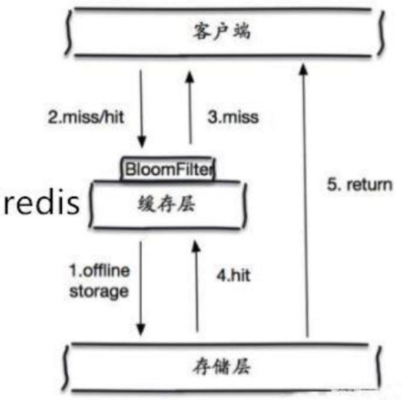
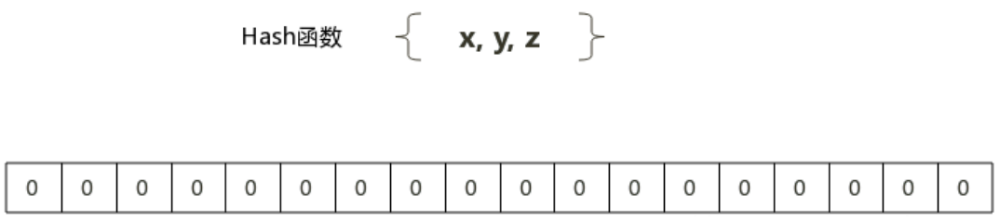
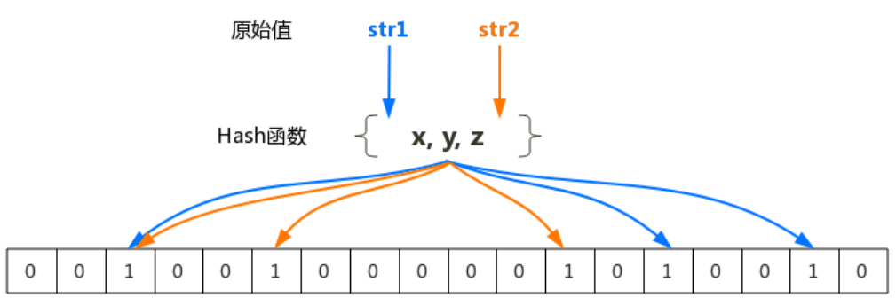
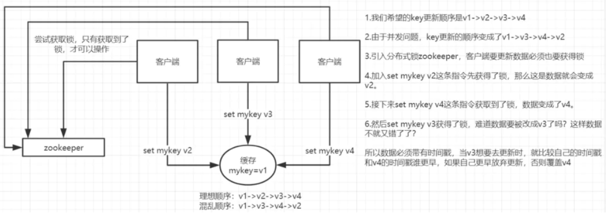
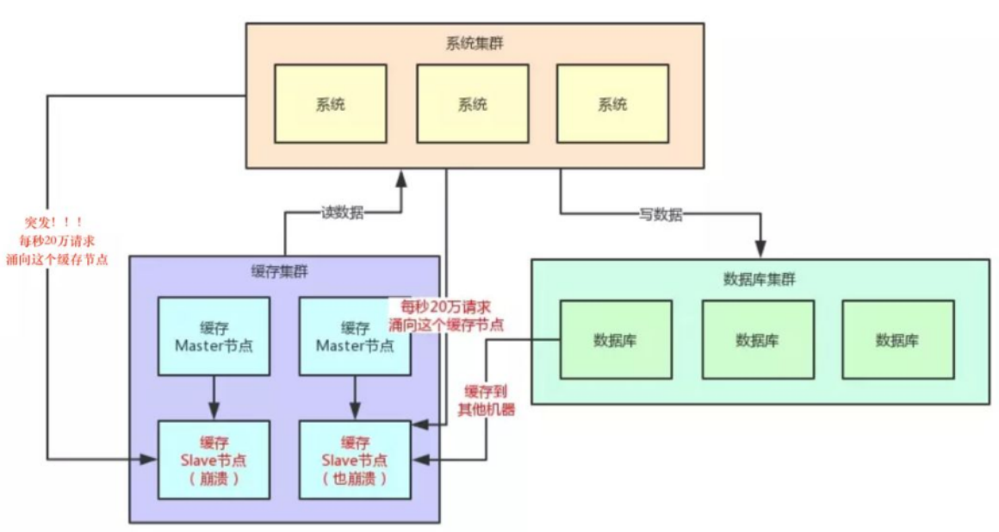
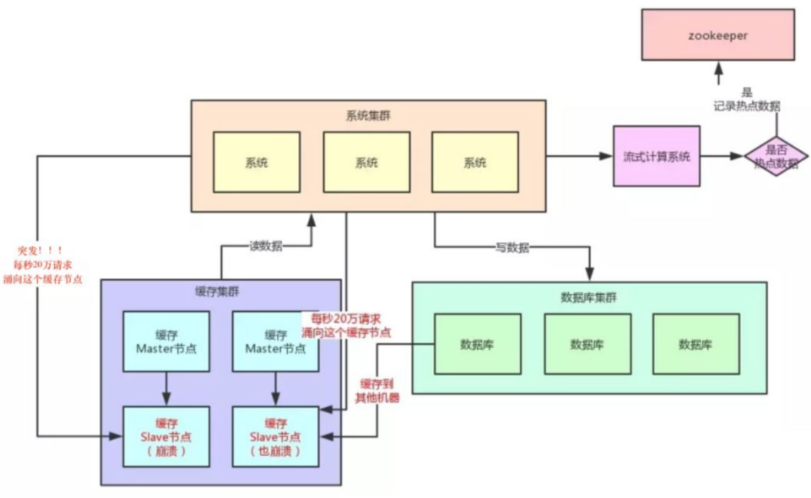
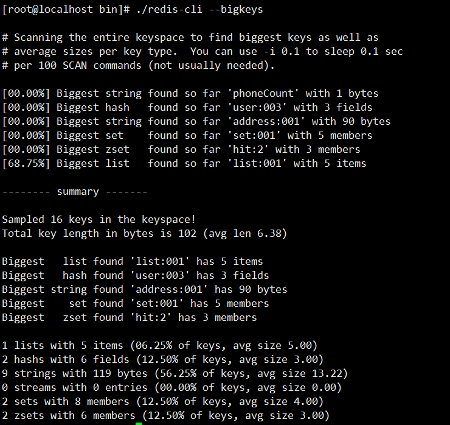
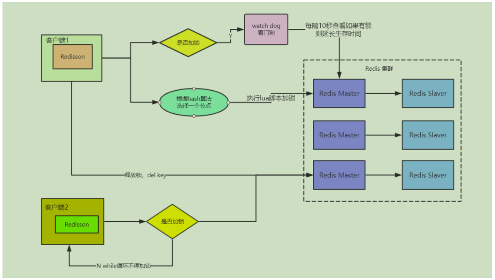
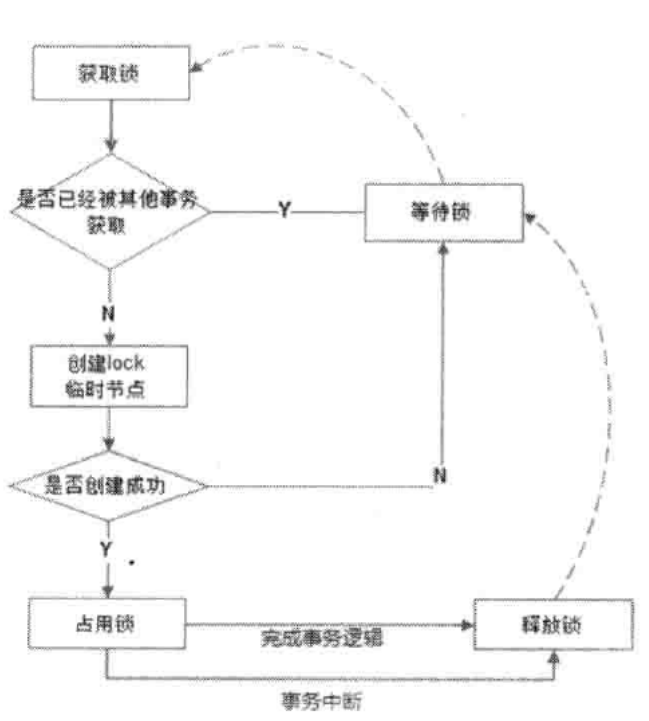

第四部分 Redis企业实战

# 14 架构设计

## 14.1 组件选择/多级

缓存的设计要分多个层次，在不同的层次上选择不同的缓存，包括JVM缓存、文件缓存和Redis缓存

### 14.1.1 JVM缓存

JVM缓存就是本地缓存，设计在应用服务器中（tomcat）。

通过可以采用Ehcache和Guava Cache，在互联网中，由于要处理高并发，通常选择Guava Cache。

适用本地（JVM）缓存的场景：

1. 对性能有非常高的要求。
2. 不经常变化
3. 占用内存不大
4. 有访问整个集合的需求
5. 数据允许不实时一致

### 14.1.2 文件缓存

这里的文件缓存是基于http协议的文件缓存，一般放在nginx中。

因为静态文件（比如css，js，图片）中，很多都是不经常更新的。nginx适用proxy_cache将用户的请求缓存到本地一个目录。下一个相同请求可以直接调取缓存文件，就不用去请求服务器了。

```properties
server {
    listen       80 default_server;        
    server_name  localhost;
    root /mnt/blog/;        
    location / {
    }
    #要缓存文件的后缀，可以在以下设置。
    location ~ .*\.(gif|jpg|png|css|js)(.*) {
        proxy_pass http://ip地址:90;
        proxy_redirect off;
        proxy_set_header Host $host;
        proxy_cache cache_one;
        proxy_cache_valid 200 302 24h;
        proxy_cache_valid 301 30d;
        proxy_cache_valid any 5m;                
        expires 90d;
        add_header wall  "hello lagou.";      
    }
 }
```


### 14.1.3 Redis缓存

分布式缓存，采用主从 + 哨兵或RedisCluster的方式缓存数据库的数据。

在实际开发中，作为数据库适用，数据要完整；作为缓存适用，作为Mybatis的二级缓存适用；

## 14.2 缓存大小

GuavaCache的缓存设置方式：

```java
CacheBuilder.newBuilder().maximumSize(num)	//超过num会按LRU算法来移除缓存
```

Nginx的缓存设置方式：

```properties
http {
    ...
    proxy_cache_path /path/to/cache levels=1:2 keys_zone=my_cache:10m max_size=10g 
    inactive=60m use_temp_path=off;
    
    server {
        proxy_cache mycache; 
        location / {
            proxy_pass http://localhost:8000; 
        }
    } 
}
```

Redis 缓存设置

```properties
maxmemory=num	#最大缓存容量	一般为内存的3/4
maxmemory-policy allkeys-lru
```

### 14.3.1 缓存淘汰策略的选择

- allkeys-lru：在不确定时一般采用策略。冷热数据交换
- volatile-lru：比allkeys-lru性能差，需要存过期时间
- allkeys-random：希望请求符合平均分布（每个元素以相同的概率被访问）
- 自己控制：volatile-ttl（把过期时间设置小一点）

## 14.3 key数量

官方说Redis单例能处理key：2.5亿个

一个key或是value大小 最大是512M

## 14.4 读写峰值

Redis采用的是基于内存的，采用的是单进程单线程模型的KV数据库，又C语言编码，官方提供的数据是可以达到110000+的QPS（每秒内查询次数）。80000的写


## 14.5 命中率

命中：可以直接通过缓存获取到需要的数据。

不命中：无法直接通过缓存获取到想要的数据，需要再次查询数据库或者执行其他的操作。其原因可能是由于缓存中根本不存在，挥着缓存已经过期。

通常来讲，缓存的命中率越高则表示适用缓存的收益越高，应用的性能越好（响应时间越短，吞吐量越高），抗并发的能力越强。

由此可见，在高并发的互联网系统中，缓存的命中率是至关重要的指标。

通过info命令可以监控服务器状态：

```shell
127.0.0.1:6379> info 
# Server
redis_version:5.0.5
redis_git_sha1:00000000
redis_git_dirty:0
redis_build_id:e188a39ce7a16352
redis_mode:standalone
os:Linux 3.10.0-229.el7.x86_64 x86_64 arch_bits:64
#缓存命中
keyspace_hits:1000  
#缓存未命中
keyspace_misses:20 
used_memory:433264648  
expired_keys:1333536  
evicted_keys:1547380
```


命中率 = 1000/(1000+20) = 83%

一个缓存失效的机制，和过期时间设计良好的系统，命中率可以做到95%以上。

影响命中率的因素：

1. 缓存的数量越少命中率越高，比如缓存单个对象的命中率要高于缓存集合
2. 过期时间越长命中率越高
3. 缓存越大，缓存的对象越多，则命中的越多

## 14.6 过期策略

参考上一部分的**删除策略**

## 14.7 性能监控指标

利用info命名就可以了解Redis的状态了，主要监控指标有：

```yaml
connected_clients:68				#连接的客户端数量
used_memory_rss_human:847.62M 		#系统给redis分配的内存
used_memory_peak_human:794.42M  	#内存使用的峰值大小
total_connections_received:619104 	#服务器已接受的连接请求数量
instantaneous_ops_per_sec:1159 		#服务器每秒钟执行的命令数量     qps
instantaneous_input_kbps:55.85 		#redis网络入口kps
instantaneous_output_kbps:3553.89 	#redis网络出口kps
rejected_connections:0 				#因为最大客户端数量限制而被拒绝的连接请求数量 
expired_keys:0 						#因为过期而被自动删除的数据库键数量
evicted_keys:0 						#因为最大内存容量限制而被驱逐（evict）的键数量 
keyspace_hits:0 					#查找数据库键成功的次数
keyspace_misses:0 					#查找数据库键失败的次数
```

Redis监控平台：

grafana、prometheus以及redis_exporter。

## 14.8 缓存预热

缓存预热就是系统启动前，提前将相关的缓存数据直接加载到缓存系统。避免在用户请求的时候，先查询数据，然后再将数据缓存的问题！用户直接查询事先被预热的缓存数据。

加载缓存思路：

- 数据量不大，可以在项目启动的时候自动进行加载
- 利用定时任务刷新缓存，将数据库的数据刷新到缓存中

# 15 缓存问题

## 15.1 缓存穿透

一般的缓存西永，都是按照key去缓存查询，如果不存在对应的value，就应该去后端系统查找（比如DB）。

缓存穿透是指在高并发下查询key不存在的数据（不存在的key），会穿过缓存查询数据库。导致数据库压力过大而宕机。

解决方案：

- 对查询结果为空的情况也进行缓存，缓存时间（ttl）设置短一点，或者该key对应的数据insert了之后清理缓存。

  问题：*缓存太多，空值占用了更多的空间*

- 使用布隆过滤器。在缓存之前再加一层布隆过滤器，在其查询的时候先去布隆过滤器查询key是否存在，如果不存在就直接返回，存在再查询缓存和DB。




布隆过滤器（Bloom Filter）是1970年由布隆提出的，它实际上是一个很长的二进制和一系列随机hash映射函数。

布隆过滤器可以用于检索一个元素是否在一个集合中。它的优点是空间效率和查询时间都远远超过一般的算法。





布隆过滤器的原理是，当一个元素被加入集合时，通过K个Hash函数将这个元素映射成一个数组中的K个点，把它们置为1。检索时，只需要看看这些点是不是都是1就大约知道集合中有没有它了：如果这些点有任何一个0，则被检元素一定不在；如果都是1，则被检元素很可能存在。这就是布隆过滤器的基本思想。

## 15.2 缓存雪崩

当缓存服务器重启或者大量缓存集中在某一个时间段失效，这样在失效的时候，也会给后端系统（比如DB）带来很大压力。

突然间大量的key失效或Redis重启，大量访问数据库，数据库崩溃

解决方案：

1. key的失效期分散开，不同的key设置不同的有效期
2. 设置二级缓存（数据不一定一致）
3. 高可用（脏读）

## 15.3 缓存击穿

对于一些设置了过期时间的key，如果这些key可能会在某些时间点被超高并发地访问，是一种非常“热点”的数据。这个时候，需要考虑一个问题：缓存被“击穿”的问题，这个和缓存雪崩的区别在于这里神对某一个key缓存，前者则是很多key。

缓存在某个时间点过期的时候，恰好在这个时间点对Key有大量的并发请求过来，这些请求发现缓存过期一般都会从后端DB加载数据并回设到缓存，这个时候大量的请求可能会瞬间把后端DB压垮。

解决方案：

1. 用分布式锁控制访问的线程

   使用Redis的setnx互斥锁进行判断，这样其他线程就处于等待状态，保证不会有大量并发操作去操作数据库。

2. 不设置超时时间，volatile-lru但还会造成写一致性问题

   当数据库发生更新时，缓存中的数据不会及时更新，这样会造成数据库中的数据与缓存中的数据不一致，应用会从缓存中读取到脏数据。可采用**延时双删**策略处理。

## 15.4 数据不一致

缓存和DB数据不一致的根源：数据源不一样

> 如何解决：
>
> 强一致性很难，追求最终一致性（时间）
>
> 互联网业务处理的特点：
>
> - 高吞吐量
> - 低延迟
> - 数据敏感度低于金融业
>
> 时序控制是否可行？
>
> 先更新数据库再更新缓存 或者 先更新缓存再更新数据库
>
> 本质上不是一个原子操作，所以时序控制不可行
>
> 高并发情况下会产生不一致

**保证数据的最终一致性（延时双删）**

1. 先更新数据库 同时 删除缓存项（key），等到读取的时候再去填充缓存
2. 2秒后再删除一次缓存项（key）（一般2秒后DB已经commit）
3. 设置缓存过期时间Expired Time（比如10s或1h）。
4. 将缓存删除失败记录到日志中，利用脚本提取失败记录，再次删除（在缓存失效期较长 eg:7*24）

**升级方案**

通过数据库的binlog来异步淘汰key，利用工具（canal）将binlog日志采集发送到MQ中，然后通过ACK机制确认处理删除缓存。

## 15.5 数据并发竞争

这里的并发指的是多个Redis的Client同时set 同一个key引起的并发问题。

> 多客户端（Jedis）同时并发写一个Key，一个key的值是1，应该按顺序2、3、4，最后是4。但是顺序变成了4、3、2，最后变成了2。

**第一种方案：分布式锁 + 时间戳**

> 1.整体技术方案

在这种情况下，主要是准备一个分布式锁，大家去抢，抢到锁就做set操作。

加锁的目的，实际上就是把并行读写 改成 串行读写的方式，从而避免资源竞争。



> 2.Redis分布式锁的实现

主要用到的Redis函数setnx()

用SETNX实现分布式锁，时间戳

由于上面举的例子，要求key的操作，需要顺序执行，所以需要保存一个时间戳判断set顺序。

> 系统A key 1 {Value 7:00}
>
> 系统B key 1 {Value 7:05}

假设系统B先抢到锁，将key1设置为{Value 7:05}。接下来系统A抢到锁，发现自己的key1的时间戳早于缓存中的时间戳（7:00 < 7:05），那就不做set操作了。


**第二种方案：利用消息队列**

在并发量过大的情况下，可以通过消息中间件进行处理，把并行读写进行串行化。

把Redis的set操作放在队列中，使其串行化，必须一个一个执行。

## 15.6 Hot Key

当有大量的请求（几十万）访问某个Redis某个Key时，由于流量集中达到网络上线，从而导致这个**Redis的服务器宕机**，造成**缓存击穿**，接下来对这个key的访问，将直接访问数据库，造成数据库崩溃；或者访问数据库回填Redis，再访问Redis，继续崩溃。



**如何发现热key**

1. 预估热key，比如秒杀的商品，火爆的新闻等
2. 在客户端进行统计，（实现简单，加一行代码即可）
3. 如果是Proxy，比如Codis，可以在Proxy端收集
4. 利用Redis自带的命令，monitor、hotkeys。（但是执行缓慢，不建议使用）
5. 利用基于大数据领域的流式计算技术来实现实时数据访问次数的统计，比如Storm，Spark Streaming、Flink，这些技术都是可以的。发现热点数据后可以写到zookeeper中。



**如何处理热Key**:

1. 变分布式缓存为本地缓存

   发现热Key后，把缓存数据取出后，直接加载到本地缓存中。可以采用Ehcache、Guava Cache等，这样系统在访问热key数据时，就可以直接访问自己的缓存了。（数据不要求实时一致）

2. 在每个Redis主节点上备份热Key数据，这样在读取时可以采用随机读取的方式，将访问压力负载到每个Redis上。

3. 利用对热点数据访问的限流熔断保护措施

   每个系统实例每秒最多请求缓存集群的读操作不超过400次，已超过就可以熔断，不让请求缓存集群。直接返回一个空白消息，然后用户稍后自行再次刷新页面之类。（首页不可行，系统友好性差）

   通过系统层自己直接加限流熔断保护措施，可以很好的保护后面的缓存集群。

## 15.7 Big Key

大key指的是存储的值（Value）非常大，常见场景：

- 热门话题下的讨论
- 大V的粉丝列表
- 序列化后的图片
- 没有及时处理的垃圾数据

...

大key的影响：

- 大key会大量占用内存，在集群中无法均衡
- Redis的性能下降，主从复制异常
- 在主动删除或过期删除时，会操作时间过长而引起服务阻塞


如何发现大key：

1. redis-cli --bigkeys命令。可以找到某个实例5种数据类型（list、hash、string、set、zset）的最大key。

   但如果Redis的key比较多，执行该命令会比较慢。

   

2. 获取生产Redis的rdb文件，通过rdbtools分析rdb生成csv文件，再导入MySQL或其他数据库中进行分析统计，根据size_in_byte统计bigkey。


**大key的处理**：

优化big key的原则就是string减少字符串长度，list、hash、set、zset等减少成员数。

1. string类型的big key，尽量不要存入Redis，可以使用文档型数据库MongoDB或缓存到CDN上。如果必须用Redis存储，最好单独存储，不要和其他的key一起存储。采用一主一从或多从。

2. 单个简单的key存储的value很大，可以尝试将对象拆成几个key-value，使用mget获取值，这样分拆的意义在于拆分单词操作的压力，将操作压力平摊到多次操作中，降低对Redis的IO影响。

3. hash、set、zset、list中存储过多的元素，可以将这些元素拆分。（常见）

   ```
   以hash类型举例来说，对于field过多的场景，可以根据field进行hash取模，生成一个新的key，
   例如 原来的
   hash_key:{filed1:value, filed2:value, filed3:value ...}，可以hash取模后形成如下 key:value形式
   hash_key:1:{filed1:value}
   hash_key:2:{filed2:value}
   hash_key:3:{filed3:value}
   ...
   取模后，将原先单个key分成多个key，每个key filed个数为原先的1/N
   ```

4. 删除大key时，不要使用del，因为del是阻塞命令，删除时会影响性能。

5. 使用lazy delete（unlink命令）

   删除指定的key(s)，若key不存在，则该key被跳过。但是，相比del会产生阻塞，该命令会在另一个线程中回收内存，因此它是非阻塞的。这也是该名字的由来：仅将keys从key空间中删除，真正的数据删除会在后续异步操作。

   ```shell
   127.0.0.1:6379> set key1 'turbo1'
   OK
   127.0.0.1:6379> set key2 'turbo2'
   OK
   127.0.0.1:6379> unlink key1 key2 key3
   (integer) 2
   ```

   

# 16 缓存与数据库一致性

## 16.1 缓存更新策略

- 利用Redis的缓存淘汰策略被动更新 LRU、LFU
- 利用TTL被动更新
- 在更新数据库时主动更新（先更新数据库再删除缓存 --- 延时双删）
- 异步更新 （使用定时任务，数据不保证实时一致，不穿DB）

## 16.2 不同策略之间的优缺点

| 策略                              | 一致性 | 维护成本 |
| --------------------------------- | ------ | -------- |
| 利用Redis的缓存淘汰策略，被动更新 | 最差   | 最低     |
| 利用TTL被动更新                   | 较差   | 较低     |
| 在更新数据库时，主动更新          | 较强   | 最高     |


## 16.3 与Mybatis整合

https://gitee.com/turboYuu/spring-boot-source-code/tree/master/spring-boot-2.2.9.RELEASE/springboot_04_cache

# 17 分布式锁

## 17.1 watch

### 17.1.1 利用Watch实现Redis乐观锁

乐观锁基于CAS（Compare And Swap）思想（比较并替换），是具有互斥性，不会产生等待而消耗资源，但是需要反复的重试，但也是因为重试的机制，能比较快的响应。因此我们可以利用Redis来实现乐观锁。具体思路如下：

1. 利用Redis的watch功能，监控这个Redis的状态值
2. 获取RedisKey的值
3. 创建Redis事务
4. 给这个key的值 +1
5. 然后去执行这个事务，如果key的值被修改过则回滚，key不加1

**Redis乐观锁实现秒杀**

https://gitee.com/turboYuu/redis-5-1/blob/master/lab/jedis_demo/src/test/java/Second.java

```java
import redis.clients.jedis.Jedis;
import redis.clients.jedis.Transaction;

import java.util.List;
import java.util.UUID;
import java.util.concurrent.ExecutorService;
import java.util.concurrent.Executors;

public class Second {
    public static void main(String[] args) {
        String redisKey = "lock";
        final ExecutorService executorService = Executors.newFixedThreadPool(20);
        final Jedis jedis = new Jedis("192.168.31.135", 6379);
        jedis.set(redisKey,"0");
        jedis.close();

        for (int i = 0; i < 1000; i++) {
            executorService.execute(()->{
                final Jedis jedis1 = new Jedis("192.168.31.135", 6379);
                try {
                    jedis1.watch(redisKey);
                    final String redisValue = jedis1.get(redisKey);
                    int valInteger = Integer.valueOf(redisValue);
                    final String userInfo = UUID.randomUUID().toString();
                    if(valInteger < 20){
                        final Transaction tx = jedis1.multi();
                        tx.incr(redisKey);
                        final List<Object> list = tx.exec();
                        if(list != null && list.size() > 0){
                            System.out.println("用户："+userInfo + ".秒杀成功！当前成功人数："+(valInteger + 1));

                        }else {
                            System.out.println("用户："+userInfo + ".秒杀失败");
                        }
                    }else{
                        System.out.println("已经有20人秒杀成功，秒杀结束");
                    }
                } catch (NumberFormatException e) {
                    e.printStackTrace();
                }finally {
                    jedis1.close();
                }

            });

        }
        executorService.shutdown();
    }
}
```


## 17.2 setnx

### 17.2.1 实现原理

共享资源互斥

共享资源串行化

单应用中使用锁：（单进程多线程）

synchronized、ReentrantLock

分布式应用中使用锁：（多进程多线程）

分布式锁是控制分布式系统之间同步访问，共享资源的一种方式。

利用Redis的单线程特性对共享资源进行串行化处理

### 17.2.2 实现方式

> 获取锁

方式1（**使用set命令实现**） -- 推荐

```java
/**
* 使用redis的set命令实现获取分布式锁 
* @param lockKey   可以就是锁
* @param requestId     请求ID，保证同一性        uuid+threadID 
* @param expireTime    过期时间，避免死锁
* @return */
public  boolean getLock(String lockKey,String requestId,int expireTime) { 
    //NX:保证互斥性
    // hset  原子性操作  只要lockKey有效  则说明有进程在使用分布式锁
    String result = jedis.set(lockKey, requestId, "NX", "EX", expireTime); 
    if("OK".equals(result)) {
        return true; 
    }
    return false; 
}
```

方式2 （使用setnx命令实现）-- 并发会产生问题

```java
public  boolean getLock(String lockKey,String requestId,int expireTime) { 
    Long result = jedis.setnx(lockKey, requestId);
    if(result == 1) {
        //成功设置  进程down  永久有效    别的进程就无法获得锁
        jedis.expire(lockKey, expireTime); 
        return true;
    }
    return false; 
}
```

> 释放锁

方式1（del命令实现） -- 并发

```java
/**
* 释放分布式锁
* @param lockKey 
* @param requestId
*/
public static void releaseLock(String lockKey,String requestId) {    
    if (requestId.equals(jedis.get(lockKey))) {
        jedis.del(lockKey);  
    }
}
```

```
问题在于如果调用jedis.del()方法的时候，这把锁已经不属于当前客户端的时候会解除其他人加的锁。
比如：客户端A加锁，一段时间之后客户端A解锁，在执行jedis.del()之前，锁突然过期了，此时客户端B尝试加锁成功，
然后客户端A再执行del()方法，则客户端B的锁给解除了。
```

方式2（**redis+lua脚本实现**）-- 推荐

```java
public static boolean releaseLock(String lockKey, String requestId) {
    String script = "if redis.call('get', KEYS[1]) == ARGV[1] "+
            "then return redis.call('del', KEYS[1]) "+
            "else return 0 end";
    Object result = jedis.eval(script, Collections.singletonList(lockKey),
                               Collections.singletonList(requestId));
    if (result.equals(1L)) {
        return true; 
    }
    return false;
}
```


### 17.2.3 存在问题

单机 -- 无法保证高可用

主从 -- 无法保证数据的强一致性，在主机宕机时会造成锁的重复获得。


无法续租 -- 超过expire time后，不能续租

### 17.2.4 本质分析

CAP模型分析

在分布式环境下，不可能满足三者共存们只能满足其中的两者共存，在分布式下P不能舍弃（舍弃P就是单机）。

所以只能是CP（强一致性模型）和AP（高可用模型）

分布式锁是CP模型，Redis集群是AP模型。（base）

Redis集群不能保证数据的实时一致性，只能保证数据的最终一致性。

> 为什么还可以用Redis实现分布式锁？

与业务有关，当业务不需要数据强一致性时，比如：社交场景，就可以使用Redis实现分布式锁；当业务必须要数据的强一致性，即不允许重复获得锁，比如金融场景，就不要使用，可以使用CP模型实现，比如zookeeper和etcd。

## 17.3 Redisson分布式锁的使用

Redission是架设在Redis基础上的一个Java驻内存数据网格（In-Memory Data Grid）

Redission在基于NIO的Netty框架上，生产环境使用分布式锁。

**加入jar包**

```xml
<dependency>
    <groupId>org.redisson</groupId>        
    <artifactId>redisson</artifactId>         
    <version>2.7.0</version> 
</dependency>
```

配置Redission

```java
public class RedissonManager {
    private static Config config = new Config();    
    //声明redisso对象
    private static Redisson redisson = null;   
    //实例化redisson
    static{
        config.useClusterServers() 
        // 集群状态扫描间隔时间，单位是毫秒    
            .setScanInterval(2000)
       //cluster方式至少6个节点(3主3从，3主做sharding，3从用来保证主宕机后可以高可用)    
            .addNodeAddress("redis://127.0.0.1:6379" )
            .addNodeAddress("redis://127.0.0.1:6380")    
            .addNodeAddress("redis://127.0.0.1:6381")    
            .addNodeAddress("redis://127.0.0.1:6382")    
            .addNodeAddress("redis://127.0.0.1:6383")    
            .addNodeAddress("redis://127.0.0.1:6384");          
        //得到redisson对象
        redisson = (Redisson) Redisson.create(config);
    }
    //获取redisson对象的方法
    public static Redisson getRedisson(){        
        return redisson;
    }
}
```

锁的获取和释放

```java
public class DistributedRedisLock {   
    //从配置类中获取redisson对象
    private static Redisson redisson = RedissonManager.getRedisson();    
    private static final String LOCK_TITLE = "redisLock_";
    //加锁
    public static boolean acquire(String lockName){       
        //声明key对象
        String key = LOCK_TITLE + lockName;       
        //获取锁对象
        RLock mylock = redisson.getLock(key);
        //加锁，并且设置锁过期时间3秒，防止死锁的产生 uuid+threadId        
        mylock.lock(2,3,TimeUtil.SECOND);
        //加锁成功
       return  true;  
    }
 
    //锁的释放
    public static void release(String lockName){       
        //必须是和加锁时的同一个key
        String key = LOCK_TITLE + lockName;       
        //获取所对象
        RLock mylock = redisson.getLock(key);      
        //释放锁（解锁）
        mylock.unlock();  
    }
}
```

**业务逻辑中使用分布式锁**

```java
public String discount() throws IOException{         
    String key = "lock001";
    //加锁
    DistributedRedisLock.acquire(key);        
    //执行具体业务逻辑
    dosoming        
    //释放锁
    DistributedRedisLock.release(key);       
    //返回结果
    return soming;  
}
```

### 17.3.1 Redission分布式锁的实现原理



#### 17.3.1.1 加锁机制

如果该客户端面对的是一个Redis Cluster集群，首先会根据hash节点选择一套机器。

发送lua脚本到Redis服务器，脚本如下：

```lua
"if (redis.call('exists',KEYS[1])==0) then "+             --看有没有锁
    "redis.call('hset',KEYS[1],ARGV[2],1) ; "+            --无锁 加锁          
    "redis.call('pexpire',KEYS[1],ARGV[1]) ; "+            
    "return nil; end ;" +
"if (redis.call('hexists',KEYS[1],ARGV[2]) ==1 ) then "+  --我加的锁
    "redis.call('hincrby',KEYS[1],ARGV[2],1) ; "+  --重入锁 
    "redis.call('pexpire',KEYS[1],ARGV[1]) ; "+    
    "return nil; end ;" +
"return redis.call('pttl',KEYS[1]) ;"  --不能加锁，返回锁的时间
```

lua的作用；保证这段复杂业务逻辑执行的原子性。

lua的解释：

>KEYS[1]：加锁的key
>
>ARGV[1]：key的生存时间，默认为30秒
>
>ARGV[2]：加锁的客户端ID（`(UUID.randomUUID()) + “:” + threadId)`）

第一段if判断语句，就是用`exists myLock`命令判断一下，如果你要加锁的那个key不存在的话，你就进行加锁。如何加锁，用下面命令

`hset myLock 8743c9c0-0795-4907-87fd-6c719a6b4586:1 1`

通过这个命令设置了一个hash数据结构，这行命令执行后，会出现一个类似下面的数据结构：

myLock:{"8743c9c0-0795-4907-87fd-6c719a6b4586:1":1}

上述就代表"8743c9c0-0795-4907-87fd-6c719a6b4586:1"这个客户端对“myLock”这个锁key完成了加锁。

接着会执行`pexpire myLock 30000`命令，设置myLock这个锁的生存时间是30秒。


#### 17.3.1.2 锁互斥机制

那么在这个时候如果客户端2来尝试加锁，执行了同样的一段lua脚本，会如何？

很简单，第一个 `if` 判断会执行`exists myLock`，发现myLock这个锁key已经存在了。

接着第二个 `if` 判断一个，myLock锁 key的hash数据结构中，是否包含客户端 2 的ID，但是明显不是，因为那里包含的是客户端1的ID。

所以，客户端2会获取到 `pttl myLock`返回的一个数字，这个数字代表了myLock这个锁 key 的**剩余生存时间**。此时客户端2会进入一个while循环，不断尝试加锁。

#### 17.3.1.3 自动延时机制

只要客户端1 一旦加锁成功，就会启动一个watch dog看门狗，它是一个后台线程，每隔10秒检查一下，如果客户端1还持有锁key，那么就会不断地延长锁 key 的生存时间。

#### 17.3.1.4 可重入锁机制

第一个 `if`判断 不成立，exists myLock会显示锁 key 已经存在了。

第二个 `if` 判断会成立，因为 myLock的hash数据结构中包含的那个ID，就是客户端1的那个ID，也就是"8743c9c0-0795-4907-87fd-6c719a6b4586:1"。

此时就会执行可重入锁的逻辑，它会用：

`incrby myLock 8743c9c0-0795-4907-87fd-6c719a6b4586:1 1`

通过这个命令，对客户端1的加锁次数，累加1。数据结构会变成：

myLock:{"8743c9c0-0795-4907-87fd-6c719a6b4586:1":2}


#### 17.3.1.5 释放锁机制

执行lua脚本如下：

```lua
#如果key已经不存在，说明已经被解锁，直接发布（publish）redis消息 
"if (redis.call('exists', KEYS[1]) == 0) then " +
        "redis.call('publish', KEYS[2], ARGV[1]); " +                        
        "return 1; " +
    "end;" +
# key和field不匹配，说明当前客户端线程没有持有锁，不能主动解锁。  不是我加的锁 不能解锁
    "if (redis.call('hexists', KEYS[1], ARGV[3]) == 0) then " +                        
        "return nil;" +
    "end; " + 
# 将value减1
    "local counter = redis.call('hincrby', KEYS[1], ARGV[3], -1); " +
# 如果counter>0说明锁在重入，不能删除key
    "if (counter > 0) then " +
        "redis.call('pexpire', KEYS[1], ARGV[2]); " +                        
        "return 0; " +
# 删除key并且publish 解锁消息                    
    "else " +
        "redis.call('del', KEYS[1]); " +  #删除锁
        "redis.call('publish', KEYS[2], ARGV[1]); " +                        
        "return 1; "+
        "end; " +
        "return nil;",
```

- KEYS[1]：需要加锁的key，这里需要是字符串类型。
- KEYS[2]：Redis消息ChannelName，一个分布式锁对应唯一一个ChannelName:"redission_lock**channel**{"+getName()+"}"
- ARGV[1]：redis消息体，这里只需要一个字节的标记就可以，主要标记redis的key已经解锁，再结合redis的Subscribe，能唤醒其他订阅解锁消息的客户端线程申请锁。
- ARGV[2]：锁的超时时间，防止死锁
- ARGV[3]：锁的唯一标识，也就是刚才介绍的id（`(UUID.randomUUID()) + “:” + threadId)`）

如果执行lock.unlock()，就可以释放分布式锁，此时的业务逻辑也是非常简单的。就是每次都对myLock数据结构中的那个加锁次数减1。

如果发现加锁此时是0，说明这个客户端已经不再持有锁了，此时就会用：`del myLock`命令，从redis里删除这个key。然后，另外的客户端2就可以尝试完成加锁了。

## 17.4 分布式锁特征

- 互斥性

  任意时刻，只能有一个客户端获取锁，不能同时有两个客户端获取到锁

- 同一性

  锁只能被持有该锁的客户端删除，不能由其他客户端删除

- 可重入性

  持有某个锁个客户端可继续对该锁加锁，实现锁的续租

- 容错性

  锁失效后（超过生命周期）自动释放锁（key失效），其他客户端可以继续获的该锁，防止死锁

## 17.5 分布式锁的实际应用


## 17.6 Zookeeper分布式锁的对比

- 基于Redis的set实现分布式锁

- 基于zookeeper临时节点的分布式锁

  

- 基于etcd实现


# 18 分布式集群架构中的session分离

利用**spring-session-data-redis**（SpringSession），可以实现**基于redis来实现session分离**。

# 19 阿里Redis使用手册

## 19.1 键值设计

## 19.2 命令使用

## 19.3 客户端使用

## 19.4 相关工具

## 19.5 删除bigkey