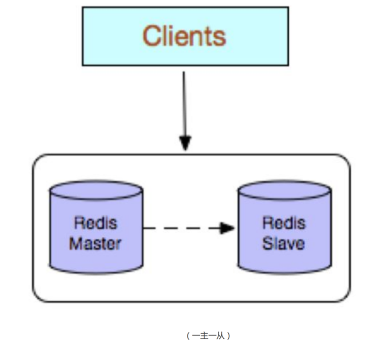
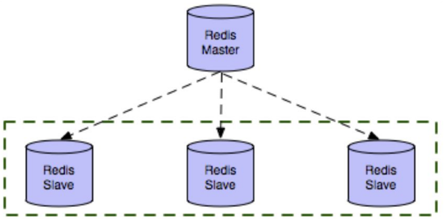
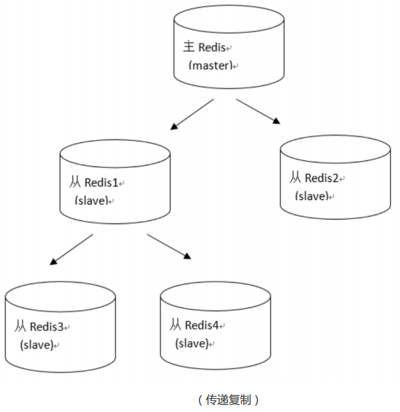

第五部分 Redis高可用方案

# 20 主从复制

Redis支持主从复制功能，可以通过执行slaveof（Redis 5 以后改成replicaof）或者配置文件中设置slaveof（Redis 5以后改成replicaof）来开启复制功能。







- 主对外 从对内，主可写，从不可写
- 主挂了，从不可为主

## 20.1 主从配置

**主Redis配置**

无需特殊配置

**从Redis配置**

修改从服务器上的`redis.conf`文件：

```properties
# replicaof <masterip> <masterport>
# 表示当前【从服务器】对应的【主服务器】的ip是192.168.31.135，端口号是6379
replicaof 127.0.0.1 6379
```


```shell
127.0.0.1:6380> set lock 20
(error) READONLY You can't write against a read only replica.
```


## 20.2 作用

### 20.2.1 读写分离

一主多从，主从同步

主负责写，从负责读

提升Redis的性能和吞吐量

主从的数据一致性问题


### 20.2.2 数据容灾

从机是主机的备份

# 21 哨兵模式

# 22 集群与分区