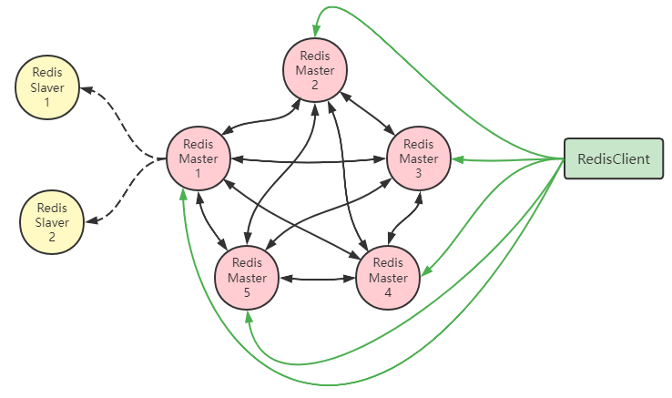
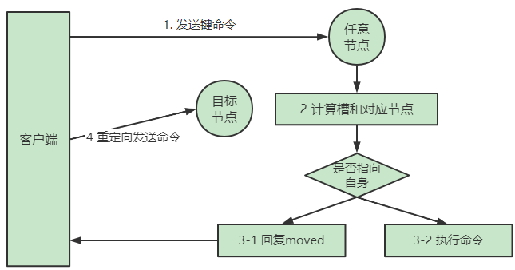
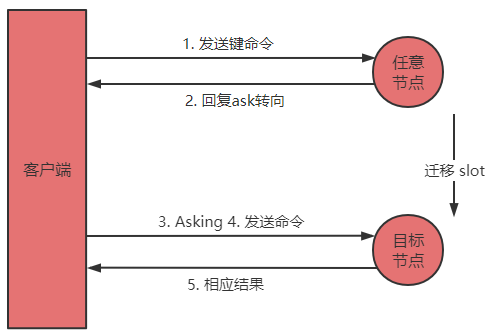
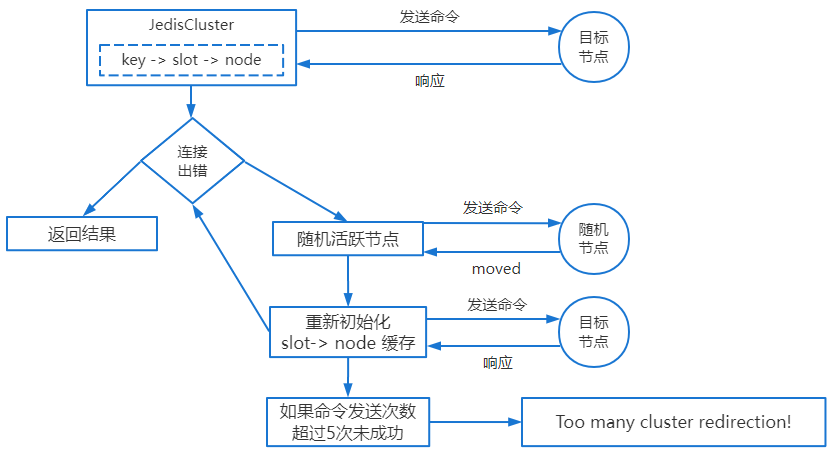
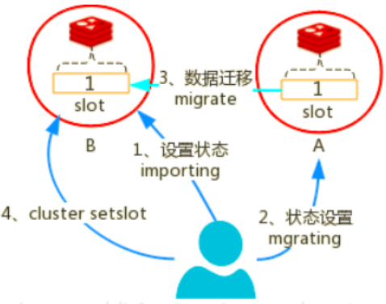
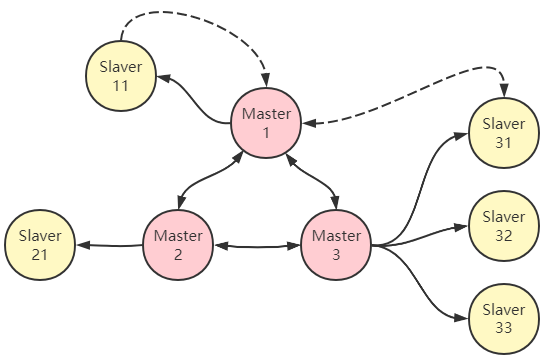

> 第五部分 Redis高可用方案

"高可用性"（High Availability）通常来描述一个系统经过专门的设计，从而减少停工时间，而保持其服务的高度可用性。

单机的 Redis 是无法保证高可用性的，当 Redis 服务器宕机后，即使在有持久化的机制下也无法保证不丢失数据。

所以我们采用 Redis 多机和集群的方式来保证 Redis 的高可用性。

# 1 主从复制

Redis支持主从复制功能，可以通过执行slaveof（Redis 5 以后改成replicaof）或者配置文件中设置slaveof（Redis 5以后改成replicaof）来开启复制功能。


- 主对外 从对内，主可写，从不可写
- 主挂了，从不可为主

## 1.1 主从配置

### 1.1.1 主Redis配置

无需特殊配置

### 1.1.2 从Redis配置

（安装后的redis 使用  `cp -r redis redis-slave-6380` 复制出一个redis）

修改从服务器上的`redis.conf`文件：

```properties
# replicaof <masterip> <masterport>
# 表示当前【从服务器】对应的【主服务器】的ip是192.168.31.135，端口号是6379
replicaof 127.0.0.1 6379
```

```bash
[root@localhost bin]# ./redis-cli -p 6380
127.0.0.1:6380> set lock 20
(error) READONLY You can't write against a read only replica.
```

## 1.2 作用

### 1.2.1 读写分离

- 一主多从，主从同步。

- 主负责写，从负责读。

- 提升Redis的性能和吞吐量。

- 主从的数据一致性问题。

### 1.2.2 数据容灾

- 从机是主机的备份。
- 主机宕机，从机可读不可写。
- 默认情况下主机宕机后，从机不可为主机。
- 利用**哨兵**可以实现主从切换，做到高可用。

## 1.3 原理与实现

### 1.3.1 复制流程

#### 1.3.1.1 保存主节点信息

当客户端向从服务器发送 slaveof(replicaof) 主机地址（127.0.0.1）端口（6379）时：从服务器将主机IP（127.0.0.1）和 端口（6379）保存到 redisServer 的 masterhost 和 masterprot 中。

```c
Struct redisServer{
	char *masterhost; 	//主服务器ip   
	int  masterport; 	//主服务器端口 
};
```

从服务器将向发送 SLAVEOF  命令的客户端返回 OK，表示复制指令已经被接收，而实际上复制工作是在 OK 返回之后进行。

#### 1.3.1.2 建立 socket 链接

slaver 与 master 建立 socket 链接。

slaver 关联文件事件处理器。

该处理器接收 RDB 文件（全量复制）、接收 Master 传播来的写命令（增量复制）


主服务器 accept 从服务器 socket 连接后，创建相应的客户端状态。相当于从服务器是主服务器的 Client 端。


#### 1.3.1.3 发送 ping 命令

**Slaver 向 Master 发送 ping 命令**

1. 检测 socket 的读写状态
2. 检测 Master 能否正常处理

**Master 的响应**：

1. 发送 “pong” ，说明正常
2. 返回错误，说明 Master 不正常
3. timeout，说明网络超时


#### 1.3.1.4 权限验证

主从正常连接后，进行权限验证

**主**未设置密码（requirepass=""），**从** 也不用设置密码（masterauth=""）

**主**设置密码（requirepass!=""）， **从**需要设置密码（masterauth=主的requirepass的值）

或者 **从** 通过 auth 命令向 **主** 发送密码。


#### 1.3.1.5 发送端口信息

在身份验证步骤之后，从服务器将执行命令 REPLCONF listening-port，向主服务器发送从服务器的监听端口号。


#### 1.3.1.6 同步数据

Redis 2.8 之后分为全量同步 和 增量同步，具体的后面详细讲解。

#### 1.3.1.7 命令传播

当同步数据完成后，主从服务器就会进入命令传播阶段，主服务器只要将自己执行的写命令发送给从服务器，而从服务器只要一直执行并接收主服务器发来的写命令。

### 1.3.2 同步数据集

Redis 2.8 以前使用 SYNC 命令同步复制

Redis 2.8 之后使用 PSYNC 命令替换 SYNC

#### 1.3.2.1 旧版本

Redis 2.8 以前

##### 1.3.2.1.1 实现方式

Redis 的同步功能分为 同步（sync）和 命令传播（command propagate）

###### 1.3.2.1.1.1 同步操作

1. 通过从服务器发送到 SYNC 命令给主服务器
2. 主服务器生成 RDB 文件并发送给从服务器，同时发送保存所有写命令给从服务器
3. 从服务器清空之前数据并执行解析 RDB 文件。
4. 保持数据一致（还需要命令传播过程才能保持一致）


###### 1.3.2.1.1.2 命令传播操作

同步操作完成后，主服务器执行写命令，该命令发送给从服务器并执行，使主从保持一致。

##### 1.3.2.1.2 缺陷

没有 全量同步 和 增量同步 的概念，从服务器在同步时，会清空所有数据。

主从服务器断线后重新复制，主服务器会重新生成 RDB 文件和重新记录缓冲区的所有写命令，并全量同步到从服务器上。


#### 1.3.2.2 新版本

Redis 2.8 以后

##### 1.3.2.2.1 实现方式

在 Redis 2.8 之后使用 PSYNC 命令，具备 完整重同步 和 部分重同步 模式。

- Redis 的主从同步，分为 **全量同步** 和 **增量同步**。

- 只有从服务器第一次连接上主机是 **全量同步**。

- 断线重连有可能触发 **全量同步** 也有可能是 **增量同步**（`master` 判断 `runid` 是否一致）。

  

- 除此之外的情况都是 **增量同步**。

###### 1.3.2.2.1.1 全量同步

Redis 的 全量同步过程主要分为三个阶段：

- **同步快照阶段**：Master 创建并发送 **快照** RDB 给 Slave，Slave 载入并解析快照。Master 同时将此阶段所产生的新的写命令存储到缓冲区。
- **同步写缓冲阶段**：Master 向 Slave 同步存储在缓冲区的写操作命令。
- **同步增量阶段**：Master 向 Slave 同步写操作命令。


###### 1.3.2.2.1.2 增量同步

- Redis 增量同步主要指 Slave 完成初始化后开始正常工作时，Master 发生的写操作同步到 Slave 的过程。
- 通常情况下，Master 每执行一个写命令就会向 Slave 发送相同的 **写命令**，然后 Slave 接收并执行。

### 1.3.3 心跳检测

在命令传播阶段，从服务器默认会以每秒一次的频率向主服务器发送命令：

```properties
replconf ack <replication_offset>
    
#ack :应答
#replication_offset：从服务器当前的复制偏移量
```

主要作用有三个：

1. 检测主从的连接状态

   检测主从服务器的网络连接状态

   通过向主服务器发送 INFO replication 命令，可以列出从服务器列表，可以看出最后一次向主发送命令距离现在过了多少秒。lag 的值应该在 0 或 1 之间跳动，如果超过 1 则说明主从之间的连接有故障。

   

2. 辅助实现 min-slaves

   

   Redis 可以通过配置防止主服务器在不安全的情况下执行写命令

   min-replicas-to-write 3 （min-replicas-to-write 3）

   min-replicas-max-lag 10 （min-replicas-max-lag 10）

   上面的配置表示：从服务器的数量少于 3 个，或者3个从服务器的延迟（lag）值都大于或等于10秒时，主服务器将拒绝执行写命令。这里的延迟值就是上面 `info replication` 命令的 lag 值。

3. 检测命令丢失

   如果因为网络故障，主服务器传播给从服务器的写命令在半路丢失，那么当从服务器向主服务器发送 REPLCONF ACK 命令时，主服务器将发觉从服务器当前的复制偏移量少于自己的复制偏移量，然后主服务器就会根据从服务器提交的复制偏移量，在复制积压缓冲区里面找到从服务器缺少的数据，并将这些数据重新发送给从服务器。（补发：网络不断）。

   增量同步：网断了，再次连接

# 2 哨兵模式

哨兵（Sentinel）是 Redis 高可用性（High Availability）的解决方案：

由一个或多个 sentinel 实例组成 sentient 集群可以监视一个或多个主服务器和多个从服务器。

当主服务器进行下线状态时，sentinel 可以将主服务器下的某一从服务器升级为主服务器继续提供服务，从而保证 redis 的高可用。

## 2.1 部署方案


## 2.2 搭建配置

这里在一台机器上采用伪分布式的方式不是。（生产环境应该是多台）

根据上面的部署方案搭建如下：

Redis-Master：127.0.0.1 6379，采用安装的方式，正常安装和配置。

```bash
# 1 安装 redis 5.0
mkdir -p /usr/redis-ms/redis-master
cd redis-5.0.5/src
make install PREFIX=/usr/redis-ms/redis-master
cp /root/redis-5.0.5/redis.conf /usr/redis-ms/redis-master/bin/

# 2 修改 redis.conf
	# 将`daemonize`由`no`改为`yes`
	daemonize yes
	
	# 默认绑定的是回环地址，默认不能被其他机器访问 
	# bind 127.0.0.1
	
	# 是否开启保护模式，由yes该为no
	protected-mode no  
```

Redis-Slaver1：127.0.0.1 6380

```bash
# 在 /usr/redis-ms 目录下
cp -r redis-master redis-slaver1
# 修改配置文件
vim redis-slave1/bin/redis.conf
	port 6380
	replicaof 127.0.0.1 6379
```

Redis-Slaver2：127.0.0.1 6381

```bash
# 在 /usr/redis-ms 目录下
cp -r redis-master redis-slaver2
# 修改配置文件
vim redis-slave2/bin/redis.conf
	port 6381
	replicaof 127.0.0.1 6379
```


Redis-Sentinel1：127.0.0.1 26379

```bash
# 在 /usr/redis-ms 目录下
cp -r redis-master redis-sentinel1
# 拷贝 sentinel.conf 配置文件并修改
cp /root/redis-5.0.5/sentinel.conf /usr/redis-ms/redis-sentinel1/bin/
vim redis-sentinel1/bin/sentinel.conf

	# 哨兵sentinel实例运行的端口，默认 26379
	port 26379
	
	# 将`daemonize`由`no`改为`yes`
	daemonize yes
	
	# 哨兵 sentinel 监控的redis主节点的 ip port
	# master-name 可以自己命名的主节点名字，只能由字母 A-z、数字0-9、这三个字符“.-_” 组成。
	# quorum 当这些 quorum 个数 sentinel哨兵认为 master 主节点失联，那么这时、客观上认为主节点失联了
	# sentinel monitor <master-name> <ip> <redis-port> <quorum>
	sentinel monitor mymaster 127.0.0.1 6379 2
	
	# 当在 Redis 实例中开启了requirepass foobared 授权密码，这样所有连接Redis实例的客户端都要提供密码
	# 设置哨兵sentinel连接主从的密码，注意必须为主从设置一样的验证密码
	# sentinel auth-pass <master-name> <password>
	sentinel auth-pass mymaster MySUPER--secret-0123passw0rd
	
	# 执行多少毫秒之后，主节点没有应答哨兵sentinel此时，哨兵主观上认为主节点下线，默认30秒，改为3秒
	# sentinel down-after-milliseconds <master-name> <milliseconds>
	sentinel down-after-milliseconds mymaster 30000
	
	# 这个配置项指定了在发生failover主备切换时最多可以有多少个slave同时对新的master进行同步。
	# 这个数字越小，完成failover所需的时间就越长，
	# 但是如果这个数字越大，就意味着，多的slave因为replication而不可用
	# 可以通过将这个值设置为1，来保证每次只有一个slave处于不能处理命令请求的状态
	# sentinel parallel-syncs <master-name> <numreplicas>
	sentinel parallel-syncs mymaster 1
	
	# 故障转移的超时时间，failover-timeout 可以用在以下这些方面：
	# 1. 同一个sentinel对同一个master两次failover之间的间隔时间。
	# 2. 当一个slave从一个错误的master那里同步数据开始计算时间，直到slave被纠正为正确的master那里同步数据时。
	# 3. 当想要取消一个正在进行的failover所需的时间
	# 4. 当进行faliover时，配置所有slaves指向新的master所需多的最大时间。不过，即使过了这个超时，slaves依然会被正确配置为指向master，但是就不按parallel-syncs所配置的规则来了
	# sentinel failover-timeout <master-name> <milliseconds>
	sentinel failover-timeout mymaster 180000
```


Redis-Sentinel2：127.0.0.1 26380

```bash
cp -r redis-sentinel1/ redis-sentinel2
# 修改 sentinel.conf 配置文件
vim redis-sentinel2/bin/sentinel.conf
	port 26380
```


Redis-Sentinel3：127.0.0.1 26381

```bash
cp -r redis-sentinel1/ redis-sentinel3
# 修改 sentinel.conf 配置文件
vim redis-sentinel3/bin/sentinel.conf
	port 26381
```

配置好依次执行 redis-master、redis-slaver1、redis-slaver2、redis-sentinel1、redis-sentinel2、redis-sentinel3。

这里编写一个 start.sh 可执行文件，`chmod 77 start.sh`

```bash
vim 
cd redis-master/bin
./redis-server redis.conf
cd ..
cd ..

cd redis-slaver1/bin
./redis-server redis.conf
cd ..
cd ..

cd redis-slaver2/bin
./redis-server redis.conf
cd ..
cd ..

cd redis-sentinel1/bin
./redis-sentinel sentinel.conf
cd ..
cd ..

cd redis-sentinel2/bin
./redis-sentinel sentinel.conf
cd ..
cd ..

cd redis-sentinel3/bin
./redis-sentinel sentinel.conf
cd ..
cd ..
```

执行 start.sh 文件

```bash
[root@localhost redis-ms]# ps -ef|grep redis
root     16136     1  0 19:21 ?        00:00:00 ./redis-server *:6379
root     16141     1  0 19:21 ?        00:00:00 ./redis-server *:6380
root     16147     1  0 19:21 ?        00:00:00 ./redis-server *:6381
root     16152     1  0 19:21 ?        00:00:00 ./redis-sentinel *:26379 [sentinel]
root     16157     1  0 19:21 ?        00:00:00 ./redis-sentinel *:26380 [sentinel]
root     16159     1  0 19:21 ?        00:00:00 ./redis-sentinel *:26381 [sentinel]
root     16172  1581  0 19:21 pts/0    00:00:00 grep --color=auto redis
```

## 2.3 执行流程

### 2.3.1 启动并初始化Sentinel

Sentinel 是一个特殊的 Redis 服务器，不会进行持久化，Sentinel 实例启动后，每个 Sentinel 会创建2个连向主服务器的网络连接。

- 命令连接：用于向主服务器发送命令，并接收响应；
- 订阅连接：用于订阅主服务器的-sentinel-:hello 频道。


### 2.3.2 获取主服务器信息

Sentinel 默认每 10s 一次，向被监控的主服务器发送 info 命令，获取主服务器和其下属从服务器的信息。

```bash
127.0.0.1:6379> info
# Server
redis_version:5.0.5
os:Linux 3.10.0-1062.el7.x86_64 x86_64
run_id:27bea79ffd71f8df8edcf67671e87c5f6046b482

# Replication
role:master
connected_slaves:2
slave0:ip=127.0.0.1,port=6380,state=online,offset=207363,lag=1
slave1:ip=127.0.0.1,port=6381,state=online,offset=207363,lag=1
master_replid:d55ea3246040a638bc51aa16007bbe2ea700c908
master_replid2:0000000000000000000000000000000000000000
master_repl_offset:207496
second_repl_offset:-1
repl_backlog_active:1
repl_backlog_size:1048576
repl_backlog_first_byte_offset:1
repl_backlog_histlen:207496
```


### 2.3.3 获取从服务器信息

当 Sentinel 发现主服务器有新的从服务器出现时，Sentinel 还会向从服务器建立**命令连接**和**订阅连接**。在命令连接建立之后，Sentinel 还是默认10s 一次，向从服务器发送 info 命令，并记录从服务器的信息。


```bash
127.0.0.1:6380> info
# Server
redis_version:5.0.5
os:Linux 3.10.0-1062.el7.x86_64 x86_64
run_id:ad1245c1c981931b5515a601140ef6228dfc1673

# Replication
role:slave
master_host:127.0.0.1
master_port:6379
master_link_status:up
master_last_io_seconds_ago:0
master_sync_in_progress:0
slave_repl_offset:320280
slave_priority:100
slave_read_only:1
connected_slaves:0
master_replid:d55ea3246040a638bc51aa16007bbe2ea700c908
master_replid2:0000000000000000000000000000000000000000
master_repl_offset:320280
second_repl_offset:-1
repl_backlog_active:1
repl_backlog_size:1048576
repl_backlog_first_byte_offset:1
repl_backlog_histlen:320280
```


### 2.3.4 向主服务器和从服务器发送消息（以订阅的方式）

默认情况下，Sentinel 每 2s 一次，向所有被监视的主服务器和从服务器所订阅的 -sentinel-:hello 频道上发送消息，消息中会携带 Sentinel 自身的信息 和 主服务器的信息。

```bash
PUBLISH _sentinel_:hello "< s_ip > < s_port >< s_runid >< s_epoch > < m_name > < m_ip >< m_port ><m_epoch>"
```


### 2.3.5 接收来自主服务器和从服务器的频道信息

当 Sentinel 与主服务器或者从服务器建立起订阅连接之后，Sentinel 就会通过订阅连接，向服务器发送以下命令：

```bash
subscribe -sentinel-:hello
```

**Sentinel 彼此之间只创建命令连接，而不创建订阅连接**，因为 Sentinel 通过订阅主服务器和从服务器，就可以感知到新的 Sentinel 的加入，而一旦新 Sentinel 加入后，相互感知的 Sentinel 通过命令连接来通信就可以了。

### 2.3.6 检测主观下线状态

Sentinel 每秒一次向所有与它建立了命令连接的实例（主服务器、从服务器 和 其他 Sentinel ）发送 PING 命令。

实例在 down-after-milliseconds 毫秒内返回无效回复（除了 +PONG、-LOADING、-MASTERDOWN 外）

实例在 down-after-milliseconds 毫秒内无回复（超时）

Sentinel 就会认为该实例主观下线（**SDown**）

### 2.3.7 检测客观下线状态

当一个 Sentinel 将一个主服务器判断为主观下线后，Sentinel 会向同时监控这个主服务器的所有其他 Sentinel 发送查询命令。

主机的：

```bash
SENTINEL is-master-down-by-addr <ip> <port> <current_epoch> <runid>
```

其他 Sentinel 回复

```bash
<down_state><leader_runid><leader_epoch>
```

判断它们是否也认为主服务器下线。如果达到 Sentinel 配置中的 quorum 数量的 Sentinel 实例都判断主服务器视为主观下线，则该主服务器就会被判定为客观下线（**ODown**）。

### 2.3.8 选举Leader Sentinel

当一个主服务器被判定为客观下线后，监视这个主服务器的所有 Sentinel会通过选举算法（raft），选出一个 Leader Sentinel 去执行 failover（故障转移）操作。

## 2.4 哨兵 leader 选举

### 2.4.1 Raft

Raft 协议是用来解决分布式系统一致性问题的协议。

Raft 协议描述的节点共有三种状态：Leader，Follower，Candidate。

term：Raft 协议将时间切分为一个个的 Term（任期），可以认为是一种 “逻辑时间”。

选举流程：

Raft 采用心跳机制触发 Leader 选举

系统启动后，全部节点初始化为 Follower，term 为 0。

节点如果收到了 RequestVote 或者 AppendEntries，就会保持自己的 Follower 身份。

节点如果一段时间内没收到 AppendEntries消息，在该节点的超时时间内还没发现 Leader，Follower 就会转换成 Candidate，自己开始竞选 Leader。

一旦转化为 Candidate，该节点立即开始下面几件事：

- 增加自己的 term。
- 启动一个新的定时器。
- 给自己投一票。
- 向所有其他节点发送 RequestVote，并等待其他节点的回复。

如果在计时器超时前，节点收到多数节点的同意投票，就转换成 Leader。同时向所有其他节点发送 AppendEntries，告知自己成为了 Leader。

每个节点在一个 term 内只能投一票，采取先到先得的策略，Candidate 前面说到已经投给了自己，Follower 会投给第一个收到 RequestVote的节点。

Raft 协议的定时器采取随机超时时间，这是选举 Leader 的关键。

在同一个 term 内，先转为 Candidate 的节点会先发起投票，从而获得多数票。

### 2.4.2 Sentinel 的 leader 选举流程

1. 某 Sentinel认定 master 客观下线，该 Sentinel 会先看看自己有没有投过票，如果自己已经投过票给其他 Sentinel 了，在一定时间内自己就不会成为 Leader。
2. 如果该 Sentinel 还没投过票，那么他就成为 Candidate。
3. Sentinel 需要完成几件事情：
   - 更新故障转移状态为 start
   - 当前 epoch 加 1，相当于进入一个新 term，在 Sentinel 中 epoch 就是Raft 协议中的 term。
   - 向其他节点发送 `is-master-down-by-addr` 命令请求投票。命令会带上自己的 epoch。
   - 给自己投一票（leader、leader_epoch）
4. 当其它哨兵收到此命令时，可以统一或拒绝它成为领导；（通过判断 epoch）
5. Candidate 会不断的统计自己的票数，直到他发现认同他成为 Leader 的票数超过一半而且超过它配置的 quorum，这时它就成为的 Leader。
6. 其他 Sentinel 等待 Leader 从 slave 选出 master 后，检测到新的 master 正常工作后，就会去掉客观下线的标识。

### 2.4.3 故障转移

当选举出 Leader Sentinel 后，Leader Sentinel 会对下线的主服务器执行故障转移操作，主要有三个步骤：

1. 它会将失效 `Master` 的其中一个 `Slave` 升级为新的 `Master` ，并让失效 `Master` 的其他 `Slave` 改为复制新的 `Master`；
2. 当客户端试图连接失效的 `Master` 时，集群也会向客户端返回新 `Master` 的地址，使得集群可以使用现在的 `Master` 替换失效 `Master`。
3. `Master` 和 `Slave` 服务器切换后，`Master` 的 `redis.conf`、`Slave` 的 `redis.conf` 和 `sentinel.conf` 的配置文件的内容都会发生相应的改变，即：`Master` 主服务器的 `redis.conf` 配置文件中会多一行 `replicaof` 的配置，`sentinel.conf` 的监控目标会随之调换。  

## 2.5 主服务器的选择

哨兵 leader 根据以下规则从客观下线的主服务器的从服务器中选择出新的主服务器。

1. 过滤掉主观下线的节点
2. 选择 slave-priority 最高的节点，如果有则返回，没有就继续选择
3. 选择出复制偏移量最大的 细节点，因为复制偏移量越大则数据复制的越完整，如果有就返回了，没有就继续。
4. 选择 run_id 最小的节点，因为 run_id 越小说明重启次数越少

# 3 集群与分区

分区是将数据分布在多个 Redis 实例（Redis 主机）上，以至于每个实例只包含一部分数据。

## 3.1 分区的意义

- 性能的提升

  单机Redis的网络 I/O 能力和计算资源是有限的，将请求分散到多台机器，充分利用多台机器的计算能力、网络带宽，有助于提升 Redis 总体的服务能力。

- 存储能力的横向扩展

  即使 Redis 的服务能力能满足应用需求，但是醉着存储数据的增加，单台机器受限于机器本身的存储容量，将数据分散到多台机器上存储使得 Redis 服务可以航向扩展。

## 3.2 分区的方式

根据分区键（id）进行分区：

### 3.2.1 范围分区

根据 id 数据的范围，比如：1-10000、10001-20000、...... 、9001-100000，每个范围分到不同的 Redis 实例中。

| id范围       | Redis实例 |
| ------------ | --------- |
| 1-10000      | Redis01   |
| 10001-20000  | Redis02   |
| ......       |           |
| 90001-100000 | Redis10   |

- 好处：

  实现简单，方便迁移和扩展。

- 缺陷

  热点数据分布不均，性能损失。

  非数字型 key，比如 uuid 无法使用（可采用雪花算法替代）

  分布式环境，主键，雪花算法（是数字，能排序）


### 3.2.2 hash分区

利用简单的 hash 算法即可：

Redis 实例 = hash(key)%N

key：要进行分区的键，比如 user_id

N：Redis 实例个数（Redis 主机）

好处：

- 支持任何类型的 key
- 热点分布较均匀，性能较好

缺陷：

- 迁移复制，需要重新计算，扩展较差（利用一致性 hash 环）


## 3.3 client 端分区

对于一个给定的key，客户端直接选择正确的节点来进行读写。许多 Redis 客户端都实现了客户端分区（JedisPool），也可以自行编程实现。

### 3.3.1 部署方案


### 3.3.2 客户端选择算法

#### 3.3.2.1 hash

普通 hash，hash(key)%N。

hash：可以采用 hash 算法，比如 CRC32、CRC16 等。

N：是Redis主机个数

比如：

```c
user_id: u001
hash(u001): 1844212068
Redis实例=1844213068%3
余数为2，所以选择 Redis3    
```

- 普通 Hash 的优势

  实现简单，热点数据分布均匀

- 普通 Hash 的缺陷

  节点数固定，扩展的话需要重新计算

  查询时必须使用分片的 key 来查，一旦key改变，数据就查不出来，所以要使用不易改变的 key 进行分片

#### 3.3.2.2 一致性hash

##### 3.3.2.2.1 基本概念

##### 3.3.2.2.2 优点

##### 3.3.2.2.3 缺点

- 复杂度高
- 不易扩展

## 3.4 proxy 端分区

在客户端和服务器端引入一个代理或代理集群，客户端将命令发送到代理上，由代理根据算法，将命令路由到相应的服务器上。常见的代理由 Codis（豌豆荚）和 TwemProxy（Twitter）。

### 3.4.1 部署架构

[Codis](https://github.com/CodisLabs/codis)由豌豆荚于 2014年11月开源，基于 Go和C开发，是近期涌现的，国人开发的优秀开源软件之一。


Codis 3.x 有以下组件组成：

- Codis Server：基于 redis-3.2.8 分支开发。增加了额外的数据结构，以支持 slot 有关的操作以及数据迁移指令。

- Codis Proxy：客户端连接的 Redis 代理服务，实现了 Redis 协议。除部分命令不支持以外，表现得和原生的 Redis 没有区别（就像 Twemproxy）。

  - 对于同一个业务集群而言，可以同时部署多个codis-proxy实例；
  - 不同 codis-proxy 之间由 codis-dashboard 保证状态同步。

- Codis Dashboard：集群管理工具，支持 codis-proxy、codis-server 的添加、删除，以及数据迁移等操作。在集群状态发生改变时，codis-dashboard 维护集群下所有 codis-proxy 的状态一致性。

  - 对于同一个业务集群而言，同一时刻 codis-dashboard 只能有0个或者1个；
  - 所有对集群的修改都必须通过 codis-dashboard 完成。

- Codis Admin：集群管理的命令行工具。

  可用于控制 codis-proxy、codis-dashboard 状态以及访问外部存储。

- Codis FE：集群管理界面。

  - 多个集群实例可以共享同一个前端展示页面；
  - 通过配置文件管理后端 codis-dashboard 列表，配置文件可自动更新。

- Storage：为集群状态提供外部存储

  - 提供 Namespace 概念，不同集群会按照不同 product name 进行组织；
  - 目前仅提供了 Zookeeper、Etcd、Fs 三种实现，但是提供了抽象的 interface 可自行扩展。

  

### 3.4.2 分片原理

Codis 将所有的 key 默认划分为 1024 个槽位（slot），它首先对客户端传过来的 key 进行 crc32 运算计算哈希值，再将 hash 后的整数值对 1024 这个整数进行取模得到一个余数，这个余数就是对应 key 的槽位。


Codis 的槽位和分组的映射关系就保存在 codis proxy 当中。

### 3.4.3 优缺点

优点：

- 对客户端透明，与Codis交互方式和redis本身交互一样
- 支持在线数据迁移，迁移过程对客户端透明有简单的管理和监控界面
- 支持高可用，无论是 redis 数据存储还是代理节点
- 自动进行数据的均衡分配
- 最大支持 1024 个 redis 实例，存储容量海量
- 高性能

缺点

- 采用自有的 redis 分支，不能与原版的 redis 保持同步
- 如果 codis 的 proxy 只有一个的情况下，redis的性能会下降20%左右
- 某些命令不支持

## 3.5 官方 cluster 分区

Redis 3.0 之后，Redis官方提供了完整的集群解决方案。方案采用去中心化的方式，包括：sharding（分区）、replication（复制）、failover（故障转移）。称为 RedisCluster。

Redis 5.0 前 采用 redis-trib 进行集群的创建和管理，需要 ruby 支持；

Redis 5.0 可以直接使用 Redis-Cli 进行集群的创建和管理。

### 3.5.1 部署架构



#### 3.5.1.1 去中心化

RedisCluster由多个Redis节点组成的，是一个P2P无中心节点的集群架构，依靠 Gossip协议传播的集群。

#### 3.5.1.2 Gossip协议

Gossip 协议是一个通信协议，一种传播消息的方式。

起源于：病毒传播。

Gossip协议的基本思想就是：一个节点周期性（每秒）随机选择一些节点，并把信息传递给这些节点。这些收到信息的节点接下来会做同样的事情，即把这些信息传递给其他一些随机选择的节点。信息会周期性的传递给N个目标节点，这个N被称为 **fanout**（扇出）。

gossip 协议包含多种消息，包括 meet、ping、pong、fail、publish 等等。

| 命令    | 说明                                                         |
| ------- | ------------------------------------------------------------ |
| meet    | sender向receiver发出，请求 receiver加入 sender 的集群        |
| ping    | 节点检测其他节点是否在线                                     |
| pong    | receiver收到 meet 或ping后的回复信息；在 failover 后，新的 Master 也会广播 pong |
| fail    | 节点 A 判断节点B 下线后，A节点广播B的fail信息，其他收到节点会将B节点标记为下线 |
| publish | 节点A收到publish命令，节点A执行该命令，并向集群广播 publish 命令，收到 publish 命令的节点都会执行相同的 publish 命令 |

通过gossip协议，cluster可以提供集群间状态同步更新，选举自助failover等重要的集群功能。

#### 3.5.1.3 slot

redis-cluster 把所有的物理节点映射到[0-16383]个**slot**上，基本采用平均分配和连续分配的方式。比如上图中有5个主节点，这样在 RedisCluster 创建时，slot槽可按下面分配：

| 节点名称 | slot范围    |
| -------- | ----------- |
| Redis1   | 0-3270      |
| Redis2   | 3271-6542   |
| Redis3   | 6543-9814   |
| Redis4   | 9815-13087  |
| Redis5   | 13088-16383 |

cluster 负责维护节点和slot槽的对应关系，value -> slot -> 节点。

当需要在 Redis 集群中放置一个 key-value 时，redis 先对 key 使用 crc16 算法算出一个结果，然后把结果对 16384 求余数，这样每个 key 都会对应一个编号在 0-16384 之间的哈希值，redis 会根据节点数据量大致均等的将哈希槽位映射到不同的节点。

比如：

`set name jason`

hash("name") 采用crc16算法，得到值：1324203551%16384=15903，根据上表 15903 在 13088-16383 之间，所以 name 被存储在 Redis 5 节点。slot 槽必须在节点上连续分配，如果出现不连续的情况，则 RedisCluster不能工作，详见容错。

#### 3.5.1.4 RedisCluster的优势

- 高性能

  Redis Cluster 的性能与单节点部署是同级别的。

  多主节点、负载均衡、读写分离

- 高可用

  Redis Cluster 支持标准的主从复制配置来保证高可用和高可靠

  failover

  Redis Cluster 也实现了一个类似 Raft 的共识方式，来保证整个集群的可用性。

- 易扩展

  向 Redis Cluster 中添加新节点，或者移除节点，都是透明的，不需要停机。

  水平，垂直方向都非常容易扩展。

  数据分区，海量数据，数据存储

- 原生

  部署 Redis Cluster 不需要其他的代理或者工具，而且 Redis Cluster 和 单机 Redis 几乎完全兼容。

#### 3.5.1.5 集群搭建

参考 Redis Cluster 扩展部分的讲解，[Redis官网 create and use a redis cluster](https://redis.io/docs/manual/scaling/#create-and-use-a-redis-cluster)

### 3.5.2 分片

不同节点分组服务于无交集的分片（sharding），Redis Cluster 不存在单独的 proxy 或配置服务器，所以需要将客户端路由到目标的分片。

#### 3.5.2.1 客户端路由

Redis Cluster的客户端相比单机 Redis 需要具备路由语义的识别能力，且具有一定的路由缓存能力。

**moved重定向**

1. 每个节点通过通信都会共享 Redis Cluster 中槽和集群中对应节点的关系。
2. 客户端向 Redis Cluster的任意节点发送命令，接收命令的节点会根据 CRC16 规则进行 hash 运算与 16384 取余，计算自己的槽和对应节点。
3. 如果保存数据的槽被分配给当前节点，则去槽中执行命令，并把命令执行结果返回给客户端。
4. 如果保存数据的槽不在当前节点的管理范围内，则向客户端返回 moved 重定向异常。
5. 客户端接收到节点返回的结果，如果是 moved异常，则从 moved 异常中获取目标节点的信息。
6. 客户端向目标节点发送命令，获取命令执行结果。



```bash
[root@localhost bin]# ./redis-cli -h 127.0.0.1 -p 7001 -c
127.0.0.1:7001> set name:001 zhaoyun
OK
127.0.0.1:7001> get name:001 
"zhaoyun"
[root@localhost bin]# ./redis-cli -h 127.0.0.1 -p 7002 -c
127.0.0.1:7002> get name:001
-> Redirected to slot [4354] located at 127.0.0.1:7001 
"zhaoyun"
127.0.0.1:7001> cluster keyslot name:001 
(integer) 4354
```

**ask重定向**

在对集群进行扩容和缩容时，需要对槽及槽中数据进行迁移。

当客户端向某个节点发送命令，节点向客户端返回moved异常，告诉客户端数据对应的槽的节点信息。

如果此时正在进行集群扩展或者缩空操作，当客户端向正确的节点发送命令时，槽及槽中数据已经被迁移到别的节点了，就会返回 ask，这就是 ask 重定向机制。

1. 客户端向目标节点发送命令，目标节点中的槽已经迁移至别的节点上了，此时目标节点会返回 ask 转向给 客户端。
2. 客户端向新的节点发送 Asking 命令，然后再次向心节点发送命令。
3. 新节点执行命令，把命令执行结果返回给客户端。




moved 和 ask 的区别：

1. moved：槽已确认转移
2. ask：槽还在转移过程中

**Smart智能客户端，JedisCluster**

JedisCluster 是 Jedis 根据 RedisCluster 的特性提供的集群智能客户端，

JedisCluster 为每个节点创建连接池，并跟节点建立映射关系缓存（Cluster slots），

JedisCluster 将每个主节点负责的槽位 —— 与主节点连接池建立映射缓存，

JedisCluster 启动时，已经知道 key，slot 和 node 之间的关系，可以找到目标节点，

JedisCluster 对目标节点发送命令，目标节点直接响应给 JedisCluster。

如果 JedisCluster 与目标节点连接出错，则 JedisCluster 会知道连接的节点是一个错误的节点，此时节点返回 moved 异常给 JedisCluster。

JedisCluster 会重新初始化 slot 与 node 节点的缓存关系，然后向新的目标节点发送命令，目标节点执行命令并向 JedisCluster 响应。

如果命令发送此时超过5次，则抛出异常 "Too many cluster redirection!"



```java
public void test(){
    JedisPoolConfig config = new JedisPoolConfig();
    Set<HostAndPort> jedisClusterNode = new HashSet<HostAndPort>();
    jedisClusterNode.add(new HostAndPort("192.168.31.138",7001));
    jedisClusterNode.add(new HostAndPort("192.168.31.138",7002));
    jedisClusterNode.add(new HostAndPort("192.168.31.138",7003));
    jedisClusterNode.add(new HostAndPort("192.168.31.138",7004));
    jedisClusterNode.add(new HostAndPort("192.168.31.138",7005));
    jedisClusterNode.add(new HostAndPort("192.168.31.138",7006));
    jedisClusterNode.add(new HostAndPort("192.168.31.138",7007));
    jedisClusterNode.add(new HostAndPort("192.168.31.138",7008));

    JedisCluster jcd = new JedisCluster(jedisClusterNode,config);
    for(int i=1;i<=9;i++){
        jcd.set("name:00"+i,"turbo"+i);
    }
    System.out.println(jcd.get("name:001"));
}
```


#### 3.5.2.2 迁移

在 RedisCluster 中的每个 slot 对应的节点在初始化后就是确定的。在某些情况下，节点和分片需要变更：

- 新的节点作为 master 加入；
- 某个节点分组需要下线；
- 负载不均衡需要调整 slot 分布。

此时需要进行分片的迁移，迁移的触发和过程控制由外部系统完成。包含下面 2 种：

- 节点迁移状态设置：迁移前标记 源/目标 节点。
- key 迁移的原子化命令：迁移的具体步骤。




1. 向节点 B 发送状态变更命令，将 B 的对应 slot 状态置为 importing；
2. 向节点 A 发送状态变更命令，将 A 对应的 slot 状态置为 migrating；
3. 向 A 发送 migrate 命令，告知 A 将要迁移的 slot 对应的 key 迁移到 B；
4. 当所有 key 迁移完成后，cluster setslot 重新设置槽位。

#### 3.5.2.3 扩容

参考 Redis Cluster 扩展部分的讲解

#### 3.5.2.4 缩容

命令：

```bash
./redis-cli --cluster del-node 192.168.31.138:7008 6be94480315ab0dd2276a7f70c82c578535d6666
```

删除已经占有 hash 槽的节点会失败，报错如下：

```bash
[ERR] Node 192.168.31.138:7008 is not empty! Reshard data away and try again.
```

需要将该节点占用的 hash 槽分配出去。

### 3.5.3 容灾（failover）

#### 3.5.3.1 故障检测

集群中的每个节点都会定期地（每秒）向集群中的其他节点发送 PING 消息。

如果在一定时间内（cluster-node-timeout），发送 ping 的节点 A 没有收到某节点 B 的 pong 回应，则 A 将 B 标识为 pfail。

A 在后续发送 ping 时，会带上 B 的 pfail 信息，通知给其他节点。

如果 B 被标记为 pfail 的个数大于集群主节点个数的一半（N/2+1）时，B会被标记为 fail，A 向整个集群广播，该节点已经下线。

其他节点收到广播，标记 B 为 fail。


##### 3.5.3.1.1 从节点选举

raft，每个从节点，都根据自己对 master 复制数据的 offset，来设置一个选举时间，offset 越大（复制数据越多）的从节点，选举时间越靠前，优先进行选举。

slave 通过向其他 master 发送 FAILOVER_AUTH_REQUEST 消息发起竞选，master 收到后回复 FAILOVER_AUTH_ACK 消息告知是否同意。

slave 发送 FAILOVER_AUTH_REQUEST 前会将 currentEpoch 自增，并将最新的 Epoch 导入到 FAILOVER_AUTH_REQUEST 消息中，如果自己未投过票，则回复同意，否则回复拒绝。

所有的 Master 开始 slave 选举投票，给要进行选举的 slave 进行投票，如果大部分 Master Node （N/2+1）都投票给了某个从节点，那么选举通过，那个从节点可以切换成 master。

RedisCluster 失效的判定：

1. 集群中半数以上的主节点都宕机（无法投票）
2. 宕机的主节点的从节点也宕机了（slot 槽分配不连续）

#### 3.5.3.2 变更通知

当 slave 收到过半的 master 同意时，会成为新的 master。此时会以最新的 Epoch 通过 PONG 消息广播自己成为 master，让 Cluster 的其他节点尽快的更新拓扑结构（node.conf）。

#### 3.5.3.3 主从切换

##### 3.5.3.3.1 自动切换

就是上面讲的从节点选举。

##### 3.5.3.3.2 手动切换

人工故障切换是预期的操作，而非发生了真正的故障，目的是以一种安全的方式（数据无丢失）将当前 master 节点和其中一个 slave 节点（执行cluster-failover 的节点）交换角色。

1. 向从节点发送 cluster failover 命令（slaveof no one）
2. 从节点告知其主节点要进行手动切换（CLUSTERMERSG_TYPE_MFSTART）
3. 主节点会阻塞所有客户端命令的执行（10s）
4. 从节点的 ping 包中获得主节点的复制偏移量
5. 从节点复制达到偏移量，发起选举，统计选票，赢得选举，升级为主节点并更新配置
6. 切换完成后，原主节点向所有客户端发送 moved 指令重定向到新的主节点

以上是在主节点在线情况下。

如果主节点下线，则采用 cluster failover force 或 cluster failover takeover 进行强制切换。


#### 3.5.3.4 副本漂移

我们知道一主一从的情况下，如果主从同时挂了，那整个集群就挂了。

为了避免这种情况，我们可以做一主多从，但这样成本就增加了。

Redis 提供了一种方法叫副本漂移，这种方法技能提高集群的可靠性又不用增加太多的从机。

如图：



Master1 宕机，则 Slaver11 提升为新的 Master1。

集群检测到新的 Master1是单点的（无从机），集群从拥有最多的从机的节点组（Master3）中，选择节点名称字母顺序最小的从机（Slaver31）漂移到单点的主从节点组（Master1）。

具体流程如下（以上图为例）：

1. 将 Slaver31 的从机记录从 Master3 中删除；
2. 将 Slaver31 的主机改为 Master1；
3. 在 Master1 中添加 Slaver31 为从节点；
4. 将 Slaver31 的复制源改为 Master1；
5. 通过 ping 包将信息同步到集群的其他节点。

