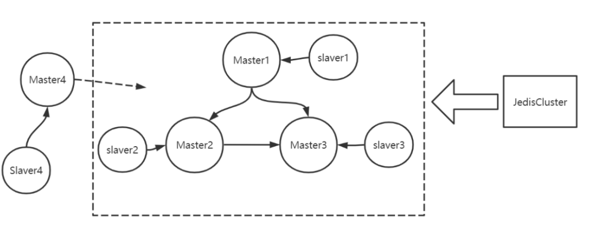
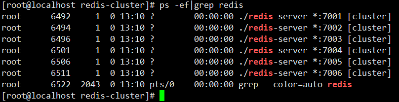
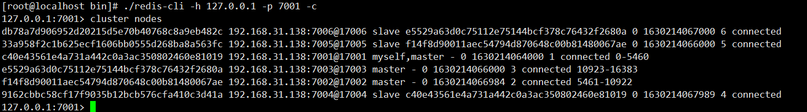
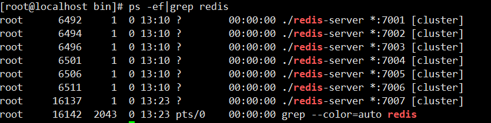
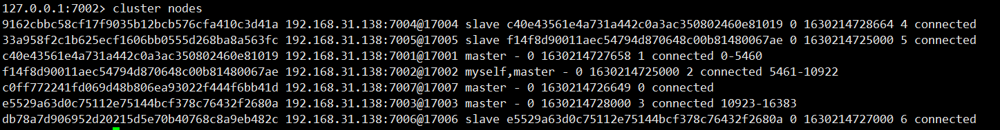
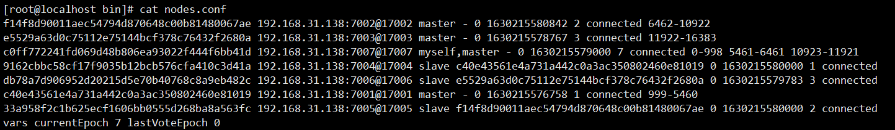
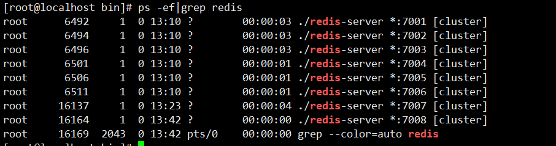
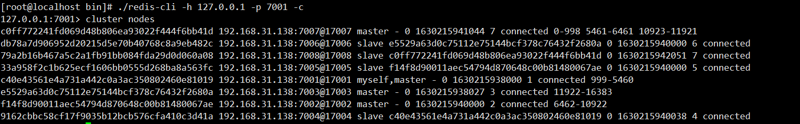

# Redis 官方 cluster分区




安装7001-7006，7001-7003为Master，7004-7006为Slaver，7007、7008为Master4 Slaver4


```shell
首先安装gcc
yum install -y gcc-c++

systemctl stop firewalld（默认）
systemctl disable firewalld.service（设置开启不启动）
```


## 1.安装Redis

```shell
cd redis-5.0.5/src 
make 

mkdir /var/redis-cluster/7001 -p
make install PREFIX=/var/redis-cluster/7001

cp /root/redis-5.0.5/redis.conf /var/redis-cluster/7001/bin/

#修改 redis.conf
# 将`daemonize`由`no`改为`yes`
	daemonize yes
	
	# 默认绑定的是回环地址，默认不能被其他机器访问 
	# bind 127.0.0.1
	
	# 是否开启保护模式，由yes该为no
	protected-mode no
	
	port 7001
	
	cluster-enabled yes
```

## 2.复制7001到 7002~7006，修改redis.conf中的端口号

```shell
cp -r 7001 7002
cp -r 7001 7003
cp -r 7001 7004
cp -r 7001 7005
cp -r 7001 7006
```

## 3.创建start.sh，启动所有的实例

```shell
cd 7001/bin
./redis-server redis.conf 
cd ..
cd ..

cd 7002/bin
./redis-server redis.conf 
cd ..
cd ..

cd 7003/bin
./redis-server redis.conf
cd ..
cd ..

cd 7004/bin
./redis-server redis.conf
cd ..
cd ..

cd 7005/bin
./redis-server redis.conf
cd ..
cd ..

cd 7006/bin
./redis-server redis.conf
cd ..
cd ..
```

```shell
chmod u+x start.sh (赋写和执行的权限)
./start.sh
```



## 4.创建Redis集群（创建时Redis里不要有数据）

```shell
#--cluster-replicas 1 表示1主1从(6个节点就是3主3从),如果为2（6个节点就是2主4从）
[root@localhost bin]# ./redis-cli --cluster create 192.168.31.138:7001 192.168.31.138:7002 192.168.31.138:7003 192.168.31.138:7004 192.168.31.138:7005 192.168.31.138:7006 --cluster-replicas 1
>>> Performing hash slots allocation on 6 nodes...
Master[0] -> Slots 0 - 5460
Master[1] -> Slots 5461 - 10922
Master[2] -> Slots 10923 - 16383
Adding replica 192.168.31.138:7005 to 192.168.31.138:7001
Adding replica 192.168.31.138:7006 to 192.168.31.138:7002
Adding replica 192.168.31.138:7004 to 192.168.31.138:7003
>>> Trying to optimize slaves allocation for anti-affinity
[WARNING] Some slaves are in the same host as their master
M: c40e43561e4a731a442c0a3ac350802460e81019 192.168.31.138:7001
   slots:[0-5460] (5461 slots) master
M: f14f8d90011aec54794d870648c00b81480067ae 192.168.31.138:7002
   slots:[5461-10922] (5462 slots) master
M: e5529a63d0c75112e75144bcf378c76432f2680a 192.168.31.138:7003
   slots:[10923-16383] (5461 slots) master
S: 9162cbbc58cf17f9035b12bcb576cfa410c3d41a 192.168.31.138:7004
   replicates c40e43561e4a731a442c0a3ac350802460e81019
S: 33a958f2c1b625ecf1606bb0555d268ba8a563fc 192.168.31.138:7005
   replicates f14f8d90011aec54794d870648c00b81480067ae
S: db78a7d906952d20215d5e70b40768c8a9eb482c 192.168.31.138:7006
   replicates e5529a63d0c75112e75144bcf378c76432f2680a
Can I set the above configuration? (type 'yes' to accept): yes
>>> Nodes configuration updated
>>> Assign a different config epoch to each node
>>> Sending CLUSTER MEET messages to join the cluster
Waiting for the cluster to join
........
>>> Performing Cluster Check (using node 192.168.31.138:7001)
M: c40e43561e4a731a442c0a3ac350802460e81019 192.168.31.138:7001
   slots:[0-5460] (5461 slots) master
   1 additional replica(s)
S: db78a7d906952d20215d5e70b40768c8a9eb482c 192.168.31.138:7006
   slots: (0 slots) slave
   replicates e5529a63d0c75112e75144bcf378c76432f2680a
S: 33a958f2c1b625ecf1606bb0555d268ba8a563fc 192.168.31.138:7005
   slots: (0 slots) slave
   replicates f14f8d90011aec54794d870648c00b81480067ae
M: e5529a63d0c75112e75144bcf378c76432f2680a 192.168.31.138:7003
   slots:[10923-16383] (5461 slots) master
   1 additional replica(s)
M: f14f8d90011aec54794d870648c00b81480067ae 192.168.31.138:7002
   slots:[5461-10922] (5462 slots) master
   1 additional replica(s)
S: 9162cbbc58cf17f9035b12bcb576cfa410c3d41a 192.168.31.138:7004
   slots: (0 slots) slave
   replicates c40e43561e4a731a442c0a3ac350802460e81019
[OK] All nodes agree about slots configuration.
>>> Check for open slots...
>>> Check slots coverage...
[OK] All 16384 slots covered.

```

登录客户端，查看集群情况

```shell
[root@localhost bin]# ./redis-cli -h 127.0.0.1 -p 7001 -c
127.0.0.1:7001> cluster nodes
db78a7d906952d20215d5e70b40768c8a9eb482c 192.168.31.138:7006@17006 slave e5529a63d0c75112e75144bcf378c76432f2680a 0 1630214067000 6 connected
33a958f2c1b625ecf1606bb0555d268ba8a563fc 192.168.31.138:7005@17005 slave f14f8d90011aec54794d870648c00b81480067ae 0 1630214066000 5 connected
c40e43561e4a731a442c0a3ac350802460e81019 192.168.31.138:7001@17001 myself,master - 0 1630214064000 1 connected 0-5460
e5529a63d0c75112e75144bcf378c76432f2680a 192.168.31.138:7003@17003 master - 0 1630214066000 3 connected 10923-16383
f14f8d90011aec54794d870648c00b81480067ae 192.168.31.138:7002@17002 master - 0 1630214066984 2 connected 5461-10922
9162cbbc58cf17f9035b12bcb576cfa410c3d41a 192.168.31.138:7004@17004 slave c40e43561e4a731a442c0a3ac350802460e81019 0 1630214067989 4 connected
```





```shell
127.0.0.1:7001> set name turbo
-> Redirected to slot [5798] located at 192.168.31.138:7002
OK
192.168.31.138:7002> 
[root@localhost bin]# ./redis-cli -h 127.0.0.1 -p 7002 -c
127.0.0.1:7002> get name
"turbo"
127.0.0.1:7002> 

```


## 5.扩容 7007、7008，重新安装一个新的redis

```shell
mkdir 7007
cd /root/redis-5.0.5/src/
make install PREFIX=/var/redis-cluster/7007

cp /root/redis-5.0.5/redis.conf /var/redis-cluster/7007/bin

#修改配置redis.conf
# 将`daemonize`由`no`改为`yes`
	daemonize yes
	
	# 默认绑定的是回环地址，默认不能被其他机器访问 
	# bind 127.0.0.1
	
	# 是否开启保护模式，由yes该为no
	protected-mode no
	
	port 7007
	
	cluster-enabled yes
```

复制7007到7008，并修改端口号

```shell
cp -r 7007 7008

#修改端口号为 7008
vim 7008/bin/redis.conf
```

## 6.启动7007，添加7007作为新节点



```shell
[root@localhost bin]# ./redis-cli --cluster add-node 192.168.31.138:7007 192.168.31.138:7001
>>> Adding node 192.168.31.138:7007 to cluster 192.168.31.138:7001
>>> Performing Cluster Check (using node 192.168.31.138:7001)
M: c40e43561e4a731a442c0a3ac350802460e81019 192.168.31.138:7001
   slots:[0-5460] (5461 slots) master
   1 additional replica(s)
S: db78a7d906952d20215d5e70b40768c8a9eb482c 192.168.31.138:7006
   slots: (0 slots) slave
   replicates e5529a63d0c75112e75144bcf378c76432f2680a
S: 33a958f2c1b625ecf1606bb0555d268ba8a563fc 192.168.31.138:7005
   slots: (0 slots) slave
   replicates f14f8d90011aec54794d870648c00b81480067ae
M: e5529a63d0c75112e75144bcf378c76432f2680a 192.168.31.138:7003
   slots:[10923-16383] (5461 slots) master
   1 additional replica(s)
M: f14f8d90011aec54794d870648c00b81480067ae 192.168.31.138:7002
   slots:[5461-10922] (5462 slots) master
   1 additional replica(s)
S: 9162cbbc58cf17f9035b12bcb576cfa410c3d41a 192.168.31.138:7004
   slots: (0 slots) slave
   replicates c40e43561e4a731a442c0a3ac350802460e81019
[OK] All nodes agree about slots configuration.
>>> Check for open slots...
>>> Check slots coverage...
[OK] All 16384 slots covered.
>>> Send CLUSTER MEET to node 192.168.31.138:7007 to make it join the cluster.
[OK] New node added correctly.

```

查看集群节点发现7007已经添加到集群中

```shell
[root@localhost bin]# ./redis-cli -h 127.0.0.1 -p 7002 -c
127.0.0.1:7002> cluster nodes
9162cbbc58cf17f9035b12bcb576cfa410c3d41a 192.168.31.138:7004@17004 slave c40e43561e4a731a442c0a3ac350802460e81019 0 1630214728664 4 connected
33a958f2c1b625ecf1606bb0555d268ba8a563fc 192.168.31.138:7005@17005 slave f14f8d90011aec54794d870648c00b81480067ae 0 1630214725000 5 connected
c40e43561e4a731a442c0a3ac350802460e81019 192.168.31.138:7001@17001 master - 0 1630214727658 1 connected 0-5460
f14f8d90011aec54794d870648c00b81480067ae 192.168.31.138:7002@17002 myself,master - 0 1630214725000 2 connected 5461-10922
c0ff772241fd069d48b806ea93022f444f6bb41d 192.168.31.138:7007@17007 master - 0 1630214726649 0 connected
e5529a63d0c75112e75144bcf378c76432f2680a 192.168.31.138:7003@17003 master - 0 1630214728000 3 connected 10923-16383
db78a7d906952d20215d5e70b40768c8a9eb482c 192.168.31.138:7006@17006 slave e5529a63d0c75112e75144bcf378c76432f2680a 0 1630214727000 6 connected

```





## 7.给刚添加的7007节点分配槽

hash槽重新分配（数据迁移）

```sh
[root@localhost bin]# ./redis-cli --cluster reshard 192.168.31.138:7007
>>> Performing Cluster Check (using node 192.168.31.138:7007)
M: c0ff772241fd069d48b806ea93022f444f6bb41d 192.168.31.138:7007
   slots: (0 slots) master
M: f14f8d90011aec54794d870648c00b81480067ae 192.168.31.138:7002
   slots:[5461-10922] (5462 slots) master
   1 additional replica(s)
M: e5529a63d0c75112e75144bcf378c76432f2680a 192.168.31.138:7003
   slots:[10923-16383] (5461 slots) master
   1 additional replica(s)
S: 9162cbbc58cf17f9035b12bcb576cfa410c3d41a 192.168.31.138:7004
   slots: (0 slots) slave
   replicates c40e43561e4a731a442c0a3ac350802460e81019
S: db78a7d906952d20215d5e70b40768c8a9eb482c 192.168.31.138:7006
   slots: (0 slots) slave
   replicates e5529a63d0c75112e75144bcf378c76432f2680a
M: c40e43561e4a731a442c0a3ac350802460e81019 192.168.31.138:7001
   slots:[0-5460] (5461 slots) master
   1 additional replica(s)
S: 33a958f2c1b625ecf1606bb0555d268ba8a563fc 192.168.31.138:7005
   slots: (0 slots) slave
   replicates f14f8d90011aec54794d870648c00b81480067ae
[OK] All nodes agree about slots configuration.
>>> Check for open slots...
>>> Check slots coverage...
[OK] All 16384 slots covered.
How many slots do you want to move (from 1 to 16384)? 
```

输入要分配的槽数量，输入3000，表示要给目标节点分配3000个槽

```shell
How many slots do you want to move (from 1 to 16384)? 3000
```

输入接收槽的节点id，这里是7007的id

```shell
What is the receiving node ID? c0ff772241fd069d48b806ea93022f444f6bb41d
```

输入源节点id，输入all，表示从其他节点都拿槽位来分配

```shell
Please enter all the source node IDs.
  Type 'all' to use all the nodes as source nodes for the hash slots.
  Type 'done' once you entered all the source nodes IDs.
Source node #1: all
```

输入yes开始移动槽到目标节点id

```shell
Do you want to proceed with the proposed reshard plan (yes/no)? yes
```


查看结果：

**7007分配到槽位，查看 node.conf**（当服务器ip 变化时，可以修改集群中每个redis下的 modes.conf 中的 ip 地址）



```shell
[root@localhost bin]# ./redis-cli -h 127.0.0.1 -p 7002 -c
127.0.0.1:7002> get name
-> Redirected to slot [5798] located at 192.168.31.138:7007
"turbo"
192.168.31.138:7007> 

```


## 8.添加从节点7008

 添加7008（先启动7008）从节点，将7008作为7007的从节点



```shell
./redis-cli --cluster add-node 新节点的ip和端口 旧节点ip和端口 --cluster-slave --cluster-master-id 主节点id
```


```shell
[root@localhost bin]# ./redis-cli --cluster add-node 192.168.31.138:7008 192.168.31.138:7007 --cluster-slave --cluster-master-id c0ff772241fd069d48b806ea93022f444f6bb41d
>>> Adding node 192.168.31.138:7008 to cluster 192.168.31.138:7007
>>> Performing Cluster Check (using node 192.168.31.138:7007)
M: c0ff772241fd069d48b806ea93022f444f6bb41d 192.168.31.138:7007
   slots:[0-998],[5461-6461],[10923-11921] (2999 slots) master
M: f14f8d90011aec54794d870648c00b81480067ae 192.168.31.138:7002
   slots:[6462-10922] (4461 slots) master
   1 additional replica(s)
M: e5529a63d0c75112e75144bcf378c76432f2680a 192.168.31.138:7003
   slots:[11922-16383] (4462 slots) master
   1 additional replica(s)
S: 9162cbbc58cf17f9035b12bcb576cfa410c3d41a 192.168.31.138:7004
   slots: (0 slots) slave
   replicates c40e43561e4a731a442c0a3ac350802460e81019
S: db78a7d906952d20215d5e70b40768c8a9eb482c 192.168.31.138:7006
   slots: (0 slots) slave
   replicates e5529a63d0c75112e75144bcf378c76432f2680a
M: c40e43561e4a731a442c0a3ac350802460e81019 192.168.31.138:7001
   slots:[999-5460] (4462 slots) master
   1 additional replica(s)
S: 33a958f2c1b625ecf1606bb0555d268ba8a563fc 192.168.31.138:7005
   slots: (0 slots) slave
   replicates f14f8d90011aec54794d870648c00b81480067ae
[OK] All nodes agree about slots configuration.
>>> Check for open slots...
>>> Check slots coverage...
[OK] All 16384 slots covered.
>>> Send CLUSTER MEET to node 192.168.31.138:7008 to make it join the cluster.
Waiting for the cluster to join

>>> Configure node as replica of 192.168.31.138:7007.
[OK] New node added correctly.

```

查看集群中的结点，刚添加的7008为7007的从节点

```shell
[root@localhost bin]# ./redis-cli -h 127.0.0.1 -p 7001 -c
127.0.0.1:7001> cluster nodes
c0ff772241fd069d48b806ea93022f444f6bb41d 192.168.31.138:7007@17007 master - 0 1630215941044 7 connected 0-998 5461-6461 10923-11921
db78a7d906952d20215d5e70b40768c8a9eb482c 192.168.31.138:7006@17006 slave e5529a63d0c75112e75144bcf378c76432f2680a 0 1630215940000 6 connected
79a2b16b467a5c2a1fb91bb084fda29d0d060a08 192.168.31.138:7008@17008 slave c0ff772241fd069d48b806ea93022f444f6bb41d 0 1630215942051 7 connected
33a958f2c1b625ecf1606bb0555d268ba8a563fc 192.168.31.138:7005@17005 slave f14f8d90011aec54794d870648c00b81480067ae 0 1630215940000 5 connected
c40e43561e4a731a442c0a3ac350802460e81019 192.168.31.138:7001@17001 myself,master - 0 1630215938000 1 connected 999-5460
e5529a63d0c75112e75144bcf378c76432f2680a 192.168.31.138:7003@17003 master - 0 1630215938027 3 connected 11922-16383
f14f8d90011aec54794d870648c00b81480067ae 192.168.31.138:7002@17002 master - 0 1630215940000 2 connected 6462-10922
9162cbbc58cf17f9035b12bcb576cfa410c3d41a 192.168.31.138:7004@17004 slave c40e43561e4a731a442c0a3ac350802460e81019 0 1630215940038 4 connected

```





客户端连接集群

命令：

```bash
./redis-cli -h 127.0.0.1 -p 7001 -c
```

注意：**-c** 表示是以 redis 集群方式进行连接

查集群的命令

- 查询集群状态

  ```bash
  127.0.0.1:7003> cluster info
  cluster_state:ok
  cluster_slots_assigned:16384
  cluster_slots_ok:16384
  cluster_slots_pfail:0
  cluster_slots_fail:0
  cluster_known_nodes:6
  cluster_size:3
  cluster_current_epoch:6
  cluster_my_epoch:3
  cluster_stats_messages_sent:926
  cluster_stats_messages_received:926
  ```

- 查看集群中的节点：

  ```bash
  127.0.0.1:7003> cluster nodes
  d277cd2984639747a17ca79428602480b28ef070 127.0.0.1:7003@17003 myself,master - 0 1570457306000 3 connected 10923-16383
  af559fc6c82c83dc39d07e2dfe59046d16b6a429 127.0.0.1:7001@17001 master - 0 1570457307597 1 connected 0-5460
  e7b1f1962de2a1ffef2bf1ac5d94574b2e4d67d8 127.0.0.1:7005@17005 slave
  068b678923ad0858002e906040b0fef6fff8dda4 0 1570457308605 5 connected 068b678923ad0858002e906040b0fef6fff8dda4 127.0.0.1:7002@17002 master - 0 1570457309614 2 connected 5461-10922
  51c3ebdd0911dd6564040c7e20b9ae69cabb0425 127.0.0.1:7004@17004 slave af559fc6c82c83dc39d07e2dfe59046d16b6a429 0 1570457307000 4 connected 78dfe773eaa817fb69a405a3863f5b8fcf3e172f 127.0.0.1:7006@17006 slave d277cd2984639747a17ca79428602480b28ef070 0 1570457309000 6 connected
  127.0.0.1:7003>
  ```

- 查看某个key在哪个槽

  ```bash
  127.0.0.1:7001> cluster keyslot name:001 
  (integer) 4354
  ```

  