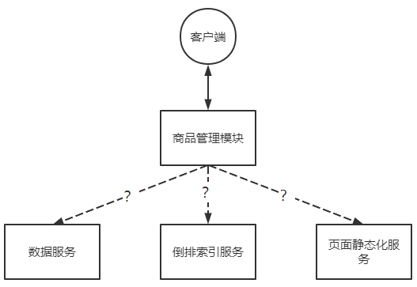
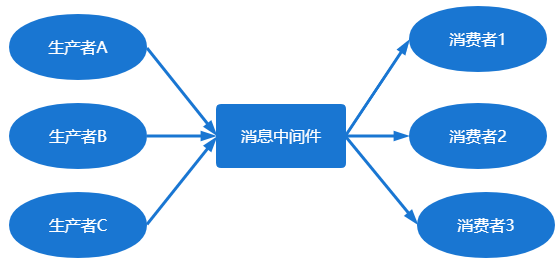
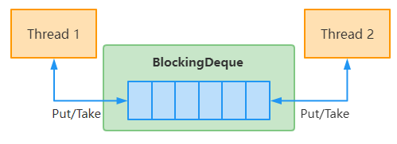

第一部分 消息中间件概述

# 1 分布式架构通信

## 1.1 分布式架构通信原理

### 1.1.1 SOA

根据实际业务，把系统拆分成合适的、独立部署的模块，模块之间相互独立。

优点：分布式，松耦合、扩展灵活，可重用。


SOA 架构系统中，使用 Dubbo 和 Zookeeper 进行服务间的远程通信。

优点：Dubbo使用自定义的 TCP 协议，可以让请求报文体积更小，或者使用 HTTP2 协议，也可以减少报文的体积，提高传输效率。

### 1.1.2 微服务架构

SpringCloud 中使用 Feign 解决服务之间远程通信的问题。

Feign：轻量级 Restful 的 HTTP 服务客户端，广泛应用于 Spring Cloud 中。符合面向接口化的编程习惯。

本质：封装了 HTTP 调用流程，类似 Dubbo 的服务调用。

多用于 同步远程调用


RPC 主要基于 TCP/UDP 协议，HTTP 协议是应用层协议，是构建在传输层协议 TCP 之上的，RPC 更高，RPC 长连接：不必每次通信都像 HTTP 一样三次握手，减少网络开销；

HTTP 服务开发迭代更快：在接口不多，系统与系统治安交互比较少的情况下，HTTP 就显得更加方便；相反，在接口比较多，系统与系统之间交互比较多的情况下，HTTP就没有 RPC 优势。


## 1.2 分布式同步通信的问题

电商项目中，如果后台添加商品信息，该信息放到数据库。

我们同时，需要更新搜索引擎的倒排序索引，同时，加入有商品页面静态化处理，也需要更新页面信息。



怎么解决？

方式一：可以在后台添加商品的方法中，如果数据插入数据库成功 ，就调用更新倒排序索引的方法，接着调用更新静态化页面的方法。

代码应该是：

```java
Long goodsId = addGoods(goods); 
if (goodsId != null) {
	refreshInvertedIndex(goods);    
    refreshStaticPage(goods); 
}
```

问题：

假如更新倒排序索引失败，该怎么办？

假如更新静态页面失败怎么办？

解决方式：

如果更新倒排索引失败，重试

如果更新静态页面失败，重试

代码应该是这样：

```java
public Long saveGoods() {
	Long goodsId = addGoods(goods);    
    if (goodsId != null) {
		// 调用递归的方法，实现重试
		boolean indexFlag = refreshInvertedIndex(goods);       
        // 调用递归的方法，实现重试
		boolean pageFlag = refreshStaticPage(goods);  
    }
}
private boolean refreshInvertedIndex(Goods goods) {    
    // 调用服务的方法
	boolean flag = indexService.refreshIndex(goods);    
    if (!flag) {
		refreshInvertedIndex(goods);  
    }
}
private boolean refreshStaticPage(Goods goods) {    
    // 调用服务的方法
	boolean flag = staticPageService.refreshStaticPage(goods);    
    if (!flag) {
		refreshStaticPage(goods);  
    }
}
```

以上代码在执行中的问题：

1. 如果相应的更新一直失败，岂不是一直死循环直到调用栈崩溃？
2. 如果相应的更新一直在重试，在重试期间，添加商品的方法调用是不是一直阻塞中？
3. 如果添加商品的时候并发量很大，效率岂不是很低？


## 1.3 分布式异步通信模式

比较典型的 “生产者消费者模式”，可以跨平台、支持异构系统，通常借助消息中间件来完成。

优点：系统间解耦，并具有一定的可回复性，支持异构系统，下游通常可并发执行，系统具备弹性。服务解耦，流量削峰填谷等。

缺点：消息中间件存在一些瓶颈和一致性问题，对于开发来讲不直观不易调试，有额外成本。

使用异步消息模式需要注意的问题：

1. 哪些业务需要同步处理，哪些业务可以异步处理？
2. 如何保证消息的安全？消息是否丢失，是否会重复？
3. 请求的延迟如何能减少？
4. 消息接收的顺序是否会影响到业务流程的正常执行？
5. 消息处理失败后是否需要重发？如果重发如何保证幂等性？


# 2 消息中间件简介

## 2.1 消息中间件概念

维基百科对消息中间件的解释：面向消息的系统（消息中间件）是在分布式系统中完成消息的发送和接收的基础软件。

消息中间件也可称 消息队列，是指用高效可靠的消息传递机制进行与平台无关的数据交流，并基于数据通信来进行分布式系统的集成。通过提供消息传递和消息队列模型，可以在分布式环境下扩展进程的通信。

消息中间件就是在通信的上下游之间截断：break it，Broker

然后利用中间件解耦、异步的特性、构建弹性、可靠、稳定的系统。

体会一下：“必有歹人从中作梗，定有贵人从中相助”

**异步处理、流量削峰**、限流、缓冲、排队、**最终一致性、消息驱动** 等需求的场景都可以使用消息中间件。



## 2.2 自定义消息中间件

并发比那还曾领域经典面试题：**请使用 java 代码来实现 “生产者消费者模式”**。

BlockingQueue（阻塞队列）是 java 中常见的容器，在多线程编程中被广泛使用。

当队列容器已满时 生产者线程被阻塞，直到队列未满后才可以继续 put；<br>当队列容器为空时，消费者线程被阻塞，直到队列非空时才可以继续 take。



```java
package com.turbo.demo;

public class KouZhao  {

    private Integer id;
    private String type;

    @Override
    public String toString() {
        return "KouZhao{" +
                "id=" + id +
                ", type='" + type + '\'' +
                '}';
    }

    public Integer getId() {
        return id;
    }
    public void setId(Integer id) {
        this.id = id;
    }
    public String getType() {
        return type;
    }
    public void setType(String type) {
        this.type = type;
    }
}
```

```java
package com.turbo.demo;

import java.util.concurrent.BlockingQueue;

public class Producer implements Runnable {

    private BlockingQueue<KouZhao> queue;
    public Producer(BlockingQueue<KouZhao> queue) {
        this.queue = queue;
    }
    private Integer index = 0;

    @Override
    public void run() {
        while (true){
            try {
                Thread.sleep(200);

                if(queue.remainingCapacity() <= 0){
                    System.out.println("口罩已经堆积如山了...");
                }else{
                    KouZhao kouZhao = new KouZhao();
                    kouZhao.setType("N95");
                    kouZhao.setId(index++);
                    System.out.println("正在生产第"+(index-1)+"个口罩。");
                    queue.put(kouZhao);
                    System.out.println("已经生产了口罩："+queue.size()+"个。");
                }
            } catch (InterruptedException e) {
                e.printStackTrace();
            }
        }
    }
}
```

```java
package com.turbo.demo;

import java.util.concurrent.BlockingQueue;

public class Consumer implements Runnable {

    private BlockingQueue<KouZhao> queue;
    public Consumer(BlockingQueue<KouZhao> queue) {
        this.queue = queue;
    }

    @Override
    public void run() {
        while (true){
            try {
                Thread.sleep(100);
                System.out.println("正在准备买口罩...");
                final KouZhao kouZhao = queue.take();
                System.out.println("买到了口罩："+kouZhao.getId()+" "+kouZhao.getType()+"口罩。");
            } catch (InterruptedException e) {
                e.printStackTrace();
            }
        }
    }
}
```

```java
package com.turbo.demo;

import java.util.concurrent.ArrayBlockingQueue;
import java.util.concurrent.BlockingQueue;

public class App {

    public static void main(String[] args) {
        BlockingQueue<KouZhao> queue = new ArrayBlockingQueue<>(20);

        new Thread(new Producer(queue)).start();
        new Thread(new Consumer(queue)).start();
    }
}
```


上述代码放到生产环境显然是不行的，比如没有集群，没有分布式，玩法单一，不能满足企业级应用的要求。。。

比如：

- 消息有没有持久化？
- 怎么确定消息一定能发送成功？
- 高并发的性能怎么样？
- 系统可靠吗？
- 有没有 Pub/Sub 模式？
- 有没有考虑限流？

## 2.3 主流消息中间件及选型

当前业界比较流行的开源消息中间件包括：ActiveMQ、RabbitMQ、RocketMQ、Kafka、ZeroMQ 等，其中应用最为广泛的要数 RabbitMQ、RocketMQ、Kafka 这三款。

Redis 在某种程度上也可以实现类似 “Queue” 和 "Pub/Sub" 的机制，严格意义上不算消息中间件。


### 2.3.1 选取原则

首先，产品应该是开源的。开源意味着如果队列使用中遇到 bug，可以很快修改，而不用等待开发者的更新。

其次，产品必须是近几年比较流行的，要有一个活跃的社区。这样遇到问题很快可以找到解决方法。同时流行也意味着 bug 较少。流行的产品一般跟周边系统兼容性比较好。

最后，最为消息队列，要具备以下几个特性：

1. 消息传输的可靠性：保证消息不会丢失。
2. 支持集群，包括横向扩展，单点故障都可以解决。
3. 性能要好，要能够满足业务的性能需求。

### 2.3.2 RabbitMQ

RabbitMQ 开始使用在电信业务的可靠通信的，也是少有的几款支持AMQP协议的产品之一。

优点：

1. 轻量级，快速，部署使用方便
2. 支持灵活的路由配置。RabbitMQ 中，在生产者和队列之间有一个交换器模块。根据配置的路由规则，生产者发送的消息可以发送到不同的队列中。路由规则很灵活，还可以自己实现。
3. RabbitMQ 的客户端支持大多数的编程语言。

缺点：

1. 如果有大量消息堆积在队列中，性能会急剧下降
2. RabbitMQ 的性能在 Kafka 和 RocketMQ 中是最差的，每秒处理几万到几十万的消息。如果应用要求高的性能，不要选择 RabbitMQ。
3. RabbitMQ 是 Erlang 开发的，功能扩展 和 二次开发代价很高。

### 2.3.3 RocketMQ

RocketMQ 是一个开源的消息队列，使用 java 实现。借鉴了 Kafka 的设计并做了很多改进。RocketMQ 主要用于有序、事务、流计算、消息推送、日志流处理，binlog 分发等场景。经历了历次的双11考验，性能、稳定性、可靠性没得说。

RocketMQ 几乎具备了消息队列应该具备的所有特性和功能。

java开发，阅读源代码、扩展、二次开发很方便。

对电商领域的响应延迟做了很多优化。在大多数情况下，响应在毫秒级。如果应用很关注时间，可以使用 RocketMQ。

性能比 RabbitMQ 高一个数量级，每秒处理几十万的消息。

缺点：

和周边系统的整合兼容不是很好。

### 2.3.4 Kafka

Kafka 的可靠性，稳定性和功能特性基本满足大多数的应用场景。

跟周边系统的兼容性是数一数二的，尤其是大数据和流计算领域，几乎所有相关的开源软件都支持 Kafka。

Kafka 高效，可伸缩，消息持久化。支持分区、副本和容错。

Kafka 是 Scala 和 Java 开发的，对批处理和异步处理做了大量的设计，因此 Kafka 可以得到非常高的 性能，它的异步消息发送和接收是三个中最好的，但是跟 RocketMQ 拉不开数量级，每秒处理几十万的消息。

如果是异步消息，并且开启两压缩，Kafka 最终可以达到每秒处理 2000w 消息的级别。但是由于是异步的批处理的，延迟也会很高，不适合电商场景。

|                        | RabbitMQ   | RocketMQ                               | Kafka                          |
| ---------------------- | ---------- | -------------------------------------- | ------------------------------ |
| 单机吞吐量             | 1w量级     | 10w 量级                               | 10w 量级                       |
| 开发语言               | Erlang     | Java                                   | Java 和 Scala                  |
| 消息延迟               | 微妙       | 毫秒                                   | 毫秒                           |
| 消息丢失               | 可能性很低 | 参数优化有可以 0 丢失                  | 参数优化后可以0丢失            |
| 消费模式               | 推拉       | 推拉                                   | 拉取                           |
| 主题数量对吞吐量的影响 | \          | 几百上千个主题会对吞吐量有一个小的影响 | 几十上百个主题会极大影响吞吐量 |
| 可用性                 | 高（主从） | 很高（主从）                           | 很高（分布式）                 |

[rocketmq-vs-activemq-vs-kafka](https://rocketmq.apache.org/zh/docs/4.x/#rocketmq-vs-activemq-vs-kafka)

## 2.4 消息中间件应用场景

消息中间件的使用场景非常广泛，比如，12306 购票的排队锁座，电商秒杀，大数据实时计算等。


# 3 JMS规范和AMQP协议

## 3.1 JMS经典模式详解

JMS 即 Java 消息服务（Java Message Service）应用程序接口，是一个 Java 平台中关于面向消息中间件（MOM，Message oriented Middleware）的 API，用于在两个应用程序之间，或分布式系统中发送消息，进行异步通信。与具体平台无关的 API，绝大多数 MOM 提供商都支持。

它类似于 JDBC（Java Database Connectivity）。

### 3.1.1 JMS消息

消息是 JMS 中的一种类型对象，有两部分组成：报文头 和 消息主体。

报文头包括头字段 和 消息头 属性。字段是 JMS 协议规定的字段，属性可以由用户按需添加。

JMS 报文头全部字段：

| 字段名称         | 含义                                                         |
| ---------------- | ------------------------------------------------------------ |
| JMSDestination   | `JMSDestination`字段包含了消息要发送到的目的地。             |
| JMSDeliveryMode  | `JMSDeliveryMode` 字段包含了消息在发送的时候指定的投递模式   |
| JMSMessageID     | 该字段包含了服务器发送的每个消息的唯一标识。                 |
| JMSTimestamp     | 该字段包含了消息封装完成要发往服务器的时间，不是真正向服务器发送的时间，因为真正的发送时间，可能会由于事务或客户端消息排队而延后。 |
| JMSCorrelationID | 客户端使用该字段的值 与 另一条消息关联。一个典型的场景是使用该字段将响应消息与请求消息关联。JMSCorrelationID 可以包含如下值：<br>- 服务器规定的消息 ID<br>- 应用指定的字符串<br>- 服务器原生的 byte[] 值 |
| JMSReplyTo       | 该字段包含了在客户端发送消息的时候指定的 Destination。即对该消息的响应应该发送到该字段指定的 Destination。设置了该字段值的消息一般期望收到一个响应。 |
| JMSRedelivered   | 如果这个字段是 true，则告知消费者应用这条消息已经发送过了，消费端应用应该小心别重复处理了。 |
| JMSType          | 消息发送的时候用于标识该消息的类型。具体有哪些类型，由 JMS 实现厂商决定。 |
| JMSExpiration    | 发送消息时，其到期时间将计算为 send 方法上指定的生存时间值与当前 GMT 值之和。从 send 方法返回时，消息的 JMSExpiration 标头字段包含此值。收到消息后，其 JMSExpiration 标头字段包含相同的值。 |
| JMSPriority      | JMS 定义了一个十级优先级值，最低优先级为 0，最高优先级为 9.此外，客户端应将优先级 0-4 视为正常优先级，将优先级 5-9 视为快速优先级。JMS 不需要服务器严格执行消息的优先级排序；但是，它应该尽力在普通消息之前传递加急消息。 |

消息主体则携带着 应用程序的数据或有效负载。

根据有效负载的类型来划分，可以将消息分为几种类型：

1. 简单文本（TextMessage）
2. 可序列化的对象（ObjectMessage）
3. 属性集合（MapMessage）
4. 字节流（BytesMessage）
5. 原始值流（StreamMessage）
6. 无有效负载的消息（Message）

### 3.1.2 体系结构

JMS 由以下元素组成：

1. JMS 供应商产品

   JMS 接口的是个实现。该商品可以是 Java 的 JMS 实现，也可以是非 Java 的面向消息中间件的适配器。

2. JMS Client

   生产或消费基于消息的 Java 应用程序或对象。

3. JMS Producer

   创建并发送消息的 JMS 客户。

4. JMS Consumer

   接收消息的 JMS 客户

5. JMS Message

   包括可以在 JMS 客户之间传递的数据对象

6. JMS Queue

   缓存消息的容器。消息的接收顺序并不一定要与消息的发送顺序相同。消息被消费后将从队列中移除。

7. JMS Topic

   Pub/Sub 模式。


### 3.1.3 对象模型

1. ConnectionFactory 接口（连接工厂）

   用户用来创建到 JMS 提供者的连接的被管理对象。JMS 客户通过可一直的接口访问连接，这样当下层的实现改变时，代码不需要进行修改。管理员在  JNDI 名字空间中配置连接工厂，这样 JMS 客户才能够查找到它们。根据消息类型的不同，用户将使用队列连接工厂，或者主题连接工厂。

2. Connection 接口（连接）

   连接代表了应用程序和消息服务器之间的通信链路。在获得了连接工厂后，就可以创建一个与 JMS 提供者的连接。根据不同的连接类型，连接允许用户创建会话，以发送和接收队列和主题到目标。

3. Destination 接口（目标）

   目标是一个包装了消息目标标识符的被管对象，消息目标是指消息发布和接收的地点，或者是队列，或者是主题。JMS 管理员创建这些对象，然后用户通过 JNDI 发现它们。和连接工厂一样，管理员可以创建两种类型的目标，点对点模式的队列，以及发布者/订阅者模式的主题。

4. Session 接口（会话）

   表示一个单线程的上下文，用于发送和接收消息。由于会话是单线程的，所以消息是连续的，就是说消息是按照发送的顺序一个一个接收的。会话的好处是它支持事务。如果用户选择了事务支持，会话上下文将保存一组消息，直到事务被提交才发送这些消息。在提交事务之前，用户可以使用回滚操作取消这些消息。一个会话允许用户创建消息，生产者来发送消息，消费者来接收消息。

5. MessageConsumer 接口（消息消费者）

   

### 3.1.4 模式

### 3.1.5 传递方式

### 3.1.6 供应商

## 3.2 JMS在应用集群中的问题

## 3.3 AMQP协议剖析

### 3.3.1 协议架构

### 3.3.2 AMQP中的概念

### 3.3.3 AMQP传输层架构

#### 3.3.3.1 简要概述

#### 3.3.3.2 数据类型

#### 3.3.3.3 协议协商

#### 3.3.3.4 数据帧界定

### 3.3.4 AMQP客户端实现JMS客户端

