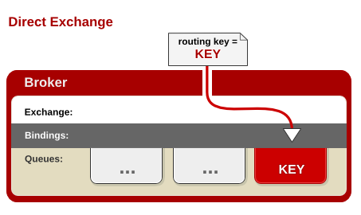
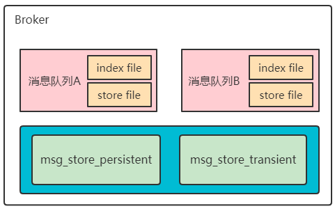
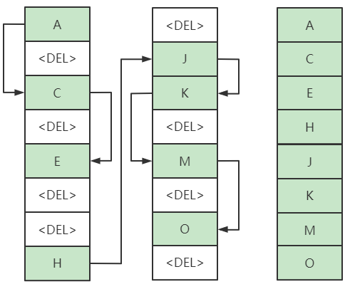
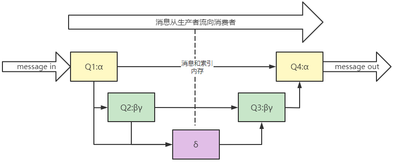
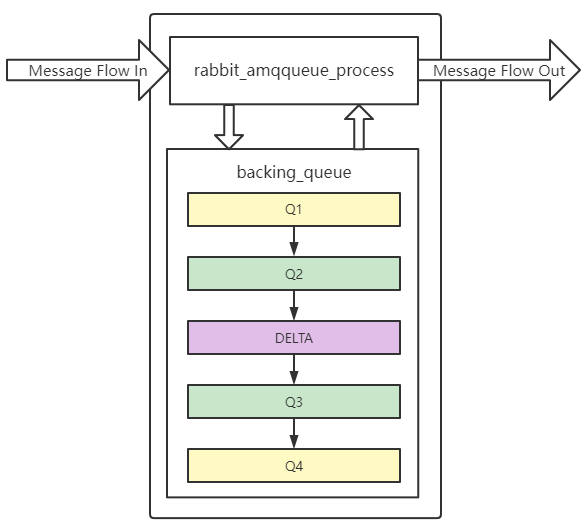
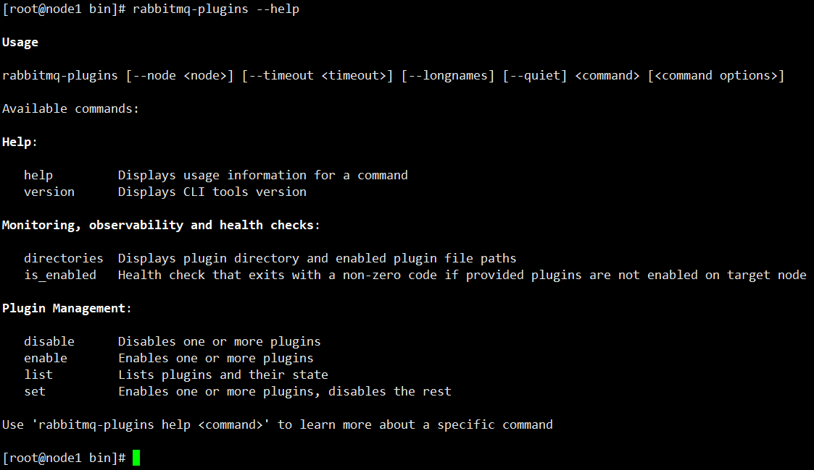
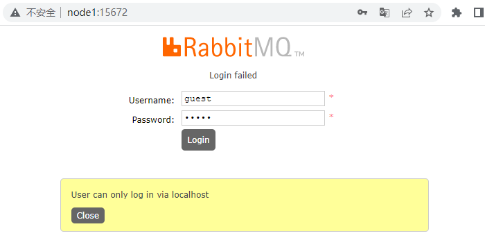
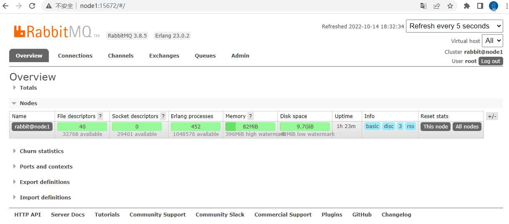

> 第一节 RabbitMQ架构与实战

# 1 RabbitMQ 介绍、概念、基本架构

## 1.1 RabbitMQ 介绍

RabbitMQ，俗称 “兔子MQ” （可见其轻巧，敏捷），是目前非常热门的一款开源消息中间件，不管是互联网行业还是传统行业都广泛使用（最早是为了解决电信行业系统之间的可靠通信而设计）。

1. 高可靠性、易扩展、高可用、功能丰富等。
2. 支持大多数（甚至冷门）的编程语言客户端。
3. RabbitMQ 遵循 AMQP 协议，自身采用 Erlang（一种由爱立信开发的通用面向并发编程的语言）编写。
4. RabbitMQ 也支持 MQTT 等其他协议。

RabbitMQ 具有很强大的插件扩展能力，官方和社区提供了非常丰富的插件可供选择：

https://www.rabbitmq.com/community-plugins.html

## 1.2 RabbitMQ 整体逻辑架构


## 1.3 RabbitMQ Exchange 类型

RabbitMQ 常用的交换器类型有：`fanout`、`direct`、`topic`、`headers` 四种。

### 1.3.1 fanout

会把所有发送到该交换器的消息，路由到所有与该交换器绑定的队列中，如图：


### 1.3.2 direct

direct 类型的交换器路由规则很简单，它会把消息路由到那些 BindingKey 和 RoutingKey 完全匹配的队列中，如下图：



### 1.3.3 topic

topic 类型的交换器在 direct 匹配规则上进行了扩展，也是将消息路由到 BindingKey 和 RoutingKey 相匹配的队列中，这里的匹配规则稍微不同，它约定：

BindingKey 和 RoutingKey 一样都是由 "." 分割的字符串；BindingKey 中可以存在两种特殊字符 `*` 和 `#`，用于模糊匹配，其中  `*` 用于匹配一个单词，`#` 用于匹配多个单词（可以是0个）。


### 1.3.4 headers

headers 类型的交换器不依赖于路由键的匹配规则来路由信息，而是根据发送的消息内容中的 headers 属性进行匹配。在绑定队列 和 交换器时 指定一组键值对，当发送的消息到交换器时，RabbitMQ 会获取到该消息的 headers，对比其中的键值对完全匹配 队列 和 交换器 绑定时指定的键值对；如果匹配消息就会路由到该队列。headers 类型的交换器性能很差，不实用。

## 1.4 RabbitMQ 数据存储

### 1.4.1 存储机制

RabbitMQ 的消息有两种类型：

1. 持久化消息
2. 非持久化消息

这两种消息都会被写入磁盘。**持久化消息在到达队列时写入磁盘，同时会内存中保存一份备份，当内存吃紧时，消息从内从中清除。这会提高一定的性能。**

**非持久化消息一般只存于内存中，当内存压力大时，数据刷盘处理，以节省内存空间**。

RabbitMQ 存储层包含两个部分：**队列索引** 和 **消息存储**。



### 1.4.2 队列索引 rabbit_queue_index

索引维护队列的落盘消息的消息，比如：存储地点，是否已被消费者接收，是否以被消费者 ack 等。

每个队列都有相应的索引。


索引使用顺序的段文件来存储，后缀是 `.idx` ，文件名从 0 开始累加，每个段文件中包含固定的 `segment_entry_count` 条记录，默认值是**16384**。每个 index 从磁盘中读取消息的时候，**至少要在内存中维护一个段文件**，所以设置 `queue_index_embed_msgs_below` 值 的时候要**格外谨慎**，一点点增大也可能会引起内存爆炸式增长。

### 1.4.3 消息存储 rabbit_msg_store

消息以键值对的形式存储到文件中，一个虚拟主机上的所有队列使用同一块存储，每个节点只有一个。存储分为**持久化存储**（msg_store_persistent）和 **短暂存储**（msg_store_transient）。持久化存储的内容在 broker 重启后丢失。

store 使用文件来存储，后缀为 `.rdq`，经过 store 处理的所有消息都会以追加的方式写入到该文件中，当该文将的大小超过指定的限制（file_size_limit）后，将会关闭该文件并创建一个新的文件以供新的消息写入。文件名从 0 开始进行累加。在进行消息的存储时，RabbitMQ 会在 ETS （Erlang Term Storage）表中记录消息在文件中的位置映射和文件的相关信息。

消息（包括消息头、消息体、属性）可以直接存储在 index 中，也可以存储在 store 中。最佳的方式是较小的消息存在 index 中，而较大的消息存在 store 中。这个消息大小的界定可以通过 `queue_index_embed_msgs_below` 来配置，默认值为 4096 B。当一个消息小于设定的大小阈值时，就可以存储在 index 中，这样性能上可以得到优化。**一个完整的消息**大小 小于这个值，就放到索引中，否则放到持久化消息文件中。

rabbitmq.conf 中的配置信息：

```properties
## Size in bytes below which to embed messages in the queue index. 
## Related doc guide: https://rabbitmq.com/persistence-conf.html 
##
# queue_index_embed_msgs_below = 4096

## You can also set this size in memory units 
##
# queue_index_embed_msgs_below = 4kb
```

如果消息小于这个值，就在索引中存储，如果消息大于这个值就在 store 中存储。

大于这个值的消息存储于 msg_store_persistent 目录中的 `<num>.rdq` 文件中：

小于这个值的消息存储于 `<num>.idx` 索引文件中：


**读取消息**时，先根据消息的 ID（msg_id）找到对应存储的文件，如果文件存在并且未被锁住，则直接打开文件，从指定位置读取消息内容。如果文件不存在或者被锁住了，则发送请求由 store 进行处理。

**删除消息**时，只是从 ETS 表删除删除指定消息的相关信息，同时更新消息对应的存储文件和相关信息。在执行消息删除操作时，并不立即对文件中的消息进行删除，也就说消息依然在文件中，仅仅是标记为垃圾数据而已。当一个文件中都是垃圾数据时，可以将这个文件删除。

当检测到前后两个文件中的有效数据可以合并成一个文件，并且所有的垃圾数据的大小和所有文件（至少有3个文件存在的情况下）的数据大小的比值超过设置的阈值 `garbage_fraction`（默认值0.5）时，才会触发垃圾回收，将这两个文件合并，**执行合并的两个文件一定是逻辑上相邻的两个文件**。合并逻辑：

1. 锁定这两个文件；
2. 先整理前面文件的有效数据，再整理后面文件的有效数据；
3. 将后面文件的有效数据写入到前面的文件中；
4. 更新消息在 ETS 表中的记录；
5. 删除后面文件。



### 1.4.4 队列结构

通常队列由 rabbit_amqqueue_process 和 backing_queue 这两部分组成，rabbit_amqqueue_process 负责协议相关的消息处理，即接收生产者发布的消息、向消费者交付消息，处理消息的确认（包括生产端的 confirm 和 消费端的 ack）等。backing_queue 是消息存储的具体形式 和 引擎，并向 rabbit_amqqueue_process 提供相关的接口以供调用。

如果消息投递的目的队列是空的，并且有消费者订阅了这个队列，那么该消息会直接发送给消费者，不会经过队列这一步。当消息无法直接投递给消费者时，需要暂时将消息存入队列，以便重新投递。

`rabbit_variable_queue.erl` 源码中定义了 RabbitMQ 队列的 **4种状态**：

1. alpha：消息索引和消息内容都存内存，最耗内存，韩少消耗 CPU。
2. beta：消息索引存内存，消息内容 存磁盘。
3. gama：消息索引 在内存和磁盘 中都有，消息内容 存磁盘。
4. delta：消息索引 和 内容 都存磁盘，基本不消耗 内存，消耗更多 CPU 和 I/O 操作

消息存入队列后，不是固定不变的，它会随着系统的负载在队列中不断流动，消息的状态会不断发生变化。

**持久化的消息，索引 和 内容 都必须先保存在磁盘上，才会处于上述状态中的一种**；

**gama 状态只有持久化消息才会有的状态**。

在运行时，RabbitMQ 会根据消息传递的速度定期计算一个当前内存中能够保存的最大消息数量（target_ram_count），如果 alpha 状态的消息数量大于此值，则会引起消息的状态转换，多余的消息可能会转换到 beta、game 或者 delta 状态。区分这 4 中状态的主要作用是满足不同的内存 和 CPU 需求。

对于 **普通没有设置优先级和镜像** 的队列来说，backing_queue 的默认实现是 rabbit_variable_queue，其内部通过**5个子队列** Q1、Q2、delta、Q4 来体现消息的各个状态。





消费者获取消息也会引起消息的状态转换。

当消费者获取消息时：

1. 首先会从 Q4 中获取消息，如果获取成功则返回。
2. 如果 Q4 为空，则尝试从 Q3 中获取消息，系统首先会判断 Q3 是否为空，如果为空则返回队列为空，即此时队列中无消息。
3. 如果 Q3 不为空，则取出 Q3 中的消息；**进而**再判断此时 Q3 和 Delta 中的长度，如果都为空，则可以认为 Q2、Delta、Q3、Q4 全部为空，此时将 Q1 中的消息转移至 Q4，下次直接从 Q4 中获取消息。
4. 如果 Q3 为空，Delta 不为空，则将 Delta 的消息转移至 Q3 中，下次可以直接从 Q3 中获取消息。在将消息从 Delta 转移到 Q3 的过程中，是按照索引分端读取的，首先读取某一段，然后判断读取的消息的个数 与 Delta 中消息的个数是否相等，如果相等，则可以判定此时 Delta 中已无消息，则直接将 Q2 和刚读取的消息一并放入到 Q3 中，如果不相等，仅将此次读取到的消息转移到 Q3。

这里就有两处疑问，第一个疑问是：为什么 Q3 为空则可以认定整个队列为空？

1. 试想一下，如果 Q3 为空，Delta 不为空，那么在 Q3 取出最后一条消息的时候，Delta 上的消息就会被转移到 Q3 。这样与 Q3 为空矛盾；
2. 如果 Delta 为空且 Q2 不为空，则在 Q3 取出最后一条消息时，会将 Q2 的消息并入到 Q3 中，这样也与 Q3 为空 矛盾；
3. 在 Q3 取出最后一条消息之后，如果 Q2、Delta、Q3 都为空，且 Q1 不为空时，则 Q1 的消息会被转移到 Q4，这与 Q4 为空矛盾。

其实这一番论述也解释了另一个问题：为什么 Q3 和 Delta 都为空时，则可以认为 Q2 、Delta、Q3、Q4 全部为空？

通常在负载正常时，如果消费速度大于生产速度，对于不需要保证消息可靠不丢失的消息来说，极有可能只会处于 alpha 状态。

对于持久化消息，它一定会进入 gama 状态，在开启 publisher confirm 机制时，只有到了 gama 状态时才会确认该消息以被接收，若消息消费速度足够快、内存也充足，这些消息也不会继续走到下一个状态。

### 1.4.5 为什么消息的堆积导致性能下降？

在系统负载较高时，消息若不能很快被消费掉，这些消息就会进入到很深的队列中去，这样会增加处理每个消息的平均开销。因为要花更多的时间和资源处理 "堆积" 的消息，如此用来处理新流入的消息的能力就会降低，使得后流入得消息又被积压到很深得队列中，继续增大处理每个消息得平均开销，继而情况变得越来越糟，使得系统的处理能力大大降低。

应对这一问题一般有3中措施：

1. 增加 prefetch_count 的值，即一次发送多条消息给消费者，加快消息被消费的速度。
2. 采用 multiple ack ，降低处理 ack 带来的开销。
3. 流量控制。

# 2 安装和配置 RabbitMQ

安装环境：

1. 虚拟主机软件 ： VirtualBox  5.2.34 r133893 (Qt5.6.2)

2. 操作系统：CentOS Linux release 7.7.1908

3. Erlang：erlang-23.0.2-1.el7.x86_64

4. RabbitMQ：rabbitmq-server-3.8.5-1.el7.noarch


RabbitMQ 的安装需要首先安装 Erlang，因为它是基于 Erlang 的 VM运行的。

RabbitMQ 需要的依赖：socat 和 logrotate，logrotate 操作系统中已经存在了，只需要安装 socat 就可以了。

RabbitMQ 与 Erlang 的兼容关系详见：https://www.rabbitmq.com/which-erlang.html


1. 安装依赖

   ```bash
   yum install socat -y
   ```

2. 安装 Erlang

   erlang-23.0.2-1.el7.x86_64.rpm 下载地址

   https://github.com/rabbitmq/erlang-rpm/releases/download/v23.0.2/erlang-23.0.2-1.el7.x86_64.rpm

   然后执行命令：

   ```bash
   rpm -ivh erlang-23.0.2-1.el7.x86_64.rpm
   ```

3. 安装 RabbitMQ

   rabbitmq-server-3.8.5-1.el7.noarch.rpm 下载地址：

   http://github.com/rabbitmq/rabbitmq-server/releases/download/v3.8.5/rabbitmq-server-3.8.5-1.el7.noarch.rpm

   然后执行命令：

   ```bash
   rpm -ivh rabbitmq-server-3.8.5-1.el7.noarch.rpm
   ```

   查看 rabbitmq 服务

   ```bash
   [root@node1 ~]# systemctl list-unit-files | grep rabbitmq-server
   rabbitmq-server.service                       disabled
   
   # rabbitmq安装路径
   [root@node1 rabbitmq]# pwd
   /usr/lib/rabbitmq
   ```

4. 启用 RabbitMQ 的管理插件

   ```bash
   rabbitmq-plugins enable rabbitmq_management
   ```

   

   

   执行命令后：

   

5. 开启 RabbitMQ

   ```bash
   #rabbitmq 后台启动
   systemctl start rabbitmq-server
   #或 前端启动
   rabbitmq-server
   #或 前端启动
   rabbitmq-server --detached
   ```

6. 添加用户

   ```bash
   [root@localhost ~]# rabbitmqctl add_user root 123456
   Adding user "root" ...
   [root@localhost ~]# rabbitmqctl list_users
   Listing users ...
   user	tags
   guest	[administrator]
   root	[]
   ```

7. 给用户添加标签

   ```bash
   [root@localhost ~]# rabbitmqctl set_user_tags root administrator
   Setting tags for user "root" to [administrator] ...
   [root@localhost ~]# rabbitmqctl list_users
   Listing users ...
   user	tags
   guest	[administrator]
   root	[administrator]
   ```

8. 给用户添加权限

   ```bash
   # First ".*" for configure permission on every entity
   # Second ".*" for write permission on every entity
   # Third ".*" for read permission on every entity
   [root@localhost ~]# rabbitmqctl set_permissions --vhost / root ".*" ".*" ".*"
   Setting permissions for user "root" in vhost "/" ...
   ```

   用户的标签和权限：

   

   | Tag           | Capabilities                                                 |
   | ------------- | ------------------------------------------------------------ |
   | None          | 没有访问 management 插件的权限                               |
   | management    | 可以使用消费协议做任何操作的权限，加上：<br>1. 可以使用 AMQP 协议登录的虚拟主机的权限；<br>2. 查看它们能登录的所有阻尼主机中的所有队列，交换器和绑定的权限 |
   | policymaker   |                                                              |
   | monitoring    |                                                              |
   | administrator |                                                              |

   

9. 访问 http://node1:15672

   

   使用 root 登录：

   

# 3 RabbitMQ 常用操作命令

查看 rabbitmq 手册 `man rabbitmq-server`，如果配置了配置文件，在 `rabbitmqctl status` 时会看到。


erlang port mapper daemon 端口管理，负责通信 epmd 4369 端口号

```bash
# 前台启动Erlang VM和RabbitMQ
rabbitmq-server

# 后台启动
rabbitmq-server -detached

# 停止RabbitMQ和Erlang VM
rabbitmqctl stop

#查看所有队列
rabbitmqctl list_queues

# 查看所有虚拟主机
rabbitmqctl list_vhosts
rabbitmqctl list_vhosts --formatter pretty_table

# 在Erlang VM运行的情况下启动/关闭RabbitMQ应用
rabbitmqctl start_app
rabbitmqctl stop_app

#查看节点状态
rabbitmqctl status

Listeners

Interface: [::], port: 25672, protocol: clustering, purpose: inter-node and CLI tool communication
Interface: [::], port: 5672, protocol: amqp, purpose: AMQP 0-9-1 and AMQP 1.0
Interface: [::], port: 15672, protocol: http, purpose: HTTP API
```


# 4 RabbitMQ 工作流程详解

# 5 RabbitMQ 工作模式详解

# 6 Spring 整合 RabbitMQ

# 7 SpringBoot 整合 RabbitMQ