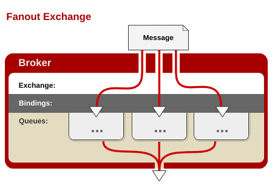

> 第一节 RabbitMQ架构与实战

# 1 RabbitMQ 介绍、概念、基本架构

## 1.1 RabbitMQ 介绍

RabbitMQ，俗称 “兔子MQ” （可见其轻巧，敏捷），是目前非常热门的一款开源消息中间件，不管是互联网行业还是传统行业都广泛使用（最早是为了解决电信行业系统之间的可靠通信而设计）。

1. 高可靠性、易扩展、高可用、功能丰富等。
2. 支持大多数（甚至冷门）的编程语言客户端。
3. RabbitMQ 遵循 AMQP 协议，自身采用 Erlang（一种由爱立信开发的通用面向并发编程的语言）编写。
4. RabbitMQ 也支持 MQTT 等其他协议。

RabbitMQ 具有很强大的插件扩展能力，官方和社区提供了非常丰富的插件可供选择：

https://www.rabbitmq.com/community-plugins.html

## 1.2 RabbitMQ 整体逻辑架构


## 1.3 RabbitMQ Exchange 类型

RabbitMQ 常用的交换器类型有：`fanout`、`direct`、`topic`、`headers` 四种。

### 1.3.1 fanout

会把所有发送到该交换器的消息，路由到所有与该交换器绑定的队列中，如图：



### 1.3.2 direct

direct 类型的交换器路由规则很简单，它会把消息路由到那些 BindingKey 和 RoutingKey 完全匹配的队列中，如下图：


### 1.3.3 topic

topic 类型的交换器在 direct 匹配规则上进行了扩展，也是将消息路由到 BindingKey 和 RoutingKey 相匹配的队列中，这里的匹配规则稍微不同，它约定：

BindingKey 和 RoutingKey 一样都是由 "." 分割的字符串；BindingKey 中可以存在两种特殊字符 `*` 和 `#`，用于模糊匹配，其中  `*` 用于匹配一个单词，`#` 用于匹配多个单词（可以是0个）。


### 1.3.4 headers

headers 类型的交换器不依赖于路由键的匹配规则来路由信息，而是根据发送的消息内容中的 headers 属性进行匹配。在绑定队列 和 交换器时 指定一组键值对，当发送的消息到交换器时，RabbitMQ 会获取到该消息的 headers，对比其中的键值对完全匹配 队列 和 交换器 绑定时指定的键值对；如果匹配消息就会路由到该队列。headers 类型的交换器性能很差，不实用。

## 1.4 RabbitMQ 数据存储

### 1.4.1 存储机制

RabbitMQ 的消息有两种类型：

1. 持久化消息
2. 非持久化消息

这两种消息都会被写入磁盘。持久化消息在到达队列时写入磁盘，同时会内存中保存一份备份，当内存吃紧时，消息从内从中清除。这会提高一定的性能。

非持久化消息一般只存于内存中，当内存压力大时，数据刷盘处理，以节省内存空间。

RabbitMQ 存储层包含两个部分：**队列索引** 和 **消息存储**。


### 1.4.2 队列索引 rabbit_queue_index

索引维护队列的落盘消息的消息，比如：存储地点，是否已被消费者接收，是否以被消费者 ack 等。

每个队列都有相应的索引。


索引使用顺序的段文件来存储，后缀是 `.idx` ，文件名从 0 开始累加，每个段文件中包含固定的 `segment_entry_count` 条记录，默认值是**16384**。每个 index 从磁盘中读取消息的时候，**至少要在内存中维护一个段文件**，所以设置 `queue_index_embed_msgs_below` 值 的时候要**格外谨慎**，一点点增大也可能会引起内存爆炸式增长。

### 1.4.3 消息存储 rabbit_msg_store

消息以键值对的形式存储到文件中，一个虚拟主机上的所有队列使用同一块存储，每个节点只有一个。存储分为**持久化存储**（msg_store_persistent）和 **短暂存储**（msg_store_transient）。持久化存储的内容在 broker 重启后丢失。

store 使用文件来存储，后缀为 `.rdq`，经过 store 处理的所有消息都会以追加的方式写入到该文件中，当该文将的大小超过指定的限制（file_size_limit）后，将会关闭该文件并创建一个新的文件以供新的消息写入。文件名从 0 开始进行累加。在进行消息的存储时，RabbitMQ 会在 ETS （Erlang Term Storage）表中记录消息在文件中的位置映射和文件的相关信息。

消息（包括消息头、消息体、属性）可以直接存储在 index 中，也可以存储在 store 中。最佳的方式是较小的消息存在 index 中，而较大的消息存在 store 中。这个消息大小的界定可以通过 `queue_index_embed_msgs_below` 来配置，默认值为 4096 B。当一个消息小于设定的大小阈值时，就可以存储在 index 中，这样性能上可以得到优化。**一个完整的消息**大小 小于这个值，就放到索引中，否则放到持久化消息文件中。

rabbitmq.conf 中的配置信息：

```properties
## Size in bytes below which to embed messages in the queue index. 
## Related doc guide: https://rabbitmq.com/persistence-conf.html 
##
# queue_index_embed_msgs_below = 4096

## You can also set this size in memory units 
##
# queue_index_embed_msgs_below = 4kb
```

如果消息小于这个值，就在索引中存储，如果消息大于这个值就在 store 中存储。

大于这个值的消息存储于 msg_store_persistent 目录中的 `<num>.rdq` 文件中：

小于这个值的消息存储于 `<num>.idx` 索引文件中：


**读取消息**时，先根据消息的 ID（msg_id）找到对应存储的文件，如果文件存在并且未被锁住，则直接打开文件，从指定位置读取消息内容。如果文件不存在或者被锁住了，则发送请求由 store 进行处理。

**删除消息**时，只是从 ETS 表删除删除指定消息的相关信息，同时更新消息对应的存储文件和相关信息。在执行消息删除操作时，并不立即对文件中的消息进行删除，也就说消息依然在文件中，仅仅是标记为垃圾数据而已。当一个文件中都是垃圾数据时，可以将这个文件删除。

当检测到前后两个文件中的有效数据可以合并成一个文件，并且所有的垃圾数据的大小和所有文件（至少有3个文件存在的情况下）的数据大小的比值超过设置的阈值 `garbage_fraction`（默认值0.5）时，才会触发垃圾回收，将这两个文件合并，**执行合并的两个文件一定是逻辑上相邻的两个文件**。合并逻辑：

1. 锁定这两个文件；
2. 先整理前面文件的有效数据，再整理后面文件的有效数据；
3. 将后面文件的有效数据写入到前面的文件中；
4. 更新消息在 ETS 表中的记录；
5. 删除后面文件。


### 1.4.4 队列结构

通常队列由 rabbit_amqqueue_process 和 backing_queue 这两部分组成，rabbit_amqqueue_process 负责协议相关的消息处理，即接收生产者发布的消息、向消费者交付消息，处理消息的确认（包括生产端的 confirm 和 消费端的 ack）等。backing_queue 是消息存储的具体形式 和 引擎，并向 rabbit_amqqueue_process 提供相关的接口以供调用。


# 2 安装和配置 RabbitMQ

# 3 RabbitMQ 常用操作命令

# 4 RabbitMQ 工作流程详解

# 5 RabbitMQ 工作模式详解

# 6 Spring 整合 RabbitMQ

# 7 SpringBoot 整合 RabbitMQ