第二部分 RabbitMQ

# 1 RabbitMQ架构与实战

## 1.1 RabbitMQ介绍、概念、基本架构

### 1.1.1 RabbitMQ介绍

RabbitMQ，是目前非常热门的一款开源消息中间件。

- 高可靠性，易扩展、高可用、功能丰富等
- 支持大多数（甚至冷门）的编程语言客户端
- RabbitMQ遵循AMQP协议，自身采用Erlang编写。
- RabbitMQ也支持MQTT等其他协议。

RabbitMQ具有强大的插件扩展能力，官方和社区提供了丰富的插件可供选择：

https://www.rabbitmq.com/community-plugins.html

### 1.1.2  RabbitMQ整体逻辑框架

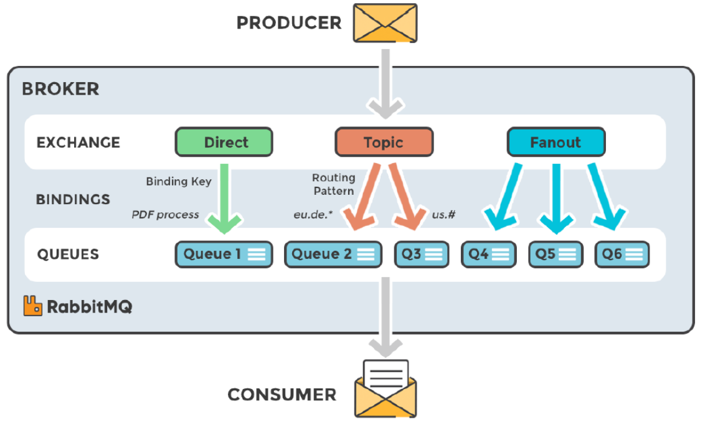

### 1.1.3 RabbitMQ Exchange类型

RabbitMQ常用的交换器类型有：`fanout`、`direct`、`topic`、`headers`四种。

**fanout**

会把所有发送到该交换器的消息路由到所有与该交换器绑定的队列中，

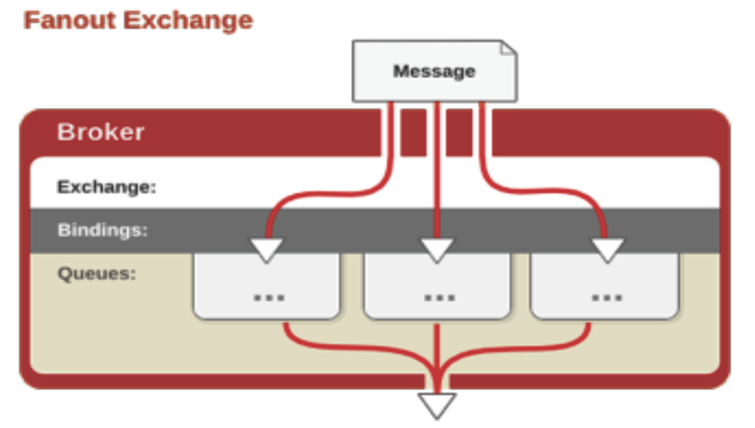

**direct**

direct类型的交换器规则很简单，它会把消息路由到那些BindingKey和RouteingKey完全匹配的队列中：

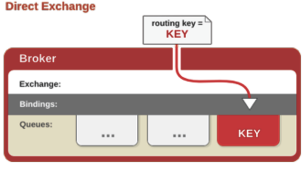

**topic**

topic类型的交换器在direct匹配规则上进行了扩展，也是讲消息路由到Bindingkey和RoutingKey相匹配的队列中，这里的匹配规则不同，约定：BindingKey和RoutingKey一样都是由“.”分隔的字符串；BindingKey中可以存在两种特殊字符"*"和"#"，用于模糊匹配，其中 ” *“用于匹配一个单词，”#“用于匹配多个单词（可以是0个）。

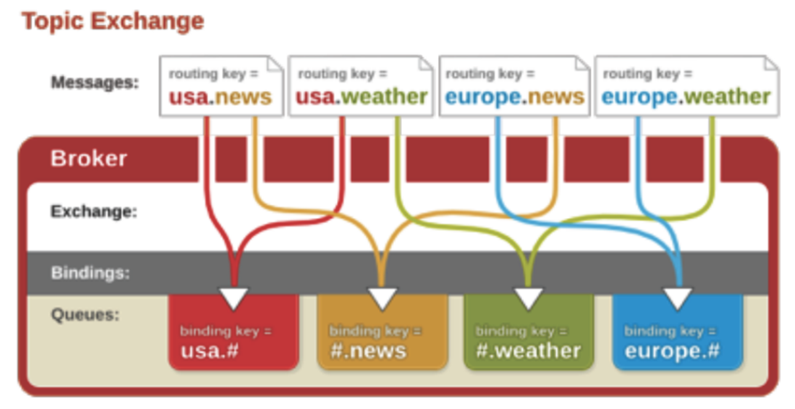

**headers**

headers类型的交换器不依赖于路由键的匹配规则来路由信息，而是根据发送的消息内容中的headers属性进行匹配。在绑定队列和交换器时指定一组键值对，当发送的消息到交换器时，RabbitMQ会获取到该消息的headers，对比其中的键值对是否完全匹配队列和交换器绑定时指定的键值对，如果匹配，消息就会路由到该队列。headers类型的交换器性能很差，不实用。

### 1.1.4 RabbitMQ数据存储

#### 1.1.4.1 存储机制

RabbitMQ消息有两种类型：

- 持久化消息
- 非持久化消息

这两种消息都会被写入磁盘。

持久化消息在达到队列时写入磁盘，同时会在内存中保存一份备份，当内存吃紧时，消息从内存中清除，这会提高一定的性能。

非持久化消息一般只存在于内存中，当内存压力大时数据刷盘处理，节省内存空间。

**RabbitMQ存储层包含两个部分**，**队列索引**和**消息存储**。

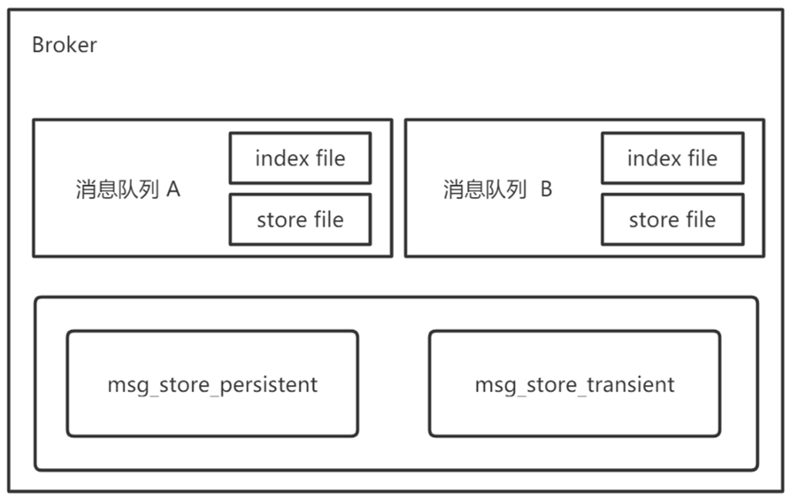

#### 1.1.4.2 队列索引 Rabbit_queue_index

索引维护队列的落盘消息的信息，如存储地点，是否已被消费者接收，是否已被消费者ack等。每个队列都有相对应的索引。

索引使用顺序的段文件来存储，后缀为.idx，文件名从0开始累加，每个段文件中包含固定的`segment_entry_count`条记录，默认值**16384**。**每个index从磁盘中读取消息的时候，至少要在内存中维护一个段文件**，所以设置`queue_index_embed_msgs_below`值时要格外谨慎，一点点增大可能会引起内存爆炸式增长。

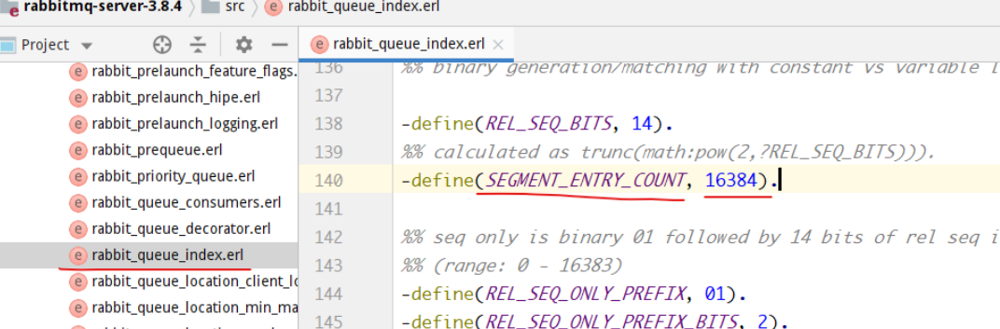

#### 1.1.4.3 消息存储 rabbit_msg_store

消息以键值对的形式存储到文件中，一个虚拟机上的所有队列使用同一块存储，每个节点只有一个。存储分为持久化存储（msg_store_persistent）和短暂存储（msg_store_transient）。持久化存储的内容在broker重启后不会丢失，短暂存储的内容在broker重启后丢失。

store使用文件来存储，后缀为.rdq，经过store处理的所有消息都会以追加的方式写入到该文件中，当文件的大小超过指定限制（file_size_limit）后，将会关闭该文件并创建一个新的文件供新消息写入。文件名从0开始进行累加，在进行消息存储时，RabbitMQ会在ETS（Erlang Term Storage）表中记录消息在文件中的位置映射和文件的相关信息。

消息（包括消息头、消息体、属性）可以直接存储在index中，也可以存储在store中。最佳的方式是较小的消息存储在index中，而较大的消息存储在store中。这个消息大小的界定可以通过`queue_index_embed_msgs_below`来配置，默认值为4096B，当一个消息小于设定的大小阈值时，就可以存储在index中，这样性能上可以得到优化。一个完整的消息小于这个值就放索引中，否则就放到持久化消息文件中。

读取消息时，先跟及消息ID（msg_id）找到对应存储的文件，如果文件存在并且没有锁住，则直接打开文件，从执行位置读取消息内容。如果文件不存在或者被锁住了，则发送请求由store进行处理。

删除消息时，只是从ETS表中删除指定消息的相关信息，同时更新消息对应的存储文件和相关信息。在执行消息删除操作时，并不立即对文件中的消息进行删除，也就是说信息依然在文件中，仅仅是标记为垃圾数据而已。当一个文件中都是垃圾数据时可以删除这个文件。当检测到前后两个文件中的有效数据可以合并成一个文件，并且所有的垃圾数据的大小和所有文件（至少有3个文件存在的情况下）的数据大小的比值超过设置的阈值garbage_fraction（默认值0.5）时，才会触发垃圾回收，将这两个文件合并，执行合并的两个文件一定是逻辑上相邻的两个文件，合并逻辑：

- 锁定这两个文件
- 先整理起那面文件的有效数据，再整理后面文件的有效数据
- 将后面文件的有效数据写入到前面的文件中
- 更新消息在ETS表中的记录
- 删除后面的文件

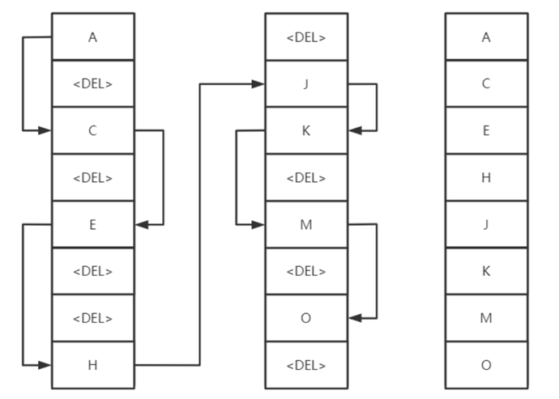

#### 1.1.4.4 队列结构

通常队列由rabbit_amqqueue_process和backing_queue这两部分组成，rabbit_amqqueue_process负责协议相关的消息处理，即接收生产者发布的消息、向消费者较复消息、处理消息的确认（包括生产段的confirm和消费端的ack）等。backing_queue是消息存储的具体形式和引擎，并向rabbit_amqqueue_process提供相关的接口以供调用。

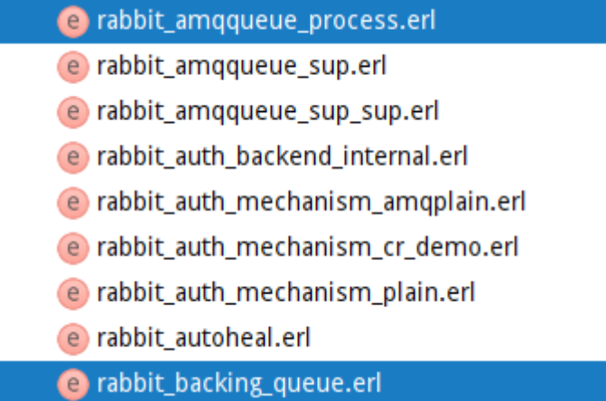

如果消息投递的目的队列是空的，并且有消息消费者订阅了这个队列，那么该消息会直接发送给消费者，不会经过队列这一步。当消息无法直接投递给消费者时，需要暂时将消息存入队列，以便重新投递。

`rabbit_variable_queue.erl`源码中定义了RabbitMQ队列的**4种状态**：

- alpha：消息索引和消息内容**都存内存**，最消耗内存，很少消耗CPU
- beta：消息索引存内存，消息内容存磁盘
- gama：消息索引在内存和磁盘都有，消息内容存磁盘
- delta：消息索引和内容都存磁盘，基本不消耗内存，消耗更多CPU和IO操作

消息存入队列后，不是固定不变的，它会随着系统的负载在队列中不断流动，消息的状态会不断发生变化。

持久化的消息，索引和内容都必须先保存在磁盘上，才会处于上述状态中的一种。gama状态只有持久化消息才会有的状态。

在运行时，RabbitMQ会根据消息传递的速度定期计算一个当前内存中能够保存的最大消息数量（target_tam_count），如果alpha状态的消息数据大于此值，则会引起消息的状态转换，对于的消息可能转换到beta、gama、delta状态。区分这四种状态的主要作用是满足不同内存和CPU需求。

对于普通没有设置优先级和镜像的队列来说，backing_queue的默认实现是rabbit_variable_queue，其内部通过5个子队列Q1，Q2，delta，Q3，Q4来体现消息的各种状态。

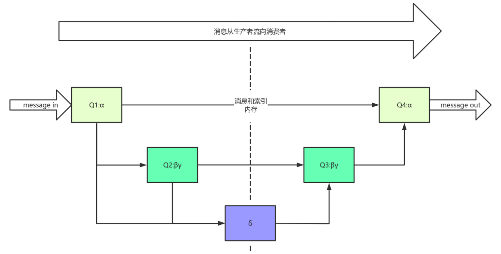

消费者获取消息也会引起消息的状态转换。

当消费者获取消息时

> 1.首先会从Q4中获取消息，如果获取成功则返回。
>
> 2.如果Q4为空，则尝试从Q3中获取消息，系统首先会判断Q3是否为空，如果为空则返回队列为空，即此时队列中无消息。
>
> 3.如果Q3不为空，则取出Q3中的消息；进而再判断此时Q3和Delta中的长度，如果都为空，则可以认为Q2，Delta，Q3，Q4全部为空，此时将Q1中的消息直接转移至Q4，下次直接从Q4中获取消息。
>
> 4.如果Q3为空，Delta不为空，则将Delta的消息转移至Q3中，下次可以直接从Q3中获取消息，在将消息从Delta转移到Q3的过程中，是按照索引分段读取的，首先读取某一段，然后判断读取的消息个数与Delta中的消息个数是否相等，如果相等，则可以判断此时Delta中已无消息，则直接将Q2和刚读取的消息一并放入到Q3中，如果不相等，仅将此次读取的消息转移到Q3。

> 对于持久化消息，一定会进入gama状态，在开启publisher confirm机制时，只有到了gama状态时才会确认该消息已被接收，若消息消费速度足够快，内存也充足，这些消息不会继续走到下一个状态。

## 1.2 安装和配置RabbitMQ

安装环境：

1.虚拟主机软件 ： VirtualBox  5.2.34 r133893 (Qt5.6.2)

2.操作系统：CentOS Linux release 7.7.1908

3.Erlang：erlang-23.0.2-1.el7.x86_64

4.RabbitMQ：rabbitmq-server-3.8.5-1.el7.noarch


RabbitMQ的安装需要首先安装Erlang，因为它是基于Erlang的VM运行的。

RabbitMQ需要的依赖：socat和logrotate，logrotate操作系统中已经存在了，只需要安装socat就可以。

RabbitMQ与Erlang的兼容关系详见：https://www.rabbitmq.com/which-erlang.html


1.安装依赖

```
yum install socat -y
```

2.安装Erlang

erlang-23.0.2-1.el7.x86_64下载地址：https://github.com/rabbitmq/erlang-rpm/releases/download/v23.0.2/erlang-23.0.2-1.el7.x86_64.rpm

首先将erlang-23.0.2-1.el7.x86_64.rpm上传至服务器，然后执行下述命令：

```
rpm -ivh erlang-23.0.2-1.el7.x86_64.rpm
```

3.安装RabbitMQ

rabbitmq-server-3.8.5-1.el7.noarch.rpm下载地址：http://github.com/rabbitmq/rabbitmq-server/releases/download/v3.8.5/rabbitmq-server-3.8.5-1.el7.noarch.rpm

将rabbitmq-server-3.8.5-1.el7.noarch.rpm上转至服务器，然后执行：

```
rpm -ivh rabbitmq-server-3.8.5-1.el7.noarch.rpm
```

查看rabbitmq服务

```shell
[root@localhost ~]# systemctl list-unit-files | grep rabbitmq-server
rabbitmq-server.service                       disabled

```

```shell
#rabbitmq安装路径
[root@localhost rabbitmq]# pwd
/usr/lib/rabbitmq
```

4.启用RabbitMQ的管理插件

```
rabbitmq-plugins enable rabbitmq_management
```


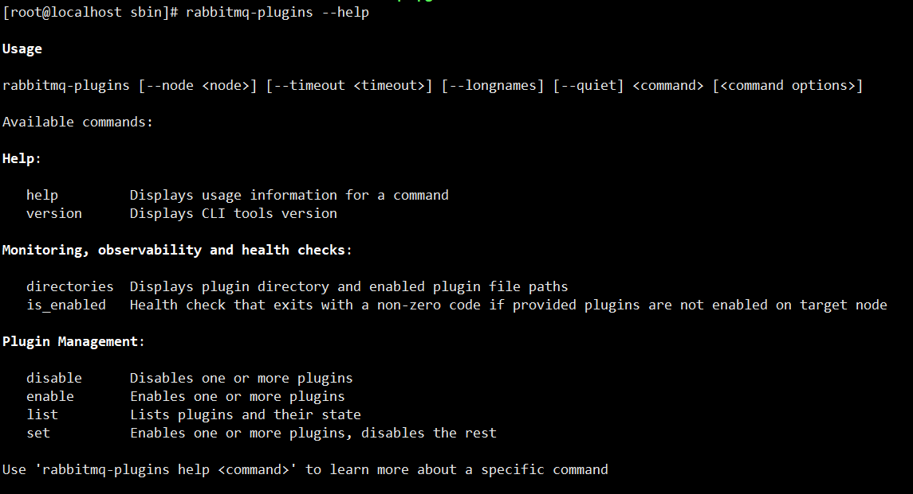

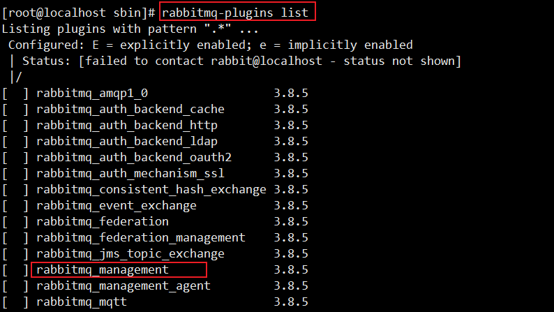

5.开启RabbitMQ

```shell
#rabbitmq 后台启动
systemctl start rabbitmq-server
#或 前端启动
rabbitmq-server
```

后台启动

```shell
rabbitmq-server -detached
```

6.添加用户

```
[root@localhost ~]# rabbitmqctl add_user root 123456
Adding user "root" ...
[root@localhost ~]# rabbitmqctl list_users
Listing users ...
user	tags
guest	[administrator]
root	[]
rabbitmqctl add_user root 123456


```

7.给用户添加标签

```shell
[root@localhost ~]# rabbitmqctl set_user_tags root administrator
Setting tags for user "root" to [administrator] ...
[root@localhost ~]# rabbitmqctl list_users
Listing users ...
user	tags
guest	[administrator]
root	[administrator]

```

8.给用户添加权限

```shell
[root@localhost ~]# rabbitmqctl set_permissions --vhost / root ".*" ".*" ".*"
Setting permissions for user "root" in vhost "/" ...

```

用户的标签和权限：

| Tag           | Capabilities                                                 |
| ------------- | ------------------------------------------------------------ |
| None          | 没有访问management插件的权限                                 |
| management    | 可以使用消息协议做任何操作的权限，加上：<br/>1. 可以使用AMQP协议登录的虚拟主机的权限<br/>2. 查看它们能登录的所有虚拟主机中所有队列、交换器和绑定的权限<br/>3. 查看和关闭它们自己的通道和连接的权限<br/>4. 查看它们能访问的虚拟主机中的全局统计信息，包括其他用户的活动 |
| policymaker   | 所有management标签可以做的，加上：<br/>1. 在它们能通过AMQP协议登录的虚拟主机上，查看、创建和删除策略以及虚 拟主机参数的权限 |
| monitoring    | 所有management能做的，加上：<br/>1. 列出所有的虚拟主机，包括列出不能使用消息协议访问的虚拟主机的权限<br/>2. 查看其他用户连接和通道的权限<br/>3. 查看节点级别的数据如内存使用和集群的权限<br/>4. 查看真正的全局所有虚拟主机统计数据的权限 |
| administrator | 所有policymaker和monitoring能做的，加上：<br/>1. 创建删除虚拟主机的权限<br/>2. 查看、创建和删除用户的权限<br/>3. 查看、创建和删除权限的权限<br/>4. 关闭其他用户连接的权限 |

9.访问 http://ip:15672

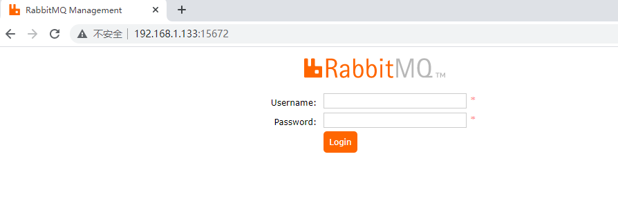

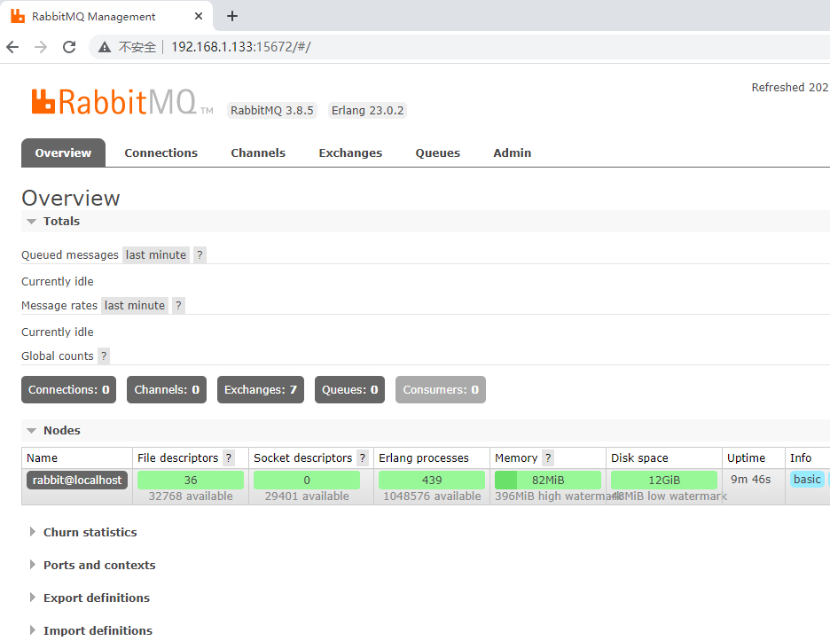

## 1.3 RabbitMQ常用操作命令


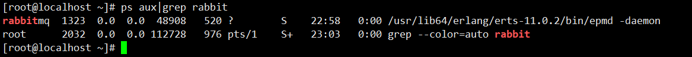

erlang port mapper daemon 端口管理，负责通信

```shell
# 前台启动Erlang VM和RabbitMQ
rabbitmq-server

# 后台启动
rabbitmq-server -detache

# 停止RabbitMQ和Erlang VM
rabbitmqctl stop

#查看所有队列
rabbitmqctl list_queues
systemctl start rabbitmq-server

# 查看所有虚拟主机
rabbitmqctl list_vhosts
rabbitmqctl list_vhosts --formatter pretty_table

# 在Erlang VM运行的情况下启动/关闭RabbitMQ应用
rabbitmqctl start_app
rabbitmqctl stop_app
```


## 1.4 RabbitMQ工作流程详解

## 1.5 RabbitMQ工作模式详解

## 1.6 Spring整合RabbitMQ

## 1.7 SpringBoot整合RabbitMQ

# 2 RabbitMQ高级特性解析

# 3 RabbitMQ集群与运维

# 4 RabbitMQ源码剖析