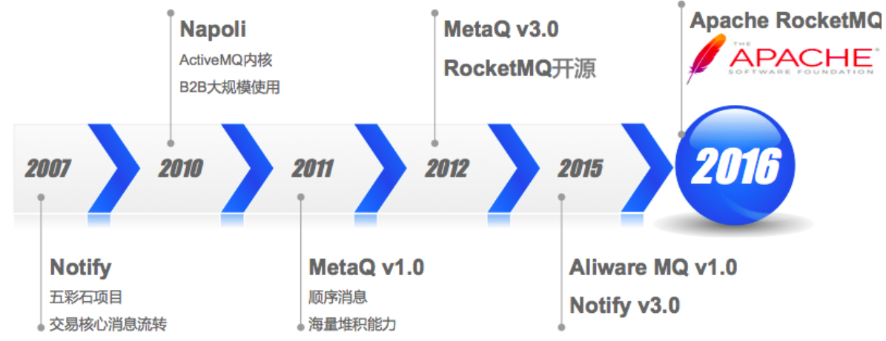
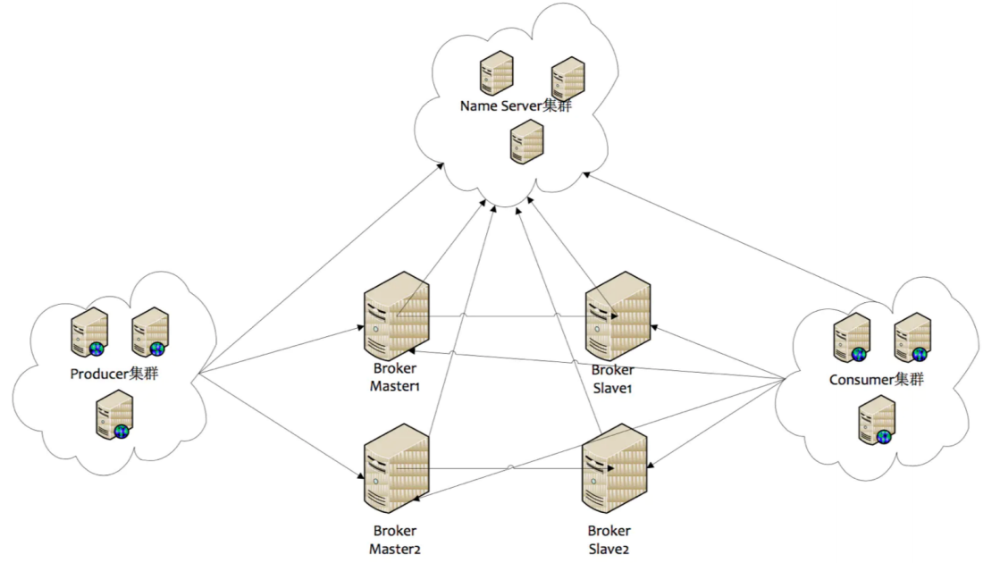
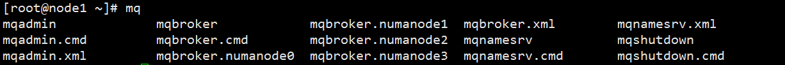
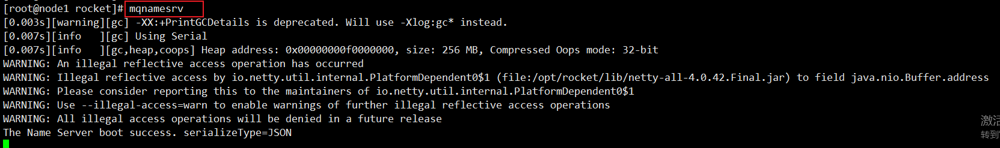
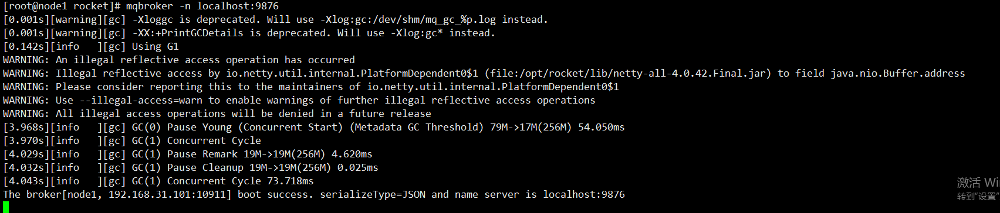
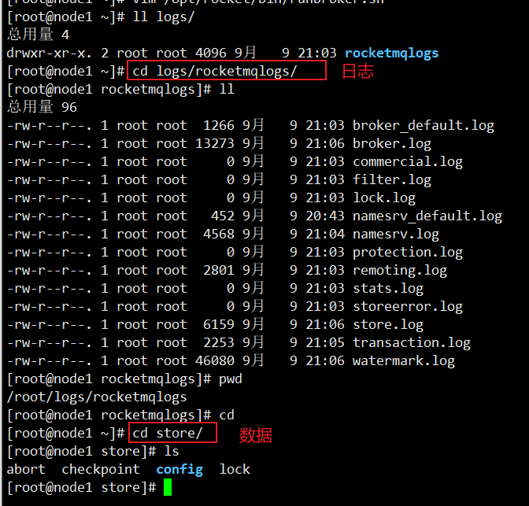
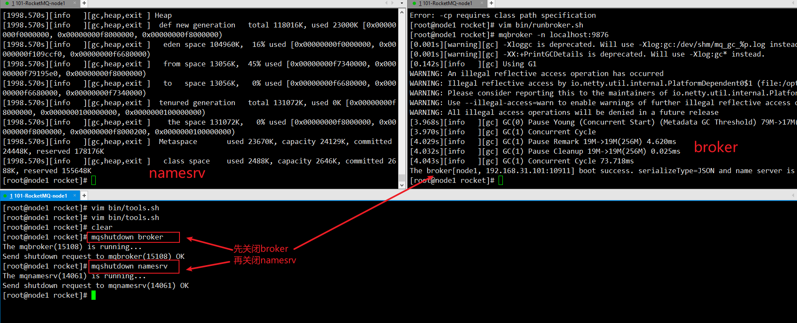
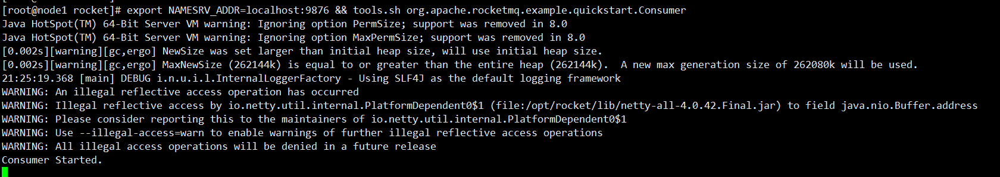
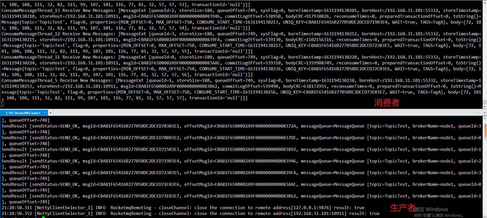

第一部分 RocketMQ架构与实战

# 1 RocketMQ的前世今生



# 2 RocketMQ的使用场景

- 应用解耦
- 流量削峰
- 数据分发

# 3 RocketMQ部署架构

RocketMQ的角色介绍

- Producer：消息的发送者，
- Consumer：消息接收者
- Broker：暂存和传输消息
- NameServer：管理Broker
- Topic：区分消息的种类，一个发送者可以发送消息给一个或多个Topic；一个消费的接收者可以订阅一个或多个Topic消息
- MessageQueue：相当于Topic的分区；用于并行发送和接收消息



- NameServer是一个几乎无状态节点，可集群部署，节点之间无任何信息同步。
- Broker部署相对复杂，Broker分为Master与Slave，一个Master可以对应多个Slave，但是一个Slave只能对应一个Master，Master与Slave的对应关系通过指定<span style='background-color:yellow'>**相同的BrokerName**</span>，<span style='background-color:yellow'>**不同的BrokerId**</span>来定义，BrokerId为0表示Master，非0表示Slave。Master也可以部署多个。每个Broker与NameServer集群中的所有节点建立长连接，定时注册Topic信息到所有NameServer。注意：当前RocketMQ版本在部署架构上支持1Master多Slave，但是只有BrokerId=1的从服务器才会参与消息的读负载。
- Producer与NameServer集群中的其中一个节点（随机选择）建立长连接，定期从NameServer获取Topic路由信息，并向提供Topic服务的Master建立长连接，且定时向Master发送心跳。Producer完全无状态，可集群部署。
- Consumer与NameServer集群中的其中一个节点（随机选择）建立长连接，定期从NameServer获取Topic路由信息，并向提供Topic服务的Master、Slave建立长连接，且定时向Master、Slave发送心跳。Consumer既可以从Master订阅消息，也可以从Slave订阅消息，消费者在向Master拉取消息时，Master服务器会根据拉取偏移量与最大偏移量的距离（判断是否读老消息，产生读I/O），以及从服务器是否可读等因素建议下一次是从Master还是Slave拉取。


**执行流程：**

1. 启动NameServer，NameServer起来后监听端口，等待Broker、Producer、Consumer连接上，相当于一个路由控制中心。
2. Broker启动，跟所有的NameServer保持长连接，定时发送心跳包，心跳包中包含当前Broker信息（IP+端口号）以及存储所有Topic信息。注册成功后，NameServer集群中就有Topic跟Broker的映射关系。
3. 收发消息前，先创建Topic，创建Topic时需要指定Topic要存储在那些Broker上，也可以在发送消息时自动创建Topic。
4. Producer发送消息，启动时先跟NameServer集群中的其中一台建立长连接，并从NameServer中获取当前发送的Topic存在哪些Broker上，轮询从队列中选择一个队列，然后与队列所在的Broker建立长连接从而向Broker发消息。
5. Consumer跟Producer类似，跟其中一台NameServer建立长连接，获取当前订阅Topic存在哪些Broker上，然后直接跟Broker建立连接通道，开始消费消息。

# 4 RocketMQ特性

## 4.1 订阅与发布

消息的发布是指某个生产者向topic发送消息；消息的订阅是指某个消费者关注了某个topic中带有某些tag的消息。

## 4.2 消息顺序

消息有序指的是一类消息消费时，能按照发送的顺序来消费。例如：一个订单产生了三条消息：订单创建、订单付款、订单完成。消费时要按照这个顺序消费才能有意义，但是同时订单之间是可以并行消费的。RocketMQ可以严格的保证消息有序。

## 4.3 消息过滤

RocketMQ的消费者可以根据Tag进行消费过滤，也支持自定义属性过滤。消息过滤目前是在Broker端实现的，优点是减少了对于Consumer无用消息的网络传输，缺点是增加了Broker的负担，而且实现相对复杂。

## 4.4 消息可靠性

RocketMQ支持消息的高可靠，影响消息可靠性的几种情况：

1. Broker非正常关闭
2. Broker异常Crash
3. OS Crash
4. 机器掉电，但是能立即恢复
5. 机器无法开机（可能是cpu、主板、内存等关键设备损坏）
6. 磁盘设备损坏

1、2、3、4四种情况属于硬件资源可立即恢复情况，RocketMQ在这四种情况下能保正消息不丢失，挥着丢失少量数据（依赖刷盘方式是同步还是异步）。

5、6属于单点故障，且无法恢复，一旦发生，在此单点上的消息全部丢失。

RocketMQ在这两种情况下，通过异步复制，可保证99%的消息不丢失，但是仍然会有极少量的消息可能丢失。

通过同步双写技术可以完全避免单点，同步双写势必会影响性能，适合对消息可靠性要求极高的场景。注：RocketMQ从3.0版本开始支持同步双写。

## 4.5 至少一次

至少一次（At Least Once）指每个消息必须投递一次。Consumer先Pull消息到本地，消费完成后，才向服务器返回ack，如果没有消费一定不会ack消息，所以RocketMQ可以很好的支持此特性。

## 4.6 回溯消费

回溯消费是指Consumer已经消费成功的消息，由于业务上需求需要重新消费，要支持此功能，Broker在向Consumer投递成功消息后，消息仍然保留。并且重新消费一般是按照时间维度，例如由于Consumer系统故障，恢复后需要重新消费1小时前的数据，那么Broker提供一种机制，可以按照时间维度来回退消费进度。RocketMQ支持按照时间回溯消费，时间精确到毫秒。

## 4.7 事务消息

RocketMQ事务消息（Transactional Message）是指应用本地事务和发送消息操作可以被定义到全局事务中，要么同时成功，要么同时失败。

RocketMQ的事务消息提供类似X/Open XA的分布事务功能，通过事务消息能达到分布式事务的最终一致性。

## 4.8 定时消息

定时消息（延迟队列）是指消息发送到Broker后，不会立即被消费，等待特定时间投递给真正的topic。

Broker有配置型messageDelayLevel，默认值为“1s 5s 10s 30s 1m 2m 3m 4m 5m 6m 7m 8m 9m 10m 20m 30m 1h 2h”，18个Level。

messageDelayLevel是Broker的属性，不属于某个Topic。发消息时，设置delayLevel等级即可：msg.setDelayLevel(level)。level有以下三种情况：

- level == 0，消息为非延迟消息。
- 1<= level <= maxLevel，消息延迟特定时间，eg：level=1，延迟1s。
- level > maxLevel，则level == maxLevel，eg：level = 20，延迟2h。

定时消息会暂存在名为SCHEDULE_TOPIC_XXXX的topic中，并根据delayTimeLevel存入特定的queue，queueId = delayTimeLevel-1，即一个queue志存相同延迟的消息，保证具有相同发送延迟的消息能够顺序消费。Broker会调度地消费SCHEDULE_TOPIC_XXXX，将消息写入真实地topic。

需要注意的是，定时消息会在第一次写入和调度写入真实topic时都会计数，因此发送数量、tps都会变高。

## 4.9 消息重试

Consumer消费消息失败后，要提供一种重试机制，令消息再消费一次。Consumer消费消息失败通常可以认为有以下几种情况：

1. 由于消息本身的原因，
2. 由于依赖的下游应用服务不可用，遇到这种情况，即使跳过当前失败的消息，消费其他消息同样也会失败，这种情况建议应用sleep 30s，再消费下一条消息，这样可以减轻Broker重试消息的压力。

## 4.10 消息重投

生产者在发送消息时：

- 同步消息失败会重投。
- 异步消息由重试。
- oneway没有任何保证。

消息重投保证消息尽可能发送成功、不丢失，但可能会造成消息重复，<span style="background-color:yellow">**消息重复在RocketMQ中是无法避免的问题**</span>。消息重复在一般情况下不会发生，当出现消息量大，网络抖动、消息重复就会是大概率事件。另外，生产者主动重发、consumer负载变化也会导致重复消息。

如下方法可以设置消息重投策略：

1. `setRetryTimesWhenSendFailed`：同步发送失败重投次数，默认为2，因此生产者会最多尝试发送retryTimesWhenSendFailed+1次。不会选择上次失败的broker，尝试向其他broker发送，最大程度保证消息不丢失。超过重投次数，抛异常，由客户端保证消息不丢失。当出现RemotingException、MQClientException和部分MQBrokerException时会重投。
2. `setRetryTimesWhenSendAsyncFailed`：异步发送失败重投次数，异步重试不会选择其他broker，仅在同一个broker上做重试，不保证消息不丢。
3. `setRetryAnotherBrokerWhenNotStoreOK`：消息刷盘（主或备）超时或Slave不可用（返回状态非SEND_OK）， 是否尝试发送到其他broker，默认false。十分重要消息可以开启。

## 4.11 流量控制

生产者流控，因为broker处理能力达到瓶颈；消费者流控，因为消费能力达到瓶颈。

1. 生产者流控：

   - commitLog文件被锁时间超过osPageCacheBusyTimeOutMills时，参数默认为1000ms，发生流控。
   - 如果开启transientStorePoolEnable=true，且broker为异步刷盘的主机，且transientStorePool中资源不足，拒绝当前send请求，发生流控。
   - broker每个10ms检查send请求队列头部的等待事件，如果超过waitTimeMillsInSendQueue，默认200ms，拒绝当前send请求，发生流控。
   - broker通过拒绝send请求方式实现流量控制。

   **注意：生产者流控，不会尝试消息重投。**

2. 消费者流控：

   - 消费者本地缓存消息数超过pullThresholdForQueue时，默认1000。
   - 消费者本地缓存消息大小超过pullThresholdSizeForQueue时，默认100MB。
   - 消费者本地缓存消息跨度超过consumeConcurrentlyMaxSpan时，默认2000。
   - 消费者流控的结果是降低拉取频率。

## 4.12 死信队列

死信队列用于处理无法被正常消费的消息。

当一条消息初次消费失败，消息队列会自动进行消息重试；达到最大重试次数后，若消费依然失败，则表明消费者在正常情况下无法正确地消费该消息。此时，消息队列不会立刻将消息丢弃，而是将其发送到该消费者对应地特殊队列中。

RocketMQ将这种正常情况下无法被消费的消息成为死信消息（Dead-Letter Message），将存储死信消息的特殊队列成为死信队列（Dead-Letter-Queue）。在RocketMQ中，可以通过console控制台对死信队列中的消息重发来使消费者实例再次进行消费。

# 5 消费模式Push or Pull

RocketMQ消息订阅有两种模式，一种是Push模式（MQPushConsumer），即MQServer主动向消费者端推送；另一种是Pull模式（MQPullConsumer），即消费端在需要时，主动到MQ Server拉取。但在具体实现时，Push和Pull模式<span style='background-color:yellow'>**本质都是采用消费端主动拉取的方式**</span>，即consumer轮询从Broker拉取消息。

- Push模式特点：

  好处就是实时性高；不好处在于消费端的处理能力有限，当瞬时推送很多消息给消费端时，容易造成消费端的消息积压，严重时会压垮客户端。

- Pull模式

  好吃就是主动权掌握在消费端自己手中，根据自己的处理能力量力而行。却点就是如何控制Pull的频率。定时间隔太久担心影响时效性，间隔时间太短担心无用功。折中办法就是长轮询。

- Push和Pull模式的区别：

  Push方式里，consumer把长轮询的动作封装了，并注册MessageListener监听器，取到消息后，唤醒MessageListener的consumerMessage()来消费，对用户而言，感觉消息是被推送过来的。

  Pull方式里，取消息的过程需要用户自己主动调用，首先通过打算消费的topic拿到MessageQueue的集合，遍历MessageQueue集合，然后针对每个MessageQueue批量消费消息，一次取完后，记录该队列下一次要取的开始offset，直到取完，再换另一个MessageQueue。

  **RocketMQ使用长轮询机制来模拟Push效果，兼顾二者优点。**

# 6 RocketMQ中的角色及相关术语

## 6.1 消息模型(Message Model)

RocketMQ主要由Producer、Broker、Consumer三部分组成，其中Proucer负责生产消息，Consumer负责读取消息，Broker负责存储消息。

Broker在实际部署过程中对应一台服务器，每个Broker可以存储多个Topic的消息，每个Topic的消息也可以分片存储于不同的Broker。

MessageQueue用于存储消息的物理地址，每个Topic中的消息地址存储于多个Message Queue中。

ConsumerGroup由对各Consumer实例构成。

## 6.2 Producer

消息生产者，负责产生消息，一般由业务系统负责产生消息。

## 6.3 Consumer

消息消费者，负责消费消息，一般是后台系统负责异步消费。

## 6.4 PushConsumer

Consumer消费的一种类型，该模式下Broker收到数据后会主动推动给消费端。应用通常向Consumer对象注册一个Listener接口，一旦收到消息，Consumer对象立刻回调Listener接口方法。该消费模式一般实时性较高。

## 6.5 PullConsumer

Consumer消费的一种类型，应用通常主动调用Consumer的拉消息方法从Broker服务器拉取消息，主动权由应用控制。一旦获取了批量消息，应用就会启动消费过程。

## 6.6 ProducerGroup

同一类Producer的集合，这类Producer发送同一类消息且发送逻辑一致，如果发送的是事务消息且原始生产者在发送之后奔溃，则Broker服务器会联系同一生产组的其他生产者实例以提交或回溯消息。

## 6.7 ConsumerGroup

同一类Consumer的集合，这类Consumer通常消费同一类消息且消费逻辑一致。消费者组使得在消息消费方面，实现负载均衡和容错目标变得变得非常容易。要注意的是，消费组的消费实例必须订阅完全相同放入Topic。RocketMQ支持两种消费模式：集群消费（Clustering）和广播消费（Broadcasting）。

## 6.8 Broker

消息中转角色，负责存储消息，转发消息，一般也成为Server。在JMS规范中成为Provider。

## 6.9 广播消费

一条消息被多个Consumer消费，即使这些Consumer属于同一个Consumer Group，消息也会被每个Consumer都消费一次，广播消费中的Consumer Group概念可以认为在消息划分方面无意义。

在CORBA Notification规范中，消费方式都属于广播消费。

在JMS规范中，相当于JMS Topic（publish/subscribe）模型

## 6.10 集群消费

一个Consumer Group中的Consumer实例**平均分摊消费消息**。例如某个Topic有9条消息，其中一个Consumer Group有3个实例（可能是三个进程，或者3台机器），那每个实例之消费其中3条消息。

## 6.11 顺序消费

消费消息的顺序要同发送消息的顺序一致，在RocketMQ中主要指的是局部顺序，即一类消费为满足顺序性，必须Producer单线程顺序发送，且发送到同一个队列，这样Consumer就可以按照Producer发送的顺序去消费消息。

## 6.12 普通顺序消费


## 6.13 严格顺序消费

## 6.14 MessageQueue

## 6.15 标签（Tag）


# 7 RocketMQ环境搭建

## 7.1 软件准备

RocketMQ版本：4.5.1

https://www.apache.org/dyn/closer.cgi?path=rocketmq/4.5.1/rocketmq-all-4.5.1-bin-release.zip

## 7.2 环境要求

- JDK 11.0.5
- Linux64位操作系统（Centos Linux release 7.7 1908）
- 源码安装需要安装maven 3.2.x
- 最少4G存储空间

## 7.3 安装及启动

1. 下载rockermq

   ```
   wget https://archive.apache.org/dist/rocketmq/4.5.1/rocketmq-all-4.5.1-bin-release.zip
   ```

2. 解压

   ```
   #解压到/opt目录下
   unzip rocketmq-all-4.5.1-bin-release.zip -d /opt
   mv rocketmq-all-4.5.1-bin-release/ rocket
   ```

3. 修改环境变量

   安装JDK 11.0.5 ：rpm -ivh jdk-11.0.5_linux-x64_bin.rpm

   配置环境变量 vim /etc/profile

   ```shell
   export JAVA_HOME=/usr/java/jdk-11.0.5
   export PATH=$PATH:$JAVA_HOME/bin
   
   export ROCKETMQ_HOME=/opt/rocket
   export PATH=$PATH:$ROCKETMQ_HOME/bin
   
   #生效环境变量
   . /etc/profile
   ```

   输入mq，tab有提示，说明RocketMQ安装成功。



4. 启动前要修改脚本，因为RocketMQ是用JDK8编译开发的，而现在使用JDK11。

   vim /opt/rocket/bin/runserver.sh

   vim /opt/rocket/bin/runbroker.sh

   vim /opt/rocket/bin/tools.sh

   

**修改vim /opt/rocket/bin/runserver.sh**

```sh
#!/bin/sh

# Licensed to the Apache Software Foundation (ASF) under one or more
# contributor license agreements.  See the NOTICE file distributed with
# this work for additional information regarding copyright ownership.
# The ASF licenses this file to You under the Apache License, Version 2.0
# (the "License"); you may not use this file except in compliance with
# the License.  You may obtain a copy of the License at
#
#     http://www.apache.org/licenses/LICENSE-2.0
#
# Unless required by applicable law or agreed to in writing, software
# distributed under the License is distributed on an "AS IS" BASIS,
# WITHOUT WARRANTIES OR CONDITIONS OF ANY KIND, either express or implied.
# See the License for the specific language governing permissions and
# limitations under the License.

#===========================================================================================
# Java Environment Setting
#===========================================================================================
error_exit () 
{
echo "ERROR: $1 !!" 
exit 1
}

[ ! -e "$JAVA_HOME/bin/java" ] && JAVA_HOME=$HOME/jdk/java
[ ! -e "$JAVA_HOME/bin/java" ] && JAVA_HOME=/usr/java
[ ! -e "$JAVA_HOME/bin/java" ] && error_exit "Please set the JAVA_HOME variable in your environment, We need java(x64)!"

export JAVA_HOME
export JAVA="$JAVA_HOME/bin/java"
export BASE_DIR=$(dirname $0)/..
export CLASSPATH=.:${BASE_DIR}/conf:${JAVA_HOME}/jre/lib/ext:${BASE_DIR}/lib/*

#===========================================================================================
# JVM Configuration
#===========================================================================================
JAVA_OPT="${JAVA_OPT} -server -Xms256m -Xmx256m -Xmn128m -XX:MetaspaceSize=64m -XX:MaxMetaspaceSize=160m"
JAVA_OPT="${JAVA_OPT} -XX:CMSInitiatingOccupancyFraction=70 -XX:+CMSParallelRemarkEnabled -XX:SoftRefLRUPolicyMSPerMB=0 -XX:+CMSClassUnloadingEnabled -XX:SurvivorRatio=8"
JAVA_OPT="${JAVA_OPT} -verbose:gc -Xlog:gc:/dev/shm/rmq_srv_gc.log -XX:+PrintGCDetails"
JAVA_OPT="${JAVA_OPT} -XX:-OmitStackTraceInFastThrow"
JAVA_OPT="${JAVA_OPT}  -XX:-UseLargePages"
#JAVA_OPT="${JAVA_OPT} -Djava.ext.dirs=${JAVA_HOME}/jre/lib/ext:${BASE_DIR}/lib" 
#JAVA_OPT="${JAVA_OPT} -Xdebug -Xrunjdwp:transport=dt_socket,address=9555,server=y,suspend=n" 
JAVA_OPT="${JAVA_OPT} ${JAVA_OPT_EXT}"
JAVA_OPT="${JAVA_OPT} -cp ${CLASSPATH}"

$JAVA ${JAVA_OPT} $@
```

启动namesrv：mqnamesrv




**vim bin/runbroker.sh**

```sh
#!/bin/sh

# Licensed to the Apache Software Foundation (ASF) under one or more
# contributor license agreements.  See the NOTICE file distributed with 
# this work for additional information regarding copyright ownership.
# The ASF licenses this file to You under the Apache License, Version 2.0
# (the "License"); you may not use this file except in compliance with
# the License.  You may obtain a copy of the License at
#
#     http://www.apache.org/licenses/LICENSE-2.0
#
# Unless required by applicable law or agreed to in writing, software
# distributed under the License is distributed on an "AS IS" BASIS,
# WITHOUT WARRANTIES OR CONDITIONS OF ANY KIND, either express or implied.
# See the License for the specific language governing permissions and
# limitations under the License.

#===========================================================================================
# Java Environment Setting
#===========================================================================================
error_exit () 
{
   echo "ERROR: $1 !!"    
   exit 1
}

[ ! -e "$JAVA_HOME/bin/java" ] && JAVA_HOME=$HOME/jdk/java
[ ! -e "$JAVA_HOME/bin/java" ] && JAVA_HOME=/usr/java
[ ! -e "$JAVA_HOME/bin/java" ] && error_exit "Please set the JAVA_HOME variable in your environment, We need java(x64)!"

export JAVA_HOME
export JAVA="$JAVA_HOME/bin/java"
export BASE_DIR=$(dirname $0)/..
export CLASSPATH=.${JAVA_HOME}/jre/lib/ext:${BASE_DIR}/lib/*:${BASE_DIR}/conf:${CLASSPATH}

#===========================================================================================
# JVM Configuration
#===========================================================================================
JAVA_OPT="${JAVA_OPT} -server -Xms256m -Xmx256m -Xmn128m"
JAVA_OPT="${JAVA_OPT} -XX:+UseG1GC -XX:G1HeapRegionSize=16m -XX:G1ReservePercent=25 -XX:InitiatingHeapOccupancyPercent=30 -XX:SoftRefLRUPolicyMSPerMB=0"
JAVA_OPT="${JAVA_OPT} -verbose:gc -Xloggc:/dev/shm/mq_gc_%p.log -XX:+PrintGCDetails"
JAVA_OPT="${JAVA_OPT} -XX:-OmitStackTraceInFastThrow"
JAVA_OPT="${JAVA_OPT} -XX:+AlwaysPreTouch"
JAVA_OPT="${JAVA_OPT} -XX:MaxDirectMemorySize=15g"
JAVA_OPT="${JAVA_OPT} -XX:-UseLargePages -XX:-UseBiasedLocking"
#JAVA_OPT="${JAVA_OPT} -Xdebug -Xrunjdwp:transport=dt_socket,address=9555,server=y,suspend=n" 
JAVA_OPT="${JAVA_OPT} ${JAVA_OPT_EXT}"
JAVA_OPT="${JAVA_OPT} -cp ${CLASSPATH}"

numactl --interleave=all pwd > /dev/null 2>&1
if [ $? -eq 0 ]
then
    if [ -z "$RMQ_NUMA_NODE" ] ; then
        numactl --interleave=all $JAVA ${JAVA_OPT} $@
    else
        numactl --cpunodebind=$RMQ_NUMA_NODE --membind=$RMQ_NUMA_NODE $JAVA ${JAVA_OPT} $@
    fi
else
    $JAVA ${JAVA_OPT} --add-exports=java.base/jdk.internal.ref=ALL-UNNAMED $@
fi
```

启动broker： mqbroker -n localhost:9876




日志




**vim bin/tools.sh**

```sh
#!/bin/sh

# Licensed to the Apache Software Foundation (ASF) under one or more
# contributor license agreements.  See the NOTICE file distributed with
# this work for additional information regarding copyright ownership.
# The ASF licenses this file to You under the Apache License, Version 2.0
# (the "License"); you may not use this file except in compliance with
# the License.  You may obtain a copy of the License at
#
#     http://www.apache.org/licenses/LICENSE-2.0
#
# Unless required by applicable law or agreed to in writing, software
# (the "License"); you may not use this file except in compliance with
# the License.  You may obtain a copy of the License at
#
#     http://www.apache.org/licenses/LICENSE-2.0
#
# Unless required by applicable law or agreed to in writing, software
# distributed under the License is distributed on an "AS IS" BASIS,
# WITHOUT WARRANTIES OR CONDITIONS OF ANY KIND, either express or implied.
# See the License for the specific language governing permissions and
# limitations under the License.

#===========================================================================================
# Java Environment Setting
#===========================================================================================
error_exit () 
{
    echo "ERROR: $1 !!"
    exit 1
}

[ ! -e "$JAVA_HOME/bin/java" ] && JAVA_HOME=$HOME/jdk/java
[ ! -e "$JAVA_HOME/bin/java" ] && JAVA_HOME=/usr/java
[ ! -e "$JAVA_HOME/bin/java" ] && error_exit "Please set the JAVA_HOME variable in your environment, We need java(x64)!"

export JAVA_HOME
export JAVA="$JAVA_HOME/bin/java"
export BASE_DIR=$(dirname $0)/..
#export CLASSPATH=.:${BASE_DIR}/conf:${CLASSPATH}
export CLASSPATH=.${JAVA_HOME}/jre/lib/ext:${BASE_DIR}/lib/*:${BASE_DIR}/conf:${CLASSPATH}
#===========================================================================================
# JVM Configuration
#===========================================================================================
JAVA_OPT="${JAVA_OPT} -server -Xms256m -Xmx256m -Xmn256m -XX:PermSize=128m -XX:MaxPermSize=128m"
# JAVA_OPT="${JAVA_OPT} -Djava.ext.dirs=${BASE_DIR}/lib:${JAVA_HOME}/jre/lib/ext" 
JAVA_OPT="${JAVA_OPT} -cp ${CLASSPATH}"

$JAVA ${JAVA_OPT} $@
```




**先启动namesrv，在启动broker**

```shell
# 1.启动NameServer
mqnamesrv
# 2.查看启动日志
tail -f ~/logs/rocketmqlogs/namesrv.log
```

```shell
# 1.启动Broker
mqbroker -n localhost:9876 
# 2.查看启动日志
tail -f ~/logs/rocketmqlogs/broker.log
```

**先关闭broker，再关闭namesrv**

```shell
#关闭broker
mqshutdown broker
#关闭namesrv
mqshutdown namesrv
```


# 8 RocketMQ环境测试

建议先启动消费者

## 8.1 接收消息

```shell
export NAMESRV_ADDR=localhost:9876 && tools.sh org.apache.rocketmq.example.quickstart.Consumer
```



## 8.2 生产消息

```shell
# 1.设置环境变量
export NAMESRV_ADDR=localhost:9876 
# 2.使用安装包的Demo发送消息
sh bin/tools.sh org.apache.rocketmq.example.quickstart.Producer
```



# 9 RocketMQ相关API使用

使用前记得关闭linux的防火墙。


```
SendResult [
	sendStatus=SEND_OK,
    msgId=C0A81F8830601F89AB8331BAA5870000, 
    offsetMsgId=C0A81F6500002A9F0000000000057D64, 
    messageQueue=MessageQueue[topic=tp_demo_01, brokerName=node1, queueId=1], 
    queueOffset=0
    ]
```


# 10 RocketMQ和Spring整合

## 10.1 消息生产者

## 10.2 消息消费者