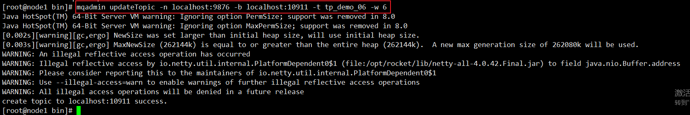

第二部分 RocketMQ高级特性及原理

# 1 消息发送

# 2 消息消费

# 3 消息存储

# 4 过滤消息


# 5 零拷贝原理

# 6 同步复制和异步复制

# 7 高可用机制

# 8 刷盘机制

# 9 负载均衡


```
mqbroker -n localhost:9876 -c /opt/rocket/conf/broker.conf
```


```
mqadmin updateTopic -n localhost:9876 -b localhost:10911 -t tp_demo_06 -w 6
```




```
mqadmin topicList -n localhost:9876
```


# 10 消息重试

## 10.1 顺序消息的重试

## 10.2 无序消息的重试

### 10.2.1 重试次数

### 10.2.2 配置方式

# 11 死信队列

https://github.com/apache/rocketmq-externals/archive/rocketmq-console-1.0.0.zip


# 12 延迟消息


# 13 顺序消息

## 13.1 部分有序

```
[root@node1 ~]# mqadmin updateTopic -b node1:10911 -n localhost:9876 -r 8 -t tp_demo_11 -w 8

[root@node1 ~]# mqadmin topicStatus -n localhost:9876 -t tp_demo_11

```


## 13.2 全局有序

```
[root@node1 ~]# mqadmin updateTopic -b node1:10911 -n localhost:9876 -r 1 -t tp_demo_11_01 -w 1

[root@node1 ~]# mqadmin topicStatus -n localhost:9876 -t tp_demo_11_01
```


# 14 事务消息

# 15 消息查询

区别于消息消费	


# 16 消息优先级

# 17 底层网络通信 - Netty高性能之道

# 18 限流

https://github.com/alibaba/Sentinel/wiki/Sentinel-%E4%B8%BA-RocketMQ-%E4%BF%9D%E9%A9%BE%E6%8A%A4%E8%88%AA


