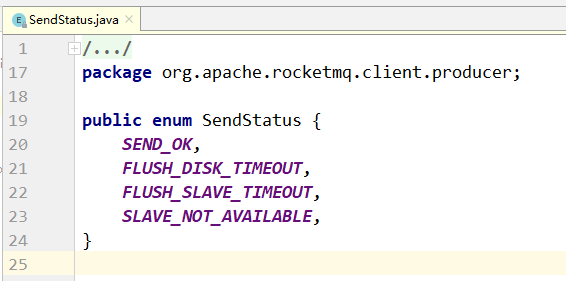

第三部分 RocketMQ高级实战

# 1 生产者

## 1.1 Tags的使用

一个应用尽可能用一个Topic，而消息子类型则可以用tags来标识。tags可以由应用自由设置，只有生产者在发送消息设置了tags，消费方在订阅消息时才能利用tags通过broker做消息过滤：

```java
// tag用于标记一类消息
message.setTags("tag1");
```


## 1.2 Keys的使用

每个消息在业务层面的唯一标识码要设置到keys字段，方便将来定位消息丢失问题。服务器会为每个消息创建索引（哈希索引），应用可以通过topic、key来查询消息内容，以及消息被谁消费。由于是哈希索引，请务必保证key尽可能唯一，这样可以避免潜在的哈希冲突。

```java
// key用于建立索引的时候，hash取模将消息的索引放到SlotTable的一个Slot链表中
message.setKeys("ord_2021_11_12");
```


## 1.3 日志的打印

消息发送成功或者失败要打印消息日志，务必要打印SendResult和Key字段。send消息方法只要不抛异常，就代表发送成功。发送成功会有多个状态，在sendResult里定义。



每个状态进行说明：

- **SEND_OK**

  消息发送成功。要注意的是消息发送成功也不意味着它是可靠的。要确保不会丢失任何消息，，还应启用同步Master服务器或同步刷盘，即SYNC_MASTER或SYNC_FLUSH。

- **FLUSH_DISK_TIMEOUT**

  消息发送成功但是服务器刷盘超时。此时消息已经进入服务器队列（内存），只有服务器宕机，消息才会丢失。消息存储配置参数中可以设置刷盘方式和同步刷盘时间长度。

  如果Broker服务器设置了刷盘方式为同步刷盘，即FlushDiskType=**SYNC_FLUSH**（默认为异步刷盘方式），当Broker服务器为在同步刷盘时间内（**默认5s**）完成刷盘，则将返回该状态——刷盘超时。

- **FLUSH_SLAVE_TIMEOUT**

  消息发送成功，但是服务器同步到Slave超时。此时消息已经进入服务器队列，只有服务器宕机，消息才会丢失。

  如果Broker服务器的角色是同步Master，即SYNC_MASTER（默认是异步Master即ASYNC_MASTER），并且从Broker服务器未在同步刷盘时间（默认5s）内完成与主服务器的同步，则将返回该状态——数据同步到Slave服务器超时。

- **SLAVE_NOT_AVAILABLE**

  消息发送成功，但此时Slave不可用。

  如果Broker服务器角色是同步Master，即**SYNC_MASTER**（默认是ASYNC_MASTER），但是没有配置slave broker服务器，则将返回该状态——无slave服务器可用。

## 1.4 消息发送失败处理方式

Producer的send方法本身支持内部重试，重试逻辑如下：

- 至多重试2次（同步发送为2次，异步发送为0次）。
- 如果发送失败，则轮转到下一个Broker。这个方法的总耗时时间不超过sendMsgTimeout设置的值，默认10s。
- 如果本身向Broker发送消息产生超时异常，就不会再重试。

以上策略也是在一定程度上保证了消息可以发送成功。如果业务对消息可靠性要求比较高，建议应用增加相应的重试逻辑，比如同步send失败，将消息存储到db，由后台线程定时重试。

上述db重试方式没有集成到MQ客户端内部，基于以下几点考虑：

1. MQ的客户端设计为无状态模式，方便任意水平扩展，且对机器资源的消耗仅仅是CPU，内存、网络。
2. 如果MQ客户端内部集成了一个KV存储模块，那么数据只有同步落盘才比较可靠，而同步落盘本身性能开销较大，所以通常会采用异步落盘，又由于应用关闭过程不受MQ运维人员控制，可能经常会发生kill -9 这样暴力方式关闭，造成数据没有即使落盘而丢失。
3. Producer所在机器的可靠性较低，一般为虚拟机，不适合存储重要数据。综上，建议重试过程交由应用来控制。

## 1.5 选择oneway形式发送

通常消息的发送是这样一个过程：

- 客户端发送请求到服务器
- 服务器处理请求
- 服务器向哭护短返回应答

所以，一次消息发送的耗时时间是上述三个步骤的总和，而某些场景要求耗时非常短，但是对可靠性要求不高，可以采用oneway形式调用，**oneway形式只发送请求不等待应答**，而发送请求在客户端实现层面仅仅是一个操作系统调用的开销，**即将数据写入客户端的socket缓冲区**，此过程耗时通常在**微秒级**。

# 2 消费者

## 2.1 消费过程幂等

RocketMQ无法避免消息重复（Exactly-Once），所以如果业务对消费重复非常敏感，务必要在业务层面进行去重处理。

可以借助关系数据库唯一约束等进行处理。

msgId一定是全局唯一标识符，但是实际使用中，可能会存在相同消息有两个不同msgId的情况（客户端重投机制导致等），这种情况就需要业务层面处理。

## 2.2 消费速度慢的处理方式

**提高消费并行度**

绝大部分消费行为都属于IO密集型，即可能是操作数据库，或者调用RPC，这类消费行为消费速度在于后端数据库或者外系统的吞吐量。

通过增加消费并行度，可以提高消费吞吐量，但是并行度增加到一定程度，**反而会下降**。

所以，应用必须要设置合理的并行度，如下有几种修改消费并行度的方法：

- 同一个ConsumerGroup下，通过增加Consumer实例数量来提高并行度（需要注意的是超过订阅队列数的Consumer实例无效）。可以通过增加机器，或者在已有机器启动多个进程方式。
- 提高单个Consumer的消费并行线程，通过修改参数consumeThreadMin、consumeThreadMax实现。
- 丢弃部分不重要的消息

**批量方式消费**

业务如果支持批量消费，则可以很大程度上提高消费吞吐量。

**跳过非重要消息**

如果消费速度一直追不上发送速度，如果业务对数据要求不高的话，可以选择丢弃不重要的消息。

```java
public ConsumeConcurrentlyStatus consumeMessage(List<MessageExt> msgs, 
	ConsumeConcurrentlyContext context) {
   long offset = msgs.get(0).getQueueOffset();    
   String maxOffset = msgs.get(0).getProperty(Message.PROPERTY_MAX_OFFSET);    
   long diff = Long.parseLong(maxOffset) - offset;    
   if (diff > 100000) {
       // TODO 消息堆积情况的特殊处理
       return ConsumeConcurrentlyStatus.CONSUME_SUCCESS;  
    }
   	// TODO 正常消费过程
   	return ConsumeConcurrentlyStatus.CONSUME_SUCCESS; 
} 
```


## 2.3 优化每条消息消费过程

减少与DB的交互，可以把DB部署到SSD硬盘。

## 2.4 消费打印日志

如果消息量较少，建议在消费入口方法打印消息，消费耗时等，方便后续排查问题。

```java
public ConsumeConcurrentlyStatus consumeMessage(List<MessageExt> msgs, 
	ConsumeConcurrentlyContext context) {
   log.info("RECEIVE_MSG_BEGIN: " + msgs.toString());    
   // TODO 正常消费过程
   return ConsumeConcurrentlyStatus.CONSUME_SUCCESS; 
}
```

如果能打印每条消息消费时间，那么在排查消费慢等线上问题时，会更方便。

## 2.5 其他消费建议

1. 关于消费者和订阅

   第一件需要注意的是，不同消费组可以独立消费一些topic，并且每个消费组都有自己的消费偏移量。

   确保同一组内的**每个消费者订阅信息保持一致**。

2. 关于有序消息

   消费者将锁定每个消费队列，以确保它们被逐个消费，虽然这将会导致性能下降，但是当关心消息顺序的时候会非常有用。

   不建议抛出异常，可以返回ConsumeOrderlyStatus.SUSPEND_CURRENT_QUEUE_A_MOMENT作为代替。

3. 关于并发消费

   消费者将并发消费这些消息，建议使用它来获得良好性能，不建议抛出异常，可以返回ConsumeConcurrentlyStatus.RECONSUME_LATER作为代替。

4. 关于消费状态

   对于并发的消费监听，可以返回RECONSUME_LATER来通知broker现在不能消费这条消息，并且希望可以稍后重新消费它。然后，可以继续消费其他消息。对于有序的消息监听器，因为关系它的顺序，所以不能跳过消息，但是可以返回SUSPEND_CURRENT_QUEUE_A_MOMENT告诉broker等待片刻。

5. 关于Blocking

   不建议阻塞监听器，因为它会阻塞线程池，并且最终可能会终止消费进程

6. 关于线程数设置

   消费者使用ThreadPoolExecutor在内部对消息进行消费，所以可以通过设置setConsumeThreadMin或setConsumeThreadMax来改变它。

7. 关于消费位点

   当建立一个新的消费组时，需要决定是否需要消费已经存在与Broker中的历史消息。

   `CONSUME_FROM_LAST_OFFSET`将忽略历史消息，并消费之后生成的任何消息

   `CONSUME_FROM_FIRST_OFFSET`将消费每个存在于Broker中的信息

   也可以使用`CONSUME_FROM_TIMESTAMP`来消费在指定时间戳后产生的消息。

   ```java
   public static void main(String[] args) throws MQClientException {    
   	DefaultMQPushConsumer consumer = new DefaultMQPushConsumer("consumer_grp_15_01");    				consumer.setNamesrvAddr("node1:9886");    
   	consumer.subscribe("tp_demo_15", "*");
      	// 以下三个选一个使用，如果是根据时间戳进行消费，则需要设置时间戳   
      
      	// 从第一个消息开始消费，从头开始
    	consumer.setConsumeFromWhere(ConsumeFromWhere.CONSUME_FROM_FIRST_OFFSET);    
    	// 从最后一个消息开始消费，不消费历史消息
   	consumer.setConsumeFromWhere(ConsumeFromWhere.CONSUME_FROM_LAST_OFFSET);    
   	
   	// 从指定的时间戳开始消费
      consumer.setConsumeFromWhere(ConsumeFromWhere.CONSUME_FROM_TIMESTAMP);    
      // 指定时间戳的值
      consumer.setConsumeTimestamp("");
      consumer.setMessageListener(new MessageListenerConcurrently() {        
      		@Override
          	public ConsumeConcurrentlyStatus consumeMessage(List<MessageExt> msgs, 
          			ConsumeConcurrentlyContext context) {
              	// TODO 处理消息的业务逻辑
              	return ConsumeConcurrentlyStatus.CONSUME_SUCCESS;
   //                return ConsumeConcurrentlyStatus.RECONSUME_LATER;
        	}    
   	});
      	consumer.start(); 
   }
   ```

# 3 Broker

## 3.1 Broker角色

Broker角色分为ASYNC_MASTER（异步主机），SYNC_MASTER（同步主机）以及SLAVE（从机）。如果对消息的可靠性要求比较严格，可以采用SYNC_MASTER + SLAVE的部署方式，如果对消息可靠性要求不高，可以采用AYSNC_MASTER + SLAVE的部署方式。如果只是测试方便可以选择仅ASYNC_MASTER或仅SYNC_MASTER的部署方式。

## 3.2 FlushDiskType

SYNC_FLUSH（同步刷盘）相比于ASYNC_FLUSH（异步处理）会损失很多性能，但是也更可靠，所以需要根据实际的业务场景做好权衡。

## 3.3 Broker配置

| 参数名                  | 默认值                    | 说明                                                         |
| ----------------------- | ------------------------- | ------------------------------------------------------------ |
| listenPort              | 10911                     | 接收客户端连接的监听端口                                     |
| namesrvAddr             | null                      | nameServer地址                                               |
| brokerIP1               | 网卡的InteAddress         | 当前broker监听的IP                                           |
| brokerIP2               | 跟 brokerIP1 一样         | 存在主从 broker 时，<br>如果在 broker 主节点上配置 了 brokerIP2 属性，<br>broker 从节点会连接主节点配置的 brokerIP2进行同步 |
| brokerName              | null                      | broker 的名称                                                |
| brokerClusterName       | DefaultCluster            | 本  broker 所属的  Cluser 名称                               |
| brokerId                | 0                         | broker id, 0 表示  master, 其他的正整数表示  slave           |
| storePathCommitLog      | $HOME/store/commitlog/    | 存储  commit log 的路径                                      |
| storePathConsumerQueue  | $HOME/store/consumequeue/ | 存储  consume queue 的路径                                   |
| mappedFileSizeCommitLog | 1024 * 1024 * 1024(1G)    | commit log 的映射文件大小                                    |
| deleteWhen              | 04                        | 在每天的什么时间删除已经超过文件保留时间的commit log         |
| fileReservedTime        | 72                        | 以小时计算的文件保留时间                                     |
| brokerRole              | ASYNC_MASTER              | SYNC_MASTER/ASYNC_MASTER/SLAVE                               |
| flushDiskType           | ASYNC_FLUSH               | SYNC_FLUSH/ASYNC_FLUSH <br>SYNC_FLUSH 模式下的broker保证在收到确认生产者之前将消息刷盘。<br>ASYNC_FLUSH模式下的broker则异步刷盘一组消息的模式，可以取得更好的性能。 |


# 4 NameServer

RocketMQ的架构图：


**NameServer的设计：**

1. NameServer互相独立，彼此没有通信关系，单台NameServer挂掉，不影响其他NameServer。

2. NameServer不去连接别的机器，不主动推消息。

3. 单个Broker（Master、Slave）与所有NameServer进行定时注册，以便告知NameServer自己还活着。

   > Broker每隔30秒向所有NameServer发送心跳，心跳包含了自身的topic配置信心。
   >
   > NameServer每隔10秒，扫描所有还存活的broker连接，如果某个连接的最后更新时间与当前时间差值超过2分钟，则断开此连接，NameServer也会断开此broker下所有与slave的连接。同时更新topic与队列关系，但不通知生产者和消费者。
   >
   > Broker Slave同步或异步从Broker Master上拷贝数据。

4. Consumer随机与一个NameServer建立长连接，如果该NameServer断开，则从NameServer列表中查找一个进行连接。

   > Consumer主要从NameServer中根据Topic查询Broker的地址，查到就会缓存到客户端，并向提供Topic服务的Master、Slave建立长连接，且定时向Master、Slave发送心跳。
   >
   > 如果Broker宕机，则NameServer会将其剔除，而Consumer端的定时任务`MQClientInstance.this.updateTopicRouteInfoFromNameServer`每30秒执行一次，将Topic对应的Broker地址拉取下来，此地址只有Slave地址时，Consumer从Slave上消费。
   >
   > 消费者与Master和Slave都建有连接，在不同场景下有不同的消费规则。

5. Producer随机与一个NameServer建立长连接，**每隔30秒**（此处时间可配置）从NameServer获取Topic的最新队列的情况，如果某个Broker Master宕机，Producer最多30秒才能感知，**在这个期间，发往该broker master的消息失败**。Producer向提供Topic服务的Master建立长连接，且定时向Master发送心跳。

   > 生产者与所有的master连接，但不能向slave写入。
   >
   > 客户端是先从NameServer寻址，得到可用Broker的IP和端口信息，然后据此信息连接Broker.

综上所述，NameServer在RocketMQ中的作用：

1. NameServer用来保存活跃的Broker列表，包括Master和Slave。
2. NameServer用来保存所有topic和该topic所有队列的列表。
3. NameServer用来保存所有broker的Filter列表。
4. 命名服务器为客户端，包括生产者、消费者和命令行客户端提供最新的路由信息。


## 4.1 RocketMQ为什么不使用Zookeeper而自己开发NameServer?

在服务发现领域，Zookeeper不能算是最佳的选择。下面几点说明。

1. 注册中心是CP还是AP系统？

   分布式系统中，即使是对等部署的服务，因为请求到达的时间，硬件的状态，操作系统的调度，虚拟机的GC等，任何一个时间点，这些对等部署的节点状态也不可能完全一致，而流量不一致的情况下，主要注册中心在A承若的时间内（例如1s内）将数据收敛到一致状态（即满足最终一致性），流量将很快趋于统计学意义上的一致，所以注册中心最终一致的模型设计在生产实践中完全可以接收。

2. 分区容忍及可用性需求分析实践中，注册中心不能因为自身的任何原因破坏服务之间本身的可连通性，这是注册中心设计应该遵循的铁律！

   在CAP的权衡中，注册中心的可用性比数据一致性更宝贵，所以整体设计更应该偏向AP，而非CP，数据不一致在可接受范围，而P下舍弃A却完全违反了注册中心不能因为自身的任何原因，破坏服务本身的可联通性的原则。

3. 服务规模、容量、服务联通性

   当数据中心服务规模超过一定数量，作为注册中心的Zookeeper性能堪忧。

   在请求发现和健康检测场景下，随着服务规则的增大，无论是应用频繁发布时的服务注册带来的写请求，还是刷毫秒级的服务健康状态带来的写请求，还是恨不能将整个数据中心的机器或者容器与注册中心有长连接带来的连接压力上，Zookeeper很快就会力不从心，而Zookeeper的写并不是可扩展的，不可以通过加节点解决说平扩展性问题。

4. 注册中心需要持久化存储和事务日志吗？需要，也不需要。

5. 服务健康检查

6. 注册中心的容灾考虑

7. 没有Zookeeper的专家可依靠

# 5 客户端配置

相对于RocketMQ的Broker集群，生产者和消费者都是客户端。

本节主要描述生产者和消费者公共的行为配置。

DefaultMQProducer、TransactionMQProducer、DefaultMQPushConsumer、DefaultMQPullConsumer都继承于ClientConfig类，ClientConfig为客户端的公共配置类。

客户端的配置都是get、set形式，每个参数都可以用Spring来配置，也可以在代码中配置。

例如namesrvAddr这个参数可以这样配置`producer.setNamesrvAddr("node1:9876");`，其他参数同理。

## 5.1 客户端寻址方式

### 5.1.1 编程方式

代码中指定NameServer地址，多个namesrv地址之间用**分号**分割：

> producer.setNamesrvAddr("192.168.0.1:9876;192.168.0.2:9876"); consumer.setNamesrvAddr("192.168.0.1:9876;192.168.0.2:9876");


### 5.1.2 Java启动参数中指定

-Drocketmq.namesrv.addr=192.168.31.101:9876


代码：

```java
package com.turbo.rocket.demo.producer;

import org.apache.rocketmq.client.exception.MQBrokerException;
import org.apache.rocketmq.client.exception.MQClientException;
import org.apache.rocketmq.client.producer.DefaultMQProducer;
import org.apache.rocketmq.client.producer.SendResult;
import org.apache.rocketmq.common.message.Message;
import org.apache.rocketmq.remoting.exception.RemotingException;

public class MyProduncer1 {

    public static void main(String[] args) throws MQClientException, RemotingException, InterruptedException, MQBrokerException {
        DefaultMQProducer producer = new DefaultMQProducer("producer_grp_17_02");
        // 不使用代码指定，在启动参数中指定
        //producer.setNamesrvAddr("node1:9876");        
        producer.start();
        Message message = new Message("tp_demo_16", "hello turbo".getBytes());
        SendResult sendResult = producer.send(message);
        System.out.println(sendResult.getSendStatus());
        System.out.println(sendResult.getMsgId());
        System.out.println(sendResult.getQueueOffset());
        producer.shutdown();

    }
}
```

### 5.1.3 环境变量指定Name Server地址

export NAMESRV_ADDR=192.168.0.1:9876;192.168.0.2:9876


代码同上，但是需要重启Idea，一定是关闭之后再启动，让它加载该环境变量。


上图中没有设置VM options，但是设置的环境变量，运行代码看效果：


### 5.1.4 HTTP静态服务器寻址（默认）

该静态地址，客户端第一次会10s后调用，然后每个2分钟调用一次。

客户端启动后，会定时访问一个静态HTTP服务器，地址如下：http://jmenv.tbsite.net:8080/rocketmq/nsaddr，这个URL的返回内容如下：

192.168.0.1:9876;192.168.0.2:9876

源码：

org.apache.rocketmq.common.MixAll中：


没有设置VM options，也没有设置环境变量。同时开发一个服务，让客户端来访问：


启动SpringBoot项目，访问浏览器：


修改/ect/hosts文件


在不设置nameserver地址时，依然可以访问，发送消息。


推荐使用HTTP静态服务器寻址方式，好处是客户端部署简单，且NameServer集群可以热升级。因为只需要修改域名解析 ，客户端不需要重启。

## 5.2 客户端的公共配置

| 参数名                        | 默认值  | 说明                                                         |
| ----------------------------- | ------- | ------------------------------------------------------------ |
| namesrvAddr                   |         | Name Server地址列表，多个Name Server地址用分号隔开           |
| clientIP                      | 本机IP  | 客户端本机IP地址，某些机器会发生无法识别客户端IP地址情况，<br>需要应用在代码中强制指定 |
| instanceName                  | DEFAULT | 客户端实例名称，客户端创建的多个Producer、Consumer，<br>实际是使用一个内部实例（这个实例包括网络连接、线程资源等） |
| ClientCallbackExecutorThreads | 4       | 通信层异步回调线程数                                         |
| pollNameServerInterval        | 30000   | 轮询Name Server间隔时间，单位毫秒                            |
| heartbeatBrokerInterval       | 30000   | 向Broker发送心跳间隔时间，单位毫秒                           |
| persistConsumerOffsetInterval |         | 持久化Consumer消费者进度间隔时间，单位毫秒                   |


## 5.3 Producer配置

| 参数名                           | 默认值           | 说明                                                         |
| -------------------------------- | ---------------- | ------------------------------------------------------------ |
| producerGroup                    | DEFAULT_PRODUCER | Producer组名，多个Producer如果属于一个应用，发送同样的消息，则应该将它们归为同一组 |
| createTopicKey                   | TBW102           | 在发送消息时，自动创建服务器不存在的topic，需要指定Key，该Key可用于配置发送消息所在的topic的默认路由 |
| defaultTopicQueueNums            | 4                | 在发送消息，自动创建服务器不存在的topic时，默认创建的队列数  |
| sendMsgTimeout                   | 10000            | 发送消息超时时间，单位毫秒                                   |
| compressMsgBodyOverHowmuch       | 4096             | 消息Body超过多大开始压缩（Consumer收到消息会自动解压缩），单位字节 |
| retryAnotherBrokerWhenNotStoreOK | FALSE            | 如果发送消息返回sendResult，但是sendStatus!=SEND_OK，是否重试发送 |
| retryTimesWhenSendFailed         | 2                | 设置同步发送重试的次数                                       |
| retryTimesWhenSendAsyncFailed    | 2                | 设置异步发送的重试次数                                       |
| maxMessageSize                   | 4MB              | 客户端限制的消息大小，超过报错，同时服务端也会限制，所以需要跟服务端配合使用。 |
| TransactionListener              |                  | 事务消息回查监听器，如果发送事务消息，必须设置               |
|                                  |                  |                                                              |
|                                  |                  |                                                              |
|                                  |                  |                                                              |
|                                  |                  |                                                              |


## 5.4 PushConsumer配置

## 5.5 PullConsumer配置

## 5.6 Message数据结构

# 6 系统配置

## 6.1 JVM选项

## 6.2 Linux内核参数

# 7 动态扩缩容

## 7.1 动态增减Namesrv机器

```
mqbroker -n 'node1:9876;node2:9876'
```


## 7.2 动态增减Broker机器

```shell
[root@node2 ~]# mqadmin topicStatus -n node2:9876 -t tp_demo_09

[root@node2 ~]# mqadmin updateTopic -b node2:10911 -n node2:9876 -r 4 -t tp_demo_09 -w 4

[root@node2 ~]# mqadmin topicStatus -n node2:9876 -t tp_demo_09
```


减少Broker


# 8 各种故障对消息的影响

