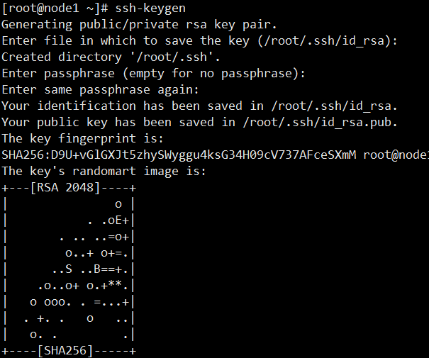
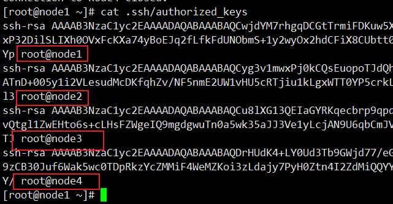
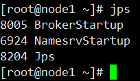
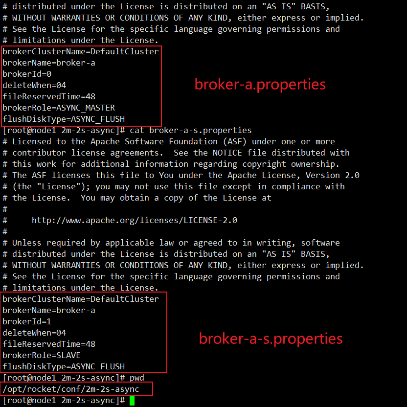
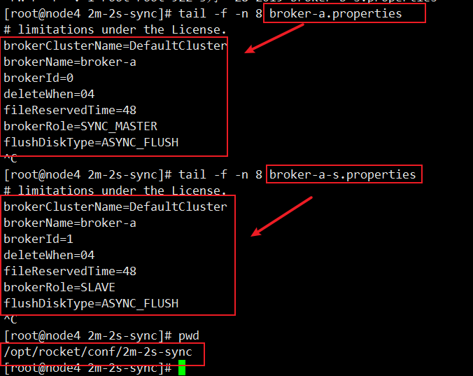

第四部分 RocketMQ集群与运维

# 1 集群搭建方式

## 1.1 集群特点

## 1.2 集群模式

### 1.2.1 单Master模式

### 1.2.2 多Master模式

### 1.2.3 多master多Slave模式（异步）

### 1.2.4 多master多Slave模式（同步）

# 2 集群的搭建

## 2.0 前置配置

### 2.0.1 准备4台虚拟机

| 主机名 | IP地址         |
| ------ | -------------- |
| node1  | 192.168.31.101 |
| node2  | 192.168.31.102 |
| node3  | 192.168.31.103 |
| node4  | 192.168.31.104 |

修改4台虚拟机，**vim /etc/hosts**，编辑ip地址和主机名之间的映射关系，通过主机名找到对应主机地址，

```
192.168.31.101 node1
192.168.31.102 node2
192.168.31.103 node3
192.168.31.104 node4
```

4台虚拟机各自，修改**vim /etc/hostname** ，编辑主机名，init 6重启生效。


4台虚拟机实现**互相免密登录**

1. 在各自虚拟机上生成密钥

   ```shell
   ssh-keygen
   ```

   

2. 将自己的公钥复制到其他主机上

   ```shell
   [root@node1 ~]# for i in `seq 4`;do ssh-copy-id node$i; done 
   [root@node4 ~]# cat .ssh/authorized_keys
   ```

   在node1上可以看到4个公钥。

   

   使用ssh可以测试免密登录。

   ```shell
   ssh node1
   exit
   ssh node2
   exit
   ssh node3
   exit
   ssh node4
   exit
   ```

2.0.2 RocketMQ的安装

1. JDK11.0.5

2. 修改RocketMQ脚本

   ```
   bin/runserver.sh
   bin/runbroker.sh
   bin/tools.sh
   ```

   具体参考第一部分中的RocketMQ安装和启动

## 2.1 单Master模式

最简单也是风险最大的模式，一旦broker重启或宕机，整个服务不可用。不推荐在生产环境使用，一般用于开发或本地测试。

步骤如下：

### 2.1.1 启动NameServer

```shell
### 首先启动NameServer
nohup sh /opt/rocket/bin/mqnamesrv &

### 检查Name server是否启动成功
tail -f ~/logs/rocketmqlogs/namesrv.log

jps

 The Name Server boot success. serializeType=JSON
```

只要在namesrv.log中看到"The Name Server boot success. serializeType=JSON"，就表示NameServer启动成功了。



### 2.1.2 启动Broker

```shell
nohup sh /opt/rocket/bin/mqbroker -n localhost:9876 &

### 检查broker是否启动成功，如果看到broker的下面的语句标识启动成功
tail -f ~/logs/rocketmqlogs/broker.log

The broker[node1, 192.168.31.101:10911] boot success
```

如果看到broker.log中看到"The broker[node1, 192.168.31.101:10911] boot success"就表示broker启动成功。

## 2.2 多Master模式

多Master模式意味着所有的节点都是Master节点，没有Slave节点，优缺点：

- 优点：
  1. 配置简单。
  2. 一个服务节器节点的停用或重启（维护目的）不会对应用造成大的影响。
  3. 如果磁盘配置了RAID10，就不会有消息的丢失。（因为RAID10非常可靠，即使服务器不可恢复，在异步刷盘时会丢失小量数据，同步刷盘不会丢失数据）。
  4. 该模式性能最好。
- 缺点：
  1. 在单节点停用期间，消费者无法消费该节点上的数据，也不能订阅该节点上的数据，除非节点恢复。消息的实时性受到影响。

启动步骤如下：

### 2.2.1 启动NameServer

```shell
### 首先在node1 上 启动NameServer
nohup sh /opt/rocket/bin/mqnamesrv &

### 检查Name server是否启动成功
tail -f ~/logs/rocketmqlogs/namesrv.log

 The Name Server boot success. serializeType=JSON
```


### 2.2.2 启动Broker集群

```shell
### 启动第一个(node2)broker。注意这里的配置文件的位置
nohup sh /opt/rocket/bin/mqbroker -n node1:9876 -c $ROCKET_HOME/conf/2m-noslave/broker-a.properties &

### 在第二台服务器(node3)上启动另一个broker
nohup sh /opt/rocket/bin/mqbroker -n node1:9876 -c $ROCKET_HOME/conf/2m-noslave/broker-b.properties &

...
```

上面的NameServer是一台，IP地址直接写，如果是多台NameServer，则需要在`-n` 后接多个NameServer的地址，使用分号分开。由于shell对分号敏感，可以使用单引号引起来多个NameServer的地址，禁止shell对分号的解释。


## 2.3 多Master和Slave模式-异步复制

每个Master节点配置一个或多个Slave节点，组成一组，有多组这样的组合组成集群。HA使用<font color="blue">**异步复制**</font>，Master和Slave节点间有毫秒级的消息同步延迟，优缺点：

- 优点
  1. 磁盘坏掉，会有少量消息丢失，但是消息的实时性不会受到影响。
  2. 如果Master宕机，消费者依然可以从Slave节点消费，并且<font color="blue">**这个转换是透明的**</font>，也无需运维手动介入，但是不会Slave不能接收消息（Slave不能自动转换为Master）。部分解决单点故障。
  3. 性能和多Master模式差不多，弱一点点。
- 缺点
  1. 如果Master宕机，磁盘坏掉，会丢失少量消息。

启动步骤如下

### 2.3.1 启动NameServer

```shell
### 首先在node1 上 启动NameServer
nohup sh $ROCKET_HOME/bin/mqnamesrv &

### 检查Name server是否启动成功
tail -f ~/logs/rocketmqlogs/namesrv.log

 The Name Server boot success. serializeType=JSON
```


### 2.3.2 启动Broker集群

```shell
### 启动第一个(node1)broker:broker-a。注意这里的配置文件的位置
nohup sh $ROCKET_HOME/bin/mqbroker -n node1:9876 -c $ROCKET_HOME/conf/2m-2s-async/broker-a.properties &

### 在第二台服务器(node2)上启动另一个broker:broker-b
nohup sh $ROCKET_HOME/bin/mqbroker -n node1:9876 -c $ROCKET_HOME/conf/2m-2s-async/broker-b.properties &

### 在另一台服务器(node3)上启动broker-a的slave
nohup sh $ROCKET_HOME/bin/mqbroker -n node1:9876 -c $ROCKET_HOME/conf/2m-2s-async/broker-a-s.properties &

### 在另一台服务器(node4)上启动broker-b的slave
nohup sh $ROCKET_HOME/bin/mqbroker -n node1:9876 -c $ROCKET_HOME/conf/2m-2s-async/broker-b-s.properties &
```

以上启动的是2M-2S-Async模式，双主双从，主从异步复制模式



## 2.4 多Master和Slave模式-同步双写

该模式中，每个Master节点配置多个Slave节点，它们后成一组，多组构成集合。HA使用同步双写，即，只有消息在Master和多个Slave节点上写成功，才返回生产者消息发送成功。

`SYNC_MASTER` 优缺点：

- 优点：
  1. 数据和服务都没有单点故障。
  2. 当Master主机宕机，消息的消费不会延迟。
  3. 服务和数据的高可用。
- 缺点：
  1. 该模式的性能比异步复制的模式低10%左右。
  2. 发送消息的延迟稍微高一点。
  3. 当前版本中，如果Master节点宕机，Slave节点不能自动切换为Master模式

启动步骤：

### 2.4.1 启动NameServer

```shell
### 首先在node1 上 启动NameServer
nohup sh $ROCKET_HOME/bin/mqnamesrv &

### 检查Name server是否启动成功
tail -f ~/logs/rocketmqlogs/namesrv.log

 The Name Server boot success. serializeType=JSON
```


### 2.4.2 启动Broker集群

```shell
### 启动第一个(node1)broker:broker-a。注意这里的配置文件的位置
nohup sh $ROCKET_HOME/bin/mqbroker -n node1:9876 -c $ROCKET_HOME/conf/2m-2s-sync/broker-a.properties &

### 在第二台服务器(node2)上启动另一个broker:broker-b
nohup sh $ROCKET_HOME/bin/mqbroker -n node1:9876 -c $ROCKET_HOME/conf/2m-2s-sync/broker-b.properties &

### 在另一台服务器(node3)上启动broker-a的slave
nohup sh $ROCKET_HOME/bin/mqbroker -n node1:9876 -c $ROCKET_HOME/conf/2m-2s-sync/broker-a-s.properties &

### 在另一台服务器(node4)上启动broker-b的slave
nohup sh $ROCKET_HOME/bin/mqbroker -n node1:9876 -c $ROCKET_HOME/conf/2m-2s-sync/broker-b-s.properties &
```

上述配置中，通过相同的brokerName不同的brokerId将Master和Slave组合为一组。Master的brokerId必须是0，Slave的brokerId必须大于0，且不能相同。



# 3 mqadmin管理工具

## 3.1 Topic相关

启动集群 2M-2S-SYNC

```shell
[root@node1 ~]# nohup sh $ROCKET_HOME/bin/mqnamesrv &
[root@node1 ~]# nohup sh $ROCKET_HOME/bin/mqbroker -n node1:9876 -c $ROCKET_HOME/conf/2m-2s-sync/broker-a.properties &
[root@node2 ~]# nohup sh $ROCKET_HOME/bin/mqbroker -n node1:9876 -c $ROCKET_HOME/conf/2m-2s-sync/broker-a-s.properties &
[root@node3 ~]# nohup sh $ROCKET_HOME/bin/mqbroker -n node1:9876 -c $ROCKET_HOME/conf/2m-2s-sync/broker-b.properties &
[root@node4 ~]# nohup sh $ROCKET_HOME/bin/mqbroker -n node1:9876 -c $ROCKET_HOME/conf/2m-2s-sync/broker-b-s.properties &
```


### 3.1.1 命令列表


| 名称 | 含义 | 命令选项 | 说明 |
| ---- | ---- | -------- | ---- |
|      |      |          |      |
|      |      |          |      |
|      |      |          |      |
|      |      |          |      |
|      |      |          |      |
|      |      |          |      |
|      |      |          |      |
|      |      |          |      |
|      |      |          |      |
|      |      |          |      |
|      |      |          |      |
|      |      |          |      |
|      |      |          |      |
|      |      |          |      |


### 3.1.2 具体操作

```shell
[root@node4 ~]# mqadmin topicList -n node1:9876
[root@node4 ~]# mqadmin topicList -n node1:9876 -c DefaultCluster
[root@node4 ~]# mqadmin updateTopic -n node1:9876 -b node1:10911 -r 4 -w 4 -t tp_demo_01
[root@node4 ~]# mqadmin topicStatus -n node1:9876 -t tp_demo_01
# 在集群中中所有broker中创建主题tp_demo_01
[root@node4 ~]# mqadmin updateTopic -n node1:9876 -c DefaultCluster -r 4 -w 4 -t tp_demo_01
[root@node4 ~]# mqadmin deleteTopic -c DefaultCluster -n node:9876 -t tp_demo_02
[root@node4 ~]# mqadmin topicClusterList -n node1:9876 -t tp_demo_01
[root@node4 ~]# mqadmin allocateMQ -n node1:9876 -t tp_demo_01 -i node1,node2,node3
[root@node4 ~]# mqadmin statsAll -n node1:9876
```

```
{"result":{"node2":[{"brokerName":"broker-a","queueId":2,"topic":"tp_demo_01"},{"brokerName":"broker-b","queueId":3,"topic":"tp_demo_01"},{"brokerName":"broker-a","queueId":1,"topic":"tp_demo_01"}],"node3":[{"brokerName":"broker-b","queueId":2,"topic":"tp_demo_01"},{"brokerName":"broker-a","queueId":3,"topic":"tp_demo_01"}],"node1":[{"brokerName":"broker-a","queueId":0,"topic":"tp_demo_01"},{"brokerName":"broker-b","queueId":1,"topic":"tp_demo_01"},{"brokerName":"broker-b","queueId":0,"topic":"tp_demo_01"}]}}
```


## 3.2 集群相关

### 3.2.1 命令列表

### 3.2.2 具体操作

## 3.3 Broker相关

### 3.3.1 命令列表

### 3.3.2 具体列表

## 3.4 消息相关

### 3.4.1 命令列表

### 3.4.2 具体列表

## 3.5 消费者，消费组相关

### 3.5.1 命令列表

### 3.5.2 具体列表

## 3.6 连接相关

### 3.6.1 命令列表

### 3.6.2 具体列表

## 3.7 Nameserver相关

### 3.7.1 命令列表

### 3.7.2 具体列表

## 3.8 其他

### 3.8.1 命令列表

### 3.8.2 具体列表

# 4 运维常见问题

## 4.1 RocketMQ的mqadmin命令报错问题

## 4.2 RocketMQ生产端和消费端版本不一致导致不能正常消费的问题

## 4.3 新增一个topic的消费组时，无法消费历史消息的问题

## 4.4 如何从Slave读数据功能

## 4.5 性能调优问题

## 4.6 在RocketMQ中msgId和offsetMsgId的含义与区别