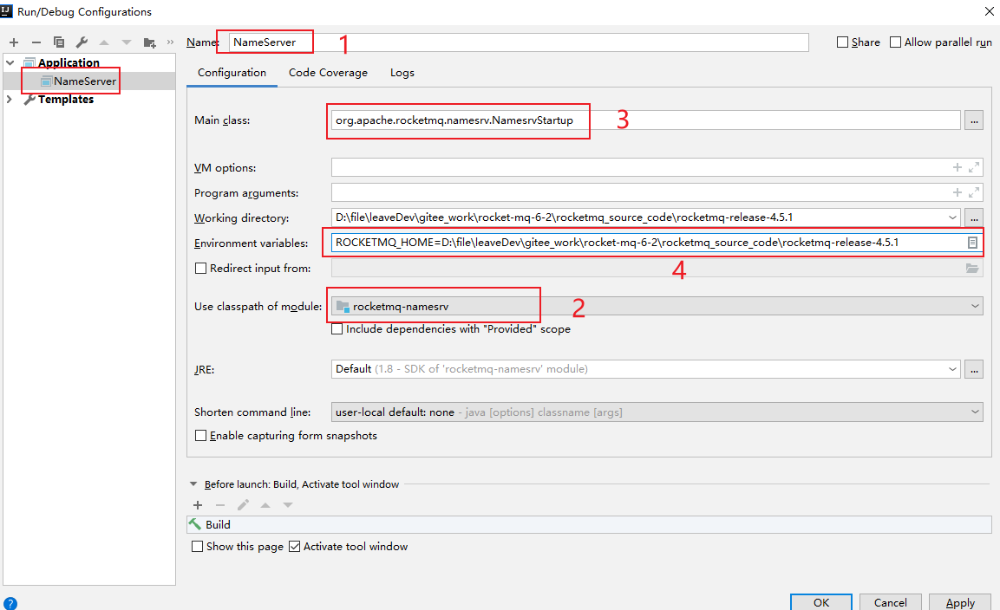

第五部分 RocketMQ源码剖析

# 1 环境搭建

依赖工具

- JDK1.8
- Maven
- IntelliJ IDEA

## 1.1 源码拉取

从官方仓库拉取或download zip ，当前使用的是4.5.1版本。

https://github.com/apache/rocketmq/tree/release-4.5.1


源码目录结构：

- broker：broker模块（broker启动进程）
- client：消息客户端，包含消息生产者、消息消费者相关类
- common：公共包
- dev：开发者信息（非源代码）
- distribution：不是实例文件夹（非源代码）
- example：RocketMQ例子代码
- filter：消息过滤相关基础类
- filtersrv：消息过滤服务器实现相关类（Filter启动进程）
- logappender：日志实现相关类
- namesrv：NameServer实现相关类（NameServer启动进程）
- openmessageing：消息开放标准
- remoting：远程通信模块，基于Netty
- srcutil：服务工具类
- store：消息存储实现相关类
- style：checkstyle相关实现
- test：测试相关类
- tools：工具类，监控命令相关实现类


## 1.2 导入IDEA

使用open打开源代码根目录。


设置maven和jdk后，close project。在重新打开。

执行maven编译


```xml
clean -Dmaven.test.skip=true
compile -Dmaven.test.skip=true
```

## 1.3 调试

在根目录创建`conf`配置文件夹，从`distribution`中拷贝`broker.conf`、`logback_broker.xml`、`logback_namesrv.xml`。


## 1.4 启动NameServer

NameServer的启动类：


添加NameServer的启动环境：



启动NameServer：


启动成功，控制台打印结果：


## 1.5 启动Broker

Broker的启动类：


修改conf/broker.conf：

```properties
brokerClusterName = DefaultCluster
brokerName = broker-a
brokerId = 0
deleteWhen = 04
fileReservedTime = 48
brokerRole = ASYNC_MASTER
flushDiskType = ASYNC_FLUSH

#namesrvAddr地址
namesrvAddr=127.0.0.1:9876
#启用自动创建主题
autoCreateTopicEnable=true

# 存储路径
storePathRootDir=D:\\rocketmq-release-4.5.1\\dataDir
# commitLog路径
storePathCommitLog=D:\\rocketmq-release-4.5.1\\dataDir\\commitlog
# 消息队列存储路径
storePathConsumeQueue=D:\\rocketmq-release-4.5.1\\dataDir\\consumequeue
# 消息索引存储路径
storePathIndex=D:\\rocketmq-release-4.5.1\\dataDir\\index
# checkpoint文件路径
storeCheckpoint=D:\\rocketmq-release-4.5.1\\dataDir\\checkpoint
# abort文件存储路径
abortFile=D:\\rocketmq-release-4.5.1\\dataDir\\abort
```

添加Broker启动环境：


启动Broker：


启动成功，控制台打印：


## 1.6 发送消息

- 进入example模块的`org.apache.rocketmq.example.quickstart.Producer`

- 指定Namesrv地址

  ```java
  DefaultMQProducer producer = new DefaultMQProducer("please_rename_unique_group_name");
  producer.setNamesrvAddr("127.0.0.1:9876");
  ```

- 运行main方法，发送消息


1.7 消费消息

- 进入example模块的`org.apache.rocketmq.example.quickstart.Consumer`

- 指定Namesrv地址

  ```java
  DefaultMQPushConsumer consumer = new DefaultMQPushConsumer("please_rename_unique_group_name_4");
  consumer.setNamesrvAddr("127.0.0.1:9876");
  ```

- 运行main方法，消费消息


# 2 NameServer

## 2.1 架构设计

## 2.2 启动流程

## 2.3 路由管理

### 2.3.1 路由元信息

### 2.3.2 路由注册

### 2.3.3 路由删除

### 2.3.4 路由发现


## 2.4 小结

# 3 Producer

## 3.1 方法和属性

## 3.2 启动流程

## 3.3 消息发送

### 3.3.1 验证消息

### 3.3.2 查找路由

### 3.3.3 选择队列

### 3.3.4 发送消息

## 3.4 批量消息发送

# 4 消息存储

## 4.1 消息存储核心类

## 4.2 消息存储流程

## 4.3 存储文件

## 4.4 存储文件内存映射


## 4.5 实时更新消息消费队列与索引文件

## 4.6 消息队列的索引文件恢复

## 4.7 刷盘机制

## 4.8 过期文件删除机制

## 4.9 小结

# 5 Consumer

## 5.1 消息消费概述

## 5.2 消息消费初探

## 5.3 消费者启动流程

## 5.4 消息拉取

## 5.5 消息队列负载与重新分布机制

## 5.6 消息消费过程

## 5.7 定时消费机制

## 5.8 顺序消费

## 5.9 小结