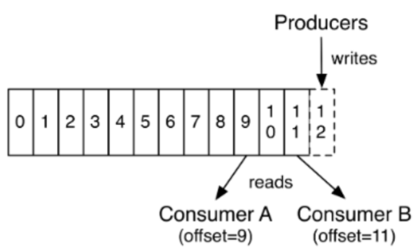

第一部分 Kafka架构与实战

# 1 概念和基本架构

## 1.1 Kafka介绍

Kafka是最初由LinkedIn公司开发，是一个分布式、分区的、多副本、多生产者、多订阅者、基于Zookeeper协调的分布式日志系统（也可以当作MQ系统），常见的可以用于web/nginx日志，访问日志，消息服务等等，LinkedIn在2010年贡献给了Apache基金会并成为顶级开源项目。

主要应用场景：日志收集系统和消息系统

Kafka主要设计目标：

- 以**时间复杂度O(1)**的方式提供消息持久化能力，即使对TB级以上数据也能保证常数时间的访问性能。
- **高吞吐率**，即使在非常廉价的商用机器上也能做到单机支持100K/s的消息传输。
- 支持Kafka Server间的**消息分区**，及分布式消费，同时保证每个partition内消息的顺序传输。
- 同时支持**离线**数据处理和实时**数据**处理。
- 支持在**线水平扩展**。


有两种主要的消息传递模式：**点对点传递模式**，**发布-订阅模式**。大部分的消息系统选用发布-订阅模式。**Kafka就是一种发布-订阅模式**。

对于消息中间件，消息分推拉两种模式。Kafka只有消息的拉取，没有推送，可以通过轮询实现消息的推送。

1. Kafka在一个或多个可以跨越多个数据中心的服务器上作为集群运行。
2. Kafka集群中按照主题分类管理，一个主题可以有多个分区，一个分区可以有多个副本分区。
3. 每个记录由一个键，一个值和一个时间戳组成。

Kafka具有四个核心API：

1. Producer API：允许应用程序将记录发布到一个或多个Kafka主题。
2. Consumer API：允许应用程序订阅一个或多个主题并处理为其生成的记录流。
3. Streams API：允许应用程序充当流处理器，使用一个或多个主题的输入流，并生成一个或多个输出主题的输出流，从而有效地将输入流转换为输出流。
4. Connector API：允许构建和运行将Kafka主题连接到现有的应用程序或数据系统的可重用生产者或使用者。例如，关系型数据库的连接器可能会捕获对表的所有更改。


## 1.2 Kafka优势

1. 高吞吐量：单机每秒处理**上百万**的消息量，即使存储率许多TB的消息，也保持稳定性能。
2. 高性能：单节点支持**上千个**客户端，并保证**零停机和零数据丢失**。
3. 持久化数据存储：将消息持久化到磁盘。通过将数据持久化到硬盘以及replication防止数据丢失。
   - 零拷贝
   - 顺序读，顺序写
   - 利用Linux的页缓存
4. 分布式系统：易于向外扩展。所有的Producer、Broker和Consumer都会有多个，均为分布式的。无需停机即可扩展机器。多个Producer、Consumer可能是不同的应用。
5. 可靠性：Kafka是分布式，分区，复制和容错的。
6. 客户端状态维护：消息被处理的状态是在Cosumer端维护，而不是由Server端维护。当失败时能自动平衡。
7. 支持online和offline的场景。
8. 支持多种客户端语言：支持Java、.NET、PHP、Python等多种语言。

## 1.3 Kafka应用场景

**日志收集**：Kafka可以收集各种服务的Log，通过Kafka以统一接口服务的方式开放给各种Consumer。

**消息系统**：解耦生产者和消费者、缓存消息等。

**用户活动跟踪**：记录Web或App用户的各种活动，这些消息被各个服务器发布到Kafka的Topic种，然后消费者通过订阅这些Topic来做实时的监控分析，亦可保存到数据库。

**运营指标**：记录运行监控数据，包括各种分布式应用的数据，生产各种操作的集中反馈。

**流式处理**：比如Spark Streaming 和 Storm。

## 1.4 基本架构

> **消息和批次**

Kafka的数据单元称为消息。可以把消息看成是数据库里的一个数据行或一条记录。消息由字节数组组成。

消息有键，键也是一个字节数组。当消息以一种可控的方式写入不同的分区时，会用到键。

为了提高效率，消息被分批写入Kafka。批次就是一组消息，这些消息属于同一个主题和分区。

把消息分成批次可以减少网络开销。批次越大，单位时间内处理的消息就越多，单个消息的传输时间就越长。批次数据会被压缩，这样可以提升数据的传输和存储能力，但是需要更多的计算处理。

> **模式**

消息模式（schema）有许多可用的选项，以便于理解。如JSON和XML，但是它们缺乏强类型处理能力。Kafka的许多开发者喜欢使用Apache Avro。Avro提供了一种紧凑的序列化格式，模式和消息提分开。当模式发生变化时，不需要重新生成代码，它还支持强类型和模式进化，其版本向前兼容，也向后兼容。

数格式的一致性对Kafka很重要，因为它消除了消息读写操作之间的耦合性。

> **主题和分区**

Kafka的消息通过主题进行分类。主题类似于数据库的表或者文件系统里的文件夹。主题可以被分为若干分区，一个主题通过分区分布于Kafka集群种，提供了横向扩展的能力。


> **生产者和消费者**

生产者创建消息。消费者消费消息。

一个消息被发布到一个特定的主题上。

生产者在默认情况下，把消息均衡地分布到主题的所有分区上：

- 直接指定消息的分区
- 根据消息的key散列取模得出分区
- 轮询执行分区

消费者通过偏移量来区分已经读过的消息，从而消费消息。

消费者是消息组的一部分，消费组保证每个分区只能被一个消费者使用，避免重复消费。


> **broker和集群**

一个独立的Kafka服务器称为broker。broker接受来自生产者的消息，为消息设置偏移量，并提交消息到磁盘保存。broker为消费者提供服务，对读取分区的请求做出响应，返回已经提交到磁盘上的消息。**单个broker**可以轻松处理**数千个分区**以及**每秒百万级**的消息量。


每个集群都有一个broker是集群控制器（自动从集群的活跃成员中选举出来）。

控制器负责管理工作：

- 将分区分配给broker
- 监控broker

集群中一个分区属于一个**broker**，该broker称为**分区首领**。

一个分区可以分配给多个broker，此时会发生分区复制。

分区的复制提供了**消息冗余，高可用**。**副本分区**不负责处理消息的读写。

## 1.5 核心概念

### 1.5.1 Producer

生产者创建消息。

该角色将消息发布到Kafka的topic中。broker接收到生产者发送的消息后，broker将该消息**追加**到当前用于追加数据的`segment`文件中。

一般情况下，一个消息会被发布到一个特定的主题上。

1. 默认情况下通过轮询把消息均衡的分布到主题的所有分区上。
2. 在某些情况下，生产者会把消息直接写到指定的分区。这通常是通过**消息键**和**分区器**来实现的，分区器为键生成一个散列值，并将其映射到指定的分区上。这样可以保证包含同一个键的消息会被写到同一个分区上。
3. 生产者也可以使用自定义的分区器，根据不同的业务规则将消息映射到分区。

### 1.5.2 Consumer

**消费者读取消息**。

1. 消费者订阅一个或多个主题，并按照生成的生成的顺序读取它们。
2. 消费者通过检查消息的偏移量来区分已经读取过的消息。偏移量是另一种元数据，它是一个不断递增的整数值，在创建消息时，Kafka会把它添加到消息里。在给定的分区里，每个消息的偏移量都是唯一的。消费者把每个分区最后读取的消息偏移量保存在Zookeeper或Kafka上，如果消费者关闭或重启，它的读取状态不会丢失。
3. 消费者时消费组的一部分。群组保证每个分区只能被一个消费者使用。
4. 如果一个消费者失效，消费组里的其他消费者可以接管失效消费者的工作，再平衡、分区重新分配。


### 1.5.3 Broker

**一个独立的Kafka服务器被称为broker**。

broker为消费者提供服务，对读取分区的请求作出响应，返回已经提交到磁盘上的消息。

1. 如果某topic有N个partition，集群有N个broker，那么每个broker存储该topic的一个partition。
2. 如果某topic有N个partition，集群有(N+M)个broker，那么其中有N个broker存储该topic的一个partition，剩下的M个broker不存储该topic的partition数据。
3. 如果某topic有N个partition，集群中broke数目少于N个，那么一个broker存储该topic的一个或多个partition。在实际生产环境中，尽量避免这种情况发生，这种情况容易导致kafka集群数据不均衡。

broker是集群的组成部分，每个集群都有一个broker同时充当了集群控制器的角色（自动从集群的活跃成员中选举出来）。

控制器负责管理公共，包括将分区分配给broker和监控broker。

在集群中，一个分区从属于一个broker，该broker被称为分区首领。


### 1.5.4 Topic

每条发布到Kafka集群的消息都有一个类别，这个类别被称为Topic。

物理上不同的Topic的消息分开存储。

主题就好比数据库的表，尤其是分库分表之后的逻辑表。


### 1.5.5 Partition

1. 主题可以被分为若干个分区，一个分区就是一个提交日志。
2. 消息以追加的方式写入分区，然后以先入先出的顺序读取。
3. 无法在整个主题范围内保证消息的顺序，但可以保证消息在单个分区内的顺序。
4. Kafka通过分区来实现数据冗余和伸缩性。
5. 在需要严格保证消息的消费顺序的场景下，需要将partition数据设为1。


### 1.5.6 Replicas

Kafka使用主题来组织数据，每个主图被分为若干个分区，每个分区有多个副本，那些副本被保存在broker上，每个broker可以保存成百上千个属于不同主题和分区的副本。

副本有以下两种类型：

- 首领副本

  每个分区都有一个首领副本。为了保证一致性，所有生产者请求和消费者请求都会经过这个副本。

- 跟随着副本

  首领以外的副本都是跟随着副本。跟随者副本不处理来自客户端的请求，它们唯一的任务就是从首领哪里复制消息，保持与首领一致的状态。如果首领发函俄国崩溃，其中一个跟随者会被提升为新首领。

### 1.5.7 Offset

> **生产者Offset**

消息的写入的时候，每个分区都有一个offset，这个offset就是生产者的offset，同时也是这个分区最新最大的offset。

有些时候没有指定某一个分区的offset，这个工作Kafka帮我们完成。


> **消费者Offset**



这是某一个分区的offset情况，生产者写入的offset是最新最大的值是12，而当Consumer A进行消费时，从0开始消费，一致消费到了9，消费者的offset就记录在9，Consumer B就记录在了11。等下次它们再来消费时，它们可以选择接着上次的位置消费，当然也可以选择从头消费，或者跳到最近的记录并从"现在"开始消费。

### 1.5.8 副本

Kafka通过副本保证高可用。副本分为首领副本（Leader）和跟随者副本（Follower）。

跟随者副本包括**同步副本**和**不同步副本**，在发生首领副本切换的时候，只有同步副本可以切换为首领副本。

#### 1.5.8.1 AR

分区中的所有副本统称为**AR**(Assigned Repllicas)。

***AR=ISR+OSR***

#### 1.5.8.2 ISR

所有与leader副本保持一定程度同步的副本（包括leader）组成ISR（In-Sync Replicas），ISR集合是AR集合中的一个子集。消息会先发送到leade副本，然后follower副本才能从leader副本中拉取消息进行同步，同步期间follower副本相对于leader副本而言有一定程度的滞后。前面所说的“一定程度”是指可以忍受的滞后范围，这个范围可以通过参数进行配置。

#### 1.5.8.3 OSR

与leader副本同步滞后过多的副本（不包括leader）副本，组成OSR（Out-Sync Replicas）。在正常情况下，所有的follower副本都应该与leader副本保持一定程度的同步，即AR=ISR，OSR集合为空。

#### 1.5.8.4 HW

HW是High Watermark的缩写，俗称高水位，它表示了一个特定消息的偏移量（offset），消费只能拉取到这个offset之前的消息。

#### 1.5.8.5 LEO

LEO是 Log End Offset的缩写，它表示了当前日志文件中**下一条待写入**消息的offset。


# 2 Kafka安装与配置

## 2.1 Java环境为前提

1. 上传jdk-8u261-linux-x64.rpm到服务器并安装

   ```shell
   rpm -ivh jdk-8u261-linux-x64.rpm 
   ```

2. 配置环境变量

   ```shell
   vim /etc/profile
   
   export JAVA_HOME=/usr/java/jdk1.8.0_261-amd64
   export PATH=$PATH:$JAVA_HOME/bin
   
   # 生效
   . /etc/profile
   # 验证
   java -version
   ```
   
   
   
   

## 2.2 Zookeeper的安装配置

1. 上传zookeeper-3.4.14.tar.gz到服务器

2. 解压到/opt:

   ```shell
   tar -xvf zookeeper-3.4.14.tar.gz -C /opt
   
   cd /opt/zookeeper-3.4.14/conf/
   # 复制zoo_sample.cfg命名为zoo.cfg
   cp zoo_sample.cfg zoo.cfg
   # 编辑zoo.cfg文件
   vim zoo.cfg
   ```

   

3. 修改Zookeeper保存数据的目录，dataDir：

   ```properties
   dataDir=/var/turbo/zookeeper/data
   ```

   

4. 编辑/etc/profile

   - 设置环境变量ZOO_LOG_DIR，指定Zookeeper保存日志的位置；
   - ZOOKEEPER_PREFIX指向Zookeeper的解压目录；
   - 将Zookeeper的bin目录添加到PATH中：

   ```properties
   export ZOOKEEPER_PREFIX=/opt/zookeeper-3.4.14
   export PATH=$PATH:$ZOOKEEPER_PREFIX/bin
   export ZOO_LOG_DIR=/var/turbo/zookeeper/log
   ```

   

5. 使配置生效

   ```shell
   source /etc/profile
   ```

   

6. 验证

   

## 2.3 Kafka的安装与配置

1. 上传kafka_2.12-1.0.2.tgz到服务器并解压

   ```shell
   tar -xvf kafka_2.12-1.0.2.tgz -C /opt
   ```

2. 配置环境变量并生效：

   ```shell
   vim /etc/profile
   
   export KAFKA_HOME=/opt/kafka_2.12-1.0.2
   export PATH=$PATH:$KAFKA_HOME/bin
   
   # 生效
   . /etc/profile
   ```

   

3. 配置/opt/kafka_2.12-1.0.2/config中的server.properties文件：

   Kafka连接Zookeeper的地址，此处使用本地启动的Zookeeper实例，连接地址是localhost:2181，后面的`myKafka`是Kafka在Zookeeper中的很节点路径：

   

   Kafka持久化的数据存放位置：

   ```
   mkdir -p /var/turbo/kafka/kafka-logs
   ```

   

4. 启动Zookeeper

   ```shell
   [root@localhost ~]# zkServer.sh start
   ZooKeeper JMX enabled by default
   Using config: /opt/zookeeper-3.4.14/bin/../conf/zoo.cfg
   Starting zookeeper ... STARTED
   ```

   

5. 确认Zookeeper的状态

   

6. 启动Kafka

   进入Kafka安装的根目录，执行如下命令：

   

   启动成功，可以看到控制套输出的最后一行started状态：

   

7. 查看Zookeeper的节点

   ```
   [root@localhost bin]# zkCli.sh
   ```

   

8. 此时Kafka是前台模式启动，要停止使用`Ctrl+C`。

   如果要后台启动，使用命令：

   ```shell
   kafka-server-start.sh -daemon config/server.properties
   ```

   

   查看Kafka的后台进程：

   ```shell
   ps aux|grep kafka
   ```

   停止后台运行的Kafka:

   

   

   

   

## 2.4 生产与消费

1. kafka-topics.sh用于管理主题

   ```shell
   # 列出现有的主题
   [root@localhost ~]# kafka-topics.sh --list --zookeeper localhost:2181/myKafka
   # 创建主题，该主题包含一个分区，该分区为Leader分区，它没有Follower分区副本。
   [root@localhost ~]# kafka-topics.sh --zookeeper localhost/myKafka --create --topic topic_1 --partitions 1 --replication-factor 1
   # 查看分区信息
   [root@localhost ~]# kafka-topics.sh --zookeeper localhost/myKafka --list
   # 查看指定主题的详细信息
   [root@localhost ~]# kafka-topics.sh --zookeeper localhost/myKafka --describe --topic topic_1
   # 删除指定主题
   [root@localhost ~]# kafka-topics.sh --zookeeper localhost/myKafka --delete --topic topic_1
   
   ```

   

2. kafka-console-producer.sh用于生产消息

   ```shell
   [root@localhost ~]# kafka-console-producer.sh --broker-list localhost:9092 --topic topic_1
   ```

   

3. kafka-console-consumer.sh用于消费消息

   ```shell
   # 开启消费者
   [root@localhost ~]# kafka-console-consumer.sh --bootstrap-server localhost:9092 --topic topic_1
   # 从头消费，不按照偏移量消费
   [root@localhost ~]# kafka-console-consumer.sh --bootstrap-server localhost:9092 --topic topic_1 --from-beginning
   ```


# 3 Kafka开发实战

## 3.1 消息的发送与接收


> 生产者

生产者主要的对象有：`KafkaProducer`、`ProducerRecord`。

其中`KafkaProducer`是用于发送消息的类，`ProducerRecord`类用于封装Kafka的消息。

`KafkaProducer`的创建需要指定的参数和含义：

| 参数              | 说明                                                         |
| ----------------- | ------------------------------------------------------------ |
| bootstrap.servers | 配置生产者如何与broker建立连接。该参数设置的是初始化参数。如果生产者需要连接的是Kafka集群，则这里配置集群中几个broker的地址，而不是全部，当生产者连接上此处指定的broker之后，在通过该连接发现集群中的其他节点。 |
| key.serializer    | 要发送信息的key数据的序列化类。设置的时候可以写类名，也可以使用该类的Class对象。 |
| value.serializer  | 要发送消息的value数据的序列化类。设置的时候可以写类名，也可以使用该类的Class对象。 |
| acks              | 默认值：**all**<br>acks=0：<br>生产者不等待broker对消息的确认，只要将消息放到缓冲区，就认为消息已经发送完成。<br>该情形不能保证broker是否真的收到了消息，retries配置也不会生效。发送的消息的返回的消息偏移量永远是-1。<br><br>acks=1：<br>表示消息只需要写道主分区即可，然后就响应客户端，而不等待副本分区的确认。<br>在该情形下，如果主分区收到消息确认之后就宕机，而副本还没来得及同步该消息，则该消息丢失。<br><br>acks=all：<br>首领分区会等待所有ISR副本确认记录。<br>该处理保证了只要有一个ISR副本存活，消息就不会丢失。<br>这是Kafka最强的 可靠性保证，等效于`acks=-1` |
| retries           | retries重试次数，<br>当消息发送出现错误的时候，系统会重发消息。<br>跟客户端收到错误时重发一样。<br>如果设置了重试，还想保证消息的有序性，需要设置<br>MAX_IN_FLIGHT_REQUESTS_PER_CONNECTION=1<br>否则在重试此失败消息的时候，其他的消息可能发送成功了 |

其他参数可以从`org.apache.kafka.clients.producer.ProducerConfig`中找到。

消费者生产消息后，需要broker端确认，可以同步确认，也可以异步确认。

同步确认效率低，异步确认效率高，但是需要设置回调对象。


```
操作之前，修改linux的/etc/hostname
修改window下的C:\Windows\System32\drivers\etc\host

否则出现如下异常：Caused by: org.apache.kafka.common.errors.TimeoutException: Expiring 1 record(s) for topic_1-0: 30043 ms has passed since batch creation plus linger time
```


生产者1：

```java
package com.turbo.kafka.demo.producer;

import org.apache.kafka.clients.producer.Callback;
import org.apache.kafka.clients.producer.KafkaProducer;
import org.apache.kafka.clients.producer.ProducerRecord;
import org.apache.kafka.clients.producer.RecordMetadata;
import org.apache.kafka.common.header.Header;
import org.apache.kafka.common.header.internals.RecordHeader;
import org.apache.kafka.common.serialization.IntegerSerializer;
import org.apache.kafka.common.serialization.StringSerializer;

import java.util.ArrayList;
import java.util.HashMap;
import java.util.List;
import java.util.Map;
import java.util.concurrent.ExecutionException;
import java.util.concurrent.Future;

public class MyProducer1 {

    public static void main(String[] args) throws ExecutionException, InterruptedException {
        Map<String,Object> configs = new HashMap<>();
        // 指定初始连接用到的broker地址
        configs.put("bootstrap.servers","node1:9092");
        // 指定key的序列化类
        configs.put("key.serializer", IntegerSerializer.class);
        // 指定value的序列化类
        configs.put("value.serializer", StringSerializer.class);

//        configs.put("acks","all");
//        configs.put("retries","3");
        KafkaProducer<Integer,String> producer = new KafkaProducer<Integer, String>(configs);

        // 用于设置用户自定义的消息头字段
        List<Header> headers = new ArrayList<>();
        headers.add(new RecordHeader("biz.name","producer.demo".getBytes()));

        ProducerRecord<Integer,String> record = new ProducerRecord<>(
                "topic_1",
                0,
                0,
                "hello turbo 0",
                headers
        );

        // 消息的同步确认
//        final Future<RecordMetadata> future = producer.send(record);
//
//        final RecordMetadata metadata = future.get();
//        System.out.println("消息的分区号："+metadata.partition());
//        System.out.println("消息的主题："+metadata.topic());
//        System.out.println("消息的偏移量："+metadata.offset());

        // 消息的异步确认
        producer.send(record, new Callback() {
            @Override
            public void onCompletion(RecordMetadata metadata, Exception exception) {
                if(exception == null){
                    System.out.println("消息的分区号："+metadata.partition());
                    System.out.println("消息的主题："+metadata.topic());
                    System.out.println("消息的偏移量："+metadata.offset());
                } else {
                    System.out.println("异常消息："+exception.getMessage());
                }
            }
        });
        //关闭生产者
        producer.close();
    }
}
```


> 消费者消费

Kafka不支持消息的推送，可以自己实现。

Kafka采用的是消息拉取（pull方法）

消费者主要的对象有：`kafkaConsumer`用于消费消息的类。

`kafkaConsumer`的创建需要指定的参数和含义：

| 参数               | 说明                                                         |
| ------------------ | ------------------------------------------------------------ |
| bootstrap.servers  | 与Kafka建立初始连接的broker地址列表                          |
| key.deserializer   | key的反序列化器                                              |
| value.deserializer | value的反序列化器                                            |
| group.id           | 指定消费组id，用于标识该消费者所属的消费组                   |
| auto.offset.reset  | 当kafka中没有初始偏移量或当前偏移量在服务器中不存在（如数据被删除），该如何处理？<br>earliest：自动重置偏移量到最早的偏移量<br>latest：自动重置偏移量为最新的偏移量<br>none：如果消费组原来的（previous）偏移量不存在，则向消费者抛异常<br>anything：向消费者抛异常 |


## 3.2 SpringBoot Kafka

# 4 服务端参数配置

## 4.1 zookeeper.connect

## 4.2 listeners

## 4.3 broker.id

## 4.4 log.dir


