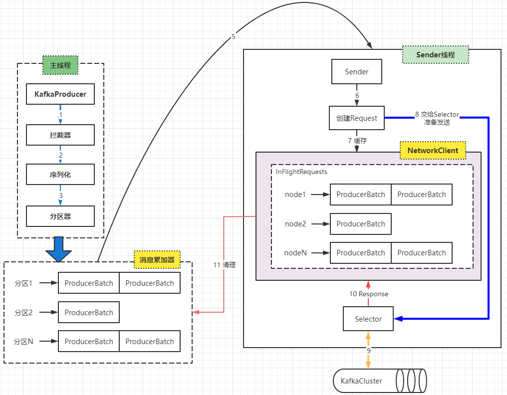

第二部分 Kafka高级特性解析

# 1 生产者

## 1.1 消息发送

### 1.1.1 数据生成流程解析


1. Producer创建时，会创建一个Sender线程并设置为守护线程
2. 生产消息时，内部其实是异步流程；生产的消息先经过 拦截器 -> 序列化器 -> 分区器，然后消息缓存在缓冲区（该缓冲区也是在Producer创建时创建）。
3. 批次发送的条件为：缓冲区数据大小达到batch.size或者linger.ms(等待时间) 上限，哪个先达到就算哪个。
4. 批次发送后，发往指定分区，然后落盘到broker；如果生产者配置了retries参数大于0并且失败原因允许重试，那么客户端内部会对该消息进行重试。
5. 落盘到broker成功，返回生产元数据给生产者。
6. 元数据返回有两种方式：一种通过阻塞直接返回，另一种通过回调返回。


### 1.1.2 必要参数配置

#### 1.1.2.1 broker配置

1. 配置条目的使用方式

   

2. 配置参数：

   | 属性                                        | 说明                                                         | 重要性 |
   | ------------------------------------------- | ------------------------------------------------------------ | ------ |
   | <font color='blue'>bootstrap.servers</font> | 生产者客户端与broker集群建立初始连接需要的broker地址列表，由该初始连接发现kafka集群中其他所有broker。该地址不需要写全部Kafka集群中broker的地址，但也不要写一个，以访该节点宕机的时候不可用。形式为：`host1:port1,host2:port2,...` | high   |
   | key.serializer                              | 实现了接口`org.apache.kafka.common.serialization.Serializer`的key序列化类。 | high   |
   | value.serializer                            | 实现了接口`org.apache.kafka.common.serialization.Serializer`的value序列化类。 | high   |
   | acks                                        | 该选项控制着已发送消息的持久化。<br>`acks=0`：生产者不等待broker的任何消息确认。只要将消息放到socket的缓冲区，就认为消息已发送。不能保证服务器是否收到该消息，`retries`设置也不起作用，因为客户端不关心消息是否发送失败。客户端收到的消息偏移量永远是-1。<br><br>`acks=1`：leader将记录写到它本地日志，就响应客户端确认消息，而不等待follower副本的确认。如果leader确认了消息就宕机，则可能会丢失消息，因为follower副本可能还没来得及同步该消息。<br><br>`acks=all`：leader等待所有同步的副本确认消息。保证了只要由一个副本存在，消息就不会丢失，这是最强的可用性保证。（all指的是***ISR***）等价于`acks=-1`。<br>默认值为1，字符串。可选值：[all,-1,0,1] | high   |
   | compression.type                            | 生产者生成数据的压缩格式。默认是none（没有压缩）。允许的值`none`，`gzip`，`snappy`和`lz4`。压缩是对整个消息批次来讲的。消息批的效率也影响压缩比例。消息批越大，压缩效率越好。字符串类型的值。默认是none。 | high   |
   | retries                                     | 设置该属性为一个大于1的值，将在消息发送失败的时候重新发送消息。该重试与客户端收到异常重新发送并无二至。允许重试但是不设置`max.in.flight.requests.per.connection`为1，存在消息乱序的可能，因为如果两个批次发送到同一个分区，第一个失败了重试，第二个成功了，则第一个消息批在第二个消息批后。int类型的值，默认：0，可选值：[0,.....,2147483647] | high   |

   

### 1.1.3 序列化器


由于Kafka中的数据都是**字节数组**，在将消息发送到kafka之前需要先将数据序列化为字节数组。

序列化器的作用就是用于序列化要发送的消息的。


Kafka使用`org.apache.kafka.common.serialization.Serializer`接口用于定义序列化器，将泛型指定类型的数据转换为字节数组。

```java
package org.apache.kafka.common.serialization;

import java.io.Closeable;
import java.util.Map;

/**
 * 将对象转换为byte数组的接口
 * 该接口的实现类需要提供无参构造器
 * @param <T> 从哪个类型转换
 */
public interface Serializer<T> extends Closeable {

    /**
     * 类的配置信息.
     * @param configs configs in key/value pairs
     * @param isKey key的序列化还是value得序列化
     */
    void configure(Map<String, ?> configs, boolean isKey);

    /**
     * 将对象转换为字节数组
     * @param topic 主题名称
     * @param data 需要转换得对象
     * @return 序列化的字节数组
     */
    byte[] serialize(String topic, T data);

    /**
     * 关闭序列化
     * 该方法需要提供幂等性，因为可能调用多次
       This method must be idempotent as it may be called multiple times.
     */
    @Override
    void close();
}

```


**系统提供了该接口的子接口以及实现类**：

`org.apache.kafka.common.serialization.ByteArraySerializer`


`org.apache.kafka.common.serialization.ByteBufferSerializer`


`org.apache.kafka.common.serialization.BytesSerializer`


`org.apache.kafka.common.serialization.DoubleSerializer`


`org.apache.kafka.common.serialization.FloatSerializer`


`org.apache.kafka.common.serialization.IntegerSerializer`


`org.apache.kafka.common.serialization.StringSerializer`


`org.apache.kafka.common.serialization.LongSerializer`


`org.apache.kafka.common.serialization.ShortSerializer`


#### 1.1.3.1 自定义序列化器

数据的序列化一般生产中使用avro。

自定义序列化器需要实现`org.apache.kafka.common.serialization.Serializer`接口，并实现其中的`serialize`方法。

案例：https://gitee.com/turboYuu/kafka-6-3/tree/master/lab/kafka-demos/demo-05-kafka-customSerializer

1. 实体类
2. 序列化类
3. 生产者

### 1.1.4 分区器


默认（DefaultPartitioner）分区计算：

1. 如果record提供了分区号，则使用record提供的分区号
2. 如果record没有提供分区号，则使用key的序列化后的值的hash值对分区数量取模
3. 如果record没有提供分区号，也没有提供key，则使用轮询的方式分配区号。
   - 会首先在可用的分区中分配分区号
   - 如果没有可用的分区，则在该主题所有分区中分配分区号


#### 1.1.4.1 自定义分区器

如果要自定义分区器，则需要

1. 首先开发Partitioner接口的实现类
2. 在kafkaProducer中进行设置：config.put("partitioner.class","xxx.xx.Xxx.Class")


位于`org.apache.kafka.clients.producer.Partitioner`中的分区器接口

```java
/*
 * Licensed to the Apache Software Foundation (ASF) under one or more
 * contributor license agreements. See the NOTICE file distributed with
 * this work for additional information regarding copyright ownership.
 * The ASF licenses this file to You under the Apache License, Version 2.0
 * (the "License"); you may not use this file except in compliance with
 * the License. You may obtain a copy of the License at
 *
 *    http://www.apache.org/licenses/LICENSE-2.0
 *
 * Unless required by applicable law or agreed to in writing, software
 * distributed under the License is distributed on an "AS IS" BASIS,
 * WITHOUT WARRANTIES OR CONDITIONS OF ANY KIND, either express or implied.
 * See the License for the specific language governing permissions and
 * limitations under the License.
 */
package org.apache.kafka.clients.producer;

import org.apache.kafka.common.Configurable;
import org.apache.kafka.common.Cluster;

import java.io.Closeable;

/**
 * 分区器接口
 */

public interface Partitioner extends Configurable, Closeable {

    /**
     * 为指定的消息记录计算分区值
     *
     * @param topic 主题名称
     * @param key 根据该key的值进行分区计算，如果没有则为null
     * @param keyBytes key的序列化字节数组，根据该数组进行分区计算。如果没有key，则为null
     * @param value 根据value值进行分区计算，如果没有，则为null
     * @param valueBytes value的序列化字节数组，根据此值进行分区计算。如果没有，则为null
     * @param cluster 当前集群的元数据
     */
    public int partition(String topic, Object key, byte[] keyBytes, Object value, byte[] valueBytes, Cluster cluster);

    /**
     * 关闭分区器的时候调用该方法
     */
    public void close();

}
```

包 `org.apache.kafka.clients.producer.internals`中分区器的默认实现：

```java
package org.apache.kafka.clients.producer.internals;

import java.util.List;
import java.util.Map;
import java.util.concurrent.ConcurrentHashMap;
import java.util.concurrent.ConcurrentMap;
import java.util.concurrent.ThreadLocalRandom;
import java.util.concurrent.atomic.AtomicInteger;

import org.apache.kafka.clients.producer.Partitioner;
import org.apache.kafka.common.Cluster;
import org.apache.kafka.common.PartitionInfo;
import org.apache.kafka.common.utils.Utils;

/**
 * 默认分区策略:
 * 
 * 如果在记录中指定了分区，则使用指定的分区
 * 如果没有指定分区，但是有key，则使用key值得散列值计算分区
 * 如果没有指定分区也没有key的值，则使用轮询的方式选择一个分区
 */
public class DefaultPartitioner implements Partitioner {

    private final ConcurrentMap<String, AtomicInteger> topicCounterMap = new ConcurrentHashMap<>();

    public void configure(Map<String, ?> configs) {}

    /**
     * 为指定的消息记录分区值
     *
     * @param topic 主题名称
     * @param key 根据该key的值进行分区计算，如果没有则为null
     * @param keyBytes key的序列化字节数组，根据该数据进行分区计算。如果没有key，则为null
     * @param value 根据value值进行分区计算，如果没有，则为null
     * @param valueBytes value的序列化字节数组，根据此值进行分区计算。如果没有，则为null
     * @param cluster 当前集群的元数据
     */
    public int partition(String topic, Object key, byte[] keyBytes, Object value, byte[] valueBytes, Cluster cluster) {
        // 获取指定主题的所有分区信息
        List<PartitionInfo> partitions = cluster.partitionsForTopic(topic);
        // 分区数量
        int numPartitions = partitions.size();
        // 如果没有提供key
        if (keyBytes == null) {
            int nextValue = nextValue(topic);
            List<PartitionInfo> availablePartitions = cluster.availablePartitionsForTopic(topic);
            if (availablePartitions.size() > 0) {
                int part = Utils.toPositive(nextValue) % availablePartitions.size();
                return availablePartitions.get(part).partition();
            } else {
                // no partitions are available, give a non-available partition
                return Utils.toPositive(nextValue) % numPartitions;
            }
        } else {
            // hash the keyBytes to choose a partition
            // 如果有，就计算keyBytes的哈希值，然后对当前主题的个数取模
            return Utils.toPositive(Utils.murmur2(keyBytes)) % numPartitions;
        }
    }

    private int nextValue(String topic) {
        AtomicInteger counter = topicCounterMap.get(topic);
        if (null == counter) {
            counter = new AtomicInteger(ThreadLocalRandom.current().nextInt());
            AtomicInteger currentCounter = topicCounterMap.putIfAbsent(topic, counter);
            if (currentCounter != null) {
                counter = currentCounter;
            }
        }
        return counter.getAndIncrement();
    }

    public void close() {}

}

```


案例：https://gitee.com/turboYuu/kafka-6-3/tree/master/lab/kafka-demos/demo-06-kafka-customPartitioner

可以实现`Partitioner`接口自定义分区器：

```java
package com.turbo.kafka.demo.partitioner;

import org.apache.kafka.clients.producer.Partitioner;
import org.apache.kafka.common.Cluster;

import java.util.Map;


/**
 * 自定义分区器
 */
public class MyPartitioner implements Partitioner {

    @Override
    public int partition(String topic, Object key, byte[] keyBytes, Object value, byte[] valueBytes, Cluster cluster) {
        // 此处可以计算分区的数字
        // 直接返回2
        return 2;
    }


    @Override
    public void close() {

    }

    @Override
    public void configure(Map<String, ?> configs) {

    }
}

```


然后在生产者中配置：

```java
// 指定自定义的分区器
configs.put(ProducerConfig.PARTITIONER_CLASS_CONFIG, MyPartitioner.class);
```


### 1.1.5 拦截器


Producer拦截器（interceptor）和Cosumer端的Interceptor是在Kafka 0.10版本被引入的，主要用于实现Clienr端的定制化控制逻辑。

对于Producer而言，Interceptor使得用户在**消息发送前**以及**Producer回调逻辑前**有机会对消息做一些定制化需求，比如修改消息等。同时，Producer允许用户指定多个Interceptor按序作用于同一条消息从而形成一个拦截器链（interceptor chain）(1,2,3,4 进入，1,2,3,4出来)。Interceptor的实现接口是`org.apache.kafka.clients.producer.ProducerInterceptor`，其定义的方法包括 ：

- onSend(ProducerRecord<K, V> record)：该方法封装进KafkaProducer.send方法中，即运行在用户主线程中。Producer确保在消息被序列化以计算分区前调用该方法。用户可以在该方法中对消息做任何操作，但最好不要修改消息所属的topic和分区，否则会影响目标分区的计算。
- onAcknowledgement(RecordMetadata, Exception)：该方法会在消息被应答之前或消息发送失败时调用，并且通常都是放在Producer回调逻辑触发之前。onAcknowledgement运行在Producer的IO线程中，因此不要在该方法中放入很重的逻辑，否则会拖慢Producer的消息发送效率。
- close：关闭Interceptor，主要用于执行一些资源清理工作。

如前所述，Interceptor可能被运行在多个线程中，因此在具体实现时，用户需要**自行确保线程安全**。另外倘若指定了多个Interceptor，则Producer将按照指定顺序调用它们，并仅仅是捕获每个Interceptor可能排除的异常记录到错误日志中而非在向上传递。这在使用过程中要特别留意。

#### 1.1.5.1 自定义拦截器

自定义拦截器：

1. 实现`org.apache.kafka.clients.producer.ProducerInterceptor`接口
2. 在KafkaProducer的设置中设置自定义的拦截器


案例：https://gitee.com/turboYuu/kafka-6-3/tree/master/lab/kafka-demos/demo-07-kafka-customInterceptor

1. 自定义拦截器1 `InterceptorOne`
2. 自定义拦截器2 `InterceptorTwo`
3. 自定义拦截器3 `InterceptorThree`
4. 生产者
5. 执行结果


## 1.2 原理剖析



由上图可以看出：KafkaProducer有两个基本线程：

- 主线程：负责消息创建，拦截器，序列化器，分区器等操作，并将消息追加到消息收集器RecordAccumulator中：
  - 消息收集器RecordAccumulator为每个分区维护了一个Deque< ProducerBatch>类型的双端队列。
  - ProducerBatch 可以理解为是 ProducerRecord的集合，批量发送有利于提升吞吐量，降低网络影响。
  - 由于生产者客户端使用java.io.ByteBuffer在发送消息之前进行消息保存，并维护了一个BufferPool实现ByteBuffer的复用；该缓冲池只针对特定大小（batch.size指定）的ByteBuffer进行管理，对于消息过大的缓存，不能做到重复利用。
  - 每次追加一条ProducerRecord消息，会寻找/新建对应的双端队列，从其尾部获取一个ProducerBatch，判断当前消息的大小是否可以写入该批次中。若可以写入则写入；<br>若不可以写入，则新建一个ProducerBatch，判断该消息大小是否超过客户端参数配置batch.size的值，<br>**不超过**，则以batch.size建立新的ProducerBatch，这样方便进行缓存重复利用；<br>**若超过**，则计算消息的大小，建立对应的ProducerBatch，缺点就是该内存不能被复用。
- Sender线程：
  - 该线程从消息收集器获取缓存的消息，将其处理为<Node,List< ProducerBacth>>的形式，Node表示集群的broker节点。
  - 进一步将<Node,List< ProducerBacth>>转化为<Node, Request>形式，此时才可以向服务端发送数据。
  - 在发送之前，Sender线程将消息以Map<NodeId,Deque< Request>>的形式保存到InFlightRequests中进行缓存，可以通过其获取leastLoadedNode，即当前Node中负载压力最小的一个，以实现消息的尽快发出。

## 1.3 生产者参数配置补齐

1. 参数设置方式

   

   

2. 补充参数：

   | 参数名称            | 描述                                                         |
   | ------------------- | ------------------------------------------------------------ |
   | retry.backoff.ms    | <font style="font-size:92%">在向一个执行的主题分区重发消息的时候，重试之间的等待时间。<br>比如3次重试，每次重试之后等待该时间长度，再接着重试。在一些失败的场景，避免了密集循环的重新发送请求.<br>long类型，默认100，可选值：[0,...]</font> |
   | retries             | <font style="font-size:92%">retries重试次数。<br>当消息发送出现错误的时候，系统会重发消息。<br>跟客户端收到错误时重发一样。<br>如果设置了重试，还想保证消息的有序性，需要设置MAX_IN_FLIGHT_REQUEST_PER_CONNECTION=1<br>否则在重试此失败消息的时候，其他的消息可能发送成功了。</font> |
   | request.timeout.ms  | 客户端等待请求响应的最大时长。如果服务端响应超时，则会重发请求，除非达到重试次数。该设置应该比`replica.lag.time.max.ms`(a broker configuration)要大，以免在服务器延迟时间内重发消息。int类型值，默认：3000，可选值：[0,...] |
   | interceptor.classes | 在生产者接收到该消息，向Kafka集群传输之前，由序列化处理处理之前，可以通过拦截器对消息进行处理。<br>要求拦截器必须实现`org.apache.kafka.clients.producer.ProducerInterceptor`接口。<br>默认没有拦截器。<br>Map<String,Object> configs中通过List集合配置多个拦截器类名 |
   | acks                | <font style="font-size:92%">当生产者发送消息之后，如何确认消息已经发送成功了。<br>支持的值：<br><br>acks=0：如果设置为0，表示生产者不会等待Broker对消息的确认，只要将消息放到缓冲区，就认为消息已经发送完成。该情形下不能保证broker是否真的收到了消息，retries配置也不会生效，因为客户端不需要知道消息是否发送成功。发送的消息的返回的消息偏移量永远是-1。<br><br>acks=1：表示消息只需要写道主分区即可，然后就响应客户端，而不等待副本分区的确认。<br>在该情形下，如果主分区收到消息确认之后就宕机了，而副本还没来得及同步消息，则该消息丢失。<br><br>acks=all：首领分区等待所有的***ISR***副本分区确认记录。<br>该处理保证了只要有一个ISR副本分区存储，消息就不会丢失。<br>这就是Kafka最强的可靠性保证，等效于`acks=-1`。</font> |
   |                     |                                                              |
   |                     |                                                              |
   |                     |                                                              |
   |                     |                                                              |

   

# 2 消费者

# 3 主题

# 4 分区

# 5 物理存储

# 6 稳定性

# 7 延时队列

# 8 重试队列