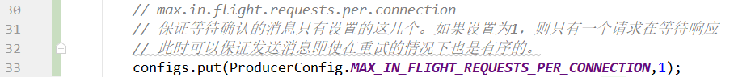
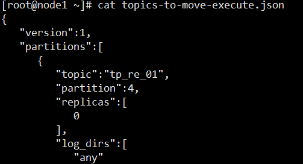
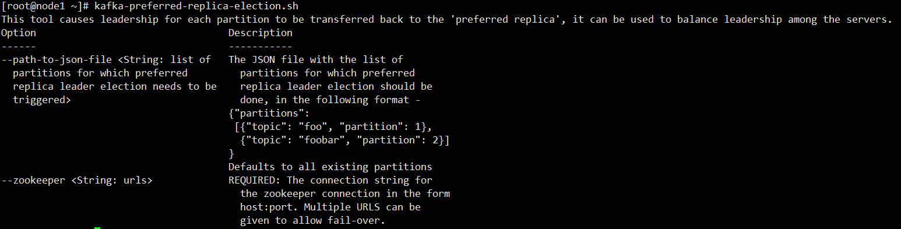
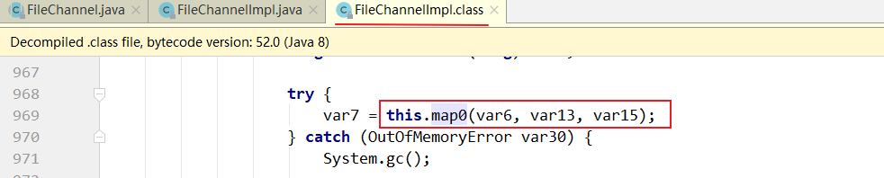

第二部分 Kafka高级特性解析

# 1 生产者

## 1.1 消息发送

### 1.1.1 数据生成流程解析


1. Producer创建时，会创建一个Sender线程并设置为守护线程
2. 生产消息时，内部其实是异步流程；生产的消息先经过 拦截器 -> 序列化器 -> 分区器，然后消息缓存在缓冲区（该缓冲区也是在Producer创建时创建）。
3. 批次发送的条件为：缓冲区数据大小达到batch.size或者linger.ms(等待时间) 上限，哪个先达到就算哪个。
4. 批次发送后，发往指定分区，然后落盘到broker；如果生产者配置了retries参数大于0并且失败原因允许重试，那么客户端内部会对该消息进行重试。
5. 落盘到broker成功，返回生产元数据给生产者。
6. 元数据返回有两种方式：一种通过阻塞直接返回，另一种通过回调返回。


### 1.1.2 必要参数配置

#### 1.1.2.1 broker配置

> 1.配置条目的使用方式


> 2.配置参数：

| 属性                                        | 说明                                                         | 重要性 |
| ------------------------------------------- | ------------------------------------------------------------ | ------ |
| <font color='blue'>bootstrap.servers</font> | 生产者客户端与broker集群建立初始连接需要的broker地址列表，由该初始连接发现kafka集群中其他所有broker。该地址不需要写全部Kafka集群中broker的地址，但也不要写一个，以访该节点宕机的时候不可用。形式为：`host1:port1,host2:port2,...` | high   |
| key.serializer                              | 实现了接口`org.apache.kafka.common.serialization.Serializer`的key序列化类。 | high   |
| value.serializer                            | 实现了接口`org.apache.kafka.common.serialization.Serializer`的value序列化类。 | high   |
| acks                                        | 该选项控制着已发送消息的持久化。<br>`acks=0`：生产者不等待broker的任何消息确认。只要将消息放到socket的缓冲区，就认为消息已发送。不能保证服务器是否收到该消息，`retries`设置也不起作用，因为客户端不关心消息是否发送失败。客户端收到的消息偏移量永远是-1。<br><br>`acks=1`：leader将记录写到它本地日志，就响应客户端确认消息，而不等待follower副本的确认。如果leader确认了消息就宕机，则可能会丢失消息，因为follower副本可能还没来得及同步该消息。<br><br>`acks=all`：leader等待所有同步的副本确认消息。保证了只要由一个副本存在，消息就不会丢失，这是最强的可用性保证。（all指的是***ISR***）等价于`acks=-1`。<br>默认值为1，字符串。可选值：[all,-1,0,1] | high   |
| compression.type                            | 生产者生成数据的压缩格式。默认是none（没有压缩）。允许的值`none`，`gzip`，`snappy`和`lz4`。压缩是对整个消息批次来讲的。消息批的效率也影响压缩比例。消息批越大，压缩效率越好。字符串类型的值。默认是none。 | high   |
| retries                                     | 设置该属性为一个大于1的值，将在消息发送失败的时候重新发送消息。该重试与客户端收到异常重新发送并无二至。允许重试但是不设置`max.in.flight.requests.per.connection`为1，存在消息乱序的可能，因为如果两个批次发送到同一个分区，第一个失败了重试，第二个成功了，则第一个消息批在第二个消息批后。int类型的值，默认：0，可选值：[0,.....,2147483647] | high   |


### 1.1.3 序列化器


由于Kafka中的数据都是**字节数组**，在将消息发送到kafka之前需要先将数据序列化为字节数组。

序列化器的作用就是用于序列化要发送的消息的。


Kafka使用`org.apache.kafka.common.serialization.Serializer`接口用于定义序列化器，将泛型指定类型的数据转换为字节数组。

```java
package org.apache.kafka.common.serialization;

import java.io.Closeable;
import java.util.Map;

/**
 * 将对象转换为byte数组的接口
 * 该接口的实现类需要提供无参构造器
 * @param <T> 从哪个类型转换
 */
public interface Serializer<T> extends Closeable {

    /**
     * 类的配置信息.
     * @param configs configs in key/value pairs
     * @param isKey key的序列化还是value得序列化
     */
    void configure(Map<String, ?> configs, boolean isKey);

    /**
     * 将对象转换为字节数组
     * @param topic 主题名称
     * @param data 需要转换得对象
     * @return 序列化的字节数组
     */
    byte[] serialize(String topic, T data);

    /**
     * 关闭序列化
     * 该方法需要提供幂等性，因为可能调用多次
       This method must be idempotent as it may be called multiple times.
     */
    @Override
    void close();
}

```


**系统提供了该接口的子接口以及实现类**：

`org.apache.kafka.common.serialization.ByteArraySerializer`


`org.apache.kafka.common.serialization.ByteBufferSerializer`


`org.apache.kafka.common.serialization.BytesSerializer`


`org.apache.kafka.common.serialization.DoubleSerializer`


`org.apache.kafka.common.serialization.FloatSerializer`


`org.apache.kafka.common.serialization.IntegerSerializer`


`org.apache.kafka.common.serialization.StringSerializer`


`org.apache.kafka.common.serialization.LongSerializer`


`org.apache.kafka.common.serialization.ShortSerializer`


#### 1.1.3.1 自定义序列化器

数据的序列化一般生产中使用avro。

自定义序列化器需要实现`org.apache.kafka.common.serialization.Serializer`接口，并实现其中的`serialize`方法。

案例：https://gitee.com/turboYuu/kafka-6-3/tree/master/lab/kafka-demos/demo-05-kafka-customSerializer

1. 实体类

2. 自定义序列化类 UserSerializer

3. 生产者中使用

   

   

### 1.1.4 分区器


默认（DefaultPartitioner）分区计算：

1. 如果record提供了分区号，则使用record提供的分区号
2. 如果record没有提供分区号，则使用key的序列化后的值的hash值对分区数量取模
3. 如果record没有提供分区号，也没有提供key，则使用轮询的方式分配区号。
   - 会首先在可用的分区中分配分区号
   - 如果没有可用的分区，则在该主题所有分区中分配分区号


#### 1.1.4.1 自定义分区器

如果要自定义分区器，则需要

1. 首先开发`org.apache.kafka.clients.producer.Partitioner`接口的实现类
2. 在kafkaProducer中进行设置：config.put("partitioner.class","xxx.xx.Xxx.Class")


位于`org.apache.kafka.clients.producer.Partitioner`中的分区器接口

```java
/*
 * Licensed to the Apache Software Foundation (ASF) under one or more
 * contributor license agreements. See the NOTICE file distributed with
 * this work for additional information regarding copyright ownership.
 * The ASF licenses this file to You under the Apache License, Version 2.0
 * (the "License"); you may not use this file except in compliance with
 * the License. You may obtain a copy of the License at
 *
 *    http://www.apache.org/licenses/LICENSE-2.0
 *
 * Unless required by applicable law or agreed to in writing, software
 * distributed under the License is distributed on an "AS IS" BASIS,
 * WITHOUT WARRANTIES OR CONDITIONS OF ANY KIND, either express or implied.
 * See the License for the specific language governing permissions and
 * limitations under the License.
 */
package org.apache.kafka.clients.producer;

import org.apache.kafka.common.Configurable;
import org.apache.kafka.common.Cluster;

import java.io.Closeable;

/**
 * 分区器接口
 */

public interface Partitioner extends Configurable, Closeable {

    /**
     * 为指定的消息记录计算分区值
     *
     * @param topic 主题名称
     * @param key 根据该key的值进行分区计算，如果没有则为null
     * @param keyBytes key的序列化字节数组，根据该数组进行分区计算。如果没有key，则为null
     * @param value 根据value值进行分区计算，如果没有，则为null
     * @param valueBytes value的序列化字节数组，根据此值进行分区计算。如果没有，则为null
     * @param cluster 当前集群的元数据
     */
    public int partition(String topic, Object key, byte[] keyBytes, Object value, byte[] valueBytes, Cluster cluster);

    /**
     * 关闭分区器的时候调用该方法
     */
    public void close();

}
```

包 `org.apache.kafka.clients.producer.internals`中分区器的默认实现：

```java
package org.apache.kafka.clients.producer.internals;

import java.util.List;
import java.util.Map;
import java.util.concurrent.ConcurrentHashMap;
import java.util.concurrent.ConcurrentMap;
import java.util.concurrent.ThreadLocalRandom;
import java.util.concurrent.atomic.AtomicInteger;

import org.apache.kafka.clients.producer.Partitioner;
import org.apache.kafka.common.Cluster;
import org.apache.kafka.common.PartitionInfo;
import org.apache.kafka.common.utils.Utils;

/**
 * 默认分区策略:
 * 
 * 如果在记录中指定了分区，则使用指定的分区
 * 如果没有指定分区，但是有key，则使用key值得散列值计算分区
 * 如果没有指定分区也没有key的值，则使用轮询的方式选择一个分区
 */
public class DefaultPartitioner implements Partitioner {

    private final ConcurrentMap<String, AtomicInteger> topicCounterMap = new ConcurrentHashMap<>();

    public void configure(Map<String, ?> configs) {}

    /**
     * 为指定的消息记录分区值
     *
     * @param topic 主题名称
     * @param key 根据该key的值进行分区计算，如果没有则为null
     * @param keyBytes key的序列化字节数组，根据该数据进行分区计算。如果没有key，则为null
     * @param value 根据value值进行分区计算，如果没有，则为null
     * @param valueBytes value的序列化字节数组，根据此值进行分区计算。如果没有，则为null
     * @param cluster 当前集群的元数据
     */
    public int partition(String topic, Object key, byte[] keyBytes, Object value, byte[] valueBytes, Cluster cluster) {
        // 获取指定主题的所有分区信息
        List<PartitionInfo> partitions = cluster.partitionsForTopic(topic);
        // 分区数量
        int numPartitions = partitions.size();
        // 如果没有提供key
        if (keyBytes == null) {
            int nextValue = nextValue(topic);
            List<PartitionInfo> availablePartitions = cluster.availablePartitionsForTopic(topic);
            if (availablePartitions.size() > 0) {
                int part = Utils.toPositive(nextValue) % availablePartitions.size();
                return availablePartitions.get(part).partition();
            } else {
                // no partitions are available, give a non-available partition
                return Utils.toPositive(nextValue) % numPartitions;
            }
        } else {
            // hash the keyBytes to choose a partition
            // 如果有，就计算keyBytes的哈希值，然后对当前主题的个数取模
            return Utils.toPositive(Utils.murmur2(keyBytes)) % numPartitions;
        }
    }

    private int nextValue(String topic) {
        AtomicInteger counter = topicCounterMap.get(topic);
        if (null == counter) {
            counter = new AtomicInteger(ThreadLocalRandom.current().nextInt());
            AtomicInteger currentCounter = topicCounterMap.putIfAbsent(topic, counter);
            if (currentCounter != null) {
                counter = currentCounter;
            }
        }
        return counter.getAndIncrement();
    }

    public void close() {}

}

```


案例：https://gitee.com/turboYuu/kafka-6-3/tree/master/lab/kafka-demos/demo-06-kafka-customPartitioner

可以实现`Partitioner`接口自定义分区器：

```java
package com.turbo.kafka.demo.partitioner;

import org.apache.kafka.clients.producer.Partitioner;
import org.apache.kafka.common.Cluster;

import java.util.Map;


/**
 * 自定义分区器
 */
public class MyPartitioner implements Partitioner {

    @Override
    public int partition(String topic, Object key, byte[] keyBytes, Object value, byte[] valueBytes, Cluster cluster) {
        // 此处可以计算分区的数字
        // 直接返回2
        return 2;
    }


    @Override
    public void close() {

    }

    @Override
    public void configure(Map<String, ?> configs) {

    }
}

```


然后在生产者中配置：

```java
// 指定自定义的分区器
configs.put(ProducerConfig.PARTITIONER_CLASS_CONFIG, MyPartitioner.class);
```


### 1.1.5 拦截器


Producer拦截器（interceptor）和Cosumer端的Interceptor是在Kafka 0.10版本被引入的，主要用于实现Clienr端的定制化控制逻辑。

对于Producer而言，Interceptor使得用户在**消息发送前**以及**Producer回调逻辑前**有机会对消息做一些定制化需求，比如修改消息等。同时，Producer允许用户指定多个Interceptor按序作用于同一条消息从而形成一个拦截器链（interceptor chain）(1,2,3,4 进入，1,2,3,4出来)。Interceptor的实现接口是`org.apache.kafka.clients.producer.ProducerInterceptor`，其定义的方法包括 ：

- onSend(ProducerRecord<K, V> record)：该方法封装进KafkaProducer.send方法中，即运行在用户主线程中。Producer确保在消息被序列化以计算分区前调用该方法。用户可以在该方法中对消息做任何操作，但最好不要修改消息所属的topic和分区，否则会影响目标分区的计算。
- onAcknowledgement(RecordMetadata, Exception)：该方法会在消息被应答之前或消息发送失败时调用，并且通常都是放在Producer回调逻辑触发之前。onAcknowledgement运行在Producer的IO线程中，因此不要在该方法中放入很重的逻辑，否则会拖慢Producer的消息发送效率。
- close：关闭Interceptor，主要用于执行一些资源清理工作。

如前所述，Interceptor可能被运行在多个线程中，因此在具体实现时，用户需要**自行确保线程安全**。另外倘若指定了多个Interceptor，则Producer将按照指定顺序调用它们，并仅仅是捕获每个Interceptor可能排除的异常记录到错误日志中而非在向上传递。这在使用过程中要特别留意。

#### 1.1.5.1 自定义拦截器

自定义拦截器：

1. 实现`org.apache.kafka.clients.producer.ProducerInterceptor`接口
2. 在KafkaProducer的设置中设置自定义的拦截器


案例：https://gitee.com/turboYuu/kafka-6-3/tree/master/lab/kafka-demos/demo-07-kafka-customInterceptor

1. 自定义拦截器1 `InterceptorOne`
2. 自定义拦截器2 `InterceptorTwo`
3. 自定义拦截器3 `InterceptorThree`
4. 生产者
5. 执行结果


## 1.2 原理剖析


由上图可以看出：KafkaProducer有两个基本线程：

- 主线程：负责消息创建，拦截器，序列化器，分区器等操作，并将消息追加到消息收集器RecordAccumulator中：
  - 消息收集器RecordAccumulator为每个分区维护了一个Deque< ProducerBatch>类型的双端队列。
  - ProducerBatch 可以理解为是 ProducerRecord的集合，批量发送有利于提升吞吐量，降低网络影响。
  - 由于生产者客户端使用java.io.ByteBuffer在发送消息之前进行消息保存，并维护了一个BufferPool实现ByteBuffer的复用；该缓冲池只针对特定大小（batch.size指定）的ByteBuffer进行管理，对于消息过大的缓存，不能做到重复利用。
  - 每次追加一条ProducerRecord消息，会寻找/新建对应的双端队列，从其尾部获取一个ProducerBatch，判断当前消息的大小是否可以写入该批次中。若可以写入则写入；<br>若不可以写入，则新建一个ProducerBatch，判断该消息大小是否超过客户端参数配置batch.size的值，<br>**不超过**，则以batch.size建立新的ProducerBatch，这样方便进行缓存重复利用；<br>**若超过**，则计算消息的大小，建立对应的ProducerBatch，缺点就是该内存不能被复用。
- Sender线程：
  - 该线程从消息收集器获取缓存的消息，将其处理为<Node,List< ProducerBacth>>的形式，Node表示集群的broker节点。
  - 进一步将<Node,List< ProducerBacth>>转化为<Node, Request>形式，此时才可以向服务端发送数据。
  - 在发送之前，Sender线程将消息以Map<NodeId,Deque< Request>>的形式保存到 InFlightRequests 中进行缓存，可以通过其获取leastLoadedNode，即当前Node中负载压力最小的一个，以实现消息的尽快发出。

## 1.3 生产者参数配置补齐

> 1.参数设置方式




> 2.补充参数：

| 参数名称                                    | 描述                                                         |
| ------------------------------------------- | ------------------------------------------------------------ |
| retry.backoff.ms                            | <font style="font-size:92%">在向一个执行的主题分区重发消息的时候，重试之间的等待时间。<br>比如3次重试，每次重试之后等待该时间长度，再接着重试。在一些失败的场景，避免了密集循环的重新发送请求.<br>long类型，默认100，可选值：[0,...]</font> |
| retries                                     | <font style="font-size:92%">retries重试次数。<br>当消息发送出现错误的时候，系统会重发消息。<br>跟客户端收到错误时重发一样。<br>如果设置了重试，还想保证消息的有序性，需要设置MAX_IN_FLIGHT_REQUEST_PER_CONNECTION=1<br>否则在重试此失败消息的时候，其他的消息可能发送成功了。</font> |
| request.timeout.ms                          | <font style="font-size:92%">客户端等待请求响应的最大时长。如果服务端响应超时，则会重发请求，除非达到重试次数。该设置应该比`replica.lag.time.max.ms`(a broker configuration)要大，以免在服务器延迟时间内重发消息。int类型值，默认：3000，可选值：[0,...]</font> |
| interceptor.classes                         | <font style="font-size:92%">在生产者接收到该消息，向Kafka集群传输之前，由序列化处理处理之前，可以通过拦截器对消息进行处理。<br>要求拦截器必须实现`org.apache.kafka.clients.producer.ProducerInterceptor`接口。<br>默认没有拦截器。<br>Map<String,Object> configs中通过List集合配置多个拦截器类名</font> |
| acks                                        | <font style="font-size:92%">当生产者发送消息之后，如何确认消息已经发送成功了。<br>支持的值：<br><br>acks=0：如果设置为0，表示生产者不会等待Broker对消息的确认，只要将消息放到缓冲区，就认为消息已经发送完成。该情形下不能保证broker是否真的收到了消息，retries配置也不会生效，因为客户端不需要知道消息是否发送成功。发送的消息的返回的消息偏移量永远是-1。<br><br>acks=1：表示消息只需要写道主分区即可，然后就响应客户端，而不等待副本分区的确认。<br>在该情形下，如果主分区收到消息确认之后就宕机了，而副本还没来得及同步消息，则该消息丢失。<br><br>acks=all：首领分区等待所有的***ISR***副本分区确认记录。<br>该处理保证了只要有一个ISR副本分区存储，消息就不会丢失。<br>这就是Kafka最强的可靠性保证，等效于`acks=-1`。</font> |
| batch.size                                  | 当多个消息发送到同一个分区的时候，生产者尝试将多个记录作为一个批次来处理。批处理提高了客户端和服务器的处理效率。<br>该配置项以字节为单位控制默认批的大小。<br>所有的批小于等于该值。<br>发送给broker的请求将包含多个批次，每个分区一个，并包含可发送的数据。<br>如果该值设置得比较小，会限制吞吐量（设置为0会完全禁用批处理）。如果设置的很大，又有一点浪费内存，因为Kafka会永远分配这么大的内存来参与到消息的批整合中。 |
| client.id                                   | 生产者发送请求的时候传递给broker的id字符串。<br>用于在broker的请求日志中追踪什么应用发送了什么消息。<br>一般该id是跟业务有关的字符串。 |
| compression.type                            | 生产设发送的所有数据的压缩方式。默认是`none`，也就是不压缩。<br>支持的值：none，gzip，snappy和lz4。<br>压缩是对整个批次来讲的，所以批处理的效率也就会影响到压缩的比例 |
| send.buffer.bytes                           | TCP发送数据的时候使用的缓冲区（SO_SNDBUF）大小。如果设置为0，则使用操作系统默认的。 |
| buffer.memory                               | 生产者可以用来缓存等待发送到服务器的记录的总内存字节。如果记录的发送速度超过了将记录发送到服务器的速度，则生产者将阻塞`max.block.ms`的时间，此后它将引发异常。<br>此设置应大致对应于生产者将使用的总内存，但并非生产者使用的所有内存都用于缓冲。<br>一些额外的内存将用于压缩（如果启用了压缩）以及维护运行中的请求。<br>long类型，默认值：33554432（32M），可选值：[0,...] |
| connections.max.idle.ms                     | 当连接空闲时间达到这个值，就关闭连接。long类型数据，默认：540000 |
| linger.ms                                   | <font style="font-size:92%">生产者在发送请求传输间隔回对需要发送的消息进行累加，然后作为一个批次发送。<br>一般情况是消息的发送速度比消息累积的速度慢。有时客户端需要减少请求的次数，即使在发送负载不大的情况下。<br>该配置设置了一个延迟，生产者不会立即将消息发送到broker，而是等待这么一段时间以累积消息，然后将这段时间之内的消息作为一个批次发送。<br>该设置是批处理的另一个上限：一旦批处理达到`batch.size`指定的值，消息批会立即发送，如果积累的消息字节数达不到`batch.size`的值，可以设置该毫秒值，等待这么长时间之后，也会发送消息批。该属性默认值是0（没有延迟）。如果设置`linger.ms=5`，则在一个请求发送之前先等待5ms。<br>long类型，默认：0，可选值：[0,...]</font> |
| max.block.ms                                | 控制`KafkaProducer.send()`和`KafkaProducer.partitionsFor`阻塞的时长。当缓存满了或元数据不可用的时候，这些方法阻塞。在用户提供的序列化器和分区器的阻塞时间不计入。long类型，默认：60000，可选值：[0,....] |
| max.request.size                            | 单个请求的最大字节数。该设置会限制单个请求中消息批的消息个数，以免单个请求发送太多的数据。服务器有自己的限制批大小的设置，于该配置可能不一样。<br>int类型，默认值：1048576，可选值：[0,....] |
| partitioner.class                           | 实现了接口`org.apache.kafka.clients.producer.Partitioner`的分区实现类。默认值为：`org.apache.kafka.clients.producer.internals.DefaultPartitioner` |
| receive.buffer.bytes                        | TCP接收缓存（SO_RCVBUF），如果设置为-1，则使用操作系统默认的值。<br>int类型，默认值：32768，可选值：[-1,...] |
| <font color='blue'>security.protocol</font> | 跟broker通信协议：PLAINTEXT，SSL，SASL_PLAINTEXT，SASL_SSL<br>String类型，默认：PLAINTEXT |
| max.in.flight.requests.per.connection       | 单个连接上未确认请求的最大数量。达到这个数量，客户端阻塞。如果该值大于1，且存在失败的请求，在重试的时候消息顺序不能保证。<br>int类型，默认5，可选值：[1,....] |
| reconnect.backoff.max.ms                    | 对于每个连续的连接失败，每台主机的退避将成倍增加，直至达到此最大值。在计算退避增量之后，添加20%的随机抖动以避免连接风暴。<br>long型值，默认1000，可选值：[0,...] |
| reconnect.backoff.ms                        | 尝试重连指定主机的基础等待时间。避免了到该主机的密集重连。该瑞比时间应用于该客户端到broker的所有连接。<br>long类型，默认值：50，可选值：[0,...] |


# 2 消费者

## 2.1 概念

### 2.1.1 消费者、消费组

消费者从订阅的主题消费消息，消费消息的偏移量保存在kafka的名字是`_consumer_offsets主题中。`

消费者还可以将自己的偏移量存储到Zookeeper，需要设置`offset.storage=zookeeper`。

推荐使用Kafka存储消费者的偏移量。因为<font color='red'>Zookeeper不适合高并发</font>。


多个从同一个主题消费的消费者可以加入到一个消费组中。

消费组中的消费者共享group_id。

`configs.put(";group.id","xxx");`


group_id一般设置为应用的逻辑名称。比如多个订单处理程序组成一个消费组，可以设置group_id为"order_process"。

group_id通过消费者的配置指定：`group.id=xxx`

消费组均衡地给消费者分配分区，每个分区只能由消费组中的一个消费者消费。


一个拥有四个分区的主题，包含一个消费者的消费组。

此时，消费组中的消费者消费主题中的所有分区，并且没有重复的可能。


如果在消费组中添加一个消费者2，则每个消费者分别从两个分区接收消息。


如果消费组有四个消费者，则每个消费者可以分配到一个分区。


如果向消费组中添加更多的消费者，超过主题分区数量，则有一部分消费者就会闲置，不会接收任何消息。


向消费组添加消费者是横向扩展消费能力的主要方式。

必要时，需要为主题创建大量分区，在负载增长时可以加入更多的消费者，但是不要让消费者的数量超过主题分区的数量。


除了通过增加消费者来横向扩展单个应用的消费能力之外，经常出现多个应用程序从同一个主题消费的情况。

此时，每个应用都可以获取到所有的消息。只要保证每个应用都有自己的消费组，就可以让他们获取到主题所有的消息。

横向扩展消费者和消费组不会对性能造成负面影响。


为每个需求获取一个或多个主题全部消息的应用创建一个消费组，然后向消费组添加消费者来横向扩展消费能力和应用的处理能力，则每个消费者只处理一部分消息。

### 2.1.2 心跳机制


消费者宕机，退出消费组，触发再平衡，重新给消费组中的消费者分配分区。


由于broker宕机，主题X的分区3宕机，此时分区3没有Leader副本，触发再平衡，消费者4没有对应的主题分区，则消费者4闲置。


Kafka的心跳是Kafka Consumer 和 Broker之间的健康检查，只有当Broker Coordinator正常时，Consumer才会发送心跳。

Consumer 和 Rebalance 相关的2个配置参数：

| 参数                 | 字段                              |
| -------------------- | --------------------------------- |
| session.timeout.ms   | MemberMetadata.sessionTimeoutMs   |
| max.poll.interval.ms | MemberMetadata.rebalanceTimeoutMs |


> broker端，sessionTimeoutMs参数

broker处理心跳的逻辑在`GroupCoordinator`类中：如果心跳超期，broker coordinate会把消费者从group中移除，并触发rebalance。


> consumer 端：sessionTimeoutMs，rebalanceTimeoutMs参数

如果客户端发现心跳超期，客户端会标记coordinator为不可用，并阻塞心跳线程；如果超过poll消息的间隔超过了rebalanceTimeoutms，则consumer告知broker主动离开消费组，也会触发rebalance。

`org.apache.kafka.clients.consumer.internals.AbstractCoordinator.HeartbeatThread`

```java
if (coordinatorUnknown()) {
    if (findCoordinatorFuture != null || lookupCoordinator().failed())
        // the immediate future check ensures that we backoff properly in the case that no
        // brokers are available to connect to.
        AbstractCoordinator.this.wait(retryBackoffMs);
} else if (heartbeat.sessionTimeoutExpired(now)) {
    // the session timeout has expired without seeing a successful heartbeat, so we should
    // probably make sure the coordinator is still healthy.
    markCoordinatorUnknown();
} else if (heartbeat.pollTimeoutExpired(now)) {
    // the poll timeout has expired, which means that the foreground thread has stalled
    // in between calls to poll(), so we explicitly leave the group.
    maybeLeaveGroup();
} else if (!heartbeat.shouldHeartbeat(now)) {
    // poll again after waiting for the retry backoff in case the heartbeat failed or the
    // coordinator disconnected
    AbstractCoordinator.this.wait(retryBackoffMs);
} else {
    heartbeat.sentHeartbeat(now);

    sendHeartbeatRequest().addListener(new RequestFutureListener<Void>() {
        @Override
        public void onSuccess(Void value) {
            synchronized (AbstractCoordinator.this) {
                heartbeat.receiveHeartbeat(time.milliseconds());
            }
        }

        @Override
        public void onFailure(RuntimeException e) {
            synchronized (AbstractCoordinator.this) {
                if (e instanceof RebalanceInProgressException) {
                    // it is valid to continue heartbeating while the group is rebalancing. This
                    // ensures that the coordinator keeps the member in the group for as long
                    // as the duration of the rebalance timeout. If we stop sending heartbeats,
                    // however, then the session timeout may expire before we can rejoin.
                    heartbeat.receiveHeartbeat(time.milliseconds());
                } else {
                    heartbeat.failHeartbeat();

                    // wake up the thread if it's sleeping to reschedule the heartbeat
                    AbstractCoordinator.this.notify();
                }
            }
        }
    });
}
```


## 2.2 消息接收

### 2.2.1 必要参数配置

| 参数                                        | 说明                                                         |
| ------------------------------------------- | ------------------------------------------------------------ |
| <font color='blue'>bootstrap.servers</font> | <font style="font-size:93%">向Kafka集群建立初始连接用到host/port列表。<br>客户端使用这里列出的所有服务器进行集群其他服务器的发现，而不管是否指定哪个服务器用作引导。<br>这个列表仅影响用来发现集群所有服务器的初始主机。<br>字符串形式：`host1:port1,host2:port2,...`<br>由于这组服务器仅用于建立初始连接，然后发现集群中的所有服务器，因此没有必要将集群中的所有地址写在这里。一般最好两台，以访其中一台宕机。</font> |
| key.deserializer                            | key的反序列化类，该类需要实现`org.apache.kafka.common.serialization.Deserializer`接口。 |
| value.deserializer                          | <font style="font-size:93%">实现了`org.apache.kafka.common.serialization.Deserializer`的接口的反序列化器，用于对消息的value进行反序列化。</font> |
| client.id                                   | 当从服务器消费消息的时候向服务器发送的id字符串。在ip/port基础上提供应用的逻辑名称，记录在服务端的请求日志中，用于追踪请求的源。 |
| group.id                                    | 用于唯一标示当前消费者所属的消费组的字符串。<br>如果消费者使用管理功能如subscribe(topic)或使用基于kafka的偏移量管理策略，该项必须设置。 |
| auto.offset.reset                           | 当Kafka中没有初始偏移量或当前偏移量在服务器中不存在（如，数据被删除了），该如何处理？<br>earliest：自动重置偏移量到最早的偏移量；<br>latest：自动重置偏移量为最新的偏移量；<br>none：如果消费组原来的（previous）偏移量不存在，则向消费者抛异常；<br>anything：向消费者抛异常。 |
| enable.auto.commit                          | 如果设置为true，消费者会自动周期性的向服务器提交偏移量。     |


### 2.2.2 订阅

#### 2.2.2.1 主题和分区

- **Topic**，Kafka用于分类管理消息的逻辑单元，类似于MySQL分库分表中的逻辑表。
- **Partition**，是Kafka下数据存储的基本单元，这是个物理上的概念。**同一个Topic的数据，会被分散的存储到多个Partition中**，这些Partition可以在同一台机器上，也可以在多台机器上。优势在于：有利于水平扩展，避免单台机器在磁盘空间和性能上的限制，同时可以通过复制来增加数据冗余性，提高容灾能力。为了做到均匀分布，通常Partition的数量是Broker Server数量的整数倍。
- **Consumer Group**，同样是逻辑上的概念，是**Kafka实现单播和广播的两种消息模型的手段**。保证一个消费组获取到特定主题的全部消息。在消费组内部，若干个消费者消费主题分区的消息，消费组可以保证一个主题的每个分区只被消费组中的一个消费者消费。


consumer采用pull模式从broker中读取数据。

采用pull模式，consumer可自主控制消息的速率，可以自己控制消费方式（批量消费/逐条消费），还可以选择不同的提交方式从而实现不同的传输语义。


### 2.2.3 反序列化

Kafka的broker中所有的消息都是字节数组，消费者获取到消息之后，需要先对消息进行反序列化，然后才能交给用户程序消费处理。

消费者的反序列化器包括key的和value的反序列化器。

> key.deserializer
>
> value.deserializer

需要实现`org.apache.kafka.common.serialization.Deserializer`接口。

消费者从订阅的主题拉取消息：consumer.poll(3_000);

在Fetcher类中，对拉取到的消息首先进行反序列化处理。


Kafka默认提供了几个反序列化的实现：

`org.apache.kafka.common.serialization.Deserializer`包下包含了这几个实现：

`org.apache.kafka.common.serialization.ByteArrayDeserializer`

`org.apache.kafka.common.serialization.ByteBufferDeserializer`

`org.apache.kafka.common.serialization.BytesDeserializer`

`org.apache.kafka.common.serialization.DoubleDeserializer`

`org.apache.kafka.common.serialization.FloatDeserializer`

`org.apache.kafka.common.serialization.IntegerDeserializer`

`org.apache.kafka.common.serialization.LongDeserializer`

`org.apache.kafka.common.serialization.ShortDeserializer`

`org.apache.kafka.common.serialization.StringDeserializer`


#### 2.2.3.1 自定义反序列化

自定义反序列化器，需要实现`org.apache.kafka.common.serialization.Deserializer`接口。

https://gitee.com/turboYuu/kafka-6-3/tree/master/lab/kafka-demos/demo-08-kafka-customDeserializer

1. 自定义反序列化器`UserDeserializer`
2. 消费中配置反序列化器`config.put(ConsumerConfig.VALUE_DESERIALIZER_CLASS_CONFIG, UserDeserializer.class);`

### 2.2.4 位移提交

1. Consumer需要向kafka记录自己的位移数据，这个汇报过程称为`提交位移(Committing Offsets)`
2. Consumer需要为分配给它的每个分区提交各自的位移数据
3. 位移提交的由Consumer端负责，Kafka只负责保管。`_consumer_offset`
4. 位移提交分为自动提交和手动提交
5. 位移提交(手动提交)分为同步提交和异步提交

#### 2.2.4.1 自动提交

Kafka Consumer 后台提交

- 开启自动提交：`enable.auto.commit=true`
- 配置自动提交间隔：Consumer端：`auto.commit.interval.ms`，默认5s

```java
Map<String,Object> configs = new HashMap<>();
// node1对应192.168.31.61 ，windows的hosts文件中手动配置域名解析
configs.put(ConsumerConfig.BOOTSTRAP_SERVERS_CONFIG,"node1:9092");
// 使用常量代理手写字符串，配置key的反序列化器
configs.put(ConsumerConfig.KEY_DESERIALIZER_CLASS_CONFIG, IntegerDeserializer.class);
// 使用常量代理手写字符串，配置value的反序列化器
configs.put(ConsumerConfig.VALUE_DESERIALIZER_CLASS_CONFIG, StringDeserializer.class);
// 配置消费组ID
configs.put(ConsumerConfig.GROUP_ID_CONFIG,"consumer_demo2");
// 如果找不到消费者有效偏移量，则自动配置到最开始
// latest：表示直接重置到消息偏移量最后一个
configs.put(ConsumerConfig.AUTO_OFFSET_RESET_CONFIG,"earliest");

// enable.auto.commit 设置自定提交。自动提交是默认值。这里做示例
configs.put(ConsumerConfig.ENABLE_AUTO_COMMIT_CONFIG,"true");
// auto.commit.interval.ms 偏移量自动提交的时间间隔
configs.put(ConsumerConfig.AUTO_COMMIT_INTERVAL_MS_CONFIG,"3000");

KafkaConsumer<Integer,String> consumer = new KafkaConsumer<Integer, String>(configs);

// 先订阅 再消费
consumer.subscribe(Arrays.asList("topic_1"));

while (true){
    // 批量从主题的分区拉取消息
    final ConsumerRecords<Integer, String> consumerRecords = consumer.poll(3_000);

    // 遍历本次从主题的分区拉取的批量消息
    consumerRecords.forEach(new Consumer<ConsumerRecord<Integer, String>>() {
        @Override
        public void accept(ConsumerRecord<Integer, String> record) {
            System.out.println(record.topic() +"\t"
                               + record.partition() +"\t"
                               + record.offset() + "\t"
                               + record.key() + "\t"
                               + record.value() );
        }
    });
}
```


- 自动提交位移的顺序
  - 配置 `enable.auto.commit=true`
  - Kafka会保证在开始调用poll方法时，提交上次poll返回的所有信息
  - 因此自动提交不会出现消息丢失，但会`重复消费`
- 重复消费举例
  - Consumer 每 5s 提交 offset
  - 假设提交 offset 后 3s 发生了 Rebalance
  - Rebalance 之后的所有 Consumer 从上次提交（3s前）的 offset 处继续消费
  - 因此 Rebalance 发生前 3s 的消息会被重复消费


#### 2.2.4.2 同步提交

- 使用KafkaConsumer#commitSync()，会提交KafkaConsumer#poll() 返回的最新 offset

- 该方法为同步操作，等待直到 offset 被成功提交才返回

  ```java
  while (true) {
      ConsumerRecords<String, String> records = consumer.poll(Duration.ofSeconds(1));
      process(records); // 处理消息 
      try {
          consumer.commitSync();
      } catch (CommitFailedException e) {
          handle(e); // 处理提交失败异常
      } 
  }
  ```

- commitSync 在处理完所有消息之后

- 手动同步提交可以控制offset提交时机和频率

- 手动同步提交会：

  - 调用commitSync时，Consumer处于阻塞状态，直到Broker返回结果
  - 会影响TPS
  - 可以选择拉长提交间隔，但有以下问题
    - 会导致Consumer的提交频率下降
    - Consumer重启后，会有更多的消息被消费


#### 2.2.4.3 异步提交

- KafkaConsumer#commitAsync()

  ```java
  while (true) {
      ConsumerRecords<String, String> records = consumer.poll(3_000); 
      process(records); // 处理消息
      consumer.commitAsync((offsets, exception) -> { 
          if (exception != null) {
              handle(exception);
          }
      }); 
  }
  ```

- commitAsync出现问题不会自动重试

- 处理方式：

  ```java
  try {
      while(true) {
          ConsumerRecords<String, String> records = consumer.poll(Duration.ofSeconds(1));
          process(records); // 处理消息 commitAysnc(); // 使⽤异步提交规避阻塞
      }
  } catch(Exception e) { 
      handle(e); // 处理异常
  } finally {
      try {
          consumer.commitSync(); // 最后⼀次提交使⽤同步阻塞式提交
      } finally {
          consumer.close();
      }
  }
  ```

  

### 2.2.5 消费者位移管理

Kafka中，消费者根据消费的位置顺序消费消息。

消费者的位移由消费者管理，可以存储与zookeeper中，也可以存储于Kafka主题`_consumer_offsets`中。Kafka提供了消费者API，让消费者可以管理自己的位置。

API如下：KafkaConsumer<K, V>

| 项目API | 细节说明                                                     |
| ------- | ------------------------------------------------------------ |
| API     | public void assign(Collection<TopicPartition> partitions)    |
| 说明    | 给当前消费者分配一些列主题分区。<br/>手动分配分区不支持增量分配，如果先前有分配分区，则该操作会覆盖之前的分配。<br>如果给出的主题分区是空的，等价于调用`unsubscribe`方法。<br>手动分配分区的方法不使用消费组管理。当消费组成员变了，或者集群或主题的元数据改变了，不会触发分区分配的再平衡。<br>手动分区分配assign(Collection)不能和自动分区分配subscribe(Collection, ConsumerRebalanceListener)一起使用。<br>如果启用了自定提交偏移量，则在新的分区分配替换旧的分配之前，会对旧的分配中的消费偏移量进行异步提交。 |
| API     | public Set<TopicPartition> assignment()                      |
| 说明    | 获取给当前消费者分配的分区集合。如果订阅是通过调用assign方法直接分配主题分区，则返回相同的集合。如果使用了实体订阅，该方法返回当前分配给消费者的主题分区集合。如果分区订阅还没开始进行分区分配，或者正在重新分配分区，则返回none。 |
| API     | public Map<String, List<PartitionInfo>> listTopics()         |
| 说明    | 获取对用户授权的所有主题分区元数据。该方法会对服务器发起远程调用 |
| API     | public List<PartitionInfo> partitionsFor(String topic)       |
| 说明    | 获取指定主题的分区元数据。如果当前消费者没有关于该主题的元数据，就会对服务器发起远程调用。 |
| API     | public Map<TopicPartition, Long> beginningOffsets(Collection<TopicPartition> partitions) |
| 说明    | 对于给定的主题分区，列出它们的第一个消息的偏移量。<br>注意，如果指定的分区不存在，该方法可能会永远阻塞。<br>该方法不改变分区的当前消费者偏移量。 |
| API     | public void seekToEnd(Collection<TopicPartition> partitions) |
| 说明    | 将偏移量移动到每个给定分区的最后一个。<br>该方法延迟执行，只有调用过poll方法或position方法之后才可以使用。<br>如果没有指定分区，则将当前消费者分配的所有分区的偏移量移到最后。<br>如果设置了隔离级别为：isolation.level=read_committed，则会将分区的消费偏移量移动到最后一个稳定的偏移量，即下一个要消费的消息，现在还是未提交状态的事务消息。 |
| API     | public void seek(TopicPartition partition, long offset)      |
| 说明    | 将给定主题分区的消费者偏移量移动到指定的偏移量，即当前消费者下一条要消费的消息偏移量。<br>若该方法多次调用，则最后一次的覆盖前面的。<br>如果在消费中间随意使用，可能会丢失数据。 |
| API     | public long position(TopicPartition partition)               |
| 说明    | 检查指定主题分区的消费偏移量                                 |
| API     | public void seekToBeginning(Collection<TopicPartition> partitions) |
| 说明    | 将给定每个分区的消费者偏移量移动到它们的起始偏移量。该方法懒执行，只有当调用过poll方法或position方法之后才会执行。如果没有提供分区，则将所有分配给当前消费者的分区的偏移量移动到起始偏移量。 |


> 1.准备数据

```shell
# 生成消息文件
[root@node1 ~]# for i in `seq 60`; do echo "hello turbo $i" >> message.txt; done
# 创建主题，三个分区，每个分区一个副本
[root@node1 ~]# kafka-topics.sh --zookeeper node1:2181/myKafka --create --topic tp_demo_01 --partitions 3 --replication-factor 1
[root@node1 ~]# kafka-topics.sh --zookeeper node1:2181/myKafka --describe --topic tp_demo_01
# 将消息生产到主题中
[root@node1 ~]# kafka-console-producer.sh --broker-list node1:9001 --topic tp_demo_01 < message.txt
```


> 2.API实战

https://gitee.com/turboYuu/kafka-6-3/tree/master/lab/kafka-demos/demo-09-kafka-consumerOffsetMgr

### 2.2.6 再均衡

重平衡可以说是Kafka为人诟病最多的一个点了。

重平衡起始就是一个协议，它规定了如何让消费组下的所有消费者来分配topic中的每一个分区。比如一个topic有100个分区，一个消费组内有20个消费者，在协调者的控制下让组内每一个消费者分配到5个分区，这个分配的过程就是重平衡。

重平衡的触发条件主要有三个：

1. 消费者组内成员发生变更，这个变更包括了增加和减少消费者，比如消费者宕机退出消费组。
2. 主题的分区数发生变化，kafka目前只支持增加分区，当增加的时候就会触发重平衡
3. 订阅的主题发生变化，当消费者组使用正则表达式订阅主题，而恰好又新建了对应的主题，就会触发重平衡


消费者宕机，退出消费组，触发再平衡，重新给消费组中的消费者分配分区。


由于broker宕机，主题X的分区3宕机，此时分区3没有Leader副本，触发再平衡，消费者4没有对应的主题分区，则消费者4闲置。


主题增加分区，需要主题分区和消费组进行再均衡。


由于使用正则表达式订阅主题，当增加的主题匹配正则表达式的时候，也要进行再平衡。


为什么说重平衡为人诟病呢？**因为重平衡过程中，消费者无法从Kafka消费消息，这对Kafka的TPS影响很大，而如果Kafka集群内节点较多，比如数百个，那重平衡可能会耗时极多。数分钟到数小时都有可能，而这段时间Kafka基本处于不可用状态**。所以在实际环境中，应该尽量避免重平衡发生。


**避免重平衡**

要说完全避免重平衡，是不可能，因为你无法完全保证消费者不会故障。而消费者故障起始也是最常见的引发重平衡的地方，所以需要保证**尽力避免消费者故障**。

而其他几种触发重平衡的方式，增加分区，或是增加订阅主题，抑或是增加消费者，更多的是主动控制。

如果消费者真正挂掉了，就没办法了，但实际中，会有一些情况，**Kafka错误地认为**一个正常地消费者已经挂掉了，我们要的就是避免这样地情况出现。

首先要知道哪些情况会出现错误判断挂掉的情况。

在分布式系统中，通常是通过心跳来维持分布式系统的，Kafka也不例外。

在分布式系统中，由于网络问题你不清楚没接收到心跳，是因为对方真正挂了还是因为负载过重没来得及发生心跳或是网络阻塞。所以补办会约定一个时间，超时即判定对方挂了，**而在Kafka消费者场景中，session.timeout.ms参数就是规定这个超时时间是多少。**

还有一个参数，**heartbeat.interval.ms**，这个参数控制发送心跳的频率，频率越高越不容易被误判，但也会消耗更多资源。

此外，还有最后一个参数，**max.poll.interval.ms**，消费者poll数据后，需要一些处理，再进行拉取。如果两次拉取时间间隔超过这个参数设置得值，那么消费者就会被踢出消费者组。也就是说，拉取，然后处理，这个处理的时间不能超过`max.poll.interval.ms`这个参数的值。这个参数的默认值是5分钟，而如果消费者接收到数据后执行耗时的操作，则应该将其设置得大一些。

三个参数，

session.timeout.ms控制心跳超时时间，

heartbeat.interval.ms控制心跳发送频率，

max.poll.interval.ms 控制poll的间隔。

这里给出一个相对较为合理的配置，如下：

- session.timeout.ms：设置为6s
- heartbeat.interval.ms：设置2s
- max.poll.interval.ms：推荐为消费者处理消息最长耗时再加1分钟

### 2.2.7 消费者拦截器

消费者在拉取了分区消息之后，要首先经过反序列化器对key和value进行反序列化处理。

处理完之后，如果消费端设置了拦截器，则需要经过拦截器的处理之后，才能返回给消费者应用程序进行处理。


消费端定义消费拦截器，需要实现`org.apache.kafka.clients.consumer.ConsumerInterceptor`接口。

1. 一个可插拔接口，允许拦截甚至更改小覅这接收到的消息。首要的用例在于将第三方组件引入消费者应用程序，用于定制的监控，日志处理等。
2. 该接口的实现类通过configure方法获取消费者配置的属性，如果消费者配置中没有指定clientID，还可以获取KafkaConsumer生成clientID。获取的这个配置是跟其他拦截器共享的，需要保证不会在各个拦截器之间产生冲突。
3. ConsumerInterceptor方法抛出的异常会被捕获、记录、但是不会向下传播。如果用户配置了错误的key或value类型参数，消费者不会抛出异常，而仅仅是记录下来。
4. ConsumerInterceptor回调发生在org.apache.kafka.clients.consumer.KafkaConsumer#poll方法同一个线程。


该接口有如下方法：

```java
package org.apache.kafka.clients.consumer;

import org.apache.kafka.common.Configurable;
import org.apache.kafka.common.TopicPartition;

import java.util.Map;

public interface ConsumerInterceptor<K, V> extends Configurable {

    /**
     * 该方法在poll方法返回之前调用。调用结束后poll方法就返回消息了
     *  
     * 该方法可以修改消费者消息，返回新的消息。拦截器可以过来收到的消息或生成新的消息。
     * 如果有多个拦截器，则该方法按照KafkaConsumer的configs中配置顺序调用。
     *
     * @param records 由上个拦截器返回的由客户端消费的消息
     * @return records 
     */
    public ConsumerRecords<K, V> onConsume(ConsumerRecords<K, V> records);

    /**
     * 当消费者提交偏移量时，调用该方法。
     * 该方法抛出的任何异常调用者都会忽略。
     */
    public void onCommit(Map<TopicPartition, OffsetAndMetadata> offsets);

    public void close();
}
```

代码实现：

https://gitee.com/turboYuu/kafka-6-3/tree/master/lab/kafka-demos/demo-10-kafka-consumer-Interceptor

### 2.2.8 消费者参数补齐

| 配置项                        | 说明                                                         |
| ----------------------------- | ------------------------------------------------------------ |
| bootstrap.servers             | 建立到Kafka集群的初连接用到的host/port列表<br>客户端会使用这里指定的所有的host/port来建立初始连接。<br>这个配置仅会影响发现集群所有节点的初始连接。<br>形式：`host1:port1,host2:port2,...`<br>这个配置中不需要包含集群中所有的节点信息。<br>最好不要配置一个，以避免配置的这个节点宕机的时候连不上。 |
| group.id                      | 用于定义当前消费者所属的消费组的位移字符串。<br>如果使用了消费组的功能`subscribe(topic)`，<br>或使用了基于Kafka的偏移量管理机制，则应该配置group.id。 |
| auto.commit.interval.ms       | 如果设置了`enable.auto.commit`的值为true，<br>则该值定义了消费者偏移量向Kafka提交的频率。 |
| auto.offset.reset             | 如果Kafka中没有初始偏移量或当前偏移量在服务器中不存在（比如数据被删掉了）：<br>earliest：自动重置偏移量到最早的偏移量。<br>latest：自动重置偏移量到最后一个；<br>none：如果没有找到该消费组以前的偏移量，就抛异常；<br>其他值：向消费者抛异常。 |
| fetch.min.bytes               | 服务器对每个拉取消息的请求返回的数据量最小值。<br>如果数据量达不到这个值，请求等待，以让更多的数据积累，达到这个值之后响应请求。<br>默认设置一个字节，表示只有一个字节的数据，就立即响应请求，或者在没有数据的时候请求超时。<br>将该值设置为大一点的数字，会让服务器等待稍微长一点的时间以积累数据。<br>如此可以提高服务器的吞吐量，代价是额外的延迟时间。 |
| fetch.max.wait.ms             | 如果服务器端的数据量达不到`fetch.min.bytes`的话，服务器端不能立即响应请求。<br>该事件用于配置服务器阻塞请求的最大时长。 |
| fetch.max.bytes               | 服务器给单个拉取请求返回的最大数据量。<br>消费者批量拉取消息，如果第一个非空消息批次的值比该值大，消息批也会返回，以让消费者可以接着进行。<br>即该配置并不是绝对的最大值。<br>broker可以接收的消息批最大值通过`message.max.bytes`(broker配置)或`max.message.bytes`(主题配置)来指定。<br>需要注意的是，消费者一般会并发拉取请求。 |
| enable.auto.commit            | 如果设置为true，则消费者的偏移量会周期性地在后台提交。       |
| connections.max.idle.ms       | 在这个时间之后关闭空闲地连接。                               |
| check.crcs                    | 自动计算被消费的消息的CRC32校验值。<br>可以确保在传输过程中或磁盘存储过程中消息没有被破环。<br>它会增加额外的负载，**在追求极致性能的场合禁用**。 |
| exclude.internal.topics       | 是否内部主题应该暴露给消费者。如果该条目设置为true，则只能先订阅再拉取。 |
| isolation.level               | 控制如何读取事务消息。<br>如果设置了`read_committed`，消费者的poll()方法只会返回**已经提交的事务消息**。<br>如果设置了`read_uncommitted`（默认值），消费者的poll方法返回所有的消息，即使是**已经取消的事务消息**。<br>非事务消息以上两种情况都返回。<br>消息总是以偏移量的顺序返回。<br>`read_committed`只能返回到达LSO的消息。<br>在LSO之后出现的消息只能等待相关的事务提交之后才能看到。<br>结果，`read_commited`模式，如果有未提交的事务，消费者不能读取到直到HW的消息。<br>`read_committed`的seekToEnd方法返回LSO。 |
| heartbeat.interval.ms         |                                                              |
| session.timeout.ms            |                                                              |
| max.poll.records              |                                                              |
| max.poll.interval.ms          |                                                              |
| max.partition.fetch.bytes     |                                                              |
| send.buffer.bytes             |                                                              |
| retry.backoff.ms              |                                                              |
| request.timeout.ms            |                                                              |
| reconnect.backoff.ms          |                                                              |
| reconnect.backoff.max.ms      |                                                              |
| receive.buffer.bytes          |                                                              |
| partition.assignment.strategy |                                                              |
| metrics.sample.window.ms      |                                                              |
| metrics.log.level             |                                                              |
| metrics.num.samples           |                                                              |
| interceptor.classes           |                                                              |


## 2.3 消费组管理

> 一、消费者组（Consumer Group）

### 2.3.1 什么是消费者组

consumer group是Kafka提供的可扩展且具有容错性的消费者机制。

三个特性：

1. 消费组有一个消费者或多个消费者，消费者可以是一个进程，也可以是一个线程
2. group.id是一个字符串，唯一标识一个消费组
3. 消费组订阅的主题每个分区只能分配给消费组一个消费者。


### 2.3.2 消费者位移（consumer position）

消费者在消费的过程中记录已消费的数据，即消费位移（offset）信息。

每个消费组保存自己的位移信息，那么只需要简单的一个整数表示位置就够了；同时可以引入**checkponit**机制定期持久化。

### 2.3.3 位移管理（offset management）

#### 2.3.3.1 自动VS手动

Kafka默认定期自动提交位移（`enable.auto.commit=true`），也手动提交位移。另外Kafka会定期把group消费情况保存起来，做成一个offset map，如下所示：


#### 2.3.3.2 位移提交

位移是提交到Kafka中的`__consumer_offsets`主题。`__consumer_offsets`中的消息保存了每个消费组某一时刻提交的offset信息。

```shell
[root@node1 ~]# kafka-console-consumer.sh --topic __consumer_offsets --bootstrap-server node1:9001 --formatter "kafka.coordinator.group.GroupMetadataManager\$OffsetsMessageFormatter" --consumer.config /opt/kafka_2.12-1.0.2/config/consumer.properties --from-beginning | head
```


上图中，标出来的，表示消费组为`console-consumer-10407`，消费的主题为`tp_demo_01`，消费的分区是2，偏移量为5。

`__consumer_offsets`主题配置了compact策略，使得它总是能够保存最新的位移信息，即控制了该topic总体的日志容量，也能实现保存最新offset的目的。

### 2.3.4 再谈再均衡

#### 2.3.4.1 什么是再均衡

再均衡（Rebalance）本质上是一种协议，规定了一个消费组中所有消费者如何达成一致来分配订阅主题的每个分区。

比如某个消费组有20个消费组，订阅了一个具有100个分区的主题。正常情况下，Kafka平均会为每个消费者分配5个分区。这个分配的过程就叫再均衡。

#### 2.3.4.2 什么时候再平衡

再均衡的触发条件：

1. 组成员发生变更（新消费者加入消费组，已有消费者主动离开或崩溃了）；
2. 订阅主题数发生变更。如果正则表达式进行订阅，则新建匹配正则表达式的主题，触发再均衡；
3. 订阅主题的分区数发生变更

#### 2.3.4.3 如何进行组内分区分配？

三种分配策略：RangeAssignor和RoundRobinAssignor以及StickyAssignor。

#### 2.3.4.4 谁来执行再均衡和消费组管理

Kafka提供了一个角色：Group Coordinator来执行对于消费组的管理。

Group Coordinator —— 每个消费组分配一个消费者协调器用于组管理和位移管理。当消费组的第一个消费者启动的时候，它会去和Kafka Broker确定谁是它们组的组协调器，之后该消费组内所有消费者和该组协调器协调通信。

#### 2.3.4.5 如何确定coordinator？

两步：

1. 确定消费组位移信息写入`__consumer_offsets`的哪个分区。具体计算公式：
   - __consumer_offsets partition #= Math.abs(groupId.hashCode() % groupMetadataTopicPartitionCount) 注意：groupMetadataTopicPartitionCount由 `offsets.topic.num.partitions`指定，默认是50个分区。
2. 该分区leader所在的broker就是协调器。

#### 2.3.4.6 Rebalance Generation

它表示Rebalance之后主题分区到消费组中消费者映射关系的一个版本，主要是用于保护消费组，隔离无效偏移量提交的。如上一个版本的消费者无法提交位移到新版本的消费组中，因为映射关系变了，你消费的或许已经不是原来的那个分区了。每次group进行Rebalance之后，Generation号都会加1，表示消费组和分区的映射关系到了一个新版本，如下所示：Generation 1 时 group 有3个成员，随后成员2退出组，消费者协调器触发Rebalance，消费组进入Generation 2，之后成员4加入，再次触发Rebalance，消费组进入Generation 3。


#### 2.3.4.7 协议（protocol）

Kafka提供了5个协议来处理与消费组协调相关的问题：

- Heartbeat请求：consumer需要定期给组协调器发送心跳来表明自己还活着
- LeaveGroup请求：主动告诉组协调器我要离开消费组
- SyncGroup请求：消费组Leader把分配方案告诉组内所有成员
- JoinGroup请求：成员请求加入组
- DescribeGroup请求：显示组的所有信息，包括成员信息，协议名称，分配方案，订阅信息等。通常该请求是给管理员使用。

组协调器再均衡的时候主要用到了前面4种请求。

#### 2.3.4.8 liveness

消费者如何向消费组协调器证明自己还活着？通过定时向消费组协调器发送Heartbeat请求。流过超过了设定的超时时间，那么协调器认为该消费者已挂了。一旦协调器认为某个消费者挂了，那么他就会开启新一轮再均衡，并且在当前其他消费者的心跳**响应中**添加“REBALANCE_IN_PROGRESS”，告诉其他消费者：重新分配分区。


#### 2.3.4.9 再均衡过程

再均衡分为2步：Join和Sync

1. Join，加入组。所有成员都向消费组协调器发送JoinGroup请求，请求加入消费组。一旦所有成员都发送了JoinGroup请求，协调器从中选择一个消费者担任Leader的角色，并发组成员信息以及订阅信息发送给Leader。
2. Sync，Leader开始分配消费方案，即哪个消费者负责消费哪些主题的分区信息，一旦完成分配，Leader会将这个方案封装进SyncGroup请求中发送给消费组协调器，非Leader也会发SyncGroup请求，只是内容为空。消费组协调器接收到分配方案之后会把方案塞进SyncGroup的response中发送给各个消费者。


注意：在协调器收集到所有成员请求前，它会把已收到请求放入一个叫purgatory(炼狱)的地方。然后是分发分配方案的过程，即SyncGroup请求：


<font color=red>注意</font>：消费组的分区分配<font color=blue>方案在客户端执行</font>。Kafka交给客户端可以有更好的灵活性。Kafka默认提供三种分配策略：range和round-robin和sticky。可以通过消费者参数：`partition.assignment.strategy`来实现自己的分配策略。

#### 2.3.4.10 消费组状态机

消费组协调器根据状态机对消费组做出不同的处理：


说明：

1. Dead：组内已经没有任何成员的最终状态，组的元数据也已经被组协调器移除了。这种状态响应各种请求都是一个response：UNKONW_MEMBER_ID
2. Empty：组内无成员，但是位移信息还没有过期。这种状态只能响应JoinGroup请求
3. PreparingRebalance：组准备开启新的rebalance，等待成员加入
4. AwaitingSync：正在等待leader consumer将分配方案传给各个成员
5. Stable：再均衡完成，可以开始消费。


# 3 主题

## 3.1 管理

使用kafka.topic.sh脚本：

| 选项                                                         | 说明 |
| ------------------------------------------------------------ | ---- |
| --config <String: name=value>                                |      |
| --create                                                     |      |
| --delete                                                     |      |
| --delete-config <String: name>                               |      |
| --alter                                                      |      |
| --describe                                                   |      |
| --disable-rack-aware                                         |      |
| --force                                                      |      |
| --help                                                       |      |
| --if-exists                                                  |      |
| --if-not-exists                                              |      |
| --list                                                       |      |
| --partitions <Integer: # of partitions>                      |      |
| --replica-assignment <String:  <br/>  broker_id_for_part1_replica1 : <br/>  broker_id_for_part1_replica2 , <br/>  broker_id_for_part2_replica1 : <br/>  broker_id_for_part2_replica2 , ...> |      |
| --replication-factor <Integer:replication factor>            |      |
| --topic <String: topic>                                      |      |
| --topics-with-overrides                                      |      |
| --unavailable-partitions                                     |      |
| --under-replicated-partitions                                |      |
| --zookeeper <String: urls>                                   |      |


### 3.1.1 创建主题

```shell
[root@node1 kafka-logs]# kafka-topics.sh --zookeeper localhost/myKafka --create --topic tp_test_01 --partitions 3 --replication-factor 1

[root@node1 kafka-logs]# kafka-topics.sh --zookeeper localhost/myKafka --create --topic tp_test_02 --partitions 2 --replication-factor 1 --config cleanup.policy=compact

[root@node1 kafka-logs]# kafka-topics.sh --zookeeper localhost/myKafka --create --topic tp_test_03 --partitions 5 --replication-factor 1 --config compression.type=gzip --config max.message.bytes=512

```


### 3.1.2 查看主题

```shell
kafka-topics.sh --zookeeper localhost/myKafka --list
[root@node1 kafka-logs]# kafka-topics.sh --zookeeper localhost/myKafka --describe --topic tp_test_01
[root@node1 kafka-logs]# kafka-topics.sh --zookeeper localhost/myKafka --describe --topics-with-overrides
```


### 3.1.3 修改主题

```shell
[root@node1 kafka-logs]# kafka-topics.sh --zookeeper localhost/myKafka --alter --topic tp_test_02 --config segment.bytes=1048566
[root@node1 kafka-logs]# kafka-topics.sh --zookeeper localhost/myKafka --alter --topic tp_test_03 --delete-config max.message.bytes
```


### 3.1.4 删除主题

```shell
[root@node1 kafka-logs]# kafka-topics.sh --zookeeper localhost/myKafka --delete --topic tp_test_03
```


## 3.2 增加分区

通过命令行工具操作，主题的分区只能增加，不能减少。否则报错：

```
Error while executing topic command : The number of partitions for a topic can only be increased. Topic tp_demo_01 currently has 3 partitions, 2 would not be an increase.
```

通过--alter修改主题的分区数，增加分区。

```shell
[root@node1 ~]# kafka-topics.sh --zookeeper node1/myKafka --alter --topic tp_demo_01 --partitions 3
```


## 3.3 分区副本的分配

副本分配的三个目标：

1. 均衡的将副本分散于各个broker上
2. 对于某个broker上的分配的分区，它的其他副本在其他broker上
3. 如果所有的broker都有机架信息，尽量将分区的各个副本分配到不同机架上的broker。

在不考虑机架信息的情况下：

1. 第一个分区副本通过轮询的方式挑选一个broker，进行分配。该轮询从broker列表的最忌位置进行轮询。
2. 其余副本通过增加偏移进行分配。

分配案例：


## 3.4 必要参数配置

kafka-topic.sh --config xx=xx --config yy=yy

配置给主题的参数。

| 属性                           | 默认值  | 服务器默认属性             | 说明                                                         |
| ------------------------------ | ------- | -------------------------- | ------------------------------------------------------------ |
| cleanup.policy                 | delete  | log.cleanup.policy         | 要么是"delete"要么是"compact"；这个字符串指明了针对旧日志部分的利用方式；默认方式（"delete"）将会丢弃旧的部分（当它们的回收时间或者尺寸限制到达时）。"compact"将会进行日志压缩。 |
| compression.type               | none    |                            | producer用于压缩数据的压缩类型。默认是无压缩。正确的选项值是none、gzip、snappy、lz4。压缩最好用于批量处理，批量处理消息越多，压缩性越好。 |
| max.message.bytes              | 1000000 | max.message.bytes          | Kafka追加消息的最大字节数。注意如果你增大这个字节数，也必须增大consumer的fetch字节数，这样consumer才能fetch到这些最大字节数的消息。 |
| min.cleanable.dirty.ration     | 0.5     | min.cleanable.dirty.ration | 此项配置控制 log 压缩器试图进行清除日志的频率。默认情况下，将避免清除压缩率超过59%的日志。这个比率避免了最大的空间浪费 |
| min.insync.replicas            | 1       | min.insync.replicas        | <font style="font-size:85%">当producer设置request.required.acks为-1时，min.insync.replicas指定replicas的最小数目（必须确认每一个replica的写数据都是成功的），如果这个数据没有达到，producer会产生异常。</font> |
| retention.bytes                | None    | log.retention.bytes        | 如果使用"delete"的retention策略，这项配置就是指在删除日志之前，日志所能达到的最大尺寸。默认情况下，没有尺寸限制而只有时间限制 |
| retention.ms                   | 7 days  | log.retention.minutes      | 如果使用"delete"的retention策略，这项配置就是指删除日志前日志保存的时间。 |
| segment.bytes                  | 1GB     | log.segment.bytes          | Kafka中log日志是分成一块块存储的，此项配置是指log日志划分成块的大小 |
| segment.index.bytes            | 10MB    | log.index.size.max.bytes   | 此项配置有关offsets和文件位置之间映射的索引文件的大小；一般不需要修改这个配置 |
| segment.jitter.ms              | 0       | log.roll.jitter.{ms,hours} | The maximum jitter to subtract from logRollTimeMills         |
| segment.ms                     | 7 days  | log.roll.hours             | 即使log的分块文件没有达到需要删除、压缩的大小，一旦log的时间达到这个上限，就会强制新建一个log分块文件 |
| unclean.leader.election.enable | true    |                            | 指明了是否能够使不在ISR中replicas设置用来作为leader          |


## 3.5 KafkaAdminClient应用

> 说明

除了使用Kafka的bin目录下的脚本工具来管理Kafka，还可以使用管理Kafka的API将某些管理查看的功能集成到系统中。在Kafka 0.11.0.0版本之前，可以通过Kafka-core包（Kafka的服务端，采用Scala编写）中的AdminClient和AdminUtils来实现部分的集群管理操作。Kafka 0.11.0.0之后，又多了一个AdminClient，在kafka-client包下，一个抽象类，具体的实现是`org.apache.kafka.clients.admin.KafkaAdminClient`。

> 功能与原理介绍


> 用到的参数

参考 2.2.8 消费者参数补齐


> 主要操作步骤

客户端根据方法的调用创建相应的协议请求，比如创建Topic的createTopic方法，其内部就是发送CreateTopicRequest请求。

客户端发送请求至Kafka Broker。

Kafka Broker处理相应的请求并回执，比如与CreateTopicRequest对应的是CreateTopicResponse。客户端接收相应的回执并进行解析处理。

和协议有关的请求和回执的类基本都在`org.apache.kafka.common.requests`包中，`AbstractRequest`和`AbstractResponse`是这些请求和响应类的两个父类。

综上，如果要自定义实现一个功能，只需要三个步骤：

1. 自定义 XXXOptions；
2. 自定义XXXResult返回值；
3. 自定义Call，然后挑选合适的的XXXRequest和XXXResponse来实现Call类中的3个抽象方法。


参考代码：https://gitee.com/turboYuu/kafka-6-3/tree/master/lab/kafka-demos/demo-11-kafkaAdminClient


## 3.6 偏移量管理

Kafka 1.0.2 ，__consumer_offsets主题中保存了各个消费组的偏移量。

早期由zookeeper管理消费组的偏移量。


**查询方法**：

通过原生 Kafka提供的工具脚本进行查询。

工具脚本的位置与名称为`bin/kafka-consumer-groups.sh`

首先运行脚本，查看帮助：

| 参数                                                    | 说明                                                         |
| ------------------------------------------------------- | ------------------------------------------------------------ |
| --all-topics                                            | 将所有关联到指定消费组的主题都划归到`reset-offsets`操作范围  |
| --bootstrap-server <String: server to connect to>       | **必须**：（基于消费组的新的消费者）：要连接的服务器地址     |
| --by-duration <String: duration>                        | 距离当前时间戳的一个时间段。格式：'PnDTnHnMnS'               |
| --command-config <String: command config property file> | 指定配置文件，该文件内容传递给Admin Client和消费者           |
| --delete                                                | 传值消费组名称，删除整个消费组与所有主题的各个分区的偏移量和所有者关系。<br>如：`--group g1 --group g2`。<br>传值消费组名称和单个主题，仅删除该消费组到指定主题分区偏移量和所属关系。<br>如：`--group g1 --group g2 --topic t1`。<br>传值一个主题名称，仅删除指定主题与所有消费组分区偏移量以及所属关系。<br>如：`--topic t1`。<br>注意：**消费组的删除仅对基于ZK保存偏移量的消费组有效，并且要小心使用，仅删除不活跃的消费组**。 |
| --describe                                              | 描述给定消费组的偏移量差距（有多少消息还没有消费）。         |
| --execute                                               | 执行操作。支持的操作：`reset-offsets`。                      |
| --export                                                | 到处操作的结果到CSV文件。支持的操作：`reset-offsets`。       |
| --from-file <String: path to CSV file>                  | 重置偏移量到CSV文件中定义的值                                |
| --group <String: consumer group>                        | 目标消费组。                                                 |
| --list                                                  | 列出所有消费组                                               |
| --new-consumer                                          | 使用新的消费者实现。这是默认值。随后的发行版本中会删除这一操作。 |
| --reset-offsets                                         | 重置消费组的偏移量。当前一次操作只支持一个消费组，并且该消费组应该是不活跃的。<br>有三个操作选项：<br>1. (默认) plan ：要重置哪个偏移量；<br>2. execute：执行`reset-offsets`操作；<br>3. process：配合`--export`将操作结果导出到CSV格式。<br>可以使用如下选项：<br>`--to-datetime`<br>`--by-period`<br>`--to-earliest`<br>`--to-latest`<br>`--shift-by`<br>`--from-file`<br>`--to-current`。<br>必须选择一个选项使用。<br>要定义操作的范围，使用：<br>`--all-topics`<br>`--topic`。<br>必须选择一个，除非使用`--from-file`选项。 |
| --shift-by <Long: number-of-offsets>                    | 重置偏移量n个，n可以是正值，也可以是负值。                   |
| --timeout <Long: timeout (ms)>                          | 对某些操作设置超时时间。<br>如：对于描述指定消费组信息，指定毫秒值的最大等待时间，以获取正常数据（如刚创建的消费组，或者消费组做了一些更改操作）。默认时间：`5000` |
| --to-current                                            | 重置到当前的偏移量。                                         |
| --to-datetime <String: datetime>                        | 重置偏移量到指定的时间戳。格式'YYYY-MM-DDTHH:mm:SS.sss'      |
| --to-earliest                                           | 重置为最早的偏移量                                           |
| --to-latest                                             | 重置为最新的偏移量                                           |
| --to-offset <Long: offset>                              | 重置到指定的偏移量                                           |
| --topic <String: topic>                                 | 指定哪个主题的消费组需要删除，或者指定哪个主题的消费组需要包含到`reset-offsets`操作中。对于`reset-offsets`操作，还可以指定分区：`topic1:0,1,2`。其中0，1，2表示要包含到操作中的分区号。重置偏移量的操作支持多个主题一起操作。 |
| --zookeeper <String: urls>                              | 必须，在偏移量基于zookeeper保存的情况下 `--zookeeper node1:2181/myKafka`。 |

这里我们先编写一个生产者，消费者的例子：

代码地址：

先启动消费者，再启动生产者，再通过`bin/kafka-consumer-groups.sh`进行消费偏移量查询，

由于Kafka消费者记录group的消费偏移量有两种方式：

- kafka自己维护（新）
- zookeeper维护（旧），已经逐渐被废弃

所以，脚本只查看由broker维护的，由zookeeper维护的可以将`--bootstrap-server`换成`--zookeeper`即可。

1. 查看有哪些group ID 正在进行消费：

   ```shell
   [root@node1 ~]# kafka-consumer-groups.sh --bootstrap-server node1:9092 --list
   Note: This will not show information about old Zookeeper-based consumers.
   
   group
   ```

   

   注意：

   - 这里面没有指定topic，查看的是所有topic消费者的group.id 的列表。
   - 注意：重名的group.id只会显示一次

2. 查看指定group.id的消费者消费情况

   ```shell
   [root@node1 ~]# kafka-consumer-groups.sh --bootstrap-server node1:9092  --describe --group group
   Note: This will not show information about old Zookeeper-based consumers.
   
   
   TOPIC                          PARTITION  CURRENT-OFFSET  LOG-END-OFFSET  LAG        CONSUMER-ID                                       HOST                           CLIENT-ID
   tp_demo_02                     0          0               0               0          consumer-1-36276391-f6a5-4e1b-8768-619db4f0a3c8   /192.168.31.136                consumer-1
   tp_demo_02                     1          0               0               0          consumer-1-36276391-f6a5-4e1b-8768-619db4f0a3c8   /192.168.31.136                consumer-1
   tp_demo_02                     2          0               0               0          consumer-1-36276391-f6a5-4e1b-8768-619db4f0a3c8   /192.168.31.136                consumer-1
   ```


**如果消费者停止，查看偏移量信息**：


**将偏移量设置为最早的：**

```shell
[root@node1 ~]# kafka-consumer-groups.sh --bootstrap-server node1:9092  --reset-offsets --group group --to-earliest --topic tp_demo_02
```


```shell
[root@node1 ~]# kafka-consumer-groups.sh --bootstrap-server node1:9092  --reset-offsets --group group --to-earliest --topic tp_demo_02 --execute
```


**将偏移量设置为最新的**：

```shell
[root@node1 ~]# kafka-consumer-groups.sh --bootstrap-server node1:9092  --reset-offsets --group group --to-latest --topic tp_demo_02
```


**分别将指定主题的指定分区的偏移量向前移动10个消息：**

```shell
[root@node1 ~]# kafka-consumer-groups.sh --bootstrap-server node1:9092  --reset-offsets --group group --topic tp_demo_02:0 --shift-by -10 --execute
```


**将指定主题的多个指定分区的偏移量向前移动**：

```shell
[root@node1 ~]# kafka-consumer-groups.sh --bootstrap-server node1:9092  --reset-offsets --group group --topic tp_demo_02:0,2 --shift-by -5 --execute
```


# 4 分区

## 4.1 副本机制


Kafka在一定数量的服务器上对主题分区进行复制。

当集群中的一个broker宕机后，系统可以自动将故障转移到以他可用的副本上，不会造成数据丢失。

`--replication-factor 3` 即 1 leader + 2 follower

1. 将复制因子为1的未复制主题为复制主题；
2. 主题的分区是复制的最小单元；
3. 在非故障的情况下，Kafka中的每个分区都有一个Leader副本和零个或多个Follower副本；
4. 包括Leader副本在内的副本**总数构成复制因子**；
5. 所有读取和写入都由Leader副本负责；
6. 通常，分区比broker多，并且Leader分区在broker之间平均分配。


**Follower分区像普通的Kafka消费者一样，消费来自Leader分区的消息，并将其持久化到自己的日志中**。

允许Follower对日志条目拉取进行**批处理**。


同步节点定义：

1. 节点必须能够维持与Zookeeper的会话（通过Zookeeper的心跳机制）
2. 对于Follower分区副本，它复制在Leader分区上的写入，并且不要延迟太多


Kafka提供的保证是，只要有至少一个同步副本处于活动状态，提交的消息就不会丢失。


宕机如何恢复

1. 少部分副本宕机

   当Leader宕机了，会从follower选择一个作为Leader。当宕机的重新恢复时，会把之前commit的数据清空，重新从Leader里pull数据。

2. 全部副本宕机

   当全部副本宕机了，有两种恢复方式

   - 等待ISR中的一个恢复后，并选它作为Leader。（等待时间较长，降低可用性）
   - 选择第一个副本作为新的Leader，无论是否在ISR中。（并未包含之前Leader commit的数据，因此造成了数据丢失）

## 4.2 Leader选举

下图中

分区P1的Leader是0，ISR是0和1；

分区P2的Leader是2，ISR是1和2；

分区P3的Leader是1，ISR是0，1，2。


生产者和消费者的请求都有Leader副本来处理。Follower副本只负责消费Leader副本的数据和Leader保持同步。对于P1，如果0宕机会发生什么？

Leader副本和Follower副本之间的关系并不是固定不变的，在Leader所咋的broker发生故障的时候，就需要进行分区的Leader副本和Follower副本之间的切换，需要选举Leader副本。

**如何选举？**

如果某个分区所在的服务器出了问题，不可用，Kafka会从该分区的其他副本中选择一个作为新的Leader。之后所有的读写就会转移到这个新的Leader上。现在的问题是应当选择哪个作为新的Leader。

只有那些跟Leader保持同步的Follower才应该被选为新的Leader。

Kafka会在Zookeeper上针对每个Topic维护一个称为ISR（In-Sync Replica，已同步的副本）的集合，该集合中是一些分区的副本。

只有当这些副本都跟Leader中的副本同步了之后，Kafka才会认为消息已提交，并反馈给消息的生产者。

如果这个集合有增减，Kafka会更新zookeeper上的记录。


如果某个分区的Leader不可用，Kafka救活从ISR集合中选择一个副本作为新的Leader。

显然通过ISR，Kafka需要的**冗余度较低**，可以容忍的失败数比较高。

假设某个topic有N+1个副本，Kafka可以容忍N个服务器不可用。


**为什么不用少数服从多数的方法**

少数服从多数是一种比较常见的一致性算法和Leader选举法。

它的含义是只有超过半数的副本同步了，系统才会认为数据已同步；

选择Leader时也是从超过半数的同步副本中选择。

这种短发需要较高的冗余度，跟Kafka比起来，浪费资源。

譬如只允许一台机器失败，需要有三个副本；而如果只容忍两台机器失败，则需要五个副本。

而Kafka得ISR集合方法，分别只需要2个和3个副本。


**如果所有得ISR副本都失败了怎么办？**

此时有两种方法可选：

1. 等待ISR集合中得副本复活；
2. 选择任何一个立即可用得副本，而这个副本不一定是在ISR集合中。
   - 需要设置`unclean.leader.election.enable=true`

这两种方法各有利弊，实际生产中按需选择。

如果要等待ISR副本复活，虽然可以保证一致性，但可能需要很长时间。而如果选择立即可用的副本，则很可能该副本并不一致。


**总结**：

Kafka中Leader分区选举，通过维护一个动态变化的***ISR***集合来实现，一旦Leader分区丢掉，则从***ISR***中随机挑选一个副本做新的Leader分区。

如果***ISR***中副本都丢失了，则：

1. 可以等待***ISR***中的副本任何一个恢复，接着对外提供服务，需要时间等待；
2. 从***OSR***中选出一个副本做Leader副本，此时会造成数据丢失。


## 4.3 分区重新分配

向已经部署好的Kafka集群里面添加机器，我们需要从已经部署好的Kafka节点中复制相应的配置文件，然后把里面的`broker id`修改成全局唯一的，最后启动这个节点即可将它加入到现有的kafka集群中。

问题：**新添加的Kafka节点并不会自动地分配数据，无法分担集群地负载**，除非我们新建一个topic。

需要手动将部分分区移到新添加的Kafka节点上，Kafka内部提供了相关的工具来重新分布某个topi的地分区。

在重新分布topic分区之前，我们先看看现在topic的各个分区的分布位置：

1. 创建主题

   ```shell
   [root@node1 ~]# kafka-topics.sh --zookeeper node1/myKafka --create --topic tp_re_01 --partitions 5 --replication-factor 1
   ```

2. 查看主题信息

   ```shell
   [root@node1 ~]# kafka-topics.sh --zookeeper node1/myKafka --describe --topic tp_re_01
   Topic:tp_re_01	PartitionCount:5	ReplicationFactor:1	Configs:
   	Topic: tp_re_01	Partition: 0	Leader: 0	Replicas: 0	Isr: 0
   	Topic: tp_re_01	Partition: 1	Leader: 0	Replicas: 0	Isr: 0
   	Topic: tp_re_01	Partition: 2	Leader: 0	Replicas: 0	Isr: 0
   	Topic: tp_re_01	Partition: 3	Leader: 0	Replicas: 0	Isr: 0
   	Topic: tp_re_01	Partition: 4	Leader: 0	Replicas: 0	Isr: 0
   ```

3. 在node11上搭建Kafka

   - 拷贝JDK并安装

     ```shell
     [root@node1 ~]# scp jdk-8u261-linux-x64.rpm node11:~
     
     [root@node11 ~]# rpm -ivh jdk-8u261-linux-x64.rpm
     ```

   - 拷贝node1上安装的Kafka

     ```shell
     [root@node1 opt]# scp -r kafka_2.12-1.0.2/ node11:/opt
     ```

     修改$KAFKA_HOME/config/server.properties

     ```properties
     broker.id=1
     zookeeper.connect=node1:2181/myKafka
     ```

     

   - vim /etc/profile

     ```properties
     export JAVA_HOME=/usr/java/jdk1.8.0_261-amd64
     export PATH=$PATH:$JAVA_HOME/bin
     
     export KAFKA_HOME=/opt/kafka_2.12-1.0.2
     export PATH=$PATH:$KAFKA_HOME/bin
     ```

     生效环境变量：

     ```shell
     . /etc/profile
     ```

   - 启动node11上的 Kafka

     ```shell
     [root@node11 ~]# kafka-server-start.sh /opt/kafka_2.12-1.0.2/config/server.properties
     ```

   注意观察node11上节点启动的时候的ClusterId，看和zookeeper节点上的ClusterId是否一致，如果是，证明node11和node1在同一个集群中。

   node11启动的ClusterID:

   

   zookeeper节点上的Cluster ID:

   

   在node1上查看zookeeper的节点信息：

   

4. 现在我们在现有集群的基础上再添加一个Kafka节点，然后使用Kafka自带的`kafka-reassign-partitions.sh`工具来重新分布分区。该工具有三种使用模式：

   - generate模式，给定需要重新分配的Topic，自动生成reassign plan（并不执行）
   - execute模式，根据指定的reassign plan重新分配 Partition
   - verify模式，验证重新分配Partition是否成功

5. 将分区3和4重新分布到broker1上，借助`kafka-reassign-partitions.sh`工具生成reassign plan，不过要先按要求定义一个文件，说明哪些topic需要重新分区，文件内容如下：

   ```shell
   [root@node1 ~]# cat topics-to-move.json 
   {
     "topics": [     
       {
         "topic":"tp_re_01"     
       }
     ],
     "version":1 
   }
   ```

   然后使用`kafka-reassign-partitions.sh`工具生成 reassign plan

   

   ```shell
   [root@node1 ~]# kafka-reassign-partitions.sh --zookeeper node1:2181/myKafka --topics-to-move-json-file topics-to-move.json --broker-list "0,1" ---generate
   Current partition replica assignment
   {"version":1,"partitions":[{"topic":"tp_re_01","partition":4,"replicas":[0],"log_dirs":["any"]},{"topic":"tp_re_01","partition":1,"replicas":[0],"log_dirs":["any"]},{"topic":"tp_re_01","partition":2,"replicas":[0],"log_dirs":["any"]},{"topic":"tp_re_01","partition":3,"replicas":[0],"log_dirs":["any"]},{"topic":"tp_re_01","partition":0,"replicas":[0],"log_dirs":["any"]}]}
   
   Proposed partition reassignment configuration
   {"version":1,"partitions":[{"topic":"tp_re_01","partition":4,"replicas":[0],"log_dirs":["any"]},{"topic":"tp_re_01","partition":1,"replicas":[1],"log_dirs":["any"]},{"topic":"tp_re_01","partition":2,"replicas":[0],"log_dirs":["any"]},{"topic":"tp_re_01","partition":3,"replicas":[1],"log_dirs":["any"]},{"topic":"tp_re_01","partition":0,"replicas":[0],"log_dirs":["any"]}]}
   ```

   

   ***Proposed partition reassignment configuration***下面生成的就是将分区重新分布到broker 1上的结果。将这些内容保存到名为topics-to-move-execute.json文件里面（文件名和格式不重要，只要保证内容是json即可），然后执行这些reassign plan：

   

   执行计划：

   ```shell
   [root@node1 ~]# kafka-reassign-partitions.sh --zookeeper node1:2181/myKafka --reassignment-json-file topics-to-move-execute.json --execute
   Current partition replica assignment
   
   {"version":1,"partitions":[{"topic":"tp_re_01","partition":4,"replicas":[0],"log_dirs":["any"]},{"topic":"tp_re_01","partition":1,"replicas":[0],"log_dirs":["any"]},{"topic":"tp_re_01","partition":2,"replicas":[0],"log_dirs":["any"]},{"topic":"tp_re_01","partition":3,"replicas":[0],"log_dirs":["any"]},{"topic":"tp_re_01","partition":0,"replicas":[0],"log_dirs":["any"]}]}
   
   Save this to use as the --reassignment-json-file option during rollback
   Successfully started reassignment of partitions.
   [root@node1 ~]# 
   ```

   这样Kafka就在执行reassign plan ，可以校验reassign plan是否执行完成：

   ```shell
   [root@node1 ~]# kafka-reassign-partitions.sh --zookeeper node1:2181/myKafka --reassignment-json-file topics-to-move-execute.json --verify
   Status of partition reassignment: 
   Reassignment of partition tp_re_01-1 completed successfully
   Reassignment of partition tp_re_01-4 completed successfully
   Reassignment of partition tp_re_01-2 completed successfully
   Reassignment of partition tp_re_01-3 completed successfully
   Reassignment of partition tp_re_01-0 completed successfully
   
   ```

   查看主题的细节：

   ```shell
   [root@node1 bin]# kafka-topics.sh --zookeeper node1/myKafka --describe --topic tp_re_01
   Topic:tp_re_01	PartitionCount:5	ReplicationFactor:1	Configs:
   	Topic: tp_re_01	Partition: 0	Leader: 0	Replicas: 0	Isr: 0
   	Topic: tp_re_01	Partition: 1	Leader: 1	Replicas: 1	Isr: 1
   	Topic: tp_re_01	Partition: 2	Leader: 0	Replicas: 0	Isr: 0
   	Topic: tp_re_01	Partition: 3	Leader: 1	Replicas: 1	Isr: 1
   	Topic: tp_re_01	Partition: 4	Leader: 0	Replicas: 0	Isr: 0
   ```

   broker 1上已经有分区分布上了。使用`kafka-reassign-partitions.sh`工具生成的reassign plan只是一个建议，方便而已。可以自己编辑一个reassign plan，然后执行它：

   ```json
   {
      "version":1,
      "partitions":[
         {
            "topic":"tp_re_01",
            "partition":4,
            "replicas":[
               1
            ],
            "log_dirs":[
               "any"
            ]
         },
         {
            "topic":"tp_re_01",
            "partition":1,
            "replicas":[
               0
            ],
            "log_dirs":[
               "any"
            ]
         },
         {
            "topic":"tp_re_01",
            "partition":2,
            "replicas":[
               0
            ],
            "log_dirs":[
               "any"
            ]
         },
         {
            "topic":"tp_re_01",
            "partition":3,
            "replicas":[
               1
            ],
            "log_dirs":[
               "any"
            ]
         },
         {
            "topic":"tp_re_01",
            "partition":0,
            "replicas":[
               0
            ],
            "log_dirs":[
               "any"
            ]
         }
      ]
   }
   ```

   将上面的数据文件保存到my-topics-to-execute.json文件中，然后执行它：

   ```shell
   [root@node1 ~]# kafka-reassign-partitions.sh --zookeeper node1:2181/myKafka --reassignment-json-file my-topics-to-execute.json --execute
   Current partition replica assignment
   
   {"version":1,"partitions":[{"topic":"tp_re_01","partition":4,"replicas":[0],"log_dirs":["any"]},{"topic":"tp_re_01","partition":1,"replicas":[1],"log_dirs":["any"]},{"topic":"tp_re_01","partition":2,"replicas":[0],"log_dirs":["any"]},{"topic":"tp_re_01","partition":3,"replicas":[1],"log_dirs":["any"]},{"topic":"tp_re_01","partition":0,"replicas":[0],"log_dirs":["any"]}]}
   
   Save this to use as the --reassignment-json-file option during rollback
   Successfully started reassignment of partitions.
   [root@node1 ~]# kafka-reassign-partitions.sh --zookeeper node1:2181/myKafka --reassignment-json-file my-topics-to-execute.json --verify
   Status of partition reassignment: 
   Reassignment of partition tp_re_01-1 completed successfully
   Reassignment of partition tp_re_01-4 completed successfully
   Reassignment of partition tp_re_01-2 completed successfully
   Reassignment of partition tp_re_01-3 completed successfully
   Reassignment of partition tp_re_01-0 completed successfully
   [root@node1 ~]# 
   
   ```

   等这个reassign plan执行完，再看分区分布：

   ```shell
   [root@node1 bin]# kafka-topics.sh --zookeeper node1/myKafka --describe --topic tp_re_01
   Topic:tp_re_01	PartitionCount:5	ReplicationFactor:1	Configs:
   	Topic: tp_re_01	Partition: 0	Leader: 0	Replicas: 0	Isr: 0
   	Topic: tp_re_01	Partition: 1	Leader: 0	Replicas: 0	Isr: 0
   	Topic: tp_re_01	Partition: 2	Leader: 0	Replicas: 0	Isr: 0
   	Topic: tp_re_01	Partition: 3	Leader: 1	Replicas: 1	Isr: 1
   	Topic: tp_re_01	Partition: 4	Leader: 1	Replicas: 1	Isr: 1
   ```

   

## 4.4 自动再均衡

可以在新建主题的时候，手动指定各个Leader分区以及Follower分区的分配情况，即什么分区副本在哪个broker节点上。

随着系统的运行，broker的宕机重启，会引发Leader分区和Follower分区的角色转换，最后可能Leader大部分都集中在少数几台broker上，由于Leader负责客户端的读写操作，此时集中Leader分区的少数几台服务器的网络I/O，CPU，以及内存都会紧张。

Leader和Follower的角色转换会引起Leader副本在集群中分布的不均衡，此时需要一种手段，让Leader的分布重新恢复到一个均衡的状态。

执行脚本：

```sh
[root@node11 ~]# kafka-topics.sh --zookeeper node1/myKafka --create --topic tp_re_02 --replica-assignment "0:1,1:0,0:1"
```

上述脚本执行的结果：创建主题tp_demo_03，有三个分区，每个分区有两个副本，Leader副本在列表中第一个指定的broker id上，Follower副本在随后指定的broker id上。

```sh
[root@node11 ~]# kafka-topics.sh --zookeeper node1/myKafka --describe --topic tp_re_02
Topic:tp_re_02	PartitionCount:3	ReplicationFactor:2	Configs:
	Topic: tp_re_02	Partition: 0	Leader: 0	Replicas: 0,1	Isr: 0,1
	Topic: tp_re_02	Partition: 1	Leader: 1	Replicas: 1,0	Isr: 1,0
	Topic: tp_re_02	Partition: 2	Leader: 0	Replicas: 0,1	Isr: 0,1
```


然后模拟broker 0宕机的情况：

```shell
[root@node1 ~]# jps
1441 QuorumPeerMain
11522 Jps
1747 Kafka
[root@node1 ~]# kill -9 1747
[root@node1 ~]# jps
1441 QuorumPeerMain
11564 Jps
[root@node1 ~]# kafka-topics.sh --zookeeper node1/myKafka --describe --topic tp_re_02
Topic:tp_re_02	PartitionCount:3	ReplicationFactor:2	Configs:
	Topic: tp_re_02	Partition: 0	Leader: 1	Replicas: 0,1	Isr: 1
	Topic: tp_re_02	Partition: 1	Leader: 1	Replicas: 1,0	Isr: 1
	Topic: tp_re_02	Partition: 2	Leader: 1	Replicas: 0,1	Isr: 1

[root@node1 ~]# kafka-server-start.sh -daemon /opt/kafka_2.12-1.0.2/config/server.properties 
[root@node1 ~]# jps
1441 QuorumPeerMain
12114 Kafka
12139 Jps
[root@node1 ~]# kafka-topics.sh --zookeeper node1/myKafka --describe --topic tp_re_02
Topic:tp_re_02	PartitionCount:3	ReplicationFactor:2	Configs:
	Topic: tp_re_02	Partition: 0	Leader: 1	Replicas: 0,1	Isr: 1,0
	Topic: tp_re_02	Partition: 1	Leader: 1	Replicas: 1,0	Isr: 1,0
	Topic: tp_re_02	Partition: 2	Leader: 1	Replicas: 0,1	Isr: 1,0

```

是否有一种方式，可以让Kafka自动帮我们进行修改，改为初始的副本分配？

此时，用到了Kafka提供的自动再均衡脚本：`kafka-preferred-replica-election.sh`

先看介绍：



该工具会让每个分区的Leader副本分配在合适的位置，让Leader分区和Follower分区在服务器之间均衡分配。

如果该脚本仅指定zookeeper地址，则会对集群中所有的主题进行操作，自动再平衡。

```shell
[root@node1 ~]# kafka-preferred-replica-election.sh --zookeeper node1/myKafka
....
[root@node1 ~]# kafka-topics.sh --zookeeper node1/myKafka --describe --topic tp_re_02
Topic:tp_re_02	PartitionCount:3	ReplicationFactor:2	Configs:
	Topic: tp_re_02	Partition: 0	Leader: 0	Replicas: 0,1	Isr: 1,0
	Topic: tp_re_02	Partition: 1	Leader: 1	Replicas: 1,0	Isr: 1,0
	Topic: tp_re_02	Partition: 2	Leader: 0	Replicas: 0,1	Isr: 1,0

```


具体操作：

1. 创建preferred-replica.json

   ```json
   {
       "partitions": [
       {
         "topic":"tp_re_02","partition":1
       },
       {
         "topic":"tp_re_02","partition":0
       },
       {
         "topic":"tp_re_02","partition":2
       }
     ]
   }
   ```

2. 执行操作：

   ```shell
   [root@node1 ~]# kafka-preferred-replica-election.sh --zookeeper node1/myKafka --path-to-json-file preferred-replica.json 
   Created preferred replica election path with {"version":1,"partitions":[{"topic":"tp_re_02","partition":1},{"topic":"tp_re_02","partition":0},{"topic":"tp_re_02","partition":2}]}
   Successfully started preferred replica election for partitions Set(tp_re_02-1, tp_re_02-0, tp_re_02-2)
   
   ```

3. 查看操作结果：

   ```shell
   [root@node1 ~]# kafka-topics.sh --zookeeper node1/myKafka --describe --topic tp_re_02
   Topic:tp_re_02	PartitionCount:3	ReplicationFactor:2	Configs:
   	Topic: tp_re_02	Partition: 0	Leader: 0	Replicas: 0,1	Isr: 0,1
   	Topic: tp_re_02	Partition: 1	Leader: 1	Replicas: 1,0	Isr: 0,1
   	Topic: tp_re_02	Partition: 2	Leader: 0	Replicas: 0,1	Isr: 0,1
   ```


恢复到最初的分配情况。

之所以是这样分配，是因为我们在创建主题的时候：

```shell
--replica-assignment "0:1,1:0,0:1"
```

在逗号分割的每个数值对中排在前面的是Leader分区，后面的是副本分区。那么所谓的preferred replica，就是排在前面的数字就是Leader副本应该在的brokerId。


## 4.5 修改分区副本

实际项目中，可能由于主题的副本因子设置的问题，需要重新设置副本因子。

或者由于集群的扩展，需要重新设置副本因子。

topic一旦使用不能轻易删除重建，因此动态增加副本因子就成为最终的选择。


**说明**：Kafka 1.0版本配置文件默认没有default.replication.factor=x，因此如果创建topic时，不指定replication-factor想，默认副本因子为1。我们可以在自己的server.properties中配置常用的副本因子，省去手动调整。例如设置default.replication.factor3，详细内容可参考官方文档 https://kafka.apache.org/documentation/#replication

**原因分析**：

假设我们有2个Kafka broker分别broker0，broker1。

1. 当我们创建的topic有2个分区partition时，并且replication-factor为1，基本上一个broker上一个分区。当一个broker宕机了，该topic就无法使用了，因此两个分区只有一个能用。

2. 当我们创建的topic有3个分区partition时，并且replication-factor为2时，可能的分区情况是：

   broker0，partition0，partition1，partition2

   broker1，partition1，partition0，partition2

   每个分区有一个副本，当其中一个broker宕机了，Kafka集群还能完整凑出该topic的完整分区。例如当broker0宕机了，可以通过broker1组合出topic的分区。


**操作**：

1. 创建主题

   ```shell
   [root@node1 ~]# kafka-topics.sh --zookeeper node1/myKafka --create --topic tp_re_03 --partitions 3 --replication-factor 1
   ```

2. 查看主题细节：

   ```shell
   [root@node1 ~]# kafka-topics.sh --zookeeper node1/myKafka --describe --topic tp_re_03 
   Topic:tp_re_03	PartitionCount:3	ReplicationFactor:1	Configs:
   	Topic: tp_re_03	Partition: 0	Leader: 1	Replicas: 1	Isr: 1
   	Topic: tp_re_03	Partition: 1	Leader: 0	Replicas: 0	Isr: 0
   	Topic: tp_re_03	Partition: 2	Leader: 1	Replicas: 1	Isr: 1
   ```

3. 修改副本因子：错误

   ```shell
   [root@node1 ~]# kafka-topics.sh --zookeeper node1/myKafka --alter --topic tp_re_03 --replication-factor 2
   Option "[replication-factor]" can't be used with option"[alter]"
   ```

4. 使用`kafka-reassign-partitions.sh` 修改副本因子：

   创建increment-replication-factor.josn

   ```json
   {
     "version":1,
     "partitions":[
       {"topic":"tp_re_03","partition":0,"replicas":[0,1]},
       {"topic":"tp_re_03","partition":1,"replicas":[0,1]},
       {"topic":"tp_re_03","partition":2,"replicas":[1,0]}
     ]
   }
   ```

5. 执行分配：

   ```shell
   [root@node1 ~]# kafka-reassign-partitions.sh --zookeeper node1/myKafka --reassignment-json-file increment-replication-factor.json --execute
   Current partition replica assignment
   
   {"version":1,"partitions":[{"topic":"tp_re_03","partition":0,"replicas":[1],"log_dirs":["any"]},{"topic":"tp_re_03","partition":2,"replicas":[1],"log_dirs":["any"]},{"topic":"tp_re_03","partition":1,"replicas":[0],"log_dirs":["any"]}]}
   
   Save this to use as the --reassignment-json-file option during rollback
   Successfully started reassignment of partitions.
   ```

6. 查看主题细节

   ```shell
   [root@node1 ~]# kafka-topics.sh --zookeeper node1/myKafka --describe --topic tp_re_03 
   Topic:tp_re_03	PartitionCount:3	ReplicationFactor:2	Configs:
   	Topic: tp_re_03	Partition: 0	Leader: 1	Replicas: 0,1	Isr: 1,0
   	Topic: tp_re_03	Partition: 1	Leader: 0	Replicas: 0,1	Isr: 0,1
   	Topic: tp_re_03	Partition: 2	Leader: 1	Replicas: 1,0	Isr: 1,0
   ```

   

## 4.6 分区分配策略


在Kafka中，每个Topic会包含多个分区，默认情况下一个分区只能被一个消费组下面的一个消费者消费，这里就产生了分区分配的问题。Kafka中提供了多种分区分配算法（PartitionAssignor）的实现：RangeAssignor、RoundRobinAssignor、StickyAssignor。


### 4.6.1 RangeAssignor

PartitionAssignor接口用于用户定义实现分区分配算法，以实现Consumer之间的分区分配。

消费组的成员订阅它们感兴趣的Topic并将这种订阅关系传递给作为组协调者的Broker。协调者选择其中一个消费者来执行这个消费组的分区分配，并将分配结果转发给消费组内所有的消费者。**Kafka默认采用RangeAssignor的分配算法**。

**RangeAssignor对每个Topic进行独立的分区分配**。对于每一个Topic，首先对分区按照分区ID进行数值排序，然后订阅这个Topic的消费组的消费者再进行字典排序，之后尽量均衡的将分区分配给消费者。这里只能是尽量均衡，因为分区数可能无法被消费者数量整除，那么有一些消费者就会多分配到一些分区。


大致算法如下：

```scala
assign(topic, consumers) {
    // 对分区和Consumer进⾏排序
    List<Partition> partitions = topic.getPartitions(); 
    sort(partitions);
    sort(consumers);
    // 计算每个Consumer分配的分区数
    int numPartitionsPerConsumer = partition.size() / consumers.size(); 
    // 额外有⼀些Consumer会多分配到分区
    int consumersWithExtraPartition = partition.size() % consumers.size(); 
    // 计算分配结果
    for (int i = 0, n = consumers.size(); i < n; i++) { 
        // 第i个Consumer分配到的分区的index
        int start = numPartitionsPerConsumer * i + Math.min(i, consumersWithExtraPartition);
        // 第i个Consumer分配到的分区数
        int length = numPartitionsPerConsumer + (i + 1 > consumersWithExtraPartition ? 0:1); 
        // 分装分配结果
        assignment.get(consumersForTopic.get(i)).addAll(partitions.subList(start, start + length));         }
}
```

RangeAssignor策略的原理是按照消费者总数和分区总数进行整除运算来获得一个跨度，然后将分区按照跨度进行平均分配，以保证分区尽可能均匀地分配给所有消费者。对于每一个Topic，RangeAssignor策略会将消费组内所有订阅这个Topic的消费者按照名称字典排序，然后为每个消费者划分固定的分区范围，如果不够平均分配，那么字典序靠前的消费者会被多分配一个分区。

这种分配方式明显的一个问题是：随着消费者订阅的Topic数量的增加，不均衡的问题会越来越严重，比如上图中7个分区3个消费者的场景，C0会多分配一个分区。如果此时再订阅一个分区数为4的Topic，那么C0又会比C1、C2多分配一个分区，这样C0共比C1，C2多分配了两个分区，而且醉着Topic的增加，这个情况会越来越严重。

字典序考前的消费组中的消费者比较“**贪婪**”。


### 4.6.2 RoundRobinAssignor

RoundRobinAssignor的分配策略是将消费者组内订阅的所有Topic的分区及所有消费者进行排序后尽量均衡的分配（RangeAssignor是针对单个Topic的分区进行排序分配）。如果消费组内，消费者订阅的Topic列表是相同的（每个消费者都订阅了相同的Topic），那么分配结果是尽量均衡的（消费者之间分配到的分区数的插值不会超过1）。如果订阅的Topic列表是不同的，那么分配结果不保证“尽量均衡”，因为某些消费者不参与一些Topic的分配。


相比于RangeAssignor，在订阅多个Topic的情况下，RoundRobinAssignor的方式能在消费者之间尽量均衡的分配到分区（分配到的分区数的插值不会超过1——RangeAssignor的分配策略可能随着订阅的Topic越来越多，差值越来越大）。

对于消费组内消费者订阅Topic不一致的情况：假设有两个消费者分别为C0和C1，有两个Topic T1、T2，分别拥有3和2个分区，并且C0订阅了T1和T2，C1订阅T2，那么RoundRoibnAssignor的分配结果如下：


看上去分配已经尽量的保证均衡了，不过可以发现C0承担了4个分区的消息，而C1订阅了T2一个分区，是不是把T2-P0交给C1消费能更加均衡呢？

### 4.6.3 StickyAssignor

> **动机**

尽管RoundRobinAssignor已经在RangeAssignor上做了一些优化来更均衡的分配分区，但是在一些情况下依旧会产生严重的分配偏差，比如消费组中订阅的Topic列表不相同的情况下。

更核心的问题是无论是RangeAssignor，还是RoundRobinAssignor，当前的分区分配算法都没有考虑上一次的分配结果。显然，在执行一次新的分配之前，如果能考虑到上一次的分配结果，尽量少的调整分区分配的变动，显然是能节省很多开销的。

> **目标**

从字面意义上看，Sticky是”粘性的“，可以理解为分配结果是带”粘性的“：

1. **分区的分配尽量的均衡**
2. **每一次重分配的结果尽量与上一次分配结果保持一致**

当这两个目标发生冲突时，优先保证第一个目标。第一个目标是每个分配算法都尽量尝试去完成的，而第二个目标才真正体现出**StickyAssignor**特性。

例如：

- 有3个Consumer：C0、C1、C2
- 有4个Topic：T0、T1、T2、T3，每个Topic有2个分区
- 所有Consumer都订阅了这4个分区

StickyAssignor的分配结果如下图所示（增加RoundRobinAssignor分配做对比）：


如果消费者1宕机，按照**RooudRobin**的方式分配结果如下：

打乱从新来过，轮询分配：


按照**Sticky**的方式：

仅对消费者1分配的分区进行重分配，红线部分。最终达到均衡的目的。


再举一个例子：

- 有3个Consumer：C0，C1，C2
- 3个Topic：T0、T1、T2，它们分别有1、2、3个分区
- C0订阅T0；C1订阅T0、T1；C2订阅T0、T1、T2

分配结果如下图所示：


消费者0下线，则按照轮询的方式分配：


按照**Sticky**方式分配分区，仅仅需要动的就是红线部分，其他部分不动。


StickyAssignor分配方式的实现稍微复杂。


### 4.6.4 自定义分配策略

自定义的分配策略必须要实现`org.apache.kafka.clients.consumer.internals.PartitionAssignor`接口。PartitionAssignor接口的定义如下：

```java
public interface PartitionAssignor {

    Subscription subscription(Set<String> topics);

    Map<String, Assignment> assign(Cluster metadata, Map<String, Subscription> subscriptions);

    void onAssignment(Assignment assignment);
    
    String name();

    class Subscription {
        private final List<String> topics;
        private final ByteBuffer userData;      
    }

    class Assignment {
        private final List<TopicPartition> partitions;
        private final ByteBuffer userData;
    }
}
```

PartitionAssignor接口中定义了两个内部类：Subscription和Assignment。

Subscription类用来表示消费者的订阅信息，类中有两个属性：topics和userData，分表表示消费者所订阅topic列表和用户自定义信息。PartitionAssignor接口通过subscription()方法来设置消费者自身相关的Subscription信息，注意到此方法中只有一个参数topics，与Subscription类中的topics相呼应，但是并没有有关userData的参数体现。为了增强用户对分配结果的控制，可以在subscription()的方法内部添加一些影响分配的用户自定义信息赋予userData，比如：权重，ip地址，host或者机架(rack) 等等。

再来说Assignment类，它是用来表示分配结果信息的，类中也有两个属性：partitions和userData，分别表示所分配到的分区集合和用户自定义的数据。可以通过PartitionAssignor接口中的onAssignment()方法（在每个消费者收到消费组leader分配结果时的回调函数）。例如在StickyAssignor策略中就是通过这个方法保存当前的分配方案，以备下次消费组再平衡（Rebalance）时可以提供分配参考依据。

接口中的name()方法用来提供分配策略的名称，对于Kafka提供的3中分配策略而言，<br>**RangeAssignor**对应的protocol_name为***range***，<br>**RoundRobinAssignor**对应的protocol_name为***roundrobin***，<br>**StickyAssignor**对应的protocol_name为***sticky***，<br>所以自定义的分配策略中要注意命名的时候不要与已存在的分配策略发生冲突。这个命名用来标识分配策略的名称，在后面所描述的加入消费组以及选举消费组leader的时候会有涉及。

真正的分区分配方案的实现是在assign()方法中，方法中的参数metadata表示集群的元数据信息，而subscriptions表示消费组内各个消费者成员的订阅信息，最终方法返回各个消费者的分配信息。

Kafka中还提供了一个抽象类`org.apache.kafka.clients.consumer.internals.AbstractPartitionAssignor`，它可以简化PartitionAssignor接口的实现，对assign()方法进行了实现，其中会将Subscription中的userData信息去掉后，在进行分配。Kafka提供的3中分配策略都是继承自这个抽象类。如果开发人员在自定义分区分配策略时需要使用userData信息来控制分配结果，那么就不能继承AbstractPartitionAssignor这个抽象类，而需要直接实现PartitioAssignor接口。


```java
package com.turbo.kafka.demo.assignor;

import org.apache.kafka.clients.consumer.internals.AbstractPartitionAssignor;
import org.apache.kafka.common.TopicPartition;

import java.util.List;
import java.util.Map;

public class MyAssignor extends AbstractPartitionAssignor {
  ...
}
```

使用时，消费者客户端需要添加相应的Properties参数：

```java
configs.put(ConsumerConfig.PARTITION_ASSIGNMENT_STRATEGY_CONFIG, MyAssignor.class.getName());
```


# 5 物理存储

## 5.1 日志存储概述

Kafka消息是以主题为单位进行分类，各个主题之间是彼此独立的，互补影响。

每个主题又可以分为一个或多个分区。

每个分区各自存在一个记录消息数据的日志文件


图中创建一个`tp_re_03`主题，其存在6个Partition，对应的每个Partition下存在一个`[Topic-Partition]`命名的消息日志文件。在理想情况下，数据流量分摊到各个Partition中，实现了负载均衡的效果。在分区日志文件中，你会发现很多类型的文件，比如`.index、.log、.timeindex、checkpoint`等。

其中，文件名一致的文件集合就称为LogSegment。


### 5.1.1 LogSegment

1. 分区日志文件中包含很多的LogSegment
2. Kafka日志追加是顺序写入的
3. LogSegment可以减少日志文件的大小
4. 进行日志删除的时候和数据查找的时候可以快速定位
5. ActiveLogSegment是活跃的日志分段，拥有文件写入权限，其余的LogSegment只有读权限。

日志文件存在多种后缀文件，重点需要关注`.index、timeindex、log`三种类型。

> **类别作用**

| 后缀名                  | 说明                   |
| ----------------------- | ---------------------- |
| .index                  | 偏移量索引文件         |
| .timestamp              | 时间戳索引文件         |
| .log                    | 日志文件               |
| .snapshot               | 快照文件               |
| .deleted                |                        |
| .cleaned                | 日志清理时临时文件     |
| .swap                   | 日志压缩之后的临时文件 |
| leader-epoch-checkpoint |                        |

每个LogSegment都有一个基准偏移量，表示当前LogSegment中 **第一条消息的offset**。

偏移量是一个64位的长整型，固定是20位数字，长度未达到，用 0 进行填补，索引文件和日志文件都由该作为文件命名规则（00000000000000000000.index  00000000000000000000.log  00000000000000000000.timeindex）。

如果日志文件命名为`00000000000000000121.log`，则当前日志文件的一条数据偏移量就是121（偏移量从 0 开始）。


> **日志与索引文件**

| 配置条目                 | 默认值         | 说明                                                         |
| ------------------------ | -------------- | ------------------------------------------------------------ |
| log.index.interval.bytes | 4096(4K)       | 增加索引项字节间隔密度，会影响索引文件中的区间密度和查询效率。 |
| log.segment.bytes        | 1073741824(1G) | 日志文件最大值                                               |
| log.roll.ms              |                | 当前日志分段中消息的最大时间戳与当前系统的时间戳的差值允许的最大范围，单位毫秒 |
| log.roll.hours           | 168(7天)       | 当前日志分段中消息的最大时间戳与当前系统的时间戳的差值允许的最大范围，单位小时 |
| log.index.size.max.bytes | 10485760(10MB) | 触发偏移量索引文件或时间戳索引文件分段字节限额               |

> **配置项默认值说明**

**偏移量索引文件**用于记录消息偏移量与物理地址之间的映射关系。

**时间戳索引文件**则根据时间戳查找对应的偏移量。

Kafka中的索引文件是以**稀疏**索引的方式构造消息的索引，并不保证每一个消息在索引文件中都有对应的索引项。

每当写入一定量的消息时，偏移量索引文件 和 时间戳索引文件分别增加一个偏移量 索引项和时间戳索引项。

通过修改`log.index.interval.bytes`的值，改变索引项的密度。


### 5.1.2 切分文件

当满足如下几个条件的其中之一，就会触发文件（日志文件，索引文件）的切分：

1. 当前日志分段的大小超过了broker端参数`log.segment.bytes`配置的值。`log.segment.bytes`参数的默认值为1073741824，即1GB。
2. 当前日志分段中消息的最大时间戳与当前系统的时间戳的差值大于`log.roll.ms`或`log.roll.hours`参数配置的值。如果同时配置了`log.roll.ms`或`log.roll.hours`参数，那么`log.roll.ms`的优先级高。默认情况下，只配置`log.roll.hours`参数，其值为168，即7天。
3. 偏移量索引文件或时间戳索引文件的大小达到broker端参数`log.index.size.max.bytes`配置的值。`log.index.size.max.bytes`的默认值为10485760，即10MB。
4. 追加的消息的偏移量与当前日志分段的偏移量之间的差值大于`Integer.MAX_VALUE`，即要追加的消息的偏移量不能转变为相对偏移量。

### 5.1.3 为什么是`Integer.MAX_VALUE`？

1024 * 1024 * 1024 = 1073741824

在偏移量索引文件中，每个索引项共占用8个字节，并分为两部分。

相对偏移量和物理地址。

相对偏移量：表示消息相对于基准的偏移量，占4个字节

物理地址：消息在日志分段文件中对应的物理位置，也占4个字节

4个字节刚好对应`Integer.MAX_VALUE`，如果大于`Integer.MAX_VALUE`，则不能用4个字节进行表示了。

### 5.1.4 索引文件切分过程

索引文件会根据`log.index.size.max.bytes`值进行**预先分配空间**，即文件创建的时候就是最大值，

当真正的进行索引文件切分的时候，才会将其裁剪到实际数据大小的文件。

这一点是跟日志文件有所区别的地方。其意义**降低了代码逻辑的复杂性**。

## 5.2 日志存储

### 5.2.1 索引

偏移量索引文件用于记录消费偏移量与物理地址之间的映射关系。时间戳索引文件则根据**时间戳查找对应的偏移量**。

> 文件

查看一个topic分区目录下的内容，发现有log、index和timeindex三个文件：

1. log文件名是以文件中第一条message的offset来命名的，实际offset长度是64位，但是这里只使用了20位，应付生产是足够的。
2. 一组index + log + timeindex 文件的名字是一样的，并且log文件默认写满1G后，会进行 log rolling 形成一个新的组合来记录消息，这个是通过broker端`log.segment.bytes`=1073741824 指定的。
3. index和timeindex在刚使用时会分配10M的大小，当进行`log rolling`后，它会修剪为实际的大小。


操作：

1. 创建主题：

   ```shell
   [root@node1 ~]# kafka-topics.sh --zookeeper node1/myKafka --create --topic tp_demo_03 --partitions 1 --replication-factor 1 --config segment.bytes=104857600
   ```

2. 创建消息文件

   ```shell
   [root@node1 ~]# for i in `seq 10000000`;do echo "hello turbine $i" >> messages.txt; done
   ```

3. 将文本消息生产到主题中：

   ```shell
   [root@node1 ~]# kafka-console-producer.sh --broker-list node1:9092 --topic tp_demo_03 < messages.txt
   ```

4. 查看存储文件：

   

   

   

如果想查看这些文件，可以使用Kafka提供的shell来完成，几个关键信息如下：

- offset是逐渐增加的整数，每个offset对应一个消息偏移量
- position：消息批字节数，用于计算物理地址
- CreateTime：时间戳
- magic：2代表这个消息类型是V2，如果是0则代表V0类型，1代表V1类型。
- compresscodec：None说明没有指定压缩类型，Kafka目前提供了4种可选择：0-None，1-GZIP，2-snappy，3-lz4。
- crc：对所有字段进行校验后的crc值。

```shell
[root@node1 tp_demo_03-0]# kafka-run-class.sh kafka.tools.DumpLogSegments --files 00000000000000000000.log --print-data-log | head
Dumping 00000000000000000000.log
Starting offset: 0
baseOffset: 0 lastOffset: 642 baseSequence: -1 lastSequence: -1 producerId: -1 producerEpoch: -1 partitionLeaderEpoch: 0 isTransactional: false position: 0 CreateTime: 1638432578178 isvalid: true size: 16375 magic: 2 compresscodec: NONE crc: 2366246298
baseOffset: 643 lastOffset: 1285 baseSequence: -1 lastSequence: -1 producerId: -1 producerEpoch: -1 partitionLeaderEpoch: 0 isTransactional: false position: 16375 CreateTime: 1638432578178 isvalid: true size: 16375 magic: 2 compresscodec: NONE crc: 2366246298
baseOffset: 1286 lastOffset: 1928 baseSequence: -1 lastSequence: -1 producerId: -1 producerEpoch: -1 partitionLeaderEpoch: 0 isTransactional: false position: 32750 CreateTime: 1638432578178 isvalid: true size: 16375 magic: 2 compresscodec: NONE crc: 2366246298
baseOffset: 1929 lastOffset: 2559 baseSequence: -1 lastSequence: -1 producerId: -1 producerEpoch: -1 partitionLeaderEpoch: 0 isTransactional: false position: 49125 CreateTime: 1638432578311 isvalid: true size: 16373 magic: 2 compresscodec: NONE crc: 2330272897
baseOffset: 2560 lastOffset: 3190 baseSequence: -1 lastSequence: -1 producerId: -1 producerEpoch: -1 partitionLeaderEpoch: 0 isTransactional: false position: 65498 CreateTime: 1638432578311 isvalid: true size: 16373 magic: 2 compresscodec: NONE crc: 2330272897
baseOffset: 3191 lastOffset: 3191 baseSequence: -1 lastSequence: -1 producerId: -1 producerEpoch: -1 partitionLeaderEpoch: 0 isTransactional: false position: 81871 CreateTime: 1638432783914 isvalid: true size: 71 magic: 2 compresscodec: NONE crc: 2095332440
baseOffset: 3192 lastOffset: 3192 baseSequence: -1 lastSequence: -1 producerId: -1 producerEpoch: -1 partitionLeaderEpoch: 0 isTransactional: false position: 81942 CreateTime: 1638432786217 isvalid: true size: 71 magic: 2 compresscodec: NONE crc: 1947798555
baseOffset: 3193 lastOffset: 3835 baseSequence: -1 lastSequence: -1 producerId: -1 producerEpoch: -1 partitionLeaderEpoch: 0 isTransactional: false position: 82013 CreateTime: 1638432866713 isvalid: true size: 16382 magic: 2 compresscodec: NONE crc: 3328889173
[root@node1 tp_demo_03-0]# 
```


> 关于消息偏移量：

**消息存储**：

1. 消息内容保存在log日志文件种。
2. 消息封装为Record，追加到log日志文件末尾，采用的是**顺序写**模式。
3. 一个topic的不同分区，可认为是queue，顺序写入接收的消息


消费者有offset。下图中，消费者A消费的offset是9，消费者B消费的offset是11，不同的消费者offset是交给一个内部公共topic来记录的。


时间戳索引文件，它的作用是可以让用户查询某个时间段内的消息，它一条数据的结构是时间戳（8byte）+ 相对offset（4byte），如果要使用这个索引文件，首先需要通过时间范围，找到对应的offset，然后再去对应的index文件找到position信息，然后才能遍历log文件。

但是由于producer生产消息可以指定消息的时间戳，这可能导致消息的时间戳不一定有先后顺序，因此**尽量不要生产消息时指定时间戳**。

#### 5.2.1.1 偏移量

1. 位置索引保存在index文件中
2. log日志默认每写入4K（log.index.interval.bytes设定的），会写入一条索引信息到index文件中，因此索引文件是**稀疏**索引，它**不会为每条日志都建立索引信息**。
3. log文件中的日志，是顺序写入的，有message+实际offset+position组成
4. 索引文件的数据结构则是由相对offset（4byte）+ position（4byte）组成，由于保存的是相对第一个消息的相对offset，只需要4bytes就可以了，可以节省空间，在实际查找后还需要计算回实际的offset，这对用户是透明的。

稀疏索引，索引密度不高，但是offset有序，二分查找的时间复杂度O(lgN)，如果从头遍历时间复杂度是O(N)。示意图如下：


偏移量索引由**相对偏移量**和**物理地址**组成。


可以通过如下命令解析`.index`文件

```shell
[root@node1 tp_demo_03-0]# kafka-run-class.sh kafka.tools.DumpLogSegments --files 00000000000000000000.index --print-data-log | head
Dumping 00000000000000000000.index
offset: 643 position: 16375
offset: 1286 position: 32750
offset: 1929 position: 49125
offset: 2560 position: 65498
offset: 3191 position: 81871
offset: 3836 position: 98395
offset: 4466 position: 114753
offset: 5091 position: 131116
offset: 5721 position: 147493
```

注意：offset与position没有直接关系，因为会删除数据项和清理日志。


```shell
[root@node1 tp_demo_03-0]# kafka-run-class.sh kafka.tools.DumpLogSegments --files 00000000000003646147.log --print-data-log | head
Dumping 00000000000003646147.log
Starting offset: 3646147
baseOffset: 3646147 lastOffset: 3646711 baseSequence: -1 lastSequence: -1 producerId: -1 producerEpoch: -1 partitionLeaderEpoch: 0 isTransactional: false position: 0 CreateTime: 1638434481233 isvalid: true size: 16382 magic: 2 compresscodec: NONE crc: 2977591589
baseOffset: 3646712 lastOffset: 3647276 baseSequence: -1 lastSequence: -1 producerId: -1 producerEpoch: -1 partitionLeaderEpoch: 0 isTransactional: false position: 16382 CreateTime: 1638434481235 isvalid: true size: 16382 magic: 2 compresscodec: NONE crc: 959488520
baseOffset: 3647277 lastOffset: 3647841 baseSequence: -1 lastSequence: -1 producerId: -1 producerEpoch: -1 partitionLeaderEpoch: 0 isTransactional: false position: 32764 CreateTime: 1638434481236 isvalid: true size: 16382 magic: 2 compresscodec: NONE crc: 739311332
baseOffset: 3647842 lastOffset: 3648406 baseSequence: -1 lastSequence: -1 producerId: -1 producerEpoch: -1 partitionLeaderEpoch: 0 isTransactional: false position: 49146 CreateTime: 1638434481238 isvalid: true size: 16382 magic: 2 compresscodec: NONE crc: 1175158371
baseOffset: 3648407 lastOffset: 3648971 baseSequence: -1 lastSequence: -1 producerId: -1 producerEpoch: -1 partitionLeaderEpoch: 0 isTransactional: false position: 65528 CreateTime: 1638434481239 isvalid: true size: 16382 magic: 2 compresscodec: NONE crc: 2433191594
baseOffset: 3648972 lastOffset: 3649536 baseSequence: -1 lastSequence: -1 producerId: -1 producerEpoch: -1 partitionLeaderEpoch: 0 isTransactional: false position: 81910 CreateTime: 1638434481269 isvalid: true size: 16382 magic: 2 compresscodec: NONE crc: 961784939
baseOffset: 3649537 lastOffset: 3650101 baseSequence: -1 lastSequence: -1 producerId: -1 producerEpoch: -1 partitionLeaderEpoch: 0 isTransactional: false position: 98292 CreateTime: 1638434481271 isvalid: true size: 16382 magic: 2 compresscodec: NONE crc: 4263124730
baseOffset: 3650102 lastOffset: 3650666 baseSequence: -1 lastSequence: -1 producerId: -1 producerEpoch: -1 partitionLeaderEpoch: 0 isTransactional: false position: 114674 CreateTime: 1638434481272 isvalid: true size: 16382 magic: 2 compresscodec: NONE crc: 4103898545
```

在偏移量索引文件中，索引数据都是顺序记录offset，但时间戳索引文件中每个追加的索引时间戳必须大于之前追加的索引项，否则不予追加。在`Kafka 0.11.0.0`以后，消息元数据中存在若干的时间戳信息。如果broker端参数`log.message.timestamp.type`设置为LogAppendTime，那么时间戳必定能保持单调增长。反之如果是CreateTime则无法保证顺序。

<font color=red>注意：timestamp文件中的offset与index文件中的relativeOffset不是一一对应的。因为数据的写入是各自追加。</font>

思考：如何查看偏移量为23的消息？

Kafka中存在一个`ConcurrentSkipListMap`来保存每日志分段，通过跳跃表方式，定位在`00000000000000000000.index`，通过二分法在偏移量索引文件中找到不大于23的最大索引项，即offset 20那栏，然后从日志分段文件中的物理位置为320开始顺序查找偏移量为23的消息。


#### 5.2.1.2 时间戳

在偏移量索引文件中，索引数据都是顺序记录offset，但时间戳索引文件中每个追加的索引时间戳必须大于之前追加的索引项，否则不予追加。在`Kafka 0.11.0.0`以后，消息元数据中存在若干的时间戳信息。如果broker端参数`log.message.timestamp.type`设置为LogAppendTime，那么时间戳必定能保持单调增长。反之如果是CreateTime则无法保证顺序。

通过时间戳方式进行查找信息，需要通过查找时间戳索引和偏移量索引**两个文件**。

时间戳索引格式：前八字节表示**时间戳**，后四个字节表示**偏移量**。


思考：查找时间戳为 1638180309915 开始的消息？

1. 查找该时间戳应该在哪个日志分段中。将1638180309915 和每个日志分段中最大时间戳 largestTimeStamp逐一对比，直到找到不小于 1638180309915 所对应的日志分段。日志分段中的largestTimeStamp的计算是：先查询该日志分段所对应时间戳索引文件，找到最后一条索引项，若最后一条索引项的时间戳字段值大于0，则取该值，否则取该日志分段的最近修改时间。
2. 查找该日志分段的偏移量索引文件，查找该偏移量对应的物理地址。
3. 日志文件从320 的物理偏移量开始查找不小于1638180309915 数据。

<font color=red>注意：timestamp文件中的offset与index文件中的relativeOffset不是一一对应的。因为数据的写入是各自追加。</font>

### 5.2.2 清理

Kafka提供两种日志清理策略：

- 日志删除：按照一定的删除策略，将不满足
- 日志压缩：针对每个消息的Key进行整合，对于有相同Key的不同Value值，只保留最后一个版本。

Kafka 提供`log.cleanup.ploicy`参数进行相应配置，默认值：`delete`，还可以选择`compact`。

主题级别的配置项是`cleanup.policy`。

#### 5.2.2.1 日志删除

> 1.基于时间

日志删除任务会根据`log.rentention.hours/log.retention.minutes/log.retention.ms`设定日志保留的时间节点。如果超过该设定值，就需要进行删除。默认是7天，`log.retention.ms`优先级最高。

Kafka依据日志分段中最大的时间戳进行定位。

首先要查询该日志分段所对应的时间戳索引文件，查找时间戳索引文件中最后一条索引项，若最后一条索引项的时间戳字段值大于0，则取该值，否则取最近修改时间。

**为什么不直接选最近修改时间呢？**

因为日志文件日志文件可以有意无意的被修改，并不能真实的反应日志分段的最大时间信息。

**删除过程**

1. 从日志对象中所维护日志分段的跳跃表中移除待删除的日志分段，保证没有线程对这些日志分段进行读取操作。
2. 这些日志分段所有文件添加上`.delete`后缀。
3. 交由一个以`"delete-file"`命名的延迟任务来删除这些`.delete`为后缀的文件。延迟执行时间可以通过`file.delete.delay.ms`进行设置

**如果活跃的日志分段中也存在需要深处的数据时？**

Kafka会先切分出一个新的日志分段作为活跃日志分段，该日志分段不能删除，删除原来的日志分段。先腾出地方，再删除。

> 2.基于日志大小

日志删除任务会检查当前日志的大小是否超过设定值。设选项为`log.retention.bytes`，单个日志分段的大小由`log.segment.bytes`进行设定。

**删除过程**

1. 计算需要被删除的日志总大小（当前日志文件大小（所有分段）减去 retention 值）。
2. 从日志文件第一个LogSegment 开始查找可删除日志分段的文件集合。
3. 执行删除。

> 3.基于偏移量

根据日志分段的下一个**日志分段的起始偏移量**是否大于等于**日志文件的起始偏移量**，若是，则可以删除次日志分段。

<font color=red>**注意：日志文件的起始偏移量并不一定等于第一个日志分段的基准偏移量，存在数据删除，可能与之相等的那条数据已经被删除了。**</font>

**删除过程**

1. 从头开始遍历每个日志分段，日志分段1的下一个日志分段的起始偏移量为21，小于logStartOffset，将日志分段1加入到删除队列中
2. 日志分段 2 的下一个日志分段的起始偏移量为35，小于 logStartOffset ，将日志分段 2 加入到删除队列中
3. 日志分段 3 的下一个日志分段的起始偏移量为57，小于 logStartOffset ，将日志分段 3 加入到删除队列中
4. 日志分段 4 的下一个日志分段的起始偏移量为 71，大于 logStartOffset，则不进行删除。

#### 5.2.2.2 日志压缩策略

> 1.概念

日志压缩是Kafka的一种机制，可以提供较为细粒度的记录保留，而不是基于粗粒度的基于时间的保留。

对于具有相同的Key，而数据不同，只保留最后一条数据，前面的数据在合适的情况下删除。

> 2.应用场景

日志压缩特性，就实时计算来说，可以在异常容灾方面有很好的应用途径。比如，在Spark、Flink中做实时计算时，需要长期在内存里面维护一些数据，这些数据可能是通过聚合了一天或者一周的日志得到的，这些数据一旦由于异常因素（内存、网络、磁盘等）崩溃，从头开始计算需要很长的时间。一个比较有效可行的方式就是定时将内存里的数备份到外部存储介质中，等崩溃出现时，再从外部存储介质中恢复继续计算。

使用日志压缩来代替这些外部存储有哪些优势及好处？

- Kafka既是数据源又是存储工具，可以简化技术栈，降低维护成本
- 使用外部存储介质的话，需要将存储的Key记录下离开，恢复的时候在使用这些Key将数据取回，实现起来有一定的工程难度和复杂度。使用Kafka的日志压缩特性，只需要把数据写进Kafka，等异常出现恢复任务时再读回到内存就可以了
- Kafka对于磁盘的读写做了大量的优化工作，比如磁盘顺序读写。相对于外部存储介质没有索引查询等工作量的负担，可以实现高性能。同时，Kafka的日志压缩可以充分利用廉价的磁盘，不用依赖昂贵的内存来处理，再性能相似的情况下，实现非常高的性价比（这个观点仅仅针对于异常处理和容灾的场景来说）

> 3.日志压缩方式的实现细节

主题的`cleanup.policy`需要设置为compact。

Kafka的后台线程会定时将Topic遍历两次：

1. 记录每个Key的hash值最后一次出现的偏移量
2. 第二次检查每个offset对应的key是否在后面的日志中出现过，如果出现了就删除对应的日志。

日志压缩允许删除，除最后一个key之外，删除之前出现的所有该key对应的记录。在一段时间后从日志中清理，已释放空间。

注意：日志压缩与key有关，**确保每个消息的key不为null**。


压缩是在Kafka后台通过**定时重新打开**Segment来完成的，Segment的压缩细节如下：


日志压缩可以确保：

1. 任何保持在日志头部以内的使用者都将看到所写的每条消息，这些消息将具有顺序偏移量。可以使用Topic的`min.compaction.lag.ms`属性来保证消息在被压缩之前必须经过的最短时间，也就是说，它为每个消息在（未压缩）头部停留的时间提供了一个下限。可以使用Topic的`max.compaction.lag.ms`属性来保证从收到消息到消息符合压缩条件之间的最大延时。
   - 消息始终保持顺序，压缩永远不会重新排序消息，只是删除一些而已
   - 消息的偏移量永远不会改变，它是日志中位置的永久标识符
   - 从日志开始的任何使用者将至少看到所有记录的最终状态，按记录的顺序写入。另外，如果使用者在比Topic的`log.cleaner.rentrntion.ms`短时间内达到日志的头部，则会看到已删除记录的所有delete标记。保留时间默认式24小时。

默认情况下，启动日志清理器，若需要启动特定Topic的日志清理，请添加特定的属性。配置日志清理器，的几点：

1. `log.cleanup.policy`设置为`compact`，Broker的配置，影响集群中所有的Topic
2. `log.cleaner.min.compaction.lag.ms`，用于防止对更新超过最小消息进行压缩，如果没有设置，除最后一个Segment之外，虽有Segment都有资格进行压缩
3. `log.cleaner.max.compaction.lag.ms`，用于防止低生产速率的日志在无限制的时间内不压缩

Kafka的日志压缩原理并不复杂，就是定时把所有的日志读取两遍，写一遍，而CPU得速度超过磁盘完全不是问题，只要日志的量对应的读取两遍和写入一遍的时间在可接受的范围内，那么它的性能就是可以接受的。

## 5.3 磁盘存储

### 5.3.1 零拷贝

Kafka高性能，是多方面的结果，包括宏观架构，分布式Partition存储、ISR数据同步、以及"无所不用其极"的高效利用磁盘/操作系统特性。

零拷贝并不是不需要拷贝，而是减少不必要的拷贝次数。通常是说在IO读写过程中。

nginx的高性能也有零拷贝的身影。

传统IO

比如：读取文件，socket发送

传统方式实现：先读取，再发送，实际经过1~4四次copy。

```
buffer = File.read
Socket.send(buffer)
```

1. 第一次：将磁盘文件，读取到操作系统内核缓冲器；
2. 第二次：将内核缓冲区的数据，copy到application应用程序的buffer；
3. 第三步：将application应用程序buffer中的数据，copy到socket网络发送缓冲区（属于操作系统内核的缓冲区）；
4. 第四次：将socket buffer的数据，copy到网络协议栈，由网卡进行网络传输。


实际IO读写，需要进行IO中断，需要CPU响应中断（内核态到用户态转换），尽管引入DMA（Direct Memory Acess，直接存储器访问）来接管CPU的中断请求，但四次copy是存在“不必要的拷贝”的。


实际上，并不需要第二个和第三个数据副本。数据可以直接从读缓冲区传输到套接字缓冲区。

Kafka的两个过程：

1. 网络数据持久化到磁盘（Producer 到 Broker）
2. 磁盘文件通过网络发送（Broker 到 Consumer）

数据落盘通常都是非实时的，Kafka的数据并不是实时的写入硬盘，它充分利用了**现代操作系统分页存储**来利用内存提供I/O效率。


**磁盘文件通过网络发送（Broker 到 Consumer）**

磁盘数据通过DMA（Direct Memory Access，直接存储器访问）拷贝到内核态Buffer

直接通过DMA拷贝到NIC Buffer（socket buffer），无需CPU拷贝。

除了减少苏剧拷贝外，整个读文件 ==> 网络发送 由一个sendfile 调用完成，整个过程只有两次上下文切换，因此大大提高了性能。

Java NIO对 sendfile的支持就是FileChannel.transferTo()/transferForm()

fileChannel.transferTo(postiton, count, socketChannel);

把磁盘文件读取OS内核缓冲区后的fileChannel，直接转给socketChannel发送；底层就是sendfile。消费者从broker读取数据们就是由此实现。

具体来看，Kafka 的数据传输通过TransportLayer来完成，其子类PlaintextTransportLayer通过 Java NIO 的FileChannel 的 transferTO 和 transferFrom 方法实现零拷贝。


注意：transferTo 和 transferFrom 并不保证一定能使用零拷贝，需要操作系统支持。

Linux 2.4 + 内核通过sendfile 系统调用，提供了零拷贝。


### 5.3.2 页缓存

页缓存时操作系统实现的一种主要的磁盘缓存，以此用来减少对磁盘IO的操作。

具体来说，就是把磁盘中的数据缓存到内存中，把对磁盘的访问变成对内存的访问。


Kafka接收来自socket buffer的网络数据，应用进程不需要中间处理，直接进行持久化。可以使用 mmap 内存文件映射。

Memory Mapped Files简称 mmap，简单描述其作用就是：将磁盘文件映射到内存，用户通过修改内存就能修改硬盘文件。

它的工作原理是直接利用操作系统的Page来实现磁盘文件到物理内存的直接映射。完成映射之后对物理内存的操作会被同步到硬盘上（操作系统再适当的时候）。


通过mmap，进程像读写硬盘一样读写内存（当然是虚拟内存）。使用这种方式可以获取很大的IO提升，省去了用户空间到内核空间复制的开销。

mmap也有一个很明显的缺陷：**不可靠**，写到mmap中的数据并没有被真正的写到硬盘，操作系统会在程序主动调用flush的时候才把数据真正写到硬盘。

Kafka提供了一个参数`producer.type`来控制是不是主动flush；

如果Kafka写入到mmap之后，就立即flush，然后再返回Producer，叫同步（sync）;

写入mmap之后，立即返回Producer，不调用flush，叫异步（async）。


Java NIO对文件映射的支持：

Java NIO，提供了一个`MappedByteBuffer`类可以用来实现内存映射。

`MappedByteBuffer`只能通过调用FileChannel的map()获得，再没有其他方式。

FileChannel.map()是抽象方法，具体实现是在 FileChannelImpl.map()，其map0()方法就是调用了Linux内核的mmap的API。





使用MappedByteBuffer类要注意的是

- mmap的文件映射，在full gc时才进行释放。当close时，需要手动清除内存映射文件，可以反射调用 sun.misc.Cleaner方法。


当一个进程准备读取磁盘上的文件内容时：

1. 操作系统会先查看待读取得数据所的页

### 5.3.3 顺序写入


mmap 和 sendfile：

1. Linux内核提供，实现零拷贝的API；
2. sendfile 是将读到内核空间的数据，转到 socket buffer，进行网络发送；
3. mmap将磁盘文件映射到内存，支持读和写，对内存的操作会反映在磁盘文件上；
4. RocketMQ在消费消息时，使用mmap；Kafka使用了 sendfile。


Kafka速度快是因为：

1. partition顺序读写，充分利用磁盘特性，这是基础；
2. Producer生产的数据持久化到broker，采用mmap文件映射，实现顺序的快速写入；
3. Consumer从broker读取数据，采用sendfile，将磁盘文件读到OS内核缓冲区后，直接转到socket buffer 进行网络发送。


# 6 稳定性

## 6.1 事务 - ing

> 六、事务相关配置

1. Broker Configs

   | 配置项                                   | 说明 |
   | ---------------------------------------- | ---- |
   | transactional.id.timeout.ms              |      |
   | max.transaction.timeout.ms               |      |
   | transaction.state.log.replication.factor |      |
   | transaction.state.log.mum.partitions     |      |
   | transaction.state.log.min.isr            |      |
   | transaction.state.log.segment.bytes      |      |

2. Producer configs

   | 配置项                 | 说明 |
   | ---------------------- | ---- |
   | enable.idempotence     |      |
   | transaction.timeout.ms |      |
   | transaction.id         |      |

3. Consumer configs

   | 配置项          | 说明                                                         |
   | --------------- | ------------------------------------------------------------ |
   | isolation.level | - read_uncommitted：以偏移量顺序使用已提交和未提交的消息。<br>- reda_committed：仅以偏移量顺序使用非事务性消息或已提交事务性消息。为了维护偏移排序，这个设置意味着我们必须使用缓冲中的消息，直到看到给定事务中的所有消息。 |

   

### 6.1.1 幂等性

Kafka在引入幂等性之前，Producer向Broker发送消息，然后Broker将消息追加到消息流中后给Producer返回Ack信号值。实现流程如下：

生产中，会出现各种不确定的因素，比如在Producer发送给Broker时出现网络异常：


上图中这种情况，当Producer第一次发送消息给Broker时，Broker将消息 (x2, y2)追加到了消息流中，但是在返回Ack信号给Producer时失败了（比如网络异常）。此时，Producer端触发重试机制，将消息 (x2, y2) 重新发送给Broker，Broker接收到消息后，再次将该消息追加到消息流中，然后成功返回Ack给Producer。这样下来，消息流中就被重复追加了两条相同的 (x2,y2) 的消息。

> 幂等性

保证在消息重发的时候，消费者不会重复处理。即使在消费者收到重复消息的时候，重复处理，也要保证最终结果一致性。

所谓幂等性，数学概念就是：`f(f(x)) = f(x)`，f 函数表示对消息的处理。

> 幂等性实现

添加唯一ID，类似于数据库的主键，用于唯一标记一个消息。

Kafka为了实现幂等性，它在底层设计架构中引入了ProducerID和SequenceNumber。

- ProducerID：在每个新的Producer初始化时，会被分配一个唯一的ProducerID，这个ProducerID对客户端使用者是不见的。
- SequenceNumber：对于每个ProducerID，Producer发送数据的每个Topic和Partition都对应一个从0开始单调递增的SequenceNumber值。


同样，这是一种理想状态下的发送流程。实际情况下，会有很多不确定的因素，比如Broker在发送Ack信号给Producer时出现网络异常，导致发送失败。异常情况如下图所示：


当Producer发送消息 (x2, y2) 给Broker时，Broker接收消息并将其追加到消息流中。此时，Broker返回Ack信号给Producer时，发生异常导致Producer接收Ack信号失败。对于Producer来说，会触发重试机制，将消息 (x2, y2) 再次发送。但是，由于引入了幂等性，在每条消息中附带了PID（Producer ID） 和 SequenceNumber。相同的PID和SequenceNumber发送给Broker，而之前Broker缓存过值卡发送的相同的消息，那么在消息流中的消息就只有一条 (x2,y2) ，不会出现重复发送的情况。


客户端在生成Producer时，会实例化如下代码：

```java
// 实例化一个 Producer对象
KafkaProducer<String,String> kafkaProducer = new KafkaProducer<String, String>(props);
```

在`org.apache.kafka.clients.producer.internals.Sender`类中，在 run()  中有一个 maybeWaitForProducerId()方法，用来生成一个ProducerID，实现代码如下：


### 6.1.2 事务操作

在 Kafka 事务中，一个原子操作，根据操作类型可以分为3种情况：

- 

## 6.2 控制器

### 6.2.1 broker选举

## 6.3 可靠性保证

### 6.3.1 失效副本

### 6.3.2 副本复制

## 6.4 一致性保证

## 6.5 消息重复的场景及解决

### 6.5.1 根本原因

## 6.6 __consumer_offsets

# 7 延时队列

## 7.1 延迟操作接口

# 8 重试队列

## 8.1 消费端的消息发送到重试队列

## 8.2 处理待消费的消息

## 8.3 消息重试