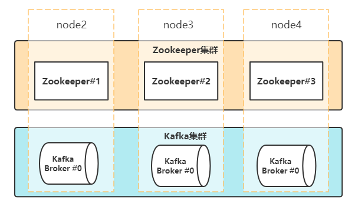

第三部分 Kafka集群与运维

# 1 集群应用场景

1. 消息传递

   Kafka可以很好地代替传统邮件代理。消息代理的使用有多种原因

2. 网站活动路由

3. 监控指标

4. 日志汇总

5. 流处理

6. 活动采集

7. 提交日志

# 2 集群搭建

1. 搭建设计

   

2. 分配三台Linux，用于安装又有三个节点的kafka集群。

   - node2(192.168.31.62)
   - node3(192.168.31.63)
   - node4(192.168.31.64)

   以上三台主机的/etc/hosts配置

   

## 2.1 Zookeeper集群搭建

## 2.2 Kafka集群搭建

# 3 集群监控

## 3.1 监控度量指标

## 3.2 监控工具 Kafka Eagle