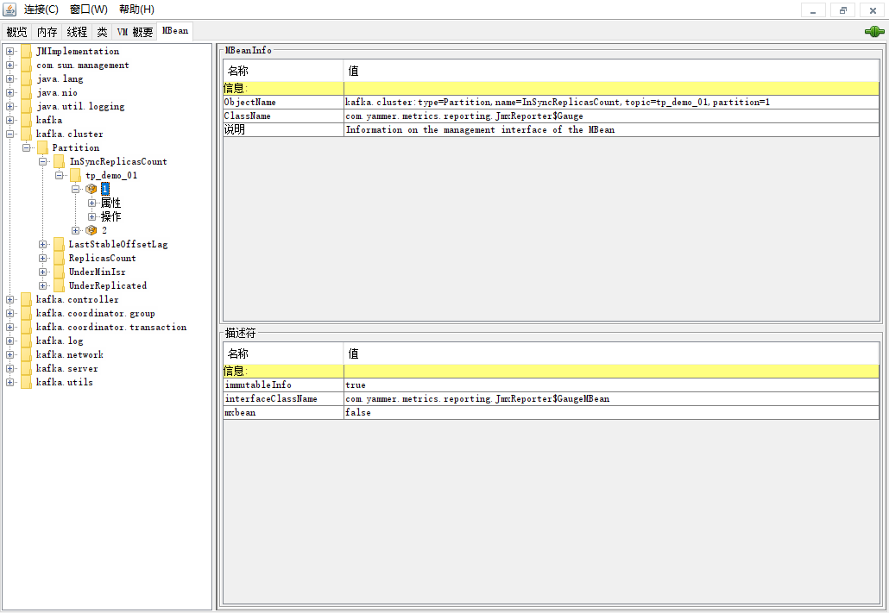

第三部分 Kafka集群与运维

# 1 集群应用场景

1. 消息传递

2. 网站活动路由

3. 监控指标

4. 日志汇总

5. 流处理

6. 活动采集

7. 提交日志

总结：

1. 横向扩展，提高Kafka的处理能力
2. 镜像、副本，提供高可用

# 2 集群搭建

1. 搭建设计

   

2. 分配三台Linux，用于安装又有三个节点的kafka集群。

   - node2(192.168.31.62)
   - node3(192.168.31.63)
   - node4(192.168.31.64)

   以上三台主机的/etc/hosts配置

   ```xml
   192.168.31.61 node1
   192.168.31.62 node2
   192.168.31.63 node3
   192.168.31.64 node4
   ```

## 2.1 Zookeeper集群搭建

1. Linux安装JDK，三台都安装

   ```shell
   [root@node2 ~]# rpm -ivh jdk-8u261-linux-x64.rpm
   
   [root@node2 ~]# vim /etc/profile
   # 文件最后添加两行
   export JAVA_HOME=/usr/java/jdk1.8.0_261-amd64
   export PATH=$PATH:$JAVA_HOME/bin
   
   # 环境变量生效
   [root@node2 ~]# . /etc/profile
   # 验证
   [root@node2 ~]# java -version
   java version "1.8.0_261"
   Java(TM) SE Runtime Environment (build 1.8.0_261-b12)
   Java HotSpot(TM) 64-Bit Server VM (build 25.261-b12, mixed mode)
   ```

2. 安装Zookeeper，三台都安装，搭建Zookeeper集群

   - node2配置

     ```shell
     # 解压到 /opt 目录
     [root@node2 ~]# tar -zxf zookeeper-3.4.14.tar.gz -C /opt
     # 配置
     [root@node2 ~]# cd /opt/zookeeper-3.4.14/conf/
     [root@node2 conf]# cp zoo_sample.cfg zoo.cfg
     
     dataDir=/var/turbo/zookeeper/data
     
     server.1=node2:2881:3881
     server.2=node3:2881:3881
     server.3=node4:2881:3881
     
     [root@node2 conf]# mkdir -p /var/turbo/zookeeper/data
     [root@node2 conf]# echo 1 > /var/turbo/zookeeper/data/myid
     
     # 环境变量
     [root@node2 conf]# vim /etc/profile
     
     export ZOOKEEPER_PREFIX=/opt/zookeeper-3.4.14
     export PATH=$PATH:$ZOOKEEPER_PREFIX/bin
     export ZOO_LOG_DIR=/var/turbo/zookeeper/log
     # 生效环境变量
     [root@node2 conf]#. /etc/profile
     
     [root@node2 ~]# scp -r /opt/zookeeper-3.4.14/ node3:/opt
     [root@node2 ~]# scp -r /opt/zookeeper-3.4.14/ node4:/opt
     ```

   - node3 配置

     ```shell
     # 配置环境变量
     [root@node3 ~]# vim /etc/profile
     
     export ZOOKEEPER_PREFIX=/opt/zookeeper-3.4.14
     export PATH=$PATH:$ZOOKEEPER_PREFIX/bin
     export ZOO_LOG_DIR=/var/turbo/zookeeper/log
     
     # 生效
     [root@node3 ~]# . /etc/profile
     
     [root@node3 conf]# mkdir -p /var/turbo/zookeeper/data
     [root@node3 conf]# echo 2 > /var/turbo/zookeeper/data/myid
     ```

   - node4 配置

     ```shell
     # 配置环境变量
     [root@node4 ~]# vim /etc/profile
     
     export ZOOKEEPER_PREFIX=/opt/zookeeper-3.4.14
     export PATH=$PATH:$ZOOKEEPER_PREFIX/bin
     export ZOO_LOG_DIR=/var/turbo/zookeeper/log
     
     # 生效
     [root@node4 ~]# . /etc/profile
     
     [root@node4 conf]# mkdir -p /var/turbo/zookeeper/data
     [root@node4 conf]# echo 3 > /var/turbo/zookeeper/data/myid
     ```

   - 启动zookeeper

     关闭防火墙

     ```
     systemctl stop firewalld
     systemctl disable firewalld.service
     ```

     

     ```shell
     # 在三台Linux上启动Zookeeper
     [root@node2 ~]# zkServer.sh start
     [root@node3 ~]# zkServer.sh start
     [root@node4 ~]# zkServer.sh start
     
     # 在三台Linux上查看Zookeeper的状态
     [root@node2 ~]# zkServer.sh status
     ZooKeeper JMX enabled by default
     Using config: /opt/zookeeper-3.4.14/bin/../conf/zoo.cfg
     Mode: follower
     
     [root@node3 ~]# zkServer.sh status
     ZooKeeper JMX enabled by default
     Using config: /opt/zookeeper-3.4.14/bin/../conf/zoo.cfg
     Mode: leader
     
     [root@node4 log]# zkServer.sh status
     ZooKeeper JMX enabled by default
     Using config: /opt/zookeeper-3.4.14/bin/../conf/zoo.cfg
     Mode: follower
     ```

     

## 2.2 Kafka集群搭建

安装Kafka

- 上传解压

  ```shell
  # 解压
  [root@node2 ~]# tar -zxf kafka_2.12-1.0.2.tgz -C /opt
  
  # 复制到node3和node4
  [root@node2 ~]# scp -r /opt/kafka_2.12-1.0.2/ node3:/opt
  [root@node2 ~]# scp -r /opt/kafka_2.12-1.0.2/ node4:/opt
  ```

- 配置kafka

  ```shell
  # 三台机器 配置环境变量
  vim /etc/profile
  
  # 添加以下内容
  export KAFKA_HOME=/opt/kafka_2.12-1.0.2
  export PATH=$PATH:$KAFKA_HOME/bin
  
  # 配置生效
  source /etc/profile
  
  
  # node2 配置
  [root@node2 ~]# vim /opt/kafka_2.12-1.0.2/config/server.properties
  
  broker.id=0
  listeners=PLAINTEXT://:9092
  advertised.listeners=PLAINTEXT://node2:9092 
  log.dirs=/var/turbo/kafka/kafka-logs
  zookeeper.connect=node2:2181,node3:2181,node4:2181/myKafka
  #其他使用默认配置
  
  # node3 配置
  [root@node3 ~]# vim /opt/kafka_2.12-1.0.2/config/server.properties
  
  broker.id=1
  listeners=PLAINTEXT://:9092
  advertised.listeners=PLAINTEXT://node3:9092 
  log.dirs=/var/turbo/kafka/kafka-logs
  zookeeper.connect=node2:2181,node3:2181,node4:2181/myKafka
  #其他使用默认配置
  
  
  # node4 配置
  [root@node4 ~]# vim /opt/kafka_2.12-1.0.2/config/server.properties
  
  broker.id=2
  listeners=PLAINTEXT://:9092
  advertised.listeners=PLAINTEXT://node4:9092 
  log.dirs=/var/turbo/kafka/kafka-logs
  zookeeper.connect=node2:2181,node3:2181,node4:2181/myKafka
  #其他使用默认配置
  
  ```

- 启动Kafka

  ```shell
  [root@node2 ~]# kafka-server-start.sh /opt/kafka_2.12-1.0.2/config/server.properties
  [root@node3 ~]# kafka-server-start.sh /opt/kafka_2.12-1.0.2/config/server.properties
  [root@node4 ~]# kafka-server-start.sh /opt/kafka_2.12-1.0.2/config/server.properties
  ```

  node2节点的Cluster ID：

  

  node3节点的Cluster ID：

  

  node4节点的Cluster ID：

  

- 验证Kafka

  1. Cluster ID是一个位移的不可变的标识符，用于唯一标志一个Kafka集群；
  2. 该Id最多可以有22个字符组成，字符对应于URL-safe Base64；
  3. Kafka 0.10.1版本之后的版本中，在集群第一次启动的时候，Broker从Zookeeper的<Kafka_ROOT>/cluster/id节点获取，如果该id不存在，就自动生成一个新的。

  ```shell
  zkCli.sh
  # 查看每个Broker的信息
  get /myKafka/brokers/ids/0
  get /myKafka/brokers/ids/1
  get /myKafka/brokers/ids/2
  ```

  

  

  node2节点在Zookeeper上的信息：

  

  node3节点在Zookeeper上的信息：

  

  node4节点在Zookeeper上的信息：

  

# 3 集群监控

## 3.1 监控度量指标

Kafka使用Yammer Metrics在服务器和Scala客户端中报告指标。Java客户端使用Kafka Metrics，它是一个内置的度量标准注册表。可最大程度地减少拉入客户端应用程序地传递依赖项。两者都通过JMX公开指标，并且可以配置为使用可插拔的统计报告统计信息，以连接到你的监视系统。

具体监控指标可以查看：[官方文档](http://kafka.apache.org/10/documentation.html#monitoring)。

### 3.1.1 JMX

#### 3.1.1.1 Kafka开启JMX端口

```shell
vim /opt/kafka_2.12-1.0.2/bin/kafka-server-start.sh
```


所有的kafka机器添加一个`JMX_PORRT`，并重启Kafka

#### 3.1.1.2 验证JMX开启

首先打印9581端口占用的进程信息，然后使用进程编号对应到Kafka的进程号。


### 3.1.2 使用JConsole连接JMX端口

win/mac，找到jconsole⼯具并打开，  在 `${JAVA_HOEM}/bin/`<br>Mac电脑可以直接命令⾏输⼊`jconsole`


创建主题

```shell
[root@node2 ~]# kafka-topics.sh --zookeeper node2:2181/myKafka --create --topic tp_demo_01 --partitions 3 --replication-factor 2
[root@node2 ~]# kafka-topics.sh --zookeeper node2:2181/myKafka --describe --topic tp_demo_01 
Topic:tp_demo_01	PartitionCount:3	ReplicationFactor:2	Configs:
	Topic: tp_demo_01	Partition: 0	Leader: 2	Replicas: 2,1	Isr: 2,1
	Topic: tp_demo_01	Partition: 1	Leader: 0	Replicas: 0,2	Isr: 0,2
	Topic: tp_demo_01	Partition: 2	Leader: 1	Replicas: 1,0	Isr: 1,0
```



详细的监控指标

详见官方文档：https://kafka.apache.org/10/documentation.html#monitoring

这里列出常用的：

**OS监控项**

**broker指标**

**producer以及topic指标**

**consumer指标**


### 3.1.3 编程手段来获取监控指标

查看要监控的指标：


代码实现：

```java
package com.turbo.kafka.demo;

import javax.management.*;
import javax.management.remote.JMXConnector;
import javax.management.remote.JMXConnectorFactory;
import javax.management.remote.JMXServiceURL;
import java.io.IOException;
import java.util.Iterator;
import java.util.Set;

public class JMXMonitorDemo {
    public static void main(String[] args) throws IOException,
            MalformedObjectNameException, AttributeNotFoundException, MBeanException, ReflectionException, InstanceNotFoundException {

        String jmxServiceURL = "service:jmx:rmi:///jndi/rmi://192.168.31.62:9581/jmxrmi";

        JMXServiceURL jmxURL = null;
        JMXConnector jmxc = null;
        MBeanServerConnection jmxs = null;
        ObjectName mbeanObjName = null;
        Iterator sampleIter = null;
        Set sampleSet = null;

        // 创建JMXServiceURL对象，参数是
        jmxURL = new JMXServiceURL(jmxServiceURL);
        // 建⽴到指定URL服务器的连接
        jmxc = JMXConnectorFactory.connect(jmxURL);
        // 返回代表远程MBean服务器的MBeanServerConnection对象
        jmxs = jmxc.getMBeanServerConnection();
        // 根据传⼊的字符串，创建ObjectName对象
//        mbeanObjName = new ObjectName("kafka.server:type=BrokerTopicMetrics,name=MessagesInPerSec");
//        mbeanObjName = new ObjectName("kafka.server:type=BrokerTopicMetrics,name=BytesInPerSec,topic=tp_eagle_01 ");
        mbeanObjName = new ObjectName("kafka.server:type=BrokerTopicMetrics,name=BytesInPerSec");
        // 获取指定ObjectName对应的MBeans
        sampleSet = jmxs.queryMBeans(null, mbeanObjName);
        // 迭代器
        sampleIter = sampleSet.iterator();

        if (sampleSet.isEmpty()) {

        } else {
            // 如果返回了，则打印信息
            while (sampleIter.hasNext()) {
                // Used to represent the object name of an MBean and its class name.
                // If the MBean is a Dynamic MBean the class name should be retrieved from the MBeanInfo it provides.
                // ⽤于表示MBean的ObjectName和ClassName
                ObjectInstance sampleObj = (ObjectInstance) sampleIter.next();
                ObjectName objectName = sampleObj.getObjectName();
                // 查看指定MBean指定属性的值
                String count = jmxs.getAttribute(objectName, "Count").toString();
                System.out.println(count);
            }
        }
        // 关闭
        jmxc.close();
    }
}
```


## 3.2 监控工具 Kafka Eagle

可以使用kafka-eagle管理kafka集群

核心模块：

- 面板可视化
- 主题管理
- 消费者应用
- 集群管理
- 集群监控
- 告警功能
- 系统管理


架构：

- 可视化
- 采集器
- 数据存储
- 监控
- 告警
- 权限管理


需要Kafka节点开启<font color=red>**JMX**</font>。参考上一节。

```
# 下载编译好的包
wget http://pkgs-linux.cvimer.com/kafka-eagle.zip 

# 配置kafka-eagle
unzip kafka-eagle.zip
cd kafka-eagle/kafka-eagle-web/target
mkdir -p test
cp kafka-eagle-web-2.0.1-bin.tar.gz test/ 
tar xf kafka-eagle-web-2.0.1-bin.tar.gz
cd kafka-eagle-web-2.0.1
```

/root/kafka-eagle/kafka-eagle-web/target/test/kafka-eagle-web-2.0.1/conf/system-config.properties

```properties
######################################
# multi zookeeper & kafka cluster list
######################################
# 集群的别名，用于在kafka-eagle中进行分区。
# 可以配置监控多个集群，别名用逗号隔开
# kafka.eagle.zk.cluster.alias=cluster1,cluster2,cluster3
kafka.eagle.zk.cluster.alias=cluster1

#cluster1.zk.list=10.1.201.17:2181,10.1.201.22:2181,10.1.201.23:2181
# 配置大哥前集群的zookeeper地址，需要与Kafka的server.properties中配置的zookeeper.connect的值一致
cluster1.zk.list=node2:2181,node3:2181,node4:2181/myKafka

#cluster2.zk.list=xdn10:2181,xdn11:2181,xdn12:2181

######################################
# zookeeper enable acl
######################################
cluster1.zk.acl.enable=false
cluster1.zk.acl.schema=digest
cluster1.zk.acl.username=test
cluster1.zk.acl.password=test123

######################################
# broker size online list
######################################
cluster1.kafka.eagle.broker.size=20

######################################
# zk client thread limit
# zookeeper 客户端连接数限制
######################################
kafka.zk.limit.size=25

######################################
# kafka eagle webui port
# kafka eagle 网页端口号
######################################
kafka.eagle.webui.port=8048

######################################
# kafka offset storage
# kafka 消费信息存储位置，用来兼容kafka低版本
######################################
cluster1.kafka.eagle.offset.storage=kafka
cluster2.kafka.eagle.offset.storage=zk

######################################
# kafka metrics, 15 days by default
######################################
kafka.eagle.metrics.charts=true
kafka.eagle.metrics.retain=15


######################################
# kafka sql topic records max
######################################
kafka.eagle.sql.topic.records.max=5000
kafka.eagle.sql.fix.error=true

######################################
# delete kafka topic token
# 管理员删除kafka中topic的口令
######################################
kafka.eagle.topic.token=keadmin

######################################
# kafka sasl authenticate
# kafka 集群是否开启了认证模式，此处是cluster1集群的配置，禁用
######################################
cluster1.kafka.eagle.sasl.enable=false
cluster1.kafka.eagle.sasl.protocol=SASL_PLAINTEXT
cluster1.kafka.eagle.sasl.mechanism=SCRAM-SHA-256
cluster1.kafka.eagle.sasl.jaas.config=org.apache.kafka.common.security.scram.ScramLoginModule required username="kafka" password="kafka-eagle";
cluster1.kafka.eagle.sasl.client.id=
cluster1.kafka.eagle.sasl.cgroup.enable=false
cluster1.kafka.eagle.sasl.cgroup.topics=

cluster2.kafka.eagle.sasl.enable=false
cluster2.kafka.eagle.sasl.protocol=SASL_PLAINTEXT
cluster2.kafka.eagle.sasl.mechanism=PLAIN
cluster2.kafka.eagle.sasl.jaas.config=org.apache.kafka.common.security.plain.PlainLoginModule required username="kafka" password="kafka-eagle";
cluster2.kafka.eagle.sasl.client.id=
cluster2.kafka.eagle.sasl.cgroup.enable=false
cluster2.kafka.eagle.sasl.cgroup.topics=

######################################
# kafka ssl authenticate
######################################
cluster3.kafka.eagle.ssl.enable=false
cluster3.kafka.eagle.ssl.protocol=SSL
cluster3.kafka.eagle.ssl.truststore.location=
cluster3.kafka.eagle.ssl.truststore.password=
cluster3.kafka.eagle.ssl.keystore.location=
cluster3.kafka.eagle.ssl.keystore.password=
cluster3.kafka.eagle.ssl.key.password=
cluster3.kafka.eagle.ssl.cgroup.enable=false
cluster3.kafka.eagle.ssl.cgroup.topics=

######################################
# kafka sqlite jdbc driver address
######################################
kafka.eagle.driver=org.sqlite.JDBC
kafka.eagle.url=jdbc:sqlite:/root/hadoop/kafka-eagle/db/ke.db
kafka.eagle.username=root
kafka.eagle.password=www.kafka-eagle.org

######################################
# kafka mysql jdbc driver address
######################################
#kafka.eagle.driver=com.mysql.jdbc.Driver
#kafka.eagle.url=jdbc:mysql://127.0.0.1:3306/ke?useUnicode=true&characterEncoding=UTF-8&zeroDateTimeBehavior=convertToNull
#kafka.eagle.username=root
#kafka.eagle.password=123456
```

配置环境变量：

```properties
export KE_HOME=/root/kafka-eagle/kafka-eagle-web/target/test/kafka-eagle-web-2.0.1
export PATH=$PATH:$KE_HOME/bin
```

```shell
# 创建Eagle的存储目录
mkdir -p /root/hadoop/kafka-eagle/db/ke.db
```

启动kafka-eagle

```
ke.sh start
```

会提示登陆地址和账号密码。


