第四部分 Kafka源码剖析

# 1 源码阅读环境搭建

首先下载源码：https://archive.apache.org/dist/kafka/1.0.2/kafka-1.0.2-src.tgz

gradle-4.8.1 下载地址：https://services.gradle.org/distributions/gradle-4.8.1-bin.zip

Scala-2.12.12 下载地址：https://downloads.lightbend.com/scala/2.12.12/scala-2.12.12.msi

## 1.1 安装Gradle

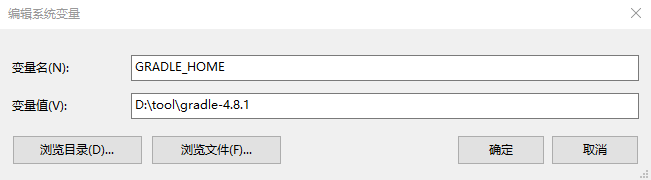

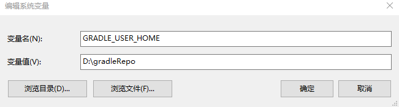

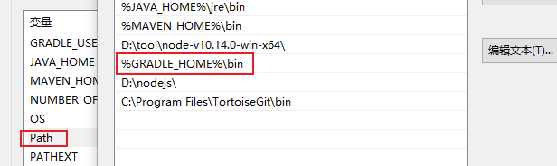

进入GRADLE_USER_HOME目录，添加init.gradle，配置gradle的源：

init.gradle内容

```json
allprojects {
    repositories {
        maven { url 'https://maven.aliyun.com/repository/public/' }
        maven { url 'https://maven.aliyun.com/nexus/content/repositories/google' }
        maven { url 'https://maven.aliyun.com/nexus/content/groups/public/' }
        maven { url 'https://maven.aliyun.com/nexus/content/repositories/jcenter'}

        all { ArtifactRepository repo ->
            if (repo instanceof MavenArtifactRepository) {
                def url = repo.url.toString()

                if (url.startsWith('https://repo.maven.apache.org/maven2/') || url.startsWith('https://repo.maven.org/maven2') || url.startsWith('https://repo1.maven.org/maven2') || url.startsWith('https://jcenter.bintray.com/')) {
                    //project.logger.lifecycle "Repository ${repo.url} replaced by $REPOSITORY_URL."
                    remove repo
                }
            }
        }
    }

    buildscript {

        repositories {

            maven { url 'https://maven.aliyun.com/repository/public/'}
            maven { url 'https://maven.aliyun.com/nexus/content/repositories/google' }
            maven { url 'https://maven.aliyun.com/nexus/content/groups/public/' }
            maven { url 'https://maven.aliyun.com/nexus/content/repositories/jcenter'}
            all { ArtifactRepository repo ->
                if (repo instanceof MavenArtifactRepository) {
                    def url = repo.url.toString()
                    if (url.startsWith('https://repo1.maven.org/maven2') || url.startsWith('https://jcenter.bintray.com/')) {
                        //project.logger.lifecycle "Repository ${repo.url} replaced by $REPOSITORY_URL."
                        remove repo
                    }
                }
            }
        }
    }
}
```

保存并退出，打开cmd，运行：

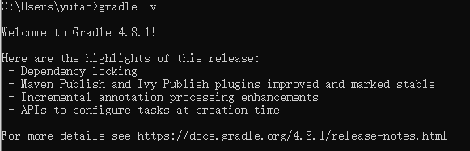

设置成功。


## 1.2 Scala安装和配置

双击安装

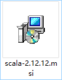

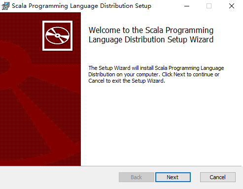

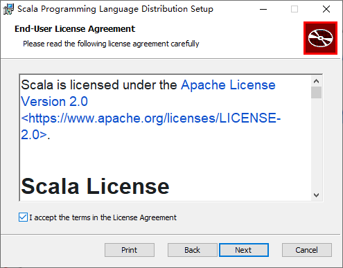


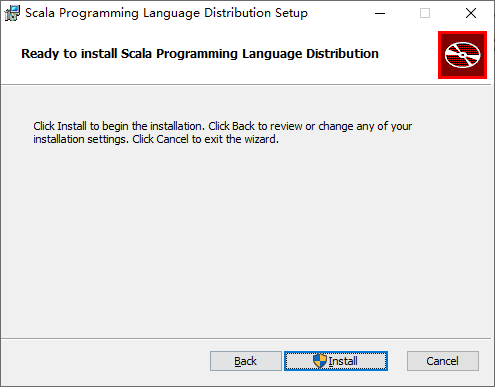

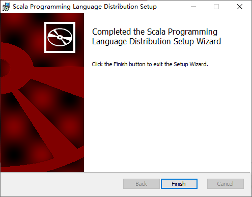

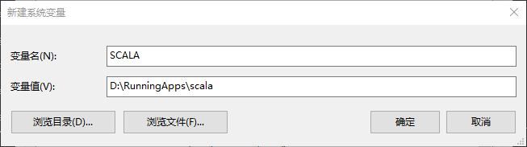

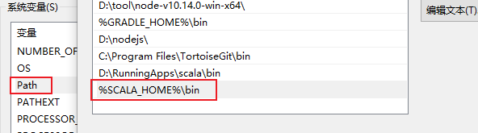

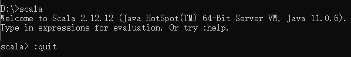

## 1.3 Idea配置

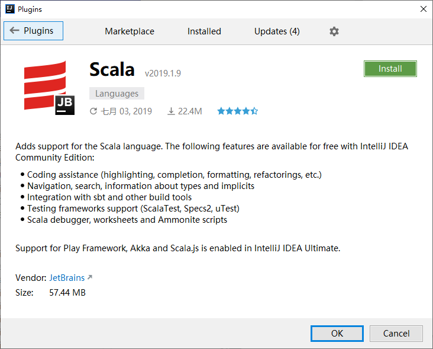

## 1.4 源码操作

解压源码

打开cmd ，进入源码根目录，执行：gradle

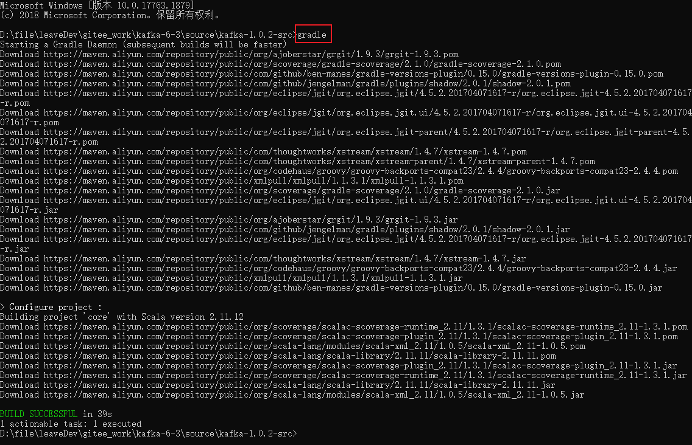

结束后，执行 gradle idea（注意不要使用生成的gradlew.bat执行操作）。

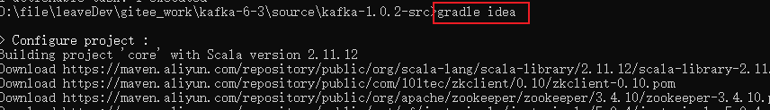

idea导入源码：

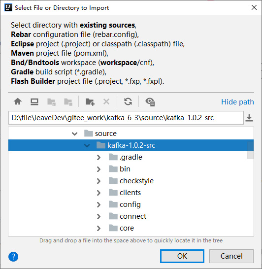

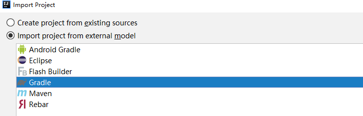

在Idea中配置gradle user home和gradle home，否则会重新开始下载gradle -4.8。

# 2 Broker启动流程


# 3 Topic创建流程

## 3.1 Topic创建

有两种创建方式：自动创建、手动创建。在server.properties中配置`auto.create.topics.enable=true`时，Kafka在发现该topic不存在的时候会按照默认配置自动创建topic，触发自动创建topic有以下两种情况：

1. Producer向某个不存在的Topic写入消息
2. Consumer从某个不存在的Topic读取消息

## 3.2 手动创建

当`auto.create.topics.enable=false`时，需要手动创建topic，否则消息会发送失败。手动创建topic的方式如下：

```shell
kafka-topics.sh --create --zookeeper localhost:2181 --replication-factor 1 --partitions 10 --topic kafka_test
```

--replication-factor：副本数目

--partitions：分区数

--topic：topic名字

## 3.3 查看Topic入口

查看脚本文件`kafka-topics.sh`

```sh
exec $(dirname $0)/kafka-run-class.sh kafka.admin.TopicCommand "$@"
```

最终还是调用的`TopicCommand`类：首先判断参数是否为空，并且create、list、alter、describe、delete只允许存在一个，进行参数验证，创建`zookeeper`连接，如果参数中包含`create`则开始创建topic，其他情况类似。

```scala
// kafka.admin.TopicCommand#main
def main(args: Array[String]): Unit = {

    // 负责解析参数
    val opts = new TopicCommandOptions(args)

    if(args.length == 0)
      CommandLineUtils.printUsageAndDie(opts.parser, "Create, delete, describe, or change a topic.")

    // should have exactly one action
    val actions = Seq(opts.createOpt, opts.listOpt, opts.alterOpt, opts.describeOpt, opts.deleteOpt).count(opts.options.has _)
    if(actions != 1)
      CommandLineUtils.printUsageAndDie(opts.parser, "Command must include exactly one action: --list, --describe, --create, --alter or --delete")

    opts.checkArgs()

    val zkUtils = ZkUtils(opts.options.valueOf(opts.zkConnectOpt),
                          30000,
                          30000,
                          JaasUtils.isZkSecurityEnabled())
    var exitCode = 0
    try {
      if(opts.options.has(opts.createOpt))
        // 创建topic
        createTopic(zkUtils, opts)
      else if(opts.options.has(opts.alterOpt))
        alterTopic(zkUtils, opts)
      else if(opts.options.has(opts.listOpt))
        listTopics(zkUtils, opts)
      else if(opts.options.has(opts.describeOpt))
        describeTopic(zkUtils, opts)
      else if(opts.options.has(opts.deleteOpt))
        deleteTopic(zkUtils, opts)
    } catch {
      case e: Throwable =>
        println("Error while executing topic command : " + e.getMessage)
        error(Utils.stackTrace(e))
        exitCode = 1
    } finally {
      zkUtils.close()
      Exit.exit(exitCode)
    }

  }
```


## 3.4 创建Topic

下面主要看一下`createTopic`的执行过程：

```scala
// kafka.admin.TopicCommand#createTopic
def createTopic(zkUtils: ZkUtils, opts: TopicCommandOptions) {
    // 获取参数中指定的主题名称
    val topic = opts.options.valueOf(opts.topicOpt)
    // 获取参数中给当前要创建的主题指定的参数 --config max.message.bytes = 1048576 --config segment.bytes=104857600
    val configs = parseTopicConfigsToBeAdded(opts)
    // --if-not-exists选项，判断有无该选项
    val ifNotExists = opts.options.has(opts.ifNotExistsOpt)
    if (Topic.hasCollisionChars(topic))
      println("WARNING: Due to limitations in metric names, topics with a period ('.') or underscore ('_') could collide. To avoid issues it is best to use either, but not both.")
    try {
      // 看有没有手动指定当前要创建的主题副本分区的分配
      if (opts.options.has(opts.replicaAssignmentOpt)) {
        // 解析用户手动指定的副本分区分配，
        val assignment = parseReplicaAssignment(opts.options.valueOf(opts.replicaAssignmentOpt))
        // 将该副本分区的分配写到zookeeper中
        AdminUtils.createOrUpdateTopicPartitionAssignmentPathInZK(zkUtils, topic, assignment, configs, update = false)
      } else {
        // 检查有没有指定必要的参数：解析器，选项，分区个数，副本因子
        CommandLineUtils.checkRequiredArgs(opts.parser, opts.options, opts.partitionsOpt, opts.replicationFactorOpt)
        // 从选项中获取分区个数
        val partitions = opts.options.valueOf(opts.partitionsOpt).intValue
        // 获取分区副本因子
        val replicas = opts.options.valueOf(opts.replicationFactorOpt).intValue
        // 是否机架敏感的
        val rackAwareMode = if (opts.options.has(opts.disableRackAware)) RackAwareMode.Disabled
                            else RackAwareMode.Enforced
        // 创建主题
        AdminUtils.createTopic(zkUtils, topic, partitions, replicas, configs, rackAwareMode)
      }
      println("Created topic \"%s\".".format(topic))
    } catch  {
      case e: TopicExistsException => if (!ifNotExists) throw e
    }
  }
```

1. 如果客户端指定了topic的partition的replicas分配情况，则直接把所有topic的元数据信息持久化写入zookeeper，topic的properties写入到`/<Kafka_ROOT>/config/topics/[topic]`目录，topic的PartitionAssignment写入`<kafka_root>/brokers/topics/[topic]/partitions/[partition]/state`目录。

2. 根据分区数量、副本集、是否指定机架来自动生成topic分区数据

3. 下面继续来看`AdminUtils.createTopic`方法

   ```scala
   def createTopic(zkUtils: ZkUtils,
                     topic: String,
                     partitions: Int,
                     replicationFactor: Int,
                     topicConfig: Properties = new Properties,
                     rackAwareMode: RackAwareMode = RackAwareMode.Enforced) {
       // 获取broker元数据
       val brokerMetadatas = getBrokerMetadatas(zkUtils, rackAwareMode)
       // 将副本分区分配给broker
       val replicaAssignment = AdminUtils.assignReplicasToBrokers(brokerMetadatas, partitions, replicationFactor)
       // 将主题的分区分配情况xi写到zookeeper中
       AdminUtils.createOrUpdateTopicPartitionAssignmentPathInZK(zkUtils, topic, replicaAssignment, topicConfig)
       // 到此创建主题的过程结束
     }
   ```

4. 继续看`AdminUtils.assignReplicasToBrokers`方法

# 4 Producer生产者流程

## 4.1 Producer示例

下面代码展示`KafkaProducer`的使用方法，在下面示例中，使用`KafkaProducer`实现向Kafka发送消息的功能。

```java
public class MyProducer3 {
    public static void main(String[] args) throws InterruptedException {

        Properties props = new Properties();
        // 客户端id
        props.put(ProducerConfig.CLIENT_ID_CONFIG,"kafkaProducerDemo");
        // kafka地址，列表格式为host1:port1,host2:port2,…，
        // ⽆需添加所有的集群地址，kafka会根据 提供的地址发现其他的地址（建议多提供⼏个，以防提供的服务器关闭）
        props.put(ProducerConfig.BOOTSTRAP_SERVERS_CONFIG,"node1:9092");
        // 发送返回应答⽅式
        // 0:Producer 往集群发送数据不需要等到集群的返回，不确保消息发送成功。安全性最低但是效率最 ⾼。
        // 1:Producer 往集群发送数据只要 Leader 应答就可以发送下⼀条，只确保Leader接收成功。
        // -1或者all：Producer 往集群发送数据需要所有的ISR Follower都完成从Leader的同步才会发送下⼀条，
        // 确保Leader发送成功和所有的副本都成功接收。安全性最⾼，但是效率最低。
        props.put(ProducerConfig.ACKS_CONFIG,"all");
        // 重试次数
        props.put("retries",0);
        // 重试间隔时间
        props.put(ProducerConfig.RETRY_BACKOFF_MS_CONFIG,0);
        // 批量发送的⼤⼩
        props.put(ProducerConfig.BATCH_SIZE_CONFIG,16384);
        // ⼀个Batch被创建之后，最多过多久，不管这个Batch有没有写满，都必须发送出去
        props.put(ProducerConfig.LINGER_MS_CONFIG,10);
        // 缓冲区⼤⼩
        props.put(ProducerConfig.BUFFER_MEMORY_CONFIG,33554432);
        // key序列化⽅式
        props.put(ProducerConfig.KEY_SERIALIZER_CLASS_CONFIG, StringSerializer.class);
        // value序列化⽅式
        props.put(ProducerConfig.VALUE_SERIALIZER_CLASS_CONFIG,StringSerializer.class);
        // topic
        String topic = "turbine_grp";

        Producer<String,String> producer = new KafkaProducer<String, String>(props);
        AtomicInteger count = new AtomicInteger();
        while (true){
            int num = count.get();
            String key = Integer.toString(num);
            String value = Integer.toString(num);
            ProducerRecord<String,String> record = new ProducerRecord<>(topic,key,value);
            if(num%2==0){
                // 偶数异步发送
                // 第一个参数record封装了topic、key、value
                // 第二个参数是一个callback对象，当生产者收到kafka发来的ACK确认消息时，会调用此CallBack对象的onComplete方法
                producer.send(record,(recordMetadata,e)->{
                    System.out.println("num:"+num
                                +"\t topic:"+recordMetadata.topic()
                                +"\t offset:"+recordMetadata.offset());
                });
            }else {
                // 同步发送
                // KafkaProducer.send方法返回的类型是Future<RecordMetadata>，通过get方法阻塞当前线程，等待Kafka服务端ack响应
                final RecordMetadata recordMetadata = producer.send(record).get();
            }
            count.incrementAndGet();
            TimeUnit.MILLISECONDS.sleep(100);
        }
    }
}
```

### 4.1.1 同步发送

1. KafkaProducer.send方法返回的类型是Future<RecordMetadata_>，通过get方法阻塞当前线程，等待Kafka服务端ACK响应。

   ```java
   producer.send(record).get();
   ```

### 4.1.2 异步发送

1. 第一个参数record封装了topic、key、value
2. 第二个参数是一个callback对象，当生产者收到kafka发来的ACK确认消息时，会调用此CallBack对象的onComplete方法

```java
producer.send(record,(recordMetadata,e)->{
                    System.out.println("num:"+num
                                +"\t topic:"+recordMetadata.topic()
                                +"\t offset:"+recordMetadata.offset());
                });
```

## 4.2 KafkaProducer实例化

了解`KafkaProducer`的基本使用，开始深入了解KafkaProducer原理和实现，先看一下构造方法核心逻辑

org.apache.kafka.clients.producer.KafkaProducer#KafkaProducer(org.apache.kafka.clients.producer.ProducerConfig, org.apache.kafka.common.serialization.Serializer<K>, org.apache.kafka.common.serialization.Serializer<V>)

## 4.3 消息发送过程

### 4.3.1 拦截器

### 4.3.2 拦截器核心逻辑

### 4.3.3 发送五步骤

### 4.3.4 MetaData更新机制

# 5 Consumer消费者流程

## 5.1 Consumer示例

KafkaConsumer

消费者的根本目的是从Kafka服务端拉取消息，并交给业务逻辑进行处理。

开发人员不必关心与Kafka服务端之间网络连接的管理、心跳检测、请求超时重试等底层操作，也不必关心订阅Topic的分区数量、分区Leader副本的网络拓扑以及消费组的Rebalance等细节，另外还提供了自动提交offset的功能。

```java
public class MyConsumer3 {
    public static void main(String[] args) throws InterruptedException {
        // 是否⾃动提交
        Boolean autoCommit = false;
        // 是否异步提交
        Boolean isSync = true;
        Properties props = new Properties();
        // kafka地址,列表格式为host1:port1,host2:port2,…，⽆需添加所有的集群地址，kafka会根据 提供的地址发现其他的地址（建议多提供⼏个，以防提供的服务器关闭）
        props.put("bootstrap.servers", "localhost:9092");
        // 消费组
        props.put("group.id", "test");
        // 开启⾃动提交offset
        props.put("enable.auto.commit", autoCommit.toString());
        // 1s⾃动提交
        props.put("auto.commit.interval.ms", "1000");
        // 消费者和群组协调器的最⼤⼼跳时间，如果超过该时间则认为该消费者已经死亡或者故障，需要踢出 消费者组
        props.put("session.timeout.ms", "60000");
        // ⼀次poll间隔最⼤时间
        props.put("max.poll.interval.ms", "1000");
        // 当消费者读取偏移量⽆效的情况下，需要重置消费起始位置，默认为latest（从消费者启动后⽣成的 记录），另外⼀个选项值是 earliest，将从有效的最⼩位移位置开始消费
        props.put("auto.offset.reset", "latest");
        // consumer端⼀次拉取数据的最⼤字节数
        props.put("fetch.max.bytes", "1024000");
        // key序列化⽅式
        props.put("key.deserializer",
                "org.apache.kafka.common.serialization.StringDeserializer");
        // value序列化⽅式
        props.put("value.deserializer",
                "org.apache.kafka.common.serialization.StringDeserializer");

        KafkaConsumer<String, String> consumer = new KafkaConsumer<>(props);
        String topic = "turbine_grp";
        // 订阅topic列表
        consumer.subscribe(Arrays.asList(topic));
        while (true) {
            // 消息拉取
            ConsumerRecords<String, String> records = consumer.poll(100);

            for (ConsumerRecord<String, String> record : records) {
                    System.out.printf("offset = %d, key = %s, value = %s%n",
                            record.offset(), record.key(), record.value());
            }
            if (!autoCommit) {
                if (isSync) {
                    // 处理完成单次消息以后，提交当前的offset，如果失败会⼀直重试直⾄成功
                    consumer.commitSync();
                } else {
                    // 异步提交
                    consumer.commitAsync((offsets, exception) -> {
                        exception.printStackTrace();
                        System.out.println(offsets.size());
                    });
                }
            }
            TimeUnit.SECONDS.sleep(3);
        }
    }
}
```


## 5.2 KafkaConsumer实例化

了解了`KafkaConsumer`的基本使用，开始深入了解`KafkaConsumer`原理和实现，先看一下构造方法核心逻辑：

```java
org.apache.kafka.clients.consumer.KafkaConsumer#KafkaConsumer(org.apache.kafka.clients.consumer.ConsumerConfig, org.apache.kafka.common.serialization.Deserializer<K>, org.apache.kafka.common.serialization.Deserializer<V>)
```


```java
private KafkaConsumer(ConsumerConfig config,
                          Deserializer<K> keyDeserializer,
                          Deserializer<V> valueDeserializer) {
        try {
            // 获取客户端id，如果没有设置，则生成一个
            String clientId = config.getString(ConsumerConfig.CLIENT_ID_CONFIG);
            if (clientId.isEmpty())
                clientId = "consumer-" + CONSUMER_CLIENT_ID_SEQUENCE.getAndIncrement();
            this.clientId = clientId;
            // 获取消费组id
            String groupId = config.getString(ConsumerConfig.GROUP_ID_CONFIG);

            LogContext logContext = new LogContext("[Consumer clientId=" + clientId + ", groupId=" + groupId + "] ");
            this.log = logContext.logger(getClass());

            log.debug("Initializing the Kafka consumer");
            this.requestTimeoutMs = config.getInt(ConsumerConfig.REQUEST_TIMEOUT_MS_CONFIG);
            int sessionTimeOutMs = config.getInt(ConsumerConfig.SESSION_TIMEOUT_MS_CONFIG);
            int fetchMaxWaitMs = config.getInt(ConsumerConfig.FETCH_MAX_WAIT_MS_CONFIG);
            if (this.requestTimeoutMs <= sessionTimeOutMs || this.requestTimeoutMs <= fetchMaxWaitMs)
                throw new ConfigException(ConsumerConfig.REQUEST_TIMEOUT_MS_CONFIG + " should be greater than " + ConsumerConfig.SESSION_TIMEOUT_MS_CONFIG + " and " + ConsumerConfig.FETCH_MAX_WAIT_MS_CONFIG);
            this.time = Time.SYSTEM;

            Map<String, String> metricsTags = Collections.singletonMap("client-id", clientId);
            MetricConfig metricConfig = new MetricConfig().samples(config.getInt(ConsumerConfig.METRICS_NUM_SAMPLES_CONFIG))
                    .timeWindow(config.getLong(ConsumerConfig.METRICS_SAMPLE_WINDOW_MS_CONFIG), TimeUnit.MILLISECONDS)
                    .recordLevel(Sensor.RecordingLevel.forName(config.getString(ConsumerConfig.METRICS_RECORDING_LEVEL_CONFIG)))
                    .tags(metricsTags);
            List<MetricsReporter> reporters = config.getConfiguredInstances(ConsumerConfig.METRIC_REPORTER_CLASSES_CONFIG,
                    MetricsReporter.class);
            reporters.add(new JmxReporter(JMX_PREFIX));
            this.metrics = new Metrics(metricConfig, reporters, time);
            this.retryBackoffMs = config.getLong(ConsumerConfig.RETRY_BACKOFF_MS_CONFIG);

            // load interceptors and make sure they get clientId
            // 获取用户设置的参数
            Map<String, Object> userProvidedConfigs = config.originals();
            // 设置客户端id
            userProvidedConfigs.put(ConsumerConfig.CLIENT_ID_CONFIG, clientId);
            // 设置拦截器
            List<ConsumerInterceptor<K, V>> interceptorList = (List) (new ConsumerConfig(userProvidedConfigs, false)).getConfiguredInstances(ConsumerConfig.INTERCEPTOR_CLASSES_CONFIG,
                    ConsumerInterceptor.class);
            // 如果没有设置拦截器，就是null，否则设置拦截器
            this.interceptors = interceptorList.isEmpty() ? null : new ConsumerInterceptors<>(interceptorList);
            // key的反序列化
            if (keyDeserializer == null) {
                this.keyDeserializer = config.getConfiguredInstance(ConsumerConfig.KEY_DESERIALIZER_CLASS_CONFIG,
                        Deserializer.class);
                this.keyDeserializer.configure(config.originals(), true);
            } else {
                config.ignore(ConsumerConfig.KEY_DESERIALIZER_CLASS_CONFIG);
                this.keyDeserializer = keyDeserializer;
            }
            // value的反序列化
            if (valueDeserializer == null) {
                this.valueDeserializer = config.getConfiguredInstance(ConsumerConfig.VALUE_DESERIALIZER_CLASS_CONFIG,
                        Deserializer.class);
                this.valueDeserializer.configure(config.originals(), false);
            } else {
                config.ignore(ConsumerConfig.VALUE_DESERIALIZER_CLASS_CONFIG);
                this.valueDeserializer = valueDeserializer;
            }
            ClusterResourceListeners clusterResourceListeners = configureClusterResourceListeners(keyDeserializer, valueDeserializer, reporters, interceptorList);
            this.metadata = new Metadata(retryBackoffMs, config.getLong(ConsumerConfig.METADATA_MAX_AGE_CONFIG),
                    true, false, clusterResourceListeners);
            List<InetSocketAddress> addresses = ClientUtils.parseAndValidateAddresses(config.getList(ConsumerConfig.BOOTSTRAP_SERVERS_CONFIG));
            // 更新集群元数据
            this.metadata.update(Cluster.bootstrap(addresses), Collections.<String>emptySet(), 0);
            String metricGrpPrefix = "consumer";
            ConsumerMetrics metricsRegistry = new ConsumerMetrics(metricsTags.keySet(), "consumer");
            // 创建Channel的构建起
            ChannelBuilder channelBuilder = ClientUtils.createChannelBuilder(config);

            // 设置隔离级别
            IsolationLevel isolationLevel = IsolationLevel.valueOf(
                    config.getString(ConsumerConfig.ISOLATION_LEVEL_CONFIG).toUpperCase(Locale.ROOT));
            Sensor throttleTimeSensor = Fetcher.throttleTimeSensor(metrics, metricsRegistry.fetcherMetrics);

            // 实例化网络客户端
            NetworkClient netClient = new NetworkClient(
                    new Selector(config.getLong(ConsumerConfig.CONNECTIONS_MAX_IDLE_MS_CONFIG), metrics, time, metricGrpPrefix, channelBuilder, logContext),
                    this.metadata,
                    clientId,
                    100, // a fixed large enough value will suffice for max in-flight requests
                    config.getLong(ConsumerConfig.RECONNECT_BACKOFF_MS_CONFIG),
                    config.getLong(ConsumerConfig.RECONNECT_BACKOFF_MAX_MS_CONFIG),
                    config.getInt(ConsumerConfig.SEND_BUFFER_CONFIG),
                    config.getInt(ConsumerConfig.RECEIVE_BUFFER_CONFIG),
                    config.getInt(ConsumerConfig.REQUEST_TIMEOUT_MS_CONFIG),
                    time,
                    true,
                    new ApiVersions(),
                    throttleTimeSensor,
                    logContext);
            // 实例化消费者网络客户端
            this.client = new ConsumerNetworkClient(
                    logContext,
                    netClient,
                    metadata,
                    time,
                    retryBackoffMs,
                    config.getInt(ConsumerConfig.REQUEST_TIMEOUT_MS_CONFIG));
            OffsetResetStrategy offsetResetStrategy = OffsetResetStrategy.valueOf(config.getString(ConsumerConfig.AUTO_OFFSET_RESET_CONFIG).toUpperCase(Locale.ROOT));
            // 创建订阅的对象，用于封装订阅信息
            this.subscriptions = new SubscriptionState(offsetResetStrategy);
            // 消费组和主题分区分配器
            this.assignors = config.getConfiguredInstances(
                    ConsumerConfig.PARTITION_ASSIGNMENT_STRATEGY_CONFIG,
                    PartitionAssignor.class);
            // 协调器，协调再平衡的协调器
            this.coordinator = new ConsumerCoordinator(logContext,
                    this.client,
                    groupId,
                    config.getInt(ConsumerConfig.MAX_POLL_INTERVAL_MS_CONFIG),
                    config.getInt(ConsumerConfig.SESSION_TIMEOUT_MS_CONFIG),
                    config.getInt(ConsumerConfig.HEARTBEAT_INTERVAL_MS_CONFIG),
                    assignors,
                    this.metadata,
                    this.subscriptions,
                    metrics,
                    metricGrpPrefix,
                    this.time,
                    retryBackoffMs,
                    config.getBoolean(ConsumerConfig.ENABLE_AUTO_COMMIT_CONFIG),
                    config.getInt(ConsumerConfig.AUTO_COMMIT_INTERVAL_MS_CONFIG),
                    this.interceptors,
                    config.getBoolean(ConsumerConfig.EXCLUDE_INTERNAL_TOPICS_CONFIG),
                    config.getBoolean(ConsumerConfig.LEAVE_GROUP_ON_CLOSE_CONFIG));
            // 通过网络获取消息的对象
            this.fetcher = new Fetcher<>(
                    logContext,
                    this.client,
                    config.getInt(ConsumerConfig.FETCH_MIN_BYTES_CONFIG),
                    config.getInt(ConsumerConfig.FETCH_MAX_BYTES_CONFIG),
                    config.getInt(ConsumerConfig.FETCH_MAX_WAIT_MS_CONFIG),
                    config.getInt(ConsumerConfig.MAX_PARTITION_FETCH_BYTES_CONFIG),
                    config.getInt(ConsumerConfig.MAX_POLL_RECORDS_CONFIG),
                    config.getBoolean(ConsumerConfig.CHECK_CRCS_CONFIG),
                    this.keyDeserializer,
                    this.valueDeserializer,
                    this.metadata,
                    this.subscriptions,
                    metrics,
                    metricsRegistry.fetcherMetrics,
                    this.time,
                    this.retryBackoffMs,
                    isolationLevel);

            config.logUnused();
            AppInfoParser.registerAppInfo(JMX_PREFIX, clientId, metrics);

            log.debug("Kafka consumer initialized");
        } catch (Throwable t) {
            // call close methods if internal objects are already constructed
            // this is to prevent resource leak. see KAFKA-2121
            close(0, true);
            // now propagate the exception
            throw new KafkaException("Failed to construct kafka consumer", t);
        }
    }
```

1. 初始化参数配置

   client.id、group.id、消费者拦截器、key/value序列化、事务隔离级别

2. 初始化网络客户端`NetworkClient`

3. 初始化消费者网络客户端`ConsumerNetworkClient`

4. 初始化offset提交策略，默认自动提交

5. 初始化消费者协调器`ConsumerCoordinator`

6. 初始化拉取器`Fetcher`

## 5.3 订阅Topic

下面先看一下subscribe方法都有哪些逻辑：

```java
public void subscribe(Collection<String> topics, ConsumerRebalanceListener listener) {
    // 轻量级锁
    acquireAndEnsureOpen();
    try {
        if (topics == null) {
            throw new IllegalArgumentException("Topic collection to subscribe to cannot be null");
        } else if (topics.isEmpty()) {
            // topic为空，则开始取消订阅的逻辑
            // treat subscribing to empty topic list as the same as unsubscribing
            this.unsubscribe();
        } else {
            // topic合法性判断，包含null或者空字符串直接抛异常
            for (String topic : topics) {
                if (topic == null || topic.trim().isEmpty())
                    throw new IllegalArgumentException("Topic collection to subscribe to cannot contain null or empty topic");
            }
			// 如果没有消费协调者直接抛异常
            throwIfNoAssignorsConfigured();
            log.debug("Subscribed to topic(s): {}", Utils.join(topics, ", "));
            // 开始订阅
            this.subscriptions.subscribe(new HashSet<>(topics), listener);
            // 更新元数据，如果metadata当前不包括所有的topics则标记更新
            metadata.setTopics(subscriptions.groupSubscription());
        }
    } finally {
        release();
    }
}
```

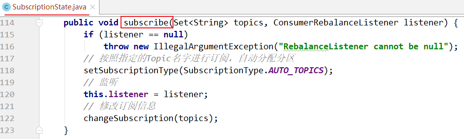

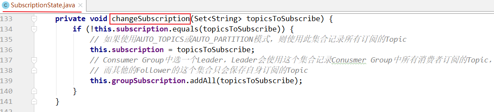

1. KafkaConsumer不是线程安全类，开启轻量级锁，topics为空抛异常，topics是空集合开始取消订阅，再次判断topics集合中是否有非法数据，判断消费者协调者是否为空。开始订阅对应topic。listener默认为`NoOpConsumerRebalanceListener`，一个空操作

   > 轻量级锁：分别记录了当前使用KafkaConsumer的线程id和重入次数，KafkaConsumer的acquire()和release()方法实现了一个"轻量级锁"，它并非真正的锁，紧时检测是否有多线程并发操作KafkaConsumer而已。

2. 每一个KafkaConsumer实例内部都拥有一个`SubscriptionState`对象，subscribe内部调用了subscribe方法，subscribe方法订阅信息记录到`SubscriptionState`，多次订阅会覆盖旧数据。

3. 更新metadata，判断如果metadata中不包含当前`groupSubscription`，开始标记更新（后面会有更新的逻辑，并且消费者侧的topic不会过期）


## 5.4 消息消费过程

### 5.4.1 poll


### 5.4.2 pollOnce

#### 5.4.2.1 coordinator.poll()


#### 5.4.2.2 updateFetchPositions()


#### 5.4.2.3 fetcher.fetchdRecords()


#### 5.4.2.4 fetcher.sendFecthes()


#### 5.4.2.5 client.poll()


#### 5.4.2.6 coordinator.needRejoin()


## 5.5 自动提交


## 5.6 手动提交


### 5.6.1 同步提交


### 5.6.2 异步提交


# 6 消息存储机制

log.dirs/<topic_name>-<partition_no>/{.index, .timeindex, .log}

首先查看Kafka如何处理产生的消息：

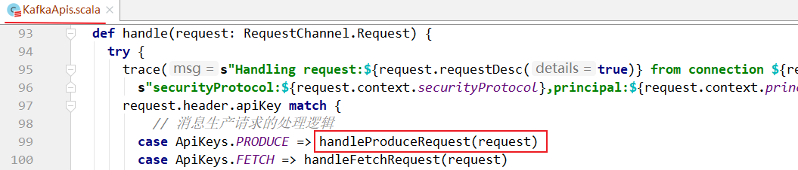

调用副本管理器，将记录追加到分区的副本中。

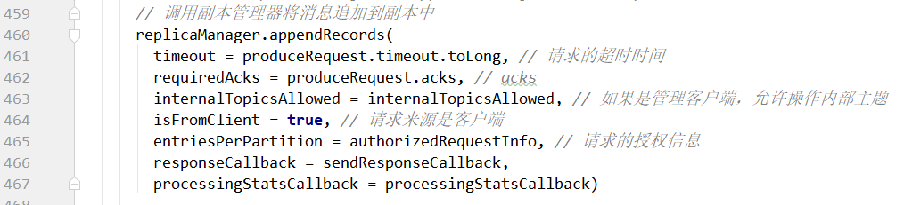

将数据追加到本地Log日志中：

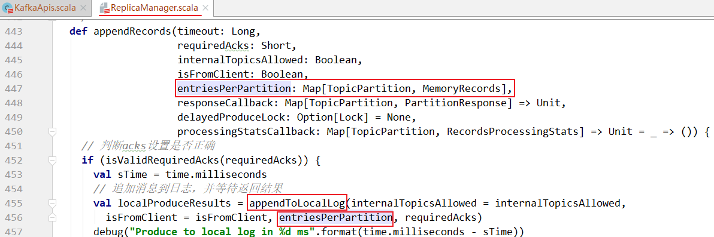

追加消息的实现：

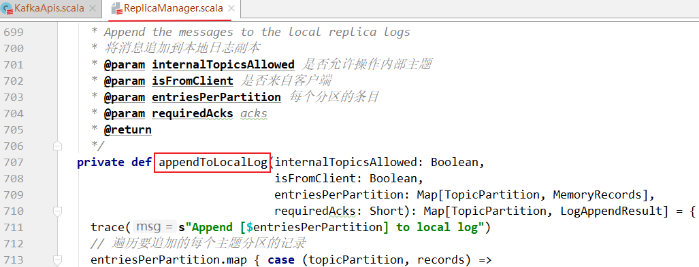

遍历需要追加的每个主题分区的消息：

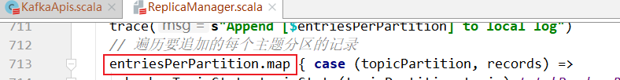

调用partition的方法将记录追加到该分区的leader分区中：

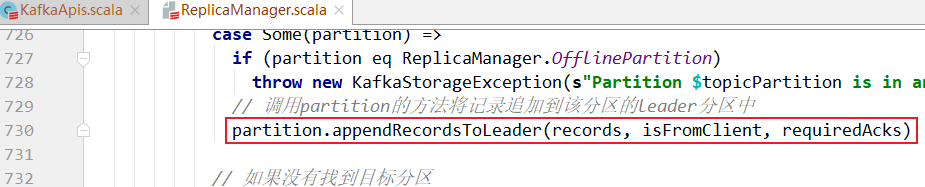

如果在本地找到了该分区的Leader：

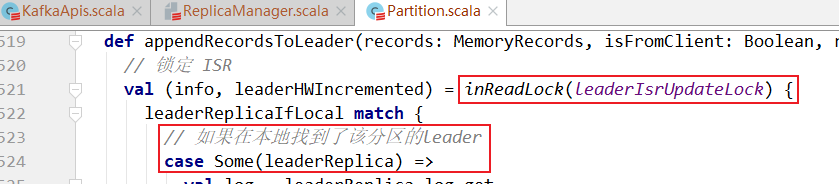

执行下述逻辑将消息追加到leader分区：

```scala
// 获取该分区的log
val log = leaderReplica.log.get
// 获取最小ISR副本数
val minIsr = log.config.minInSyncReplicas
// 计算同步副本的个数
val inSyncSize = inSyncReplicas.size

// Avoid writing to leader if there are not enough insync replicas to make it safe
// 如果同步副本的个数小于要求的最小副本数，并且acks设置的是-1，则不追加消息
if (inSyncSize < minIsr && requiredAcks == -1) {
    throw new NotEnoughReplicasException("Number of insync replicas for partition %s is [%d], below required minimum [%d]"
              .format(topicPartition, inSyncSize, minIsr))
}

// 追加消息到leader
val info = log.appendAsLeader(records, leaderEpoch = this.leaderEpoch, isFromClient)
// probably unblock some follower fetch requests since log end offset has been updated
// 尝试锁定follower获取消息的请求，因为此时leader正在更新 LEO
replicaManager.tryCompleteDelayedFetch(TopicPartitionOperationKey(this.topic, this.partitionId))
// we may need to increment high watermark since ISR could be down to 1
// 如果ISR只有一个元素的话，需要 HW+1
(info, maybeIncrementLeaderHW(leaderReplica))
```

`log.appendAsLeader(records, leaderEpoch = this.leaderEpoch, isFromClient)`的实现：

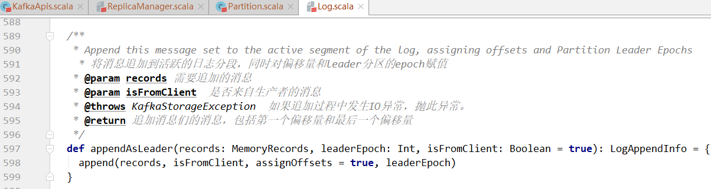

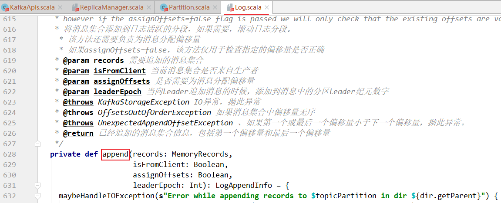


# 7 SocketServer

线程模型：

1. 当前broker上配置了多少个listener，就有多少个Acceptor，用于新建连接
2. 每个Acceptor对应N个线程的处理器（Processor），用于接收客户端请求
3. 每个处理器对应M个线程的处理程序（Handler），处理用户请求，并将响应发送给等待客户写响应的处理器线程。


在启动KafkaServer的startup方法中启动SocketServer：

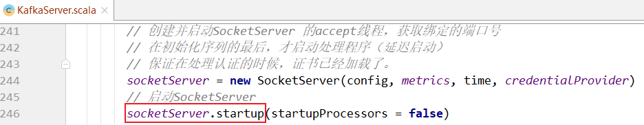

每个listener就是一个端点，每个端点创建多个处理程序。

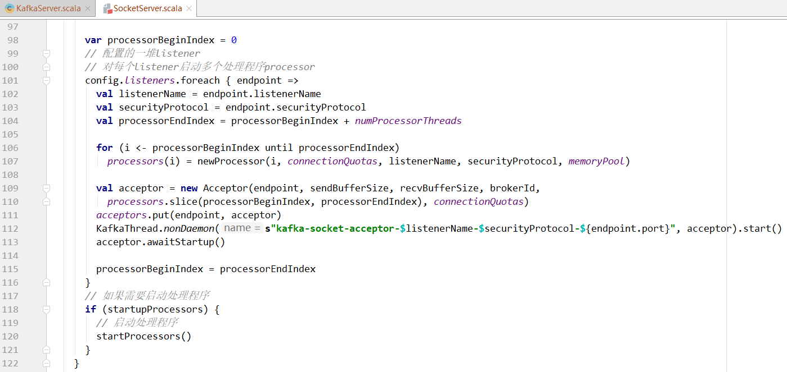

究竟启动多少了处理程序？

processor个数为numProcessorThreads个。上图中for循环为从`processorBeginIndex`到`processorEndIndex`（不包括）。

numProcessorThread为：

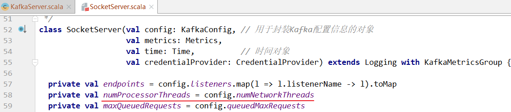

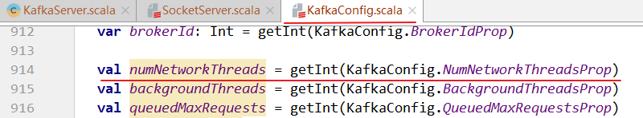

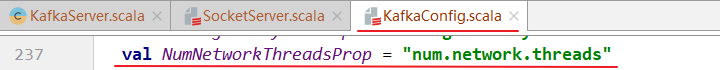

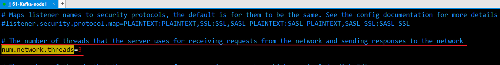


accptor的启动过程：

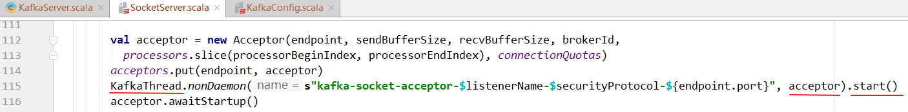

KafkaThread：

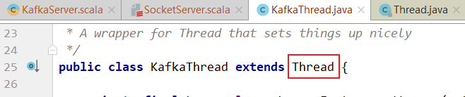

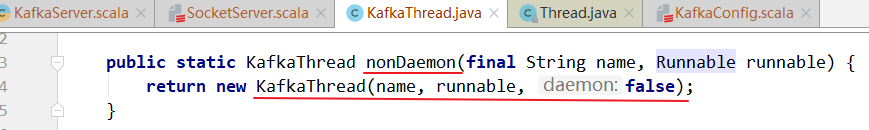

调用Thread的构造器：

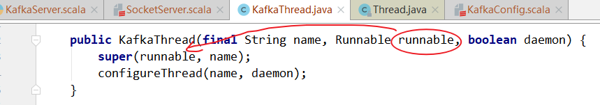

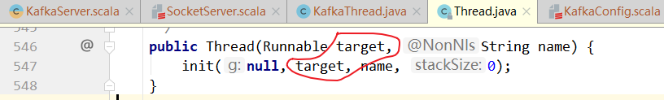

KafkaThread的start方法即是 Thread的start方法，此时调用的是acceptor的run方法：

```scala
/**
   * Accept loop that checks for new connection attempts
    * 使用Java的NIO
    * 循环检查是否有新的连接尝试
    * 轮询的方式将请求交给各个processor来处理
   */
  def run() {
    serverChannel.register(nioSelector, SelectionKey.OP_ACCEPT)
    startupComplete()
    try {
      var currentProcessor = 0
      while (isRunning) {
        try {
          val ready = nioSelector.select(500)
          if (ready > 0) {
            val keys = nioSelector.selectedKeys()
            val iter = keys.iterator()
            while (iter.hasNext && isRunning) {
              try {
                val key = iter.next
                iter.remove()
                if (key.isAcceptable)
                  // 指定一个processor处理请求
                  accept(key, processors(currentProcessor))
                else
                  throw new IllegalStateException("Unrecognized key state for acceptor thread.")

                // round robin to the next processor thread
                // 通过轮询的方式找到下一个processor线程
                currentProcessor = (currentProcessor + 1) % processors.length
              } catch {
                case e: Throwable => error("Error while accepting connection", e)
              }
            }
          }
        }
        catch {
          // We catch all the throwables to prevent the acceptor thread from exiting on exceptions due
          // to a select operation on a specific channel or a bad request. We don't want
          // the broker to stop responding to requests from other clients in these scenarios.
          case e: ControlThrowable => throw e
          case e: Throwable => error("Error occurred", e)
        }
      }
    } finally {
      debug("Closing server socket and selector.")
      swallowError(serverChannel.close())
      swallowError(nioSelector.close())
      shutdownComplete()
    }
  }
```

Acceptor建立建立，处理请求：

```scala
/*
   * Accept a new connection
   * 建立一个连接
   */
  def accept(key: SelectionKey, processor: Processor) {
    // 服务端
    val serverSocketChannel = key.channel().asInstanceOf[ServerSocketChannel]
    // 客户端
    val socketChannel = serverSocketChannel.accept()
    try {
      connectionQuotas.inc(socketChannel.socket().getInetAddress)
      // 非阻塞
      socketChannel.configureBlocking(false)
      socketChannel.socket().setTcpNoDelay(true)
      socketChannel.socket().setKeepAlive(true)
      // 设置发送缓冲大小
      if (sendBufferSize != Selectable.USE_DEFAULT_BUFFER_SIZE)
        socketChannel.socket().setSendBufferSize(sendBufferSize)

      debug("Accepted connection from %s on %s and assigned it to processor %d, sendBufferSize [actual|requested]: [%d|%d] recvBufferSize [actual|requested]: [%d|%d]"
            .format(socketChannel.socket.getRemoteSocketAddress, socketChannel.socket.getLocalSocketAddress, processor.id,
                  socketChannel.socket.getSendBufferSize, sendBufferSize,
                  socketChannel.socket.getReceiveBufferSize, recvBufferSize))
      // 调用Processor的accept方法，由processor处理请求
      processor.accept(socketChannel)
    } catch {
      case e: TooManyConnectionsException =>
        info("Rejected connection from %s, address already has the configured maximum of %d connections.".format(e.ip, e.count))
        close(socketChannel)
    }
  }
```

Processor将连接加入缓冲队列，同时唤醒处理线程：

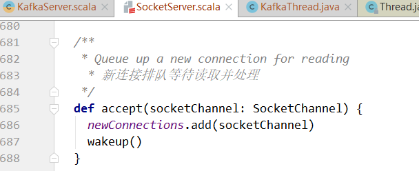

Processor的run方法从newConnections中取出请求的channel，解析封装请求，交给handler处理：

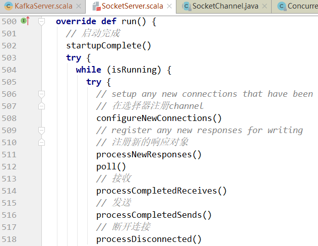

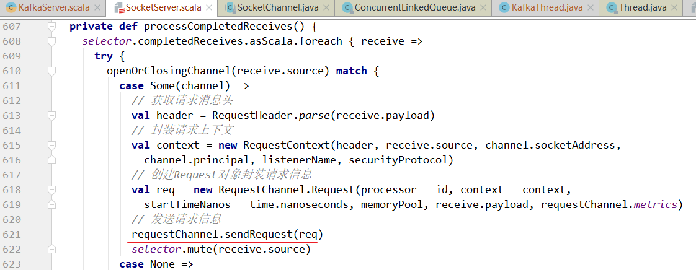

将请求消息放到请求队列中：

在KafkaServer的startup方法中实例化KafkaRequestHandlerPool，该类会立即初始化numIoThreads个线程用于执行KafkaRequestHandler处理请求的逻辑。

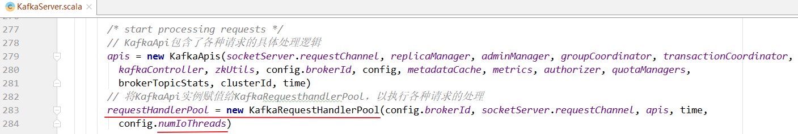

KafkaRequestHandlerPool以多线程的方式启动多个KafkaRequesthandler：

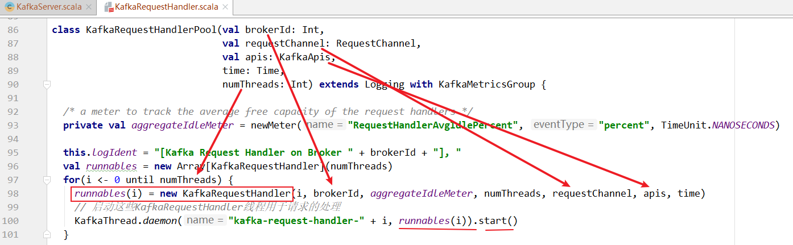

KafkaRequestHandler的run方法中，receiveRequest方法从请求队列获取请求：

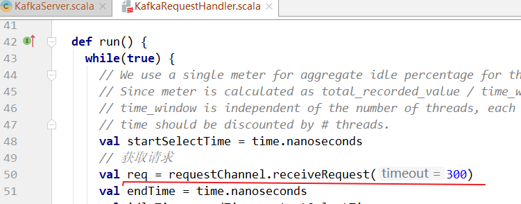

具体实现：

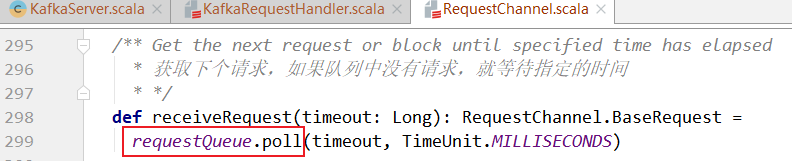

KafkaRequestHandler的run方法中使用模式匹配：

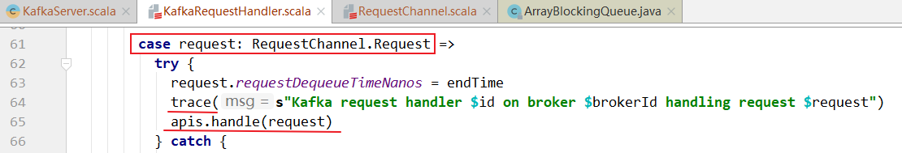

上图中，apis的handler方法处理请求：

```scala
/**
   * Top-level method that handles all requests and multiplexes to the right api
    * 处理所有请求的顶级方法，使用模式匹配，交给具体的api来处理
   */
  def handle(request: RequestChannel.Request) {
    try {
      trace(s"Handling request:${request.requestDesc(true)} from connection ${request.context.connectionId};" +
        s"securityProtocol:${request.context.securityProtocol},principal:${request.context.principal}")
      request.header.apiKey match {
          // 消息生产请求的处理逻辑
        case ApiKeys.PRODUCE => handleProduceRequest(request)
        // 处理
        case ApiKeys.FETCH => handleFetchRequest(request)
        case ApiKeys.LIST_OFFSETS => handleListOffsetRequest(request)
        case ApiKeys.METADATA => handleTopicMetadataRequest(request)
        case ApiKeys.LEADER_AND_ISR => handleLeaderAndIsrRequest(request)
        case ApiKeys.STOP_REPLICA => handleStopReplicaRequest(request)
        case ApiKeys.UPDATE_METADATA => handleUpdateMetadataRequest(request)
        case ApiKeys.CONTROLLED_SHUTDOWN => handleControlledShutdownRequest(request)
        case ApiKeys.OFFSET_COMMIT => handleOffsetCommitRequest(request)
        case ApiKeys.OFFSET_FETCH => handleOffsetFetchRequest(request)
        case ApiKeys.FIND_COORDINATOR => handleFindCoordinatorRequest(request)
        case ApiKeys.JOIN_GROUP => handleJoinGroupRequest(request)
        case ApiKeys.HEARTBEAT => handleHeartbeatRequest(request)
        case ApiKeys.LEAVE_GROUP => handleLeaveGroupRequest(request)
        case ApiKeys.SYNC_GROUP => handleSyncGroupRequest(request)
        case ApiKeys.DESCRIBE_GROUPS => handleDescribeGroupRequest(request)
        case ApiKeys.LIST_GROUPS => handleListGroupsRequest(request)
        case ApiKeys.SASL_HANDSHAKE => handleSaslHandshakeRequest(request)
        case ApiKeys.API_VERSIONS => handleApiVersionsRequest(request)
        case ApiKeys.CREATE_TOPICS => handleCreateTopicsRequest(request)
        case ApiKeys.DELETE_TOPICS => handleDeleteTopicsRequest(request)
        case ApiKeys.DELETE_RECORDS => handleDeleteRecordsRequest(request)
        case ApiKeys.INIT_PRODUCER_ID => handleInitProducerIdRequest(request)
        case ApiKeys.OFFSET_FOR_LEADER_EPOCH => handleOffsetForLeaderEpochRequest(request)
        case ApiKeys.ADD_PARTITIONS_TO_TXN => handleAddPartitionToTxnRequest(request)
        case ApiKeys.ADD_OFFSETS_TO_TXN => handleAddOffsetsToTxnRequest(request)
        case ApiKeys.END_TXN => handleEndTxnRequest(request)
        case ApiKeys.WRITE_TXN_MARKERS => handleWriteTxnMarkersRequest(request)
        case ApiKeys.TXN_OFFSET_COMMIT => handleTxnOffsetCommitRequest(request)
        case ApiKeys.DESCRIBE_ACLS => handleDescribeAcls(request)
        case ApiKeys.CREATE_ACLS => handleCreateAcls(request)
        case ApiKeys.DELETE_ACLS => handleDeleteAcls(request)
        case ApiKeys.ALTER_CONFIGS => handleAlterConfigsRequest(request)
        case ApiKeys.DESCRIBE_CONFIGS => handleDescribeConfigsRequest(request)
        case ApiKeys.ALTER_REPLICA_LOG_DIRS => handleAlterReplicaLogDirsRequest(request)
        case ApiKeys.DESCRIBE_LOG_DIRS => handleDescribeLogDirsRequest(request)
        case ApiKeys.SASL_AUTHENTICATE => handleSaslAuthenticateRequest(request)
        case ApiKeys.CREATE_PARTITIONS => handleCreatePartitionsRequest(request)
      }
    } catch {
      case e: FatalExitError => throw e
      case e: Throwable => handleError(request, e)
    } finally {
      request.apiLocalCompleteTimeNanos = time.nanoseconds
    }
  }
```


# 8 KafkaRequestHandlerPool

KafkaRequestHandlerPool的作用是创建numThreads个KafkaRequestHandler实例，使用numThreads个线程启动KafkaRequestHandler。

每个KafkaRequestHandler包含了id，brokerId，线程数，请求的channel，处理请求的api等信息。

只要该类进行实例化，就执行创建KafkaRequestHandler实例并启动的逻辑。

`kafka.server.KafkaRequestHandlerPool`

```scala
/**
  * @param brokerId
  * @param requestChannel
  * @param apis 处理具体请求和响应的api
  * @param time
  * @param numThreads 运行KafkaRequestHandler的线程数
  */
class KafkaRequestHandlerPool(val brokerId: Int,
                              val requestChannel: RequestChannel,
                              val apis: KafkaApis,
                              time: Time,
                              numThreads: Int) extends Logging with KafkaMetricsGroup {

  /* a meter to track the average free capacity of the request handlers */
  private val aggregateIdleMeter = newMeter("RequestHandlerAvgIdlePercent", "percent", TimeUnit.NANOSECONDS)

  this.logIdent = "[Kafka Request Handler on Broker " + brokerId + "], "
  // 创建包含numThreads个元素的数组
  val runnables = new Array[KafkaRequestHandler](numThreads)
  // 循环numThreads次，初始化KafkaRequestHandler实例numThreads个
  for(i <- 0 until numThreads) {
    // 赋值：每个KafkaRequestHandler中包含了kafkaRequestHandler的id，brokerId，线程数，请求的channel，处理请求的api等。
    runnables(i) = new KafkaRequestHandler(i, brokerId, aggregateIdleMeter, numThreads, requestChannel, apis, time)
    // 启动这些KafkaRequestHandler线程用于请求的处理
    KafkaThread.daemon("kafka-request-handler-" + i, runnables(i)).start()
  }
}  
```

KafkaThread的start方法即是调用Thread的start方法，而start执行run方法，即此处执行的是KafkaThread的run方法：

`kafka.server.KafkaRequestHandler#run`

```
def run() {
    while(true) {
      // We use a single meter for aggregate idle percentage for the thread pool.
      // Since meter is calculated as total_recorded_value / time_window and
      // time_window is independent of the number of threads, each recorded idle
      // time should be discounted by # threads.
      val startSelectTime = time.nanoseconds
      // 获取请求
      val req = requestChannel.receiveRequest(300)
      val endTime = time.nanoseconds
      val idleTime = endTime - startSelectTime
      aggregateIdleMeter.mark(idleTime / totalHandlerThreads)

      req match {
        case RequestChannel.ShutdownRequest =>
          debug(s"Kafka request handler $id on broker $brokerId received shut down command")
          latch.countDown()
          return

        case request: RequestChannel.Request =>
          try {
            request.requestDequeueTimeNanos = endTime
            trace(s"Kafka request handler $id on broker $brokerId handling request $request")
            // 对于其他请求，直接交给apis来负责处理。
            apis.handle(request)
          } catch {
            case e: FatalExitError =>
              latch.countDown()
              Exit.exit(e.statusCode)
            case e: Throwable => error("Exception when handling request", e)
          } finally {
              request.releaseBuffer()
          }

        case null => // continue
      }
    }
  }
```

该类包含了关闭KafkaRequestHandler的方法：

具体的方法：

首先发送停止的请求，等待用户请求处理的结束`latch.await()`。

优雅停机。

将请求直接放到requestQueue中。其中处理ShudownRequest的处理逻辑：

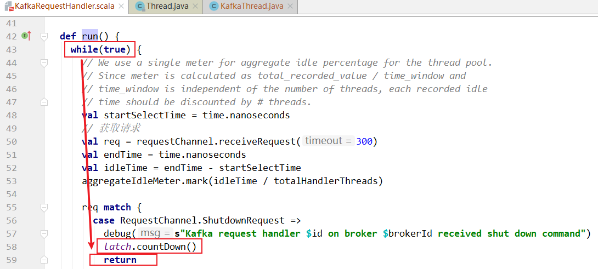

# 9 LogManager

1. Kafka日志管理子系统的入口。日志管理器负责日志的创建、抽取和清理。
2. 所有的读写操作都代理给具体的Log实例。
3. 日志管理器在一个或多个目录维护日志。新的日志创建到拥有最少log的目录中。
4. 分区不移动
5. 通过一个后台线程通过定期截断多余的日志段来处理日志保留


启动Kafka服务器的脚本：

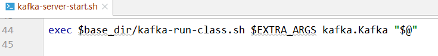

main方法中创建KafkaServerStartable对象：

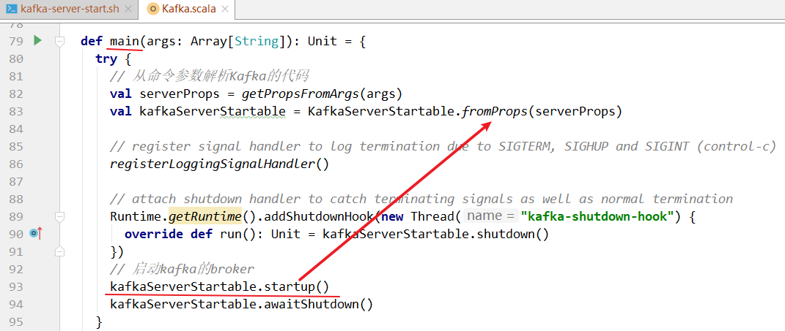

该类中包含KafkaServer对象，startup方法调用的是KafkaServer的startup方法：


KafkaServer的startup方法中，启动了LogManager


LogManager的startup方法：

`kafka.log.LogManager#startup`

```scala
/**
   *  Start the background threads to flush logs and do log cleanup
    *  启动后台线程 用于将日志刷盘以及日志的清理
   */
  def startup() {
    /* Schedule the cleanup task to delete old logs */
    if (scheduler != null) {
      info("Starting log cleanup with a period of %d ms.".format(retentionCheckMs))
      // 用于清除日志片段的调度任务，没有压缩，周期性执行
      scheduler.schedule("kafka-log-retention",
                         cleanupLogs _,
                         delay = InitialTaskDelayMs,
                         period = retentionCheckMs,
                         TimeUnit.MILLISECONDS)
      info("Starting log flusher with a default period of %d ms.".format(flushCheckMs))
      // 用于日志片段刷盘的调度任务，周期性执行
      scheduler.schedule("kafka-log-flusher",
                         flushDirtyLogs _,
                         delay = InitialTaskDelayMs,
                         period = flushCheckMs,
                         TimeUnit.MILLISECONDS)
      // 用于将当前broker上各个分区的恢复点写到文本文件的调度任务，周期性执行
      scheduler.schedule("kafka-recovery-point-checkpoint",
                         checkpointLogRecoveryOffsets _,
                         delay = InitialTaskDelayMs,
                         period = flushRecoveryOffsetCheckpointMs,
                         TimeUnit.MILLISECONDS)
      // 用于将当前broker上各个分区起始偏移量写到文本文件的调度任务，周期性执行
      scheduler.schedule("kafka-log-start-offset-checkpoint",
                         checkpointLogStartOffsets _,
                         delay = InitialTaskDelayMs,
                         period = flushStartOffsetCheckpointMs,
                         TimeUnit.MILLISECONDS)
      scheduler.schedule("kafka-delete-logs",
                         deleteLogs _,
                         delay = InitialTaskDelayMs,
                         period = defaultConfig.fileDeleteDelayMs,
                         TimeUnit.MILLISECONDS)
    }
    // 如果配置了日志的清理，则启动清理任务
    if (cleanerConfig.enableCleaner)
      cleaner.startup()
  }
```

## 9.1 清除日志片段


cleanupLogs 的具体实现：


deleteOldSegments() 的实现：


### 9.1.1 根据时间删除的日志片段数量


首先找到所有可以删除的日志片段

然后执行删除


该方法执行日志片段的异步删除，步骤如下：

1. 将日志片段的信息从map集合移除，之后再也不读了
2. 在日志片段的索引和log文件名称后追加 `.deleted`，加标记而已
3. 调度异步删除操作，执行`.deleted`文件的真正删除。

异步删除允许在读取文件的同时执行删除，而不需要进行同步，避免了在读取一个文件的同时物理删除引起的冲突。


该方法不需要将`IOException`转换为`KafkaStorageException`，因为该方法要么在所有日志加载之前调用，要么在使用中由调用者处理`IOException`。


### 9.1.2 根据保留策略的日志片段文件大小删除


shouldDelete 是一个函数，作为deleteOldSegments删除日志片段的判断条件。


### 9.1.3 根据偏移量删除日志片段

对于当前日志片段是否需要删除，要看它的下一个日志片段的baseOffset是否小于等于日志对外暴露给消费者的日志偏移量，如果小，消费者不用读取，当前日志片段就可以删除。


## 9.2 日志片段刷盘

在LogManager的startup中，启动了刷盘的线程：

调用flushDirtyLogs方法进行日志刷盘处理。


Kafka推荐让操作系统后台进行刷盘，使用副本保证数据高可用，这样效率更高。

因此这种方式不推荐。


执行刷盘的方法：


## 9.3 将当前broker上各个分区的恢复点写到文本文件


方法实现：


方法实现：


## 9.4 将当前broker上各个分区起始偏移量写到文本文件


方法实现：


写文本文件：


## 9.5 删除日志片段


对标记为删除的日志执行删除的动作：


## 9.6 clearner

如果配置了日志清理，则启动清理任务：


cleaners是多个CleanerThread集合：


最终执行清理的是，压缩：


# 10 ReplicaManager

## 10.1 副本管理器的启动和ISR的收缩和扩展

在启动KafkaServer的时候，运行KafkaServer的startup方法。在该方法中实例化ReplicaManager，并调用ReplicaManager的startup方法：

ReplicaManager的startup方法：


处理ISR收缩的情况：


对于在ISR 集合中的副本，检查有没有需要从 ISR 中移除的：

两种情况需要从 ISR 中移除：

1. 卡住的Follower：如果副本的LEO经过maxLagMs毫秒还没有更新，则Follower卡住了，需要从 ISR 移除；
2. 慢 Follower：如果副本从 maxLagMs 毫秒之前到现在还没有读到leader 的 LEO，则Follower落后，需要从 ISR 移除。


处理ISR变动事件广播：

同时startup方法中周期性地调用maybePropagateIsrChanges()方法：

该番薯周期性运行，检查ISR是否需要扩展。两种情况发生 ISR 的广播：

1. 有尚未广播的 ISR 变动
2. 最近 5s 没有发生 ISR 变动，或者上次 ISR 广播已经过去 60s了。

该方法保证在ISR偶尔发生变动时，几秒之内即可将 ISR 变动广播出去。

避免了当发生大量 ISR 变更时压垮 controller和其他broker。


处理日志目录异常的失败：


## 10.2 follower副本如何与leader同步消息

副本管理器类：


副本管理器类在实例化的时候创建ReplicaFetcherManager对象，该对象是负责从leader拉取消息与leader保持同步的线程管理器：


方法的具体实现：

创建负责从leader拉取消息与leader保持同步的线程管理器：


副本拉取管理器中实现了createFetcherThread方法，该方法返回ReplicaFetcherThread对象：


ReplicaFetcherThread线程负责从Leader副本拉取消息进行同步


AbstractFetcherManager中的addFetcherForPartitions方法中的嵌套方法addAndStartFetcherThread创建并启动拉取线程：<br>而其中用到的createFetcherThread方法便是在AbstractFetcherManager的实现类ReplicaFetcherManager中实现的。


抽象类AbstractFetcherThread从同一个远程broker上为当前broker上的多个分区follower副本拉取消息。即，在远程同一个broker上有多个leader副本的follower副本在当前broker上。


ReplicaFetcherThread的start方法实际上就是AbstractFetcherThread中的start方法。

在AbstractFetcherThread中没有start方法，在其父类ShutdownableThread也没有start方法：


但是ShutdownableThread继承自Thread，Thread中没有start方法，并且start方法要调用run方法，在ShutdownableThread中有run方法。


该run方法重复调用doWork方法进行数据的拉取。

doWork方法是抽象方法，没有实现。其是现在ShutdownableThread的实现类AbstractFetcherThread中：


上图中的doWork方法会反复调用，上图中的方法创建拉取请求对象，然后调用processFetchRequest方法进行请求的发送和结果的处理。


fetch方法的实现在AbstractFetcherThread的子类ReplicaFetcherThread中：


sendRequest方法在ReplicaFetcherBlockingSend中：

​	

通过NetworkClientUtils发送请求，并等待请求的响应：


KafkaApis对Fetch的处理：


该方法中，Leader从本地日志读取数据，返回：


总结：

当KafkaServer启动的时候，会实例化副本管理器


副本管理器实例化的时候会实例化副本拉取器管理器：


副本管理器中有实现createFetcherThread方法，创建副本拉取器对象


拉取线程启动起来之后，不断地从leader副本所在的broker拉取消息，以便Follower与Leader保持消息的同步。


# 11 OffsetManager

消费者如何提交偏移量？

- 自动提交
- 手动提交
  - 同步提交
  - 异步提交

客户端提交偏移量，交给KafkaApis的handle方法，handle方法使用模式匹配，调用handleOffsetCommitRequest方法进行处理：


**`handleOffsetCommitRequest`的实现**：


如果apiVersion的值是0，则交给zookeeper保存偏移量信息：


否则调用组协调器负责处理偏移量提交请求：


**`handleCommitOffsets`的实现**：

> 首先根据groupId查找消费组元数据。<br>如果没有找到消费组元数据，则要么该消费组不依赖Kafka进行消费组管理，允许提交；要么提交的偏移量信息是消费组再平衡之前的偏移量，旧请求，拒绝。

正常情况就是最后的分支：

找到了消费组元数据，调用doCommitOffsets处理偏移量提交的请求。


**`doCommitOffsets`的实现**：

该方法判断消费组的状态：

1. 如果是Dead，则响应错误信息
2. 如果消费组还在等待消费者同步，则响应错误信息
3. 如果消费组中没有这个消费者，则响应错误信息
4. 如果请求中的纪元数字和消费组当前纪元数字不符，则响应错误信息
5. 如果仅使用Kafka存储偏移量，而不需要管理，则直接保存偏移量
6. 正常情况下，找到了消费组，消费组中有这个消费者，同时消费组工作正常，则保存偏移量信息


**`storeOffsets`的实现**：


需要先计算当前消费组的偏移量需要提交到 `__consumer_offsets` 主题的哪个分区中：


将消息追加到`__consumer_offsets`主题的指定分区中：


其中**计算 `__consumer_offsets`分区的实现**：


上图中的函数，计算方式如下：

获取消费组ID的散列值，取绝对值，然后将此绝对值 对`__consumer_offsets`主题分区个数取模得到。


**`appendForGroup`方法的实现**：

调用副本管理器的方法将消息追加到 `__consumer_offsets` 主题的指定分区日志中。


如果偏移量消息追加成功，则调用callback响应客户端：


缓存偏移量信息：


`onOffsetCommitAppend`方法具体实现：


responseCallback最终是KafkaApis中的`sendResponseCallback`，该函数将消费者提交的偏移量追加到日志中并添加到消费组缓存中之后，返回结果给消费者客户端。


消费者提交偏移量：KafkaApis，KafkaApis -> GroupCoordinator的handleCommitOffsets 方法 -> GroupMetadataManagerd的storeOffsets方法，不仅需要将消费组的偏移量提交到日志中，还需要在内存中维护该偏移量信息。

对于消费者，获取结果后，也需要在消费者客户端解析该响应，将消费者的偏移量缓存到消费者客户端：<br>消费者客户端消费消息的方法：KafkaCosumer.poll(1_000);<br>调用poll方法拉取消息：该方法调用pollOnce进行消息的拉取：


pollOnce方法会调用org.apache.kafka.clients.consumer.internals.ConsumerCoordinator#poll方法周期性的提交偏移量：


其中poll方法的实现：


poll方法中，最后会判断是否需要自动提交偏移量：


invokeCompletedOffsetCommitCallbacks 方法用于轮询偏移量提交后broker端的响应信息：


onCommitCompleted的实现：


lastCommittedOffsets 为：


KafkaConsumer -> Broker -> KafkaApis-handle -> GroupCoordinator - handleCommitOffsets ->  GroupMetadataManager-storeOffsets -> GroupMetadata-onOffsetCommitAppend -> ReplicaManager -> log   -> KafkaConsumer  -> lastCommittedOffsets 集合。

在Kafka 1.0.2 之前的版本中有一个OffsetManager负责偏移量的处理。

OffsetManager主要提供对offset的保存和读取，kafka管理topic的偏移量有2中方式：

1. zookeeper，即把偏移量提交至zk上；
2. kafka，即把偏移量提交至kafka内部，主要有offsets.storage参数决定。1.0.2 版本中默认是Kafka。也就是说如果配置offsets.storage=kafka，则kafka会把这种offsetcommit请求转变为一种Producer，保存至topic为`__consumer_offsets`的log里面。

```scala
class OffsetManager(val config: OffsetManagerConfig,
                    replicaManager: ReplicaManager, 
                    zkClient: ZkClient,
                    scheduler: Scheduler) extends Logging with KafkaMetricsGroup {
    //通过offsetsCache提供对GroupTopicPartition的查询
    private val offsetsCache = new Pool[GroupTopicPartition, OffsetAndMetadata]
    //把过时的偏移量刷⼊磁盘，因为这些偏移量⻓时间没有被更新，意味着消费者可能不再消费了，也就不需要了， 因此刷⼊到磁盘
    scheduler.schedule(name = "offsets-cache-compactor",
                       fun = compact,
                       period = config.offsetsRetentionCheckIntervalMs, 
                       unit = TimeUnit.MILLISECONDS)
```

主要完成2件事：

1. 提供对topic偏移量的查询
2. 将偏移量消息刷入`__consumer_offsets`主题的log中

# 12 KafkaApis

当启动KafkaServer的时候，在其startup方法中，实例化了KafkaApi，并赋值给KafkaRequestHandlerPool用于执行具体的请求处理逻辑：


`KafkaApi`主构造器参数：


各种请求的处理逻辑入口：


使用模式匹配：

```scala
    // 消息生产请求的处理逻辑
    case ApiKeys.PRODUCE => handleProduceRequest(request)
    // 处理
    case ApiKeys.FETCH => handleFetchRequest(request)
    case ApiKeys.LIST_OFFSETS => handleListOffsetRequest(request)
    case ApiKeys.METADATA => handleTopicMetadataRequest(request)
    case ApiKeys.LEADER_AND_ISR => handleLeaderAndIsrRequest(request)
    case ApiKeys.STOP_REPLICA => handleStopReplicaRequest(request)
    case ApiKeys.UPDATE_METADATA => handleUpdateMetadataRequest(request)
    case ApiKeys.CONTROLLED_SHUTDOWN => handleControlledShutdownRequest(request)
    // 如果是提交偏移量
    case ApiKeys.OFFSET_COMMIT => handleOffsetCommitRequest(request)
    case ApiKeys.OFFSET_FETCH => handleOffsetFetchRequest(request)
    case ApiKeys.FIND_COORDINATOR => handleFindCoordinatorRequest(request)
    case ApiKeys.JOIN_GROUP => handleJoinGroupRequest(request)
    case ApiKeys.HEARTBEAT => handleHeartbeatRequest(request)
    case ApiKeys.LEAVE_GROUP => handleLeaveGroupRequest(request)
    case ApiKeys.SYNC_GROUP => handleSyncGroupRequest(request)
    case ApiKeys.DESCRIBE_GROUPS => handleDescribeGroupRequest(request)
    case ApiKeys.LIST_GROUPS => handleListGroupsRequest(request)
    case ApiKeys.SASL_HANDSHAKE => handleSaslHandshakeRequest(request)
    case ApiKeys.API_VERSIONS => handleApiVersionsRequest(request)
    case ApiKeys.CREATE_TOPICS => handleCreateTopicsRequest(request)
    case ApiKeys.DELETE_TOPICS => handleDeleteTopicsRequest(request)
    case ApiKeys.DELETE_RECORDS => handleDeleteRecordsRequest(request)
    case ApiKeys.INIT_PRODUCER_ID => handleInitProducerIdRequest(request)
    case ApiKeys.OFFSET_FOR_LEADER_EPOCH => handleOffsetForLeaderEpochRequest(request)
    case ApiKeys.ADD_PARTITIONS_TO_TXN => handleAddPartitionToTxnRequest(request)
    case ApiKeys.ADD_OFFSETS_TO_TXN => handleAddOffsetsToTxnRequest(request)
    case ApiKeys.END_TXN => handleEndTxnRequest(request)
    case ApiKeys.WRITE_TXN_MARKERS => handleWriteTxnMarkersRequest(request)
    case ApiKeys.TXN_OFFSET_COMMIT => handleTxnOffsetCommitRequest(request)
    case ApiKeys.DESCRIBE_ACLS => handleDescribeAcls(request)
    case ApiKeys.CREATE_ACLS => handleCreateAcls(request)
    case ApiKeys.DELETE_ACLS => handleDeleteAcls(request)
    case ApiKeys.ALTER_CONFIGS => handleAlterConfigsRequest(request)
    case ApiKeys.DESCRIBE_CONFIGS => handleDescribeConfigsRequest(request)
    case ApiKeys.ALTER_REPLICA_LOG_DIRS => handleAlterReplicaLogDirsRequest(request)
    case ApiKeys.DESCRIBE_LOG_DIRS => handleDescribeLogDirsRequest(request)
    case ApiKeys.SASL_AUTHENTICATE => handleSaslAuthenticateRequest(request)
    case ApiKeys.CREATE_PARTITIONS => handleCreatePartitionsRequest(request)
```


# 13 KafkaController

当前broker被选为新的controller的时候，执行如下操作：

1. 注册controller epoch 事件监听
2. controller epoch + 1
3. 初始化controller上下文对象，该上下文对象缓存当前所有主题、活跃broker以及所有分区leader的信息
4. 启动controller channel manager
5. 启动副本状态机
6. 启动分区状态机

如果注册为controller的过程中发生了异常，重新注册当前broker为controller，如此则触发新一轮controller选举，以保证永远有一个活跃的controller。

启动Kafka服务器的脚本：


main方法中创建KafkaServerStartable对象：


该类中包含KafkaServer对象，startup方法调用的是KafkaServer的startup方法：


KafkaServer中的startup方法调用了kafkaController的startup方法：


KafkaController的startup方法中，将Startup样例类设置到eventManager中，然后调用eventManager的start方法：


上图中的eventManager.put(Startup)方法实现：


上图中的方法将Startup样例类放到queue中：<br>queue的实现：


Startup样例类：<br>其中的process方法执行controller的选举：


上**图中1**的代码表示当session超时的时候处理逻辑，也就是controller到zk连接超时重连，触发该逻辑：


方法的实现：


当Controller到zk的连接过期重连的时候，调用方法：


样例类：Reelect


**Startup样例类中的 2 代码**，表示当controller发生变化的时候的处理逻辑：


方法的实现：


当controller发生变化的时候的处理逻辑（subscribeDataChanges）：


调用：


**Startup样例类中的 3 代码**，表示执行controller的选举：


KafkaController的startup方法中，调用eventManager的start方法：


实现：


thread是ControllerEventThread对象：

> 1. ControllerEventThread的父类是ShutdownableThread，ShutdownableThread的父类是Thread。
>
> 2. ControllerEventThread的start方法调用的是Thread的start方法
> Thread的start方法调用run方法，而run方法实际上是调用，ShutdownableThread的run方法。
>
> 3. run方法调用ControllerEventThread的doWork方法。


ShutdownableThread的实现：


其中的run方法：


只要系统正常运行，就会不断调用doWork方法：


样例类ControllerChange中：


```scala
/**
   * This callback is invoked by the zookeeper leader elector when the current broker resigns as the controller. This is
   * required to clean up internal controller data structures
   */
  def onControllerResignation() {
    debug("Resigning")
    // de-register listeners
    // 取消注册ISR变化通知监听器
    deregisterIsrChangeNotificationListener()
    // 取消注册分区重新分配监听器
    deregisterPartitionReassignmentListener()
    // 取消注册带偏向的副本leader选举监听器
    deregisterPreferredReplicaElectionListener()
    // 取消注册 log.dirs 事件通知监听器
    deregisterLogDirEventNotificationListener()

    // reset topic deletion manager
    // 重置主题删除管理器
    topicDeletionManager.reset()

    // shutdown leader rebalance scheduler
    // 关闭Kafka的leader再平衡调度器
    kafkaScheduler.shutdown()
    offlinePartitionCount = 0
    preferredReplicaImbalanceCount = 0
    globalTopicCount = 0
    globalPartitionCount = 0

    // de-register partition ISR listener for on-going partition reassignment task
    // 取消注册分区再平衡ISR变化监听器
    deregisterPartitionReassignmentIsrChangeListeners()
    // shutdown partition state machine
    // 关闭分区状态机
    partitionStateMachine.shutdown()
    // 取消注册一堆分区修改监听器
    deregisterTopicChangeListener()
    partitionModificationsListeners.keys.foreach(deregisterPartitionModificationsListener)
    // 取消注册主题删除监听器
    deregisterTopicDeletionListener()
    // shutdown replica state machine
    // 关闭副本状态机
    replicaStateMachine.shutdown()
    // 取消注册broker变化监听器
    deregisterBrokerChangeListener()
    // 重置 controller 上下文
    resetControllerContext()
    // 日志：controller辞职不干了
    info("Resigned")
  }
```


# 14 KafkaHealthcheck

健康检查的初始化和启动

在启动KafkaServer的startup方法中，实例化并启动了健康检查：


健康检查的startup方法的执行逻辑：


> **注册状态监听器的具体实现**：


subscribeStateChanges(listener)的具体实现：<br>调用zookeeper客户端的方法，该方法将监听器对象添加到 `_stateListener`这个Set集合中：


zookeeper客户端的回调方法：<br>新建会话事件触发监听器：


如果发生了zk重连，则需要重新在zk中注册当前broker：


会话建立异常，触发监听器：


无法建立到zk的连接：


状态改变，执行监听器方法：


只要状态发生改变，就标记当前事件的发生，用于监控。


> **register方法具体逻辑**

解决端点的主机名端口号，然后调用zkUtil的方法将当前broker的信息注册到zookeeper中：


registerBrokerInZk的具体逻辑：


主要是在zk的/brokers/[0...N] 路径上建立该Broker的信息，并且该节点是ZK中的Ephemeral Node，此时Broker离线的时候，zk上对应的节点也就消失了，那么其他Broker可以即时发现该Broker的异常。

`kafka.server.KafkaHealthcheck`

# 15 DynamicConfigManager

工作流程如下：

配置存储于 /<Kafka_ROOT>/config/entityType/entityName，如/<Kafka_ROOT>/config/topics/<topic_name> 以及 /<Kafka_ROOT>/config/clients/<clientId>

默认配置存储与各自的<default>节点种，上述节点中保存的是覆盖默认配置的数据，以properties的格式。

可以使用分级路径同时指定多个实体的名称，如：/config/users/<user>/clients/<clientId>

设置通知路径 /config/changes，避免对所有主题进行监控，有事通知。DynamicConfigManager监控该路径。


更新配置的第一步是更新配置的properties。

之后，在/config/changes/下创建一个新的序列znode，类似于/config/changes/config_change_12231，该节点保存了实体类型和实体名称。

序列znode包含的数据形式：{"version":1, "entity_type":"topic/client", "entity_name":"topic_name/client_id"}

这只是一个通知，真正的配置数据存储于 /config/entityType/entityName 节点

版本2的通知格式：{"version":2, "entity_path":"entity_type/entity_name"}

可以使用分级路径指定多个实体：如，user/<user>/clinet/<clientId>


该类对所有的broker设置监视器。监视器工作流程如下：

1. 监视器读取所有的配置更改通知。
2. 监视器跟踪它应用过的后缀数字最高的配置更新。
3. 监视器先前处理过的通知，15min之后监视器将其删除。
4. 对于新的更改，监视器读取新的配置，将新的配置和默认配置整合，然后更新现有的配置。

配置永远从zk配置路径读取，通知仅用于触发该动作。

如果一个broker宕机，错过了一个更新，没问题 —— 当broker重启的时候，加载所有的配置。

注意：如果有两个连续的配置更新，可能只有最后一个会处理（因为在broker读取配置信息的时候，可能两个更新都处理过了）。

此时，broker不需要进行两次配置更新，虽然人畜无害。

DynamicConfigManager重启的时候，重新处理所有的通知。可能有点儿浪费资源，但是它避免了丢失配置更新。

但要避免在启动时出现任何竞争情况，因为这些情况可能会丢失**初始配置加载**与**注册更改通知**之间的更改。


KafkaServer启动的时候，在startup方法中，配置动态配置管理，并启动动态配置管理器：


DynamicConfigManager的startup方法的逻辑：<br>在动态配置管理器启动的时候，首先执行一遍配置更新。


**`configChangeListener.init()`方法的具体实现**：


上图中`subscribeChildChanges`订阅子节点个数变化监听器，具体实现：


上图中标红框的是订阅子节点个数变化监听器，只要子节点个数发生变化，就回调listener（即：NodeChangeListener）。


**`NodeChangeListener`的具体实现**：


处理通知的实现：


**`notificationHandler.processNotification(data)`的实现**：

首先 notificationHandler 是哪个？


该类在哪里实例化？


即notificationHandler就是ConfigChangedNotificationHandler类。

`notificationHandler.processNotification(data)`的实现：


如果版本1，则：


如果版本2，则：


具体实现：

`kafka.server.TopicConfigHandler#processConfigChanges`

```scala
def processConfigChanges(topic: String, topicConfig: Properties) {
    // Validate the configurations.
    // 找出要排除的配置条目
    val configNamesToExclude = excludedConfigs(topic, topicConfig)
    // 过滤出当前指定主题的所有分区日志
    val logs = logManager.logsByTopicPartition.filterKeys(_.topic == topic).values.toBuffer
    // 如果日志非空
    if (logs.nonEmpty) {
      /* combine the default properties with the overrides in zk to create the new LogConfig */
      // 整合默认配置和zk中覆盖默认的配置，创建新的Log配置信息
      val props = new Properties()
      // 添加默认配置
      props ++= logManager.defaultConfig.originals.asScala
      // 遍历覆盖默认配置的条目，如果该条目不在要排除的集合中，则直接put到props中
      // 该操作会覆盖默认相同key的配置
      topicConfig.asScala.foreach { case (key, value) =>
        if (!configNamesToExclude.contains(key)) props.put(key, value)
      }
      // 实例化新的logConfig
      val logConfig = LogConfig(props)
      if ((topicConfig.containsKey(LogConfig.RetentionMsProp) 
        || topicConfig.containsKey(LogConfig.MessageTimestampDifferenceMaxMsProp))
        && logConfig.retentionMs < logConfig.messageTimestampDifferenceMaxMs)
        warn(s"${LogConfig.RetentionMsProp} for topic $topic is set to ${logConfig.retentionMs}. It is smaller than " + 
          s"${LogConfig.MessageTimestampDifferenceMaxMsProp}'s value ${logConfig.messageTimestampDifferenceMaxMs}. " +
          s"This may result in frequent log rolling.")
      // 更新当前主题所有分区日志的配置信息
      logs.foreach(_.config = logConfig)
    }

    def updateThrottledList(prop: String, quotaManager: ReplicationQuotaManager) = {
      if (topicConfig.containsKey(prop) && topicConfig.getProperty(prop).length > 0) {
        val partitions = parseThrottledPartitions(topicConfig, kafkaConfig.brokerId, prop)
        quotaManager.markThrottled(topic, partitions)
        logger.debug(s"Setting $prop on broker ${kafkaConfig.brokerId} for topic: $topic and partitions $partitions")
      } else {
        quotaManager.removeThrottle(topic)
        logger.debug(s"Removing $prop from broker ${kafkaConfig.brokerId} for topic $topic")
      }
    }
    updateThrottledList(LogConfig.LeaderReplicationThrottledReplicasProp, quotas.leader)
    updateThrottledList(LogConfig.FollowerReplicationThrottledReplicasProp, quotas.follower)
  }
```

删除过期配置更新通知节点。通知时间对比，过期时间为：15min。


获取指定实体类型中各个实体的配置信息：


getEntityConfigRootPath(entityType) 的具体实现：


其中，主题配置管理器TopicConfigHandler：


```scala
def processConfigChanges(topic: String, topicConfig: Properties) {
    // Validate the configurations.
    // 找出要排除的配置条目
    val configNamesToExclude = excludedConfigs(topic, topicConfig)
    // 过滤出当前指定主题的所有分区日志
    val logs = logManager.logsByTopicPartition.filterKeys(_.topic == topic).values.toBuffer
    // 如果日志非空
    if (logs.nonEmpty) {
      /* combine the default properties with the overrides in zk to create the new LogConfig */
      // 整合默认配置和zk中覆盖默认的配置，创建新的Log配置信息
      val props = new Properties()
      // 添加默认配置
      props ++= logManager.defaultConfig.originals.asScala
      // 遍历覆盖默认配置的条目，如果该条目不在要排除的集合中，则直接put到props中
      // 该操作会覆盖默认相同key的配置
      topicConfig.asScala.foreach { case (key, value) =>
        if (!configNamesToExclude.contains(key)) props.put(key, value)
      }
      // 实例化新的logConfig
      val logConfig = LogConfig(props)
      if ((topicConfig.containsKey(LogConfig.RetentionMsProp) 
        || topicConfig.containsKey(LogConfig.MessageTimestampDifferenceMaxMsProp))
        && logConfig.retentionMs < logConfig.messageTimestampDifferenceMaxMs)
        warn(s"${LogConfig.RetentionMsProp} for topic $topic is set to ${logConfig.retentionMs}. It is smaller than " + 
          s"${LogConfig.MessageTimestampDifferenceMaxMsProp}'s value ${logConfig.messageTimestampDifferenceMaxMs}. " +
          s"This may result in frequent log rolling.")
      // 更新当前主题所有分区日志的配置信息
      logs.foreach(_.config = logConfig)
    }

    def updateThrottledList(prop: String, quotaManager: ReplicationQuotaManager) = {
      if (topicConfig.containsKey(prop) && topicConfig.getProperty(prop).length > 0) {
        val partitions = parseThrottledPartitions(topicConfig, kafkaConfig.brokerId, prop)
        quotaManager.markThrottled(topic, partitions)
        logger.debug(s"Setting $prop on broker ${kafkaConfig.brokerId} for topic: $topic and partitions $partitions")
      } else {
        quotaManager.removeThrottle(topic)
        logger.debug(s"Removing $prop from broker ${kafkaConfig.brokerId} for topic $topic")
      }
    }
    updateThrottledList(LogConfig.LeaderReplicationThrottledReplicasProp, quotas.leader)
    updateThrottledList(LogConfig.FollowerReplicationThrottledReplicasProp, quotas.follower)
  }
```


# 16 分区消费模式

在分区消费模式，需要手动指定消费者要消费的主题和主题的分区信息。

可以设置从分区的哪个偏移量开始消费。

典型的分区消费：

```java
Map<String, Object> configs = new HashMap<>();
configs.put(ConsumerConfig.BOOTSTRAP_SERVERS_CONFIG, "node1:9092");
configs.put(ConsumerConfig.KEY_DESERIALIZER_CLASS_CONFIG, StringDeserializer.class);
configs.put(ConsumerConfig.VALUE_DESERIALIZER_CLASS_CONFIG, StringDeserializer.class);
configs.put(ConsumerConfig.CLIENT_ID_CONFIG, "mycsmr" + System.currentTimeMillis()); 
configs.put(ConsumerConfig.AUTO_OFFSET_RESET_CONFIG, "earliest");

// 设置消费组id
// configs.put(ConsumerConfig.GROUP_ID_CONFIG, "csmr_grp_01");
KafkaConsumer<String, String> consumer = new KafkaConsumer<String, String>(configs);
TopicPartition tp0 = new TopicPartition("tp_demo_01", 0);
TopicPartition tp1 = new TopicPartition("tp_demo_01", 1);
TopicPartition tp2 = new TopicPartition("tp_demo_01", 2);
/*
* 如果不设置消费组ID，则系统不会⾃动给消费者分配主题分区 * 此时需要⼿动指定消费者消费哪些分区数据。
*/
consumer.assign(Arrays.asList(tp0, tp1, tp2));
consumer.seek(tp0, 0);
consumer.seek(tp1, 0);
consumer.seek(tp2, 0);
ConsumerRecords<String, String> records = consumer.poll(1000); 
records.forEach(record -> {
    System.out.println(record.topic() + "\t" 
                       + record.partition() + "\t"
                       + record.offset() + "\t" 
                       + record.key() + "\t" 
                       + record.value());
});
// 最后关闭消费者 
consumer.close();
```


上面代码中的assign方法的实现：


assignFromUser的实现：


调用seek方法指定各个主题分区从哪个偏移量开始消费：


subscriptions的seek方法实现：


上图中seek的实现：


此时poll方法的调用为：


pollOnce方法的实现：

发起请求：


该方法的实现：

创建需要发送的请求对象并发起请求：


client.send方法添加监听器，等待broker端的响应：


监听的逻辑：


上面方法中createFetchRequests用于创建需要发起的请求：


fetchablePartitions方法的实现：


最终，pollOnce方法返回拉取的结果：


# 17 组消费模式

组消费模式指的是在消费者消费消息的时候，使用组协调器的再平衡机制自动分配要消费的分区（们）。

此时需要在消费者的配置中指定消费组ID，同时如果需要，设置偏移量重置的策略。

然后消费者订阅主题，就可以消费消息了。

```java
Map<String, Object> configs = new HashMap<>();
configs.put(ConsumerConfig.BOOTSTRAP_SERVERS_CONFIG, "node1:9092");
configs.put(ConsumerConfig.KEY_DESERIALIZER_CLASS_CONFIG, StringDeserializer.class);
configs.put(ConsumerConfig.VALUE_DESERIALIZER_CLASS_CONFIG, StringDeserializer.class);
configs.put(ConsumerConfig.CLIENT_ID_CONFIG, "mycsmr" + System.currentTimeMillis()); 
configs.put(ConsumerConfig.AUTO_OFFSET_RESET_CONFIG, "earliest");

// 设置消费组id
configs.put(ConsumerConfig.GROUP_ID_CONFIG, "csmr_grp_01");
KafkaConsumer<String, String> consumer = new KafkaConsumer<String, String>(configs); 
consumer.subscribe(Collections.singleton("tp_demo_01"));
ConsumerRecords<String, String> records = consumer.poll(1000); 
records.forEach(record -> {
	System.out.println(record.topic() + "\t" 
		+ record.partition() + "\t"
		+ record.offset() + "\t" 
		+ record.key() + "\t" 
		+ record.value());
});
// 最后关闭消费者 
consumer.close();
```


`consumer.subscribe`方法的实现：


上面方法中第一个参数是订阅的主题集合，第二个参数是一个监听器，当发送再平衡的时候消费者想要执行的操作。默认是NoOpConsumerRebalanceListener，即什么都不做，NoOpConsumerRebalanceListener的实现：


订阅方法的实现：


subscriptions的订阅操作实现：


就是对SubscriptionState的操作：


用户的poll的操作调用pollOnce方法：


pollOnce的实现：


coordinator.poll 负责周期性向broker提交偏移量信息。

上面方法中updateFetchPositions方法表示：如果订阅的主题分区没有偏移量信息，则更新主题分区的偏移量信息，这样就知道消费的时候从那么开始消费了：


上图中的fetcher.resetOffsetsIfNeeded方法的实现：


上图中 259行 resetOffsets 的具体实现：


上述的实现表示：首先根据重置策略重置主题分区的偏移量请求类型，然后发送请求，真正从主题的分区中获取偏移量。


其中上图中的


需要向broker发送请求，获取主题分区的偏移量，更新偏移量的值：


发送请求的实现：


发送的请求是ListOffsetRequest请求：

——

该请求在Broker中的处理：


具体处理：


该方法的实现：


如果是最晚的，直接设置最晚的偏移量，如果不是最晚的，则需要根据主题分区以及时间戳查找：


查找的逻辑：


对于消费者，向指定的broker发送ListOffsetRequest请求，获取指定主题分区的偏移量和时间戳信息：


调用handleListOffsetResponse处理获取的偏移量信息：


complete方法用于完成请求。当complete方法调用之后，success方法返回true。

同时偏移量信息可以通过value方法获取：


即：变量offsetByTimes的值就是下图中future.value()的值。此时各个主题分区的偏移量已经设置好了：


pollOnce方法：


在更新主题分区的偏移量之后，就可以发送请求消费消息了：


对于组消费，还需要定期将偏移量提交到`__consumer_offsets`主题中：


`coordinator.poll`方法的实现：


如果是自动提交消费者偏移量到broker的`__consumer_offsets`主题，则maybeAutoCommitOffsetsAsync的实现：


doAutoCommitOffsetsAsync的实现：


commitOffsetsAsync的实现：


在异步提交消费者偏移量的时候，如果组协调器已知，直接发送<br>如果未知，则异步提交等待，查找组协调器，等找到之后，异步提交消费者偏移量：


上图中sendOffsetCommitRequest的实现：

1. 首先查找消费组协调器
2. 然后创建偏移量提交请求对象
3. 发送请求


在KafkaServer处理的时候：


handleOffsetCommitRequest的实现：


消费组协调器的处理：


doCommitOffsets的实现：


storeOffsets的实现：

其中：


appendForGroup的实现如下，将当前消费组的偏移量消息追加到`__consumer_offsets`的指定分区中：


# 18 同步发送模式

消息同步发送的代码：

所谓同步，就是调用Future的get方法同步等待。


send方法是异步的：


send方法将消息发送给broker，当前线程同步等待broker返回的消息。

send发送消息的实现：


doSend：


该方法首先将消息放到累加器中

判断是否需要发起请求，如果需要，则唤醒sender线程发送消息

该方法的返回值：RecordAppendResult.future：


RecordAppendResultl类：


累加器的append方法将消息追加到累加器，并返回追加到累加器的结果：


其中主要实现：


tryAppend的实现：


上述方法返回值是FutureRecordMetadata，而该类的实现：


上述方法中，await方法等待broker端返回结果。

result实际上是tryAppend方法赋值的produceFuture对象：


produceFuture对象是：


该类中有一个CountDownLatch，future的get方法中的等待实际上就是该CountDownLatch的等待。

最终producer.send方法的返回值就是FutureRecordMetadata对象。

future.get就是在等待该CountDownLatch的countDown的触发：


该方法何时调用？<br>completeFutureAndFireCallbacks方法调用


(Alt+F7 查看元素的使用位置)

completeFutureAndFireCallbacks方法何时调用？


done方法何时调用？


在completeBatch方法的最后，如果batch.done，则释放累加器的空间。

completeBatch 方法何时调用？


`org.apache.kafka.clients.producer.internals.Sender#completeBatch(org.apache.kafka.clients.producer.internals.ProducerBatch, org.apache.kafka.common.requests.ProduceResponse.PartitionResponse, long, long)` 何时调用？


在handleProduceResponse中如果有响应，则解析，并调用completeBatch方法，如果没有响应，表示acks = 0 的情形，不需要解析响应，直接调用completeBatch方法即可。


handleProduceResponse 何时调用？

Sender线程创建回调，回调中调用了handlerProduceResponse方法，创建生产请求对象，该对象中封装了回调对象

发送请求，等待回调的触发。


sendProduceRequest的调用：


sendProducerData的调用：


**总结**：

所谓同步调用，指的是生产者调用`producer.send(record).get()`方法。

该方法首先将要发送的消息发送到消息累加器

判断累加器中的消息批是否达到，或者当前批次没写满，但是加入当前消息会让消息批大于消息批最大值，则创建新的批次。

如果需要发送消息批次，则唤醒sender线程，让sender线程发送消息。

sender线程会返回一个future对象给生产者客户端线程。

若生产者调用该future的get方法，则该方法使用CountDownLatch阻塞，直到收到broker响应，触发CountDownLatch的countDown方法

此时生产者线程的get方法返回，得到发送的结果。

# 19 异步发送模式

异步发送消息

在发送消息的时候设置回调函数：


调用KafkaProducer的send方法，该方法接收要发送的消息批，同时接收回调对象：


doSend的实现：


累加器append的实现：


tryAppend的实现：


tryAppend的实现：


Sender的run方法调用：


sendProducerData的实现：


sendProduceRequests 的实现：


sendProduceRequest 的实现：


上述方法如果得到broker的响应，就回调`handleProduceResponse`方法：


该方法对响应的处理：


completeBatch的实现：


completeBatch 的实现：


batch的done方法：


触发回调函数的执行：


上图中执行用户设置的callback函数的onCompletion方法：


由于上述方法都是在Sender线程中调用，因此回调的onCompletion方法的执行也是异步的，跟用户的producer.send方法不在同一个线程。

回调的异步执行即是生产的异步发送模式。

