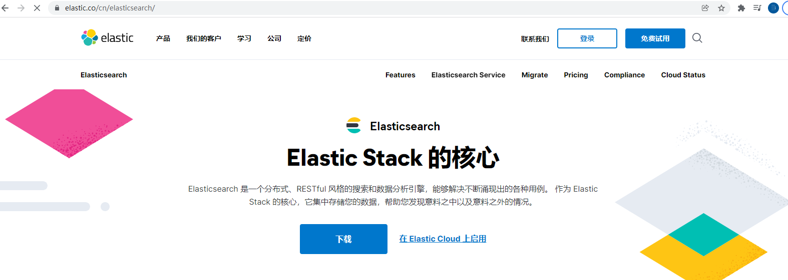
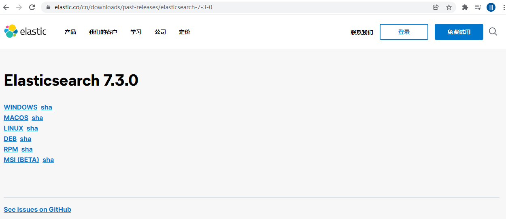

第一部分 全文所有引擎 Elasticsearch基础

# 1 Elasticsearch是什么

Elasticsearch简称ES，是一个开源的可扩展的分布式的**全文搜索引擎**，它可以近乎实时的存储、检索数据。本身扩展性很好，可扩展到上百台服务器，处理**PB**级别的数据。ES使用Java开发并使用Lucene作为核心来实现索引和搜索的功能，但是它通过简单的**RestfulAPI**和**javaAPI**来隐藏Lucene的复杂性，从而让全文搜索变得简单。

Elasticsearch官网：https://www.elastic.co/cn/elasticsearch/



起源：Shay Banon，2004年失业，陪wife去伦敦学习厨师。事业在家帮wife写一个菜谱搜索引擎。封装了lucene，做出了开源项目compass。找到工作后，做分布式高性能项目，再封装compass，写出来elasticsearch，使得lucene支持分布式。现在Elasticsearch创建人，兼Elastic首席执行官。

# 2 Elasticsearch的功能

- 分布式的搜索引擎
- 全文检索
- 数据分析引擎（分组聚合）
- 对海量数据进行实时的处理

# 3 Elasticsearch的特点

> Elasticsearch的特点是它提供了一个极速的搜索体验。这源于它的高速（**speed**）。相比较一些大数据引擎，Elasticsearch可以实现秒级的搜索，速度非常有优势。Elasticsearch的cluster是一种分布式的部署，极易扩展（**scale**）这样很容易使它处理PB级的数据库容量。最重要的是Elasticsearch的搜索结果可以按照分数进行排序，它能提供相关的搜索结果（**relevance**）。

1. 安装方便：没有其他依赖，下载后安装非常方便。只用修改几个参数就可以搭建起来一个集群
2. JSON：输入/输出格式为JSON，意味着不需要定义Schema，快捷方面
3. Restful：基本所有操作（索引、查询、甚至是配置）都可以通过HTTP接口进行
4. 分布式：节点对外表现对等（每个节点都可以用来做入口）加入节点自动负载均衡
5. 多租户：可根据不同的用途分索引，可以同时操作多个索引
6. 支持超大数据：可以扩展到PB级的结构化和非结构化数据，海量数据的近实时处理


# 4 Elasticsearch企业使用场景

## 4.1 常见场景

1. 搜索类场景
2. 日志分析场景
3. 数据预警平台及数据分析场景
4. 商业BI（Business Intelligence）系统

## 4.2 常见案例

- 维基百科、百度百科：有全文检索、高亮、搜索推荐功能
- stack overflow：有全文检索，可以根据报错关键信息，去搜索解决方法
- github：从上千亿行代码中搜索你想要的关键代码和项目
- 日志分析系统：各个企业内部搭建的ELK平台

# 5 主流全文搜索方案对比

Lucene、Solr、Elasticsearch是目前主流的全文搜索方案，基于**倒排索引**机制完成快速全文搜索。


- Lucene

  Lucene是Apache基金会维护的一套完全使用Java编写的信息搜索工具包（Jar包），它包含了索引结构，读写索引工具、相关性工具，排序等功能，因此在使用Lucene时仍需要自己进行一步开发搜索引擎系统，例如数据获取、解析、分词等方面的东西。

  注意：Lucene只是一个框架、我们需要在Java程序中集成它再使用。而且需要很多的学习才能明白它是如何运行的，熟练运用Lucene非常复杂

- Solr

  Solr是一个有HTTP接口的基于Lucene的查询服务器，是一个搜索引擎系统，封装了很多Lucene细节，Solr可以直接利用 HTTP GET/POST 请求去查询，维护修改索引。

- Elasticsearch

  Elasticsearch也是一个建立在全文搜索引擎Apache Lucene基础上的搜索引擎。采用的策略时分布式实时文件存储，并将每一个字段都编入索引，使其可以被搜索。

- 三者之间的区别和联系

  Solr和Elasticsearch都是基于Lucene实现的。但Solr和Elasticsearch之间也是有区别的。

  1. Solr利用zookeeper进行分布式管理，而Elasticsearch自身带有分布式协调管理功能。
  2. Solr比Elasticsearch实现更加全面，Solr官方提供的功能更多，而Elasticsearch本身更注重于核心功能，高级功能多由第三方插件提供。
  3. Solr在传统的搜索应用中表现好于Elasticsearch，而Elasticsearch在实时搜索应用方面比Solr表现好。

  https://db-engines.com/en/ranking

# 6 Elasticsearch的版本

## 6.1 Elasticsearch版本介绍

Elasticsearch 主流版本为 5.x，6.x 及 7.x 版本

> 7.x 更新的内容如下

1. 集群连接变化：TransportClient

   ```
   以至于，es7的java代码，只能使用restclient。对于java编程，建议采用High-level-restclient 的方式操作ES集群。
   High-level RESt client 已删除接收Header参数的API方法，Cluster Health API 默认为集群级别。
   ```

2. ES数据存储结构变化：简化了Type 默认使用_doc

   ```
   es6时，官方就提到了es7会逐渐删除索引type，并且es6时已经规定每一个index只能有一个type。
   在es7中使用默认的_doc作为type，官方说在8.x版本会彻底移除type。
   api请求方式也发生变化，如获得某索引得某ID的文档：GET index/_doc/id其中index和id为具体的值。
   ```

3. ES程序包默认打包jdk：以至于7.x版本的程序包大小突然增大了200MB+，对比6.x发现，包大了200MB+，正是JDK的大小

4. 默认配置变化：默认节点名称为主机名，默认分片数改为1，不再是5。

5. Lucene升级为Lucene 8 查询相关性速度优化：Weak-AND算法

   es可以看作是分布式lucene，lucene的性能直接决定es的性能。lucene 8 在top k及其他查询上有很大的性能提升。

   ```
   weak-and算法 核心原理：取TOP N结果集，估算命中记录数。
   TOP N的时候会跳过得分低于10000的文档来达到更快的性能。
   ```

6. 间隔查询（Intervals queries）：intervals query 允许用户精确控制查询词在文档中出现的先后关系，实现对terms顺序、terms之间的距离以及它们之间的包含关系的灵活控制。

7. 引入新的集群协调子系统 移除 minimum_master_nodes 参数，让Elasticsearch 自己选择可以形成仲裁的节点。

8. 7.0 将不会再有OOM的情况，JVM引入了新的circuit breaker（熔断）机制，当查询或聚合的数据量超出单机处理的最大内存限制时会被截断。

   设置`indices.breaker.fielddata.limit`的默认值已经从JVM堆大小的60%降低到40%。

9. 分片搜索空闲时跳过refresh

   以前版本的数据插入，每一秒都会有refresh动作，这使得es能成为一个近实时的搜索引擎。但是当没有查询需求的时候，该动作会使得es的资源得到较大的浪费。

## 6.2 Elasticsearch与其他软件兼容

[Elasticsearch与操作系统](https://www.elastic.co/cn/support/matrix#matrix_os)

[Elasticsearch and JVM](https://www.elastic.co/cn/support/matrix#matrix_jvm)

# 7 Elasticsearch Single-Node Mode 快速部署

Elasticsearch是一个分布式全文搜索引擎，支持单节点模式（Single-Node Mode）和集群模式（Cluster Mode）部署，一般来说，小公司的业务场景往往使用Single-Node Mode部署即可。


## 7.1 虚拟机环境准备

- 准备一台虚拟机

  - 操作系统：Centos 7.x 64bit

- 关闭虚拟机防火墙

  ```shell
  
  ```

  

## 7.2 Elasticsearch single-Node Mode 部署

在虚拟机上部署Single-Node Mode Elasticsearch

下载Elasticsearch

https://www.elastic.co/cn/downloads/elasticsearch 最新版本

https://www.elastic.co/cn/downloads/past-releases/elasticsearch-7-3-0 版本

选择Linux版本下载：



